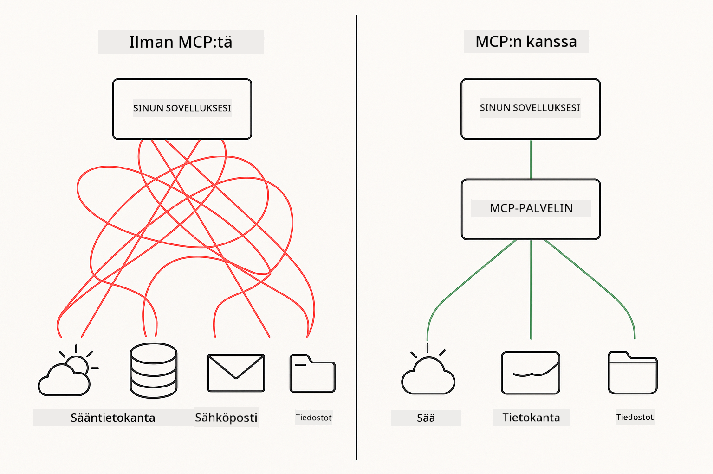
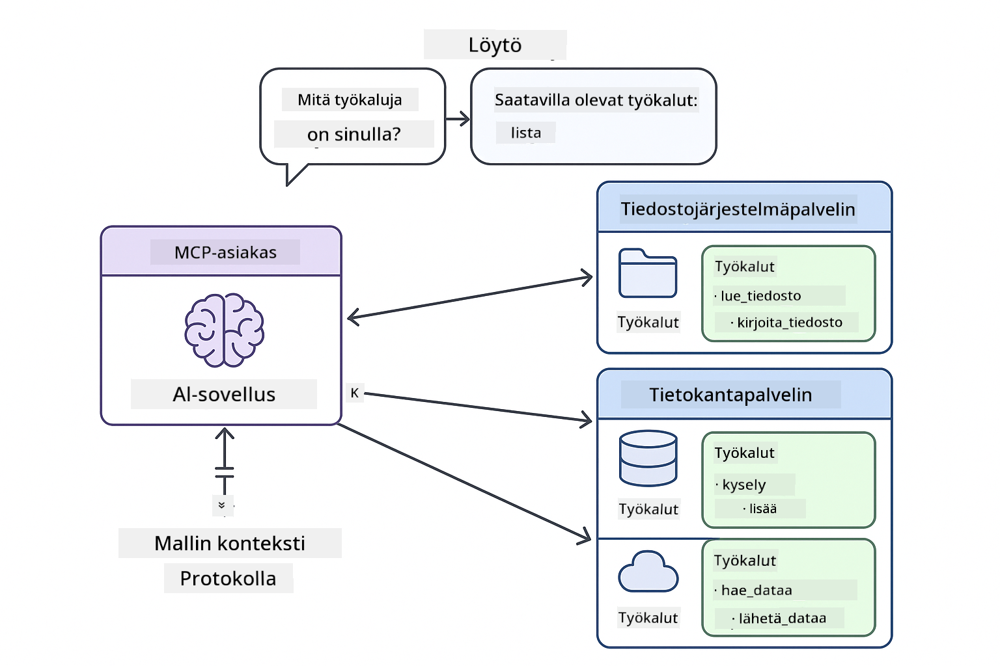
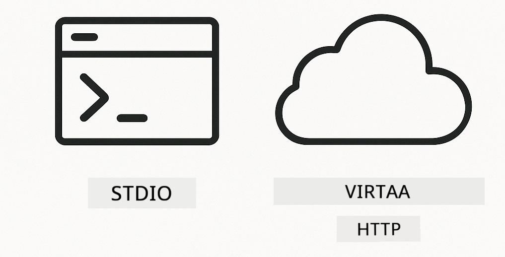
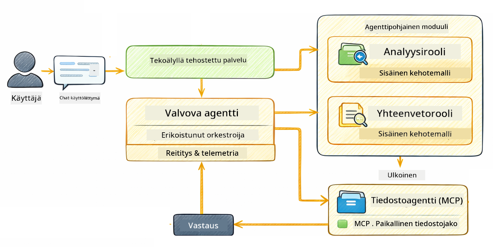

<!--
CO_OP_TRANSLATOR_METADATA:
{
  "original_hash": "f89f4c106d110e4943c055dd1a2f1dff",
  "translation_date": "2025-12-31T01:58:40+00:00",
  "source_file": "05-mcp/README.md",
  "language_code": "fi"
}
-->
# Moduuli 05: Mallin kontekstiprotokolla (MCP)

## Sisällysluettelo

- [Mitä opit](../../../05-mcp)
- [Mikä on MCP?](../../../05-mcp)
- [Miten MCP toimii](../../../05-mcp)
- [Agenttinen moduuli](../../../05-mcp)
- [Esimerkkien ajaminen](../../../05-mcp)
  - [Esivaatimukset](../../../05-mcp)
- [Pikaopas](../../../05-mcp)
  - [Tiedostotoiminnot (Stdio)](../../../05-mcp)
  - [Valvoja-agentti](../../../05-mcp)
    - [Tuloksen ymmärtäminen](../../../05-mcp)
    - [Selitys agenttisesta moduulista](../../../05-mcp)
- [Keskeiset käsitteet](../../../05-mcp)
- [Onnittelut!](../../../05-mcp)
  - [Mitä seuraavaksi?](../../../05-mcp)

## Mitä opit

Olet rakentanut keskustelullisen tekoälyn, hallinnut kehotteita, perustanut vastaukset dokumentteihin ja luonut agentteja työkaluilla. Mutta kaikki nuo työkalut olivat räätälöityjä tiettyä sovellusta varten. Entä jos voisit antaa tekoälyllesi pääsyn vakiomuotoiseen työkalujen ekosysteemiin, jonka kuka tahansa voi luoda ja jakaa? Tässä moduulissa opit tekemään juuri sen Model Context Protocolin (MCP) ja LangChain4j:n agenttisen moduulin avulla. Esittelemme ensin yksinkertaisen MCP-tiedostonlukijan ja näytämme sitten, miten se integroidaan helposti edistyneisiin agenttipohjaisiin työnkulkuihin käyttämällä Valvoja-agentti-mallia.

## Mikä on MCP?

Model Context Protocol (MCP) tarjoaa juuri sen — standardoidun tavan, jolla tekoälysovellukset löytävät ja käyttävät ulkoisia työkaluja. Sen sijaan, että kirjoittaisit räätälöityjä integraatioita jokaista tietolähdettä tai palvelua varten, yhdistät MCP-palvelimiin, jotka paljastavat kykynsä yhtenäisessä muodossa. Tekoälyagenttisi voi sitten löytää ja käyttää näitä työkaluja automaattisesti.



*Ennen MCP:tä: Monimutkaisia pisteestä pisteeseen -integraatioita. MCP:n jälkeen: Yksi protokolla, loputtomia mahdollisuuksia.*

MCP ratkaisee perusongelman tekoälyn kehityksessä: jokainen integraatio on räätälöity. Haluatko käyttää GitHubia? Räätälöity koodi. Haluatko lukea tiedostoja? Räätälöity koodi. Haluatko kysellä tietokantaa? Räätälöity koodi. Eikä mikään näistä integraatioista toimi muiden tekoälysovellusten kanssa.

MCP standardisoi tämän. MCP-palvelin paljastaa työkalut selkeillä kuvauksilla ja skeemoilla. Mikä tahansa MCP-asiakas voi yhdistää, löytää käytettävissä olevat työkalut ja käyttää niitä. Rakenna kerran, käytä kaikkialla.



*Model Context Protocol -arkkitehtuuri — standardoitu työkalujen löytäminen ja suoritus*

## Miten MCP toimii

**Palvelin-asiakas -arkkitehtuuri**

MCP käyttää asiakas-palvelin-mallia. Palvelimet tarjoavat työkaluja — tiedostojen lukemista, tietokantakyselyjä, API-kutsuja. Asiakkaat (sinun tekoälysovelluksesi) yhdistävät palvelimiin ja käyttävät niiden työkaluja.

Käyttääksesi MCP:tä LangChain4j:n kanssa, lisää tämä Maven-riippuvuus:

```xml
<dependency>
    <groupId>dev.langchain4j</groupId>
    <artifactId>langchain4j-mcp</artifactId>
    <version>${langchain4j.version}</version>
</dependency>
```

**Työkalujen löytäminen**

Kun asiakas yhdistää MCP-palvelimeen, se kysyy "Mitä työkaluja teillä on?" Palvelin vastaa listalla saatavilla olevista työkaluista, jokaisella kuvaus ja parametriskeema. Tekoälyagenttisi voi sitten päättää, mitä työkaluja käyttää käyttäjän pyyntöjen perusteella.

**Siirtomekanismit**

MCP tukee eri siirtomekanismeja. Tässä moduulissa demonstroidaan Stdio-siirtoa paikallisprosesseille:



*MCP:n siirtomekanismit: HTTP etäpalvelimille, Stdio paikallisprosesseille*

**Stdio** - [StdioTransportDemo.java](../../../05-mcp/src/main/java/com/example/langchain4j/mcp/StdioTransportDemo.java)

Paikallisprosesseille. Sovelluksesi käynnistää palvelimen aliprosessina ja kommunikoi standard input/output -virtojen kautta. Hyödyllinen tiedostojärjestelmän käyttöön tai komentorivityökaluihin.

```java
McpTransport stdioTransport = new StdioMcpTransport.Builder()
    .command(List.of(
        npmCmd, "exec",
        "@modelcontextprotocol/server-filesystem@2025.12.18",
        resourcesDir
    ))
    .logEvents(false)
    .build();
```

> **🤖 Kokeile [GitHub Copilot](https://github.com/features/copilot) Chatin kanssa:** Avaa [`StdioTransportDemo.java`](../../../05-mcp/src/main/java/com/example/langchain4j/mcp/StdioTransportDemo.java) ja kysy:
> - "Miten Stdio-siirto toimii ja milloin sitä pitäisi käyttää verrattuna HTTP:hen?"
> - "Miten LangChain4j hallitsee käynnistettyjen MCP-palvelinprosessien elinkaaren?"
> - "Mitkä ovat turvallisuusvaikutukset, kun tekoälylle annetaan pääsy tiedostojärjestelmään?"

## Agenttinen moduuli

Vaikka MCP tarjoaa standardoituja työkaluja, LangChain4j:n **agenttinen moduuli** tarjoaa deklaratiivisen tavan rakentaa agentteja, jotka orkestroivat näitä työkaluja. `@Agent`-annotaatio ja `AgenticServices` antavat sinun määritellä agentin käyttäytymisen rajapintojen kautta sen sijaan, että kirjoittaisit imperatiivista koodia.

Tässä moduulissa tutustut **Valvoja-agentti**-malliin — edistyneeseen agenttipohjaiseen tekoälylähestymistapaan, jossa "valvoja" päättää dynaamisesti, mitä al-agentteja kutsutaan käyttäjän pyynnön perusteella. Yhdistämme molemmat käsitteet antamalla yhdelle al-agenteistamme MCP-pohjaiset tiedostojärjestelmäkäyttömahdollisuudet.

Käyttääksesi agenttista moduulia, lisää tämä Maven-riippuvuus:

```xml
<dependency>
    <groupId>dev.langchain4j</groupId>
    <artifactId>langchain4j-agentic</artifactId>
    <version>${langchain4j.mcp.version}</version>
</dependency>
```

> **⚠️ Kokeellinen:** `langchain4j-agentic`-moduuli on **kokeellinen** ja saattaa muuttua. Vakaa tapa rakentaa tekoälyavustajia on edelleen `langchain4j-core` räätälöidyillä työkaluilla (Moduuli 04).

## Esimerkkien ajaminen

### Esivaatimukset

- Java 21+, Maven 3.9+
- Node.js 16+ ja npm (MCP-palvelimia varten)
- Ympäristömuuttujat konfiguroitu `.env`-tiedostoon (projektin juurihakemistosta):
  - **StdioTransportDemo:** `GITHUB_TOKEN` (GitHub Personal Access Token)
  - **SupervisorAgentDemo:** `AZURE_OPENAI_ENDPOINT`, `AZURE_OPENAI_API_KEY`, `AZURE_OPENAI_DEPLOYMENT` (samat kuin Moduuleissa 01-04)

> **Huom:** Jos et ole vielä määrittänyt ympäristömuuttujiasi, katso ohjeet [Module 00 - Quick Start](../00-quick-start/README.md) -sivulta, tai kopioi `.env.example` tiedostoksi `.env` juurihakemistoon ja täytä arvosi.

## Pikaopas

**VS Code -käyttö:** Napsauta hiiren oikealla mitä tahansa demo-tiedostoa Explorerissa ja valitse **"Run Java"**, tai käytä Run and Debug -paneelin käynnistyskonfiguraatioita (varmista, että olet lisännyt tokenisi `.env`-tiedostoon ensin).

**Mavenilla:** Vaihtoehtoisesti voit ajaa esimerkit komentoriviltä alla olevien ohjeiden mukaan.

### Tiedostotoiminnot (Stdio)

Tämä demonstroi paikalliseen aliprosessiin perustuvia työkaluja.

**✅ Ei esivaatimuksia** - MCP-palvelin käynnistetään automaattisesti.

**VS Code -käyttö:** Napsauta hiiren oikealla `StdioTransportDemo.java` ja valitse **"Run Java"**.

**Mavenilla:**

**Bash:**
```bash
export GITHUB_TOKEN=your_token_here
cd 05-mcp
mvn compile exec:java -Dexec.mainClass=com.example.langchain4j.mcp.StdioTransportDemo
```

**PowerShell:**
```powershell
$env:GITHUB_TOKEN=your_token_here
cd 05-mcp
mvn --% compile exec:java -Dexec.mainClass=com.example.langchain4j.mcp.StdioTransportDemo
```

Sovellus käynnistää tiedostojärjestelmä-MCP-palvelimen automaattisesti ja lukee paikallisen tiedoston. Huomaa, miten aliprosessien hallinta hoidetaan puolestasi.

**Odotettu tulos:**
```
Assistant response: The file provides an overview of LangChain4j, an open-source Java library
for integrating Large Language Models (LLMs) into Java applications...
```

### Valvoja-agentti




**Valvoja-agentti-kuvio** on **joustava** muoto agenttisesta tekoälystä. Toisin kuin deterministisissä työnkuluissa (sequentiaalinen, silmukka, rinnakkaisuus), valvoja käyttää LLM:ää itsenäisesti päättämään, mitä agentteja kutsutaan käyttäjän pyynnön perusteella.

**Valvoja yhdistettynä MCP:hen:** Tässä esimerkissä annamme `FileAgent`-agentille pääsyn MCP:n tiedostojärjestmätyökaluihin käyttämällä `toolProvider(mcpToolProvider)`. Kun käyttäjä pyytää "lue ja analysoi tiedosto", Valvoja analysoi pyynnön ja luo suoritussuunnitelman. Se ohjaa pyynnön sitten `FileAgent`-agentille, joka käyttää MCP:n `read_file`-työkalua hakemaan sisällön. Valvoja välittää tuon sisällön `AnalysisAgent`-agentille tulkintaa varten, ja tarvittaessa kutsuu `SummaryAgent`-agenttia tiivistämään tulokset.

Tämä osoittaa, kuinka MCP-työkalut integroituvat sujuvasti agenttisiin työnkulkuihin — Valvojan ei tarvitse tietää *miten* tiedostot luetaan, ainoastaan että `FileAgent` osaa tehdä sen. Valvoja mukautuu dynaamisesti erilaisiin pyyntöihin ja palauttaa joko viimeisen agentin vastauksen tai yhteenvedon kaikista toiminnoista.

**Käynnistysskriptien käyttö (suositeltavaa):**

Käynnistysskriptit lataavat automaattisesti ympäristömuuttujat juurin `.env`-tiedostosta:

**Bash:**
```bash
cd 05-mcp
chmod +x start.sh
./start.sh
```

**PowerShell:**
```powershell
cd 05-mcp
.\start.ps1
```

**VS Code -käyttö:** Napsauta hiiren oikealla `SupervisorAgentDemo.java` ja valitse **"Run Java"** (varmista, että `.env`-tiedostosi on konfiguroitu).

**Miten Valvoja toimii:**

```java
// Määrittele useita agenteja, joilla on erityisiä kykyjä
FileAgent fileAgent = AgenticServices.agentBuilder(FileAgent.class)
        .chatModel(model)
        .toolProvider(mcpToolProvider)  // Sisältää MCP-työkaluja tiedostotoimintoihin
        .build();

AnalysisAgent analysisAgent = AgenticServices.agentBuilder(AnalysisAgent.class)
        .chatModel(model)
        .build();

SummaryAgent summaryAgent = AgenticServices.agentBuilder(SummaryAgent.class)
        .chatModel(model)
        .build();

// Luo Supervisor, joka orkestroi näitä agenteja
SupervisorAgent supervisor = AgenticServices.supervisorBuilder()
        .chatModel(model)  // "planner"-malli
        .subAgents(fileAgent, analysisAgent, summaryAgent)
        .responseStrategy(SupervisorResponseStrategy.SUMMARY)
        .build();

// Supervisor päättää itsenäisesti, mitkä agentit otetaan käyttöön
// Syötä vain luonnollisen kielen pyyntö - LLM suunnittelee toteutuksen
String response = supervisor.invoke("Read the file at /path/file.txt and analyze it");
```

Katso [SupervisorAgentDemo.java](../../../05-mcp/src/main/java/com/example/langchain4j/mcp/SupervisorAgentDemo.java) täydellinen toteutus.

> **🤖 Kokeile [GitHub Copilot](https://github.com/features/copilot) Chatin kanssa:** Avaa [`SupervisorAgentDemo.java`](../../../05-mcp/src/main/java/com/example/langchain4j/mcp/SupervisorAgentDemo.java) ja kysy:
> - "Miten Valvoja päättää, mitä agentteja kutsutaan?"
> - "Mikä on ero Valvoja-mallin ja Sekventiaalisen työnkulun välillä?"
> - "Miten voin mukauttaa Valvojan suunnittelukäyttäytymistä?"

#### Tuloksen ymmärtäminen

Kun ajat demon, näet rakenteellisen läpikäynnin siitä, miten Valvoja orkestroi useita agentteja. Tässä mitä kukin osa tarkoittaa:

```
======================================================================
  SUPERVISOR AGENT DEMO
======================================================================

This demo shows how a Supervisor Agent orchestrates multiple specialized agents.
The Supervisor uses an LLM to decide which agent to call based on the task.
```

**Otsikko** esittelee demon ja selittää ydinkäsitteen: Valvoja käyttää LLM:ää (ei kovakoodattuja sääntöjä) päättääkseen, mitä agentteja kutsutaan.

```
--- AVAILABLE AGENTS -------------------------------------------------
  [FILE]     FileAgent     - Reads files using MCP filesystem tools
  [ANALYZE]  AnalysisAgent - Analyzes content for structure, tone, and themes
  [SUMMARY]  SummaryAgent  - Creates concise summaries of content
```

**Saatavilla olevat agentit** näyttää kolme erikoistunutta agenttia, joista Valvoja voi valita. Jokaisella agentilla on erityinen kyky:
- **FileAgent** voi lukea tiedostoja MCP-työkalujen avulla (ulkoinen kyvykkyys)
- **AnalysisAgent** analysoi sisältöä (puhtaasti LLM-kyvykkyys)
- **SummaryAgent** luo tiivistelmiä (puhtaasti LLM-kyvykkyys)

```
--- USER REQUEST -----------------------------------------------------
  "Read the file at .../file.txt and analyze what it's about"
```

**Käyttäjän pyyntö** näyttää, mitä pyydettiin. Valvojan täytyy jäsentää tämä ja päättää, mitä agentteja kutsutaan.

```
--- SUPERVISOR ORCHESTRATION -----------------------------------------
  The Supervisor will now decide which agents to invoke and in what order...

  +-- STEP 1: Supervisor chose -> FileAgent (reading file via MCP)
  |
  |   Input: .../file.txt
  |
  |   Result: LangChain4j is an open-source Java library designed to simplify...
  +-- [OK] FileAgent (reading file via MCP) completed

  +-- STEP 2: Supervisor chose -> AnalysisAgent (analyzing content)
  |
  |   Input: LangChain4j is an open-source Java library...
  |
  |   Result: Structure: The content is organized into clear paragraphs that int...
  +-- [OK] AnalysisAgent (analyzing content) completed
```

**Valvojan orkestrointi** on se kohta, missä taika tapahtuu. Katso miten:
1. Valvoja **valitsi ensin FileAgentin**, koska pyynnössä mainittiin "lue tiedosto"
2. FileAgent käytti MCP:n `read_file`-työkalua noutaakseen tiedoston sisällön
3. Valvoja sitten **valitsi AnalysisAgentin** ja välitti tiedoston sisällön sille
4. AnalysisAgent analysoi rakennetta, sävyä ja teemoja

Huomaa, että Valvoja teki nämä päätökset **itsenäisesti** käyttäjän pyynnön perusteella — ei kovakoodattua työnkulkua!

**Lopullinen vastaus** on Valvojan yhdistetty vastaus, joka kokoaa yhteen kaikkien kutsuttujen agenttien tuotokset. Esimerkki tulostaa agenttisen skoopin, jossa näkyvät kunkin agentin tallentamat tiivistelmät ja analyysitulokset.

```
--- FINAL RESPONSE ---------------------------------------------------
I read the contents of the file and analyzed its structure, tone, and key themes.
The file introduces LangChain4j as an open-source Java library for integrating
large language models...

--- AGENTIC SCOPE (Shared Memory) ------------------------------------
  Agents store their results in a shared scope for other agents to use:
  * summary: LangChain4j is an open-source Java library...
  * analysis: Structure: The content is organized into clear paragraphs that in...
```

### Selitys agenttisesta moduulista

Esimerkki demonstroi useita agenttisen moduulin edistyneitä ominaisuuksia. Tarkastellaan lähemmin Agenttiskoopin ja Agenttikuuntelijoiden toimintaa.

**Agenttiskooppi** näyttää jaetun muistin, johon agentit tallensivat tuloksensa käyttäen `@Agent(outputKey="...")`. Tämä mahdollistaa:
- Myöhempien agenttien pääsyn aikaisempien agenttien tuotoksiin
- Valvojan yhdistelemään lopullisen vastauksen
- Sinun tarkastella, mitä kukin agentti tuotti

```java
ResultWithAgenticScope<String> result = supervisor.invokeWithAgenticScope(request);
AgenticScope scope = result.agenticScope();
String story = scope.readState("story");
List<AgentInvocation> history = scope.agentInvocations("analysisAgent");
```

**Agenttikuuntelijat** mahdollistavat agentin suorituksen seurannan ja virheenkorjauksen. Demon vaiheittainen tulostus tulee AgentListeneriltä, joka kytkeytyy jokaiseen agentin kutsuun:
- **beforeAgentInvocation** - Kutsutaan, kun Valvoja valitsee agentin, jolloin näet, mikä agentti valittiin ja miksi
- **afterAgentInvocation** - Kutsutaan, kun agentti suorittaa tehtävänsä, näyttää sen tuloksen
- **inheritedBySubagents** - Kun true, kuuntelija seuraa koko agenttipuuta

```java
AgentListener monitor = new AgentListener() {
    private int step = 0;
    
    @Override
    public void beforeAgentInvocation(AgentRequest request) {
        step++;
        System.out.println("  +-- STEP " + step + ": " + request.agentName());
    }
    
    @Override
    public void afterAgentInvocation(AgentResponse response) {
        System.out.println("  +-- [OK] " + response.agentName() + " completed");
    }
    
    @Override
    public boolean inheritedBySubagents() {
        return true; // Levitä kaikille ala-agenteille
    }
};
```

Valvoja-mallin lisäksi `langchain4j-agentic`-moduuli tarjoaa useita tehokkaita työnkulku- ja ominaisuusmalleja:

| Pattern | Description | Use Case |
|---------|-------------|----------|
| **Sekventiaalinen** | Suorita agentit järjestyksessä, tulos virtaa seuraavalle | Putket: tutkimus → analyysi → raportti |
| **Rinnakkainen** | Aja agentit samanaikaisesti | Itsestä riippumattomat tehtävät: sää + uutiset + osakkeet |
| **Silmukka** | Toista kunnes ehto täyttyy | Laadun parantaminen: hienosäädä kunnes piste ≥ 0.8 |
| **Ehdollinen** | Reititä ehtojen perusteella | Luokittelu → ohjaa spesialistille |
| **Ihminen-välissä** | Lisää ihmisen tarkastuspisteitä | Hyväksyntätyönkulut, sisällön tarkastus |

## Keskeiset käsitteet

**MCP** on ihanteellinen, kun haluat hyödyntää olemassa olevia työkaluekosysteemejä, rakentaa työkaluja, joita useat sovellukset voivat jakaa, integroida kolmansien osapuolten palveluja standardiprotokollilla tai vaihtaa työkalujen toteutuksia muuttamatta koodia.

**Agenttinen moduuli** sopii parhaiten, kun haluat deklaratiivisia agenttimääritelmiä `@Agent`-annotaatioilla, tarvitset työnkulun orkestrointia (sekventiaalinen, silmukka, rinnakkainen), suositte rajapintapohjaista agenttisuunnittelua imperatiivisen koodin sijaan, tai yhdistät useita agentteja, jotka jakavat tuotoksia `outputKey`-avaimen kautta.

**Valvoja-agentti-malli** loistaa, kun työnkulkua ei voi ennustaa etukäteen ja haluat LLM:n tekevän päätökset, kun sinulla on useita erikoistuneita agentteja, jotka vaativat dynaamista orkestrointia, kun rakennat keskustelujärjestelmiä, jotka ohjaavat eri kyvykkyyksiin, tai kun haluat joustavimman ja mukautuvimman agenttikäyttäytymisen.

## Onnittelut!

Olet suorittanut LangChain4j for Beginners -kurssin. Olet oppinut:

- Miten rakentaa keskustelullinen tekoäly muistilla (Moduuli 01)
- Kehote- eli prompt-tekniikoita eri tehtäviin (Moduuli 02)
- Miten perustaa vastaukset dokumentteihin RAGin avulla (Moduuli 03)
- Perusagenttien (avustajien) luominen räätälöidyillä työkaluilla (Moduuli 04)
- Standardoitujen työkalujen integroiminen LangChain4j:n MCP- ja Agentic-moduuleihin (Moduuli 05)

### Mitä seuraavaksi?

Moduulien suorittamisen jälkeen tutustu [Testausoppaaseen](../docs/TESTING.md) nähdäksesi LangChain4j:n testauskonsepteja käytännössä.

**Viralliset resurssit:**
- [LangChain4j Documentation](https://docs.langchain4j.dev/) - Laajat oppaat ja API-viite
- [LangChain4j GitHub](https://github.com/langchain4j/langchain4j) - Lähdekoodi ja esimerkit
- [LangChain4j Tutorials](https://docs.langchain4j.dev/tutorials/) - Vaiheittaiset oppaat eri käyttötapauksiin

Kiitos kurssin suorittamisesta!

---

**Navigointi:** [← Edellinen: Moduuli 04 - Työkalut](../04-tools/README.md) | [Takaisin pääsivulle](../README.md)

---

<!-- CO-OP TRANSLATOR DISCLAIMER START -->
Vastuuvapauslauseke:
Tämä asiakirja on käännetty tekoälykäännöspalvelulla (Co-op Translator) https://github.com/Azure/co-op-translator. Vaikka pyrimme tarkkuuteen, otathan huomioon, että automaattiset käännökset voivat sisältää virheitä tai epätarkkuuksia. Alkuperäistä asiakirjaa sen alkuperäiskielellä tulee pitää auktoritatiivisena lähteenä. Kriittisten tietojen osalta suositellaan ammattimaista ihmiskäännöstä. Emme ole vastuussa tämän käännöksen käytöstä johtuvista väärinymmärryksistä tai virheellisistä tulkinnoista.
<!-- CO-OP TRANSLATOR DISCLAIMER END -->