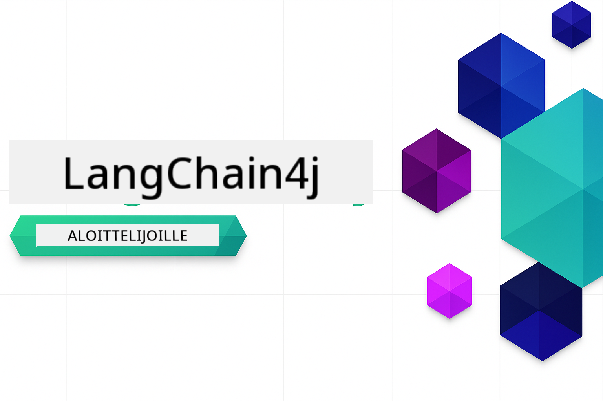

<!--
CO_OP_TRANSLATOR_METADATA:
{
  "original_hash": "69c7e2616c66df6cc296492fbfcad9ec",
  "translation_date": "2025-12-13T12:35:28+00:00",
  "source_file": "README.md",
  "language_code": "fi"
}
-->

# LangChain4j Aloittelijoille

Kurssi tekoälysovellusten rakentamiseen LangChain4j:llä ja Azure OpenAI GPT-5:llä, peruschatista tekoälyagentteihin.

**Uusi LangChain4j:ssä?** Tutustu [Sanastoon](docs/GLOSSARY.md) saadaksesi määritelmiä keskeisille termeille ja käsitteille.

## Sisällysluettelo

1. [Pika-aloitus](00-quick-start/README.md) - Aloita LangChain4j:n kanssa
2. [Johdanto](01-introduction/README.md) - Opi LangChain4j:n perusteet
3. [Promptin suunnittelu](02-prompt-engineering/README.md) - Hallitse tehokas promptin suunnittelu
4. [RAG (Retrieval-Augmented Generation)](03-rag/README.md) - Rakenna älykkäitä tietopohjaisia järjestelmiä
5. [Työkalut](04-tools/README.md) - Integroi ulkoisia työkaluja ja API:ita tekoälyagenttien kanssa
6. [MCP (Model Context Protocol)](05-mcp/README.md) - Työskentele Model Context Protocolin kanssa
---

## Oppimispolku

Aloita [Pika-aloitus](00-quick-start/README.md) -moduulista ja etene moduulista toiseen kehittääksesi taitojasi askel askeleelta. Kokeilet perusesimerkkejä ymmärtääksesi perusteet ennen siirtymistä [Johdanto](01-introduction/README.md) -moduuliin, jossa sukelletaan syvemmälle GPT-5:n kanssa.

Moduulien suorittamisen jälkeen tutustu [Testausoppaaseen](docs/TESTING.md) nähdäksesi LangChain4j:n testauskonsepteja käytännössä.

> **Huom:** Tämä koulutus käyttää sekä GitHub-malleja että Azure OpenAI:ta. [Pika-aloitus](00-quick-start/README.md) ja [MCP](05-mcp/README.md) moduulit käyttävät GitHub-malleja (ei vaadi Azure-tilausta), kun taas moduulit 1-4 käyttävät Azure OpenAI GPT-5:ttä.

## Oppiminen GitHub Copilotin kanssa

Aloittaaksesi koodaamisen nopeasti, avaa tämä projekti GitHub Codespacessa tai paikallisessa IDE:ssä mukana tulevan devcontainerin kanssa. Tässä kurssissa käytetty devcontainer on esikonfiguroitu GitHub Copilotille tekoälypariohjelmointia varten.

Jokainen koodiesimerkki sisältää ehdotettuja kysymyksiä, joita voit esittää GitHub Copilotille syventääksesi ymmärrystäsi. Etsi 💡/🤖 kehotteita:

- **Java-tiedostojen otsikoissa** - Esimerkkiin liittyvät kysymykset
- **Moduulien README-tiedostoissa** - Tutkimuskehotteet koodiesimerkkien jälkeen

**Käyttöohje:** Avaa mikä tahansa kooditiedosto ja esitä Copilotille ehdotetut kysymykset. Se tuntee koko koodikannan ja voi selittää, laajentaa ja ehdottaa vaihtoehtoja.

Haluatko oppia lisää? Tutustu [Copilot tekoälypariohjelmointiin](https://aka.ms/GitHubCopilotAI).

## Lisäresurssit 

### LangChain

---

### Azure / Edge / MCP / Agentit

---
 
### Generatiivinen tekoäly -sarja

[-9333EA?style=for-the-badge&labelColor=E5E7EB&color=9333EA)](https://github.com/microsoft/Generative-AI-for-beginners-dotnet?WT.mc_id=academic-105485-koreyst)
[-C084FC?style=for-the-badge&labelColor=E5E7EB&color=C084FC)](https://github.com/microsoft/generative-ai-for-beginners-java?WT.mc_id=academic-105485-koreyst)
[-E879F9?style=for-the-badge&labelColor=E5E7EB&color=E879F9)](https://github.com/microsoft/generative-ai-with-javascript?WT.mc_id=academic-105485-koreyst)

---
 
### Perusopetus

---
 
### Copilot-sarja

## Apua saamaan

Jos jäät jumiin tai sinulla on kysyttävää tekoälysovellusten rakentamisesta, liity:

Jos sinulla on tuotepalautetta tai kohtaat virheitä rakentamisen aikana, käy:

## Lisenssi

MIT-lisenssi - Katso lisätiedot [LICENSE](../../LICENSE) tiedostosta.

---

<!-- CO-OP TRANSLATOR DISCLAIMER START -->
**Vastuuvapauslauseke**:
Tämä asiakirja on käännetty käyttämällä tekoälypohjaista käännöspalvelua [Co-op Translator](https://github.com/Azure/co-op-translator). Vaikka pyrimme tarkkuuteen, otathan huomioon, että automaattikäännöksissä saattaa esiintyä virheitä tai epätarkkuuksia. Alkuperäistä asiakirjaa sen alkuperäiskielellä tulee pitää virallisena lähteenä. Tärkeissä tiedoissa suositellaan ammattimaista ihmiskäännöstä. Emme ole vastuussa tämän käännöksen käytöstä aiheutuvista väärinymmärryksistä tai tulkinnoista.
<!-- CO-OP TRANSLATOR DISCLAIMER END -->