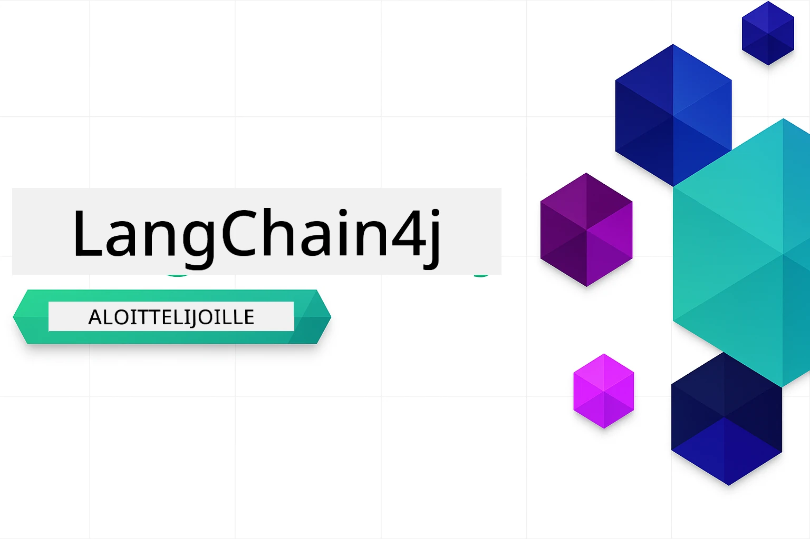

# LangChain4j Aloittelijoille

Kurssi tekoälysovellusten rakentamiseen LangChain4j:llä ja Azure OpenAI GPT-5.2:lla, peruschatista tekoälyagentteihin.

### 🌐 Monikielinen tuki

#### Tuettu GitHub Actionin kautta (Automaattinen ja aina ajan tasalla)

<!-- CO-OP TRANSLATOR LANGUAGES TABLE START -->
[Arabia](../ar/README.md) | [Bengali](../bn/README.md) | [Bulgaria](../bg/README.md) | [Burma (Myanmar)](../my/README.md) | [Kiina (yksinkertaistettu)](../zh-CN/README.md) | [Kiina (perinteinen, Hong Kong)](../zh-HK/README.md) | [Kiina (perinteinen, Macao)](../zh-MO/README.md) | [Kiina (perinteinen, Taiwan)](../zh-TW/README.md) | [Kroatia](../hr/README.md) | [Tšekki](../cs/README.md) | [Tanska](../da/README.md) | [Hollanti](../nl/README.md) | [Viro](../et/README.md) | [Suomi](./README.md) | [Ranska](../fr/README.md) | [Saksa](../de/README.md) | [Kreikka](../el/README.md) | [Heprea](../he/README.md) | [Hindi](../hi/README.md) | [Unkari](../hu/README.md) | [Indonesia](../id/README.md) | [Italia](../it/README.md) | [Japani](../ja/README.md) | [Kannada](../kn/README.md) | [Khmer](../km/README.md) | [Korea](../ko/README.md) | [Liettua](../lt/README.md) | [Malaiji](../ms/README.md) | [Malajalam](../ml/README.md) | [Marathi](../mr/README.md) | [Nepali](../ne/README.md) | [Nigerian Pidgin](../pcm/README.md) | [Norja](../no/README.md) | [Persia (Farsi)](../fa/README.md) | [Puola](../pl/README.md) | [Portugali (Brasilia)](../pt-BR/README.md) | [Portugali (Portugali)](../pt-PT/README.md) | [Punjabi (Gurmukhi)](../pa/README.md) | [Romania](../ro/README.md) | [Venäjä](../ru/README.md) | [Serbia (kyrillinen)](../sr/README.md) | [Slovakki](../sk/README.md) | [Sloveeni](../sl/README.md) | [Espanja](../es/README.md) | [Swahili](../sw/README.md) | [Ruotsi](../sv/README.md) | [Tagalog (Filipino)](../tl/README.md) | [Tamili](../ta/README.md) | [Telugu](../te/README.md) | [Thai](../th/README.md) | [Turkki](../tr/README.md) | [Ukraina](../uk/README.md) | [Urdu](../ur/README.md) | [Vietnam](../vi/README.md)

> **Haluatko mieluummin kloonata paikallisesti?**
>
> Tämä arkisto sisältää yli 50 käännöstä, jotka lisäävät merkittävästi latauskokoa. Jos haluat kloonata ilman käännöksiä, käytä sparse checkout -toimintoa:
>
> **Bash / macOS / Linux:**
> ```bash
> git clone --filter=blob:none --sparse https://github.com/microsoft/LangChain4j-for-Beginners.git
> cd LangChain4j-for-Beginners
> git sparse-checkout set --no-cone '/*' '!translations' '!translated_images'
> ```
>
> **CMD (Windows):**
> ```cmd
> git clone --filter=blob:none --sparse https://github.com/microsoft/LangChain4j-for-Beginners.git
> cd LangChain4j-for-Beginners
> git sparse-checkout set --no-cone "/*" "!translations" "!translated_images"
> ```
>
> Näin saat kaiken tarvitsemasi kurssin suorittamiseen paljon nopeammalla latauksella.
<!-- CO-OP TRANSLATOR LANGUAGES TABLE END -->

## Sisällysluettelo

1. [Johdanto](01-introduction/README.md) - Opi LangChain4j:n perusteet
2. [Prompt-suunnittelu](02-prompt-engineering/README.md) - Hallitse tehokas kehotteen suunnittelu
3. [RAG (Retrieval-Augmented Generation)](03-rag/README.md) - Rakenna älykkäitä tietopohjaisia järjestelmiä
4. [Työkalut](04-tools/README.md) - Integroi ulkoiset työkalut ja yksinkertaiset avustajat
5. [MCP (Model Context Protocol)](05-mcp/README.md) - Työskentele Model Context Protocolin (MCP) ja Agentic-moduulien kanssa

### Videokävelyt läpi

Jokaisella moduulilla on mukana live-istunto, jossa käymme läpi käsitteet ja koodin askel askeleelta.

| Moduuli | Video |
|--------|-------|
| 01 - Johdanto | [LangChain4j:n aloittaminen](https://www.youtube.com/live/nl_troDm8rQ) |
| 02 - Prompt-suunnittelu | [Prompt-suunnittelu LangChain4j:llä](https://www.youtube.com/live/PJ6aBaE6bog) |
| 03 - RAG | [RAG LangChain4j:llä](https://www.youtube.com/watch?v=_olq75ZH_eY) |
| 04 - Työkalut & 05 - MCP | [Tekoälyagentit työkaluilla ja MCP:llä](https://www.youtube.com/watch?v=O_J30kZc0rw) |

---

## Oppimispolku

**Uusi LangChain4j:ssä?** Tutustu [Sanastoon](docs/GLOSSARY.md) avaintermeihin ja käsitteisiin.

> **Pikakäynnistys**

1. Forkkaa tämä arkisto GitHub-tilillesi
2. Klikkaa **Code** → **Codespaces** -välilehti → **...** → **Uusi vaihtoehdoilla...**
3. Käytä oletuksia – tämä valitsee tälle kurssille luodun kehityssäiliön
4. Klikkaa **Luo codespace**
5. Odota 5–10 minuuttia ympäristön valmistumista
6. Siirry suoraan [Johdantoon](./01-introduction/README.md) ja aloita!

Moduulien suorittamisen jälkeen tutustu [Testausoppaaseen](docs/TESTING.md) nähdäksesi LangChain4j:n testauskäsitteet käytännössä.

> **Huom:** Tämä koulutus käyttää Azure OpenAI:a. Aloita ilmaisella [Azure-tilillä](https://aka.ms/azure-free-account), jos sinulla ei vielä ole sellaista.


## Oppiminen GitHub Copilotin kanssa

Pääset nopeasti koodauksen alkuun avaamalla tämän projektin GitHub Codespacessa tai paikallisessa IDE:ssä annetulla devcontainerilla. Tässä kurssissa käytetty devcontainer on valmiiksi konfiguroitu GitHub Copilotille tekoälypariohjelmointia varten.

Jokainen koodiesimerkki sisältää ehdotettuja kysymyksiä, joita voit esittää GitHub Copilotille saadaksesi syvällisempää ymmärrystä. Etsi 💡/🤖 kehotteita:

- **Java-tiedostojen ylätunnisteista** – jokaiselle esimerkkikoodille spesifisiä kysymyksiä
- **Moduulien README:stä** – tutkimuskysymyksiä koodiesimerkkien jälkeen

**Käyttöohje:** Avaa mikä tahansa kooditiedosto ja esitä Copilotille ehdotetut kysymykset. Se näkee koko koodipohjan ja voi selittää, laajentaa sekä ehdottaa vaihtoehtoja.

Haluatko oppia lisää? Tutustu [Copilot tekoälypariohjelmointiin](https://aka.ms/GitHubCopilotAI).


## Lisäresurssit

<!-- CO-OP TRANSLATOR OTHER COURSES START -->
### LangChain
[](https://aka.ms/langchain4j-for-beginners)
[](https://aka.ms/langchainjs-for-beginners?WT.mc_id=m365-94501-dwahlin)
[](https://github.com/microsoft/langchain-for-beginners?WT.mc_id=m365-94501-dwahlin)
---

### Azure / Edge / MCP / Agentit
[](https://github.com/microsoft/AZD-for-beginners?WT.mc_id=academic-105485-koreyst)
[](https://github.com/microsoft/edgeai-for-beginners?WT.mc_id=academic-105485-koreyst)
[](https://github.com/microsoft/mcp-for-beginners?WT.mc_id=academic-105485-koreyst)
[](https://github.com/microsoft/ai-agents-for-beginners?WT.mc_id=academic-105485-koreyst)

---
 
### Generatiivinen tekoäly -sarja
[](https://github.com/microsoft/generative-ai-for-beginners?WT.mc_id=academic-105485-koreyst)
[-9333EA?style=for-the-badge&labelColor=E5E7EB&color=9333EA)](https://github.com/microsoft/Generative-AI-for-beginners-dotnet?WT.mc_id=academic-105485-koreyst)
[-C084FC?style=for-the-badge&labelColor=E5E7EB&color=C084FC)](https://github.com/microsoft/generative-ai-for-beginners-java?WT.mc_id=academic-105485-koreyst)
[-E879F9?style=for-the-badge&labelColor=E5E7EB&color=E879F9)](https://github.com/microsoft/generative-ai-with-javascript?WT.mc_id=academic-105485-koreyst)

---
 
### Keskeinen oppiminen
[](https://aka.ms/ml-beginners?WT.mc_id=academic-105485-koreyst)
[](https://aka.ms/datascience-beginners?WT.mc_id=academic-105485-koreyst)
[](https://aka.ms/ai-beginners?WT.mc_id=academic-105485-koreyst)
[](https://github.com/microsoft/Security-101?WT.mc_id=academic-96948-sayoung)

[](https://aka.ms/webdev-beginners?WT.mc_id=academic-105485-koreyst)
[](https://aka.ms/iot-beginners?WT.mc_id=academic-105485-koreyst)
[](https://github.com/microsoft/xr-development-for-beginners?WT.mc_id=academic-105485-koreyst)

---
 
### Copilot-sarja
[](https://aka.ms/GitHubCopilotAI?WT.mc_id=academic-105485-koreyst)
[](https://github.com/microsoft/mastering-github-copilot-for-dotnet-csharp-developers?WT.mc_id=academic-105485-koreyst)
[](https://github.com/microsoft/CopilotAdventures?WT.mc_id=academic-105485-koreyst)
<!-- CO-OP TRANSLATOR OTHER COURSES END -->

## Apua

Jos jäät jumiin tai sinulla on kysyttävää tekoälysovellusten rakentamisesta, liity:

[](https://aka.ms/foundry/discord)

Jos sinulla on tuotepalautetta tai rakennusvirheitä, käy:

[](https://aka.ms/foundry/forum)

## Lisenssi

MIT-lisenssi - Katso lisätiedot tiedostosta [LICENSE](../../LICENSE).

---

<!-- CO-OP TRANSLATOR DISCLAIMER START -->
**Vastuuvapauslauseke**:
Tämä asiakirja on käännetty käyttämällä tekoälypohjaista käännöspalvelua [Co-op Translator](https://github.com/Azure/co-op-translator). Vaikka pyrimme tarkkuuteen, otathan huomioon, että automaattiset käännökset saattavat sisältää virheitä tai epätarkkuuksia. Alkuperäinen asiakirja sen alkuperäiskielellä on virallinen lähde. Tärkeissä asioissa suositellaan ammattimaista ihmiskäännöstä. Emme ole vastuussa tämän käännöksen käytöstä aiheutuvista väärinymmärryksistä tai tulkinnoista.
<!-- CO-OP TRANSLATOR DISCLAIMER END -->