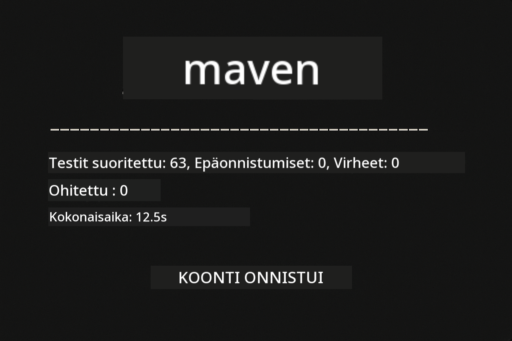
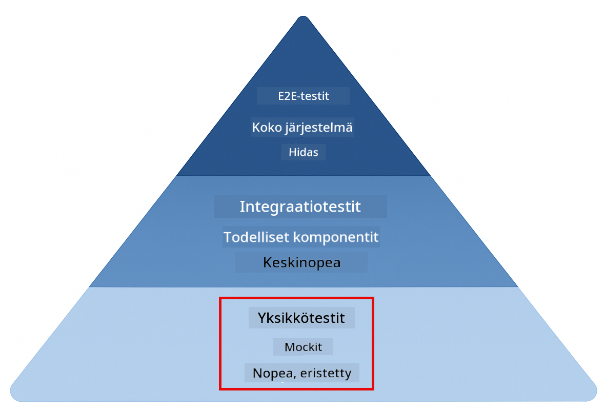
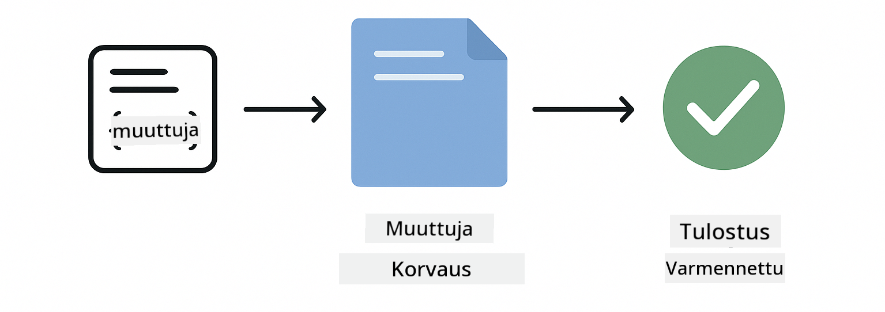
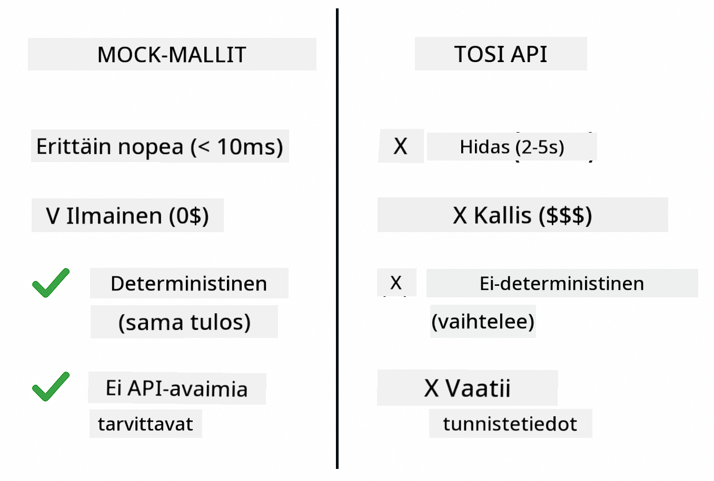
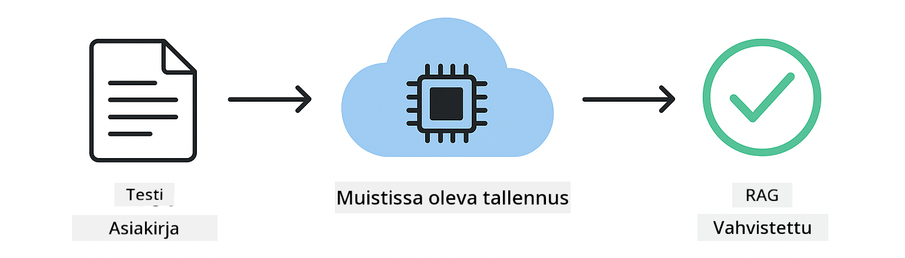

<!--
CO_OP_TRANSLATOR_METADATA:
{
  "original_hash": "b975537560c404d5f254331832811e78",
  "translation_date": "2025-12-13T21:09:25+00:00",
  "source_file": "docs/TESTING.md",
  "language_code": "fi"
}
-->
# LangChain4j-sovellusten testaus

## Sisällysluettelo

- [Pika-aloitus](../../../docs)
- [Mitä testit kattavat](../../../docs)
- [Testien suorittaminen](../../../docs)
- [Testien suorittaminen VS Codessa](../../../docs)
- [Testausmallit](../../../docs)
- [Testausfilosofia](../../../docs)
- [Seuraavat askeleet](../../../docs)

Tämä opas ohjaa sinut testien läpi, jotka osoittavat, miten testata tekoälysovelluksia ilman API-avaimia tai ulkoisia palveluita.

## Pika-aloitus

Suorita kaikki testit yhdellä komennolla:

**Bash:**
```bash
mvn test
```

**PowerShell:**
```powershell
mvn --% test
```



*Onnistunut testin suoritus, jossa kaikki testit läpäisevät ilman virheitä*

## Mitä testit kattavat

Tämä kurssi keskittyy **yksikkötesteihin**, jotka ajetaan paikallisesti. Jokainen testi havainnollistaa tiettyä LangChain4j-konseptia erillään.



*Testauspyramidi näyttää tasapainon yksikkötestien (nopeat, eristetyt), integraatiotestien (todelliset komponentit) ja end-to-end-testien (kokonainen järjestelmä Dockerilla) välillä. Tämä koulutus kattaa yksikkötestauksen.*

| Moduuli | Testit | Painopiste | Keskeiset tiedostot |
|--------|-------|-------|-----------|
| **00 - Pika-aloitus** | 6 | Kehote-mallit ja muuttujien korvaus | `SimpleQuickStartTest.java` |
| **01 - Johdanto** | 8 | Keskustelumuisti ja tilallinen chat | `SimpleConversationTest.java` |
| **02 - Kehoteinsinööritys** | 12 | GPT-5-mallit, innokkuustasot, jäsennelty tulostus | `SimpleGpt5PromptTest.java` |
| **03 - RAG** | 10 | Asiakirjojen syöttö, upotukset, samankaltaisuushaku | `DocumentServiceTest.java` |
| **04 - Työkalut** | 12 | Funktiokutsut ja työkaluketjut | `SimpleToolsTest.java` |
| **05 - MCP** | 15 | Model Context Protocol Dockerilla | `SimpleMcpTest.java`, `McpDockerTransportTest.java` |

## Testien suorittaminen

**Suorita kaikki testit juurihakemistosta:**

**Bash:**
```bash
mvn test
```

**PowerShell:**
```powershell
mvn --% test
```

**Suorita testit tietylle moduulille:**

**Bash:**
```bash
cd 01-introduction && mvn test
# Tai juurihakemistosta
mvn test -pl 01-introduction
```

**PowerShell:**
```powershell
cd 01-introduction; mvn --% test
# Tai juurihakemistosta
mvn --% test -pl 01-introduction
```

**Suorita yksittäinen testiluokka:**

**Bash:**
```bash
mvn test -Dtest=SimpleConversationTest
```

**PowerShell:**
```powershell
mvn --% test -Dtest=SimpleConversationTest
```

**Suorita tietty testimenetelmä:**

**Bash:**
```bash
mvn test -Dtest=SimpleConversationTest#tulisiSäilyttääKeskusteluhistoria
```

**PowerShell:**
```powershell
mvn --% test -Dtest=SimpleConversationTest#tulisiSäilyttääKeskusteluhistoria
```

## Testien suorittaminen VS Codessa

Jos käytät Visual Studio Codea, Test Explorer tarjoaa graafisen käyttöliittymän testien suorittamiseen ja virheenkorjaukseen.


*VS Code Test Explorer näyttää testipuun, jossa kaikki Java-testiluokat ja yksittäiset testimenetelmät*

**Testien suorittaminen VS Codessa:**

1. Avaa Test Explorer napsauttamalla koeputki-kuvaketta Aktiviteettipalkissa
2. Laajenna testipuu nähdäksesi kaikki moduulit ja testiluokat
3. Napsauta toistopainiketta minkä tahansa testin vieressä suorittaaksesi sen erikseen
4. Napsauta "Run All Tests" suorittaaksesi koko testipaketin
5. Napsauta hiiren oikealla mitä tahansa testiä ja valitse "Debug Test" asettaaksesi taukokohtia ja suorittaaksesi koodia askel kerrallaan

Test Explorer näyttää vihreät valintamerkit läpäistyille testeille ja antaa yksityiskohtaiset virheilmoitukset, kun testit epäonnistuvat.

## Testausmallit


*Kuusi testausmallia LangChain4j-sovelluksille: kehotemallit, mallien mokkaus, keskustelun eristäminen, työkalujen testaus, muistissa toimiva RAG ja Docker-integraatio*

### Malli 1: Kehotemallien testaus

Yksinkertaisin malli testaa kehotemalleja ilman, että kutsutaan mitään tekoälymallia. Varmistat, että muuttujien korvaus toimii oikein ja kehotteet ovat odotetun muotoisia.



*Kehotemallien testaus, joka näyttää muuttujien korvausprosessin: malli paikkamerkeillä → arvot sovelletaan → muotoiltu tulos tarkistetaan*

```java
@Test
@DisplayName("Should format prompt template with variables")
void testPromptTemplateFormatting() {
    PromptTemplate template = PromptTemplate.from(
        "Best time to visit {{destination}} for {{activity}}?"
    );
    
    Prompt prompt = template.apply(Map.of(
        "destination", "Paris",
        "activity", "sightseeing"
    ));
    
    assertThat(prompt.text()).isEqualTo("Best time to visit Paris for sightseeing?");
}
```

Tämä testi sijaitsee tiedostossa `00-quick-start/src/test/java/com/example/langchain4j/quickstart/SimpleQuickStartTest.java`.

**Suorita se:**

**Bash:**
```bash
cd 00-quick-start && mvn test -Dtest=SimpleQuickStartTest#testaaKehyksenMuotoilu
```

**PowerShell:**
```powershell
cd 00-quick-start; mvn --% test -Dtest=SimpleQuickStartTest#testaaKehyksenMuotoilu
```

### Malli 2: Kielen mallien mokkaus

Keskustelulogiikkaa testatessa käytä Mockitoa luomaan väärennettyjä malleja, jotka palauttavat ennalta määrättyjä vastauksia. Tämä tekee testeistä nopeita, ilmaisia ja deterministisiä.



*Vertailu, joka osoittaa miksi mokkausta suositaan testauksessa: ne ovat nopeita, ilmaisia, deterministisiä eivätkä vaadi API-avaimia*

```java
@ExtendWith(MockitoExtension.class)
class SimpleConversationTest {
    
    private ConversationService conversationService;
    
    @Mock
    private OpenAiOfficialChatModel mockChatModel;
    
    @BeforeEach
    void setUp() {
        ChatResponse mockResponse = ChatResponse.builder()
            .aiMessage(AiMessage.from("This is a test response"))
            .build();
        when(mockChatModel.chat(anyList())).thenReturn(mockResponse);
        
        conversationService = new ConversationService(mockChatModel);
    }
    
    @Test
    void shouldMaintainConversationHistory() {
        String conversationId = conversationService.startConversation();
        
        ChatResponse mockResponse1 = ChatResponse.builder()
            .aiMessage(AiMessage.from("Response 1"))
            .build();
        ChatResponse mockResponse2 = ChatResponse.builder()
            .aiMessage(AiMessage.from("Response 2"))
            .build();
        ChatResponse mockResponse3 = ChatResponse.builder()
            .aiMessage(AiMessage.from("Response 3"))
            .build();
        
        when(mockChatModel.chat(anyList()))
            .thenReturn(mockResponse1)
            .thenReturn(mockResponse2)
            .thenReturn(mockResponse3);

        conversationService.chat(conversationId, "First message");
        conversationService.chat(conversationId, "Second message");
        conversationService.chat(conversationId, "Third message");

        List<ChatMessage> history = conversationService.getHistory(conversationId);
        assertThat(history).hasSize(6); // 3 käyttäjä- + 3 tekoälyviestiä
    }
}
```

Tämä malli esiintyy tiedostossa `01-introduction/src/test/java/com/example/langchain4j/service/SimpleConversationTest.java`. Mokka varmistaa johdonmukaisen käyttäytymisen, jotta voit varmistaa muistin hallinnan toimivuuden.

### Malli 3: Keskustelun eristäminen

Keskustelumuistin on pidettävä useat käyttäjät erillään. Tämä testi varmistaa, etteivät keskustelut sekoita konteksteja.


*Keskustelun eristämisen testaus, joka näyttää erilliset muistivarastot eri käyttäjille kontekstin sekoittumisen estämiseksi*

```java
@Test
void shouldIsolateConversationsByid() {
    String conv1 = conversationService.startConversation();
    String conv2 = conversationService.startConversation();
    
    ChatResponse mockResponse = ChatResponse.builder()
        .aiMessage(AiMessage.from("Response"))
        .build();
    when(mockChatModel.chat(anyList())).thenReturn(mockResponse);

    conversationService.chat(conv1, "Message for conversation 1");
    conversationService.chat(conv2, "Message for conversation 2");

    List<ChatMessage> history1 = conversationService.getHistory(conv1);
    List<ChatMessage> history2 = conversationService.getHistory(conv2);
    
    assertThat(history1).hasSize(2);
    assertThat(history2).hasSize(2);
}
```

Jokainen keskustelu ylläpitää omaa itsenäistä historiaansa. Tuotantojärjestelmissä tämä eristäminen on kriittistä monikäyttäjäisovelluksissa.

### Malli 4: Työkalujen itsenäinen testaus

Työkalut ovat funktioita, joita tekoäly voi kutsua. Testaa niitä suoraan varmistaaksesi, että ne toimivat oikein riippumatta tekoälyn päätöksistä.


*Työkalujen itsenäinen testaus, joka näyttää mokatun työkalun suorituksen ilman tekoälykutsuja liiketoimintalogiikan varmistamiseksi*

```java
@Test
void shouldConvertCelsiusToFahrenheit() {
    TemperatureTool tempTool = new TemperatureTool();
    String result = tempTool.celsiusToFahrenheit(25.0);
    assertThat(result).containsPattern("77[.,]0°F");
}

@Test
void shouldDemonstrateToolChaining() {
    WeatherTool weatherTool = new WeatherTool();
    TemperatureTool tempTool = new TemperatureTool();

    String weatherResult = weatherTool.getCurrentWeather("Seattle");
    assertThat(weatherResult).containsPattern("\\d+°C");

    String conversionResult = tempTool.celsiusToFahrenheit(22.0);
    assertThat(conversionResult).containsPattern("71[.,]6°F");
}
```

Nämä testit tiedostosta `04-tools/src/test/java/com/example/langchain4j/agents/tools/SimpleToolsTest.java` validoivat työkalulogiiikan ilman tekoälyn osallistumista. Ketjutusesimerkki näyttää, miten yhden työkalun tulos syötetään toisen työkalun syötteeksi.

### Malli 5: Muistissa toimiva RAG-testaus

RAG-järjestelmät vaativat perinteisesti vektoritietokantoja ja upotuspalveluita. Muistissa toimiva malli antaa testata koko putken ilman ulkoisia riippuvuuksia.



*Muistissa toimivan RAG-testauksen työnkulku, joka näyttää asiakirjan jäsentämisen, upotusten tallennuksen ja samankaltaisuushakujen ilman tietokantaa*

```java
@Test
void testProcessTextDocument() {
    String content = "This is a test document.\nIt has multiple lines.";
    InputStream inputStream = new ByteArrayInputStream(content.getBytes(StandardCharsets.UTF_8));
    
    DocumentService.ProcessedDocument result = 
        documentService.processDocument(inputStream, "test.txt");

    assertNotNull(result);
    assertTrue(result.segments().size() > 0);
    assertEquals("test.txt", result.segments().get(0).metadata().getString("filename"));
}
```

Tämä testi tiedostosta `03-rag/src/test/java/com/example/langchain4j/rag/service/DocumentServiceTest.java` luo asiakirjan muistiin ja varmistaa pilkkomisen ja metatietojen käsittelyn.

### Malli 6: Integraatiotestaus Dockerilla

Jotkin ominaisuudet tarvitsevat todellista infrastruktuuria. MCP-moduuli käyttää Testcontainersia Docker-konttien pyörittämiseen integraatiotesteissä. Nämä varmistavat, että koodisi toimii oikeiden palveluiden kanssa samalla kun testien eristäminen säilyy.


*MCP-integraatiotestaus Testcontainersilla, joka näyttää automatisoidun kontin elinkaaren: käynnistys, testin suoritus, pysäytys ja siivous*

Testit tiedostossa `05-mcp/src/test/java/com/example/langchain4j/mcp/McpDockerTransportTest.java` vaativat Dockerin olevan käynnissä.

**Suorita ne:**

**Bash:**
```bash
cd 05-mcp && mvn test
```

**PowerShell:**
```powershell
cd 05-mcp; mvn --% test
```

## Testausfilosofia

Testaa koodiasi, älä tekoälyä. Testiesi tulisi validoida kirjoittamasi koodi tarkistamalla, miten kehotteet rakennetaan, miten muisti hallitaan ja miten työkalut suoritetaan. Tekoälyn vastaukset vaihtelevat eivätkä kuulu testiväittämiin. Kysy itseltäsi, korvaako kehotemallisi muuttujat oikein, ei sitä, antaako tekoäly oikean vastauksen.

Käytä mokkauksia kielimalleille. Ne ovat ulkoisia riippuvuuksia, jotka ovat hitaita, kalliita ja epädeterministisiä. Mokkaus tekee testeistä nopeita (millisekunteja sekuntien sijaan), ilmaisia (ei API-kustannuksia) ja deterministisiä (sama tulos joka kerta).

Pidä testit itsenäisinä. Jokaisen testin tulisi luoda omat tietonsa, olla riippumaton muista testeistä ja siivota jälkensä. Testien tulisi läpäistä riippumatta suoritusjärjestyksestä.

Testaa reunatapauksia onnellisen polun lisäksi. Kokeile tyhjiä syötteitä, hyvin suuria syötteitä, erikoismerkkejä, virheellisiä parametreja ja raja-arvoja. Nämä paljastavat usein bugeja, joita normaali käyttö ei paljasta.

Käytä kuvaavia nimiä. Vertaa `shouldMaintainConversationHistoryAcrossMultipleMessages()` ja `test1()`. Ensimmäinen kertoo tarkalleen, mitä testataan, mikä helpottaa virheiden jäljittämistä.

## Seuraavat askeleet

Nyt kun ymmärrät testausmallit, sukella syvemmälle jokaiseen moduuliin:

- **[00 - Pika-aloitus](../00-quick-start/README.md)** - Aloita kehotemallien perusteista
- **[01 - Johdanto](../01-introduction/README.md)** - Opi keskustelumuistin hallinta
- **[02 - Kehoteinsinööritys](../02-prompt-engineering/README.md)** - Hallitse GPT-5-kehotemallit
- **[03 - RAG](../03-rag/README.md)** - Rakenna hakua täydentäviä generointijärjestelmiä
- **[04 - Työkalut](../04-tools/README.md)** - Toteuta funktiokutsut ja työkaluketjut
- **[05 - MCP](../05-mcp/README.md)** - Integroi Model Context Protocol Dockerin kanssa

Jokaisen moduulin README sisältää yksityiskohtaiset selitykset täällä testatuista konsepteista.

---

**Navigointi:** [← Takaisin pääsivulle](../README.md)

---

<!-- CO-OP TRANSLATOR DISCLAIMER START -->
**Vastuuvapauslauseke**:
Tämä asiakirja on käännetty käyttämällä tekoälypohjaista käännöspalvelua [Co-op Translator](https://github.com/Azure/co-op-translator). Vaikka pyrimme tarkkuuteen, otathan huomioon, että automaattikäännöksissä saattaa esiintyä virheitä tai epätarkkuuksia. Alkuperäinen asiakirja sen alkuperäiskielellä on virallinen lähde. Tärkeissä asioissa suositellaan ammattimaista ihmiskäännöstä. Emme ole vastuussa tämän käännöksen käytöstä aiheutuvista väärinymmärryksistä tai tulkinnoista.
<!-- CO-OP TRANSLATOR DISCLAIMER END -->