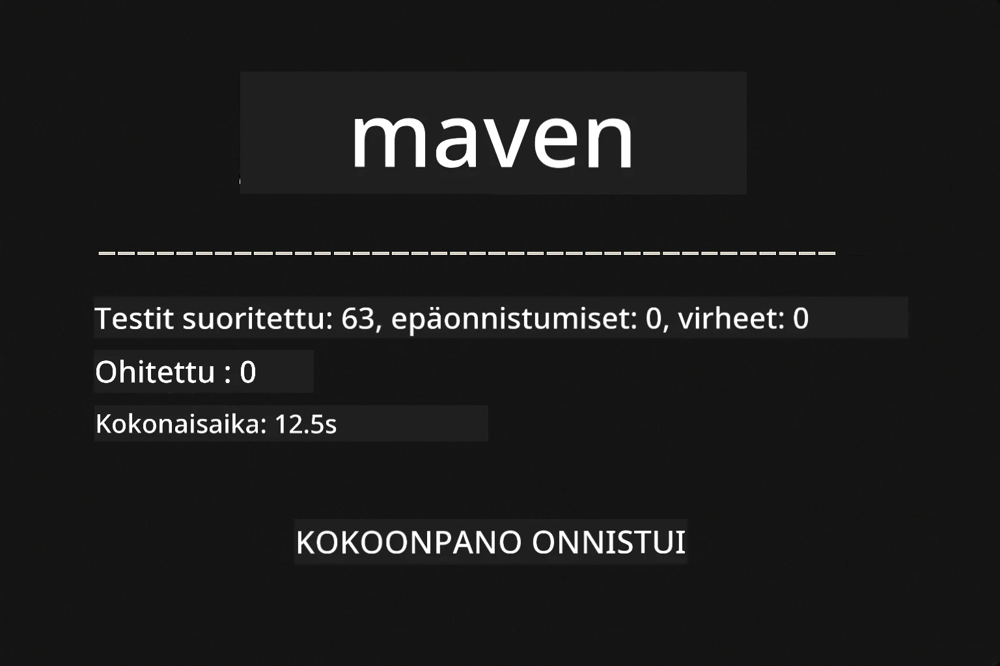
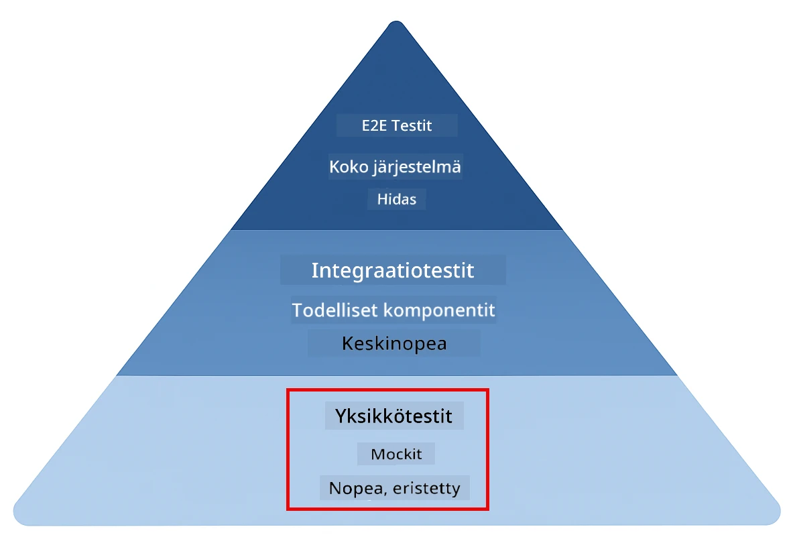
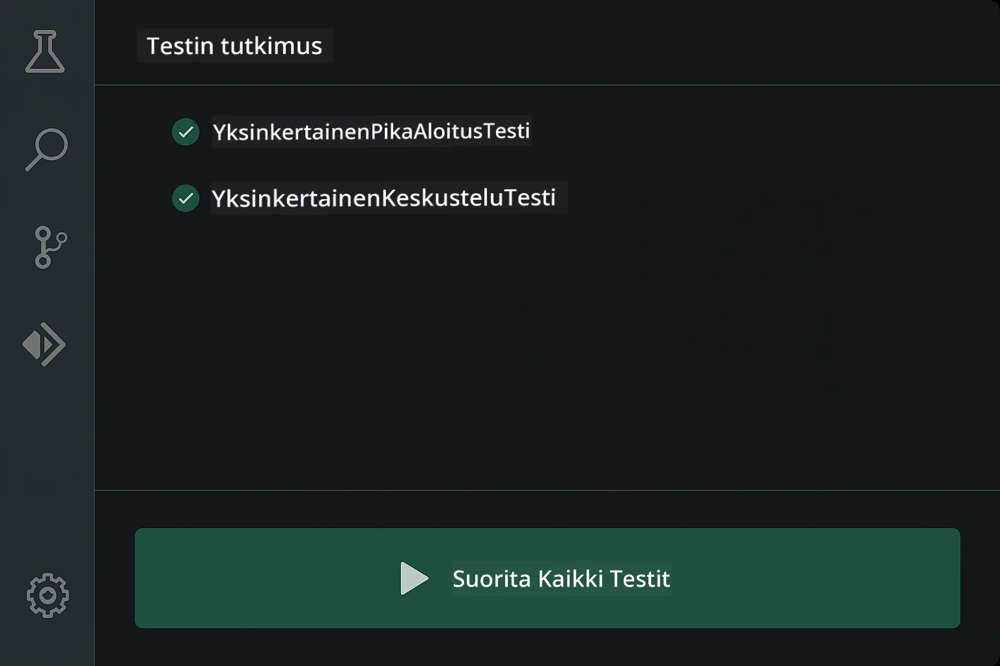
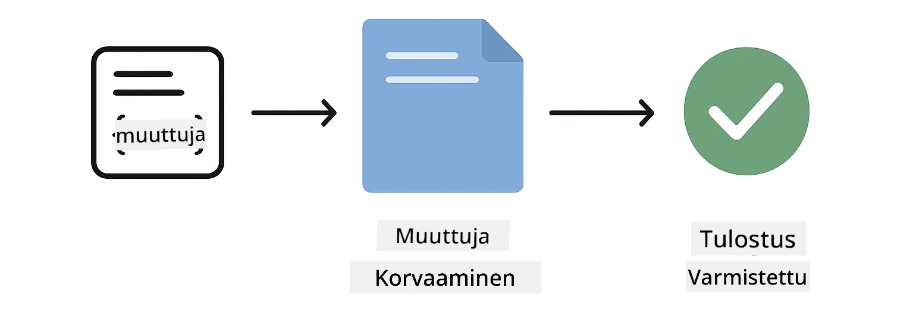
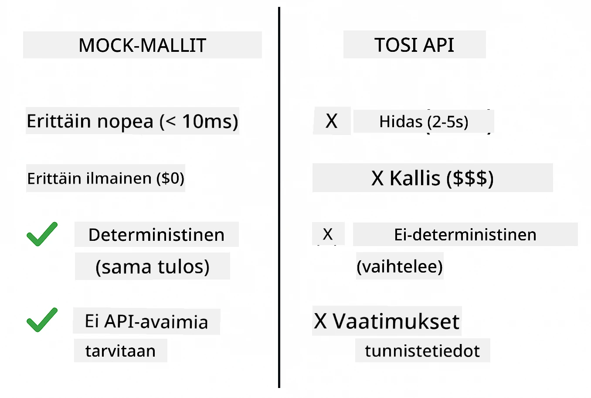
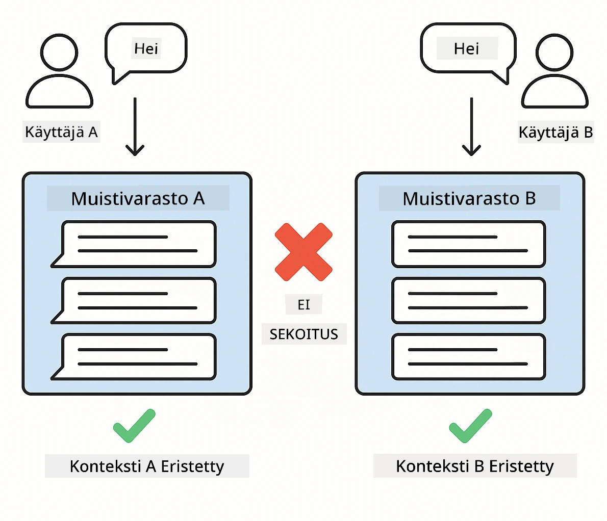
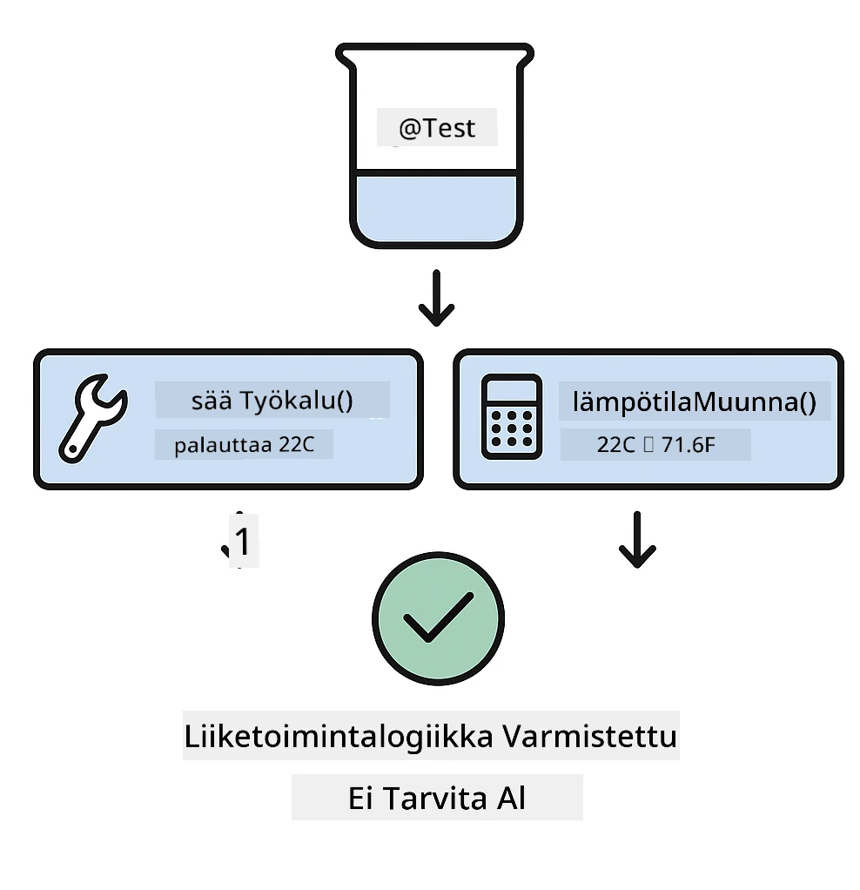
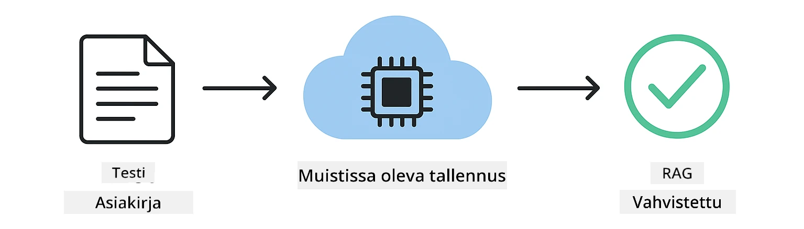

# LangChain4j-sovellusten testaus

## Sisällysluettelo

- [Pika-aloitus](#pika-aloitus)
- [Mitä testit kattavat](#mitä-testit-kattavat)
- [Testien suorittaminen](#testien-suorittaminen)
- [Testien suorittaminen VS Codessa](#testien-suorittaminen-vs-codessa)
- [Testausmallit](#testausmallit)
- [Testausfilosofia](#testausfilosofia)
- [Seuraavat askeleet](#seuraavat-askelket)

Tämä opas ohjaa sinut testien läpi, jotka demonstroivat, kuinka testata tekoälysovelluksia ilman API-avaimia tai ulkoisia palveluita.

## Pika-aloitus

Suorita kaikki testit yhdellä komennolla:

**Bash:**
```bash
mvn test
```

**PowerShell:**
```powershell
mvn --% test
```

Kun kaikki testit läpäisevät, näet alla olevan kaltaisen tulosteen — testit suoritetaan ilman virheitä.



*Onnistuneen testin suoritus näyttää kaikki testit läpäistyinä ilman virheitä*

## Mitä testit kattavat

Tämä kurssi keskittyy **yksikkötesteihin**, jotka suoritetaan paikallisesti. Jokainen testi demonstroi tiettyä LangChain4j-konseptia eristetysti. Alla oleva testauksen pyramidi näyttää, missä yksikkötestit sijoittuvat — ne muodostavat nopean, luotettavan perustan, jolle muu testausstrategiasi rakentuu.



*Testauspyramidi näyttää tasapainon yksikkötestien (nopeat, eristetyt), integraatiotestien (todelliset komponentit) ja päätepisteestä päätepisteeseen tehtävien testien välillä. Tämä koulutus kattaa yksikkötestauksen.*

| Moduuli | Testit | Fokus | Avaintiedostot |
|--------|-------|-------|-----------|
| **01 - Johdanto** | 8 | Keskustelumuisti ja tilalliset chatit | `SimpleConversationTest.java` |
| **02 - Prompt-engineering** | 12 | GPT-5.2-mallit, innokkuustasot, jäsennelty ulostulo | `SimpleGpt5PromptTest.java` |
| **03 - RAG** | 10 | Dokumenttien syöttö, upotukset, samankaltaisuushaku | `DocumentServiceTest.java` |
| **04 - Työkalut** | 12 | Funktiokutsut ja työkaluketjut | `SimpleToolsTest.java` |
| **05 - MCP** | 8 | Mallikontekstiprotokolla stdio-siirrolla | `SimpleMcpTest.java` |

## Testien suorittaminen

**Suorita kaikki testit juuresta:**

**Bash:**
```bash
mvn test
```

**PowerShell:**
```powershell
mvn --% test
```

**Suorita testit tietyssä moduulissa:**

**Bash:**
```bash
cd 01-introduction && mvn test
# Tai juuresta
mvn test -pl 01-introduction
```

**PowerShell:**
```powershell
cd 01-introduction; mvn --% test
# Tai juuresta
mvn --% test -pl 01-introduction
```

**Suorita yksittäinen testiluokka:**

**Bash:**
```bash
mvn test -Dtest=SimpleConversationTest
```

**PowerShell:**
```powershell
mvn --% test -Dtest=SimpleConversationTest
```

**Suorita tietty testimetodi:**

**Bash:**
```bash
mvn test -Dtest=SimpleConversationTest#pitäisi säilyttää keskusteluhistoria
```

**PowerShell:**
```powershell
mvn --% test -Dtest=SimpleConversationTest#tulisi säilyttää keskusteluhistoria
```

## Testien suorittaminen VS Codessa

Jos käytät Visual Studio Codea, Test Explorer tarjoaa graafisen käyttöliittymän testien ajamiseen ja virheiden etsintään.



*VS Code Test Explorer näyttää testipuuhun kaikki Java-testiluokat ja yksittäiset testimetodit*

**Testien suorittaminen VS Codessa:**

1. Avaa Test Explorer klikkaamalla lasipulloikonia Activity Barissa
2. Laajenna testipuuta nähdäksesi kaikki moduulit ja testiluokat
3. Klikkaa yksittäisen testin vieressä olevaa toistopainiketta ajaaksesi sen erikseen
4. Klikkaa "Run All Tests" suorittaaksesi kaikki testit
5. Klikkaa hiiren oikealla testin päällä ja valitse "Debug Test" asettaaksesi breakpointteja ja seurataksesi koodia askel askeleelta

Test Explorer näyttää vihreät tägit läpäistyille testeille ja tarjoaa yksityiskohtaiset virheilmoitukset, kun testit epäonnistuvat.

## Testausmallit

### Malli 1: Prompt-mallien testaus

Yksinkertaisin malli testaa prompt-malleja ilman, että kutsutaan mitään tekoälymallia. Varmistat, että muuttujien korvaus toimii oikein ja promptit muotoillaan odotetusti.



*Prompt-mallien testaus, joka näyttää muuttujien korvausprosessin: malli paikkamerkkeineen → arvot sovelletaan → muotoiltu ulostulo tarkistetaan*

```java
@Test
@DisplayName("Should format prompt template with variables")
void testPromptTemplateFormatting() {
    PromptTemplate template = PromptTemplate.from(
        "Best time to visit {{destination}} for {{activity}}?"
    );
    
    Prompt prompt = template.apply(Map.of(
        "destination", "Paris",
        "activity", "sightseeing"
    ));
    
    assertThat(prompt.text()).isEqualTo("Best time to visit Paris for sightseeing?");
}
```

Tämä malli varmistaa, että muuttujien korvaus toimii oikein ja promptit muotoillaan odotetusti — ei tarvita API-avaimia tai mallikutsuja.

### Malli 2: Kielimallien peukalointi (Mocking)

Kun testaat keskustelulogiikkaa, käytä Mockitoa luodaksesi väärennettyjä malleja, jotka palauttavat ennaltamäärättyjä vastauksia. Tämä tekee testeistä nopeita, ilmaisia ja määrämuotoisia.



*Vertailu, joka näyttää miksi mokkaukset ovat testauksessa parempia: ne ovat nopeita, ilmaisia, määrämukaisia ja eivät vaadi API-avaimia*

```java
@ExtendWith(MockitoExtension.class)
class SimpleConversationTest {
    
    private ConversationService conversationService;
    
    @Mock
    private OpenAiOfficialChatModel mockChatModel;
    
    @BeforeEach
    void setUp() {
        ChatResponse mockResponse = ChatResponse.builder()
            .aiMessage(AiMessage.from("This is a test response"))
            .build();
        when(mockChatModel.chat(anyList())).thenReturn(mockResponse);
        
        conversationService = new ConversationService(mockChatModel);
    }
    
    @Test
    void shouldMaintainConversationHistory() {
        String conversationId = conversationService.startConversation();
        
        ChatResponse mockResponse1 = ChatResponse.builder()
            .aiMessage(AiMessage.from("Response 1"))
            .build();
        ChatResponse mockResponse2 = ChatResponse.builder()
            .aiMessage(AiMessage.from("Response 2"))
            .build();
        ChatResponse mockResponse3 = ChatResponse.builder()
            .aiMessage(AiMessage.from("Response 3"))
            .build();
        
        when(mockChatModel.chat(anyList()))
            .thenReturn(mockResponse1)
            .thenReturn(mockResponse2)
            .thenReturn(mockResponse3);

        conversationService.chat(conversationId, "First message");
        conversationService.chat(conversationId, "Second message");
        conversationService.chat(conversationId, "Third message");

        List<ChatMessage> history = conversationService.getHistory(conversationId);
        assertThat(history).hasSize(6); // 3 käyttäjä + 3 tekoälyviestiä
    }
}
```

Tämä malli esiintyy tiedostossa `01-introduction/src/test/java/com/example/langchain4j/service/SimpleConversationTest.java`. Mock varmistaa yhtenäisen käyttäytymisen, jotta voit tarkistaa muistinhallinnan oikeellisuuden.

### Malli 3: Keskustelujen eristäminen testauksessa

Keskustelumuistin on pidettävä useat käyttäjät erillään. Tämä testi varmistaa, ettei keskustelujen kontekstit sekoitu.



*Keskustelujen eristämisen testaus, joka näyttää erilliset muistiyksiköt eri käyttäjille kontekstin sekoittumisen estämiseksi*

```java
@Test
void shouldIsolateConversationsByid() {
    String conv1 = conversationService.startConversation();
    String conv2 = conversationService.startConversation();
    
    ChatResponse mockResponse = ChatResponse.builder()
        .aiMessage(AiMessage.from("Response"))
        .build();
    when(mockChatModel.chat(anyList())).thenReturn(mockResponse);

    conversationService.chat(conv1, "Message for conversation 1");
    conversationService.chat(conv2, "Message for conversation 2");

    List<ChatMessage> history1 = conversationService.getHistory(conv1);
    List<ChatMessage> history2 = conversationService.getHistory(conv2);
    
    assertThat(history1).hasSize(2);
    assertThat(history2).hasSize(2);
}
```

Jokainen keskustelu ylläpitää omaa riippumatonta historiaansa. Tuotantojärjestelmissä tämä eristäminen on kriittistä monikäyttäjäisille sovelluksille.

### Malli 4: Työkalujen itsenäinen testaus

Työkalut ovat funktioita, joita tekoäly voi kutsua. Testaa niitä suoraan varmistaaksesi, että ne toimivat oikein riippumatta tekoälyn päätöksistä.



*Työkalujen itsenäinen testaus, joka näyttää peukaloidun työkalun suorituksen ilman tekoälykutsuja liiketoimintalogiikan tarkistamiseksi*

```java
@Test
void shouldConvertCelsiusToFahrenheit() {
    TemperatureTool tempTool = new TemperatureTool();
    String result = tempTool.celsiusToFahrenheit(25.0);
    assertThat(result).containsPattern("77[.,]0°F");
}

@Test
void shouldDemonstrateToolChaining() {
    WeatherTool weatherTool = new WeatherTool();
    TemperatureTool tempTool = new TemperatureTool();

    String weatherResult = weatherTool.getCurrentWeather("Seattle");
    assertThat(weatherResult).containsPattern("\\d+°C");

    String conversionResult = tempTool.celsiusToFahrenheit(22.0);
    assertThat(conversionResult).containsPattern("71[.,]6°F");
}
```

Nämä testit tiedostosta `04-tools/src/test/java/com/example/langchain4j/agents/tools/SimpleToolsTest.java` validoivat työkalulogiikan ilman tekoälyn osallisuutta. Ketjutus-esimerkki näyttää, miten yhden työkalun ulostulo syötetään toisen työkalun syötteeksi.

### Malli 5: Muistissa tapahtuva RAG-testauksen malli

RAG-järjestelmät vaativat perinteisesti vektorikantoja ja upotusten palveluita. Muistissa tapahtuva malli antaa testata koko putkea ilman ulkoisia riippuvuuksia.



*Muistissa tapahtuvan RAG-testauksen työnkulku, joka näyttää dokumentin jäsentämisen, upotusten tallennuksen ja samankaltaisuushaun ilman tietokantaa*

```java
@Test
void testProcessTextDocument() {
    String content = "This is a test document.\nIt has multiple lines.";
    InputStream inputStream = new ByteArrayInputStream(content.getBytes(StandardCharsets.UTF_8));
    
    DocumentService.ProcessedDocument result = 
        documentService.processDocument(inputStream, "test.txt");

    assertNotNull(result);
    assertTrue(result.segments().size() > 0);
    assertEquals("test.txt", result.segments().get(0).metadata().getString("filename"));
}
```

Tämä testi tiedostosta `03-rag/src/test/java/com/example/langchain4j/rag/service/DocumentServiceTest.java` luo dokumentin muistiin ja varmistaa paloittelun ja metadatan käsittelyn.

### Malli 6: MCP-integraatiotestaus

MCP-moduuli testaa Model Context Protocol -integraatiota stdio-siirtoa käyttäen. Nämä testit varmistavat, että sovelluksesi pystyy käynnistämään MCP-palvelimen aliprosessina ja keskustelemaan sen kanssa.

Testit tiedostossa `05-mcp/src/test/java/com/example/langchain4j/mcp/SimpleMcpTest.java` validoivat MCP-asiakasohjelman käyttäytymisen.

**Suorita ne:**

**Bash:**
```bash
cd 05-mcp && mvn test
```

**PowerShell:**
```powershell
cd 05-mcp; mvn --% test
```

## Testausfilosofia

Testaa omaa koodiasi, älä tekoälyä. Testiesi tulisi validoida kirjoittamasi koodi tarkistamalla, miten promptit rakennetaan, miten muisti hallitaan ja miten työkalut suoritetaan. Tekoälyn vastaukset vaihtelevat, eikä niitä pitäisi käyttää testien väitteissä. Kysy itseltäsi, korvaako prompttemplaatti muuttujat oikein, ei sitä, antako tekoäly oikean vastauksen.

Käytä mokkeja kielimalleille. Ne ovat ulkoisia riippuvuuksia, jotka ovat hitaita, kalliita ja epädeterministisiä. Mokkaus tekee testeistä nopeita (millisekunneissa sekuntien sijaan), ilmaisia (ei API-kuluja) ja määrämukaisia (sama tulos aina).

Pidä testit itsenäisinä. Jokaisen testin tulisi luoda omat datansa, olla riippumaton muista testeistä ja siivota jälkensä. Testien tulisi läpäistä riippumatta niiden suoritusjärjestyksestä.

Testaa reunatapauksia onnellisten polkujen lisäksi. Kokeile tyhjiä syötteitä, hyvin suuria syötteitä, erikoismerkkejä, virheellisiä parametreja ja raja-arvoja. Nämä paljastavat usein virheitä, joita normaali käyttö ei löydä.

Käytä kuvaavia nimiä. Vertaa `shouldMaintainConversationHistoryAcrossMultipleMessages()` nimitystä `test1()` kanssa. Ensimmäinen kertoo täsmälleen, mitä testataan, mikä helpottaa vikojen löytämistä.

## Seuraavat askeleet

Nyt kun ymmärrät testausmallit, sukeltaa syvemmälle kuhunkin moduuliin:

- **[01 - Johdanto](../01-introduction/README.md)** – Opi keskustelumuistin hallinta
- **[02 - Prompt-engineering](../02-prompt-engineering/README.md)** – Hallitse GPT-5.2-mallien käyttötavat
- **[03 - RAG](../03-rag/README.md)** – Rakenna hakua laajentavia generointijärjestelmiä
- **[04 - Työkalut](../04-tools/README.md)** – Toteuta funktiokutsut ja työkaluketjut
- **[05 - MCP](../05-mcp/README.md)** – Integroi Mallikontekstiprotokolla

Jokaisen moduulin README sisältää yksityiskohtaiset selitykset täällä testatuista konsepteista.

---

**Navigointi:** [← Takaisin päähakemistoon](../README.md)

---

<!-- CO-OP TRANSLATOR DISCLAIMER START -->
**Vastuuvapauslauseke**:
Tämä asiakirja on käännetty käyttämällä tekoälypohjaista käännöspalvelua [Co-op Translator](https://github.com/Azure/co-op-translator). Vaikka pyrimme tarkkuuteen, otathan huomioon, että automaattiset käännökset saattavat sisältää virheitä tai epätarkkuuksia. Alkuperäinen asiakirja sen alkuperäiskielellä on virallinen lähde. Tärkeissä asioissa suositellaan ammattimaista ihmiskäännöstä. Emme ole vastuussa tämän käännöksen käytöstä aiheutuvista väärinymmärryksistä tai tulkinnoista.
<!-- CO-OP TRANSLATOR DISCLAIMER END -->