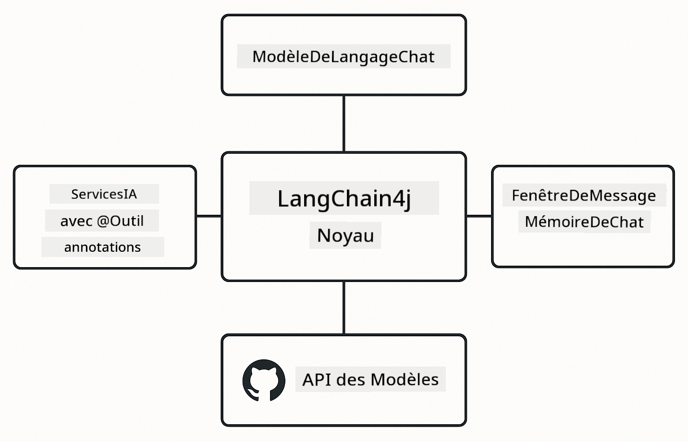

<!--
CO_OP_TRANSLATOR_METADATA:
{
  "original_hash": "377b3e3e6f8d02965bf0fbbc9ccb45c5",
  "translation_date": "2025-12-13T14:27:12+00:00",
  "source_file": "00-quick-start/README.md",
  "language_code": "fr"
}
-->
# Module 00 : Démarrage rapide

## Table des matières

- [Introduction](../../../00-quick-start)
- [Qu'est-ce que LangChain4j ?](../../../00-quick-start)
- [Dépendances LangChain4j](../../../00-quick-start)
- [Prérequis](../../../00-quick-start)
- [Configuration](../../../00-quick-start)
  - [1. Obtenez votre jeton GitHub](../../../00-quick-start)
  - [2. Configurez votre jeton](../../../00-quick-start)
- [Exécuter les exemples](../../../00-quick-start)
  - [1. Chat basique](../../../00-quick-start)
  - [2. Modèles de prompt](../../../00-quick-start)
  - [3. Appel de fonction](../../../00-quick-start)
  - [4. Q&R sur document (RAG)](../../../00-quick-start)
- [Ce que chaque exemple montre](../../../00-quick-start)
- [Étapes suivantes](../../../00-quick-start)
- [Dépannage](../../../00-quick-start)

## Introduction

Ce démarrage rapide est conçu pour vous permettre de commencer à utiliser LangChain4j aussi rapidement que possible. Il couvre les bases absolues de la création d'applications IA avec LangChain4j et les modèles GitHub. Dans les modules suivants, vous utiliserez Azure OpenAI avec LangChain4j pour construire des applications plus avancées.

## Qu'est-ce que LangChain4j ?

LangChain4j est une bibliothèque Java qui simplifie la création d'applications alimentées par l'IA. Au lieu de gérer des clients HTTP et le parsing JSON, vous travaillez avec des API Java propres.

La "chaîne" dans LangChain fait référence à l'enchaînement de plusieurs composants - vous pouvez chaîner un prompt à un modèle, puis à un parseur, ou chaîner plusieurs appels IA où la sortie d'un appel alimente l'entrée suivante. Ce démarrage rapide se concentre sur les fondamentaux avant d'explorer des chaînes plus complexes.


*Enchaînement des composants dans LangChain4j - les blocs de construction se connectent pour créer des flux de travail IA puissants*

Nous utiliserons trois composants principaux :

**ChatLanguageModel** - L'interface pour les interactions avec le modèle IA. Appelez `model.chat("prompt")` et obtenez une chaîne de réponse. Nous utilisons `OpenAiOfficialChatModel` qui fonctionne avec des points de terminaison compatibles OpenAI comme les modèles GitHub.

**AiServices** - Crée des interfaces de service IA typées. Définissez des méthodes, annotez-les avec `@Tool`, et LangChain4j gère l'orchestration. L'IA appelle automatiquement vos méthodes Java quand c'est nécessaire.

**MessageWindowChatMemory** - Maintient l'historique de la conversation. Sans cela, chaque requête est indépendante. Avec, l'IA se souvient des messages précédents et maintient le contexte sur plusieurs tours.



*Architecture LangChain4j - composants principaux travaillant ensemble pour alimenter vos applications IA*

## Dépendances LangChain4j

Ce démarrage rapide utilise deux dépendances Maven dans le [`pom.xml`](../../../00-quick-start/pom.xml) :

```xml
<!-- Core LangChain4j library -->
<dependency>
    <groupId>dev.langchain4j</groupId>
    <artifactId>langchain4j</artifactId> <!-- Inherited from BOM in root pom.xml -->
</dependency>

<!-- OpenAI integration (works with GitHub Models) -->
<dependency>
    <groupId>dev.langchain4j</groupId>
    <artifactId>langchain4j-open-ai-official</artifactId> <!-- Inherited from BOM in root pom.xml -->
</dependency>
```

Le module `langchain4j-open-ai-official` fournit la classe `OpenAiOfficialChatModel` qui se connecte aux API compatibles OpenAI. GitHub Models utilise le même format d'API, donc aucun adaptateur spécial n'est nécessaire - il suffit de pointer l'URL de base vers `https://models.github.ai/inference`.

## Prérequis

**Utilisez-vous le conteneur de développement ?** Java et Maven sont déjà installés. Vous avez seulement besoin d'un jeton d'accès personnel GitHub.

**Développement local :**
- Java 21+, Maven 3.9+
- Jeton d'accès personnel GitHub (instructions ci-dessous)

> **Note :** Ce module utilise `gpt-4.1-nano` de GitHub Models. Ne modifiez pas le nom du modèle dans le code - il est configuré pour fonctionner avec les modèles disponibles de GitHub.

## Configuration

### 1. Obtenez votre jeton GitHub

1. Allez sur [Paramètres GitHub → Jetons d'accès personnel](https://github.com/settings/personal-access-tokens)
2. Cliquez sur "Générer un nouveau jeton"
3. Donnez un nom descriptif (ex. : "Démo LangChain4j")
4. Définissez une expiration (7 jours recommandé)
5. Sous "Autorisations du compte", trouvez "Models" et mettez en "Lecture seule"
6. Cliquez sur "Générer le jeton"
7. Copiez et sauvegardez votre jeton - vous ne le verrez plus

### 2. Configurez votre jeton

**Option 1 : Utilisation de VS Code (recommandé)**

Si vous utilisez VS Code, ajoutez votre jeton dans le fichier `.env` à la racine du projet :

Si le fichier `.env` n'existe pas, copiez `.env.example` en `.env` ou créez un nouveau fichier `.env` à la racine du projet.

**Exemple de fichier `.env` :**
```bash
# Dans /workspaces/LangChain4j-for-Beginners/.env
GITHUB_TOKEN=your_token_here
```

Ensuite, vous pouvez simplement faire un clic droit sur n'importe quel fichier de démonstration (ex. `BasicChatDemo.java`) dans l'Explorateur et sélectionner **"Run Java"** ou utiliser les configurations de lancement depuis le panneau Exécuter et Déboguer.

**Option 2 : Utilisation du terminal**

Définissez le jeton comme variable d'environnement :

**Bash :**
```bash
export GITHUB_TOKEN=your_token_here
```

**PowerShell :**
```powershell
$env:GITHUB_TOKEN=your_token_here
```

## Exécuter les exemples

**Avec VS Code :** Faites un clic droit sur n'importe quel fichier de démonstration dans l'Explorateur et sélectionnez **"Run Java"**, ou utilisez les configurations de lancement depuis le panneau Exécuter et Déboguer (assurez-vous d'avoir ajouté votre jeton dans le fichier `.env` au préalable).

**Avec Maven :** Vous pouvez aussi exécuter depuis la ligne de commande :

### 1. Chat basique

**Bash :**
```bash
mvn compile exec:java -Dexec.mainClass=com.example.langchain4j.quickstart.BasicChatDemo
```

**PowerShell :**
```powershell
mvn --% compile exec:java -Dexec.mainClass=com.example.langchain4j.quickstart.BasicChatDemo
```

### 2. Modèles de prompt

**Bash :**
```bash
mvn compile exec:java -Dexec.mainClass=com.example.langchain4j.quickstart.PromptEngineeringDemo
```

**PowerShell :**
```powershell
mvn --% compile exec:java -Dexec.mainClass=com.example.langchain4j.quickstart.PromptEngineeringDemo
```

Montre les prompts zero-shot, few-shot, chain-of-thought et basés sur un rôle.

### 3. Appel de fonction

**Bash :**
```bash
mvn compile exec:java -Dexec.mainClass=com.example.langchain4j.quickstart.ToolIntegrationDemo
```

**PowerShell :**
```powershell
mvn --% compile exec:java -Dexec.mainClass=com.example.langchain4j.quickstart.ToolIntegrationDemo
```

L'IA appelle automatiquement vos méthodes Java quand c'est nécessaire.

### 4. Q&R sur document (RAG)

**Bash :**
```bash
mvn compile exec:java -Dexec.mainClass=com.example.langchain4j.quickstart.SimpleReaderDemo
```

**PowerShell :**
```powershell
mvn --% compile exec:java -Dexec.mainClass=com.example.langchain4j.quickstart.SimpleReaderDemo
```

Posez des questions sur le contenu de `document.txt`.

## Ce que chaque exemple montre

**Chat basique** - [BasicChatDemo.java](../../../00-quick-start/src/main/java/com/example/langchain4j/quickstart/BasicChatDemo.java)

Commencez ici pour voir LangChain4j dans sa forme la plus simple. Vous créerez un `OpenAiOfficialChatModel`, enverrez un prompt avec `.chat()`, et recevrez une réponse. Cela montre les bases : comment initialiser des modèles avec des points de terminaison personnalisés et des clés API. Une fois ce modèle compris, tout le reste s'appuie dessus.

```java
ChatLanguageModel model = OpenAiOfficialChatModel.builder()
    .baseUrl("https://models.github.ai/inference")
    .apiKey(System.getenv("GITHUB_TOKEN"))
    .modelName("gpt-4.1-nano")
    .build();

String response = model.chat("What is LangChain4j?");
System.out.println(response);
```

> **🤖 Essayez avec [GitHub Copilot](https://github.com/features/copilot) Chat :** Ouvrez [`BasicChatDemo.java`](../../../00-quick-start/src/main/java/com/example/langchain4j/quickstart/BasicChatDemo.java) et demandez :
> - "Comment passer de GitHub Models à Azure OpenAI dans ce code ?"
> - "Quels autres paramètres puis-je configurer dans OpenAiOfficialChatModel.builder() ?"
> - "Comment ajouter des réponses en streaming au lieu d'attendre la réponse complète ?"

**Ingénierie des prompts** - [PromptEngineeringDemo.java](../../../00-quick-start/src/main/java/com/example/langchain4j/quickstart/PromptEngineeringDemo.java)

Maintenant que vous savez comment parler à un modèle, explorons ce que vous lui dites. Cette démo utilise la même configuration de modèle mais montre quatre modèles de prompt différents. Essayez les prompts zero-shot pour des instructions directes, few-shot qui apprennent à partir d'exemples, chain-of-thought qui révèlent les étapes de raisonnement, et les prompts basés sur un rôle qui définissent le contexte. Vous verrez comment le même modèle donne des résultats très différents selon la façon dont vous formulez votre demande.

```java
PromptTemplate template = PromptTemplate.from(
    "What's the best time to visit {{destination}} for {{activity}}?"
);

Prompt prompt = template.apply(Map.of(
    "destination", "Paris",
    "activity", "sightseeing"
));

String response = model.chat(prompt.text());
```

> **🤖 Essayez avec [GitHub Copilot](https://github.com/features/copilot) Chat :** Ouvrez [`PromptEngineeringDemo.java`](../../../00-quick-start/src/main/java/com/example/langchain4j/quickstart/PromptEngineeringDemo.java) et demandez :
> - "Quelle est la différence entre zero-shot et few-shot prompting, et quand utiliser chacun ?"
> - "Comment le paramètre température affecte-t-il les réponses du modèle ?"
> - "Quelles sont les techniques pour prévenir les attaques par injection de prompt en production ?"
> - "Comment créer des objets PromptTemplate réutilisables pour des modèles courants ?"

**Intégration d'outils** - [ToolIntegrationDemo.java](../../../00-quick-start/src/main/java/com/example/langchain4j/quickstart/ToolIntegrationDemo.java)

C'est ici que LangChain4j devient puissant. Vous utiliserez `AiServices` pour créer un assistant IA qui peut appeler vos méthodes Java. Il suffit d'annoter les méthodes avec `@Tool("description")` et LangChain4j gère le reste - l'IA décide automatiquement quand utiliser chaque outil selon ce que l'utilisateur demande. Cela démontre l'appel de fonction, une technique clé pour construire une IA capable d'agir, pas seulement de répondre.

```java
@Tool("Performs addition of two numeric values")
public double add(double a, double b) {
    return a + b;
}

MathAssistant assistant = AiServices.create(MathAssistant.class, model);
String response = assistant.chat("What is 25 plus 17?");
```

> **🤖 Essayez avec [GitHub Copilot](https://github.com/features/copilot) Chat :** Ouvrez [`ToolIntegrationDemo.java`](../../../00-quick-start/src/main/java/com/example/langchain4j/quickstart/ToolIntegrationDemo.java) et demandez :
> - "Comment fonctionne l'annotation @Tool et que fait LangChain4j en coulisses ?"
> - "L'IA peut-elle appeler plusieurs outils en séquence pour résoudre des problèmes complexes ?"
> - "Que se passe-t-il si un outil lance une exception - comment gérer les erreurs ?"
> - "Comment intégrer une vraie API au lieu de cet exemple de calculatrice ?"

**Q&R sur document (RAG)** - [SimpleReaderDemo.java](../../../00-quick-start/src/main/java/com/example/langchain4j/quickstart/SimpleReaderDemo.java)

Ici, vous verrez les bases du RAG (génération augmentée par récupération). Au lieu de s'appuyer sur les données d'entraînement du modèle, vous chargez le contenu de [`document.txt`](../../../00-quick-start/document.txt) et l'incluez dans le prompt. L'IA répond en se basant sur votre document, pas sur ses connaissances générales. C'est la première étape pour construire des systèmes qui peuvent travailler avec vos propres données.

```java
Document document = FileSystemDocumentLoader.loadDocument("document.txt");
String content = document.text();

String prompt = "Based on this document: " + content + 
                "\nQuestion: What is the main topic?";
String response = model.chat(prompt);
```

> **Note :** Cette approche simple charge tout le document dans le prompt. Pour les fichiers volumineux (>10Ko), vous dépasserez les limites de contexte. Le module 03 couvre la découpe en morceaux et la recherche vectorielle pour les systèmes RAG en production.

> **🤖 Essayez avec [GitHub Copilot](https://github.com/features/copilot) Chat :** Ouvrez [`SimpleReaderDemo.java`](../../../00-quick-start/src/main/java/com/example/langchain4j/quickstart/SimpleReaderDemo.java) et demandez :
> - "Comment le RAG empêche-t-il les hallucinations IA comparé à l'utilisation des données d'entraînement du modèle ?"
> - "Quelle est la différence entre cette approche simple et l'utilisation d'embeddings vectoriels pour la récupération ?"
> - "Comment passer à l'échelle pour gérer plusieurs documents ou des bases de connaissances plus grandes ?"
> - "Quelles sont les bonnes pratiques pour structurer le prompt afin que l'IA utilise uniquement le contexte fourni ?"

## Débogage

Les exemples incluent `.logRequests(true)` et `.logResponses(true)` pour afficher les appels API dans la console. Cela aide à résoudre les erreurs d'authentification, les limites de taux ou les réponses inattendues. Supprimez ces options en production pour réduire le bruit des logs.

## Étapes suivantes

**Module suivant :** [01-introduction - Premiers pas avec LangChain4j et gpt-5 sur Azure](../01-introduction/README.md)

---

**Navigation :** [← Retour au principal](../README.md) | [Suivant : Module 01 - Introduction →](../01-introduction/README.md)

---

## Dépannage

### Première compilation Maven

**Problème :** Le premier `mvn clean compile` ou `mvn package` prend beaucoup de temps (10-15 minutes)

**Cause :** Maven doit télécharger toutes les dépendances du projet (Spring Boot, bibliothèques LangChain4j, SDK Azure, etc.) lors de la première compilation.

**Solution :** C'est un comportement normal. Les compilations suivantes seront beaucoup plus rapides car les dépendances sont mises en cache localement. Le temps de téléchargement dépend de votre vitesse réseau.

### Syntaxe des commandes Maven sous PowerShell

**Problème :** Les commandes Maven échouent avec l'erreur `Unknown lifecycle phase ".mainClass=..."`

**Cause :** PowerShell interprète `=` comme un opérateur d'affectation de variable, ce qui casse la syntaxe des propriétés Maven.

**Solution :** Utilisez l'opérateur stop-parsing `--%` avant la commande Maven :

**PowerShell :**
```powershell
mvn --% compile exec:java -Dexec.mainClass=com.example.langchain4j.quickstart.BasicChatDemo
```

**Bash :**
```bash
mvn compile exec:java -Dexec.mainClass=com.example.langchain4j.quickstart.BasicChatDemo
```

L'opérateur `--%` indique à PowerShell de passer tous les arguments restants littéralement à Maven sans les interpréter.

### Affichage des emojis sous Windows PowerShell

**Problème :** Les réponses IA affichent des caractères illisibles (ex. `????` ou `â??`) au lieu des emojis dans PowerShell

**Cause :** L'encodage par défaut de PowerShell ne supporte pas les emojis UTF-8

**Solution :** Exécutez cette commande avant de lancer les applications Java :
```cmd
chcp 65001
```

Cela force l'encodage UTF-8 dans le terminal. Sinon, utilisez Windows Terminal qui supporte mieux Unicode.

---

<!-- CO-OP TRANSLATOR DISCLAIMER START -->
**Avertissement** :  
Ce document a été traduit à l’aide du service de traduction automatique [Co-op Translator](https://github.com/Azure/co-op-translator). Bien que nous nous efforcions d’assurer l’exactitude, veuillez noter que les traductions automatiques peuvent contenir des erreurs ou des inexactitudes. Le document original dans sa langue d’origine doit être considéré comme la source faisant foi. Pour les informations critiques, une traduction professionnelle réalisée par un humain est recommandée. Nous déclinons toute responsabilité en cas de malentendus ou de mauvaises interprétations résultant de l’utilisation de cette traduction.
<!-- CO-OP TRANSLATOR DISCLAIMER END -->