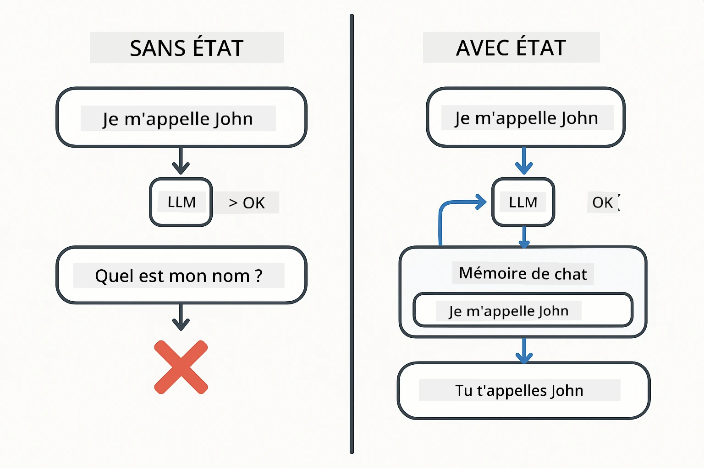
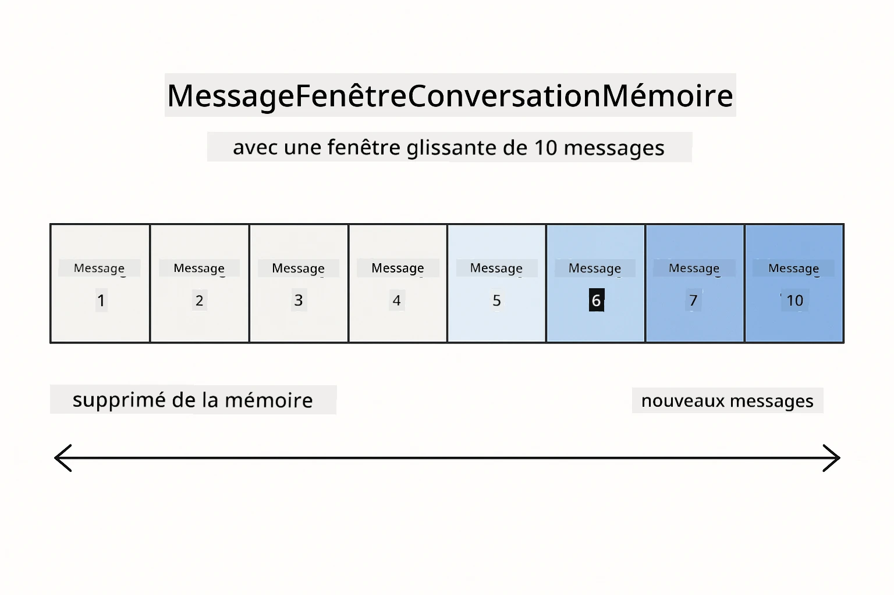
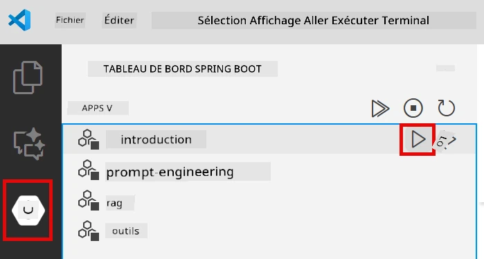
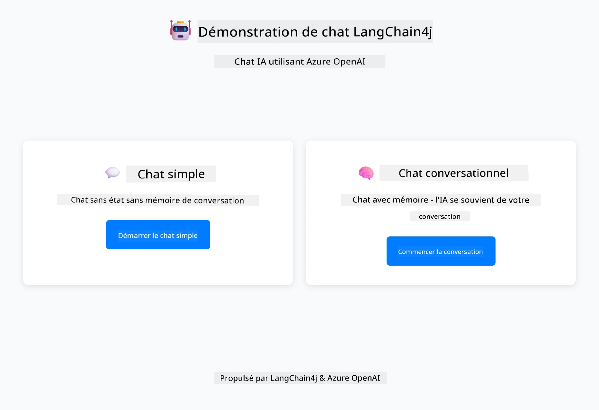
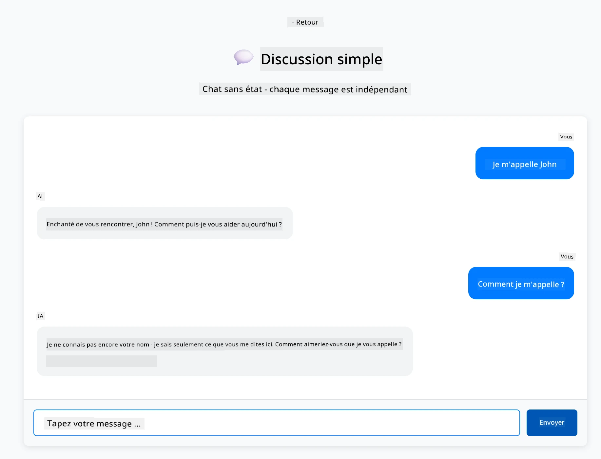
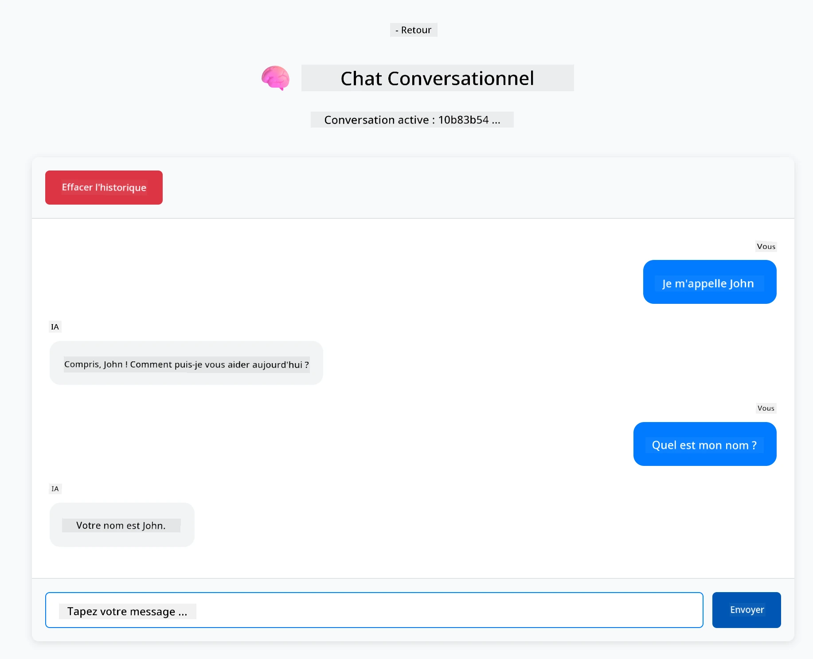

<!--
CO_OP_TRANSLATOR_METADATA:
{
  "original_hash": "c3e07ca58d0b8a3f47d3bf5728541e0a",
  "translation_date": "2025-12-13T13:00:00+00:00",
  "source_file": "01-introduction/README.md",
  "language_code": "fr"
}
-->
# Module 01 : Premiers pas avec LangChain4j

## Table des matières

- [Ce que vous apprendrez](../../../01-introduction)
- [Prérequis](../../../01-introduction)
- [Comprendre le problème central](../../../01-introduction)
- [Comprendre les tokens](../../../01-introduction)
- [Comment fonctionne la mémoire](../../../01-introduction)
- [Comment cela utilise LangChain4j](../../../01-introduction)
- [Déployer l'infrastructure Azure OpenAI](../../../01-introduction)
- [Exécuter l'application localement](../../../01-introduction)
- [Utiliser l'application](../../../01-introduction)
  - [Chat sans état (panneau de gauche)](../../../01-introduction)
  - [Chat avec état (panneau de droite)](../../../01-introduction)
- [Étapes suivantes](../../../01-introduction)

## Ce que vous apprendrez

Si vous avez terminé le démarrage rapide, vous avez vu comment envoyer des invites et obtenir des réponses. C'est la base, mais les applications réelles ont besoin de plus. Ce module vous apprend à construire une IA conversationnelle qui se souvient du contexte et maintient l'état - la différence entre une démo ponctuelle et une application prête pour la production.

Nous utiliserons GPT-5 d'Azure OpenAI tout au long de ce guide car ses capacités avancées de raisonnement rendent le comportement des différents modèles plus évident. Lorsque vous ajoutez la mémoire, vous verrez clairement la différence. Cela facilite la compréhension de ce que chaque composant apporte à votre application.

Vous construirez une application qui démontre les deux modèles :

**Chat sans état** - Chaque requête est indépendante. Le modèle n'a aucun souvenir des messages précédents. C'est le modèle que vous avez utilisé dans le démarrage rapide.

**Conversation avec état** - Chaque requête inclut l'historique de la conversation. Le modèle maintient le contexte sur plusieurs échanges. C'est ce que les applications en production exigent.

## Prérequis

- Abonnement Azure avec accès à Azure OpenAI
- Java 21, Maven 3.9+
- Azure CLI (https://learn.microsoft.com/en-us/cli/azure/install-azure-cli)
- Azure Developer CLI (azd) (https://learn.microsoft.com/en-us/azure/developer/azure-developer-cli/install-azd)

> **Note :** Java, Maven, Azure CLI et Azure Developer CLI (azd) sont préinstallés dans le devcontainer fourni.

> **Note :** Ce module utilise GPT-5 sur Azure OpenAI. Le déploiement est configuré automatiquement via `azd up` - ne modifiez pas le nom du modèle dans le code.

## Comprendre le problème central

Les modèles de langage sont sans état. Chaque appel API est indépendant. Si vous envoyez "Je m'appelle John" puis demandez "Comment je m'appelle ?", le modèle n'a aucune idée que vous venez de vous présenter. Il traite chaque requête comme si c'était la première conversation que vous avez jamais eue.

Cela convient pour des questions-réponses simples mais est inutile pour des applications réelles. Les bots de service client doivent se souvenir de ce que vous leur avez dit. Les assistants personnels ont besoin de contexte. Toute conversation à plusieurs tours nécessite une mémoire.



*La différence entre les conversations sans état (appels indépendants) et avec état (conscientes du contexte)*

## Comprendre les tokens

Avant de plonger dans les conversations, il est important de comprendre les tokens - les unités de base de texte que les modèles de langage traitent :


*Exemple de découpage du texte en tokens - "I love AI!" devient 4 unités de traitement distinctes*

Les tokens sont la façon dont les modèles d'IA mesurent et traitent le texte. Les mots, la ponctuation et même les espaces peuvent être des tokens. Votre modèle a une limite du nombre de tokens qu'il peut traiter à la fois (400 000 pour GPT-5, avec jusqu'à 272 000 tokens en entrée et 128 000 tokens en sortie). Comprendre les tokens vous aide à gérer la longueur des conversations et les coûts.

## Comment fonctionne la mémoire

La mémoire de chat résout le problème sans état en maintenant l'historique de la conversation. Avant d'envoyer votre requête au modèle, le framework préfixe les messages précédents pertinents. Quand vous demandez "Comment je m'appelle ?", le système envoie en fait tout l'historique de la conversation, permettant au modèle de voir que vous avez précédemment dit "Je m'appelle John."

LangChain4j fournit des implémentations de mémoire qui gèrent cela automatiquement. Vous choisissez combien de messages conserver et le framework gère la fenêtre de contexte.



*MessageWindowChatMemory maintient une fenêtre glissante des messages récents, supprimant automatiquement les anciens*

## Comment cela utilise LangChain4j

Ce module étend le démarrage rapide en intégrant Spring Boot et en ajoutant la mémoire de conversation. Voici comment les pièces s'assemblent :

**Dépendances** - Ajoutez deux bibliothèques LangChain4j :

```xml
<dependency>
    <groupId>dev.langchain4j</groupId>
    <artifactId>langchain4j</artifactId> <!-- Inherited from BOM in root pom.xml -->
</dependency>
<dependency>
    <groupId>dev.langchain4j</groupId>
    <artifactId>langchain4j-open-ai-official</artifactId> <!-- Inherited from BOM in root pom.xml -->
</dependency>
```

**Modèle de chat** - Configurez Azure OpenAI comme bean Spring ([LangChainConfig.java](../../../01-introduction/src/main/java/com/example/langchain4j/config/LangChainConfig.java)) :

```java
@Bean
public OpenAiOfficialChatModel openAiOfficialChatModel() {
    return OpenAiOfficialChatModel.builder()
            .baseUrl(azureEndpoint)
            .apiKey(azureApiKey)
            .modelName(deploymentName)
            .timeout(Duration.ofMinutes(5))
            .maxRetries(3)
            .build();
}
```

Le builder lit les identifiants depuis les variables d'environnement définies par `azd up`. La définition de `baseUrl` vers votre point de terminaison Azure permet au client OpenAI de fonctionner avec Azure OpenAI.

**Mémoire de conversation** - Suivez l'historique du chat avec MessageWindowChatMemory ([ConversationService.java](../../../01-introduction/src/main/java/com/example/langchain4j/service/ConversationService.java)) :

```java
ChatMemory memory = MessageWindowChatMemory.withMaxMessages(10);

memory.add(UserMessage.from("My name is John"));
memory.add(AiMessage.from("Nice to meet you, John!"));

memory.add(UserMessage.from("What's my name?"));
AiMessage aiMessage = chatModel.chat(memory.messages()).aiMessage();
memory.add(aiMessage);
```

Créez la mémoire avec `withMaxMessages(10)` pour conserver les 10 derniers messages. Ajoutez les messages utilisateur et IA avec des wrappers typés : `UserMessage.from(text)` et `AiMessage.from(text)`. Récupérez l'historique avec `memory.messages()` et envoyez-le au modèle. Le service stocke des instances de mémoire séparées par ID de conversation, permettant à plusieurs utilisateurs de discuter simultanément.

> **🤖 Essayez avec [GitHub Copilot](https://github.com/features/copilot) Chat :** Ouvrez [`ConversationService.java`](../../../01-introduction/src/main/java/com/example/langchain4j/service/ConversationService.java) et demandez :
> - "Comment MessageWindowChatMemory décide-t-il quels messages supprimer lorsque la fenêtre est pleine ?"
> - "Puis-je implémenter un stockage mémoire personnalisé utilisant une base de données au lieu de la mémoire en RAM ?"
> - "Comment ajouter un résumé pour compresser l'historique ancien de la conversation ?"

Le point de terminaison de chat sans état ignore complètement la mémoire - juste `chatModel.chat(prompt)` comme dans le démarrage rapide. Le point de terminaison avec état ajoute les messages à la mémoire, récupère l'historique et inclut ce contexte à chaque requête. Même configuration de modèle, modèles différents.

## Déployer l'infrastructure Azure OpenAI

**Bash :**
```bash
cd 01-introduction
azd up  # Sélectionnez l'abonnement et l'emplacement (eastus2 recommandé)
```

**PowerShell :**
```powershell
cd 01-introduction
azd up  # Sélectionnez l'abonnement et l'emplacement (eastus2 recommandé)
```

> **Note :** Si vous rencontrez une erreur de timeout (`RequestConflict: Cannot modify resource ... provisioning state is not terminal`), exécutez simplement `azd up` à nouveau. Les ressources Azure peuvent encore être en cours de provisionnement en arrière-plan, et réessayer permet au déploiement de se terminer une fois que les ressources atteignent un état terminal.

Cela va :
1. Déployer la ressource Azure OpenAI avec les modèles GPT-5 et text-embedding-3-small
2. Générer automatiquement le fichier `.env` à la racine du projet avec les identifiants
3. Configurer toutes les variables d'environnement requises

**Vous avez des problèmes de déploiement ?** Consultez le [README Infrastructure](infra/README.md) pour un dépannage détaillé incluant les conflits de noms de sous-domaines, les étapes de déploiement manuel via le portail Azure, et les conseils de configuration des modèles.

**Vérifiez que le déploiement a réussi :**

**Bash :**
```bash
cat ../.env  # Devrait afficher AZURE_OPENAI_ENDPOINT, API_KEY, etc.
```

**PowerShell :**
```powershell
Get-Content ..\.env  # Devrait afficher AZURE_OPENAI_ENDPOINT, API_KEY, etc.
```

> **Note :** La commande `azd up` génère automatiquement le fichier `.env`. Si vous devez le mettre à jour plus tard, vous pouvez soit éditer le fichier `.env` manuellement, soit le régénérer en exécutant :
>
> **Bash :**
> ```bash
> cd ..
> bash .azd-env.sh
> ```
>
> **PowerShell :**
> ```powershell
> cd ..
> .\.azd-env.ps1
> ```

## Exécuter l'application localement

**Vérifiez le déploiement :**

Assurez-vous que le fichier `.env` existe à la racine avec les identifiants Azure :

**Bash :**
```bash
cat ../.env  # Devrait afficher AZURE_OPENAI_ENDPOINT, API_KEY, DEPLOYMENT
```

**PowerShell :**
```powershell
Get-Content ..\.env  # Devrait afficher AZURE_OPENAI_ENDPOINT, API_KEY, DEPLOYMENT
```

**Démarrez les applications :**

**Option 1 : Utiliser le Spring Boot Dashboard (recommandé pour les utilisateurs VS Code)**

Le conteneur de développement inclut l'extension Spring Boot Dashboard, qui fournit une interface visuelle pour gérer toutes les applications Spring Boot. Vous pouvez la trouver dans la barre d'activité à gauche de VS Code (cherchez l'icône Spring Boot).

Depuis le Spring Boot Dashboard, vous pouvez :
- Voir toutes les applications Spring Boot disponibles dans l'espace de travail
- Démarrer/arrêter les applications en un clic
- Voir les logs des applications en temps réel
- Surveiller l'état des applications

Cliquez simplement sur le bouton lecture à côté de "introduction" pour démarrer ce module, ou lancez tous les modules en même temps.



**Option 2 : Utiliser les scripts shell**

Démarrez toutes les applications web (modules 01-04) :

**Bash :**
```bash
cd ..  # Depuis le répertoire racine
./start-all.sh
```

**PowerShell :**
```powershell
cd ..  # Depuis le répertoire racine
.\start-all.ps1
```

Ou démarrez uniquement ce module :

**Bash :**
```bash
cd 01-introduction
./start.sh
```

**PowerShell :**
```powershell
cd 01-introduction
.\start.ps1
```

Les deux scripts chargent automatiquement les variables d'environnement depuis le fichier `.env` à la racine et construiront les JARs s'ils n'existent pas.

> **Note :** Si vous préférez construire manuellement tous les modules avant de démarrer :
>
> **Bash :**
> ```bash
> cd ..  # Go to root directory
> mvn clean package -DskipTests
> ```
>
> **PowerShell :**
> ```powershell
> cd ..  # Go to root directory
> mvn clean package -DskipTests
> ```

Ouvrez http://localhost:8080 dans votre navigateur.

**Pour arrêter :**

**Bash :**
```bash
./stop.sh  # Ce module uniquement
# Ou
cd .. && ./stop-all.sh  # Tous les modules
```

**PowerShell :**
```powershell
.\stop.ps1  # Ce module uniquement
# Ou
cd ..; .\stop-all.ps1  # Tous les modules
```

## Utiliser l'application

L'application fournit une interface web avec deux implémentations de chat côte à côte.



*Tableau de bord montrant les options Simple Chat (sans état) et Conversational Chat (avec état)*

### Chat sans état (panneau de gauche)

Essayez d'abord ceci. Dites "Je m'appelle John" puis demandez immédiatement "Comment je m'appelle ?" Le modèle ne s'en souviendra pas car chaque message est indépendant. Cela démontre le problème central de l'intégration basique des modèles de langage - pas de contexte de conversation.



*L'IA ne se souvient pas de votre nom du message précédent*

### Chat avec état (panneau de droite)

Essayez maintenant la même séquence ici. Dites "Je m'appelle John" puis "Comment je m'appelle ?" Cette fois, il s'en souvient. La différence est MessageWindowChatMemory - il maintient l'historique de la conversation et l'inclut à chaque requête. C'est ainsi que fonctionne l'IA conversationnelle en production.



*L'IA se souvient de votre nom plus tôt dans la conversation*

Les deux panneaux utilisent le même modèle GPT-5. La seule différence est la mémoire. Cela montre clairement ce que la mémoire apporte à votre application et pourquoi elle est essentielle pour les cas d'usage réels.

## Étapes suivantes

**Module suivant :** [02-prompt-engineering - Ingénierie des invites avec GPT-5](../02-prompt-engineering/README.md)

---

**Navigation :** [← Précédent : Module 00 - Démarrage rapide](../00-quick-start/README.md) | [Retour au principal](../README.md) | [Suivant : Module 02 - Ingénierie des invites →](../02-prompt-engineering/README.md)

---

<!-- CO-OP TRANSLATOR DISCLAIMER START -->
**Avertissement** :  
Ce document a été traduit à l’aide du service de traduction automatique [Co-op Translator](https://github.com/Azure/co-op-translator). Bien que nous nous efforcions d’assurer l’exactitude, veuillez noter que les traductions automatiques peuvent contenir des erreurs ou des inexactitudes. Le document original dans sa langue d’origine doit être considéré comme la source faisant foi. Pour les informations critiques, une traduction professionnelle réalisée par un humain est recommandée. Nous déclinons toute responsabilité en cas de malentendus ou de mauvaises interprétations résultant de l’utilisation de cette traduction.
<!-- CO-OP TRANSLATOR DISCLAIMER END -->