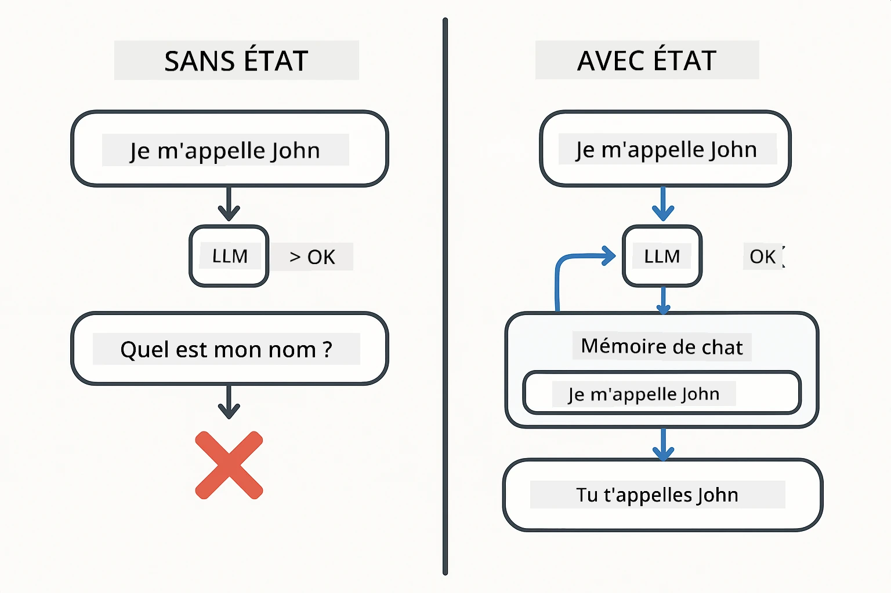
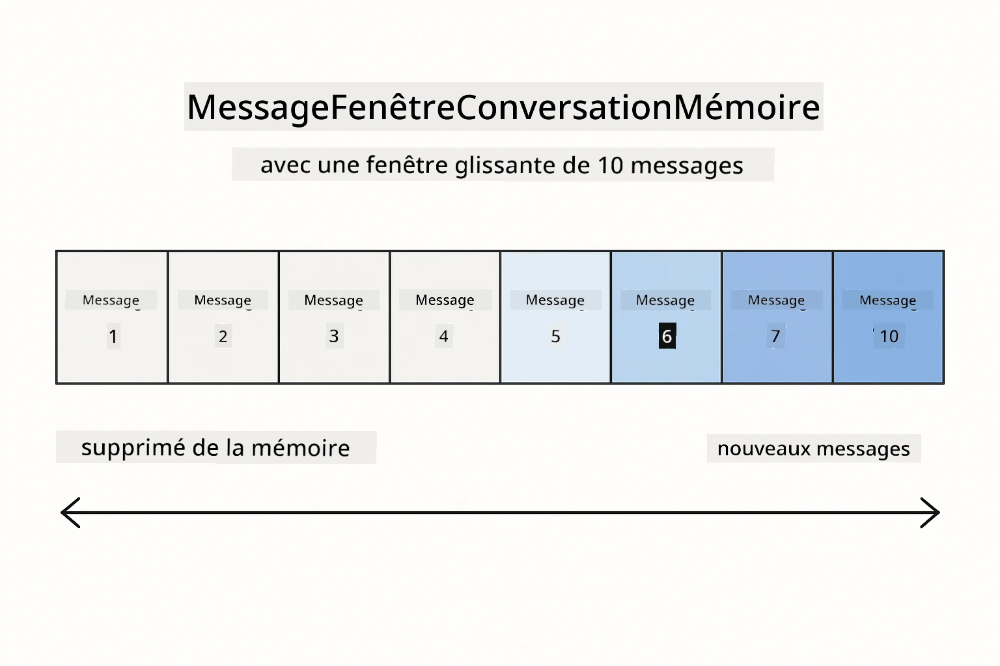
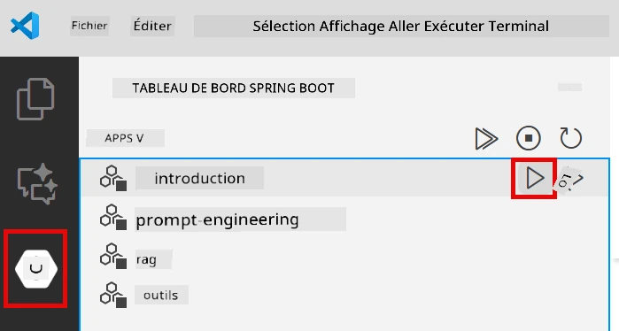
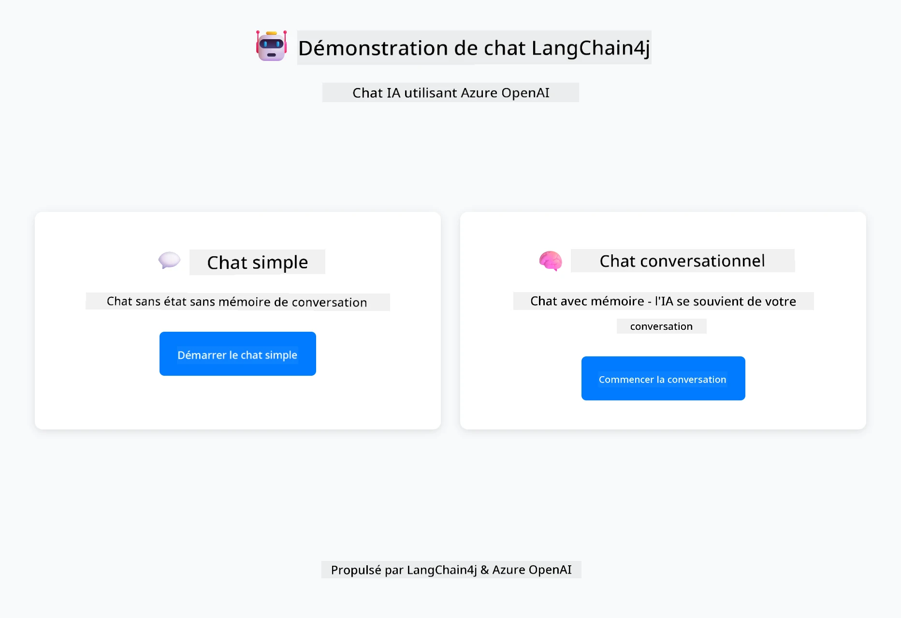
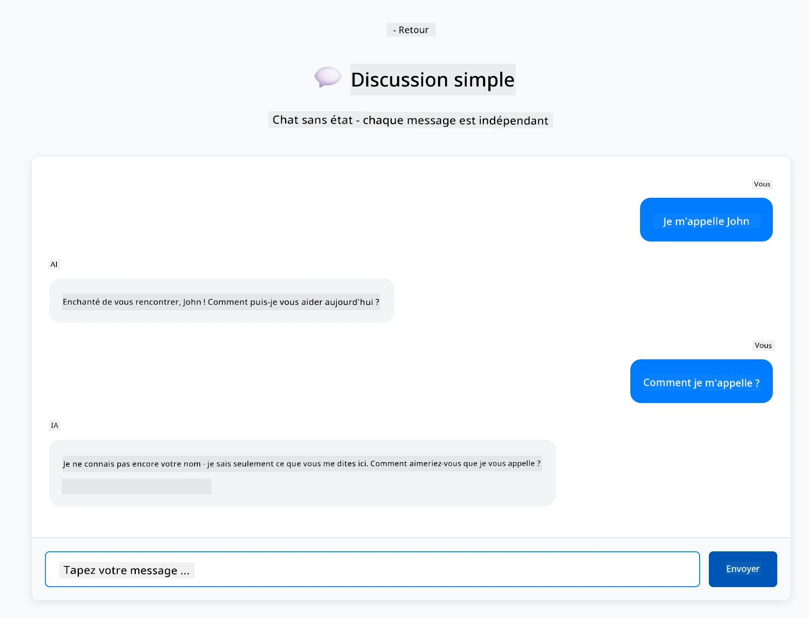
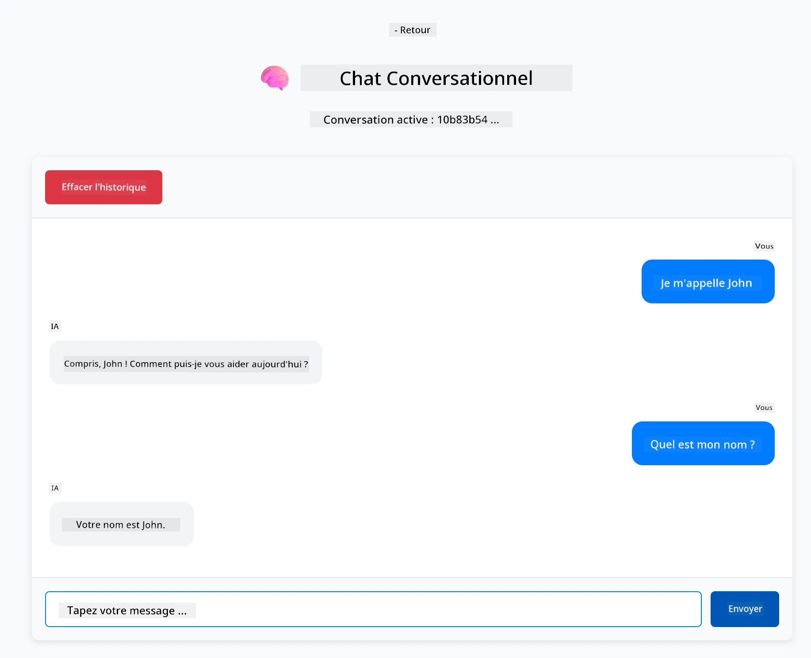

# Module 01 : Premiers pas avec LangChain4j

## Table des matières

- [Présentation Vidéo](#présentation-vidéo)
- [Ce que vous apprendrez](#ce-que-vous-apprendrez)
- [Prérequis](#prérequis)
- [Comprendre le problème central](#comprendre-le-problème-central)
- [Comprendre les jetons](#comprendre-les-jetons)
- [Comment fonctionne la mémoire](#comment-fonctionne-la-mémoire)
- [Comment cela utilise LangChain4j](#comment-cela-utilise-langchain4j)
- [Déployer l'infrastructure Azure OpenAI](#déployer-linfrastructure-azure-openai)
- [Exécuter l'application localement](#exécuter-lapplication-localement)
- [Utiliser l'application](#utiliser-lapplication)
  - [Chat sans état (panneau gauche)](#chat-sans-état-panneau-gauche)
  - [Chat avec état (panneau droit)](#chat-avec-état-panneau-droit)
- [Étapes suivantes](#étapes-suivantes)

## Présentation Vidéo

Regardez cette session en direct qui explique comment commencer avec ce module :

<a href="https://www.youtube.com/live/nl_troDm8rQ?si=6b85S8xGjWnT2fX9"></a>

## Ce que vous apprendrez

C'est votre point de départ avec LangChain4j et Azure OpenAI. Nous commençons par les fondamentaux et commençons à construire des applications de type production. Ce module se concentre sur l'IA conversationnelle qui se souvient du contexte et maintient l'état — les concepts fondamentaux sur lesquels chaque module ultérieur se base.

Nous utiliserons GPT-5.2 d'Azure OpenAI tout au long de ce guide car ses capacités de raisonnement avancées rendent le comportement des différents modèles plus évident. Lorsque vous ajoutez la mémoire, vous verrez clairement la différence. Cela facilite la compréhension de ce que chaque composant apporte à votre application.

Vous construirez une application qui démontre les deux modèles :

**Chat sans état** – Chaque requête est indépendante. Le modèle ne se souvient pas des messages précédents. C’est le point de départ le plus simple.

**Conversation avec état** – Chaque requête inclut l’historique de la conversation. Le modèle conserve le contexte sur plusieurs tours. C’est ce dont les applications en production ont besoin.

## Prérequis

- Abonnement Azure avec accès Azure OpenAI
- Java 21, Maven 3.9+ 
- Azure CLI (https://learn.microsoft.com/en-us/cli/azure/install-azure-cli)
- Azure Developer CLI (azd) (https://learn.microsoft.com/en-us/azure/developer/azure-developer-cli/install-azd)

> **Note :** Java, Maven, Azure CLI et Azure Developer CLI (azd) sont préinstallés dans le devcontainer fourni.

> **Note :** Ce module utilise GPT-5.2 sur Azure OpenAI. Le déploiement est configuré automatiquement via `azd up` - ne modifiez pas le nom du modèle dans le code.

## Comprendre le problème central

Les modèles de langage sont sans état. Chaque appel API est indépendant. Si vous envoyez « Je m’appelle John » puis demandez « Quel est mon nom ? », le modèle n’a aucune idée que vous venez de vous présenter. Il traite chaque requête comme si c'était la toute première conversation que vous avez jamais eue.

Cela fonctionne pour des questions-réponses simples mais est inutile pour de vraies applications. Les bots de service client doivent se souvenir de ce que vous leur avez dit. Les assistants personnels ont besoin de contexte. Toute conversation multi-tours nécessite une mémoire.

Le diagramme suivant contraste les deux approches — à gauche, un appel sans état qui oublie votre nom ; à droite, un appel avec état soutenu par ChatMemory qui s'en souvient.



*La différence entre conversations sans état (appels indépendants) et avec état (contexte pris en compte)*

## Comprendre les jetons

Avant d’aller dans les conversations, il est important de comprendre les jetons - les unités de base du texte que les modèles de langage traitent :


*Exemple de découpage du texte en jetons - « I love AI ! » devient 4 unités de traitement distinctes*

Les jetons sont la manière dont les modèles IA mesurent et traitent le texte. Les mots, la ponctuation, et même les espaces peuvent être des jetons. Votre modèle a une limite du nombre de jetons qu'il peut traiter en une fois (400 000 pour GPT-5.2, avec jusqu’à 272 000 jetons d’entrée et 128 000 jetons de sortie). Comprendre les jetons vous aide à gérer la longueur des conversations et les coûts.

## Comment fonctionne la mémoire

La mémoire de chat résout le problème sans état en maintenant l’historique de la conversation. Avant d’envoyer votre requête au modèle, le cadre préfixe les messages précédents pertinents. Quand vous demandez « Quel est mon nom ? », le système envoie en réalité tout l’historique de la conversation, permettant au modèle de voir que vous avez précédemment dit « Je m’appelle John ».

LangChain4j fournit des implémentations de mémoire qui gèrent cela automatiquement. Vous choisissez combien de messages conserver et le cadre gère la fenêtre contextuelle. Le schéma ci-dessous montre comment MessageWindowChatMemory maintient une fenêtre coulissante des messages récents.



*MessageWindowChatMemory maintient une fenêtre coulissante de messages récents, retirant automatiquement les anciens*

## Comment cela utilise LangChain4j

Ce module intègre Spring Boot et ajoute la mémoire de conversation. Voici comment les pièces s’assemblent :

**Dépendances** – Ajoutez deux bibliothèques LangChain4j :

```xml
<dependency>
    <groupId>dev.langchain4j</groupId>
    <artifactId>langchain4j</artifactId> <!-- Inherited from BOM in root pom.xml -->
</dependency>
<dependency>
    <groupId>dev.langchain4j</groupId>
    <artifactId>langchain4j-open-ai-official</artifactId> <!-- Inherited from BOM in root pom.xml -->
</dependency>
```

**Modèle de Chat** – Configurez Azure OpenAI comme un bean Spring ([LangChainConfig.java](../../../01-introduction/src/main/java/com/example/langchain4j/config/LangChainConfig.java)) :

```java
@Bean
public OpenAiOfficialChatModel openAiOfficialChatModel() {
    return OpenAiOfficialChatModel.builder()
            .baseUrl(azureEndpoint)
            .apiKey(azureApiKey)
            .modelName(deploymentName)
            .timeout(Duration.ofMinutes(5))
            .maxRetries(3)
            .build();
}
```

Le builder lit les identifiants depuis les variables d’environnement définies par `azd up`. Le paramètre `baseUrl` vers votre point d’accès Azure permet au client OpenAI de fonctionner avec Azure OpenAI.

**Mémoire de conversation** – Suivez l’historique du chat avec MessageWindowChatMemory ([ConversationService.java](../../../01-introduction/src/main/java/com/example/langchain4j/service/ConversationService.java)) :

```java
ChatMemory memory = MessageWindowChatMemory.withMaxMessages(10);

memory.add(UserMessage.from("My name is John"));
memory.add(AiMessage.from("Nice to meet you, John!"));

memory.add(UserMessage.from("What's my name?"));
AiMessage aiMessage = chatModel.chat(memory.messages()).aiMessage();
memory.add(aiMessage);
```

Créez la mémoire avec `withMaxMessages(10)` pour conserver les 10 derniers messages. Ajoutez les messages utilisateur et IA avec des wrappers typés : `UserMessage.from(text)` et `AiMessage.from(text)`. Récupérez l’historique avec `memory.messages()` et envoyez-le au modèle. Le service stocke des instances de mémoire distinctes par ID de conversation, permettant à plusieurs utilisateurs de discuter simultanément.

> **🤖 Essayez avec [GitHub Copilot](https://github.com/features/copilot) Chat :** Ouvrez [`ConversationService.java`](../../../01-introduction/src/main/java/com/example/langchain4j/service/ConversationService.java) et demandez :
> - "Comment MessageWindowChatMemory décide-t-il quels messages supprimer lorsque la fenêtre est pleine ?"
> - "Puis-je implémenter un stockage de mémoire personnalisé en utilisant une base de données plutôt que la mémoire in-memory ?"
> - "Comment ajouterais-je une synthèse pour compresser l’historique de la conversation ancienne ?"

L’endpoint de chat sans état évite complètement la mémoire – juste `chatModel.chat(prompt)` comme le démarrage rapide. L’endpoint avec état ajoute les messages à la mémoire, récupère l’historique et inclut ce contexte à chaque requête. Même configuration du modèle, modèles différents.

## Déployer l'infrastructure Azure OpenAI

**Bash :**
```bash
cd 01-introduction
azd up  # Sélectionnez l’abonnement et l’emplacement (eastus2 recommandé)
```

**PowerShell :**
```powershell
cd 01-introduction
azd up  # Sélectionnez l'abonnement et l'emplacement (eastus2 recommandé)
```

> **Note :** Si vous rencontrez une erreur de timeout (`RequestConflict: Cannot modify resource ... provisioning state is not terminal`), lancez simplement `azd up` à nouveau. Les ressources Azure peuvent encore être en cours de provisionnement en arrière-plan, et retenter permet au déploiement de se terminer une fois les ressources à un état terminal.

Cela va :
1. Déployer la ressource Azure OpenAI avec les modèles GPT-5.2 et text-embedding-3-small
2. Générer automatiquement un fichier `.env` à la racine du projet avec les identifiants
3. Configurer toutes les variables d’environnement nécessaires

**Vous avez des problèmes de déploiement ?** Consultez le [README Infrastructure](infra/README.md) pour des conseils détaillés de dépannage incluant conflits de noms de sous-domaines, étapes manuelles de déploiement via le portail Azure, et guide de configuration des modèles.

**Vérifier que le déploiement a réussi :**

**Bash :**
```bash
cat ../.env  # Devrait afficher AZURE_OPENAI_ENDPOINT, API_KEY, etc.
```

**PowerShell :**
```powershell
Get-Content ..\.env  # Devrait afficher AZURE_OPENAI_ENDPOINT, API_KEY, etc.
```

> **Note :** La commande `azd up` génère automatiquement le fichier `.env`. Si vous avez besoin de le mettre à jour plus tard, vous pouvez soit éditer manuellement le fichier `.env`, soit le régénérer en lançant :
>
> **Bash :**
> ```bash
> cd ..
> bash .azd-env.sh
> ```
>
> **PowerShell :**
> ```powershell
> cd ..
> .\.azd-env.ps1
> ```

## Exécuter l'application localement

**Vérifier le déploiement :**

Assurez-vous que le fichier `.env` existe à la racine avec les identifiants Azure. Exécutez ceci depuis le répertoire du module (`01-introduction/`) :

**Bash :**
```bash
cat ../.env  # Devrait afficher AZURE_OPENAI_ENDPOINT, API_KEY, DEPLOYMENT
```

**PowerShell :**
```powershell
Get-Content ..\.env  # Devrait afficher AZURE_OPENAI_ENDPOINT, API_KEY, DEPLOYMENT
```

**Démarrer les applications :**

**Option 1 : Utiliser Spring Boot Dashboard (recommandé pour les utilisateurs VS Code)**

Le conteneur de développement inclut l’extension Spring Boot Dashboard, qui fournit une interface visuelle pour gérer toutes les applications Spring Boot. Vous le trouverez dans la barre d’activités à gauche dans VS Code (cherchez l’icône Spring Boot).

Depuis le Spring Boot Dashboard, vous pouvez :
- Voir toutes les applications Spring Boot disponibles dans l’espace de travail
- Démarrer/arrêter les applications d’un simple clic
- Visualiser les logs des applications en temps réel
- Surveiller l’état des applications

Cliquez simplement sur le bouton lecture à côté de « introduction » pour lancer ce module, ou démarrez tous les modules en une fois.



*Le Spring Boot Dashboard dans VS Code — démarrer, arrêter et surveiller tous les modules depuis un seul endroit*

**Option 2 : Utiliser des scripts shell**

Démarrez toutes les applications web (modules 01-04) :

**Bash :**
```bash
cd ..  # Depuis le répertoire racine
./start-all.sh
```

**PowerShell :**
```powershell
cd ..  # Depuis le répertoire racine
.\start-all.ps1
```

Ou démarrez seulement ce module :

**Bash :**
```bash
cd 01-introduction
./start.sh
```

**PowerShell :**
```powershell
cd 01-introduction
.\start.ps1
```

Les deux scripts chargent automatiquement les variables d'environnement depuis le fichier `.env` à la racine et compileront les JAR si ceux-ci n’existent pas encore.

> **Note :** Si vous préférez compiler tous les modules manuellement avant de démarrer :
>
> **Bash :**
> ```bash
> cd ..  # Go to root directory
> mvn clean package -DskipTests
> ```
>
> **PowerShell :**
> ```powershell
> cd ..  # Go to root directory
> mvn clean package -DskipTests
> ```

Ouvrez http://localhost:8080 dans votre navigateur.

**Pour arrêter :**

**Bash :**
```bash
./stop.sh  # Ce module seulement
# Ou
cd .. && ./stop-all.sh  # Tous les modules
```

**PowerShell :**
```powershell
.\stop.ps1  # Ce module seulement
# Ou
cd ..; .\stop-all.ps1  # Tous les modules
```

## Utiliser l'application

L’application fournit une interface web avec deux implémentations de chat côte à côte.



*Tableau de bord montrant les options Chat Simple (sans état) et Chat Conversationnel (avec état)*

### Chat sans état (panneau gauche)

Essayez d’abord celui-ci. Dites « Je m’appelle John » puis demandez immédiatement « Quel est mon nom ? » Le modèle ne s’en souviendra pas car chaque message est indépendant. Cela illustre le problème central de l’intégration simple du modèle de langue — aucun contexte de conversation.



*L’IA ne se souvient pas de votre nom du message précédent*

### Chat avec état (panneau droit)

Essayez maintenant la même séquence ici. Dites « Je m’appelle John » puis « Quel est mon nom ? » Cette fois, elle s’en souvient. La différence vient de MessageWindowChatMemory – elle maintient l’historique de la conversation et l’inclut à chaque requête. C’est ainsi que fonctionne l’IA conversationnelle en production.



*L’IA se souvient de votre nom depuis le début de la conversation*

Les deux panneaux utilisent le même modèle GPT-5.2. La seule différence est la mémoire. Cela montre clairement ce que la mémoire apporte à votre application et pourquoi elle est essentielle pour les cas d’usage réels.

## Étapes suivantes

**Module suivant :** [02-prompt-engineering - Prompt Engineering avec GPT-5.2](../02-prompt-engineering/README.md)

---

**Navigation :** [← Retour au principal](../README.md) | [Suivant : Module 02 - Prompt Engineering →](../02-prompt-engineering/README.md)

---

<!-- CO-OP TRANSLATOR DISCLAIMER START -->
**Avertissement** :
Ce document a été traduit à l'aide du service de traduction automatique [Co-op Translator](https://github.com/Azure/co-op-translator). Bien que nous nous efforçions d'assurer l'exactitude, veuillez noter que les traductions automatisées peuvent contenir des erreurs ou des inexactitudes. Le document original dans sa langue native doit être considéré comme la source faisant autorité. Pour les informations critiques, il est recommandé de recourir à une traduction professionnelle réalisée par un humain. Nous ne saurions être tenus responsables des malentendus ou erreurs d'interprétation découlant de l'utilisation de cette traduction.
<!-- CO-OP TRANSLATOR DISCLAIMER END -->