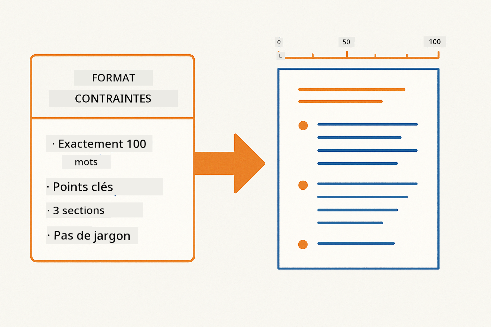
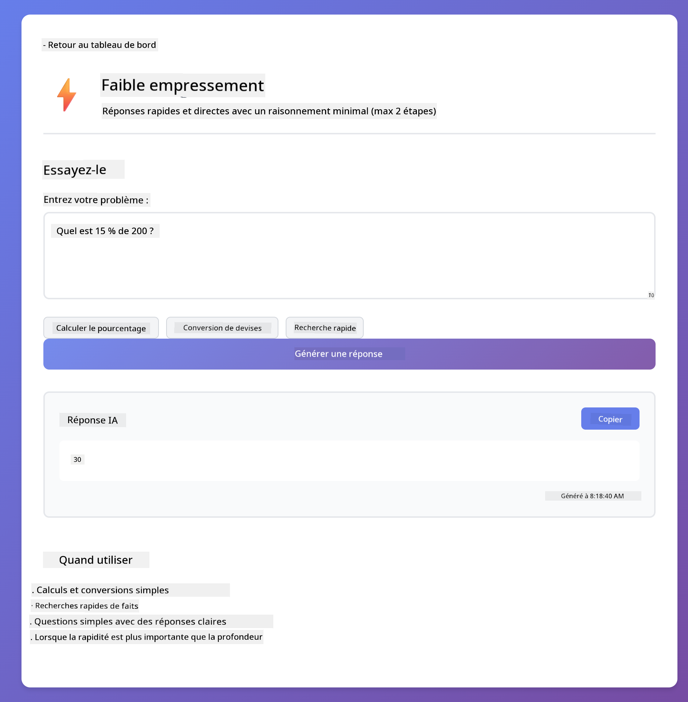
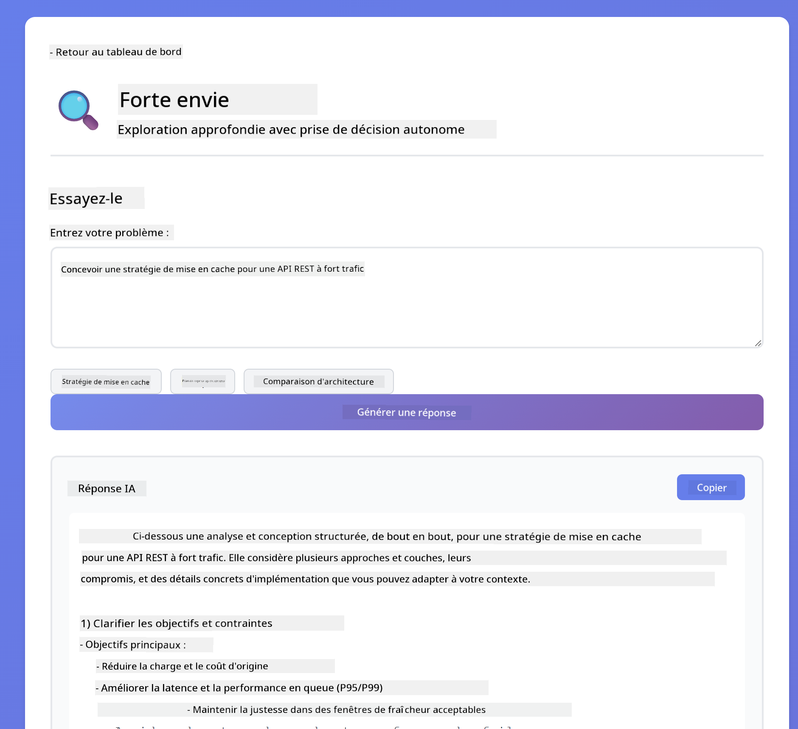
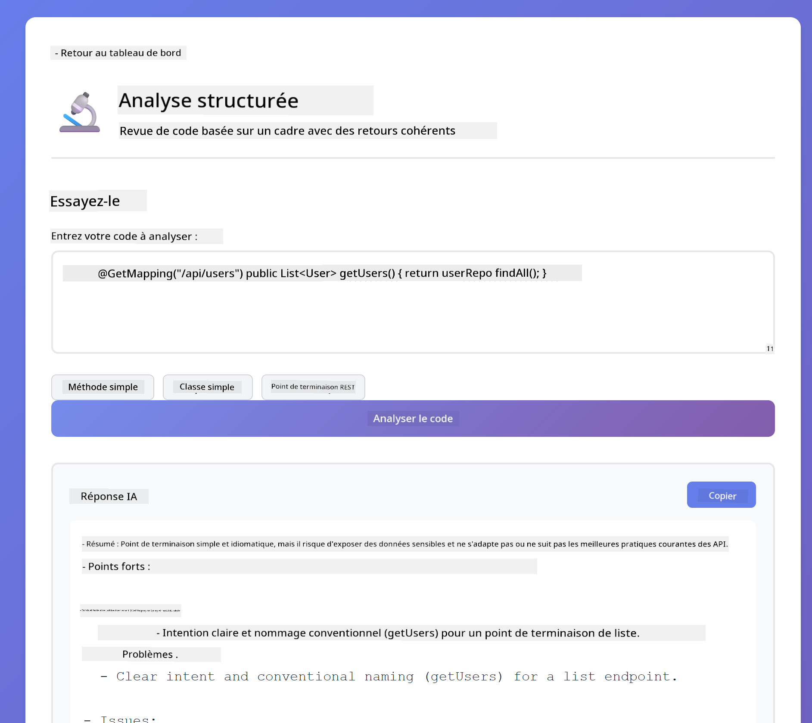
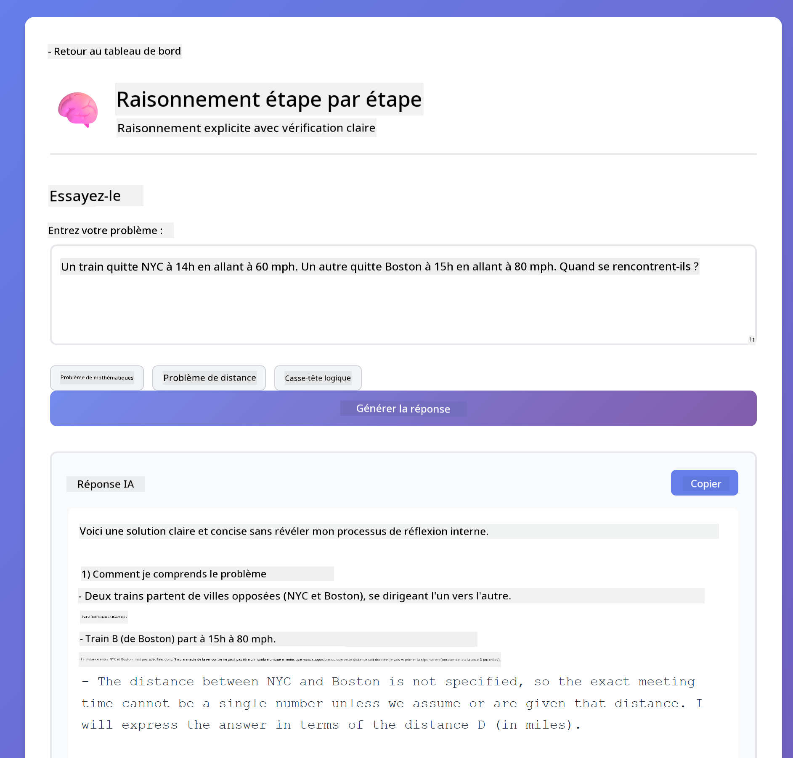
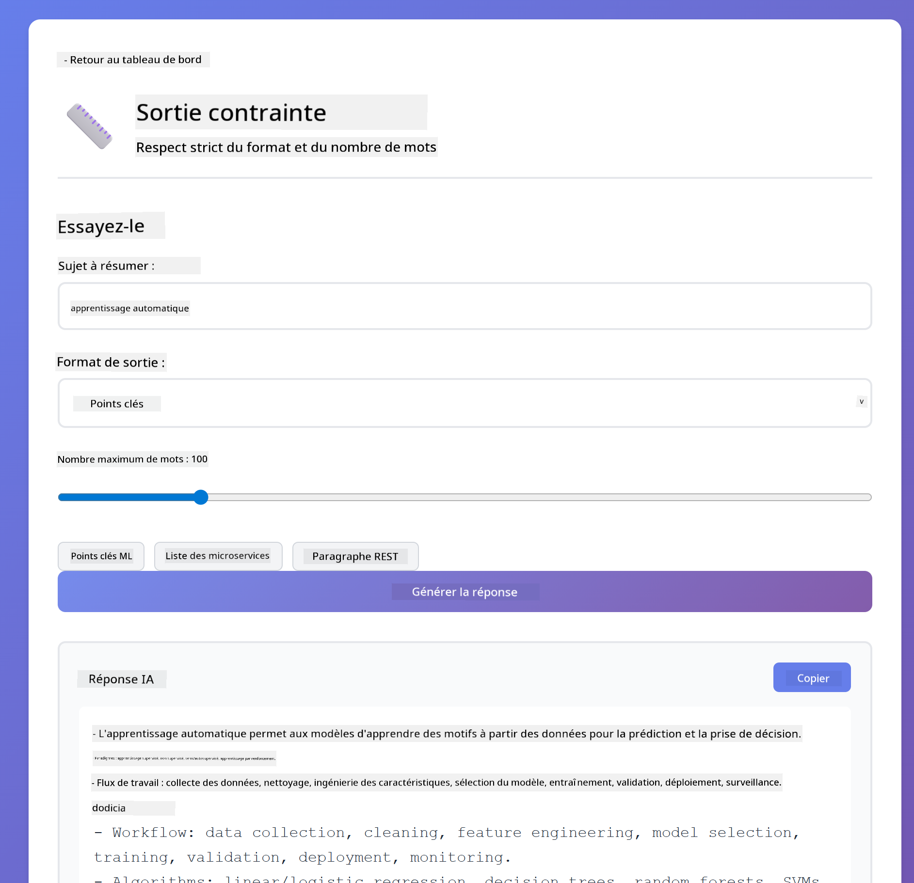

<!--
CO_OP_TRANSLATOR_METADATA:
{
  "original_hash": "8d787826cad7e92bf5cdbd116b1e6116",
  "translation_date": "2025-12-13T15:45:30+00:00",
  "source_file": "02-prompt-engineering/README.md",
  "language_code": "fr"
}
-->
# Module 02 : Ingénierie des invites avec GPT-5

## Table des matières

- [Ce que vous apprendrez](../../../02-prompt-engineering)
- [Prérequis](../../../02-prompt-engineering)
- [Comprendre l'ingénierie des invites](../../../02-prompt-engineering)
- [Comment cela utilise LangChain4j](../../../02-prompt-engineering)
- [Les modèles principaux](../../../02-prompt-engineering)
- [Utilisation des ressources Azure existantes](../../../02-prompt-engineering)
- [Captures d'écran de l'application](../../../02-prompt-engineering)
- [Explorer les modèles](../../../02-prompt-engineering)
  - [Faible vs forte impatience](../../../02-prompt-engineering)
  - [Exécution de tâches (préambules d'outils)](../../../02-prompt-engineering)
  - [Code auto-réfléchissant](../../../02-prompt-engineering)
  - [Analyse structurée](../../../02-prompt-engineering)
  - [Chat multi-tours](../../../02-prompt-engineering)
  - [Raisonnement étape par étape](../../../02-prompt-engineering)
  - [Sortie contrainte](../../../02-prompt-engineering)
- [Ce que vous apprenez vraiment](../../../02-prompt-engineering)
- [Étapes suivantes](../../../02-prompt-engineering)

## Ce que vous apprendrez

Dans le module précédent, vous avez vu comment la mémoire permet l'IA conversationnelle et utilisé les modèles GitHub pour des interactions basiques. Maintenant, nous allons nous concentrer sur la manière de poser des questions - les invites elles-mêmes - en utilisant GPT-5 d'Azure OpenAI. La façon dont vous structurez vos invites affecte considérablement la qualité des réponses que vous obtenez.

Nous utiliserons GPT-5 car il introduit un contrôle du raisonnement - vous pouvez indiquer au modèle combien de réflexion faire avant de répondre. Cela rend les différentes stratégies d'invite plus apparentes et vous aide à comprendre quand utiliser chaque approche. Nous bénéficierons également des limites de taux moins strictes d'Azure pour GPT-5 comparé aux modèles GitHub.

## Prérequis

- Module 01 terminé (ressources Azure OpenAI déployées)
- Fichier `.env` dans le répertoire racine avec les identifiants Azure (créé par `azd up` dans le Module 01)

> **Note :** Si vous n'avez pas terminé le Module 01, suivez d'abord les instructions de déploiement là-bas.

## Comprendre l'ingénierie des invites

L'ingénierie des invites consiste à concevoir un texte d'entrée qui vous donne systématiquement les résultats dont vous avez besoin. Ce n'est pas seulement poser des questions - c'est structurer les requêtes pour que le modèle comprenne exactement ce que vous voulez et comment le fournir.

Pensez-y comme donner des instructions à un collègue. "Corrige le bug" est vague. "Corrige l'exception de pointeur nul dans UserService.java ligne 45 en ajoutant une vérification de null" est précis. Les modèles de langage fonctionnent de la même manière - la spécificité et la structure comptent.

## Comment cela utilise LangChain4j

Ce module démontre des modèles avancés d'invites en utilisant la même base LangChain4j des modules précédents, avec un focus sur la structure des invites et le contrôle du raisonnement.


*Comment LangChain4j connecte vos invites à Azure OpenAI GPT-5*

**Dépendances** - Le Module 02 utilise les dépendances langchain4j suivantes définies dans `pom.xml` :
```xml
<dependency>
    <groupId>dev.langchain4j</groupId>
    <artifactId>langchain4j</artifactId> <!-- Inherited from BOM in root pom.xml -->
</dependency>
<dependency>
    <groupId>dev.langchain4j</groupId>
    <artifactId>langchain4j-open-ai-official</artifactId> <!-- Inherited from BOM in root pom.xml -->
</dependency>
```

**Configuration OpenAiOfficialChatModel** - [LangChainConfig.java](../../../02-prompt-engineering/src/main/java/com/example/langchain4j/prompts/config/LangChainConfig.java)

Le modèle de chat est configuré manuellement comme un bean Spring en utilisant le client officiel OpenAI, qui supporte les points de terminaison Azure OpenAI. La différence clé avec le Module 01 est la façon dont nous structurons les invites envoyées à `chatModel.chat()`, pas la configuration du modèle lui-même.

**Messages système et utilisateur** - [Gpt5PromptService.java](../../../02-prompt-engineering/src/main/java/com/example/langchain4j/prompts/service/Gpt5PromptService.java)

LangChain4j sépare les types de messages pour plus de clarté. `SystemMessage` définit le comportement et le contexte de l'IA (comme "Vous êtes un relecteur de code"), tandis que `UserMessage` contient la requête réelle. Cette séparation vous permet de maintenir un comportement IA cohérent à travers différentes requêtes utilisateur.

```java
SystemMessage systemMsg = SystemMessage.from(
    "You are a helpful Java programming expert."
);

UserMessage userMsg = UserMessage.from(
    "Explain what a List is in Java"
);

String response = chatModel.chat(systemMsg, userMsg);
```


*SystemMessage fournit un contexte persistant tandis que UserMessages contiennent les requêtes individuelles*

**MessageWindowChatMemory pour multi-tours** - Pour le modèle de conversation multi-tours, nous réutilisons `MessageWindowChatMemory` du Module 01. Chaque session obtient sa propre instance de mémoire stockée dans une `Map<String, ChatMemory>`, permettant plusieurs conversations simultanées sans mélange de contexte.

**Modèles d'invites** - Le vrai focus ici est l'ingénierie des invites, pas de nouvelles API LangChain4j. Chaque modèle (faible impatience, forte impatience, exécution de tâches, etc.) utilise la même méthode `chatModel.chat(prompt)` mais avec des chaînes d'invite soigneusement structurées. Les balises XML, instructions et formatages font tous partie du texte de l'invite, pas des fonctionnalités LangChain4j.

**Contrôle du raisonnement** - L'effort de raisonnement de GPT-5 est contrôlé via des instructions dans l'invite comme "maximum 2 étapes de raisonnement" ou "explorez en profondeur". Ce sont des techniques d'ingénierie des invites, pas des configurations LangChain4j. La bibliothèque se contente de transmettre vos invites au modèle.

Le point clé : LangChain4j fournit l'infrastructure (connexion au modèle via [LangChainConfig.java](../../../02-prompt-engineering/src/main/java/com/example/langchain4j/prompts/config/LangChainConfig.java), mémoire, gestion des messages via [Gpt5PromptService.java](../../../02-prompt-engineering/src/main/java/com/example/langchain4j/prompts/service/Gpt5PromptService.java)), tandis que ce module vous apprend à créer des invites efficaces dans cette infrastructure.

## Les modèles principaux

Tous les problèmes ne nécessitent pas la même approche. Certaines questions demandent des réponses rapides, d'autres une réflexion approfondie. Certaines nécessitent un raisonnement visible, d'autres juste des résultats. Ce module couvre huit modèles d'invites - chacun optimisé pour différents scénarios. Vous expérimenterez tous pour apprendre quand chaque approche fonctionne le mieux.


*Vue d'ensemble des huit modèles d'ingénierie des invites et leurs cas d'utilisation*


*Faible impatience (rapide, direct) vs forte impatience (approfondi, exploratoire) dans les approches de raisonnement*

**Faible impatience (rapide & ciblé)** - Pour les questions simples où vous voulez des réponses rapides et directes. Le modèle fait un raisonnement minimal - maximum 2 étapes. Utilisez ceci pour des calculs, recherches ou questions simples.

```java
String prompt = """
    <reasoning_effort>low</reasoning_effort>
    <instruction>maximum 2 reasoning steps</instruction>
    
    What is 15% of 200?
    """;

String response = chatModel.chat(prompt);
```

> 💡 **Explorez avec GitHub Copilot :** Ouvrez [`Gpt5PromptService.java`](../../../02-prompt-engineering/src/main/java/com/example/langchain4j/prompts/service/Gpt5PromptService.java) et demandez :
> - "Quelle est la différence entre les modèles d'invite à faible impatience et forte impatience ?"
> - "Comment les balises XML dans les invites aident-elles à structurer la réponse de l'IA ?"
> - "Quand devrais-je utiliser les modèles d'auto-réflexion vs les instructions directes ?"

**Forte impatience (profond & approfondi)** - Pour les problèmes complexes où vous voulez une analyse complète. Le modèle explore en profondeur et montre un raisonnement détaillé. Utilisez ceci pour la conception système, décisions d'architecture ou recherches complexes.

```java
String prompt = """
    <reasoning_effort>high</reasoning_effort>
    <instruction>explore thoroughly, show detailed reasoning</instruction>
    
    Design a caching strategy for a high-traffic REST API.
    """;

String response = chatModel.chat(prompt);
```

**Exécution de tâches (progression étape par étape)** - Pour les flux de travail en plusieurs étapes. Le modèle fournit un plan initial, narre chaque étape au fur et à mesure, puis donne un résumé. Utilisez ceci pour les migrations, implémentations ou tout processus multi-étapes.

```java
String prompt = """
    <task>Create a REST endpoint for user registration</task>
    <preamble>Provide an upfront plan</preamble>
    <narration>Narrate each step as you work</narration>
    <summary>Summarize what was accomplished</summary>
    """;

String response = chatModel.chat(prompt);
```

Le prompt Chain-of-Thought demande explicitement au modèle de montrer son processus de raisonnement, améliorant la précision pour les tâches complexes. La décomposition étape par étape aide humains et IA à comprendre la logique.

> **🤖 Essayez avec [GitHub Copilot](https://github.com/features/copilot) Chat :** Demandez à propos de ce modèle :
> - "Comment adapterais-je le modèle d'exécution de tâches pour des opérations longues ?"
> - "Quelles sont les meilleures pratiques pour structurer les préambules d'outils dans des applications en production ?"
> - "Comment capturer et afficher les mises à jour de progression intermédiaires dans une interface utilisateur ?"


*Planifier → Exécuter → Résumer le flux de travail pour les tâches multi-étapes*

**Code auto-réfléchissant** - Pour générer du code de qualité production. Le modèle génère du code, le vérifie selon des critères de qualité, et l'améliore itérativement. Utilisez ceci lors de la création de nouvelles fonctionnalités ou services.

```java
String prompt = """
    <task>Create an email validation service</task>
    <quality_criteria>
    - Correct logic and error handling
    - Best practices (clean code, proper naming)
    - Performance optimization
    - Security considerations
    </quality_criteria>
    <instruction>Generate code, evaluate against criteria, improve iteratively</instruction>
    """;

String response = chatModel.chat(prompt);
```


*Boucle d'amélioration itérative - générer, évaluer, identifier les problèmes, améliorer, répéter*

**Analyse structurée** - Pour une évaluation cohérente. Le modèle passe en revue le code en utilisant un cadre fixe (correction, pratiques, performance, sécurité). Utilisez ceci pour les revues de code ou évaluations qualité.

```java
String prompt = """
    <code>
    public List getUsers() {
        return database.query("SELECT * FROM users");
    }
    </code>
    
    <framework>
    Evaluate using these categories:
    1. Correctness - Logic and functionality
    2. Best Practices - Code quality
    3. Performance - Efficiency concerns
    4. Security - Vulnerabilities
    </framework>
    """;

String response = chatModel.chat(prompt);
```

> **🤖 Essayez avec [GitHub Copilot](https://github.com/features/copilot) Chat :** Demandez à propos de l'analyse structurée :
> - "Comment personnaliser le cadre d'analyse pour différents types de revues de code ?"
> - "Quelle est la meilleure façon d'analyser et d'agir sur une sortie structurée de manière programmatique ?"
> - "Comment assurer des niveaux de gravité cohérents à travers différentes sessions de revue ?"


*Cadre à quatre catégories pour des revues de code cohérentes avec niveaux de gravité*

**Chat multi-tours** - Pour les conversations nécessitant du contexte. Le modèle se souvient des messages précédents et construit dessus. Utilisez ceci pour des sessions d'aide interactives ou Q&A complexes.

```java
ChatMemory memory = MessageWindowChatMemory.withMaxMessages(10);

memory.add(UserMessage.from("What is Spring Boot?"));
AiMessage aiMessage1 = chatModel.chat(memory.messages()).aiMessage();
memory.add(aiMessage1);

memory.add(UserMessage.from("Show me an example"));
AiMessage aiMessage2 = chatModel.chat(memory.messages()).aiMessage();
memory.add(aiMessage2);
```


*Comment le contexte de la conversation s'accumule sur plusieurs tours jusqu'à atteindre la limite de tokens*

**Raisonnement étape par étape** - Pour les problèmes nécessitant une logique visible. Le modèle montre un raisonnement explicite pour chaque étape. Utilisez ceci pour des problèmes mathématiques, puzzles logiques, ou quand vous devez comprendre le processus de pensée.

```java
String prompt = """
    <instruction>Show your reasoning step-by-step</instruction>
    
    If a train travels 120 km in 2 hours, then stops for 30 minutes,
    then travels another 90 km in 1.5 hours, what is the average speed
    for the entire journey including the stop?
    """;

String response = chatModel.chat(prompt);
```


*Décomposer les problèmes en étapes logiques explicites*

**Sortie contrainte** - Pour des réponses avec des exigences spécifiques de format. Le modèle suit strictement les règles de format et de longueur. Utilisez ceci pour des résumés ou quand vous avez besoin d'une structure de sortie précise.

```java
String prompt = """
    <constraints>
    - Exactly 100 words
    - Bullet point format
    - Technical terms only
    </constraints>
    
    Summarize the key concepts of machine learning.
    """;

String response = chatModel.chat(prompt);
```



*Imposition de règles spécifiques de format, longueur et structure*

## Utilisation des ressources Azure existantes

**Vérifier le déploiement :**

Assurez-vous que le fichier `.env` existe dans le répertoire racine avec les identifiants Azure (créé lors du Module 01) :
```bash
cat ../.env  # Devrait afficher AZURE_OPENAI_ENDPOINT, API_KEY, DEPLOYMENT
```

**Démarrer l'application :**

> **Note :** Si vous avez déjà démarré toutes les applications avec `./start-all.sh` du Module 01, ce module est déjà en cours d'exécution sur le port 8083. Vous pouvez ignorer les commandes de démarrage ci-dessous et aller directement sur http://localhost:8083.

**Option 1 : Utiliser le Spring Boot Dashboard (recommandé pour les utilisateurs VS Code)**

Le conteneur de développement inclut l'extension Spring Boot Dashboard, qui fournit une interface visuelle pour gérer toutes les applications Spring Boot. Vous la trouverez dans la barre d'activité à gauche de VS Code (cherchez l'icône Spring Boot).

Depuis le Spring Boot Dashboard, vous pouvez :
- Voir toutes les applications Spring Boot disponibles dans l'espace de travail
- Démarrer/arrêter les applications en un clic
- Voir les logs des applications en temps réel
- Surveiller l'état des applications

Cliquez simplement sur le bouton lecture à côté de "prompt-engineering" pour démarrer ce module, ou démarrez tous les modules en même temps.


**Option 2 : Utiliser les scripts shell**

Démarrer toutes les applications web (modules 01-04) :

**Bash :**
```bash
cd ..  # Depuis le répertoire racine
./start-all.sh
```

**PowerShell :**
```powershell
cd ..  # Depuis le répertoire racine
.\start-all.ps1
```

Ou démarrer uniquement ce module :

**Bash :**
```bash
cd 02-prompt-engineering
./start.sh
```

**PowerShell :**
```powershell
cd 02-prompt-engineering
.\start.ps1
```

Les deux scripts chargent automatiquement les variables d'environnement depuis le fichier `.env` racine et construiront les JARs s'ils n'existent pas.

> **Note :** Si vous préférez construire manuellement tous les modules avant de démarrer :
>
> **Bash :**
> ```bash
> cd ..  # Go to root directory
> mvn clean package -DskipTests
> ```
>
> **PowerShell :**
> ```powershell
> cd ..  # Go to root directory
> mvn clean package -DskipTests
> ```

Ouvrez http://localhost:8083 dans votre navigateur.

**Pour arrêter :**

**Bash :**
```bash
./stop.sh  # Ce module uniquement
# Ou
cd .. && ./stop-all.sh  # Tous les modules
```

**PowerShell :**
```powershell
.\stop.ps1  # Ce module uniquement
# Ou
cd ..; .\stop-all.ps1  # Tous les modules
```

## Captures d'écran de l'application


*Le tableau de bord principal montrant les 8 modèles d'ingénierie des invites avec leurs caractéristiques et cas d'utilisation*

## Explorer les modèles

L'interface web vous permet d'expérimenter différentes stratégies d'invite. Chaque modèle résout des problèmes différents - essayez-les pour voir quand chaque approche est la plus efficace.

### Faible vs forte impatience

Posez une question simple comme "Quel est 15 % de 200 ?" en utilisant Faible impatience. Vous obtiendrez une réponse instantanée et directe. Maintenant posez quelque chose de complexe comme "Concevez une stratégie de mise en cache pour une API à fort trafic" en utilisant Forte impatience. Regardez comment le modèle ralentit et fournit un raisonnement détaillé. Même modèle, même structure de question - mais l'invite lui dit combien réfléchir.


*Calcul rapide avec un raisonnement minimal*



*Stratégie de mise en cache complète (2,8 Mo)*

### Exécution de tâche (Préambules d'outil)

Les workflows à étapes multiples bénéficient d'une planification préalable et d'une narration des progrès. Le modèle décrit ce qu'il va faire, narre chaque étape, puis résume les résultats.


*Création d'un point de terminaison REST avec narration étape par étape (3,9 Mo)*

### Code auto-réfléchi

Essayez "Créer un service de validation d'email". Au lieu de simplement générer du code et s'arrêter, le modèle génère, évalue selon des critères de qualité, identifie les faiblesses, et améliore. Vous le verrez itérer jusqu'à ce que le code atteigne les standards de production.


*Service complet de validation d'email (5,2 Mo)*

### Analyse structurée

Les revues de code nécessitent des cadres d'évaluation cohérents. Le modèle analyse le code en utilisant des catégories fixes (exactitude, pratiques, performance, sécurité) avec des niveaux de gravité.



*Revue de code basée sur un cadre*

### Chat multi-tours

Demandez "Qu'est-ce que Spring Boot ?" puis immédiatement "Montre-moi un exemple". Le modèle se souvient de votre première question et vous donne un exemple spécifique de Spring Boot. Sans mémoire, cette deuxième question serait trop vague.


*Préservation du contexte entre les questions*

### Raisonnement étape par étape

Choisissez un problème mathématique et essayez-le avec Raisonnement étape par étape et Faible motivation. La faible motivation vous donne juste la réponse - rapide mais opaque. Le raisonnement étape par étape vous montre chaque calcul et décision.



*Problème mathématique avec étapes explicites*

### Sortie contrainte

Quand vous avez besoin de formats spécifiques ou de nombre de mots, ce modèle impose une stricte conformité. Essayez de générer un résumé avec exactement 100 mots en format liste à puces.



*Résumé d'apprentissage automatique avec contrôle du format*

## Ce que vous apprenez vraiment

**L'effort de raisonnement change tout**

GPT-5 vous permet de contrôler l'effort computationnel via vos invites. Un faible effort signifie des réponses rapides avec une exploration minimale. Un effort élevé signifie que le modèle prend le temps de réfléchir profondément. Vous apprenez à adapter l'effort à la complexité de la tâche - ne perdez pas de temps sur des questions simples, mais ne précipitez pas non plus les décisions complexes.

**La structure guide le comportement**

Vous remarquez les balises XML dans les invites ? Elles ne sont pas décoratives. Les modèles suivent des instructions structurées plus fiablement que du texte libre. Quand vous avez besoin de processus à étapes multiples ou de logique complexe, la structure aide le modèle à suivre où il en est et ce qui vient ensuite.


*Anatomie d'une invite bien structurée avec sections claires et organisation de style XML*

**Qualité par auto-évaluation**

Les modèles auto-réfléchissants fonctionnent en rendant explicites les critères de qualité. Au lieu d'espérer que le modèle "fasse bien", vous lui dites exactement ce que signifie "bien" : logique correcte, gestion des erreurs, performance, sécurité. Le modèle peut alors évaluer sa propre sortie et s'améliorer. Cela transforme la génération de code d'une loterie en un processus.

**Le contexte est fini**

Les conversations multi-tours fonctionnent en incluant l'historique des messages à chaque requête. Mais il y a une limite - chaque modèle a un nombre maximal de tokens. À mesure que les conversations grandissent, vous aurez besoin de stratégies pour garder le contexte pertinent sans atteindre ce plafond. Ce module vous montre comment fonctionne la mémoire ; plus tard vous apprendrez quand résumer, quand oublier, et quand récupérer.

## Prochaines étapes

**Module suivant :** [03-rag - RAG (Génération augmentée par récupération)](../03-rag/README.md)

---

**Navigation :** [← Précédent : Module 01 - Introduction](../01-introduction/README.md) | [Retour au principal](../README.md) | [Suivant : Module 03 - RAG →](../03-rag/README.md)

---

<!-- CO-OP TRANSLATOR DISCLAIMER START -->
**Avertissement** :  
Ce document a été traduit à l’aide du service de traduction automatique [Co-op Translator](https://github.com/Azure/co-op-translator). Bien que nous nous efforcions d’assurer l’exactitude, veuillez noter que les traductions automatiques peuvent contenir des erreurs ou des inexactitudes. Le document original dans sa langue d’origine doit être considéré comme la source faisant foi. Pour les informations critiques, une traduction professionnelle réalisée par un humain est recommandée. Nous déclinons toute responsabilité en cas de malentendus ou de mauvaises interprétations résultant de l’utilisation de cette traduction.
<!-- CO-OP TRANSLATOR DISCLAIMER END -->