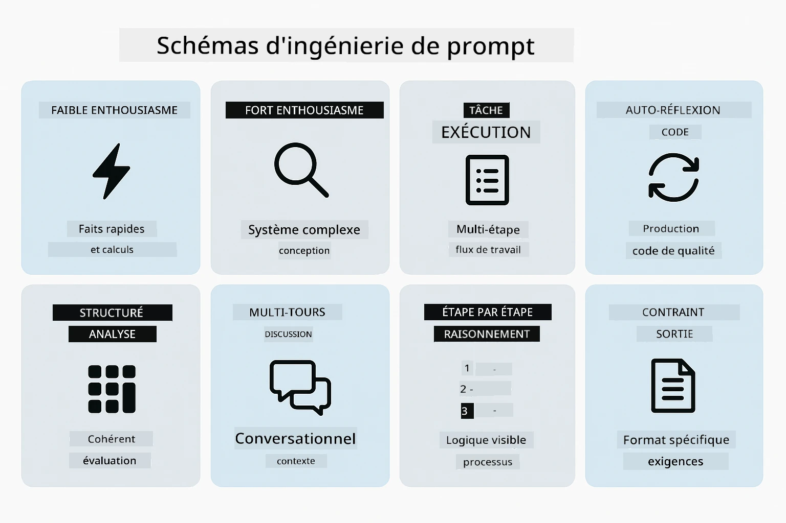
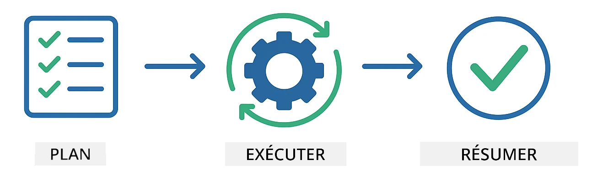
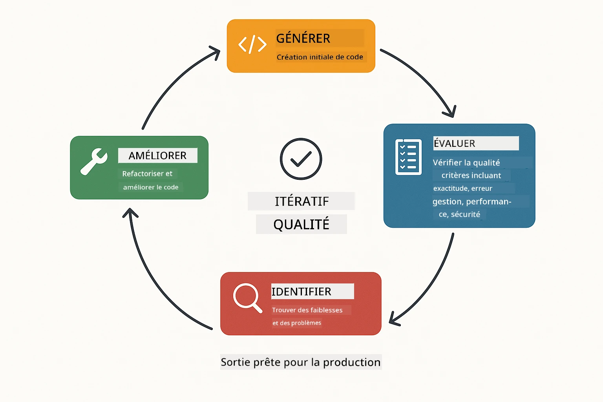
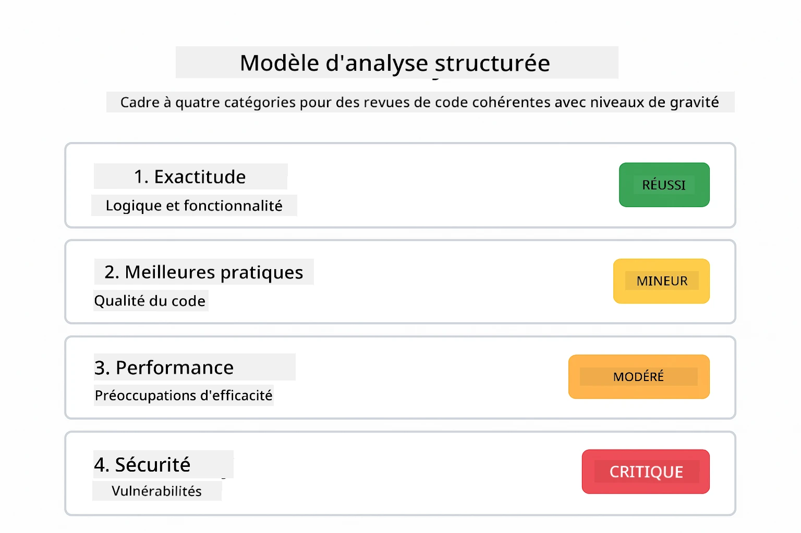
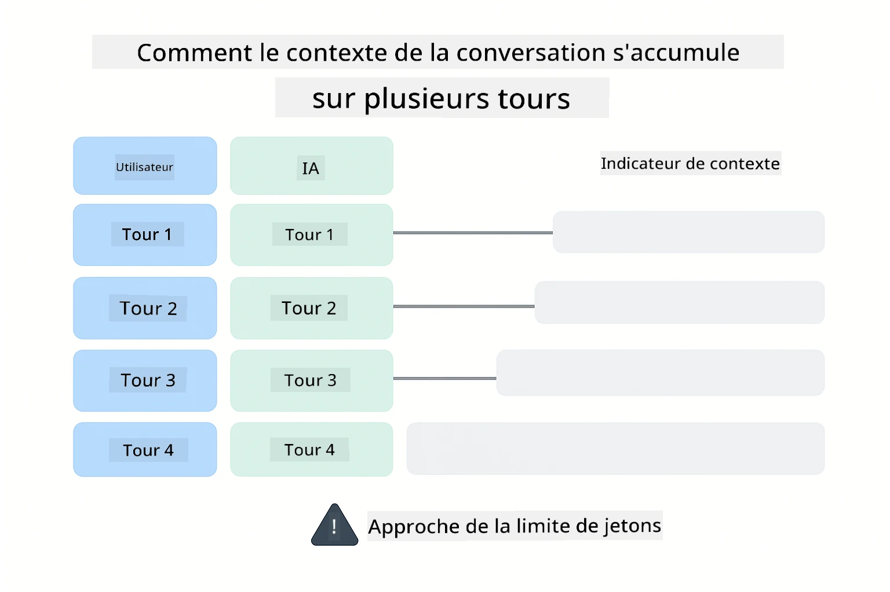
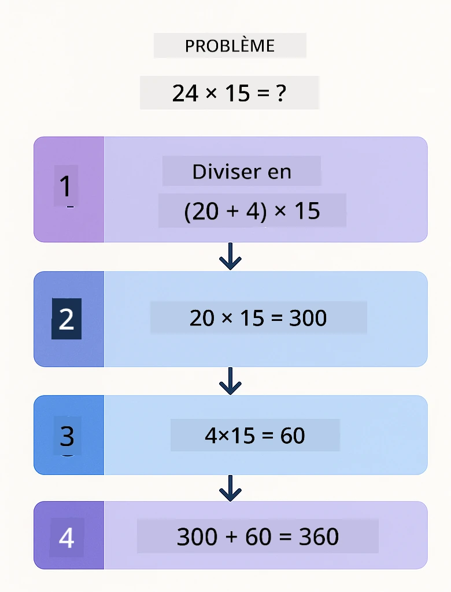
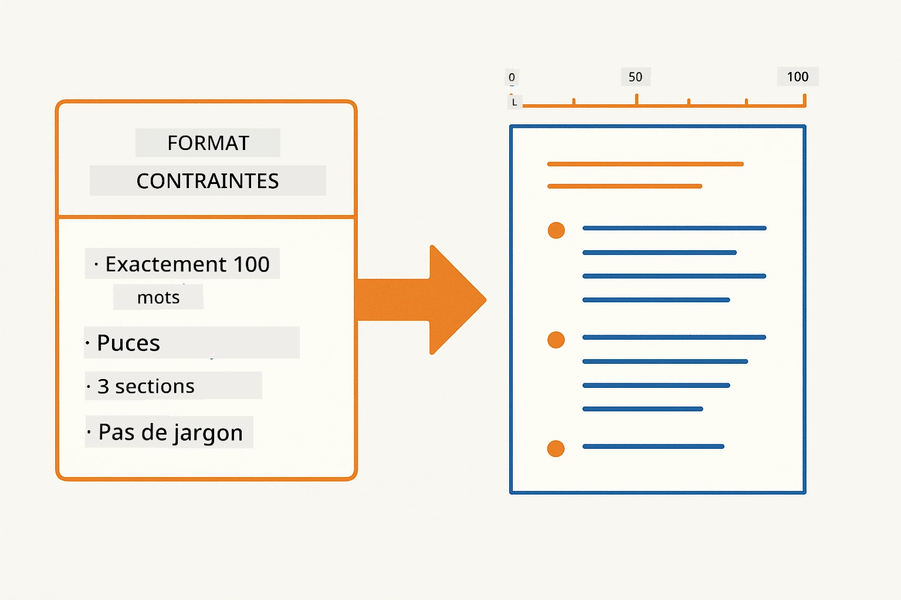
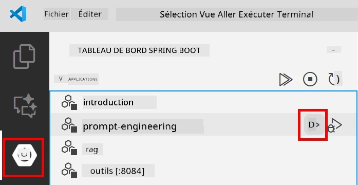
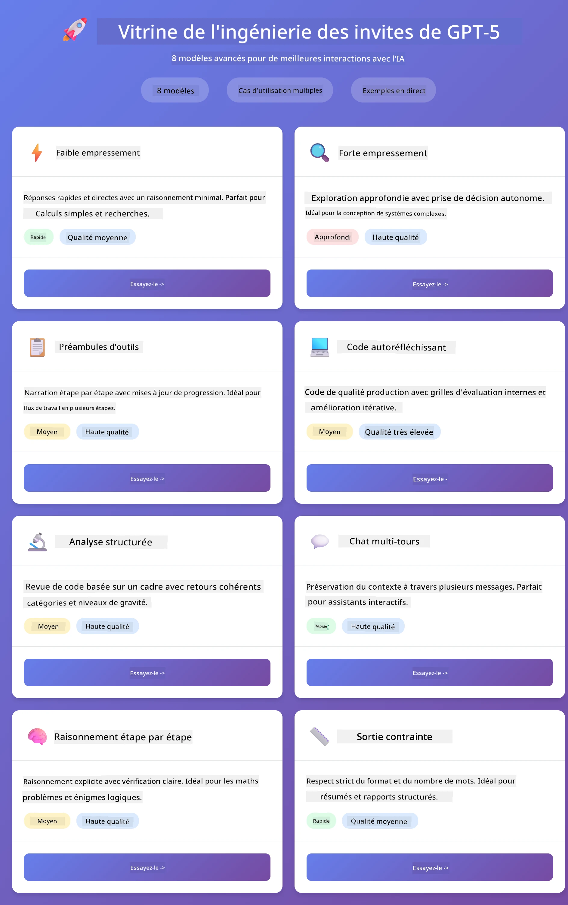
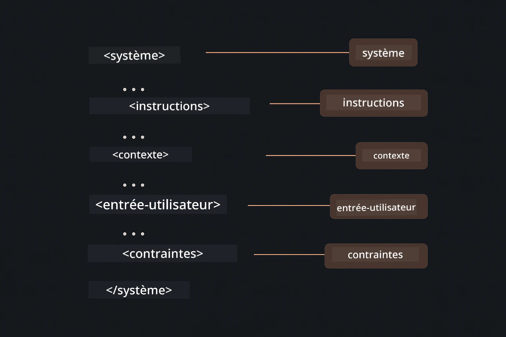

# Module 02 : Ingénierie des invites avec GPT-5.2

## Table des matières

- [Présentation vidéo](#présentation-vidéo)
- [Ce que vous allez apprendre](#ce-que-vous-allez-apprendre)
- [Prérequis](#prérequis)
- [Comprendre l'ingénierie des invites](#comprendre-lingénierie-des-invites)
- [Fondamentaux de l'ingénierie des invites](#fondamentaux-de-lingénierie-des-invites)
  - [Invites zéro-coup](#invites-zéro-coup)
  - [Invites à quelques exemples](#invites-à-quelques-exemples)
  - [Chaîne de pensée](#chaîne-de-pensée)
  - [Invites basées sur un rôle](#invites-basées-sur-un-rôle)
  - [Modèles d'invites](#modèles-dinvites)
- [Modèles avancés](#modèles-avancés)
- [Exécuter l'application](#exécuter-l’application)
- [Captures d'écran de l'application](#captures-d’écran-de-l’application)
- [Explorer les modèles](#exploration-des-motifs)
  - [Faible vs forte motivation](#faible-vs-forte-implication)
  - [Exécution des tâches (préambules d’outils)](#exécution-de-tâches-préambules-d’outil)
  - [Code auto-réfléchi](#code-auto-réfléchi)
  - [Analyse structurée](#analyse-structurée)
  - [Chat multi-interactions](#chat-multi-tour)
  - [Raisonnement étape par étape](#raisonnement-étape-par-étape)
  - [Sortie contrainte](#sortie-contraint)
- [Ce que vous apprenez réellement](#ce-que-vous-apprenez-vraiment)
- [Étapes suivantes](#étapes-suivantes)

## Présentation vidéo

Regardez cette session en direct qui explique comment démarrer avec ce module :

<a href="https://www.youtube.com/live/PJ6aBaE6bog?si=LDshyBrTRodP-wke"></a>

## Ce que vous allez apprendre

Le diagramme suivant offre un aperçu des thèmes clés et des compétences que vous développerez dans ce module — des techniques de raffinement d’invites au flux de travail étape par étape que vous suivrez.


Dans le module précédent, vous avez vu comment la mémoire permet l’IA conversationnelle avec Azure OpenAI. Maintenant, nous allons nous concentrer sur la façon dont vous posez les questions — les invites elles-mêmes — en utilisant GPT-5.2 d’Azure OpenAI. La manière dont vous structurez vos invites influence fortement la qualité des réponses obtenues. Nous commençons par une revue des techniques fondamentales d’invite, puis passons à huit modèles avancés qui tirent pleinement parti des capacités de GPT-5.2.

Nous utilisons GPT-5.2 car il introduit un contrôle du raisonnement — vous pouvez indiquer au modèle combien de réflexion effectuer avant de répondre. Cela rend les différentes stratégies d’invite plus évidentes et vous aide à comprendre quand utiliser chaque approche.

## Prérequis

- Module 01 terminé (ressources Azure OpenAI déployées)
- Fichier `.env` à la racine avec les identifiants Azure (créé par `azd up` dans le Module 01)

> **Note :** Si vous n’avez pas terminé le Module 01, suivez d’abord les instructions de déploiement indiquées là-bas.

## Comprendre l'ingénierie des invites

Fondamentalement, l’ingénierie des invites est ce qui différencie des instructions vagues d’instructions précises, comme l’illustre la comparaison ci-dessous.


L’ingénierie des invites consiste à concevoir un texte d’entrée qui vous donne systématiquement les résultats souhaités. Ce n’est pas seulement poser des questions — c’est structurer les requêtes pour que le modèle comprenne exactement ce que vous voulez et comment le fournir.

Pensez-y comme donner des instructions à un collègue. "Corrige le bug" est vague. "Corrige l’exception de pointeur nul dans UserService.java ligne 45 en ajoutant une vérification de null" est précis. Les modèles linguistiques fonctionnent de la même manière — la précision et la structure comptent.

Le diagramme ci-dessous montre comment LangChain4j s’intègre dans ce cadre — en connectant vos modèles d’invites au modèle via les blocs `SystemMessage` et `UserMessage`.


LangChain4j fournit l’infrastructure — connexions au modèle, mémoire et types de messages — tandis que les modèles d’invites ne sont que des textes soigneusement structurés que vous envoyez via cette infrastructure. Les éléments clés sont `SystemMessage` (qui définit le comportement et le rôle de l’IA) et `UserMessage` (qui contient votre requête réelle).

## Fondamentaux de l'ingénierie des invites

Les cinq techniques principales ci-dessous forment la base d’une ingénierie des invites efficace. Chacune couvre un aspect différent de la communication avec les modèles linguistiques.


Avant d’aborder les modèles avancés de ce module, passons en revue cinq techniques fondamentales d’invite. Ce sont les blocs de construction que tout ingénieur d’invites doit connaître.

### Invites zéro-coup

L’approche la plus simple : donner une instruction directe au modèle sans exemples. Le modèle s’appuie entièrement sur son entraînement pour comprendre et exécuter la tâche. Cela fonctionne bien pour des requêtes simples où le comportement attendu est évident.


*Instruction directe sans exemples — le modèle infère la tâche à partir de l’instruction seule*

```java
String prompt = "Classify this sentiment: 'I absolutely loved the movie!'";
String response = model.chat(prompt);
// Réponse : « Positive »
```

**Quand utiliser :** Classifications simples, questions directes, traductions ou toute tâche que le modèle peut gérer sans guidance supplémentaire.

### Invites à quelques exemples

Fournissez des exemples qui montrent le modèle le modèle à suivre. Le modèle apprend le format attendu entrée-sortie à partir de vos exemples et l’applique aux nouvelles entrées. Cela améliore considérablement la cohérence pour les tâches où le format ou le comportement souhaité n’est pas évident.


*Apprentissage par exemples — le modèle identifie le modèle et l’applique à de nouvelles entrées*

```java
String prompt = """
    Classify the sentiment as positive, negative, or neutral.
    
    Examples:
    Text: "This product exceeded my expectations!" → Positive
    Text: "It's okay, nothing special." → Neutral
    Text: "Waste of money, very disappointed." → Negative
    
    Now classify this:
    Text: "Best purchase I've made all year!"
    """;
String response = model.chat(prompt);
```

**Quand utiliser :** Classifications personnalisées, formatage cohérent, tâches spécifiques au domaine, ou quand les résultats zéro-coup sont incohérents.

### Chaîne de pensée

Demandez au modèle de montrer son raisonnement étape par étape. Au lieu de passer directement à une réponse, le modèle décompose le problème et traite chaque partie explicitement. Cela améliore la précision sur les tâches de mathématiques, logique et raisonnement en plusieurs étapes.


*Raisonnement étape par étape — décomposer les problèmes complexes en étapes logiques explicites*

```java
String prompt = """
    Problem: A store has 15 apples. They sell 8 apples and then 
    receive a shipment of 12 more apples. How many apples do they have now?
    
    Let's solve this step-by-step:
    """;
String response = model.chat(prompt);
// Le modèle montre : 15 - 8 = 7, puis 7 + 12 = 19 pommes
```

**Quand utiliser :** Problèmes mathématiques, casse-tête logiques, débogage, ou toute tâche où montrer le processus de raisonnement améliore la précision et la confiance.

### Invites basées sur un rôle

Attribuez un personnage ou un rôle à l’IA avant de poser votre question. Cela fournit un contexte qui façonne le ton, la profondeur et le focus de la réponse. Un « architecte logiciel » donne des conseils différents d’un « développeur junior » ou d’un « auditeur sécurité ».


*Définition du contexte et du personnage — une même question reçoit une réponse différente selon le rôle assigné*

```java
String prompt = """
    You are an experienced software architect reviewing code.
    Provide a brief code review for this function:
    
    def calculate_total(items):
        total = 0
        for item in items:
            total = total + item['price']
        return total
    """;
String response = model.chat(prompt);
```

**Quand utiliser :** Revue de code, tutorat, analyse spécifique au domaine, ou quand vous avez besoin de réponses adaptées à un niveau d’expertise ou perspective particulière.

### Modèles d'invites

Créez des invites réutilisables avec des espaces réservés variables. Au lieu d’écrire une nouvelle invite à chaque fois, définissez un modèle une fois et remplissez-le avec différentes valeurs. La classe `PromptTemplate` de LangChain4j facilite cela avec la syntaxe `{{variable}}`.


*Invites réutilisables avec espaces réservés variables — un modèle, de nombreuses utilisations*

```java
PromptTemplate template = PromptTemplate.from(
    "What's the best time to visit {{destination}} for {{activity}}?"
);

Prompt prompt = template.apply(Map.of(
    "destination", "Paris",
    "activity", "sightseeing"
));

String response = model.chat(prompt.text());
```

**Quand utiliser :** Requêtes répétées avec différentes entrées, traitement par lots, construction de flux de travail IA réutilisables, ou tout scénario où la structure d’invite reste la même mais les données changent.

---

Ces cinq fondamentaux vous donnent une boîte à outils solide pour la plupart des tâches d’invite. Le reste de ce module s’appuie dessus avec **huit modèles avancés** qui exploitent le contrôle du raisonnement, l’auto-évaluation et les capacités de sortie structurée de GPT-5.2.

## Modèles avancés

Avec les fondamentaux couverts, passons aux huit modèles avancés qui rendent ce module unique. Tous les problèmes ne nécessitent pas la même approche. Certaines questions requièrent des réponses rapides, d’autres une réflexion approfondie. Certaines ont besoin d’un raisonnement visible, d’autres seulement des résultats. Chaque modèle ci-dessous est optimisé pour un scénario différent — et le contrôle du raisonnement de GPT-5.2 accentue encore ces différences.



*Vue d’ensemble des huit modèles d’ingénierie des invites et leurs cas d’utilisation*

GPT-5.2 ajoute une dimension supplémentaire à ces modèles : *le contrôle du raisonnement*. Le curseur ci-dessous montre comment vous pouvez ajuster l’effort de réflexion du modèle — de réponses rapides et directes à une analyse profonde et minutieuse.


*Le contrôle du raisonnement de GPT-5.2 vous permet de spécifier combien de réflexion le modèle doit effectuer — des réponses rapides et directes à une exploration approfondie*

**Faible motivation (Rapide & ciblé)** – Pour les questions simples où vous souhaitez des réponses rapides et directes. Le modèle fait un minimum de raisonnement — maximum 2 étapes. Utilisez ceci pour des calculs, des consultations ou des questions simples.

```java
String prompt = """
    <context_gathering>
    - Search depth: very low
    - Bias strongly towards providing a correct answer as quickly as possible
    - Usually, this means an absolute maximum of 2 reasoning steps
    - If you think you need more time, state what you know and what's uncertain
    </context_gathering>
    
    Problem: What is 15% of 200?
    
    Provide your answer:
    """;

String response = chatModel.chat(prompt);
```

> 💡 **Explorez avec GitHub Copilot :** Ouvrez [`Gpt5PromptService.java`](../../../02-prompt-engineering/src/main/java/com/example/langchain4j/prompts/service/Gpt5PromptService.java) et demandez :
> - « Quelle est la différence entre les modèles d’invite à faible et haute motivation ? »
> - « Comment les balises XML dans les invites aident-elles à structurer la réponse de l’IA ? »
> - « Quand dois-je utiliser les modèles d’auto-réflexion vs l’instruction directe ? »

**Haute motivation (Profond & minutieux)** – Pour les problèmes complexes où vous souhaitez une analyse complète. Le modèle explore en profondeur et montre un raisonnement détaillé. Utilisez ceci pour la conception système, les décisions d’architecture ou la recherche complexe.

```java
String prompt = """
    Analyze this problem thoroughly and provide a comprehensive solution.
    Consider multiple approaches, trade-offs, and important details.
    Show your analysis and reasoning in your response.
    
    Problem: Design a caching strategy for a high-traffic REST API.
    """;

String response = chatModel.chat(prompt);
```

**Exécution des tâches (Progression étape par étape)** – Pour les flux de travail en plusieurs étapes. Le modèle fournit un plan initial, raconte chaque étape pendant qu’il travaille, puis donne un résumé. Utilisez ceci pour les migrations, les implémentations ou tout processus en plusieurs étapes.

```java
String prompt = """
    <task_execution>
    1. First, briefly restate the user's goal in a friendly way
    
    2. Create a step-by-step plan:
       - List all steps needed
       - Identify potential challenges
       - Outline success criteria
    
    3. Execute each step:
       - Narrate what you're doing
       - Show progress clearly
       - Handle any issues that arise
    
    4. Summarize:
       - What was completed
       - Any important notes
       - Next steps if applicable
    </task_execution>
    
    <tool_preambles>
    - Always begin by rephrasing the user's goal clearly
    - Outline your plan before executing
    - Narrate each step as you go
    - Finish with a distinct summary
    </tool_preambles>
    
    Task: Create a REST endpoint for user registration
    
    Begin execution:
    """;

String response = chatModel.chat(prompt);
```

L’invite chaîne de pensée demande explicitement au modèle de montrer son raisonnement, améliorant ainsi la précision sur les tâches complexes. La décomposition étape par étape aide aussi bien les humains que l’IA à comprendre la logique.

> **🤖 Essayez avec [GitHub Copilot](https://github.com/features/copilot) Chat :** Posez des questions sur ce modèle :
> - « Comment adapterais-je le modèle d’exécution des tâches pour les opérations de longue durée ? »
> - « Quelles sont les bonnes pratiques pour structurer les préambules d’outils dans des applications en production ? »
> - « Comment capturer et afficher les mises à jour de progression intermédiaires dans une interface utilisateur ? »

Le schéma ci-dessous illustre ce flux Planifier → Exécuter → Résumer.



*Flux Planifier → Exécuter → Résumer pour les tâches en plusieurs étapes*

**Code auto-réfléchi** – Pour générer du code de qualité production. Le modèle génère du code suivant les standards de production avec une gestion adéquate des erreurs. Utilisez ceci lors de la création de nouvelles fonctionnalités ou services.

```java
String prompt = """
    Generate Java code with production-quality standards: Create an email validation service
    Keep it simple and include basic error handling.
    """;

String response = chatModel.chat(prompt);
```

Le diagramme ci-dessous montre cette boucle d’amélioration itérative — générer, évaluer, identifier les faiblesses, affiner jusqu’à ce que le code réponde aux standards de production.



*Boucle d’amélioration itérative - générer, évaluer, identifier les problèmes, améliorer, répéter*

**Analyse structurée** – Pour une évaluation cohérente. Le modèle passe en revue le code selon un cadre fixe (exactitude, bonnes pratiques, performance, sécurité, maintenabilité). Utilisez ceci pour les revues de code ou évaluations qualité.

```java
String prompt = """
    <analysis_framework>
    You are an expert code reviewer. Analyze the code for:
    
    1. Correctness
       - Does it work as intended?
       - Are there logical errors?
    
    2. Best Practices
       - Follows language conventions?
       - Appropriate design patterns?
    
    3. Performance
       - Any inefficiencies?
       - Scalability concerns?
    
    4. Security
       - Potential vulnerabilities?
       - Input validation?
    
    5. Maintainability
       - Code clarity?
       - Documentation?
    
    <output_format>
    Provide your analysis in this structure:
    - Summary: One-sentence overall assessment
    - Strengths: 2-3 positive points
    - Issues: List any problems found with severity (High/Medium/Low)
    - Recommendations: Specific improvements
    </output_format>
    </analysis_framework>
    
    Code to analyze:
    ```
    public List getUsers() {
        return database.query("SELECT * FROM users");
    }
    ```
    Provide your structured analysis:
    """;

String response = chatModel.chat(prompt);
```

> **🤖 Essayez avec [GitHub Copilot](https://github.com/features/copilot) Chat :** Posez des questions sur l’analyse structurée :
> - « Comment personnaliser le cadre d’analyse pour différents types de revues de code ? »
> - « Quelle est la meilleure méthode pour analyser et agir sur une sortie structurée de manière programmatique ? »
> - « Comment garantir des niveaux de gravité cohérents à travers différentes sessions de revue ? »

Le diagramme suivant montre comment ce cadre structuré organise une revue de code en catégories cohérentes avec des niveaux de gravité.



*Cadre pour des revues de code cohérentes avec niveaux de gravité*

**Chat multi-interactions** – Pour les conversations qui ont besoin de contexte. Le modèle se souvient des messages précédents et s’appuie dessus. Utilisez ceci pour des sessions d’aide interactives ou des questions-réponses complexes.

```java
ChatMemory memory = MessageWindowChatMemory.withMaxMessages(10);

memory.add(UserMessage.from("What is Spring Boot?"));
AiMessage aiMessage1 = chatModel.chat(memory.messages()).aiMessage();
memory.add(aiMessage1);

memory.add(UserMessage.from("Show me an example"));
AiMessage aiMessage2 = chatModel.chat(memory.messages()).aiMessage();
memory.add(aiMessage2);
```

Le diagramme ci-dessous visualise comment le contexte d’une conversation s’accumule à chaque tour et comment cela se rapporte à la limite de tokens du modèle.



*Comment le contexte de la conversation s’accumule sur plusieurs échanges jusqu’à atteindre la limite de tokens*

**Raisonnement étape par étape** – Pour les problèmes nécessitant une logique visible. Le modèle montre un raisonnement explicite à chaque étape. Utilisez ceci pour les problèmes mathématiques, puzzles logiques, ou quand vous devez comprendre le processus de réflexion.

```java
String prompt = """
    <instruction>Show your reasoning step-by-step</instruction>
    
    If a train travels 120 km in 2 hours, then stops for 30 minutes,
    then travels another 90 km in 1.5 hours, what is the average speed
    for the entire journey including the stop?
    """;

String response = chatModel.chat(prompt);
```

Le diagramme ci-dessous illustre comment le modèle décompose les problèmes en étapes logiques explicites et numérotées.


*Décomposer les problèmes en étapes logiques explicites*

**Sortie contraint** - Pour les réponses avec des exigences spécifiques de format. Le modèle suit strictement les règles de format et de longueur. Utilisez ceci pour des résumés ou lorsque vous avez besoin d’une structure de sortie précise.

```java
String prompt = """
    <constraints>
    - Exactly 100 words
    - Bullet point format
    - Technical terms only
    </constraints>
    
    Summarize the key concepts of machine learning.
    """;

String response = chatModel.chat(prompt);
```

Le diagramme suivant montre comment les contraintes guident le modèle pour produire une sortie qui respecte strictement vos exigences de format et de longueur.



*Application des exigences spécifiques de format, longueur et structure*

## Exécuter l’application

**Vérifier le déploiement :**

Assurez-vous que le fichier `.env` existe à la racine avec les identifiants Azure (créés pendant le Module 01). Lancez ceci depuis le répertoire du module (`02-prompt-engineering/`) :

**Bash :**
```bash
cat ../.env  # Devrait afficher AZURE_OPENAI_ENDPOINT, API_KEY, DEPLOYMENT
```

**PowerShell :**
```powershell
Get-Content ..\.env  # Devrait afficher AZURE_OPENAI_ENDPOINT, API_KEY, DEPLOYMENT
```

**Démarrer l’application :**

> **Note :** Si vous avez déjà démarré toutes les applications avec `./start-all.sh` depuis la racine (comme décrit dans le Module 01), ce module est déjà en cours d’exécution sur le port 8083. Vous pouvez ignorer les commandes de démarrage ci-dessous et accéder directement à http://localhost:8083.

**Option 1 : Utilisation du Spring Boot Dashboard (recommandé pour les utilisateurs de VS Code)**

Le conteneur dev inclut l’extension Spring Boot Dashboard, qui fournit une interface visuelle pour gérer toutes les applications Spring Boot. Vous pouvez la trouver dans la barre d’activité à gauche de VS Code (cherchez l’icône Spring Boot).

Depuis le Spring Boot Dashboard, vous pouvez :
- Voir toutes les applications Spring Boot disponibles dans l’espace de travail
- Démarrer/arrêter les applications d’un simple clic
- Consulter les journaux des applications en temps réel
- Surveiller l’état des applications

Cliquez simplement sur le bouton de lecture à côté de "prompt-engineering" pour démarrer ce module, ou démarrez tous les modules d’un coup.



*Le Spring Boot Dashboard dans VS Code — démarrer, arrêter et surveiller tous les modules depuis un seul endroit*

**Option 2 : Utilisation des scripts shell**

Démarrer toutes les applications web (modules 01-04) :

**Bash :**
```bash
cd ..  # Depuis le répertoire racine
./start-all.sh
```

**PowerShell :**
```powershell
cd ..  # Depuis le répertoire racine
.\start-all.ps1
```

Ou démarrer uniquement ce module :

**Bash :**
```bash
cd 02-prompt-engineering
./start.sh
```

**PowerShell :**
```powershell
cd 02-prompt-engineering
.\start.ps1
```

Les deux scripts chargent automatiquement les variables d’environnement depuis le fichier `.env` à la racine et construiront les JARs s’ils n’existent pas.

> **Note :** Si vous préférez construire tous les modules manuellement avant de lancer :
>
> **Bash :**
> ```bash
> cd ..  # Go to root directory
> mvn clean package -DskipTests
> ```
>
> **PowerShell :**
> ```powershell
> cd ..  # Go to root directory
> mvn clean package -DskipTests
> ```

Ouvrez http://localhost:8083 dans votre navigateur.

**Pour arrêter :**

**Bash :**
```bash
./stop.sh  # Ce module uniquement
# Ou
cd .. && ./stop-all.sh  # Tous les modules
```

**PowerShell :**
```powershell
.\stop.ps1  # Ce module uniquement
# Ou
cd ..; .\stop-all.ps1  # Tous les modules
```

## Captures d’écran de l’application

Voici l’interface principale du module d’ingénierie des prompts, où vous pouvez expérimenter avec les huit motifs côte à côte.



*Le tableau de bord principal affichant les 8 motifs d’ingénierie des prompts avec leurs caractéristiques et cas d’utilisation*

## Exploration des motifs

L’interface web vous permet d’expérimenter différentes stratégies de prompt. Chaque motif résout des problèmes différents – essayez-les pour voir quand chaque approche brille.

> **Note : Streaming vs Non-Streaming** — Chaque page de motif offre deux boutons : **🔴 Diffuser la réponse (en direct)** et une option **Non-diffusion**. Le streaming utilise les Server-Sent Events (SSE) pour afficher les tokens en temps réel pendant que le modèle les génère, vous voyez donc la progression immédiatement. L’option non-diffusion attend la réponse complète avant de l’afficher. Pour les prompts qui déclenchent un raisonnement approfondi (ex. : Forte Implication, Code Auto-Réfléchi), l’appel non-diffusion peut prendre très longtemps – parfois des minutes – sans aucun retour visible. **Utilisez le streaming pour expérimenter avec des prompts complexes** afin de voir le modèle travailler et éviter l’impression que la requête a expiré.
>
> **Note : Exigence du navigateur** — La fonctionnalité de streaming utilise l’API Fetch Streams (`response.body.getReader()`) qui nécessite un navigateur complet (Chrome, Edge, Firefox, Safari). Elle **ne fonctionne pas** dans le navigateur Simple intégré de VS Code, car sa webview ne supporte pas l’API ReadableStream. Si vous utilisez le Simple Browser, les boutons non-diffusion fonctionneront normalement – seul le streaming est affecté. Ouvrez `http://localhost:8083` dans un navigateur externe pour une expérience complète.

### Faible vs Forte Implication

Posez une question simple comme « Quel est 15 % de 200 ? » avec Faible Implication. Vous obtenez une réponse instantanée et directe. Maintenant posez quelque chose de complexe comme « Concevez une stratégie de cache pour une API à fort trafic » avec Forte Implication. Cliquez sur **🔴 Diffuser la réponse (en direct)** et regardez le raisonnement détaillé du modèle apparaître token par token. Même modèle, même structure de question – mais le prompt indique combien de réflexion effectuer.

### Exécution de tâches (Préambules d’outil)

Les workflows à étapes multiples bénéficient d’une planification préalable et d’une narration des progrès. Le modèle décrit ce qu’il va faire, narre chaque étape, puis résume les résultats.

### Code Auto-Réfléchi

Essayez « Créez un service de validation d’email ». Au lieu de simplement générer du code et s’arrêter, le modèle génère, évalue selon des critères de qualité, identifie des faiblesses et améliore. Vous le verrez itérer jusqu’à ce que le code atteigne les standards de production.

### Analyse Structurée

Les revues de code nécessitent des cadres d’évaluation cohérents. Le modèle analyse le code en utilisant des catégories fixes (exactitude, pratiques, performance, sécurité) avec des niveaux de gravité.

### Chat Multi-Tour

Demandez « Qu’est-ce que Spring Boot ? » puis immédiatement « Montre-moi un exemple ». Le modèle se souvient de votre première question et vous donne un exemple Spring Boot spécifique. Sans mémoire, cette deuxième question serait trop vague.

### Raisonnement Étape par Étape

Choisissez un problème de math et essayez-le avec Raisonnement Étape par Étape et Faible Implication. La faible implication vous donne juste la réponse – rapide mais opaque. L’étape par étape vous montre chaque calcul et décision.

### Sortie Contraint

Quand vous avez besoin de formats spécifiques ou de comptes précis de mots, ce motif impose un respect strict. Essayez de générer un résumé avec exactement 100 mots en format liste à puces.

## Ce que vous apprenez vraiment

**L’effort de raisonnement change tout**

GPT-5.2 vous permet de contrôler l’effort computationnel via vos prompts. Un faible effort signifie des réponses rapides avec exploration minimale. Un effort élevé signifie que le modèle prend le temps de réfléchir profondément. Vous apprenez à adapter l’effort à la complexité de la tâche – ne perdez pas de temps sur des questions simples, mais ne précipitez pas non plus les décisions complexes.

**La structure guide le comportement**

Vous avez remarqué les balises XML dans les prompts ? Elles ne sont pas décoratives. Les modèles suivent les instructions structurées de façon plus fiable que du texte libre. Quand vous avez besoin de processus multi-étapes ou de logiques complexes, la structure aide le modèle à suivre où il en est et ce qui vient ensuite. Le diagramme ci-dessous décompose un prompt bien structuré, montrant comment les balises comme `<system>`, `<instructions>`, `<context>`, `<user-input>`, et `<constraints>` organisent vos instructions en sections claires.



*Anatomie d’un prompt bien structuré avec sections claires et organisation de style XML*

**Qualité par auto-évaluation**

Les motifs auto-réfléchissants fonctionnent en rendant explicites les critères de qualité. Au lieu d’espérer que le modèle « fasse bien », vous lui dites précisément ce que signifie « bien » : logique correcte, gestion des erreurs, performance, sécurité. Le modèle peut alors évaluer sa propre sortie et s’améliorer. Cela transforme la génération de code d’une loterie en un processus.

**Le contexte est fini**

Les conversations multi-tours fonctionnent en incluant l’historique des messages avec chaque requête. Mais il y a une limite – chaque modèle a un compte maximal de tokens. À mesure que les conversations grandissent, vous aurez besoin de stratégies pour garder un contexte pertinent sans atteindre ce plafond. Ce module vous montre comment fonctionne la mémoire ; plus tard vous apprendrez quand résumer, quand oublier et quand récupérer.

## Étapes suivantes

**Module suivant :** [03-rag - RAG (Retrieval-Augmented Generation)](../03-rag/README.md)

---

**Navigation :** [← Précédent : Module 01 - Introduction](../01-introduction/README.md) | [Retour au principal](../README.md) | [Suivant : Module 03 - RAG →](../03-rag/README.md)

---

<!-- CO-OP TRANSLATOR DISCLAIMER START -->
**Avertissement** :
Ce document a été traduit à l'aide du service de traduction automatique [Co-op Translator](https://github.com/Azure/co-op-translator). Bien que nous nous efforçions d'assurer l'exactitude, veuillez noter que les traductions automatisées peuvent contenir des erreurs ou des inexactitudes. Le document original dans sa langue native doit être considéré comme la source faisant autorité. Pour les informations critiques, il est recommandé de recourir à une traduction professionnelle réalisée par un humain. Nous ne saurions être tenus responsables des malentendus ou erreurs d'interprétation découlant de l'utilisation de cette traduction.
<!-- CO-OP TRANSLATOR DISCLAIMER END -->