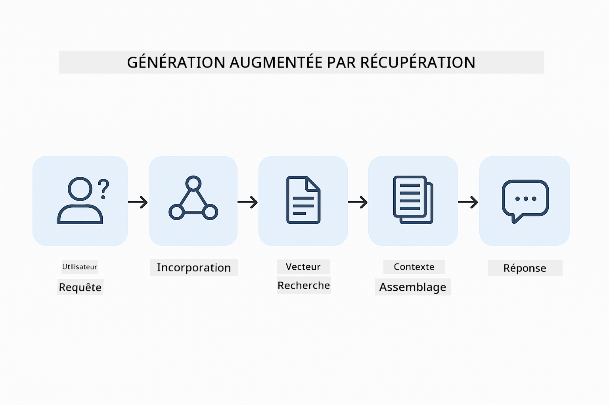

<!--
CO_OP_TRANSLATOR_METADATA:
{
  "original_hash": "f538a51cfd13147d40d84e936a0f485c",
  "translation_date": "2025-12-13T16:42:08+00:00",
  "source_file": "03-rag/README.md",
  "language_code": "fr"
}
-->
# Module 03 : RAG (Retrieval-Augmented Generation)

## Table des matières

- [Ce que vous apprendrez](../../../03-rag)
- [Prérequis](../../../03-rag)
- [Comprendre RAG](../../../03-rag)
- [Comment ça fonctionne](../../../03-rag)
  - [Traitement des documents](../../../03-rag)
  - [Création des embeddings](../../../03-rag)
  - [Recherche sémantique](../../../03-rag)
  - [Génération de réponses](../../../03-rag)
- [Exécuter l'application](../../../03-rag)
- [Utiliser l'application](../../../03-rag)
  - [Télécharger un document](../../../03-rag)
  - [Poser des questions](../../../03-rag)
  - [Vérifier les références sources](../../../03-rag)
  - [Expérimenter avec les questions](../../../03-rag)
- [Concepts clés](../../../03-rag)
  - [Stratégie de découpage](../../../03-rag)
  - [Scores de similarité](../../../03-rag)
  - [Stockage en mémoire](../../../03-rag)
  - [Gestion de la fenêtre de contexte](../../../03-rag)
- [Quand RAG est important](../../../03-rag)
- [Étapes suivantes](../../../03-rag)

## Ce que vous apprendrez

Dans les modules précédents, vous avez appris à avoir des conversations avec l'IA et à structurer efficacement vos prompts. Mais il y a une limitation fondamentale : les modèles de langage ne savent que ce qu'ils ont appris pendant leur entraînement. Ils ne peuvent pas répondre à des questions sur les politiques de votre entreprise, la documentation de votre projet, ou toute information sur laquelle ils n'ont pas été entraînés.

RAG (Retrieval-Augmented Generation) résout ce problème. Au lieu d'essayer d'enseigner vos informations au modèle (ce qui est coûteux et peu pratique), vous lui donnez la capacité de rechercher dans vos documents. Lorsqu'une question est posée, le système trouve les informations pertinentes et les inclut dans le prompt. Le modèle répond alors en se basant sur ce contexte récupéré.

Pensez à RAG comme à une bibliothèque de référence pour le modèle. Lorsque vous posez une question, le système :

1. **Requête utilisateur** - Vous posez une question  
2. **Embedding** - Convertit votre question en vecteur  
3. **Recherche vectorielle** - Trouve des morceaux de documents similaires  
4. **Assemblage du contexte** - Ajoute les morceaux pertinents au prompt  
5. **Réponse** - Le LLM génère une réponse basée sur le contexte  

Cela ancre les réponses du modèle dans vos données réelles au lieu de s'appuyer sur ses connaissances d'entraînement ou d'inventer des réponses.



*Flux de travail RAG - de la requête utilisateur à la recherche sémantique jusqu'à la génération de réponse contextuelle*

## Prérequis

- Module 01 complété (ressources Azure OpenAI déployées)  
- Fichier `.env` dans le répertoire racine avec les identifiants Azure (créé par `azd up` dans le Module 01)  

> **Note :** Si vous n'avez pas terminé le Module 01, suivez d'abord les instructions de déploiement là-bas.

## Comment ça fonctionne

**Traitement des documents** - [DocumentService.java](../../../03-rag/src/main/java/com/example/langchain4j/rag/service/DocumentService.java)

Lorsque vous téléchargez un document, le système le découpe en morceaux - des parties plus petites qui tiennent confortablement dans la fenêtre de contexte du modèle. Ces morceaux se chevauchent légèrement pour ne pas perdre le contexte aux frontières.

```java
Document document = FileSystemDocumentLoader.loadDocument("sample-document.txt");

DocumentSplitter splitter = DocumentSplitters
    .recursive(300, 30, new OpenAiTokenizer());

List<TextSegment> segments = splitter.split(document);
```
  
> **🤖 Essayez avec [GitHub Copilot](https://github.com/features/copilot) Chat :** Ouvrez [`DocumentService.java`](../../../03-rag/src/main/java/com/example/langchain4j/rag/service/DocumentService.java) et demandez :  
> - "Comment LangChain4j découpe-t-il les documents en morceaux et pourquoi le chevauchement est-il important ?"  
> - "Quelle est la taille optimale des morceaux pour différents types de documents et pourquoi ?"  
> - "Comment gérer les documents en plusieurs langues ou avec une mise en forme spéciale ?"

**Création des embeddings** - [LangChainRagConfig.java](../../../03-rag/src/main/java/com/example/langchain4j/rag/config/LangChainRagConfig.java)

Chaque morceau est converti en une représentation numérique appelée embedding - essentiellement une empreinte mathématique qui capture le sens du texte. Des textes similaires produisent des embeddings similaires.

```java
@Bean
public EmbeddingModel embeddingModel() {
    return OpenAiOfficialEmbeddingModel.builder()
        .baseUrl(azureOpenAiEndpoint)
        .apiKey(azureOpenAiKey)
        .modelName(azureEmbeddingDeploymentName)
        .build();
}

EmbeddingStore<TextSegment> embeddingStore = 
    new InMemoryEmbeddingStore<>();
```
  


*Documents représentés comme des vecteurs dans l'espace des embeddings - les contenus similaires se regroupent*

**Recherche sémantique** - [RagService.java](../../../03-rag/src/main/java/com/example/langchain4j/rag/service/RagService.java)

Lorsque vous posez une question, votre question devient aussi un embedding. Le système compare l'embedding de votre question avec tous les embeddings des morceaux de documents. Il trouve les morceaux ayant les significations les plus proches - pas seulement des mots-clés correspondants, mais une similarité sémantique réelle.

```java
Embedding queryEmbedding = embeddingModel.embed(question).content();

List<EmbeddingMatch<TextSegment>> matches = 
    embeddingStore.findRelevant(queryEmbedding, 5, 0.7);

for (EmbeddingMatch<TextSegment> match : matches) {
    String relevantText = match.embedded().text();
    double score = match.score();
}
```
  
> **🤖 Essayez avec [GitHub Copilot](https://github.com/features/copilot) Chat :** Ouvrez [`RagService.java`](../../../03-rag/src/main/java/com/example/langchain4j/rag/service/RagService.java) et demandez :  
> - "Comment fonctionne la recherche de similarité avec les embeddings et qu'est-ce qui détermine le score ?"  
> - "Quel seuil de similarité devrais-je utiliser et comment cela affecte-t-il les résultats ?"  
> - "Comment gérer les cas où aucun document pertinent n'est trouvé ?"

**Génération de réponses** - [RagService.java](../../../03-rag/src/main/java/com/example/langchain4j/rag/service/RagService.java)

Les morceaux les plus pertinents sont inclus dans le prompt envoyé au modèle. Le modèle lit ces morceaux spécifiques et répond à votre question en se basant sur ces informations. Cela évite les hallucinations - le modèle ne peut répondre qu'à partir de ce qui lui est fourni.

## Exécuter l'application

**Vérifier le déploiement :**

Assurez-vous que le fichier `.env` existe dans le répertoire racine avec les identifiants Azure (créé lors du Module 01) :  
```bash
cat ../.env  # Devrait afficher AZURE_OPENAI_ENDPOINT, API_KEY, DEPLOYMENT
```
  
**Démarrer l'application :**

> **Note :** Si vous avez déjà démarré toutes les applications avec `./start-all.sh` depuis le Module 01, ce module tourne déjà sur le port 8081. Vous pouvez ignorer les commandes de démarrage ci-dessous et aller directement sur http://localhost:8081.

**Option 1 : Utiliser le Spring Boot Dashboard (recommandé pour les utilisateurs VS Code)**

Le conteneur de développement inclut l'extension Spring Boot Dashboard, qui fournit une interface visuelle pour gérer toutes les applications Spring Boot. Vous la trouverez dans la barre d'activité à gauche de VS Code (cherchez l'icône Spring Boot).

Depuis le Spring Boot Dashboard, vous pouvez :  
- Voir toutes les applications Spring Boot disponibles dans l'espace de travail  
- Démarrer/arrêter les applications en un clic  
- Voir les logs des applications en temps réel  
- Surveiller l'état des applications  

Cliquez simplement sur le bouton lecture à côté de "rag" pour démarrer ce module, ou démarrez tous les modules en même temps.


**Option 2 : Utiliser les scripts shell**

Démarrer toutes les applications web (modules 01-04) :

**Bash :**  
```bash
cd ..  # Depuis le répertoire racine
./start-all.sh
```
  
**PowerShell :**  
```powershell
cd ..  # Depuis le répertoire racine
.\start-all.ps1
```
  
Ou démarrer uniquement ce module :

**Bash :**  
```bash
cd 03-rag
./start.sh
```
  
**PowerShell :**  
```powershell
cd 03-rag
.\start.ps1
```
  
Les deux scripts chargent automatiquement les variables d'environnement depuis le fichier `.env` racine et construiront les JARs s'ils n'existent pas.

> **Note :** Si vous préférez construire manuellement tous les modules avant de démarrer :  
>  
> **Bash :**  
> ```bash
> cd ..  # Go to root directory
> mvn clean package -DskipTests
> ```
  
> **PowerShell :**  
> ```powershell
> cd ..  # Go to root directory
> mvn clean package -DskipTests
> ```
  
Ouvrez http://localhost:8081 dans votre navigateur.

**Pour arrêter :**

**Bash :**  
```bash
./stop.sh  # Ce module uniquement
# Ou
cd .. && ./stop-all.sh  # Tous les modules
```
  
**PowerShell :**  
```powershell
.\stop.ps1  # Ce module seulement
# Ou
cd ..; .\stop-all.ps1  # Tous les modules
```
  
## Utiliser l'application

L'application fournit une interface web pour le téléchargement de documents et la pose de questions.

<a href="images/rag-homepage.png"></a>

*Interface de l'application RAG - téléchargez des documents et posez des questions*

**Télécharger un document**

Commencez par télécharger un document - les fichiers TXT fonctionnent le mieux pour les tests. Un `sample-document.txt` est fourni dans ce répertoire, contenant des informations sur les fonctionnalités de LangChain4j, l'implémentation RAG, et les bonnes pratiques - parfait pour tester le système.

Le système traite votre document, le découpe en morceaux, et crée des embeddings pour chaque morceau. Cela se fait automatiquement lors du téléchargement.

**Poser des questions**

Posez maintenant des questions spécifiques sur le contenu du document. Essayez quelque chose de factuel clairement indiqué dans le document. Le système recherche les morceaux pertinents, les inclut dans le prompt, et génère une réponse.

**Vérifier les références sources**

Notez que chaque réponse inclut des références sources avec des scores de similarité. Ces scores (de 0 à 1) montrent à quel point chaque morceau était pertinent pour votre question. Des scores plus élevés signifient de meilleures correspondances. Cela vous permet de vérifier la réponse par rapport au matériel source.

<a href="images/rag-query-results.png"></a>

*Résultats de requête montrant la réponse avec références sources et scores de pertinence*

**Expérimenter avec les questions**

Essayez différents types de questions :  
- Faits spécifiques : "Quel est le sujet principal ?"  
- Comparaisons : "Quelle est la différence entre X et Y ?"  
- Résumés : "Résumez les points clés à propos de Z"  

Observez comment les scores de pertinence changent en fonction de la correspondance entre votre question et le contenu du document.

## Concepts clés

**Stratégie de découpage**

Les documents sont découpés en morceaux de 300 tokens avec un chevauchement de 30 tokens. Cet équilibre garantit que chaque morceau a suffisamment de contexte pour être significatif tout en restant assez petit pour inclure plusieurs morceaux dans un prompt.

**Scores de similarité**

Les scores vont de 0 à 1 :  
- 0,7-1,0 : Très pertinent, correspondance exacte  
- 0,5-0,7 : Pertinent, bon contexte  
- En dessous de 0,5 : Filtré, trop dissemblable  

Le système ne récupère que les morceaux au-dessus du seuil minimum pour garantir la qualité.

**Stockage en mémoire**

Ce module utilise un stockage en mémoire pour la simplicité. Lorsque vous redémarrez l'application, les documents téléchargés sont perdus. Les systèmes en production utilisent des bases de données vectorielles persistantes comme Qdrant ou Azure AI Search.

**Gestion de la fenêtre de contexte**

Chaque modèle a une fenêtre de contexte maximale. Vous ne pouvez pas inclure tous les morceaux d'un document volumineux. Le système récupère les N morceaux les plus pertinents (par défaut 5) pour rester dans les limites tout en fournissant assez de contexte pour des réponses précises.

## Quand RAG est important

**Utilisez RAG lorsque :**  
- Vous répondez à des questions sur des documents propriétaires  
- Les informations changent fréquemment (politiques, prix, spécifications)  
- La précision nécessite une attribution des sources  
- Le contenu est trop volumineux pour tenir dans un seul prompt  
- Vous avez besoin de réponses vérifiables et fondées  

**N'utilisez pas RAG lorsque :**  
- Les questions nécessitent des connaissances générales que le modèle possède déjà  
- Des données en temps réel sont nécessaires (RAG fonctionne sur des documents téléchargés)  
- Le contenu est assez petit pour être inclus directement dans les prompts  

## Étapes suivantes

**Module suivant :** [04-tools - Agents IA avec outils](../04-tools/README.md)

---

**Navigation :** [← Précédent : Module 02 - Ingénierie des prompts](../02-prompt-engineering/README.md) | [Retour au principal](../README.md) | [Suivant : Module 04 - Outils →](../04-tools/README.md)

---

<!-- CO-OP TRANSLATOR DISCLAIMER START -->
**Avertissement** :  
Ce document a été traduit à l’aide du service de traduction automatique [Co-op Translator](https://github.com/Azure/co-op-translator). Bien que nous nous efforcions d’assurer l’exactitude, veuillez noter que les traductions automatiques peuvent contenir des erreurs ou des inexactitudes. Le document original dans sa langue d’origine doit être considéré comme la source faisant foi. Pour les informations critiques, une traduction professionnelle réalisée par un humain est recommandée. Nous déclinons toute responsabilité en cas de malentendus ou de mauvaises interprétations résultant de l’utilisation de cette traduction.
<!-- CO-OP TRANSLATOR DISCLAIMER END -->