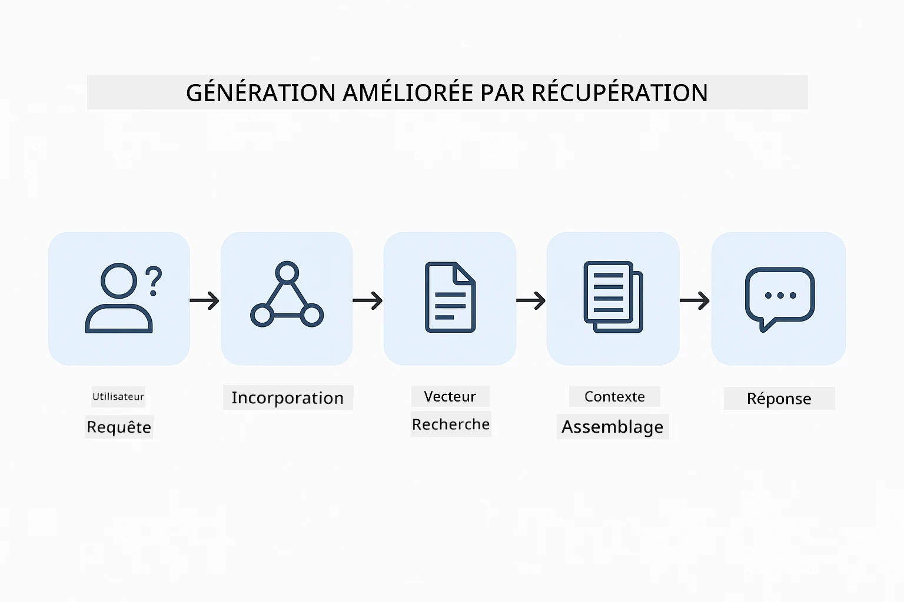
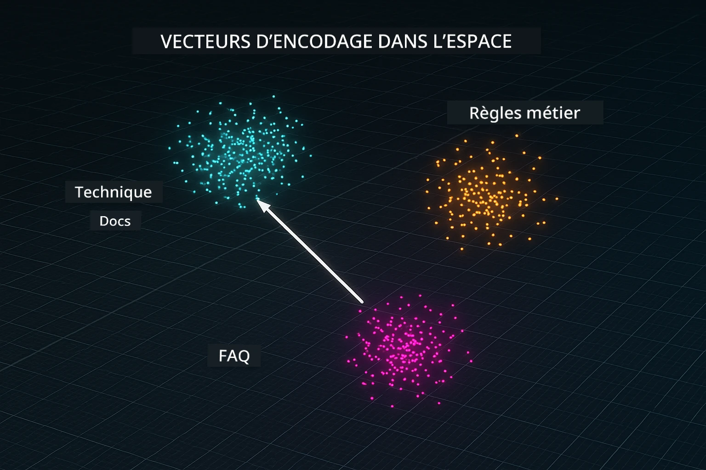
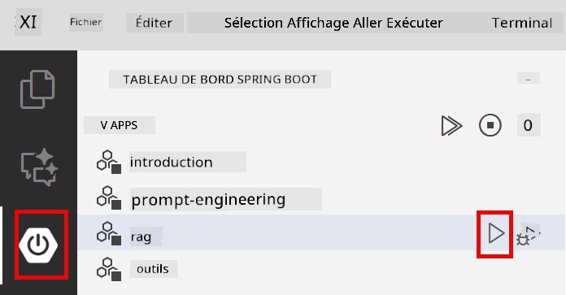
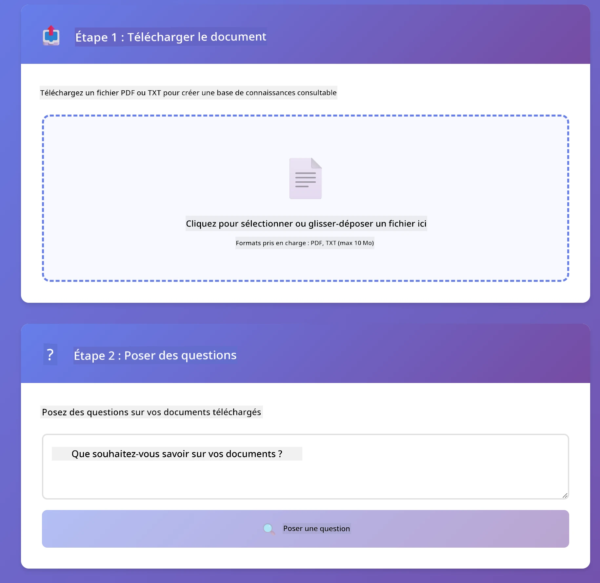
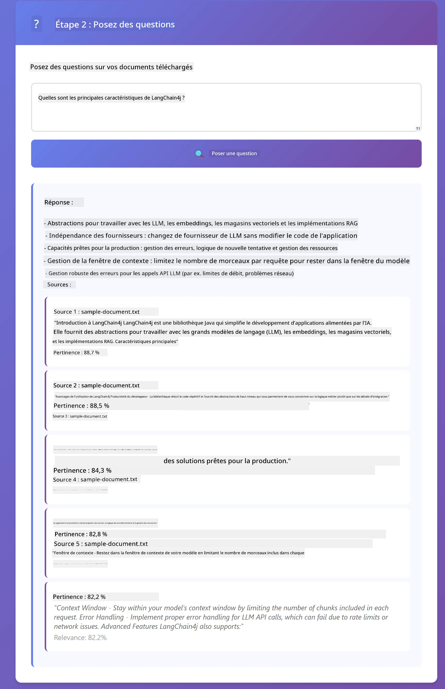

# Module 03 : RAG (Génération Augmentée par Recherche)

## Table des matières

- [Présentation vidéo](#présentation-vidéo)
- [Ce que vous apprendrez](#ce-que-vous-apprendrez)
- [Prérequis](#prérequis)
- [Comprendre RAG](#comprendre-rag)
  - [Quelle approche RAG ce tutoriel utilise-t-il ?](#quelle-approche-rag-ce-tutoriel-utilise-t-il)
- [Comment ça fonctionne](#comment-ça-fonctionne)
  - [Traitement des documents](#traitement-des-documents)
  - [Création des embeddings](#création-des-embeddings)
  - [Recherche sémantique](#recherche-sémantique)
  - [Génération des réponses](#génération-de-réponse)
- [Exécuter l'application](#exécuter-lapplication)
- [Utiliser l'application](#utilisation-de-lapplication)
  - [Télécharger un document](#téléversez-un-document)
  - [Poser des questions](#posez-des-questions)
  - [Vérifier les références sources](#vérifiez-les-références-sources)
  - [Expérimenter avec les questions](#expérimentez-avec-les-questions)
- [Concepts clés](#concepts-clés)
  - [Stratégie de découpage](#stratégie-de-découpage)
  - [Scores de similarité](#scores-de-similarité)
  - [Stockage en mémoire](#stockage-en-mémoire)
  - [Gestion de la fenêtre de contexte](#gestion-de-la-fenêtre-de-contexte)
- [Quand RAG est important](#quand-rag-est-important)
- [Prochaines étapes](#étapes-suivantes)

## Présentation vidéo

Regardez cette session en direct qui explique comment démarrer avec ce module :

<a href="https://www.youtube.com/watch?v=_olq75ZH_eY"></a>

## Ce que vous apprendrez

Dans les modules précédents, vous avez appris à avoir des conversations avec l'IA et à structurer efficacement vos prompts. Mais il existe une limitation fondamentale : les modèles de langage ne connaissent que ce qu’ils ont appris lors de l’entraînement. Ils ne peuvent pas répondre à des questions sur les politiques de votre entreprise, la documentation de vos projets, ou toute information sur laquelle ils n’ont pas été entraînés.

RAG (Génération Augmentée par Recherche) résout ce problème. Plutôt que d’essayer d’enseigner au modèle vos informations (ce qui est coûteux et peu pratique), vous lui donnez la capacité de rechercher dans vos documents. Lorsqu’une question est posée, le système trouve les informations pertinentes et les inclut dans le prompt. Le modèle répond alors en se basant sur ce contexte récupéré.

Pensez à RAG comme si vous donniez au modèle une bibliothèque de référence. Lorsque vous posez une question, le système :

1. **Question de l’utilisateur** - Vous posez une question  
2. **Embedding** - Convertit votre question en vecteur  
3. **Recherche vectorielle** - Trouve des morceaux de documents similaires  
4. **Assemblage du contexte** - Ajoute les morceaux pertinents au prompt  
5. **Réponse** - Le LLM génère une réponse basée sur le contexte  

Cela ancre les réponses du modèle dans vos données réelles au lieu de s’appuyer uniquement sur ses connaissances d’entraînement ou d’inventer des réponses.

## Prérequis

- Module [01 - Introduction](../01-introduction/README.md) terminé (ressources Azure OpenAI déployées, incluant le modèle d’embedding `text-embedding-3-small`)
- Fichier `.env` dans le répertoire racine avec les identifiants Azure (créé par la commande `azd up` dans le Module 01)

> **Note :** Si vous n'avez pas terminé le Module 01, suivez d'abord les instructions de déploiement indiquées. La commande `azd up` déploie à la fois le modèle de chat GPT et le modèle d'embedding utilisé par ce module.

## Comprendre RAG

Le schéma ci-dessous illustre le concept central : au lieu de se fier uniquement aux données d'entraînement du modèle, RAG lui donne une bibliothèque de vos documents à consulter avant de générer chaque réponse.


*Ce schéma montre la différence entre un LLM standard (qui devine à partir des données d’entraînement) et un LLM amélioré par RAG (qui consulte d’abord vos documents).*

Voici comment les éléments se connectent de bout en bout. La question d’un utilisateur passe par quatre étapes — embedding, recherche vectorielle, assemblage du contexte et génération de réponse — chacune s’appuyant sur la précédente :



*Ce schéma montre la chaîne complète RAG — une question utilisateur traverse les étapes d'embedding, recherche vectorielle, assemblage du contexte et génération de réponse.*

Le reste de ce module détaille chaque étape, avec du code que vous pouvez exécuter et modifier.

### Quelle approche RAG ce tutoriel utilise-t-il ?

LangChain4j propose trois façons d’implémenter RAG, chacune offrant un niveau d’abstraction différent. Le schéma ci-dessous les compare côte à côte :


*Ce schéma compare les trois approches RAG de LangChain4j — Facile, Native, et Avancée — montrant leurs composants clés et quand les utiliser.*

| Approche | Ce qu’elle fait | Compromis |
|---|---|---|
| **Easy RAG** | Connecte automatiquement tout via `AiServices` et `ContentRetriever`. Vous annotez une interface, attachez un retriever, et LangChain4j gère en coulisses embedding, recherche et assemblage des prompts. | Code minimal, mais vous ne voyez pas ce qui se passe à chaque étape. |
| **Native RAG** | Vous appelez vous-même le modèle d’embedding, recherchez dans le magasin, assemblez le prompt et générez la réponse — une étape explicite à la fois. | Plus de code, mais chaque étape est visible et modifiable. |
| **Advanced RAG** | Utilise le cadre `RetrievalAugmentor` avec des transformateurs de requêtes, routeurs, re-classificateurs, et injecteurs de contenu modulaires pour des pipelines de production. | Flexibilité maximale, mais complexité nettement plus élevée. |

**Ce tutoriel utilise l’approche Native.** Chaque étape de la chaîne RAG — embedding de la requête, recherche dans le magasin vectoriel, assemblage du contexte, et génération de la réponse — est explicitement écrite dans [`RagService.java`](../../../03-rag/src/main/java/com/example/langchain4j/rag/service/RagService.java). C’est volontaire : en tant que ressource pédagogique, il est plus important que vous voyiez et compreniez chaque étape que de minimiser le code. Une fois à l’aise avec la chaîne, vous pourrez basculer sur Easy RAG pour des prototypes rapides ou Advanced RAG pour des systèmes en production.

> **💡 Curieux à propos de Easy RAG ?** LangChain4j offre aussi une approche *Easy RAG* où `AiServices` et un `ContentRetriever` gèrent automatiquement l'embedding, la recherche et l'assemblage des prompts. Ce module prend le chemin plus explicite — en ouvrant cette chaîne pour que vous puissiez voir et contrôler chaque étape.

Le schéma ci-dessous montre la pipeline Easy RAG. Notez comment `AiServices` et `EmbeddingStoreContentRetriever` cachent toute la complexité — vous chargez un document, vous attachez un retriever, et obtenez des réponses. L’approche Native dans ce module ouvre chacune de ces étapes cachées :


*Ce schéma montre la pipeline Easy RAG. Comparez avec l’approche Native utilisée dans ce module : Easy RAG cache embedding, récupération et assemblage du prompt derrière `AiServices` et `ContentRetriever` — vous chargez un document, attachez un retriever, et obtenez des réponses. L’approche Native ouvre cette pipeline pour que vous appeliez chaque étape (embedded, rechercher, assembler le contexte, générer) vous-même, offrant pleine visibilité et contrôle.*

## Comment ça fonctionne

La pipeline RAG dans ce module se divise en quatre étapes séquentielles à chaque fois qu’un utilisateur pose une question. Premièrement, un document uploadé est **analysé et découpé en morceaux** gérables. Ces morceaux sont ensuite transformés en **embeddings vectoriels** et stockés pour pouvoir être comparés mathématiquement. Lorsqu’une requête arrive, le système effectue une **recherche sémantique** pour trouver les morceaux les plus pertinents, puis les passe comme contexte au LLM pour **génération de réponse**. Les sections ci-dessous expliquent chaque étape avec le code réel et des diagrammes. Regardons la première étape.

### Traitement des documents

[DocumentService.java](../../../03-rag/src/main/java/com/example/langchain4j/rag/service/DocumentService.java)

Quand vous chargez un document, le système l’analyse (PDF ou texte brut), y attache des métadonnées comme le nom de fichier, puis le décompose en morceaux — des parties plus petites qui tiennent confortablement dans la fenêtre de contexte du modèle. Ces morceaux se chevauchent légèrement pour ne pas perdre de contexte aux frontières.

```java
// Analyser le fichier téléchargé et l'encapsuler dans un document LangChain4j
Document document = Document.from(content, metadata);

// Diviser en morceaux de 300 tokens avec un chevauchement de 30 tokens
DocumentSplitter splitter = DocumentSplitters
    .recursive(300, 30);

List<TextSegment> segments = splitter.split(document);
```
  
Le schéma ci-dessous montre visuellement comment cela fonctionne. Notez comment chaque morceau partage certains tokens avec ses voisins — le chevauchement de 30 tokens garantit qu’aucun contexte important ne tombe entre les mailles du filet :


*Ce schéma montre un document découpé en morceaux de 300 tokens avec un chevauchement de 30 tokens, préservant le contexte aux limites des morceaux.*

> **🤖 Essayez avec [GitHub Copilot](https://github.com/features/copilot) Chat :** Ouvrez [`DocumentService.java`](../../../03-rag/src/main/java/com/example/langchain4j/rag/service/DocumentService.java) et demandez :  
> - "Comment LangChain4j découpe-t-il les documents en morceaux et pourquoi le chevauchement est-il important ?"  
> - "Quelle est la taille optimale des morceaux pour différents types de documents et pourquoi ?"  
> - "Comment gérer les documents en plusieurs langues ou avec une mise en forme spéciale ?"

### Création des embeddings

[LangChainRagConfig.java](../../../03-rag/src/main/java/com/example/langchain4j/rag/config/LangChainRagConfig.java)

Chaque morceau est converti en une représentation numérique appelée embedding — essentiellement un convertisseur de sens en nombres. Le modèle d’embedding n’est pas « intelligent » comme un modèle de chat ; il ne suit pas d’instructions, ne raisonne pas et ne répond pas aux questions. Ce qu’il fait, c’est mapper le texte dans un espace mathématique où des significations similaires se regroupent — « voiture » proche de « automobile », « politique de remboursement » proche de « rendre mon argent ». Pensez à un modèle de chat comme une personne avec qui vous parlez ; un modèle d’embedding, c’est un système de classement ultra performant.

Le schéma ci-dessous illustre ce concept — du texte en entrée, des vecteurs numériques en sortie, et des significations proches produisent des vecteurs voisins :


*Ce schéma montre comment un modèle d’embedding convertit le texte en vecteurs numériques, plaçant les significations similaires — comme « voiture » et « automobile » — proches dans l’espace vectoriel.*

```java
@Bean
public EmbeddingModel embeddingModel() {
    return OpenAiOfficialEmbeddingModel.builder()
        .baseUrl(azureOpenAiEndpoint)
        .apiKey(azureOpenAiKey)
        .modelName(azureEmbeddingDeploymentName)
        .build();
}

EmbeddingStore<TextSegment> embeddingStore = 
    new InMemoryEmbeddingStore<>();
```
  
Le diagramme de classes ci-dessous montre les deux flux séparés dans un pipeline RAG et les classes LangChain4j qui les mettent en œuvre. Le **flux d’ingestion** (exécuté une fois lors du téléchargement) découpe le document, embedde les morceaux, et les stocke via `.addAll()`. Le **flux de requête** (exécuté chaque fois qu’un utilisateur pose une question) embedde la question, recherche dans le magasin via `.search()`, et transmet le contexte correspondant au modèle de chat. Les deux flux se croisent sur l’interface partagée `EmbeddingStore<TextSegment>` :


*Ce schéma montre les deux flux d’un pipeline RAG — ingestion et requête — et comment ils se connectent via un EmbeddingStore partagé.*

Une fois les embeddings stockés, les contenus similaires se regroupent naturellement dans l’espace vectoriel. La visualisation ci-dessous montre comment les documents sur des sujets liés forment des points proches, rendant la recherche sémantique possible :



*Cette visualisation montre comment les documents liés se regroupent dans un espace vectoriel 3D, avec des sujets comme Documentation Technique, Règles Métier, et FAQ formant des groupes distincts.*

Lorsqu’un utilisateur effectue une recherche, le système suit quatre étapes : embedder les documents une fois, embedder la requête à chaque recherche, comparer le vecteur de la requête à tous les vecteurs stockés en utilisant la similarité cosinus, et retourner les K meilleurs morceaux. Le schéma ci-dessous présente chaque étape ainsi que les classes LangChain4j impliquées :


*Ce schéma montre les quatre étapes de la recherche par embedding : embedder les documents, embedder la requête, comparer les vecteurs avec la similarité cosinus, et retourner les meilleurs résultats.*

### Recherche sémantique

[RagService.java](../../../03-rag/src/main/java/com/example/langchain4j/rag/service/RagService.java)

Lorsque vous posez une question, celle-ci est également convertie en embedding. Le système compare l’embedding de votre question à tous les embeddings des morceaux du document. Il trouve les morceaux au sens le plus proche — pas seulement des mots-clés correspondants, mais une réelle similarité sémantique.

```java
Embedding queryEmbedding = embeddingModel.embed(question).content();

EmbeddingSearchRequest searchRequest = EmbeddingSearchRequest.builder()
    .queryEmbedding(queryEmbedding)
    .maxResults(5)
    .minScore(0.5)
    .build();

EmbeddingSearchResult<TextSegment> searchResult = embeddingStore.search(searchRequest);
List<EmbeddingMatch<TextSegment>> matches = searchResult.matches();

for (EmbeddingMatch<TextSegment> match : matches) {
    String relevantText = match.embedded().text();
    double score = match.score();
}
```
  
Le schéma ci-dessous illustre la différence entre la recherche sémantique et la recherche traditionnelle par mots-clés. Une recherche par mot-clé sur « véhicule » passe à côté d’un morceau parlant de « voitures et camions », alors que la recherche sémantique comprend qu’ils signifient la même chose et le retourne parmi les résultats les mieux notés :


*Ce schéma compare la recherche basée sur mots-clés avec la recherche sémantique, montrant comment la recherche sémantique récupère du contenu conceptuellement lié même lorsque les mots exacts diffèrent.*

Sous le capot, la similarité est mesurée via la similarité cosinus — une façon de demander « ces deux flèches pointent-elles dans la même direction ? » Deux morceaux peuvent utiliser des mots complètement différents, mais si leur sens est identique, leurs vecteurs pointent dans la même direction et obtiennent un score proche de 1,0 :


*Ce diagramme illustre la similarité cosinus comme l'angle entre les vecteurs d'incorporation — des vecteurs plus alignés obtiennent un score proche de 1.0, indiquant une similarité sémantique plus élevée.*

> **🤖 Essayez avec [GitHub Copilot](https://github.com/features/copilot) Chat :** Ouvrez [`RagService.java`](../../../03-rag/src/main/java/com/example/langchain4j/rag/service/RagService.java) et demandez :
> - « Comment fonctionne la recherche de similarité avec les incorporations et qu'est-ce qui détermine le score ? »
> - « Quel seuil de similarité devrais-je utiliser et comment cela affecte-t-il les résultats ? »
> - « Comment gérer les cas où aucun document pertinent n'est trouvé ? »

### Génération de Réponse

[RagService.java](../../../03-rag/src/main/java/com/example/langchain4j/rag/service/RagService.java)

Les fragments les plus pertinents sont assemblés en une invite structurée qui comprend des instructions explicites, le contexte récupéré, et la question de l'utilisateur. Le modèle lit ces fragments spécifiques et répond sur la base de ces informations — il ne peut utiliser que ce qui se trouve devant lui, ce qui empêche les hallucinations.

```java
String context = matches.stream()
    .map(match -> match.embedded().text())
    .collect(Collectors.joining("\n\n"));

String prompt = String.format("""
    Answer the question based on the following context.
    If the answer cannot be found in the context, say so.

    Context:
    %s

    Question: %s

    Answer:""", context, request.question());

String answer = chatModel.chat(prompt);
```

Le diagramme ci-dessous montre cet assemblage en action — les fragments les mieux notés de l'étape de recherche sont injectés dans le modèle d'invite, et le `OpenAiOfficialChatModel` génère une réponse fondée :


*Ce diagramme montre comment les fragments les mieux notés sont assemblés en une invite structurée, permettant au modèle de générer une réponse fondée à partir de vos données.*

## Exécuter l'Application

**Vérifiez le déploiement :**

Assurez-vous que le fichier `.env` existe dans le répertoire racine avec les identifiants Azure (créés lors du Module 01). Lancez ceci depuis le répertoire du module (`03-rag/`) :

**Bash :**
```bash
cat ../.env  # Devrait afficher AZURE_OPENAI_ENDPOINT, API_KEY, DEPLOYMENT
```

**PowerShell :**
```powershell
Get-Content ..\.env  # Devrait afficher AZURE_OPENAI_ENDPOINT, API_KEY, DEPLOYMENT
```

**Démarrer l'application :**

> **Note :** Si vous avez déjà démarré toutes les applications avec `./start-all.sh` depuis le répertoire racine (comme décrit dans le Module 01), ce module est déjà en cours d'exécution sur le port 8081. Vous pouvez ignorer les commandes de démarrage ci-dessous et aller directement à http://localhost:8081.

**Option 1 : Utilisation du Spring Boot Dashboard (recommandé pour les utilisateurs de VS Code)**

Le conteneur de développement inclut l'extension Spring Boot Dashboard, qui fournit une interface visuelle pour gérer toutes les applications Spring Boot. Vous la trouverez dans la barre d'activités à gauche de VS Code (cherchez l'icône Spring Boot).

Depuis le Spring Boot Dashboard, vous pouvez :
- Voir toutes les applications Spring Boot disponibles dans l'espace de travail
- Démarrer/arrêter les applications d'un simple clic
- Voir les journaux des applications en temps réel
- Surveiller le statut des applications

Cliquez simplement sur le bouton play à côté de « rag » pour démarrer ce module, ou démarrez tous les modules en une fois.



*Cette capture d'écran montre le Spring Boot Dashboard dans VS Code, où vous pouvez démarrer, arrêter et surveiller visuellement les applications.*

**Option 2 : Utilisation de scripts shell**

Démarrez toutes les applications web (modules 01-04) :

**Bash :**
```bash
cd ..  # Depuis le répertoire racine
./start-all.sh
```

**PowerShell :**
```powershell
cd ..  # Depuis le répertoire racine
.\start-all.ps1
```

Ou démarrez uniquement ce module :

**Bash :**
```bash
cd 03-rag
./start.sh
```

**PowerShell :**
```powershell
cd 03-rag
.\start.ps1
```

Les deux scripts chargent automatiquement les variables d'environnement depuis le fichier `.env` racine et construiront les JAR si ceux-ci n'existent pas.

> **Note :** Si vous préférez construire tous les modules manuellement avant de démarrer :
>
> **Bash :**
> ```bash
> cd ..  # Go to root directory
> mvn clean package -DskipTests
> ```
>
> **PowerShell :**
> ```powershell
> cd ..  # Go to root directory
> mvn clean package -DskipTests
> ```

Ouvrez http://localhost:8081 dans votre navigateur.

**Pour arrêter :**

**Bash :**
```bash
./stop.sh  # Ce module uniquement
# Ou
cd .. && ./stop-all.sh  # Tous les modules
```

**PowerShell :**
```powershell
.\stop.ps1  # Ce module uniquement
# Ou
cd ..; .\stop-all.ps1  # Tous les modules
```

## Utilisation de l'Application

L'application fournit une interface web pour le téléchargement de documents et la pose de questions.

<a href="images/rag-homepage.png"></a>

*Cette capture d'écran montre l'interface de l'application RAG où vous téléversez des documents et posez des questions.*

### Téléversez un Document

Commencez par téléverser un document — les fichiers TXT fonctionnent le mieux pour les tests. Un fichier `sample-document.txt` est fourni dans ce répertoire, contenant des informations sur les fonctionnalités LangChain4j, l'implémentation RAG, et les bonnes pratiques — parfait pour tester le système.

Le système traite votre document, le découpe en fragments, et crée des incorporations pour chaque fragment. Cela se fait automatiquement dès que vous téléversez.

### Posez des Questions

Posez maintenant des questions spécifiques sur le contenu du document. Essayez quelque chose de factuel clairement indiqué dans le document. Le système cherche les fragments pertinents, les inclut dans l'invite, et génère une réponse.

### Vérifiez les Références Sources

Notez que chaque réponse inclut des références sources avec des scores de similarité. Ces scores (de 0 à 1) indiquent à quel point chaque fragment était pertinent pour votre question. Des scores plus élevés signifient de meilleures correspondances. Cela vous permet de vérifier la réponse par rapport au matériel source.

<a href="images/rag-query-results.png"></a>

*Cette capture d'écran montre les résultats d'une requête avec la réponse générée, les références sources, et les scores de pertinence pour chaque fragment récupéré.*

### Expérimentez avec les Questions

Essayez différents types de questions :
- Faits spécifiques : « Quel est le sujet principal ? »
- Comparaisons : « Quelle est la différence entre X et Y ? »
- Résumés : « Résumez les points clés concernant Z »

Observez comment les scores de pertinence changent en fonction de la correspondance entre votre question et le contenu du document.

## Concepts Clés

### Stratégie de Découpage

Les documents sont divisés en fragments de 300 jetons avec un chevauchement de 30 jetons. Cet équilibre garantit que chaque fragment contient assez de contexte pour être significatif tout en restant assez petit pour inclure plusieurs fragments dans une invite.

### Scores de Similarité

Chaque fragment récupéré est accompagné d'un score de similarité compris entre 0 et 1 indiquant sa proximité avec la question de l'utilisateur. Le diagramme ci-dessous visualise les plages de score et comment le système les utilise pour filtrer les résultats :


*Ce diagramme montre les plages de score de 0 à 1, avec un seuil minimum de 0.5 qui filtre les fragments non pertinents.*

Les scores vont de 0 à 1 :
- 0.7-1.0 : Très pertinent, correspondance exacte
- 0.5-0.7 : Pertinent, bon contexte
- En dessous de 0.5 : Filtré, trop dissemblable

Le système ne récupère que les fragments au-dessus du seuil minimum pour assurer la qualité.

Les incorporations fonctionnent bien lorsque le sens se regroupe clairement, mais elles ont des angles morts. Le diagramme ci-dessous montre les modes de défaillance courants — les fragments trop grands produisent des vecteurs flous, les fragments trop petits manquent de contexte, les termes ambigus pointent vers plusieurs groupes, et les recherches par correspondance exacte (ID, numéros de pièce) ne fonctionnent pas du tout avec les incorporations :


*Ce diagramme montre les modes de défaillance courants des incorporations : fragments trop grands, fragments trop petits, termes ambigus pointant vers plusieurs groupes, et recherches par correspondance exacte comme les IDs.*

### Stockage en Mémoire

Ce module utilise un stockage en mémoire pour la simplicité. Lorsque vous redémarrez l'application, les documents téléversés sont perdus. Les systèmes en production utilisent des bases de données vectorielles persistantes comme Qdrant ou Azure AI Search.

### Gestion de la Fenêtre de Contexte

Chaque modèle a une fenêtre de contexte maximale. Vous ne pouvez pas inclure tous les fragments d'un grand document. Le système récupère les N fragments les plus pertinents (par défaut 5) pour rester dans les limites tout en fournissant assez de contexte pour des réponses précises.

## Quand RAG est Important

RAG n'est pas toujours la meilleure approche. Le guide de décision ci-dessous vous aide à déterminer quand RAG apporte une valeur ajoutée versus quand des approches plus simples — comme inclure le contenu directement dans l'invite ou compter sur la connaissance intégrée du modèle — suffisent :


*Ce diagramme montre un guide de décision pour savoir quand RAG apporte de la valeur par rapport aux approches plus simples.*

## Étapes Suivantes

**Module Suivant :** [04-tools - Agents IA avec Outils](../04-tools/README.md)

---

**Navigation :** [← Précédent : Module 02 - Ingénierie de Prompt](../02-prompt-engineering/README.md) | [Retour au Principal](../README.md) | [Suivant : Module 04 - Outils →](../04-tools/README.md)

---

<!-- CO-OP TRANSLATOR DISCLAIMER START -->
**Avertissement** :
Ce document a été traduit à l'aide du service de traduction automatique [Co-op Translator](https://github.com/Azure/co-op-translator). Bien que nous nous efforçions d'assurer l'exactitude, veuillez noter que les traductions automatisées peuvent contenir des erreurs ou des inexactitudes. Le document original dans sa langue native doit être considéré comme la source faisant autorité. Pour les informations critiques, il est recommandé de recourir à une traduction professionnelle réalisée par un humain. Nous ne saurions être tenus responsables des malentendus ou erreurs d'interprétation découlant de l'utilisation de cette traduction.
<!-- CO-OP TRANSLATOR DISCLAIMER END -->