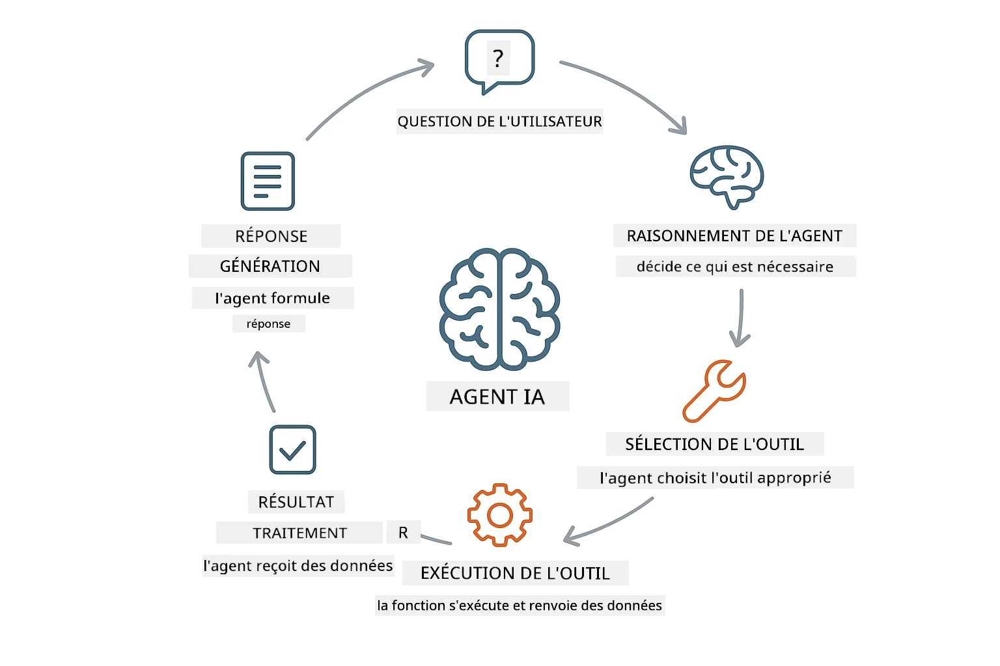
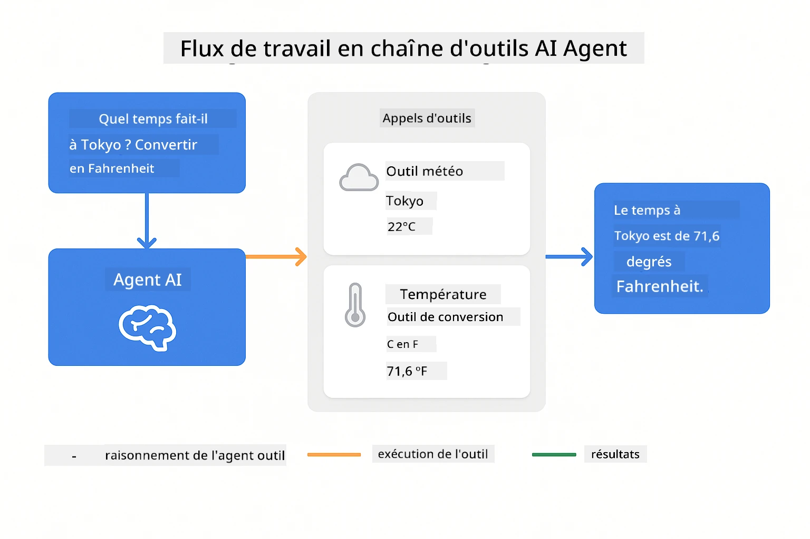
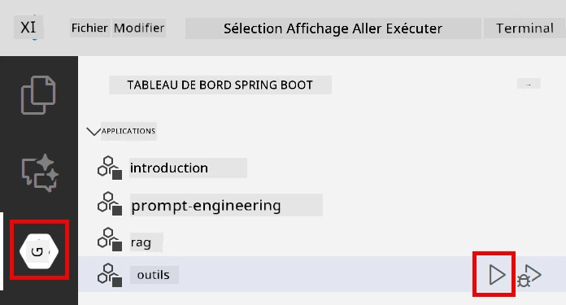
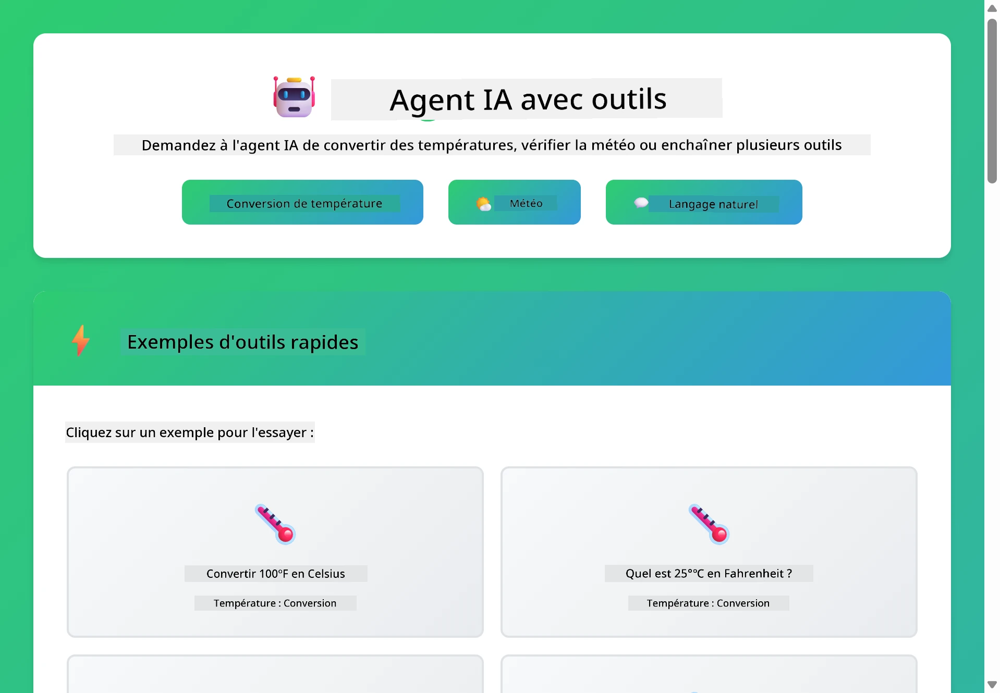

<!--
CO_OP_TRANSLATOR_METADATA:
{
  "original_hash": "844788938b26242f3cc54ce0d0951bea",
  "translation_date": "2026-01-05T21:17:11+00:00",
  "source_file": "04-tools/README.md",
  "language_code": "fr"
}
-->
# Module 04 : Agents IA avec Outils

## Table des Matières

- [Ce que vous apprendrez](../../../04-tools)
- [Prérequis](../../../04-tools)
- [Comprendre les agents IA avec outils](../../../04-tools)
- [Comment fonctionne l'appel d'outil](../../../04-tools)
  - [Définitions des outils](../../../04-tools)
  - [Prise de décision](../../../04-tools)
  - [Exécution](../../../04-tools)
  - [Génération de la réponse](../../../04-tools)
- [Chaînage d'outils](../../../04-tools)
- [Lancer l'application](../../../04-tools)
- [Utiliser l'application](../../../04-tools)
  - [Essayer une utilisation simple d'outil](../../../04-tools)
  - [Tester le chaînage d'outils](../../../04-tools)
  - [Voir le flux de la conversation](../../../04-tools)
  - [Expérimenter avec différentes requêtes](../../../04-tools)
- [Concepts clés](../../../04-tools)
  - [Pattern ReAct (Raisonner et Agir)](../../../04-tools)
  - [Les descriptions d'outils sont importantes](../../../04-tools)
  - [Gestion de session](../../../04-tools)
  - [Gestion des erreurs](../../../04-tools)
- [Outils disponibles](../../../04-tools)
- [Quand utiliser les agents basés sur les outils](../../../04-tools)
- [Étapes suivantes](../../../04-tools)

## Ce que vous apprendrez

Jusqu'à présent, vous avez appris comment avoir des conversations avec l'IA, structurer efficacement les prompts et ancrer les réponses dans vos documents. Mais il existe encore une limitation fondamentale : les modèles de langue ne peuvent générer que du texte. Ils ne peuvent pas vérifier la météo, effectuer des calculs, interroger des bases de données ou interagir avec des systèmes externes.

Les outils changent cela. En donnant au modèle accès à des fonctions qu'il peut appeler, vous le transformez d'un générateur de texte en un agent capable d'agir. Le modèle décide quand il a besoin d'un outil, quel outil utiliser et quels paramètres passer. Votre code exécute la fonction et renvoie le résultat. Le modèle intègre ce résultat dans sa réponse.

## Prérequis

- Module 01 complété (ressources Azure OpenAI déployées)
- Fichier `.env` dans le répertoire racine avec les identifiants Azure (créé par `azd up` dans le Module 01)

> **Note :** Si vous n'avez pas encore complété le Module 01, suivez d'abord les instructions de déploiement de ce module.

## Comprendre les agents IA avec outils

> **📝 Note :** Le terme « agents » dans ce module fait référence à des assistants IA enrichis de capacités d'appel d'outils. Cela diffère des patterns **Agentic AI** (agents autonomes avec planification, mémoire et raisonnement multi-étapes) que nous aborderons dans [Module 05 : MCP](../05-mcp/README.md).

Un agent IA avec outils suit un pattern de raisonnement et d'action (ReAct) :

1. L'utilisateur pose une question
2. L'agent réfléchit à ce qu'il doit savoir
3. L'agent décide s'il a besoin d'un outil pour répondre
4. Si oui, l'agent appelle l'outil approprié avec les bons paramètres
5. L'outil s'exécute et renvoie des données
6. L'agent intègre le résultat et fournit la réponse finale



*Le pattern ReAct – comment les agents IA alternent entre raisonnement et action pour résoudre des problèmes*

Cela se fait automatiquement. Vous définissez les outils et leurs descriptions. Le modèle gère la prise de décision sur quand et comment les utiliser.

## Comment fonctionne l'appel d'outil

### Définitions des outils

[WeatherTool.java](../../../04-tools/src/main/java/com/example/langchain4j/agents/tools/WeatherTool.java) | [TemperatureTool.java](../../../04-tools/src/main/java/com/example/langchain4j/agents/tools/TemperatureTool.java)

Vous définissez des fonctions avec des descriptions claires et des spécifications de paramètres. Le modèle voit ces descriptions dans son prompt système et comprend ce que fait chaque outil.

```java
@Component
public class WeatherTool {
    
    @Tool("Get the current weather for a location")
    public String getCurrentWeather(@P("Location name") String location) {
        // Votre logique de recherche météo
        return "Weather in " + location + ": 22°C, cloudy";
    }
}

@AiService
public interface Assistant {
    String chat(@MemoryId String sessionId, @UserMessage String message);
}

// L'assistant est automatiquement configuré par Spring Boot avec :
// - Le bean ChatModel
// - Toutes les méthodes @Tool des classes @Component
// - ChatMemoryProvider pour la gestion de session
```

> **🤖 Essayez avec [GitHub Copilot](https://github.com/features/copilot) Chat :** Ouvrez [`WeatherTool.java`](../../../04-tools/src/main/java/com/example/langchain4j/agents/tools/WeatherTool.java) et demandez :
> - « Comment intégrer une API météo réelle comme OpenWeatherMap au lieu des données simulées ? »
> - « Qu’est-ce qui fait une bonne description d’outil qui aide l’IA à l’utiliser correctement ? »
> - « Comment gérer les erreurs API et les limites de taux dans les implémentations d’outil ? »

### Prise de décision

Quand un utilisateur demande « Quel temps fait-il à Seattle ? », le modèle reconnaît qu'il a besoin de l’outil météo. Il génère un appel de fonction avec le paramètre location défini à « Seattle ».

### Exécution

[AgentService.java](../../../04-tools/src/main/java/com/example/langchain4j/agents/service/AgentService.java)

Spring Boot injecte automatiquement l’interface déclarative `@AiService` avec tous les outils enregistrés, et LangChain4j exécute automatiquement les appels d’outils.

> **🤖 Essayez avec [GitHub Copilot](https://github.com/features/copilot) Chat :** Ouvrez [`AgentService.java`](../../../04-tools/src/main/java/com/example/langchain4j/agents/service/AgentService.java) et demandez :
> - « Comment fonctionne le pattern ReAct et pourquoi est-il efficace pour les agents IA ? »
> - « Comment l’agent décide quel outil utiliser et dans quel ordre ? »
> - « Que se passe-t-il si une exécution d’outil échoue – comment gérer les erreurs de façon robuste ? »

### Génération de la réponse

Le modèle reçoit les données météo et les formate en une réponse en langage naturel pour l’utilisateur.

### Pourquoi utiliser les services IA déclaratifs ?

Ce module utilise l’intégration Spring Boot de LangChain4j avec des interfaces déclaratives `@AiService` :

- **Injection automatique Spring Boot** – ChatModel et outils injectés automatiquement
- **Pattern @MemoryId** – Gestion automatique de la mémoire basée sur la session
- **Instance unique** – Assistant créé une fois et réutilisé pour de meilleures performances
- **Exécution typée** – Méthodes Java appelées directement avec conversion de types
- **Orchestration multi-tours** – Gère automatiquement le chaînage d’outils
- **Zéro code répétitif** – Pas d’appel manuel à AiServices.builder() ni de HashMap mémoire

Les approches alternatives (manuelles avec `AiServices.builder()`) nécessitent plus de code et ne bénéficient pas de l’intégration Spring Boot.

## Chaînage d'outils

**Chaînage d’outils** – L’IA peut appeler plusieurs outils en séquence. Demandez « Quel temps fait-il à Seattle et dois-je prendre un parapluie ? » et regardez comment il enchaîne `getCurrentWeather` avec un raisonnement sur les vêtements de pluie.

<a href="images/tool-chaining.png"></a>

*Appels d’outils séquentiels – la sortie d’un outil alimente la décision suivante*

**Échecs gracieux** – Demandez la météo d’une ville qui n’est pas dans les données simulées. L’outil renvoie un message d'erreur, et l’IA explique qu’elle ne peut pas aider. Les outils échouent en toute sécurité.

Cela se produit en un seul tour de conversation. L’agent orchestre plusieurs appels d’outils de façon autonome.

## Lancer l'application

**Vérifiez le déploiement :**

Assurez-vous que le fichier `.env` existe dans le répertoire racine avec les identifiants Azure (créé lors du Module 01) :
```bash
cat ../.env  # Devrait afficher AZURE_OPENAI_ENDPOINT, API_KEY, DEPLOYMENT
```

**Démarrez l’application :**

> **Note :** Si vous avez déjà démarré toutes les applications avec `./start-all.sh` depuis le Module 01, ce module fonctionne déjà sur le port 8084. Vous pouvez sauter les commandes de démarrage ci-dessous et accéder directement à http://localhost:8084.

**Option 1 : Utiliser le tableau de bord Spring Boot (recommandé pour les utilisateurs VS Code)**

Le conteneur de développement inclut l’extension Spring Boot Dashboard, qui fournit une interface visuelle pour gérer toutes les applications Spring Boot. Vous la trouverez dans la barre d’activité sur le côté gauche de VS Code (cherchez l’icône Spring Boot).

Depuis le tableau de bord Spring Boot, vous pouvez :
- Voir toutes les applications Spring Boot disponibles dans l’espace de travail
- Démarrer/arrêter les applications d’un simple clic
- Afficher les journaux d’application en temps réel
- Surveiller le statut des applications

Cliquez simplement sur le bouton de lecture à côté de « tools » pour démarrer ce module, ou lancez tous les modules en une fois.



**Option 2 : Utiliser des scripts shell**

Démarrez toutes les applications web (modules 01-04) :

**Bash :**
```bash
cd ..  # Depuis le répertoire racine
./start-all.sh
```

**PowerShell :**
```powershell
cd ..  # À partir du répertoire racine
.\start-all.ps1
```

Ou démarrez juste ce module :

**Bash :**
```bash
cd 04-tools
./start.sh
```

**PowerShell :**
```powershell
cd 04-tools
.\start.ps1
```

Les deux scripts chargent automatiquement les variables d’environnement depuis le fichier `.env` racine et compileront les JARs s’ils n’existent pas.

> **Note :** Si vous préférez construire manuellement tous les modules avant de démarrer :
>
> **Bash :**
> ```bash
> cd ..  # Go to root directory
> mvn clean package -DskipTests
> ```
>
> **PowerShell :**
> ```powershell
> cd ..  # Go to root directory
> mvn clean package -DskipTests
> ```

Ouvrez http://localhost:8084 dans votre navigateur.

**Pour arrêter :**

**Bash :**
```bash
./stop.sh  # Seulement ce module
# Ou
cd .. && ./stop-all.sh  # Tous les modules
```

**PowerShell :**
```powershell
.\stop.ps1  # Ce module seulement
# Ou
cd ..; .\stop-all.ps1  # Tous les modules
```

## Utiliser l'application

L’application propose une interface web où vous pouvez interagir avec un agent IA ayant accès à des outils météo et de conversion de température.

<a href="images/tools-homepage.png"></a>

*Interface des outils de l’agent IA – exemples rapides et interface de chat pour interagir avec les outils*

### Essayer une utilisation simple d'outil

Commencez par une requête simple : « Convertis 100 degrés Fahrenheit en Celsius ». L’agent reconnaît qu’il a besoin de l’outil de conversion de température, l’appelle avec les bons paramètres, et renvoie le résultat. Remarquez comme c’est naturel – vous n’avez pas spécifié quel outil utiliser ni comment l’appeler.

### Tester le chaînage d'outils

Essayez maintenant quelque chose de plus complexe : « Quel temps fait-il à Seattle et convertis-le en Fahrenheit ? » Regardez l’agent procéder étape par étape. Il récupère d’abord la météo (en Celsius), reconnaît qu’il doit convertir en Fahrenheit, appelle l’outil de conversion, puis combine les deux résultats dans une même réponse.

### Voir le flux de la conversation

L’interface de chat conserve l’historique des conversations, vous permettant d’avoir des interactions multiples. Vous pouvez voir toutes les requêtes et réponses précédentes, ce qui facilite le suivi de la conversation et la compréhension de la construction contextuelle sur plusieurs échanges.

<a href="images/tools-conversation-demo.png"></a>

*Conversation multi-tours montrant conversions simples, recherches météo et chaînage d’outils*

### Expérimenter avec différentes requêtes

Essayez diverses combinaisons :
- Recherches météo : « Quel temps fait-il à Tokyo ? »
- Conversions de température : « Quel est 25 °C en Kelvin ? »
- Requêtes combinées : « Vérifie la météo à Paris et dis-moi si elle est au-dessus de 20 °C »

Remarquez comment l’agent interprète le langage naturel et le mappe aux appels d’outils appropriés.

## Concepts clés

### Pattern ReAct (Raisonner et Agir)

L’agent alterne entre raisonnement (décider quoi faire) et action (utiliser les outils). Ce pattern permet une résolution autonome de problèmes plutôt que de simplement répondre aux instructions.

### Les descriptions d'outils sont importantes

La qualité des descriptions de vos outils affecte directement la façon dont l’agent les utilise. Des descriptions claires et spécifiques aident le modèle à comprendre quand et comment appeler chaque outil.

### Gestion de session

L’annotation `@MemoryId` active une gestion automatique de la mémoire basée sur la session. Chaque ID de session obtient sa propre instance de `ChatMemory` gérée par le bean `ChatMemoryProvider`, éliminant ainsi la nécessité d’un suivi manuel de la mémoire.

### Gestion des erreurs

Les outils peuvent échouer – les API peuvent expirer, les paramètres être invalides, les services externes tomber en panne. Les agents en production nécessitent une gestion d’erreurs afin que le modèle puisse expliquer les problèmes ou tenter des alternatives.

## Outils disponibles

**Outils météo** (données simulées pour démonstration) :
- Obtenir la météo actuelle d’un lieu
- Obtenir les prévisions sur plusieurs jours

**Outils de conversion de température** :
- Celsius vers Fahrenheit
- Fahrenheit vers Celsius
- Celsius vers Kelvin
- Kelvin vers Celsius
- Fahrenheit vers Kelvin
- Kelvin vers Fahrenheit

Ce sont des exemples simples, mais le pattern s’étend à toute fonction : requêtes de base de données, appels API, calculs, opérations de fichiers ou commandes système.

## Quand utiliser les agents basés sur les outils

**Utilisez des outils lorsque :**
- La réponse nécessite des données en temps réel (météo, cours boursiers, inventaire)
- Vous devez effectuer des calculs au-delà de la simple arithmétique
- Accès à des bases de données ou API
- Réalisation d’actions (envoi d’emails, création de tickets, mise à jour d’enregistrements)
- Combinaison de sources de données multiples

**N’utilisez pas d’outils lorsque :**
- Les questions peuvent être répondues avec des connaissances générales
- La réponse est purement conversationnelle
- La latence de l’outil rendrait l’expérience trop lente

## Étapes suivantes

**Module suivant :** [05-mcp - Protocole de Contexte de Modèle (MCP)](../05-mcp/README.md)

---

**Navigation :** [← Précédent : Module 03 - RAG](../03-rag/README.md) | [Retour au principal](../README.md) | [Suivant : Module 05 - MCP →](../05-mcp/README.md)

---

<!-- CO-OP TRANSLATOR DISCLAIMER START -->
**Avis de non-responsabilité** :  
Ce document a été traduit à l'aide du service de traduction IA [Co-op Translator](https://github.com/Azure/co-op-translator). Bien que nous nous efforcions d'assurer l'exactitude, veuillez noter que les traductions automatiques peuvent contenir des erreurs ou des imprécisions. Le document original dans sa langue d'origine doit être considéré comme la source faisant foi. Pour les informations sensibles, il est recommandé de recourir à une traduction professionnelle effectuée par un humain. Nous déclinons toute responsabilité en cas de malentendus ou de mauvaises interprétations résultant de l'utilisation de cette traduction.
<!-- CO-OP TRANSLATOR DISCLAIMER END -->