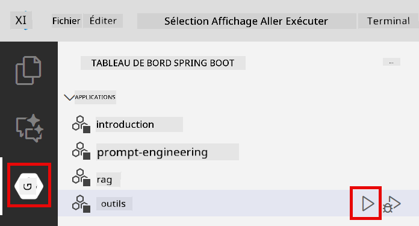
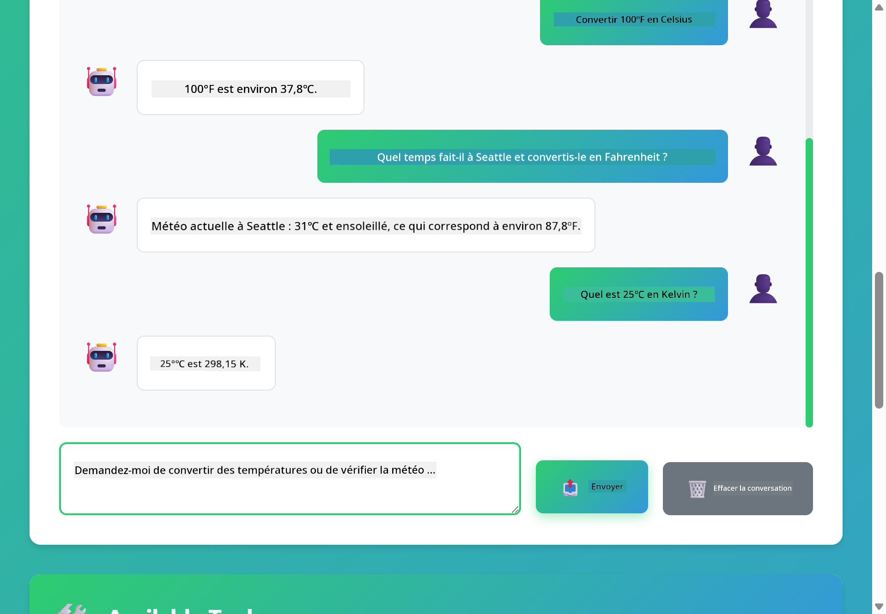

<!--
CO_OP_TRANSLATOR_METADATA:
{
  "original_hash": "13ec450c12cdd1a863baa2b778f27cd7",
  "translation_date": "2025-12-30T19:13:51+00:00",
  "source_file": "04-tools/README.md",
  "language_code": "fr"
}
-->
# Module 04: Agents IA avec outils

## Table of Contents

- [Ce que vous apprendrez](../../../04-tools)
- [Prérequis](../../../04-tools)
- [Comprendre les agents IA avec outils](../../../04-tools)
- [Comment fonctionne l'appel d'outils](../../../04-tools)
  - [Définitions des outils](../../../04-tools)
  - [Prise de décision](../../../04-tools)
  - [Exécution](../../../04-tools)
  - [Génération de la réponse](../../../04-tools)
- [Chaînage d'outils](../../../04-tools)
- [Exécuter l'application](../../../04-tools)
- [Utiliser l'application](../../../04-tools)
  - [Essayer un usage simple d'un outil](../../../04-tools)
  - [Tester le chaînage d'outils](../../../04-tools)
  - [Voir le flux de conversation](../../../04-tools)
  - [Observer le raisonnement](../../../04-tools)
  - [Expérimenter différentes requêtes](../../../04-tools)
- [Concepts clés](../../../04-tools)
  - [Pattern ReAct (Raisonnement et Action)](../../../04-tools)
  - [Les descriptions d'outils comptent](../../../04-tools)
  - [Gestion de session](../../../04-tools)
  - [Gestion des erreurs](../../../04-tools)
- [Outils disponibles](../../../04-tools)
- [Quand utiliser des agents basés sur des outils](../../../04-tools)
- [Étapes suivantes](../../../04-tools)

## What You'll Learn

Jusqu'à présent, vous avez appris à converser avec une IA, structurer efficacement des prompts et ancrer des réponses dans vos documents. Mais il reste une limitation fondamentale : les modèles de langage ne peuvent générer que du texte. Ils ne peuvent pas vérifier la météo, effectuer des calculs, interroger des bases de données ou interagir avec des systèmes externes.

Les outils changent cela. En donnant au modèle accès à des fonctions qu'il peut appeler, vous le transformez d'un générateur de texte en un agent capable d'effectuer des actions. Le modèle décide quand il a besoin d'un outil, quel outil utiliser et quels paramètres passer. Votre code exécute la fonction et renvoie le résultat. Le modèle intègre ce résultat dans sa réponse.

## Prérequis

- Module 01 terminé (ressources Azure OpenAI déployées)
- Fichier `.env` à la racine avec les identifiants Azure (créé par `azd up` dans le Module 01)

> **Note :** Si vous n'avez pas terminé le Module 01, suivez d'abord les instructions de déploiement qui s'y trouvent.

## Comprendre les agents IA avec outils

> **📝 Note :** Le terme "agents" dans ce module fait référence à des assistants IA enrichis par la capacité d'appeler des outils. Ceci est différent des patrons **Agentic AI** (agents autonomes avec planification, mémoire et raisonnement en plusieurs étapes) que nous couvrirons dans [Module 05: MCP](../05-mcp/README.md).

Un agent IA avec outils suit un schéma de raisonnement et d'action (ReAct) :

1. L'utilisateur pose une question
2. L'agent réfléchit à ce qu'il doit savoir
3. L'agent décide s'il a besoin d'un outil pour répondre
4. Si oui, l'agent appelle l'outil approprié avec les bons paramètres
5. L'outil s'exécute et renvoie des données
6. L'agent intègre le résultat et fournit la réponse finale


*Le schéma ReAct - comment les agents IA alternent entre raisonnement et action pour résoudre des problèmes*

Cela se produit automatiquement. Vous définissez les outils et leurs descriptions. Le modèle gère la prise de décision sur quand et comment les utiliser.

## Comment fonctionne l'appel d'outils

**Définitions des outils** - [WeatherTool.java](../../../04-tools/src/main/java/com/example/langchain4j/agents/tools/WeatherTool.java) | [TemperatureTool.java](../../../04-tools/src/main/java/com/example/langchain4j/agents/tools/TemperatureTool.java)

Vous définissez des fonctions avec des descriptions claires et des spécifications de paramètres. Le modèle voit ces descriptions dans son prompt système et comprend ce que fait chaque outil.

```java
@Component
public class WeatherTool {
    
    @Tool("Get the current weather for a location")
    public String getCurrentWeather(@P("Location name") String location) {
        // Votre logique de recherche météo
        return "Weather in " + location + ": 22°C, cloudy";
    }
}

@AiService
public interface Assistant {
    String chat(@MemoryId String sessionId, @UserMessage String message);
}

// Assistant est automatiquement configuré par Spring Boot avec :
// - bean ChatModel
// - Toutes les méthodes @Tool des classes @Component
// - ChatMemoryProvider pour la gestion des sessions
```

> **🤖 Essayez avec [GitHub Copilot](https://github.com/features/copilot) Chat :** Ouvrez [`WeatherTool.java`](../../../04-tools/src/main/java/com/example/langchain4j/agents/tools/WeatherTool.java) et demandez :
> - « Comment intégrer une API météorologique réelle comme OpenWeatherMap au lieu de données simulées ? »
> - « Qu'est-ce qui fait une bonne description d'outil aidant l'IA à l'utiliser correctement ? »
> - « Comment gérer les erreurs d'API et les limites de débit dans les implémentations d'outils ? »

**Prise de décision**

Quand un utilisateur demande "Quel temps fait-il à Seattle ?", le modèle reconnaît qu'il a besoin de l'outil météo. Il génère un appel de fonction avec le paramètre location défini sur "Seattle".

**Exécution** - [AgentService.java](../../../04-tools/src/main/java/com/example/langchain4j/agents/service/AgentService.java)

Spring Boot injecte automatiquement l'interface déclarative `@AiService` avec tous les outils enregistrés, et LangChain4j exécute les appels d'outils automatiquement.

> **🤖 Essayez avec [GitHub Copilot](https://github.com/features/copilot) Chat :** Ouvrez [`AgentService.java`](../../../04-tools/src/main/java/com/example/langchain4j/agents/service/AgentService.java) et demandez :
> - « Comment fonctionne le pattern ReAct et pourquoi est-il efficace pour les agents IA ? »
> - « Comment l'agent décide quel outil utiliser et dans quel ordre ? »
> - « Que se passe-t-il si l'exécution d'un outil échoue - comment gérer les erreurs de manière robuste ? »

**Génération de la réponse**

Le modèle reçoit les données météo et les formate en une réponse en langage naturel pour l'utilisateur.

### Pourquoi utiliser des services IA déclaratifs ?

Ce module utilise l'intégration Spring Boot de LangChain4j avec des interfaces déclaratives `@AiService` :

- **Injection automatique Spring Boot** - ChatModel et outils injectés automatiquement
- **Pattern @MemoryId** - Gestion automatique de la mémoire basée sur la session
- **Instance unique** - Assistant créé une fois et réutilisé pour de meilleures performances
- **Exécution typée** - Méthodes Java appelées directement avec conversion de types
- **Orchestration multi-tours** - Gère automatiquement le chaînage d'outils
- **Zéro boilerplate** - Pas d'appels manuels AiServices.builder() ni de HashMap de mémoire

Les approches alternatives (AiServices.builder() manuel) nécessitent plus de code et perdent les avantages de l'intégration Spring Boot.

## Chaînage d'outils

**Chaînage d'outils** - L'IA peut appeler plusieurs outils à la suite. Demandez "Quel temps fait-il à Seattle et dois-je prendre un parapluie ?" et regardez-la chaîner `getCurrentWeather` avec un raisonnement sur l'équipement contre la pluie.

<a href="images/tool-chaining.png"></a>

*Appels d'outils séquentiels - la sortie d'un outil alimente la décision suivante*

**Échecs gracieux** - Demandez la météo dans une ville qui n'est pas dans les données simulées. L'outil renvoie un message d'erreur, et l'IA explique qu'elle ne peut pas aider. Les outils échouent de manière sûre.

Ceci se produit en un seul tour de conversation. L'agent orchestre plusieurs appels d'outils de manière autonome.

## Run the Application

**Vérifier le déploiement :**

Assurez-vous que le fichier `.env` existe à la racine avec les identifiants Azure (créé pendant le Module 01) :
```bash
cat ../.env  # Devrait afficher AZURE_OPENAI_ENDPOINT, API_KEY, DEPLOYMENT
```

**Démarrer l'application :**

> **Note :** Si vous avez déjà démarré toutes les applications en utilisant `./start-all.sh` depuis le Module 01, ce module est déjà en cours d'exécution sur le port 8084. Vous pouvez ignorer les commandes de démarrage ci-dessous et aller directement sur http://localhost:8084.

**Option 1 : Utiliser Spring Boot Dashboard (recommandé pour les utilisateurs de VS Code)**

Le conteneur de développement inclut l'extension Spring Boot Dashboard, qui fournit une interface visuelle pour gérer toutes les applications Spring Boot. Vous la trouverez dans la barre d'activité à gauche de VS Code (cherchez l'icône Spring Boot).

Depuis le Spring Boot Dashboard, vous pouvez :
- Voir toutes les applications Spring Boot disponibles dans l'espace de travail
- Démarrer/arrêter les applications en un seul clic
- Voir les logs d'application en temps réel
- Surveiller l'état des applications

Cliquez simplement sur le bouton de lecture à côté de "tools" pour démarrer ce module, ou démarrez tous les modules en une fois.



**Option 2 : Utiliser des scripts shell**

Démarrer toutes les applications web (modules 01-04) :

**Bash:**
```bash
cd ..  # Depuis le répertoire racine
./start-all.sh
```

**PowerShell:**
```powershell
cd ..  # Depuis le répertoire racine
.\start-all.ps1
```

Ou démarrer uniquement ce module :

**Bash:**
```bash
cd 04-tools
./start.sh
```

**PowerShell:**
```powershell
cd 04-tools
.\start.ps1
```

Les deux scripts chargent automatiquement les variables d'environnement depuis le fichier `.env` à la racine et construiront les JARs s'ils n'existent pas.

> **Note :** Si vous préférez construire manuellement tous les modules avant de démarrer :
>
> **Bash:**
> ```bash
> cd ..  # Go to root directory
> mvn clean package -DskipTests
> ```
>
> **PowerShell:**
> ```powershell
> cd ..  # Go to root directory
> mvn clean package -DskipTests
> ```

Ouvrez http://localhost:8084 dans votre navigateur.

**Pour arrêter :**

**Bash:**
```bash
./stop.sh  # Ce module seulement
# Ou
cd .. && ./stop-all.sh  # Tous les modules
```

**PowerShell:**
```powershell
.\stop.ps1  # Uniquement ce module
# Ou
cd ..; .\stop-all.ps1  # Tous les modules
```

## Utiliser l'application

L'application fournit une interface web où vous pouvez interagir avec un agent IA qui a accès à des outils de météo et de conversion de température.

<a href="images/tools-homepage.png"></a>

*L'interface AI Agent Tools - exemples rapides et interface de chat pour interagir avec les outils*

**Essayer un usage simple d'un outil**

Commencez par une requête simple : "Convertir 100 degrés Fahrenheit en Celsius". L'agent reconnaît qu'il a besoin de l'outil de conversion de température, l'appelle avec les bons paramètres et retourne le résultat. Remarquez comme cela paraît naturel - vous n'avez pas spécifié quel outil utiliser ni comment l'appeler.

**Tester le chaînage d'outils**

Essayez maintenant quelque chose de plus complexe : "Quel temps fait-il à Seattle et convertissez-le en Fahrenheit ?" Regardez l'agent procéder par étapes. Il récupère d'abord la météo (qui renvoie en Celsius), reconnaît qu'il doit convertir en Fahrenheit, appelle l'outil de conversion, et combine les deux résultats en une seule réponse.

**Voir le flux de conversation**

L'interface de chat conserve l'historique de la conversation, vous permettant d'avoir des interactions en plusieurs tours. Vous pouvez voir toutes les requêtes et réponses précédentes, ce qui facilite le suivi de la conversation et la compréhension de la façon dont l'agent construit le contexte sur plusieurs échanges.

<a href="images/tools-conversation-demo.png"></a>

*Conversation multi-tours montrant des conversions simples, des recherches météo et le chaînage d'outils*

**Expérimenter différentes requêtes**

Essayez diverses combinaisons :
- Recherches météo : "Quel temps fait-il à Tokyo ?"
- Conversions de température : "Que vaut 25°C en Kelvin ?"
- Requêtes combinées : "Vérifie la météo à Paris et dis-moi si elle dépasse 20°C"

Remarquez comment l'agent interprète le langage naturel et le mappe à des appels d'outils appropriés.

## Concepts clés

**ReAct Pattern (Raisonnement et Action)**

L'agent alterne entre le raisonnement (décider quoi faire) et l'action (utiliser des outils). Ce pattern permet une résolution de problèmes autonome plutôt que de simples réponses aux instructions.

**Les descriptions d'outils comptent**

La qualité de vos descriptions d'outils affecte directement la capacité de l'agent à les utiliser correctement. Des descriptions claires et spécifiques aident le modèle à comprendre quand et comment appeler chaque outil.

**Gestion de session**

L'annotation `@MemoryId` permet une gestion automatique de la mémoire basée sur la session. Chaque ID de session obtient sa propre instance `ChatMemory` gérée par le bean `ChatMemoryProvider`, éliminant le besoin de suivi manuel de la mémoire.

**Gestion des erreurs**

Les outils peuvent échouer - les API peuvent expirer, les paramètres peuvent être invalides, les services externes tomber en panne. Les agents de production ont besoin d'une gestion des erreurs pour que le modèle puisse expliquer les problèmes ou essayer des alternatives.

## Outils disponibles

**Outils météo** (données simulées pour la démonstration) :
- Obtenir la météo actuelle pour un emplacement
- Obtenir les prévisions sur plusieurs jours

**Outils de conversion de température** :
- Celsius vers Fahrenheit
- Fahrenheit vers Celsius
- Celsius vers Kelvin
- Kelvin vers Celsius
- Fahrenheit vers Kelvin
- Kelvin vers Fahrenheit

Ce sont des exemples simples, mais le pattern s'étend à n'importe quelle fonction : requêtes de base de données, appels API, calculs, opérations sur fichiers ou commandes système.

## Quand utiliser des agents basés sur des outils

**Utilisez des outils lorsque :**
- La réponse nécessite des données en temps réel (météo, prix des actions, inventaire)
- Vous devez effectuer des calculs au-delà des opérations simples
- Accéder à des bases de données ou des API
- Effectuer des actions (envoyer des e-mails, créer des tickets, mettre à jour des enregistrements)
- Combiner plusieurs sources de données

**N'utilisez pas d'outils lorsque :**
- Les questions peuvent être répondues à partir de connaissances générales
- La réponse est purement conversationnelle
- La latence des outils rendrait l'expérience trop lente

## Étapes suivantes

**Module suivant :** [05-mcp - Model Context Protocol (MCP)](../05-mcp/README.md)

---

**Navigation :** [← Précédent : Module 03 - RAG](../03-rag/README.md) | [Retour au début](../README.md) | [Suivant : Module 05 - MCP →](../05-mcp/README.md)

---

<!-- CO-OP TRANSLATOR DISCLAIMER START -->
Clause de non-responsabilité : Ce document a été traduit à l'aide du service de traduction par IA [Co-op Translator](https://github.com/Azure/co-op-translator). Bien que nous nous efforcions d'assurer l'exactitude, veuillez noter que les traductions automatisées peuvent contenir des erreurs ou des inexactitudes. Le document original, dans sa langue d'origine, doit être considéré comme la source faisant foi. Pour les informations critiques, il est recommandé de recourir à une traduction professionnelle effectuée par un traducteur humain. Nous déclinons toute responsabilité pour tout malentendu ou mauvaise interprétation résultant de l'utilisation de cette traduction.
<!-- CO-OP TRANSLATOR DISCLAIMER END -->