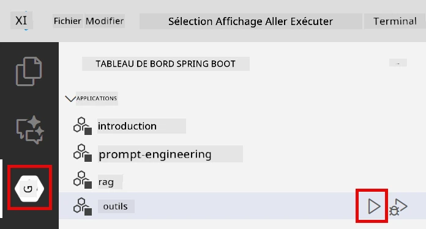
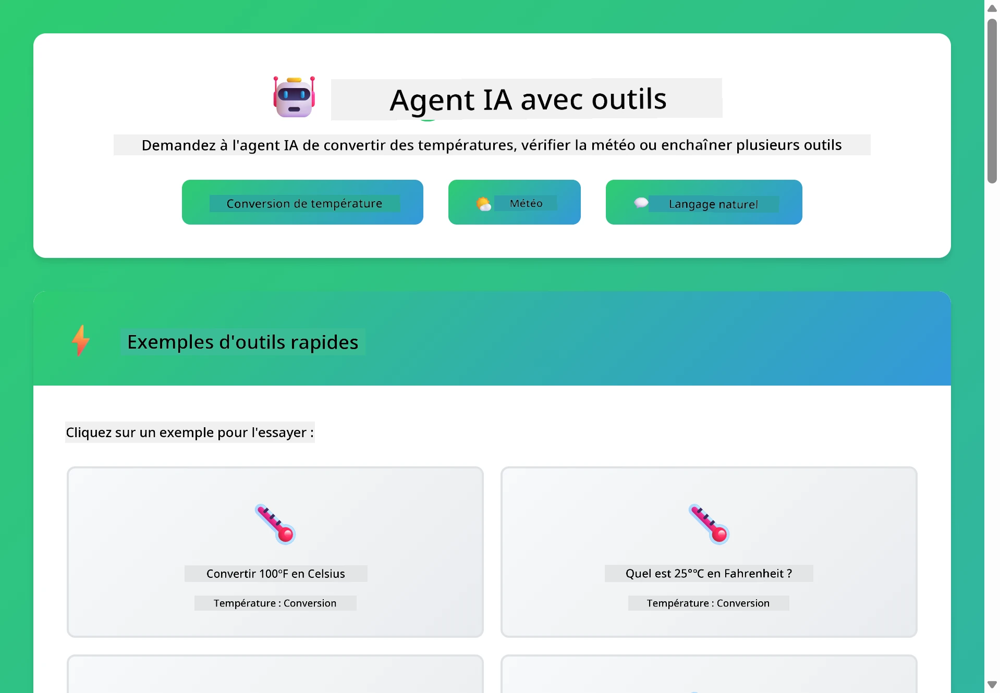
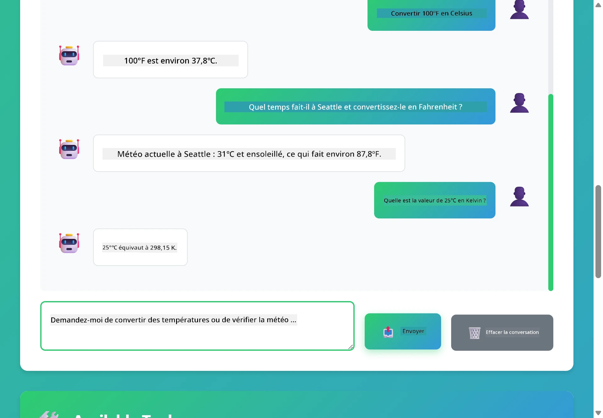

# Module 04 : Agents IA avec Outils

## Table des matières

- [Présentation vidéo](#présentation-vidéo)
- [Ce que vous apprendrez](#ce-que-vous-apprendrez)
- [Prérequis](#prérequis)
- [Comprendre les agents IA avec outils](#comprendre-les-agents-ia-avec-outils)
- [Comment fonctionne l’appel d’outils](#comment-fonctionne-l’appel-d’outils)
  - [Définitions des outils](#définitions-des-outils)
  - [Prise de décision](#prise-de-décision)
  - [Exécution](#exécution)
  - [Génération de réponse](#génération-de-réponse)
  - [Architecture : Auto-injection Spring Boot](#architecture-auto-injection-spring-boot)
- [Chaînage d’outils](#chaînage-d’outils)
- [Exécuter l’application](#exécuter-l’application)
- [Utilisation de l’application](#utilisation-de-l’application)
  - [Essayez une utilisation simple des outils](#essayez-une-utilisation-simple-des-outils)
  - [Tester le chaînage d’outils](#testez-le-chaînage-d’outils)
  - [Voir le flux de conversation](#voyez-le-flux-de-conversation)
  - [Expérimentez avec différentes requêtes](#expérimentez-avec-différentes-requêtes)
- [Concepts clés](#concepts-clés)
  - [Pattern ReAct (Raisonnement et Action)](#modèle-react-raisonner-et-agir)
  - [L’importance des descriptions d’outils](#les-descriptions-d’outils-comptent)
  - [Gestion des sessions](#gestion-de-session)
  - [Gestion des erreurs](#gestion-des-erreurs)
- [Outils disponibles](#outils-disponibles)
- [Quand utiliser des agents basés sur des outils](#quand-utiliser-des-agents-basés-sur-les-outils)
- [Outils vs RAG](#outils-vs-rag)
- [Étapes suivantes](#étapes-suivantes)

## Présentation vidéo

Regardez cette session en direct qui explique comment démarrer avec ce module :

<a href="https://www.youtube.com/watch?v=O_J30kZc0rw"></a>

## Ce que vous apprendrez

Jusqu’à présent, vous avez appris à avoir des conversations avec l’IA, structurer efficacement les prompts et ancrer les réponses dans vos documents. Mais il reste une limitation fondamentale : les modèles de langage ne peuvent générer que du texte. Ils ne peuvent pas consulter la météo, effectuer des calculs, interroger des bases de données ou interagir avec des systèmes externes.

Les outils changent cela. En donnant au modèle accès à des fonctions qu’il peut appeler, vous le transformez d’un générateur de texte en un agent capable d’agir. Le modèle décide quand il a besoin d’un outil, quel outil utiliser et quels paramètres transmettre. Votre code exécute la fonction et retourne le résultat. Le modèle incorpore ce résultat dans sa réponse.

## Prérequis

- Module [01 - Introduction](../01-introduction/README.md) complété (ressources Azure OpenAI déployées)
- Modules précédents recommandés (ce module fait référence aux [concepts RAG du Module 03](../03-rag/README.md) dans la comparaison Outils vs RAG)
- Fichier `.env` dans le répertoire racine avec les identifiants Azure (créé par `azd up` dans le Module 01)

> **Note :** Si vous n’avez pas encore terminé le Module 01, suivez d’abord les instructions de déploiement qui y figurent.

## Comprendre les agents IA avec outils

> **📝 Note :** Le terme « agents » dans ce module désigne des assistants IA enrichis de la capacité à appeler des outils. Cela diffère des patterns **Agentic AI** (agents autonomes avec planification, mémoire et raisonnement multi-étapes) que nous traiterons dans le [Module 05 : MCP](../05-mcp/README.md).

Sans outils, un modèle de langage ne peut générer que du texte issu de ses données d’entraînement. Demandez la météo actuelle, il doit deviner. Donnez-lui des outils, il peut appeler une API météo, effectuer des calculs ou interroger une base de données — puis intégrer ces résultats réels dans sa réponse.


*Sans outils, le modèle ne peut que deviner — avec des outils, il peut appeler des API, faire des calculs et fournir des données en temps réel.*

Un agent IA avec outils suit un pattern **Raisonnement et Action (ReAct)**. Le modèle ne se contente pas de répondre — il réfléchit à ce dont il a besoin, agit en appelant un outil, observe le résultat, puis décide s’il doit agir à nouveau ou fournir la réponse finale :

1. **Raisonner** — L’agent analyse la question de l’utilisateur et détermine quelles informations sont nécessaires
2. **Agir** — L’agent sélectionne l’outil approprié, génère les bons paramètres, puis l’appelle
3. **Observer** — L’agent reçoit la sortie de l’outil et évalue le résultat
4. **Répéter ou Répondre** — Si plus de données sont nécessaires, l’agent recommence ; sinon, il compose une réponse en langage naturel


*Le cycle ReAct — l’agent raisonne sur ce qu’il doit faire, agit en appelant un outil, observe le résultat et boucle jusqu’à fournir la réponse finale.*

Ceci se passe automatiquement. Vous définissez les outils et leurs descriptions. Le modèle prend en charge la prise de décision sur quand et comment les utiliser.

## Comment fonctionne l’appel d’outils

### Définitions des outils

[WeatherTool.java](../../../04-tools/src/main/java/com/example/langchain4j/agents/tools/WeatherTool.java) | [TemperatureTool.java](../../../04-tools/src/main/java/com/example/langchain4j/agents/tools/TemperatureTool.java)

Vous définissez des fonctions avec des descriptions claires et des spécifications de paramètres. Le modèle voit ces descriptions dans son prompt système et comprend ce que fait chaque outil.

```java
@Component
public class WeatherTool {
    
    @Tool("Get the current weather for a location")
    public String getCurrentWeather(@P("Location name") String location) {
        // Votre logique de recherche météo
        return "Weather in " + location + ": 22°C, cloudy";
    }
}

@AiService
public interface Assistant {
    String chat(@MemoryId String sessionId, @UserMessage String message);
}

// L'assistant est automatiquement configuré par Spring Boot avec :
// - Bean ChatModel
// - Toutes les méthodes @Tool des classes @Component
// - ChatMemoryProvider pour la gestion des sessions
```

Le diagramme ci-dessous décompose chaque annotation et montre comment chaque élément aide l’IA à comprendre quand appeler l’outil et quels arguments transmettre :


*Anatomie d’une définition d’outil — @Tool indique à l’IA quand l’utiliser, @P décrit chaque paramètre, et @AiService connecte tout automatiquement au démarrage.*

> **🤖 Essayez avec [GitHub Copilot](https://github.com/features/copilot) Chat :** Ouvrez [`WeatherTool.java`](../../../04-tools/src/main/java/com/example/langchain4j/agents/tools/WeatherTool.java) et demandez :
> - « Comment intégrer une vraie API météo comme OpenWeatherMap plutôt que des données simulées ? »
> - « Qu’est-ce qui fait une bonne description d’outil pour aider l’IA à l’utiliser correctement ? »
> - « Comment gérer les erreurs d’API et les limites de requêtes dans l’implémentation des outils ? »

### Prise de décision

Quand un utilisateur demande « Quelle est la météo à Seattle ? », le modèle ne choisit pas un outil au hasard. Il compare l’intention de l’utilisateur avec chaque description d’outil dont il dispose, attribue un score de pertinence à chacune, puis sélectionne la meilleure correspondance. Il génère ensuite un appel de fonction structuré avec les bons paramètres — ici, en définissant `location` à `"Seattle"`.

Si aucun outil ne correspond à la requête, le modèle répond depuis ses connaissances. Si plusieurs outils correspondent, il choisit le plus spécifique.


*Le modèle évalue chaque outil disponible face à l’intention de l’utilisateur et sélectionne la meilleure correspondance — c’est pourquoi il est important de rédiger des descriptions d’outils claires et spécifiques.*

### Exécution

[AgentService.java](../../../04-tools/src/main/java/com/example/langchain4j/agents/service/AgentService.java)

Spring Boot injecte automatiquement l’interface déclarative `@AiService` avec tous les outils enregistrés, et LangChain4j exécute les appels d’outils automatiquement. En coulisses, un appel complet d’outil traverse six étapes — de la question en langage naturel de l’utilisateur jusqu’à la réponse en langage naturel :


*Le flux de bout en bout — l’utilisateur pose une question, le modèle sélectionne un outil, LangChain4j l’exécute, et le modèle intègre le résultat dans une réponse naturelle.*

En coulisses, `AiServices` exécute la même boucle d’appel d’outil pour n’importe quel outil — ici illustré avec un simple `Calculator`. Le diagramme de séquence ci-dessous montre exactement ce qui se passe sous le capot :


*La boucle d’appel d’outil — `AiServices` envoie votre message et les schémas d’outils au LLM, le LLM répond avec un appel de fonction comme `add(42, 58)`, LangChain4j exécute localement la méthode du `Calculator`, puis renvoie le résultat pour la réponse finale.*

> **🤖 Essayez avec [GitHub Copilot](https://github.com/features/copilot) Chat :** Ouvrez [`AgentService.java`](../../../04-tools/src/main/java/com/example/langchain4j/agents/service/AgentService.java) et demandez :
> - « Comment fonctionne le pattern ReAct et pourquoi est-il efficace pour les agents IA ? »
> - « Comment l’agent décide quel outil utiliser et dans quel ordre ? »
> - « Que se passe-t-il si l’exécution d’un outil échoue — comment gérer les erreurs de manière robuste ? »

### Génération de réponse

Le modèle reçoit les données météo et les formate en une réponse en langage naturel pour l’utilisateur.

### Architecture : Auto-injection Spring Boot

Ce module utilise l’intégration Spring Boot de LangChain4j avec des interfaces déclaratives `@AiService`. Au démarrage, Spring Boot découvre chaque `@Component` contenant des méthodes `@Tool`, votre bean `ChatModel` et le `ChatMemoryProvider` — puis les injecte tous dans une interface unique `Assistant` sans aucun code répétitif.


*L’interface @AiService relie le ChatModel, les composants d’outils et le fournisseur de mémoire — Spring Boot gère automatiquement toute l’injection.*

Voici le cycle complet d’une requête représenté en diagramme de séquence — de la requête HTTP au contrôleur, service et proxy auto-injecté, jusqu’à l’exécution de l’outil et retour :


*Le cycle complet d’une requête Spring Boot — la requête HTTP transite par le contrôleur et le service vers le proxy Assistant auto-injecté, qui orchestre automatiquement le LLM et les appels d’outils.*

Les avantages clés de cette approche :

- **Auto-injection Spring Boot** — ChatModel et outils injectés automatiquement
- **Pattern @MemoryId** — Gestion automatique de la mémoire basée sur la session
- **Instance unique** — Assistant créé une fois et réutilisé pour de meilleures performances
- **Exécution typée** — Méthodes Java appelées directement avec conversion de types
- **Orchestration multi-tours** — Chaînage d’outils géré automatiquement
- **Zéro code répétitif** — Pas d’appels manuels à `AiServices.builder()` ou de HashMap mémoire

Les approches alternatives (construction manuelle via `AiServices.builder()`) nécessitent plus de code et perdent les bénéfices de l’intégration Spring Boot.

## Chaînage d’outils

**Chaînage d’outils** — La vraie puissance des agents basés sur outils se manifeste lorsqu’une seule question nécessite plusieurs outils. Demandez « Quelle est la météo à Seattle en Fahrenheit ? » et l’agent enchaîne automatiquement deux outils : il appelle d’abord `getCurrentWeather` pour obtenir la température en Celsius, puis transmet cette valeur à `celsiusToFahrenheit` pour la conversion — tout cela en un seul tour de conversation.


*Chaînage d’outils en action — l’agent appelle d’abord getCurrentWeather, puis transmet le résultat en Celsius à celsiusToFahrenheit, et fournit une réponse combinée.*

**Échecs gracieux** — Demandez la météo dans une ville qui n’est pas dans les données simulées. L’outil renvoie un message d’erreur et l’IA explique qu’elle ne peut pas aider plutôt que de planter. Les outils échouent en toute sécurité. Le diagramme ci-dessous met en contraste les deux approches — avec une gestion correcte des erreurs, l’agent intercepte l’exception et répond utilement, tandis que sans elle l’application entière plante :


*Quand un outil échoue, l’agent intercepte l’erreur et répond avec une explication utile au lieu de planter.*

Cela se passe en un seul tour de conversation. L’agent orchestre plusieurs appels d’outils de façon autonome.

## Exécuter l’application

**Vérifiez le déploiement :**

Assurez-vous que le fichier `.env` existe dans le répertoire racine avec les identifiants Azure (créé pendant le Module 01). Exécutez ceci depuis le répertoire du module (`04-tools/`) :

**Bash :**
```bash
cat ../.env  # Doit afficher AZURE_OPENAI_ENDPOINT, API_KEY, DEPLOYMENT
```

**PowerShell :**
```powershell
Get-Content ..\.env  # Doit afficher AZURE_OPENAI_ENDPOINT, API_KEY, DEPLOYMENT
```

**Démarrer l’application :**

> **Note :** Si vous avez déjà démarré toutes les applications via `./start-all.sh` depuis le répertoire racine (comme décrit dans le Module 01), ce module est déjà en cours d’exécution sur le port 8084. Vous pouvez sauter les commandes de démarrage ci-dessous et aller directement à http://localhost:8084.

**Option 1 : Utiliser le Spring Boot Dashboard (recommandé pour les utilisateurs de VS Code)**

Le conteneur dev inclut l’extension Spring Boot Dashboard, qui offre une interface visuelle pour gérer toutes les applications Spring Boot. Vous pouvez la trouver dans la barre d’activités à gauche de VS Code (cherchez l’icône Spring Boot).

Depuis le Spring Boot Dashboard, vous pouvez :
- Voir toutes les applications Spring Boot disponibles dans l’espace de travail
- Démarrer/arrêter les applications d’un simple clic
- Consulter les logs applicatifs en temps réel
- Surveiller le statut des applications

Cliquez simplement sur le bouton lecture à côté de "tools" pour démarrer ce module, ou lancez tous les modules en même temps.

Voici à quoi ressemble le Spring Boot Dashboard dans VS Code :


*Le tableau de bord Spring Boot dans VS Code — démarrer, arrêter et surveiller tous les modules depuis un seul endroit*

**Option 2 : Utilisation de scripts shell**

Démarrer toutes les applications web (modules 01-04) :

**Bash :**
```bash
cd ..  # Depuis le répertoire racine
./start-all.sh
```

**PowerShell :**
```powershell
cd ..  # Depuis le répertoire racine
.\start-all.ps1
```

Ou démarrer seulement ce module :

**Bash :**
```bash
cd 04-tools
./start.sh
```

**PowerShell :**
```powershell
cd 04-tools
.\start.ps1
```

Les deux scripts chargent automatiquement les variables d'environnement depuis le fichier racine `.env` et construiront les JAR si ceux-ci n’existent pas.

> **Note :** Si vous préférez construire manuellement tous les modules avant de démarrer :
>
> **Bash :**
> ```bash
> cd ..  # Go to root directory
> mvn clean package -DskipTests
> ```
>
> **PowerShell :**
> ```powershell
> cd ..  # Go to root directory
> mvn clean package -DskipTests
> ```

Ouvrez http://localhost:8084 dans votre navigateur.

**Pour arrêter :**

**Bash :**
```bash
./stop.sh  # Ce module uniquement
# Ou
cd .. && ./stop-all.sh  # Tous les modules
```

**PowerShell :**
```powershell
.\stop.ps1  # Ce module uniquement
# Ou
cd ..; .\stop-all.ps1  # Tous les modules
```

## Utilisation de l’Application

L’application fournit une interface web où vous pouvez interagir avec un agent IA ayant accès à des outils météo et de conversion de température. Voici à quoi ressemble l’interface — elle inclut des exemples de démarrage rapide et un panneau de chat pour envoyer des requêtes :

<a href="images/tools-homepage.png"></a>

*L’interface des Outils de l’Agent IA - exemples rapides et interface de chat pour interagir avec les outils*

### Essayez une Utilisation Simple des Outils

Commencez par une requête simple : « Convertir 100 degrés Fahrenheit en Celsius ». L’agent reconnaît qu’il doit utiliser l’outil de conversion de température, l’appelle avec les bons paramètres et retourne le résultat. Notez à quel point c’est naturel — vous n’avez pas spécifié quel outil utiliser ni comment l’appeler.

### Testez le Chaînage d’Outils

Essayez maintenant quelque chose de plus complexe : « Quel temps fait-il à Seattle et convertis-le en Fahrenheit ? » Regardez comment l’agent procède en étapes. Il récupère d’abord la météo (qui retourne en Celsius), reconnaît qu’il doit convertir en Fahrenheit, appelle l’outil de conversion, et combine les deux résultats en une seule réponse.

### Voyez le Flux de Conversation

L’interface de chat conserve l’historique des conversations, vous permettant d’avoir des interactions multi-tours. Vous pouvez voir toutes les requêtes et réponses précédentes, ce qui facilite le suivi de la conversation et la compréhension de la manière dont l’agent construit le contexte au fil des échanges.

<a href="images/tools-conversation-demo.png"></a>

*Conversation multi-tours montrant des conversions simples, des recherches météo et le chaînage d’outils*

### Expérimentez avec Différentes Requêtes

Essayez diverses combinaisons :
- Recherches météo : « Quel temps fait-il à Tokyo ? »
- Conversions de température : « Que vaut 25°C en Kelvin ? »
- Requêtes combinées : « Vérifie la météo à Paris et dis-moi s’il fait plus de 20°C »

Notez comment l’agent interprète le langage naturel et le mappe à des appels appropriés aux outils.

## Concepts clés

### Modèle ReAct (Raisonner et Agir)

L’agent alterne entre raisonner (décider quoi faire) et agir (utiliser les outils). Ce modèle permet une résolution autonome de problèmes plutôt que de simplement répondre à des instructions.

### Les Descriptions d’Outils Comptent

La qualité des descriptions de vos outils influence directement la capacité de l’agent à les utiliser correctement. Des descriptions claires et spécifiques aident le modèle à comprendre quand et comment appeler chaque outil.

### Gestion de Session

L’annotation `@MemoryId` permet une gestion automatique de la mémoire basée sur la session. Chaque ID de session obtient sa propre instance `ChatMemory` gérée par le bean `ChatMemoryProvider`, permettant à plusieurs utilisateurs d’interagir simultanément avec l’agent sans mélange des conversations. Le diagramme suivant montre comment plusieurs utilisateurs sont dirigés vers des mémoires isolées basées sur leurs ID de session :


*Chaque ID de session correspond à un historique de conversation isolé — les utilisateurs ne voient jamais les messages des autres.*

### Gestion des Erreurs

Les outils peuvent échouer — les API peuvent expirer, les paramètres être invalides, les services externes tomber en panne. Les agents de production ont besoin de gestion des erreurs pour que le modèle puisse expliquer les problèmes ou essayer des alternatives plutôt que de faire planter l’application entière. Lorsqu’un outil lance une exception, LangChain4j la capture et renvoie le message d’erreur au modèle, qui peut alors expliquer le problème en langage naturel.

## Outils disponibles

Le diagramme ci-dessous montre l’écosystème étendu d’outils que vous pouvez construire. Ce module démontre des outils météo et de température, mais le même modèle `@Tool` fonctionne pour toute méthode Java — des requêtes de base de données au traitement des paiements.


*Toute méthode Java annotée avec @Tool devient disponible pour l’IA — le modèle s’étend aux bases de données, APIs, e-mails, opérations de fichiers, et plus.*

## Quand utiliser des agents basés sur les outils

Toutes les requêtes ne nécessitent pas d’outils. La décision dépend de si l’IA doit interagir avec des systèmes externes ou peut répondre à partir de sa propre connaissance. Le guide ci-dessous résume quand les outils apportent de la valeur et quand ils sont superflus :


*Un guide rapide de décision — les outils servent pour les données en temps réel, calculs et actions ; les connaissances générales et tâches créatives n’en ont pas besoin.*

## Outils vs RAG

Les modules 03 et 04 étendent tous deux les capacités de l’IA, mais de façons fondamentalement différentes. RAG donne au modèle accès à la **connaissance** en récupérant des documents. Les outils donnent au modèle la capacité de prendre des **actions** en appelant des fonctions. Le diagramme ci-dessous compare ces deux approches côte à côte — du fonctionnement des workflows aux compromis entre elles :


*RAG récupère des informations depuis des documents statiques — les outils exécutent des actions et récupèrent des données dynamiques et en temps réel. Beaucoup de systèmes de production combinent les deux.*

En pratique, nombreux sont les systèmes de production qui combinent les deux approches : RAG pour ancrer les réponses dans votre documentation, et Outils pour récupérer des données en direct ou réaliser des opérations.

## Étapes suivantes

**Module suivant :** [05-mcp - Model Context Protocol (MCP)](../05-mcp/README.md)

---

**Navigation :** [← Précédent : Module 03 - RAG](../03-rag/README.md) | [Retour au principal](../README.md) | [Suivant : Module 05 - MCP →](../05-mcp/README.md)

---

<!-- CO-OP TRANSLATOR DISCLAIMER START -->
**Avertissement** :
Ce document a été traduit à l'aide du service de traduction automatique [Co-op Translator](https://github.com/Azure/co-op-translator). Bien que nous nous efforçions d'assurer l'exactitude, veuillez noter que les traductions automatisées peuvent contenir des erreurs ou des inexactitudes. Le document original dans sa langue native doit être considéré comme la source faisant autorité. Pour les informations critiques, il est recommandé de recourir à une traduction professionnelle réalisée par un humain. Nous ne saurions être tenus responsables des malentendus ou erreurs d'interprétation découlant de l'utilisation de cette traduction.
<!-- CO-OP TRANSLATOR DISCLAIMER END -->