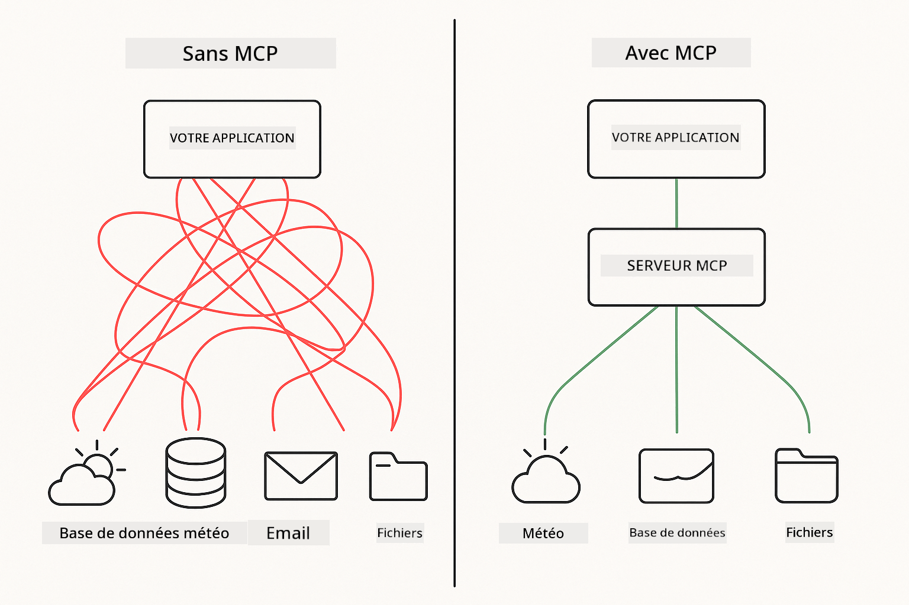
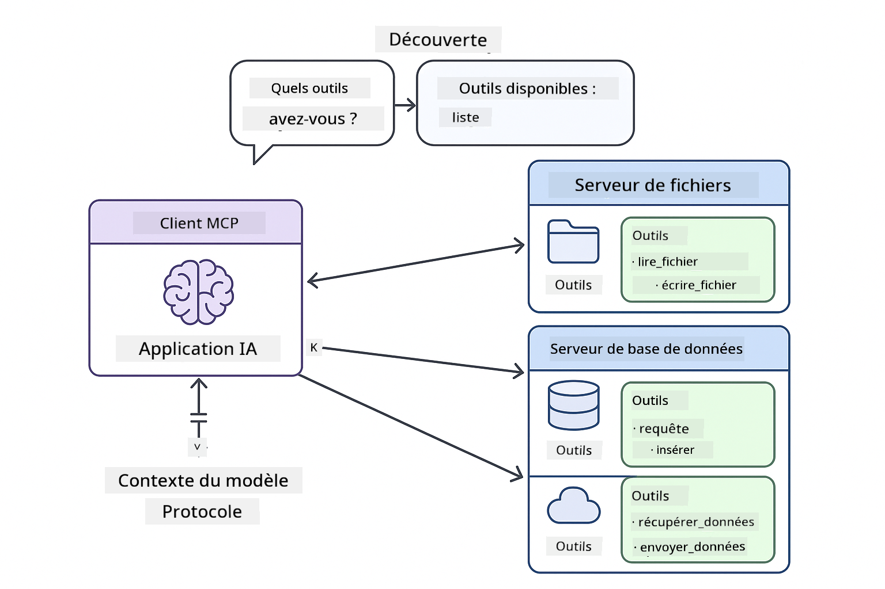
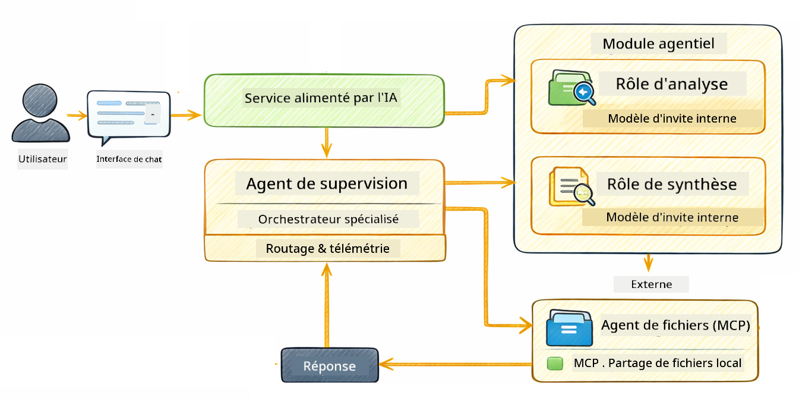

<!--
CO_OP_TRANSLATOR_METADATA:
{
  "original_hash": "f89f4c106d110e4943c055dd1a2f1dff",
  "translation_date": "2025-12-30T19:12:26+00:00",
  "source_file": "05-mcp/README.md",
  "language_code": "fr"
}
-->
# Module 05: Model Context Protocol (MCP)

## Table of Contents

- [What You'll Learn](../../../05-mcp)
- [What is MCP?](../../../05-mcp)
- [How MCP Works](../../../05-mcp)
- [The Agentic Module](../../../05-mcp)
- [Running the Examples](../../../05-mcp)
  - [Prerequisites](../../../05-mcp)
- [Quick Start](../../../05-mcp)
  - [File Operations (Stdio)](../../../05-mcp)
  - [Supervisor Agent](../../../05-mcp)
    - [Understanding the Output](../../../05-mcp)
    - [Explanation of Agentic Module Features](../../../05-mcp)
- [Key Concepts](../../../05-mcp)
- [Congratulations!](../../../05-mcp)
  - [What's Next?](../../../05-mcp)

## What You'll Learn

Vous avez construit une IA conversationnelle, maîtrisé les invites, ancré des réponses dans des documents et créé des agents avec des outils. Mais tous ces outils étaient construits sur mesure pour votre application spécifique. Et si vous pouviez donner à votre IA l'accès à un écosystème standardisé d'outils que n'importe qui peut créer et partager ? Dans ce module, vous apprendrez à faire exactement cela avec le Model Context Protocol (MCP) et le module agentique de LangChain4j. Nous commençons par présenter un simple lecteur de fichiers MCP, puis montrons comment il s'intègre facilement dans des flux de travail agentiques avancés en utilisant le pattern Supervisor Agent.

## What is MCP?

Le Model Context Protocol (MCP) offre exactement cela : une manière standard pour les applications d'IA de découvrir et d'utiliser des outils externes. Au lieu d'écrire des intégrations personnalisées pour chaque source de données ou service, vous vous connectez à des serveurs MCP qui exposent leurs capacités dans un format cohérent. Votre agent IA peut alors découvrir et utiliser automatiquement ces outils.



*Avant MCP : intégrations point à point complexes. Après MCP : un protocole, des possibilités infinies.*

MCP résout un problème fondamental dans le développement IA : chaque intégration est personnalisée. Vous voulez accéder à GitHub ? Code personnalisé. Vous voulez lire des fichiers ? Code personnalisé. Vous voulez interroger une base de données ? Code personnalisé. Et aucune de ces intégrations ne fonctionne avec d'autres applications IA.

MCP standardise cela. Un serveur MCP expose des outils avec des descriptions et des schémas clairs. Tout client MCP peut se connecter, découvrir les outils disponibles et les utiliser. Construisez une fois, utilisez partout.



*Architecture du Model Context Protocol - découverte et exécution d'outils standardisées*

## How MCP Works

**Server-Client Architecture**

MCP utilise un modèle client-serveur. Les serveurs fournissent des outils - lecture de fichiers, interrogation de bases de données, appels d'API. Les clients (votre application IA) se connectent aux serveurs et utilisent leurs outils.

Pour utiliser MCP avec LangChain4j, ajoutez cette dépendance Maven :

```xml
<dependency>
    <groupId>dev.langchain4j</groupId>
    <artifactId>langchain4j-mcp</artifactId>
    <version>${langchain4j.version}</version>
</dependency>
```

**Tool Discovery**

Lorsque votre client se connecte à un serveur MCP, il demande « Quels outils avez-vous ? ». Le serveur répond avec une liste d'outils disponibles, chacun accompagné de descriptions et de schémas de paramètres. Votre agent IA peut alors décider quels outils utiliser en fonction des demandes de l'utilisateur.

**Transport Mechanisms**

MCP prend en charge différents mécanismes de transport. Ce module démontre le transport Stdio pour les processus locaux :


*Mécanismes de transport MCP : HTTP pour les serveurs distants, Stdio pour les processus locaux*

**Stdio** - [StdioTransportDemo.java](../../../05-mcp/src/main/java/com/example/langchain4j/mcp/StdioTransportDemo.java)

Pour les processus locaux. Votre application lance un serveur en tant que sous-processus et communique via l'entrée/sortie standard. Utile pour l'accès système de fichiers ou les outils en ligne de commande.

```java
McpTransport stdioTransport = new StdioMcpTransport.Builder()
    .command(List.of(
        npmCmd, "exec",
        "@modelcontextprotocol/server-filesystem@2025.12.18",
        resourcesDir
    ))
    .logEvents(false)
    .build();
```

> **🤖 Try with [GitHub Copilot](https://github.com/features/copilot) Chat:** Ouvrez [`StdioTransportDemo.java`](../../../05-mcp/src/main/java/com/example/langchain4j/mcp/StdioTransportDemo.java) et demandez :
> - « Comment fonctionne le transport Stdio et quand devrais-je l'utiliser par rapport à HTTP ? »
> - « Comment LangChain4j gère-t-il le cycle de vie des processus serveurs MCP lancés ? »
> - « Quelles sont les implications de sécurité de donner à l'IA l'accès au système de fichiers ? »

## The Agentic Module

Alors que MCP fournit des outils standardisés, le module **agentique** de LangChain4j offre une façon déclarative de construire des agents qui orchestrent ces outils. L'annotation `@Agent` et `AgenticServices` vous permettent de définir le comportement des agents via des interfaces plutôt que du code impératif.

Dans ce module, vous explorerez le pattern **Supervisor Agent** — une approche agentique avancée où un agent « superviseur » décide dynamiquement quels sous-agents invoquer en fonction des demandes de l'utilisateur. Nous combinerons les deux concepts en donnant à l'un de nos sous-agents des capacités d'accès au système de fichiers alimentées par MCP.

Pour utiliser le module agentique, ajoutez cette dépendance Maven :

```xml
<dependency>
    <groupId>dev.langchain4j</groupId>
    <artifactId>langchain4j-agentic</artifactId>
    <version>${langchain4j.mcp.version}</version>
</dependency>
```

> **⚠️ Experimental :** le module `langchain4j-agentic` est **expérimental** et susceptible d'évoluer. La manière stable de construire des assistants IA reste `langchain4j-core` avec des outils personnalisés (Module 04).

## Running the Examples

### Prerequisites

- Java 21+, Maven 3.9+
- Node.js 16+ et npm (pour les serveurs MCP)
- Variables d'environnement configurées dans le fichier `.env` (depuis le répertoire racine) :
  - **Pour StdioTransportDemo :** `GITHUB_TOKEN` (Token d'accès personnel GitHub)
  - **Pour SupervisorAgentDemo :** `AZURE_OPENAI_ENDPOINT`, `AZURE_OPENAI_API_KEY`, `AZURE_OPENAI_DEPLOYMENT` (identiques aux Modules 01-04)

> **Note :** Si vous n'avez pas encore configuré vos variables d'environnement, voyez [Module 00 - Quick Start](../00-quick-start/README.md) pour les instructions, ou copiez `.env.example` en `.env` à la racine et remplissez vos valeurs.

## Quick Start

**Utilisation de VS Code :** Faites un clic droit sur n'importe quel fichier de démonstration dans l'Explorateur et sélectionnez **"Run Java"**, ou utilisez les configurations de lancement depuis le panneau Run and Debug (assurez-vous d'avoir ajouté votre token dans le fichier `.env` en premier).

**Utilisation de Maven :** Alternativement, vous pouvez exécuter depuis la ligne de commande avec les exemples ci-dessous.

### File Operations (Stdio)

Ceci démontre des outils basés sur des sous-processus locaux.

**✅ Aucune exigence préalable nécessaire** - le serveur MCP est lancé automatiquement.

**Utilisation de VS Code :** Faites un clic droit sur `StdioTransportDemo.java` et sélectionnez **"Run Java"**.

**Utilisation de Maven :**

**Bash:**
```bash
export GITHUB_TOKEN=your_token_here
cd 05-mcp
mvn compile exec:java -Dexec.mainClass=com.example.langchain4j.mcp.StdioTransportDemo
```

**PowerShell:**
```powershell
$env:GITHUB_TOKEN=your_token_here
cd 05-mcp
mvn --% compile exec:java -Dexec.mainClass=com.example.langchain4j.mcp.StdioTransportDemo
```

L'application lance automatiquement un serveur MCP système de fichiers et lit un fichier local. Remarquez comment la gestion des sous-processus est prise en charge pour vous.

**Sortie attendue :**
```
Assistant response: The file provides an overview of LangChain4j, an open-source Java library
for integrating Large Language Models (LLMs) into Java applications...
```

### Supervisor Agent




Le **pattern Supervisor Agent** est une forme **flexible** d'IA agentique. Contrairement aux workflows déterministes (séquentiels, boucle, parallèles), un Supervisor utilise un LLM pour décider de façon autonome quels agents invoquer en fonction de la requête de l'utilisateur.

**Combiner Supervisor avec MCP :** Dans cet exemple, nous donnons à `FileAgent` l'accès aux outils système de fichiers MCP via `toolProvider(mcpToolProvider)`. Lorsqu'un utilisateur demande de « lire et analyser un fichier », le Supervisor analyse la requête et génère un plan d'exécution. Il route ensuite la requête vers `FileAgent`, qui utilise l'outil `read_file` de MCP pour récupérer le contenu. Le Supervisor transmet ensuite ce contenu à `AnalysisAgent` pour interprétation, et invoque éventuellement `SummaryAgent` pour condenser les résultats.

Ceci montre comment les outils MCP s'intègrent parfaitement dans des flux agentiques — le Supervisor n'a pas besoin de savoir *comment* les fichiers sont lus, seulement que `FileAgent` peut le faire. Le Supervisor s'adapte dynamiquement à différents types de demandes et renvoie soit la réponse du dernier agent, soit un résumé de toutes les opérations.

**Utilisation des scripts de démarrage (recommandé) :**

Les scripts de démarrage chargent automatiquement les variables d'environnement depuis le fichier `.env` racine :

**Bash:**
```bash
cd 05-mcp
chmod +x start.sh
./start.sh
```

**PowerShell:**
```powershell
cd 05-mcp
.\start.ps1
```

**Utilisation de VS Code :** Faites un clic droit sur `SupervisorAgentDemo.java` et sélectionnez **"Run Java"** (assurez-vous que votre fichier `.env` est configuré).

**Comment fonctionne le Supervisor :**

```java
// Définir plusieurs agents avec des capacités spécifiques
FileAgent fileAgent = AgenticServices.agentBuilder(FileAgent.class)
        .chatModel(model)
        .toolProvider(mcpToolProvider)  // Dispose d'outils MCP pour les opérations sur les fichiers
        .build();

AnalysisAgent analysisAgent = AgenticServices.agentBuilder(AnalysisAgent.class)
        .chatModel(model)
        .build();

SummaryAgent summaryAgent = AgenticServices.agentBuilder(SummaryAgent.class)
        .chatModel(model)
        .build();

// Créer un superviseur qui orchestre ces agents
SupervisorAgent supervisor = AgenticServices.supervisorBuilder()
        .chatModel(model)  // Le modèle "planner"
        .subAgents(fileAgent, analysisAgent, summaryAgent)
        .responseStrategy(SupervisorResponseStrategy.SUMMARY)
        .build();

// Le superviseur décide de manière autonome quels agents invoquer
// Il suffit de fournir une requête en langage naturel - le LLM planifie l'exécution
String response = supervisor.invoke("Read the file at /path/file.txt and analyze it");
```

Voir [SupervisorAgentDemo.java](../../../05-mcp/src/main/java/com/example/langchain4j/mcp/SupervisorAgentDemo.java) pour l'implémentation complète.

> **🤖 Try with [GitHub Copilot](https://github.com/features/copilot) Chat:** Ouvrez [`SupervisorAgentDemo.java`](../../../05-mcp/src/main/java/com/example/langchain4j/mcp/SupervisorAgentDemo.java) et demandez :
> - « Comment le Supervisor décide-t-il quels agents invoquer ? »
> - « Quelle est la différence entre le pattern Supervisor et les patterns de workflow Séquentiel ? »
> - « Comment puis-je personnaliser le comportement de planification du Supervisor ? »

#### Understanding the Output

Lorsque vous exécutez la démo, vous verrez un déroulé structuré montrant comment le Supervisor orchestre plusieurs agents. Voici ce que chaque section signifie :

```
======================================================================
  SUPERVISOR AGENT DEMO
======================================================================

This demo shows how a Supervisor Agent orchestrates multiple specialized agents.
The Supervisor uses an LLM to decide which agent to call based on the task.
```

**The header** présente la démo et explique le concept central : le Supervisor utilise un LLM (et non des règles codées en dur) pour décider quels agents appeler.

```
--- AVAILABLE AGENTS -------------------------------------------------
  [FILE]     FileAgent     - Reads files using MCP filesystem tools
  [ANALYZE]  AnalysisAgent - Analyzes content for structure, tone, and themes
  [SUMMARY]  SummaryAgent  - Creates concise summaries of content
```

**Available Agents** montre les trois agents spécialisés que le Supervisor peut choisir. Chaque agent a une capacité spécifique :
- **FileAgent** peut lire des fichiers en utilisant les outils MCP (capacité externe)
- **AnalysisAgent** analyse le contenu (capacité pure LLM)
- **SummaryAgent** crée des résumés (capacité pure LLM)

```
--- USER REQUEST -----------------------------------------------------
  "Read the file at .../file.txt and analyze what it's about"
```

**User Request** montre ce qui a été demandé. Le Supervisor doit analyser cela et décider quels agents invoquer.

```
--- SUPERVISOR ORCHESTRATION -----------------------------------------
  The Supervisor will now decide which agents to invoke and in what order...

  +-- STEP 1: Supervisor chose -> FileAgent (reading file via MCP)
  |
  |   Input: .../file.txt
  |
  |   Result: LangChain4j is an open-source Java library designed to simplify...
  +-- [OK] FileAgent (reading file via MCP) completed

  +-- STEP 2: Supervisor chose -> AnalysisAgent (analyzing content)
  |
  |   Input: LangChain4j is an open-source Java library...
  |
  |   Result: Structure: The content is organized into clear paragraphs that int...
  +-- [OK] AnalysisAgent (analyzing content) completed
```

**Supervisor Orchestration** est l'endroit où la magie opère. Regardez comment :
1. Le Supervisor **a choisi FileAgent en premier** parce que la requête mentionnait « lire le fichier »
2. FileAgent a utilisé l'outil `read_file` de MCP pour récupérer le contenu du fichier
3. Le Supervisor a ensuite **choisi AnalysisAgent** et lui a transmis le contenu du fichier
4. AnalysisAgent a analysé la structure, le ton et les thèmes

Remarquez que le Supervisor a pris ces décisions **de façon autonome** en se basant sur la requête de l'utilisateur — pas de workflow codé en dur !

**Final Response** est la réponse synthétisée du Supervisor, combinant les sorties de tous les agents qu'il a invoqués. L'exemple affiche la portée agentique montrant le résumé et les résultats d'analyse stockés par chaque agent.

```
--- FINAL RESPONSE ---------------------------------------------------
I read the contents of the file and analyzed its structure, tone, and key themes.
The file introduces LangChain4j as an open-source Java library for integrating
large language models...

--- AGENTIC SCOPE (Shared Memory) ------------------------------------
  Agents store their results in a shared scope for other agents to use:
  * summary: LangChain4j is an open-source Java library...
  * analysis: Structure: The content is organized into clear paragraphs that in...
```

### Explanation of Agentic Module Features

L'exemple démontre plusieurs fonctionnalités avancées du module agentique. Regardons de plus près Agentic Scope et les Agent Listeners.

**Agentic Scope** montre la mémoire partagée où les agents ont stocké leurs résultats en utilisant `@Agent(outputKey="...")`. Cela permet :
- Aux agents ultérieurs d'accéder aux sorties des agents précédents
- Au Supervisor de synthétiser une réponse finale
- À vous d'inspecter ce que chaque agent a produit

```java
ResultWithAgenticScope<String> result = supervisor.invokeWithAgenticScope(request);
AgenticScope scope = result.agenticScope();
String story = scope.readState("story");
List<AgentInvocation> history = scope.agentInvocations("analysisAgent");
```

**Agent Listeners** permettent la surveillance et le débogage de l'exécution des agents. La sortie pas à pas que vous voyez dans la démo provient d'un AgentListener qui se branche sur chaque invocation d'agent :
- **beforeAgentInvocation** - Appelé lorsque le Supervisor sélectionne un agent, vous permettant de voir quel agent a été choisi et pourquoi
- **afterAgentInvocation** - Appelé lorsqu'un agent termine, montrant son résultat
- **inheritedBySubagents** - Quand vrai, le listener surveille tous les agents de la hiérarchie

```java
AgentListener monitor = new AgentListener() {
    private int step = 0;
    
    @Override
    public void beforeAgentInvocation(AgentRequest request) {
        step++;
        System.out.println("  +-- STEP " + step + ": " + request.agentName());
    }
    
    @Override
    public void afterAgentInvocation(AgentResponse response) {
        System.out.println("  +-- [OK] " + response.agentName() + " completed");
    }
    
    @Override
    public boolean inheritedBySubagents() {
        return true; // Propager à tous les sous-agents
    }
};
```

Au-delà du pattern Supervisor, le module `langchain4j-agentic` propose plusieurs patterns de workflow et fonctionnalités puissantes :

| Pattern | Description | Use Case |
|---------|-------------|----------|
| **Sequential** | Exécute les agents dans l'ordre, la sortie circule vers le suivant | Pipelines : recherche → analyse → rapport |
| **Parallel** | Exécute les agents simultanément | Tâches indépendantes : météo + actualités + bourse |
| **Loop** | Itère jusqu'à ce que la condition soit remplie | Notation de qualité : affiner jusqu'à score ≥ 0.8 |
| **Conditional** | Oriente selon des conditions | Classer → diriger vers un agent spécialiste |
| **Human-in-the-Loop** | Ajouter des points de contrôle humains | Workflows d'approbation, revue de contenu |

## Key Concepts

**MCP** est idéal lorsque vous voulez tirer parti d'écosystèmes d'outils existants, construire des outils que plusieurs applications peuvent partager, intégrer des services tiers avec des protocoles standards, ou remplacer des implémentations d'outils sans changer le code.

**Le module agentique** fonctionne mieux lorsque vous souhaitez des définitions d'agents déclaratives avec des annotations `@Agent`, avez besoin d'orchestration de workflows (séquentiel, boucle, parallèle), préférez la conception d'agents basée sur des interfaces plutôt que du code impératif, ou combinez plusieurs agents qui partagent des sorties via `outputKey`.

**Le pattern Supervisor Agent** brille lorsque le workflow n'est pas prévisible à l'avance et que vous voulez que le LLM décide, lorsque vous avez plusieurs agents spécialisés nécessitant une orchestration dynamique, lors de la construction de systèmes conversationnels qui redirigent vers différentes capacités, ou lorsque vous voulez le comportement d'agent le plus flexible et adaptatif.

## Congratulations!

Vous avez terminé le cours LangChain4j for Beginners. Vous avez appris :

- Comment construire une IA conversationnelle avec mémoire (Module 01)
- Des patterns de prompt engineering pour différentes tâches (Module 02)
- Ancrer des réponses dans vos documents avec RAG (Module 03)
- Créer des agents IA de base (assistants) avec des outils personnalisés (Module 04)
- Intégration d'outils standardisés avec les modules MCP et Agentic de LangChain4j (Module 05)

### Et ensuite ?

Après avoir terminé les modules, consultez le [Guide de test](../docs/TESTING.md) pour voir les concepts de test de LangChain4j en action.

**Ressources officielles:**
- [Documentation de LangChain4j](https://docs.langchain4j.dev/) - Guides complets et référence API
- [GitHub de LangChain4j](https://github.com/langchain4j/langchain4j) - Code source et exemples
- [Tutoriels LangChain4j](https://docs.langchain4j.dev/tutorials/) - Tutoriels étape par étape pour divers cas d'utilisation

Merci d'avoir suivi ce cours !

---

**Navigation:** [← Précédent: Module 04 - Outils](../04-tools/README.md) | [Retour au sommaire](../README.md)

---

<!-- CO-OP TRANSLATOR DISCLAIMER START -->
Clause de non-responsabilité :
Ce document a été traduit à l'aide du service de traduction automatique [Co-op Translator](https://github.com/Azure/co-op-translator). Bien que nous nous efforcions d'assurer l'exactitude, veuillez noter que les traductions automatiques peuvent contenir des erreurs ou des inexactitudes. Le document original dans sa langue d'origine doit être considéré comme la source faisant foi. Pour les informations critiques, il est recommandé de recourir à une traduction professionnelle réalisée par un traducteur humain. Nous déclinons toute responsabilité en cas de malentendus ou d'interprétations erronées résultant de l'utilisation de cette traduction.
<!-- CO-OP TRANSLATOR DISCLAIMER END -->