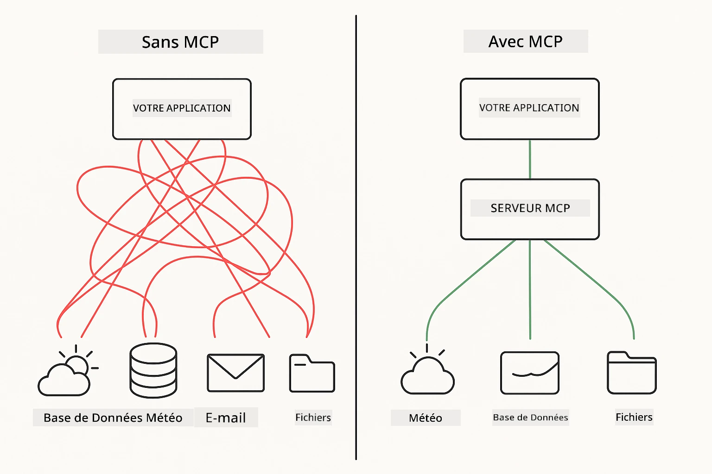
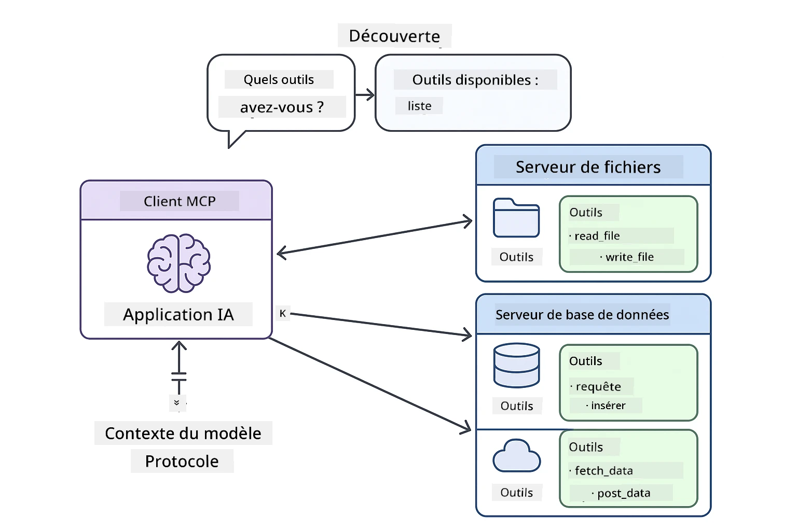
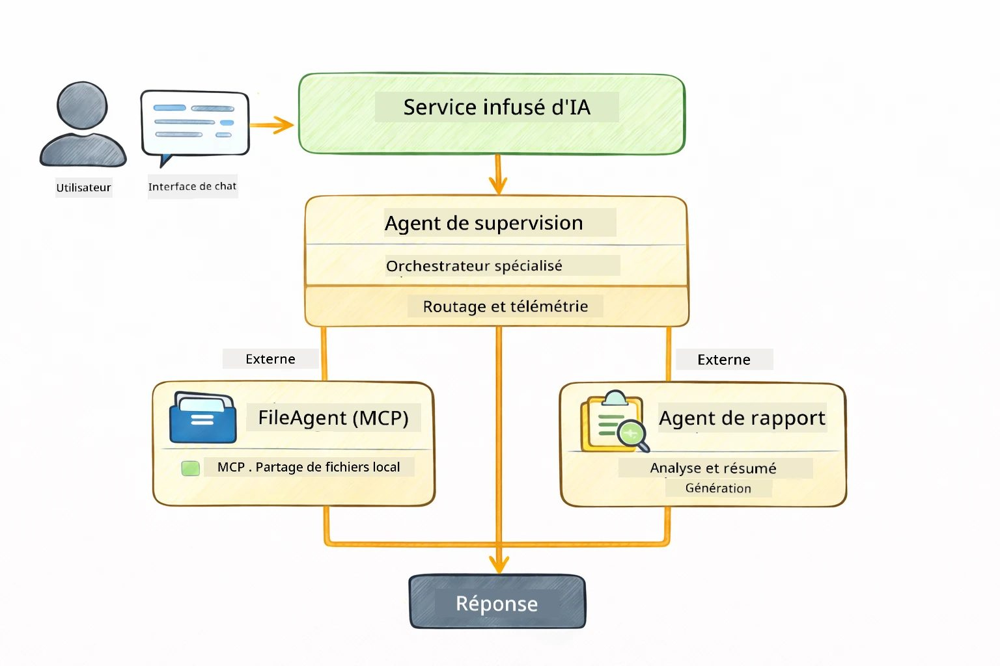

# Module 05 : Protocole de Contexte de Modèle (MCP)

## Table des matières

- [Ce que vous allez apprendre](../../../05-mcp)
- [Qu'est-ce que le MCP ?](../../../05-mcp)
- [Comment fonctionne le MCP](../../../05-mcp)
- [Le Module Agentique](../../../05-mcp)
- [Exécution des exemples](../../../05-mcp)
  - [Prérequis](../../../05-mcp)
- [Démarrage rapide](../../../05-mcp)
  - [Opérations sur fichiers (Stdio)](../../../05-mcp)
  - [Agent superviseur](../../../05-mcp)
    - [Comprendre la sortie](../../../05-mcp)
    - [Stratégies de réponse](../../../05-mcp)
    - [Explication des fonctionnalités du module agentique](../../../05-mcp)
- [Concepts clés](../../../05-mcp)
- [Félicitations !](../../../05-mcp)
  - [Et ensuite ?](../../../05-mcp)

## Ce que vous allez apprendre

Vous avez construit une IA conversationnelle, maîtrisé les prompts, ancré les réponses dans des documents, et créé des agents avec des outils. Mais tous ces outils étaient construits sur mesure pour votre application spécifique. Et si vous pouviez donner à votre IA accès à un écosystème standardisé d’outils que tout le monde peut créer et partager ? Dans ce module, vous apprendrez à faire exactement cela avec le Protocole de Contexte de Modèle (MCP) et le module agentique de LangChain4j. Nous présentons d’abord un simple lecteur de fichiers MCP, puis montrons comment il s’intègre facilement dans des workflows agentiques avancés utilisant le modèle d’Agent Superviseur.

## Qu'est-ce que le MCP ?

Le Protocole de Contexte de Modèle (MCP) offre précisément cela : une manière standard pour les applications IA de découvrir et d’utiliser des outils externes. Au lieu d’écrire des intégrations personnalisées pour chaque source de données ou service, vous vous connectez à des serveurs MCP qui exposent leurs capacités dans un format cohérent. Votre agent IA peut alors découvrir et utiliser ces outils automatiquement.



*Avant MCP : intégrations point à point complexes. Après MCP : un protocole, des possibilités infinies.*

Le MCP résout un problème fondamental dans le développement d’IA : chaque intégration est personnalisée. Vous voulez accéder à GitHub ? Code personnalisé. Vous voulez lire des fichiers ? Code personnalisé. Vous voulez interroger une base de données ? Code personnalisé. Et aucune de ces intégrations ne fonctionne avec d’autres applications IA.

Le MCP standardise cela. Un serveur MCP expose des outils avec des descriptions claires et des schémas. Tout client MCP peut se connecter, découvrir les outils disponibles et les utiliser. Construisez une fois, utilisez partout.



*Architecture du Protocole de Contexte de Modèle – découverte et exécution standardisées d’outils*

## Comment fonctionne le MCP

**Architecture Client-Serveur**

Le MCP utilise un modèle client-serveur. Les serveurs fournissent des outils — lecture de fichiers, interrogation de bases de données, appels d’API. Les clients (votre application IA) se connectent aux serveurs et utilisent leurs outils.

Pour utiliser MCP avec LangChain4j, ajoutez cette dépendance Maven :

```xml
<dependency>
    <groupId>dev.langchain4j</groupId>
    <artifactId>langchain4j-mcp</artifactId>
    <version>${langchain4j.version}</version>
</dependency>
```

**Découverte d’outils**

Quand votre client se connecte à un serveur MCP, il demande « Quels outils avez-vous ? » Le serveur répond par une liste d’outils disponibles, chacun avec descriptions et schémas de paramètres. Votre agent IA peut alors choisir les outils à utiliser selon les requêtes de l’utilisateur.

**Mécanismes de transport**

Le MCP supporte différents mécanismes de transport. Ce module démontre le transport Stdio pour les processus locaux :


*Mécanismes de transport MCP : HTTP pour serveurs distants, Stdio pour processus locaux*

**Stdio** - [StdioTransportDemo.java](../../../05-mcp/src/main/java/com/example/langchain4j/mcp/StdioTransportDemo.java)

Pour les processus locaux. Votre application lance un serveur en sous-processus et communique via entrée/sortie standard. Utile pour l’accès au système de fichiers ou outils en ligne de commande.

```java
McpTransport stdioTransport = new StdioMcpTransport.Builder()
    .command(List.of(
        npmCmd, "exec",
        "@modelcontextprotocol/server-filesystem@2025.12.18",
        resourcesDir
    ))
    .logEvents(false)
    .build();
```

> **🤖 Essayez avec [GitHub Copilot](https://github.com/features/copilot) Chat :** Ouvrez [`StdioTransportDemo.java`](../../../05-mcp/src/main/java/com/example/langchain4j/mcp/StdioTransportDemo.java) et demandez :
> - « Comment fonctionne le transport Stdio et quand devrais-je l’utiliser plutôt que HTTP ? »
> - « Comment LangChain4j gère le cycle de vie des processus serveur MCP lancés ? »
> - « Quelles sont les implications en matière de sécurité à donner à l’IA l’accès au système de fichiers ? »

## Le Module Agentique

Alors que le MCP fournit des outils standardisés, le module **agentique** de LangChain4j offre une manière déclarative de construire des agents qui orchestrent ces outils. L’annotation `@Agent` et `AgenticServices` vous permettent de définir le comportement des agents via des interfaces plutôt que du code impératif.

Dans ce module, vous explorerez le modèle d’**Agent Superviseur** — une approche agentique avancée où un agent « superviseur » décide dynamiquement quels sous-agents invoquer selon les requêtes de l’utilisateur. Nous combinons les deux concepts en donnant à un de nos sous-agents des capacités d’accès fichier propulsées par MCP.

Pour utiliser le module agentique, ajoutez cette dépendance Maven :

```xml
<dependency>
    <groupId>dev.langchain4j</groupId>
    <artifactId>langchain4j-agentic</artifactId>
    <version>${langchain4j.mcp.version}</version>
</dependency>
```

> **⚠️ Expérimental :** Le module `langchain4j-agentic` est **expérimental** et sujet à modifications. La méthode stable pour créer des assistants IA reste d’utiliser `langchain4j-core` avec des outils personnalisés (Module 04).

## Exécution des exemples

### Prérequis

- Java 21+, Maven 3.9+
- Node.js 16+ et npm (pour serveurs MCP)
- Variables d’environnement configurées dans le fichier `.env` (depuis le répertoire racine) :
  - `AZURE_OPENAI_ENDPOINT`, `AZURE_OPENAI_API_KEY`, `AZURE_OPENAI_DEPLOYMENT` (comme pour Modules 01-04)

> **Note :** Si vous n'avez pas encore configuré vos variables d’environnement, consultez [Module 00 - Démarrage rapide](../00-quick-start/README.md) pour les instructions, ou copiez `.env.example` en `.env` à la racine puis remplissez vos valeurs.

## Démarrage rapide

**Avec VS Code :** Faites un clic droit sur n’importe quel fichier de démo dans l’Explorateur et choisissez **« Run Java »** (Exécuter Java), ou utilisez les configurations de lancement dans le panneau Exécuter et Déboguer (assurez-vous d’avoir ajouté votre token dans le fichier `.env` d’abord).

**Avec Maven :** Vous pouvez aussi lancer depuis la ligne de commande avec les exemples ci-dessous.

### Opérations sur fichiers (Stdio)

Ceci démontre des outils basés sur des sous-processus locaux.

**✅ Aucun prérequis requis** – le serveur MCP est lancé automatiquement.

**Utilisation des scripts de démarrage (recommandé) :**

Les scripts de démarrage chargent automatiquement les variables d’environnement depuis le fichier `.env` racine :

**Bash :**
```bash
cd 05-mcp
chmod +x start-stdio.sh
./start-stdio.sh
```

**PowerShell :**
```powershell
cd 05-mcp
.\start-stdio.ps1
```

**Avec VS Code :** Cliquez droit sur `StdioTransportDemo.java` puis sélectionnez **« Run Java »** (vérifiez que votre `.env` est bien configuré).

L’application lance automatiquement un serveur MCP système de fichiers et lit un fichier local. Observez comment la gestion du sous-processus est automatisée pour vous.

**Sortie attendue :**
```
Assistant response: The file provides an overview of LangChain4j, an open-source Java library
for integrating Large Language Models (LLMs) into Java applications...
```

### Agent superviseur

Le modèle d’**Agent Superviseur** est une forme **flexible** d’IA agentique. Un Superviseur utilise un LLM pour décider de manière autonome quels agents invoquer selon la demande utilisateur. Dans l’exemple suivant, nous combinons l’accès fichier propulsé MCP avec un agent LLM pour créer un workflow supervisé lecture de fichier → rapport.

Dans la démo, `FileAgent` lit un fichier avec les outils chimiques MCP, et `ReportAgent` génère un rapport structuré avec un résumé exécutif (1 phrase), 3 points clés, et des recommandations. Le Superviseur orchestre ce flux automatiquement :



```
┌─────────────┐      ┌──────────────┐
│  FileAgent  │ ───▶ │ ReportAgent  │
│ (MCP tools) │      │  (pure LLM)  │
└─────────────┘      └──────────────┘
   outputKey:           outputKey:
  'fileContent'         'report'
```

Chaque agent stocke sa sortie dans la **Portée Agentique** (mémoire partagée), ce qui permet aux agents en aval d’accéder aux résultats précédents. Cela montre comment les outils MCP s’intègrent parfaitement aux workflows agéntiques — le Superviseur n’a pas besoin de savoir *comment* les fichiers sont lus, seulement que le `FileAgent` peut le faire.

#### Exécution de la démo

Les scripts de démarrage chargent automatiquement les variables d’environnement depuis le fichier `.env` racine :

**Bash :**
```bash
cd 05-mcp
chmod +x start-supervisor.sh
./start-supervisor.sh
```

**PowerShell :**
```powershell
cd 05-mcp
.\start-supervisor.ps1
```

**Avec VS Code :** Cliquez droit sur `SupervisorAgentDemo.java` puis sélectionnez **« Run Java »** (vérifiez que votre `.env` est bien configuré).

#### Comment fonctionne le Superviseur

```java
// Étape 1 : FileAgent lit les fichiers en utilisant les outils MCP
FileAgent fileAgent = AgenticServices.agentBuilder(FileAgent.class)
        .chatModel(model)
        .toolProvider(mcpToolProvider)  // Dispose des outils MCP pour les opérations sur les fichiers
        .build();

// Étape 2 : ReportAgent génère des rapports structurés
ReportAgent reportAgent = AgenticServices.agentBuilder(ReportAgent.class)
        .chatModel(model)
        .build();

// Le superviseur orchestre le flux de travail fichier → rapport
SupervisorAgent supervisor = AgenticServices.supervisorBuilder()
        .chatModel(model)
        .subAgents(fileAgent, reportAgent)
        .responseStrategy(SupervisorResponseStrategy.LAST)  // Retourner le rapport final
        .build();

// Le superviseur décide quels agents invoquer en fonction de la requête
String response = supervisor.invoke("Read the file at /path/file.txt and generate a report");
```

#### Stratégies de réponse

Lorsque vous configurez un `SupervisorAgent`, vous spécifiez comment il doit formuler sa réponse finale à l’utilisateur après que les sous-agents ont terminé leurs tâches. Les stratégies disponibles sont :

| Stratégie | Description |
|----------|-------------|
| **LAST** | Le superviseur retourne la sortie du dernier sous-agent ou outil appelé. Utile quand le dernier agent du workflow est spécifiquement conçu pour produire la réponse finale complète (par exemple, un « Agent Résumé » dans un pipeline de recherche). |
| **SUMMARY** | Le superviseur utilise son propre modèle de langage interne (LLM) pour synthétiser un résumé de toute l’interaction et des sorties des sous-agents, puis retourne ce résumé comme réponse finale. Cela fournit une réponse agrégée claire à l’utilisateur. |
| **SCORED** | Le système utilise un LLM interne pour noter à la fois la réponse LAST et le SUMMARY de l’interaction par rapport à la requête originale de l’utilisateur, et retourne la sortie qui obtient le score le plus élevé. |

Voir [SupervisorAgentDemo.java](../../../05-mcp/src/main/java/com/example/langchain4j/mcp/SupervisorAgentDemo.java) pour l’implémentation complète.

> **🤖 Essayez avec [GitHub Copilot](https://github.com/features/copilot) Chat :** Ouvrez [`SupervisorAgentDemo.java`](../../../05-mcp/src/main/java/com/example/langchain4j/mcp/SupervisorAgentDemo.java) et demandez :
> - « Comment le Superviseur décide-t-il quels agents invoquer ? »
> - « Quelle est la différence entre les modèles Superviseur et Séquentiel ? »
> - « Comment puis-je personnaliser le comportement de planification du Superviseur ? »

#### Comprendre la sortie

Lorsque vous exécutez la démo, vous verrez une présentation structurée de la manière dont le Superviseur orchestre plusieurs agents. Voici ce que signifie chaque section :

```
======================================================================
  FILE → REPORT WORKFLOW DEMO
======================================================================

This demo shows a clear 2-step workflow: read a file, then generate a report.
The Supervisor orchestrates the agents automatically based on the request.
```

**L’en-tête** introduit le concept de workflow : une chaîne ciblée de la lecture de fichier à la génération de rapport.

```
--- WORKFLOW ---------------------------------------------------------
  ┌─────────────┐      ┌──────────────┐
  │  FileAgent  │ ───▶ │ ReportAgent  │
  │ (MCP tools) │      │  (pure LLM)  │
  └─────────────┘      └──────────────┘
   outputKey:           outputKey:
   'fileContent'        'report'

--- AVAILABLE AGENTS -------------------------------------------------
  [FILE]   FileAgent   - Reads files via MCP → stores in 'fileContent'
  [REPORT] ReportAgent - Generates structured report → stores in 'report'
```

**Diagramme du workflow** montre le flux de données entre agents. Chaque agent a un rôle spécifique :
- **FileAgent** lit des fichiers avec les outils MCP et stocke le contenu brut dans `fileContent`
- **ReportAgent** utilise ce contenu pour produire un rapport structuré dans `report`

```
--- USER REQUEST -----------------------------------------------------
  "Read the file at .../file.txt and generate a report on its contents"
```

**Requête utilisateur** montre la tâche. Le Superviseur la parse et décide d’invoquer FileAgent → ReportAgent.

```
--- SUPERVISOR ORCHESTRATION -----------------------------------------
  The Supervisor decides which agents to invoke and passes data between them...

  +-- STEP 1: Supervisor chose -> FileAgent (reading file via MCP)
  |
  |   Input: .../file.txt
  |
  |   Result: LangChain4j is an open-source, provider-agnostic Java framework for building LLM...
  +-- [OK] FileAgent (reading file via MCP) completed

  +-- STEP 2: Supervisor chose -> ReportAgent (generating structured report)
  |
  |   Input: LangChain4j is an open-source, provider-agnostic Java framew...
  |
  |   Result: Executive Summary...
  +-- [OK] ReportAgent (generating structured report) completed
```

**Orchestration du Superviseur** montre le flux en 2 étapes en action :
1. **FileAgent** lit le fichier via MCP et stocke le contenu
2. **ReportAgent** reçoit le contenu et génère un rapport structuré

Le Superviseur a pris ces décisions **autonomement** selon la demande utilisateur.

```
--- FINAL RESPONSE ---------------------------------------------------
Executive Summary
...

Key Points
...

Recommendations
...

--- AGENTIC SCOPE (Data Flow) ----------------------------------------
  Each agent stores its output for downstream agents to consume:
  * fileContent: LangChain4j is an open-source, provider-agnostic Java framework...
  * report: Executive Summary...
```

#### Explication des fonctionnalités du module agentique

L’exemple démontre plusieurs fonctionnalités avancées du module agentique. Regardons de plus près la Portée Agentique et les Écouteurs d’Agents.

**Portée Agentique** montre la mémoire partagée où les agents ont stocké leurs résultats avec `@Agent(outputKey="...")`. Cela permet :
- Aux agents ultérieurs d’accéder aux sorties des agents précédents
- Au Superviseur de synthétiser une réponse finale
- À vous d’inspecter ce que chaque agent a produit

```java
ResultWithAgenticScope<String> result = supervisor.invokeWithAgenticScope(request);
AgenticScope scope = result.agenticScope();
String fileContent = scope.readState("fileContent");  // Données brutes du fichier provenant de FileAgent
String report = scope.readState("report");            // Rapport structuré provenant de ReportAgent
```

**Écouteurs d’Agents** permettent la surveillance et le débogage de l’exécution des agents. La sortie étape par étape que vous voyez dans la démo provient d’un AgentListener branché sur chaque invocation d’agent :
- **beforeAgentInvocation** - Appelé quand le Superviseur choisit un agent, vous permettant de voir quel agent a été sélectionné et pourquoi
- **afterAgentInvocation** - Appelé quand un agent termine, montrant son résultat
- **inheritedBySubagents** - Quand vrai, l’écouteur surveille tous les agents de la hiérarchie

```java
AgentListener monitor = new AgentListener() {
    private int step = 0;
    
    @Override
    public void beforeAgentInvocation(AgentRequest request) {
        step++;
        System.out.println("  +-- STEP " + step + ": " + request.agentName());
    }
    
    @Override
    public void afterAgentInvocation(AgentResponse response) {
        System.out.println("  +-- [OK] " + response.agentName() + " completed");
    }
    
    @Override
    public boolean inheritedBySubagents() {
        return true; // Propager à tous les sous-agents
    }
};
```

Au-delà du modèle Superviseur, le module `langchain4j-agentic` propose plusieurs modèles de workflow puissants et fonctionnalités :

| Modèle | Description | Cas d’usage |
|---------|-------------|-------------|
| **Séquentiel** | Exécute les agents dans l’ordre, sortie vers le suivant | Pipelines : recherche → analyse → rapport |
| **Parallèle** | Exécute les agents simultanément | Tâches indépendantes : météo + actualités + bourse |
| **Boucle** | Itère jusqu’à ce qu’une condition soit remplie | Notation qualité : affiner jusqu’à score ≥ 0.8 |
| **Conditionnel** | Oriente selon des conditions | Classification → routing vers agent spécialisé |
| **Humain dans la boucle** | Ajoute des points de contrôle humains | Workflows d’approbation, révision de contenu |

## Concepts clés

Maintenant que vous avez exploré MCP et le module agentique en action, résumons quand utiliser chaque approche.

**MCP** est idéal quand vous souhaitez exploiter des écosystèmes d’outils existants, construire des outils que plusieurs applications peuvent partager, intégrer des services tiers avec des protocoles standards, ou changer d’implémentations d’outils sans modifier le code.

**Le Module Agentique** est préférable quand vous souhaitez des définitions d’agents déclaratives avec annotations `@Agent`, avez besoin d’orchestration de flux de travail (séquentiel, boucle, parallèle), préférez une conception d’agent basée interface plutôt que du code impératif, ou combinez plusieurs agents partageant leurs sorties via `outputKey`.

**Le modèle Agent Superviseur** est particulièrement adapté lorsque le workflow n’est pas prévisible à l’avance et que vous voulez que le LLM décide, que vous possédez plusieurs agents spécialisés nécessitant une orchestration dynamique, que vous construisez des systèmes conversationnels routeurs vers différentes capacités, ou que vous souhaitez le comportement agent le plus flexible et adaptatif.
## Félicitations !

Vous avez terminé le cours LangChain4j pour débutants. Vous avez appris :

- Comment créer une IA conversationnelle avec mémoire (Module 01)
- Les modèles d'ingénierie des prompts pour différentes tâches (Module 02)
- Ancrer les réponses dans vos documents avec RAG (Module 03)
- Créer des agents IA basiques (assistants) avec des outils personnalisés (Module 04)
- Intégrer des outils standardisés avec les modules LangChain4j MCP et Agentic (Module 05)

### Et ensuite ?

Après avoir terminé les modules, explorez le [Guide de test](../docs/TESTING.md) pour voir les concepts de test de LangChain4j en action.

**Ressources officielles :**
- [Documentation LangChain4j](https://docs.langchain4j.dev/) - Guides complets et référence API
- [LangChain4j GitHub](https://github.com/langchain4j/langchain4j) - Code source et exemples
- [Tutoriels LangChain4j](https://docs.langchain4j.dev/tutorials/) - Tutoriels étape par étape pour différents cas d'utilisation

Merci d'avoir suivi ce cours !

---

**Navigation :** [← Précédent : Module 04 - Outils](../04-tools/README.md) | [Retour au début](../README.md)

---

<!-- CO-OP TRANSLATOR DISCLAIMER START -->
**Avertissement** :  
Ce document a été traduit à l’aide du service de traduction automatique [Co-op Translator](https://github.com/Azure/co-op-translator). Bien que nous nous efforcions d’assurer la précision, veuillez noter que les traductions automatisées peuvent contenir des erreurs ou des inexactitudes. Le document original dans sa langue d’origine doit être considéré comme la source faisant foi. Pour les informations critiques, une traduction professionnelle réalisée par un humain est recommandée. Nous déclinons toute responsabilité en cas de malentendus ou de mauvaises interprétations résultant de l’utilisation de cette traduction.
<!-- CO-OP TRANSLATOR DISCLAIMER END -->