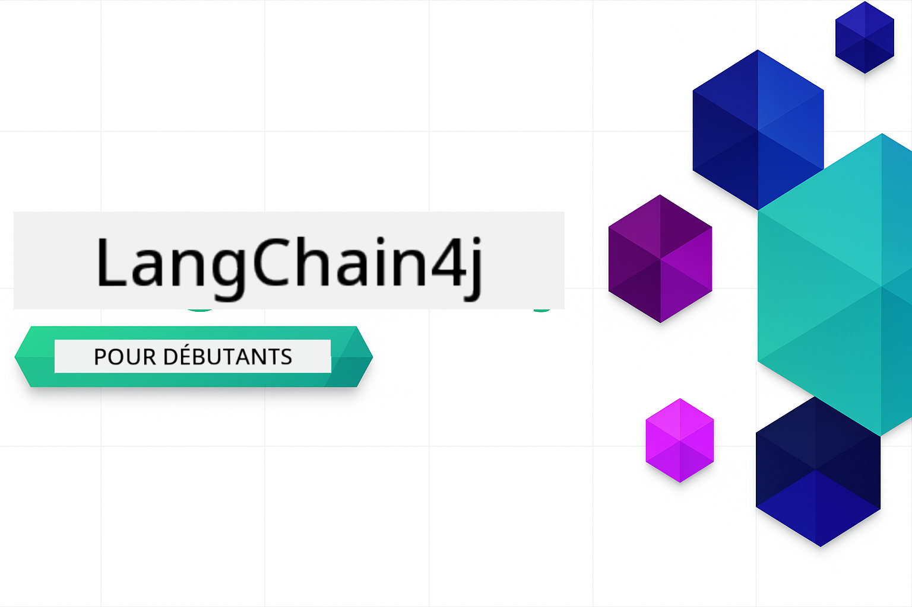
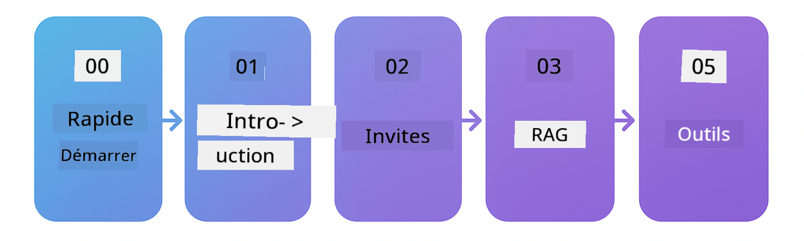

<!--
CO_OP_TRANSLATOR_METADATA:
{
  "original_hash": "1e85afe0b0ee47fc09b20442b0ee4ca5",
  "translation_date": "2025-12-23T08:09:05+00:00",
  "source_file": "README.md",
  "language_code": "fr"
}
-->


### 🌐 Support multilingue

#### Pris en charge via GitHub Action (Automatisé et toujours à jour)

<!-- CO-OP TRANSLATOR LANGUAGES TABLE START -->
[Arabe](../ar/README.md) | [Bengali](../bn/README.md) | [Bulgare](../bg/README.md) | [Birman (Myanmar)](../my/README.md) | [Chinois (Simplifié)](../zh/README.md) | [Chinois (Traditionnel, Hong Kong)](../hk/README.md) | [Chinois (Traditionnel, Macau)](../mo/README.md) | [Chinois (Traditionnel, Taïwan)](../tw/README.md) | [Croate](../hr/README.md) | [Tchèque](../cs/README.md) | [Danois](../da/README.md) | [Néerlandais](../nl/README.md) | [Estonien](../et/README.md) | [Finnois](../fi/README.md) | [Français](./README.md) | [Allemand](../de/README.md) | [Grec](../el/README.md) | [Hébreu](../he/README.md) | [Hindi](../hi/README.md) | [Hongrois](../hu/README.md) | [Indonésien](../id/README.md) | [Italien](../it/README.md) | [Japonais](../ja/README.md) | [Kannada](../kn/README.md) | [Coréen](../ko/README.md) | [Lituanien](../lt/README.md) | [Malais](../ms/README.md) | [Malayalam](../ml/README.md) | [Marathi](../mr/README.md) | [Népalais](../ne/README.md) | [Pidgin nigérian](../pcm/README.md) | [Norvégien](../no/README.md) | [Persan (Farsi)](../fa/README.md) | [Polonais](../pl/README.md) | [Portugais (Brésil)](../br/README.md) | [Portugais (Portugal)](../pt/README.md) | [Pendjabi (Gurmukhi)](../pa/README.md) | [Roumain](../ro/README.md) | [Russe](../ru/README.md) | [Serbe (cyrillique)](../sr/README.md) | [Slovaque](../sk/README.md) | [Slovène](../sl/README.md) | [Espagnol](../es/README.md) | [Swahili](../sw/README.md) | [Suédois](../sv/README.md) | [Tagalog (Philippin)](../tl/README.md) | [Tamoul](../ta/README.md) | [Télougou](../te/README.md) | [Thaï](../th/README.md) | [Turc](../tr/README.md) | [Ukrainien](../uk/README.md) | [Ourdou](../ur/README.md) | [Vietnamien](../vi/README.md)
<!-- CO-OP TRANSLATOR LANGUAGES TABLE END -->

# LangChain4j pour débutants

Un cours pour créer des applications d'IA avec LangChain4j et Azure OpenAI GPT-5, du chat de base aux agents IA.

**Nouveau sur LangChain4j ?** Consultez le [Glossaire](docs/GLOSSARY.md) pour les définitions des principaux termes et concepts.

## Table des matières

1. [Démarrage rapide](00-quick-start/README.md) - Commencez avec LangChain4j
2. [Introduction](01-introduction/README.md) - Apprenez les fondamentaux de LangChain4j
3. [Ingénierie des prompts](02-prompt-engineering/README.md) - Maîtrisez la conception efficace de prompts
4. [RAG (Retrieval-Augmented Generation)](03-rag/README.md) - Construisez des systèmes intelligents basés sur la connaissance
5. [Outils](04-tools/README.md) - Intégrez des outils externes et des API avec des agents IA
6. [MCP (Model Context Protocol)](05-mcp/README.md) - Travaillez avec le Model Context Protocol
---

##  Parcours d'apprentissage

> **Démarrage rapide**

1. Forkez ce dépôt sur votre compte GitHub
2. Cliquez sur **Code** → onglet **Codespaces** → **...** → **New with options...**
3. Utilisez les paramètres par défaut – cela sélectionnera le conteneur de développement créé pour ce cours
4. Cliquez sur **Create codespace**
5. Attendez 5 à 10 minutes que l'environnement soit prêt
6. Allez directement à [Démarrage rapide](./00-quick-start/README.md) pour commencer !

> **Préférez cloner localement ?**
>
> Ce dépôt inclut plus de 50 traductions de langues, ce qui augmente considérablement la taille du téléchargement. Pour cloner sans les traductions, utilisez le sparse checkout :
> ```bash
> git clone --filter=blob:none --sparse https://github.com/microsoft/LangChain4j-for-Beginners.git
> cd LangChain4j-for-Beginners
> git sparse-checkout set --no-cone '/*' '!translations' '!translated_images'
> ```
> Cela vous donne tout ce dont vous avez besoin pour suivre le cours avec un téléchargement beaucoup plus rapide.

Commencez par le module [Démarrage rapide](00-quick-start/README.md) et progressez à travers chaque module pour développer vos compétences pas à pas. Vous exécuterez des exemples de base pour comprendre les fondamentaux avant de passer au module [Introduction](01-introduction/README.md) pour un approfondissement avec GPT-5.



Après avoir terminé les modules, consultez le [Guide de test](docs/TESTING.md) pour voir les concepts de test de LangChain4j en action.

> **Remarque :** Cette formation utilise à la fois les GitHub Models et Azure OpenAI. Les modules [Démarrage rapide](00-quick-start/README.md) et [MCP](05-mcp/README.md) utilisent les GitHub Models (aucun abonnement Azure requis), tandis que les modules 1 à 4 utilisent Azure OpenAI GPT-5.


## Apprentissage avec GitHub Copilot

Pour commencer rapidement à coder, ouvrez ce projet dans un GitHub Codespace ou dans votre IDE local avec le devcontainer fourni. Le devcontainer utilisé dans ce cours est préconfiguré avec GitHub Copilot pour la programmation en binôme IA.

Chaque exemple de code inclut des questions suggérées que vous pouvez poser à GitHub Copilot pour approfondir votre compréhension. Recherchez les invites 💡/🤖 dans :

- **En-têtes de fichiers Java** - Questions spécifiques à chaque exemple
- **READMEs des modules** - Invites d'exploration après les exemples de code

**Comment l'utiliser :** Ouvrez n'importe quel fichier de code et posez à Copilot les questions suggérées. Il a le contexte complet de la base de code et peut expliquer, étendre et proposer des alternatives.

Vous voulez en savoir plus ? Consultez [Copilot pour la programmation assistée par IA](https://aka.ms/GitHubCopilotAI).


## Ressources supplémentaires

<!-- CO-OP TRANSLATOR OTHER COURSES START -->
### LangChain
[](https://aka.ms/langchain4j-for-beginners)
[](https://aka.ms/langchainjs-for-beginners?WT.mc_id=m365-94501-dwahlin)

---

### Azure / Edge / MCP / Agents
[](https://github.com/microsoft/AZD-for-beginners?WT.mc_id=academic-105485-koreyst)
[](https://github.com/microsoft/edgeai-for-beginners?WT.mc_id=academic-105485-koreyst)
[](https://github.com/microsoft/mcp-for-beginners?WT.mc_id=academic-105485-koreyst)
[](https://github.com/microsoft/ai-agents-for-beginners?WT.mc_id=academic-105485-koreyst)

---
 
### Série IA générative
[](https://github.com/microsoft/generative-ai-for-beginners?WT.mc_id=academic-105485-koreyst)
[-9333EA?style=for-the-badge&labelColor=E5E7EB&color=9333EA)](https://github.com/microsoft/Generative-AI-for-beginners-dotnet?WT.mc_id=academic-105485-koreyst)
[-C084FC?style=for-the-badge&labelColor=E5E7EB&color=C084FC)](https://github.com/microsoft/generative-ai-for-beginners-java?WT.mc_id=academic-105485-koreyst)
[-E879F9?style=for-the-badge&labelColor=E5E7EB&color=E879F9)](https://github.com/microsoft/generative-ai-with-javascript?WT.mc_id=academic-105485-koreyst)

---
 
### Apprentissage de base
[](https://aka.ms/ml-beginners?WT.mc_id=academic-105485-koreyst)
[](https://aka.ms/datascience-beginners?WT.mc_id=academic-105485-koreyst)
[](https://aka.ms/ai-beginners?WT.mc_id=academic-105485-koreyst)
[](https://github.com/microsoft/Security-101?WT.mc_id=academic-96948-sayoung)
[](https://aka.ms/webdev-beginners?WT.mc_id=academic-105485-koreyst)
[](https://aka.ms/iot-beginners?WT.mc_id=academic-105485-koreyst)
[](https://github.com/microsoft/xr-development-for-beginners?WT.mc_id=academic-105485-koreyst)

---
 
### Série Copilot
[](https://aka.ms/GitHubCopilotAI?WT.mc_id=academic-105485-koreyst)
[](https://github.com/microsoft/mastering-github-copilot-for-dotnet-csharp-developers?WT.mc_id=academic-105485-koreyst)
[](https://github.com/microsoft/CopilotAdventures?WT.mc_id=academic-105485-koreyst)
<!-- CO-OP TRANSLATOR OTHER COURSES END -->

## Obtenir de l'aide

Si vous êtes bloqué ou avez des questions sur la création d'applications d'IA, rejoignez :

[](https://aka.ms/foundry/discord)

Si vous avez des retours sur le produit ou des erreurs lors de la création, visitez :

[](https://aka.ms/foundry/forum)

## Licence

Licence MIT - Voir le fichier [LICENSE](../../LICENSE) pour plus de détails.

---

<!-- CO-OP TRANSLATOR DISCLAIMER START -->
Avertissement :
Ce document a été traduit à l'aide du service de traduction automatique [Co-op Translator](https://github.com/Azure/co-op-translator). Bien que nous nous efforcions d'assurer l'exactitude, veuillez noter que les traductions automatisées peuvent contenir des erreurs ou des inexactitudes. Le document original dans sa langue d'origine doit être considéré comme la source faisant foi. Pour les informations critiques, il est recommandé de recourir à une traduction professionnelle réalisée par un traducteur humain. Nous ne saurions être tenus responsables des malentendus ou des interprétations erronées résultant de l'utilisation de cette traduction.
<!-- CO-OP TRANSLATOR DISCLAIMER END -->