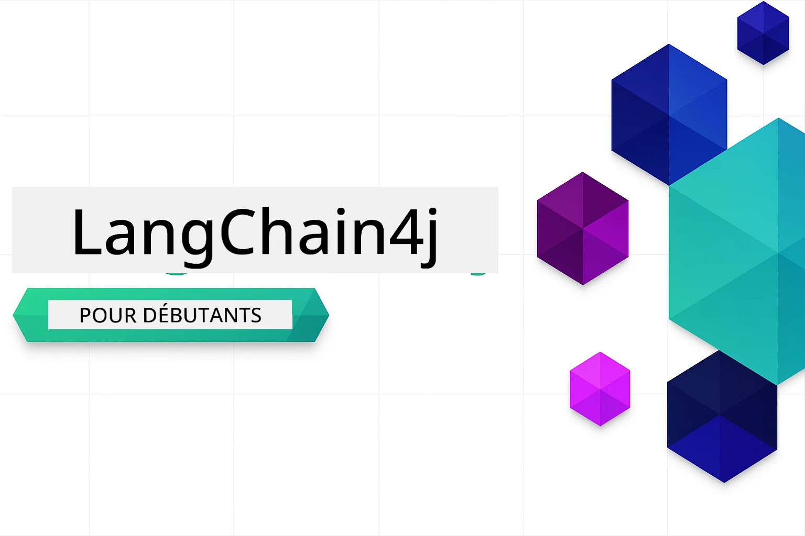

# LangChain4j pour débutants

Un cours pour construire des applications d'IA avec LangChain4j et Azure OpenAI GPT-5.2, du chat basique aux agents IA.

### 🌐 Support multilingue

#### Pris en charge via GitHub Action (Automatisé & Toujours à jour)

<!-- CO-OP TRANSLATOR LANGUAGES TABLE START -->
[Arabic](../ar/README.md) | [Bengali](../bn/README.md) | [Bulgarian](../bg/README.md) | [Burmese (Myanmar)](../my/README.md) | [Chinese (Simplified)](../zh-CN/README.md) | [Chinese (Traditional, Hong Kong)](../zh-HK/README.md) | [Chinese (Traditional, Macau)](../zh-MO/README.md) | [Chinese (Traditional, Taiwan)](../zh-TW/README.md) | [Croatian](../hr/README.md) | [Czech](../cs/README.md) | [Danish](../da/README.md) | [Dutch](../nl/README.md) | [Estonian](../et/README.md) | [Finnish](../fi/README.md) | [French](./README.md) | [German](../de/README.md) | [Greek](../el/README.md) | [Hebrew](../he/README.md) | [Hindi](../hi/README.md) | [Hungarian](../hu/README.md) | [Indonesian](../id/README.md) | [Italian](../it/README.md) | [Japanese](../ja/README.md) | [Kannada](../kn/README.md) | [Khmer](../km/README.md) | [Korean](../ko/README.md) | [Lithuanian](../lt/README.md) | [Malay](../ms/README.md) | [Malayalam](../ml/README.md) | [Marathi](../mr/README.md) | [Nepali](../ne/README.md) | [Nigerian Pidgin](../pcm/README.md) | [Norwegian](../no/README.md) | [Persian (Farsi)](../fa/README.md) | [Polish](../pl/README.md) | [Portuguese (Brazil)](../pt-BR/README.md) | [Portuguese (Portugal)](../pt-PT/README.md) | [Punjabi (Gurmukhi)](../pa/README.md) | [Romanian](../ro/README.md) | [Russian](../ru/README.md) | [Serbian (Cyrillic)](../sr/README.md) | [Slovak](../sk/README.md) | [Slovenian](../sl/README.md) | [Spanish](../es/README.md) | [Swahili](../sw/README.md) | [Swedish](../sv/README.md) | [Tagalog (Filipino)](../tl/README.md) | [Tamil](../ta/README.md) | [Telugu](../te/README.md) | [Thai](../th/README.md) | [Turkish](../tr/README.md) | [Ukrainian](../uk/README.md) | [Urdu](../ur/README.md) | [Vietnamese](../vi/README.md)

> **Préférez cloner localement ?**
>
> Ce dépôt comprend plus de 50 traductions de langues ce qui augmente significativement la taille du téléchargement. Pour cloner sans traductions, utilisez le sparse checkout :
>
> **Bash / macOS / Linux :**
> ```bash
> git clone --filter=blob:none --sparse https://github.com/microsoft/LangChain4j-for-Beginners.git
> cd LangChain4j-for-Beginners
> git sparse-checkout set --no-cone '/*' '!translations' '!translated_images'
> ```
>
> **CMD (Windows) :**
> ```cmd
> git clone --filter=blob:none --sparse https://github.com/microsoft/LangChain4j-for-Beginners.git
> cd LangChain4j-for-Beginners
> git sparse-checkout set --no-cone "/*" "!translations" "!translated_images"
> ```
>
> Cela vous fournit tout ce dont vous avez besoin pour compléter le cours avec un téléchargement beaucoup plus rapide.
<!-- CO-OP TRANSLATOR LANGUAGES TABLE END -->

## Table des matières

1. [Introduction](01-introduction/README.md) - Apprenez les fondamentaux de LangChain4j
2. [Ingénierie de prompt](02-prompt-engineering/README.md) - Maîtrisez la conception efficace de prompt
3. [RAG (Récupération Augmentée par la Génération)](03-rag/README.md) - Construisez des systèmes intelligents basés sur la connaissance
4. [Outils](04-tools/README.md) - Intégrez des outils externes et assistants simples
5. [MCP (Protocole de Contexte de Modèle)](05-mcp/README.md) - Travaillez avec le Protocole de Contexte de Modèle (MCP) et les modules Agentic

### Vidéos explicatives

Chaque module a une session en direct associée où nous parcourons les concepts et le code pas à pas.

| Module | Vidéo |
|--------|-------|
| 01 - Introduction | [Commencer avec LangChain4j](https://www.youtube.com/live/nl_troDm8rQ) |
| 02 - Ingénierie de prompt | [Ingénierie de prompt avec LangChain4j](https://www.youtube.com/live/PJ6aBaE6bog) |
| 03 - RAG | [RAG avec LangChain4j](https://www.youtube.com/watch?v=_olq75ZH_eY) |
| 04 - Outils & 05 - MCP | [Agents IA avec Outils et MCP](https://www.youtube.com/watch?v=O_J30kZc0rw) |

---

## Parcours d'apprentissage

**Nouveau sur LangChain4j ?** Consultez le [Glossaire](docs/GLOSSARY.md) pour les définitions des termes et concepts clés.

> **Démarrage rapide**

1. Forkez ce dépôt sur votre compte GitHub
2. Cliquez sur **Code** → l’onglet **Codespaces** → **...** → **Nouveau avec options...**
3. Utilisez les paramètres par défaut – cela sélectionnera le conteneur de développement créé pour ce cours
4. Cliquez sur **Créer un codespace**
5. Attendez 5 à 10 minutes pour que l’environnement soit prêt
6. Passez directement à [Introduction](./01-introduction/README.md) pour commencer !

Après avoir complété les modules, explorez le [Guide de test](docs/TESTING.md) pour voir les concepts de test LangChain4j en action.

> **Note :** Cette formation utilise Azure OpenAI. Commencez avec un [compte Azure GRATUIT](https://aka.ms/azure-free-account) si vous n’en avez pas.


## Apprentissage avec GitHub Copilot

Pour démarrer rapidement votre codage, ouvrez ce projet dans un GitHub Codespace ou votre IDE local avec le devcontainer fourni. Le devcontainer utilisé dans ce cours est préconfiguré avec GitHub Copilot pour la programmation assistée par IA.

Chaque exemple de code inclut des questions suggérées que vous pouvez poser à GitHub Copilot pour approfondir votre compréhension. Recherchez les invites 💡/🤖 dans :

- **En-têtes de fichiers Java** – Questions spécifiques à chaque exemple
- **README des modules** – Invites d’exploration après les exemples de code

**Comment utiliser :** Ouvrez n’importe quel fichier de code et posez à Copilot les questions suggérées. Il a le contexte complet du code et peut expliquer, étendre et suggérer des alternatives.

Vous souhaitez en savoir plus ? Consultez [Copilot pour la programmation assistée par IA](https://aka.ms/GitHubCopilotAI).


## Ressources supplémentaires

<!-- CO-OP TRANSLATOR OTHER COURSES START -->
### LangChain
[](https://aka.ms/langchain4j-for-beginners)
[](https://aka.ms/langchainjs-for-beginners?WT.mc_id=m365-94501-dwahlin)
[](https://github.com/microsoft/langchain-for-beginners?WT.mc_id=m365-94501-dwahlin)
---

### Azure / Edge / MCP / Agents
[](https://github.com/microsoft/AZD-for-beginners?WT.mc_id=academic-105485-koreyst)
[](https://github.com/microsoft/edgeai-for-beginners?WT.mc_id=academic-105485-koreyst)
[](https://github.com/microsoft/mcp-for-beginners?WT.mc_id=academic-105485-koreyst)
[](https://github.com/microsoft/ai-agents-for-beginners?WT.mc_id=academic-105485-koreyst)

---
 
### Série IA générative
[](https://github.com/microsoft/generative-ai-for-beginners?WT.mc_id=academic-105485-koreyst)
[-9333EA?style=for-the-badge&labelColor=E5E7EB&color=9333EA)](https://github.com/microsoft/Generative-AI-for-beginners-dotnet?WT.mc_id=academic-105485-koreyst)
[-C084FC?style=for-the-badge&labelColor=E5E7EB&color=C084FC)](https://github.com/microsoft/generative-ai-for-beginners-java?WT.mc_id=academic-105485-koreyst)
[-E879F9?style=for-the-badge&labelColor=E5E7EB&color=E879F9)](https://github.com/microsoft/generative-ai-with-javascript?WT.mc_id=academic-105485-koreyst)

---
 
### Apprentissage fondamental
[](https://aka.ms/ml-beginners?WT.mc_id=academic-105485-koreyst)
[](https://aka.ms/datascience-beginners?WT.mc_id=academic-105485-koreyst)
[](https://aka.ms/ai-beginners?WT.mc_id=academic-105485-koreyst)
[](https://github.com/microsoft/Security-101?WT.mc_id=academic-96948-sayoung)
[](https://aka.ms/webdev-beginners?WT.mc_id=academic-105485-koreyst)
[](https://aka.ms/iot-beginners?WT.mc_id=academic-105485-koreyst)
[](https://github.com/microsoft/xr-development-for-beginners?WT.mc_id=academic-105485-koreyst)

---
 
### Série Copilot
[](https://aka.ms/GitHubCopilotAI?WT.mc_id=academic-105485-koreyst)
[](https://github.com/microsoft/mastering-github-copilot-for-dotnet-csharp-developers?WT.mc_id=academic-105485-koreyst)
[](https://github.com/microsoft/CopilotAdventures?WT.mc_id=academic-105485-koreyst)
<!-- CO-OP TRANSLATOR OTHER COURSES END -->

## Obtenir de l'aide

Si vous êtes bloqué ou avez des questions sur la création d'applications IA, rejoignez :

[](https://aka.ms/foundry/discord)

Si vous avez des retours sur le produit ou des erreurs lors de la création, visitez :

[](https://aka.ms/foundry/forum)

## Licence

Licence MIT - Voir le fichier [LICENSE](../../LICENSE) pour plus de détails.

---

<!-- CO-OP TRANSLATOR DISCLAIMER START -->
**Avertissement** :
Ce document a été traduit à l'aide du service de traduction automatique [Co-op Translator](https://github.com/Azure/co-op-translator). Bien que nous nous efforçions d'assurer l'exactitude, veuillez noter que les traductions automatisées peuvent contenir des erreurs ou des inexactitudes. Le document original dans sa langue native doit être considéré comme la source faisant autorité. Pour les informations critiques, il est recommandé de recourir à une traduction professionnelle réalisée par un humain. Nous ne saurions être tenus responsables des malentendus ou erreurs d'interprétation découlant de l'utilisation de cette traduction.
<!-- CO-OP TRANSLATOR DISCLAIMER END -->