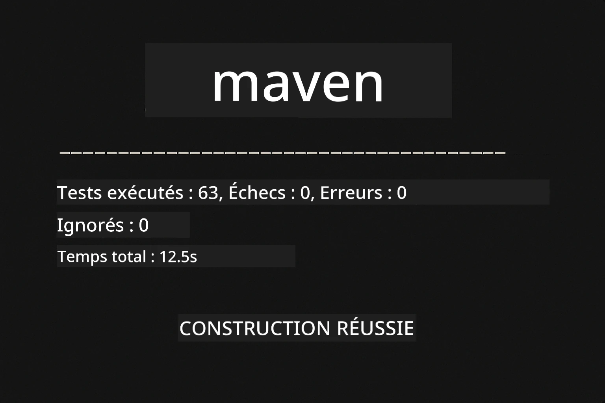
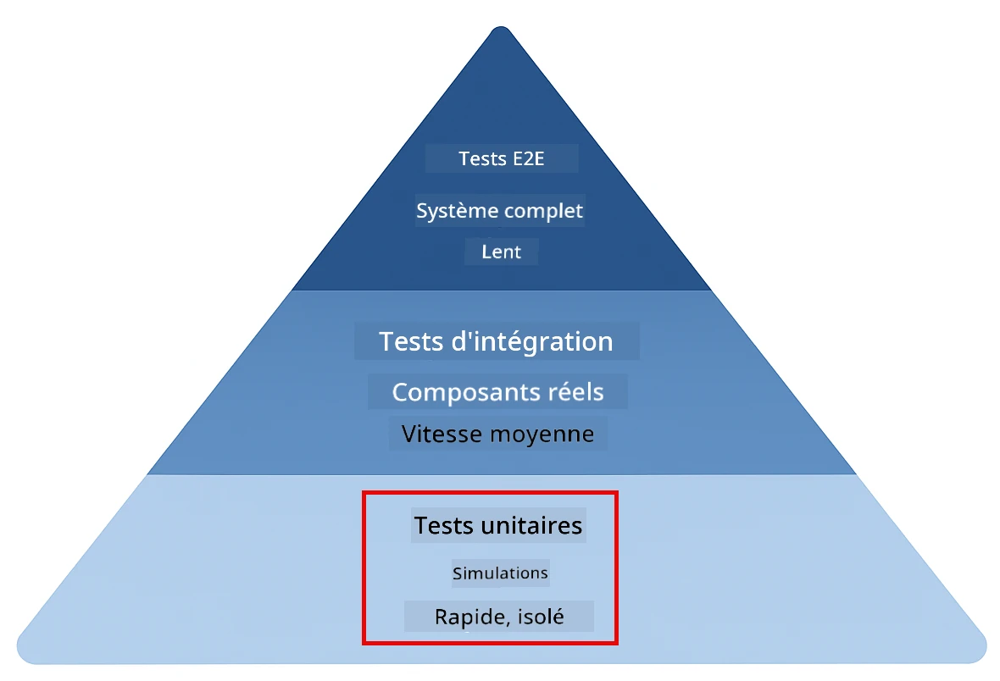
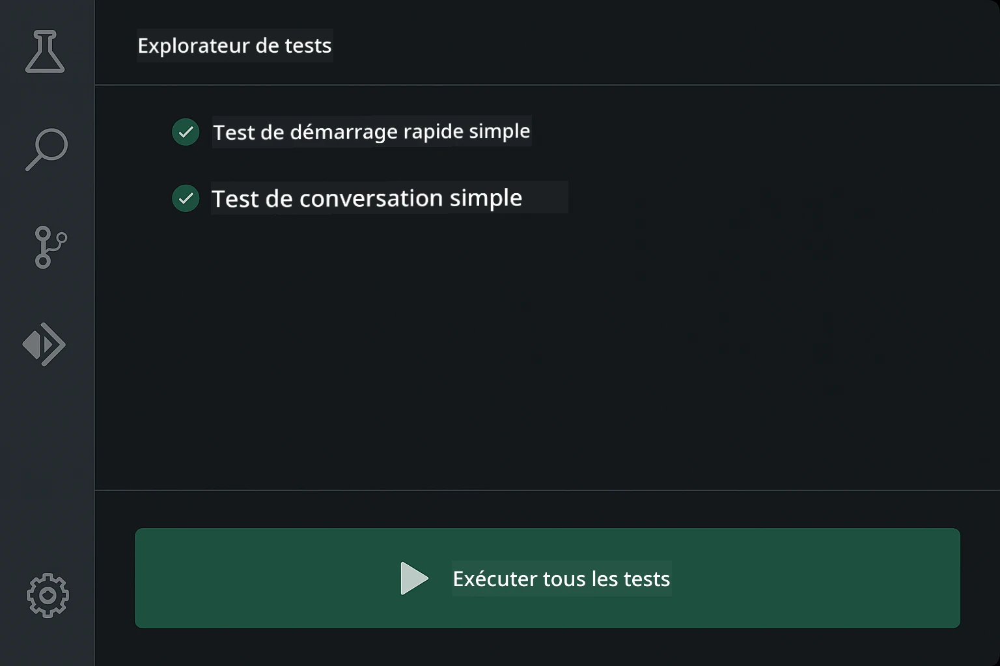
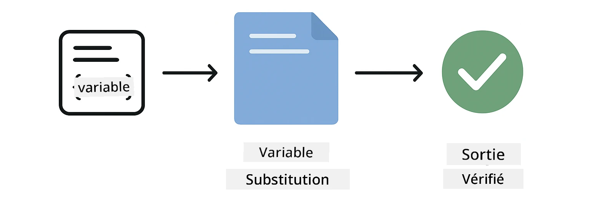
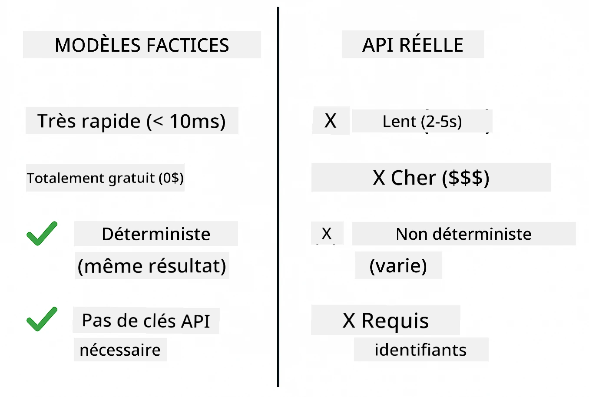
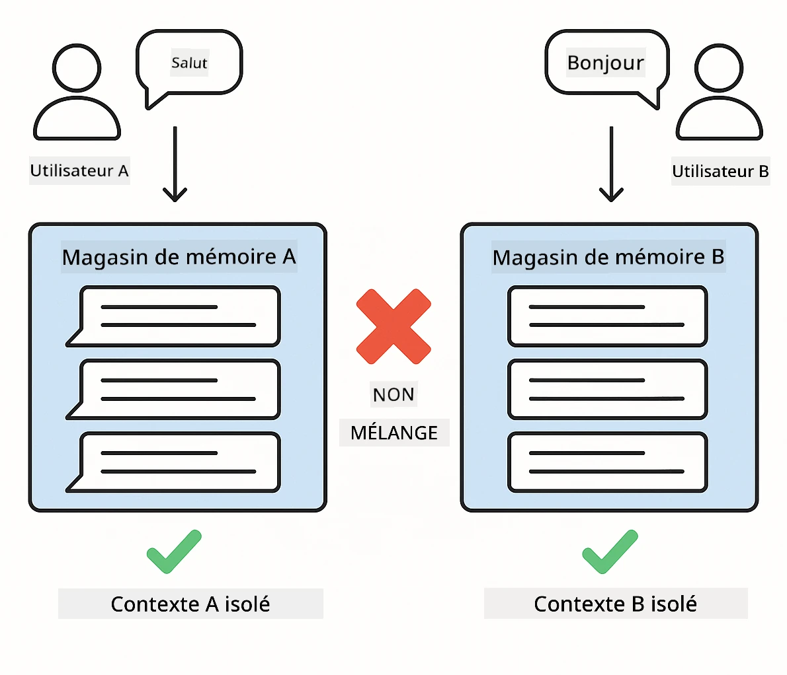
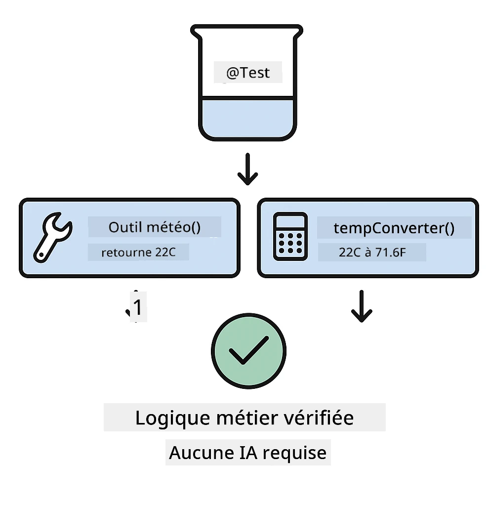
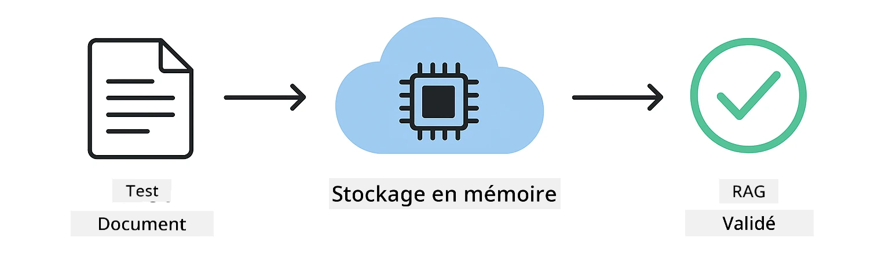

# Tester des applications LangChain4j

## Table of Contents

- [Démarrage rapide](../../../docs)
- [Ce que couvrent les tests](../../../docs)
- [Exécution des tests](../../../docs)
- [Exécuter les tests dans VS Code](../../../docs)
- [Patrons de test](../../../docs)
- [Philosophie des tests](../../../docs)
- [Prochaines étapes](../../../docs)

Ce guide vous explique les tests qui démontrent comment tester des applications d'IA sans nécessiter de clés d'API ni de services externes.

## Quick Start

Exécutez tous les tests avec une seule commande :

**Bash:**
```bash
mvn test
```

**PowerShell:**
```powershell
mvn --% test
```



*Exécution réussie des tests montrant que tous les tests passent sans aucun échec*

## What the Tests Cover

Ce cours se concentre sur les **tests unitaires** qui s'exécutent localement. Chaque test démontre un concept spécifique de LangChain4j en isolation.



*Pyramide de tests montrant l'équilibre entre les tests unitaires (rapides, isolés), les tests d'intégration (composants réels) et les tests de bout en bout. Cette formation couvre les tests unitaires.*

| Module | Tests | Focus | Key Files |
|--------|-------|-------|-----------|
| **00 - Démarrage rapide** | 6 | Modèles de prompt et substitution de variables | `SimpleQuickStartTest.java` |
| **01 - Introduction** | 8 | Mémoire de conversation et chat à état | `SimpleConversationTest.java` |
| **02 - Ingénierie des prompts** | 12 | Patterns GPT-5, niveaux d'empressement, sortie structurée | `SimpleGpt5PromptTest.java` |
| **03 - RAG** | 10 | Ingestion de documents, embeddings, recherche par similarité | `DocumentServiceTest.java` |
| **04 - Outils** | 12 | Appel de fonctions et chaînage d'outils | `SimpleToolsTest.java` |
| **05 - MCP** | 8 | Model Context Protocol with Stdio transport | `SimpleMcpTest.java` |

## Running the Tests

**Run all tests from root:**

**Bash:**
```bash
mvn test
```

**PowerShell:**
```powershell
mvn --% test
```

**Run tests for a specific module:**

**Bash:**
```bash
cd 01-introduction && mvn test
# Ou en tant que root
mvn test -pl 01-introduction
```

**PowerShell:**
```powershell
cd 01-introduction; mvn --% test
# Ou en tant que root
mvn --% test -pl 01-introduction
```

**Run a single test class:**

**Bash:**
```bash
mvn test -Dtest=SimpleConversationTest
```

**PowerShell:**
```powershell
mvn --% test -Dtest=SimpleConversationTest
```

**Run a specific test method:**

**Bash:**
```bash
mvn test -Dtest=SimpleConversationTest#devrait maintenir l'historique de la conversation
```

**PowerShell:**
```powershell
mvn --% test -Dtest=SimpleConversationTest#doit conserver l'historique de la conversation
```

## Running Tests in VS Code

Si vous utilisez Visual Studio Code, le Test Explorer fournit une interface graphique pour exécuter et déboguer les tests.



*L'explorateur de tests VS Code montrant l'arborescence des tests avec toutes les classes de test Java et les méthodes de test individuelles*

**To run tests in VS Code:**

1. Open the Test Explorer by clicking the beaker icon in the Activity Bar
2. Expand the test tree to see all modules and test classes
3. Click the play button next to any test to run it individually
4. Click "Run All Tests" to execute the entire suite
5. Right-click any test and select "Debug Test" to set breakpoints and step through code

The Test Explorer shows green checkmarks for passing tests and provides detailed failure messages when tests fail.

## Testing Patterns

### Patron 1: Tester les modèles de prompt

Le patron le plus simple teste les modèles de prompt sans appeler de modèle d'IA. Vous vérifiez que la substitution des variables fonctionne correctement et que les prompts sont formatés comme prévu.



*Test de modèles de prompt montrant le flux de substitution de variables : modèle avec espaces réservés → valeurs appliquées → sortie formatée vérifiée*

```java
@Test
@DisplayName("Should format prompt template with variables")
void testPromptTemplateFormatting() {
    PromptTemplate template = PromptTemplate.from(
        "Best time to visit {{destination}} for {{activity}}?"
    );
    
    Prompt prompt = template.apply(Map.of(
        "destination", "Paris",
        "activity", "sightseeing"
    ));
    
    assertThat(prompt.text()).isEqualTo("Best time to visit Paris for sightseeing?");
}
```

Ce test se trouve dans `00-quick-start/src/test/java/com/example/langchain4j/quickstart/SimpleQuickStartTest.java`.

**Run it:**

**Bash:**
```bash
cd 00-quick-start && mvn test -Dtest=SimpleQuickStartTest#test de formatage du modèle d'invite
```

**PowerShell:**
```powershell
cd 00-quick-start; mvn --% test -Dtest=SimpleQuickStartTest#test de formatage du modèle de prompt
```

### Patron 2: Simuler les modèles de langage

Lors des tests de la logique de conversation, utilisez Mockito pour créer des modèles factices qui renvoient des réponses prédéterminées. Cela rend les tests rapides, gratuits et déterministes.



*Comparaison montrant pourquoi les maquettes sont préférées pour les tests : elles sont rapides, gratuites, déterministes et ne nécessitent pas de clés API*

```java
@ExtendWith(MockitoExtension.class)
class SimpleConversationTest {
    
    private ConversationService conversationService;
    
    @Mock
    private OpenAiOfficialChatModel mockChatModel;
    
    @BeforeEach
    void setUp() {
        ChatResponse mockResponse = ChatResponse.builder()
            .aiMessage(AiMessage.from("This is a test response"))
            .build();
        when(mockChatModel.chat(anyList())).thenReturn(mockResponse);
        
        conversationService = new ConversationService(mockChatModel);
    }
    
    @Test
    void shouldMaintainConversationHistory() {
        String conversationId = conversationService.startConversation();
        
        ChatResponse mockResponse1 = ChatResponse.builder()
            .aiMessage(AiMessage.from("Response 1"))
            .build();
        ChatResponse mockResponse2 = ChatResponse.builder()
            .aiMessage(AiMessage.from("Response 2"))
            .build();
        ChatResponse mockResponse3 = ChatResponse.builder()
            .aiMessage(AiMessage.from("Response 3"))
            .build();
        
        when(mockChatModel.chat(anyList()))
            .thenReturn(mockResponse1)
            .thenReturn(mockResponse2)
            .thenReturn(mockResponse3);

        conversationService.chat(conversationId, "First message");
        conversationService.chat(conversationId, "Second message");
        conversationService.chat(conversationId, "Third message");

        List<ChatMessage> history = conversationService.getHistory(conversationId);
        assertThat(history).hasSize(6); // 3 messages utilisateur + 3 messages IA
    }
}
```

Ce patron apparaît dans `01-introduction/src/test/java/com/example/langchain4j/service/SimpleConversationTest.java`. La maquette garantit un comportement cohérent afin que vous puissiez vérifier que la gestion de la mémoire fonctionne correctement.

### Patron 3: Tester l'isolation des conversations

La mémoire de conversation doit garder les utilisateurs séparés. Ce test vérifie que les conversations ne mélangent pas les contextes.



*Test de l'isolation des conversations montrant des magasins de mémoire séparés pour différents utilisateurs afin d'empêcher le mélange de contextes*

```java
@Test
void shouldIsolateConversationsByid() {
    String conv1 = conversationService.startConversation();
    String conv2 = conversationService.startConversation();
    
    ChatResponse mockResponse = ChatResponse.builder()
        .aiMessage(AiMessage.from("Response"))
        .build();
    when(mockChatModel.chat(anyList())).thenReturn(mockResponse);

    conversationService.chat(conv1, "Message for conversation 1");
    conversationService.chat(conv2, "Message for conversation 2");

    List<ChatMessage> history1 = conversationService.getHistory(conv1);
    List<ChatMessage> history2 = conversationService.getHistory(conv2);
    
    assertThat(history1).hasSize(2);
    assertThat(history2).hasSize(2);
}
```

Chaque conversation conserve son propre historique indépendant. Dans les systèmes de production, cette isolation est critique pour les applications multi-utilisateurs.

### Patron 4: Tester les outils indépendamment

Les outils sont des fonctions que l'IA peut appeler. Testez-les directement pour garantir qu'ils fonctionnent correctement indépendamment des décisions de l'IA.



*Test des outils indépendamment montrant l'exécution d'un outil simulé sans appels d'IA pour vérifier la logique métier*

```java
@Test
void shouldConvertCelsiusToFahrenheit() {
    TemperatureTool tempTool = new TemperatureTool();
    String result = tempTool.celsiusToFahrenheit(25.0);
    assertThat(result).containsPattern("77[.,]0°F");
}

@Test
void shouldDemonstrateToolChaining() {
    WeatherTool weatherTool = new WeatherTool();
    TemperatureTool tempTool = new TemperatureTool();

    String weatherResult = weatherTool.getCurrentWeather("Seattle");
    assertThat(weatherResult).containsPattern("\\d+°C");

    String conversionResult = tempTool.celsiusToFahrenheit(22.0);
    assertThat(conversionResult).containsPattern("71[.,]6°F");
}
```

Ces tests dans `04-tools/src/test/java/com/example/langchain4j/agents/tools/SimpleToolsTest.java` valident la logique des outils sans intervention de l'IA. L'exemple de chaînage montre comment la sortie d'un outil alimente l'entrée d'un autre.

### Patron 5: Test RAG en mémoire

Les systèmes RAG nécessitent traditionnellement des bases de données vectorielles et des services d'embeddings. Le modèle en mémoire vous permet de tester l'ensemble du pipeline sans dépendances externes.



*Flux de test RAG en mémoire montrant l'analyse de documents, le stockage des embeddings et la recherche par similarité sans nécessiter de base de données*

```java
@Test
void testProcessTextDocument() {
    String content = "This is a test document.\nIt has multiple lines.";
    InputStream inputStream = new ByteArrayInputStream(content.getBytes(StandardCharsets.UTF_8));
    
    DocumentService.ProcessedDocument result = 
        documentService.processDocument(inputStream, "test.txt");

    assertNotNull(result);
    assertTrue(result.segments().size() > 0);
    assertEquals("test.txt", result.segments().get(0).metadata().getString("filename"));
}
```

Ce test de `03-rag/src/test/java/com/example/langchain4j/rag/service/DocumentServiceTest.java` crée un document en mémoire et vérifie le découpage en morceaux et la gestion des métadonnées.

### Patron 6: Tests d'intégration MCP

Le module MCP teste l'intégration du Model Context Protocol en utilisant le transport stdio. Ces tests vérifient que votre application peut lancer et communiquer avec des serveurs MCP en tant que sous-processus.

Les tests dans `05-mcp/src/test/java/com/example/langchain4j/mcp/SimpleMcpTest.java` valident le comportement du client MCP.

**Run them:**

**Bash:**
```bash
cd 05-mcp && mvn test
```

**PowerShell:**
```powershell
cd 05-mcp; mvn --% test
```

## Testing Philosophy

Testez votre code, pas l'IA. Vos tests doivent valider le code que vous écrivez en vérifiant comment les prompts sont construits, comment la mémoire est gérée, et comment les outils s'exécutent. Les réponses de l'IA varient et ne devraient pas faire partie des assertions des tests. Demandez-vous si votre modèle de prompt substitue correctement les variables, et non si l'IA donne la bonne réponse.

Utilisez des maquettes pour les modèles de langage. Ce sont des dépendances externes lentes, coûteuses et non déterministes. La simulation rend les tests rapides (millisecondes au lieu de secondes), gratuits (pas de coûts d'API) et déterministes (même résultat à chaque fois).

Gardez les tests indépendants. Chaque test doit configurer ses propres données, ne pas dépendre d'autres tests, et nettoyer après lui-même. Les tests doivent réussir indépendamment de l'ordre d'exécution.

Testez les cas limites au-delà du chemin heureux. Essayez des entrées vides, des entrées très volumineuses, des caractères spéciaux, des paramètres invalides et des conditions limites. Ceux-ci révèlent souvent des bugs non exposés par l'utilisation normale.

Utilisez des noms descriptifs. Comparez `shouldMaintainConversationHistoryAcrossMultipleMessages()` avec `test1()`. Le premier indique exactement ce qui est testé, ce qui facilite grandement le débogage des échecs.

## Next Steps

Maintenant que vous comprenez les schémas de test, plongez plus profondément dans chaque module :

- **[00 - Démarrage rapide](../00-quick-start/README.md)** - Commencez par les bases des modèles de prompt
- **[01 - Introduction](../01-introduction/README.md)** - Apprenez la gestion de la mémoire de conversation
- **[02 - Ingénierie des prompts](../02-prompt-engineering/README.md)** - Maîtrisez les patterns de prompting GPT-5
- **[03 - RAG](../03-rag/README.md)** - Construisez des systèmes de génération augmentée par récupération
- **[04 - Outils](../04-tools/README.md)** - Implémentez l'appel de fonctions et les chaînes d'outils
- **[05 - MCP](../05-mcp/README.md)** - Intégrez le Model Context Protocol

Le README de chaque module fournit des explications détaillées des concepts testés ici.

---

**Navigation:** [← Retour au README principal](../README.md)

---

<!-- CO-OP TRANSLATOR DISCLAIMER START -->
Avis de non-responsabilité :
Ce document a été traduit à l'aide du service de traduction par IA Co-op Translator (https://github.com/Azure/co-op-translator). Bien que nous nous efforcions d'assurer l'exactitude, veuillez noter que les traductions automatisées peuvent contenir des erreurs ou des inexactitudes. La version originale du document, dans sa langue d'origine, doit être considérée comme la version faisant foi. Pour les informations critiques, il est recommandé de recourir à une traduction professionnelle réalisée par un traducteur humain. Nous déclinons toute responsabilité pour tout malentendu ou toute interprétation erronée résultant de l'utilisation de cette traduction.
<!-- CO-OP TRANSLATOR DISCLAIMER END -->