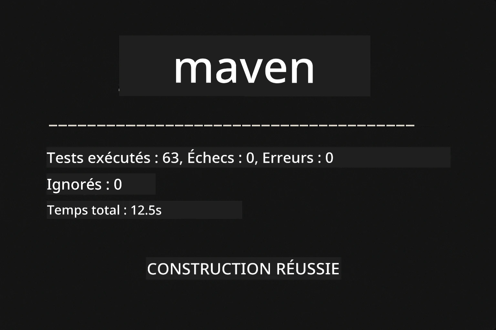
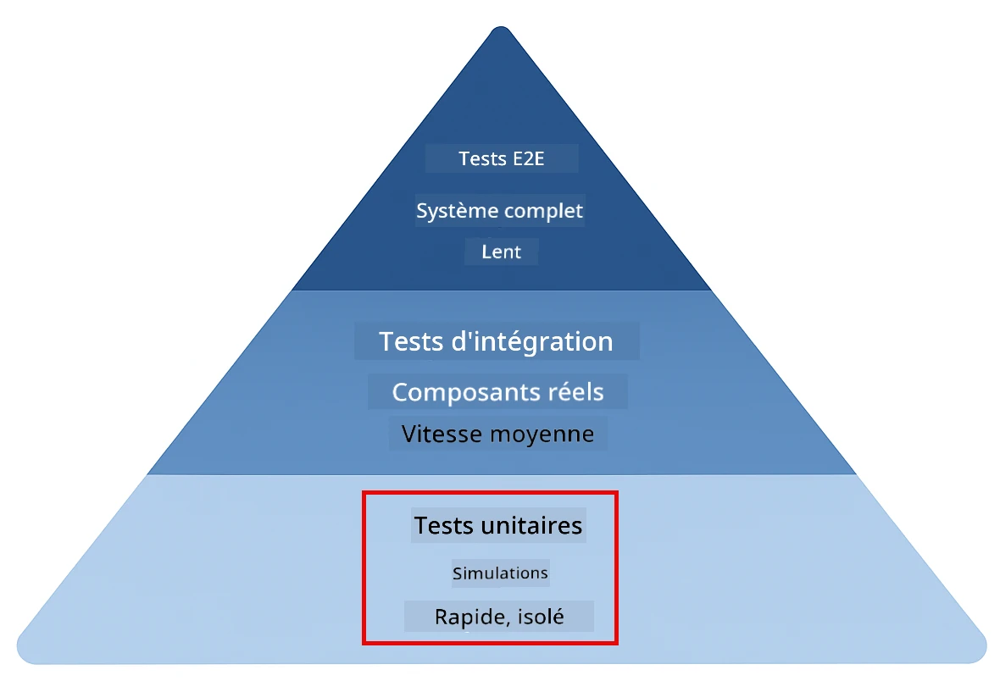
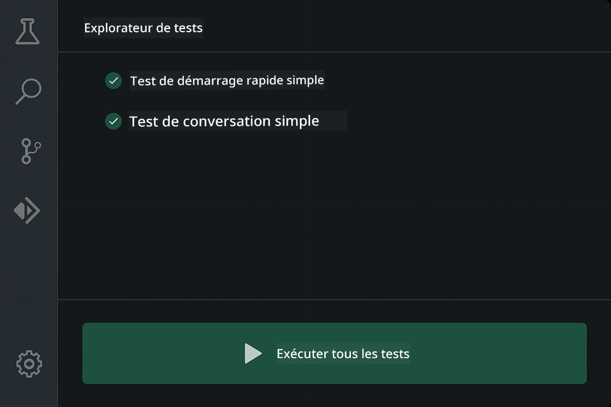
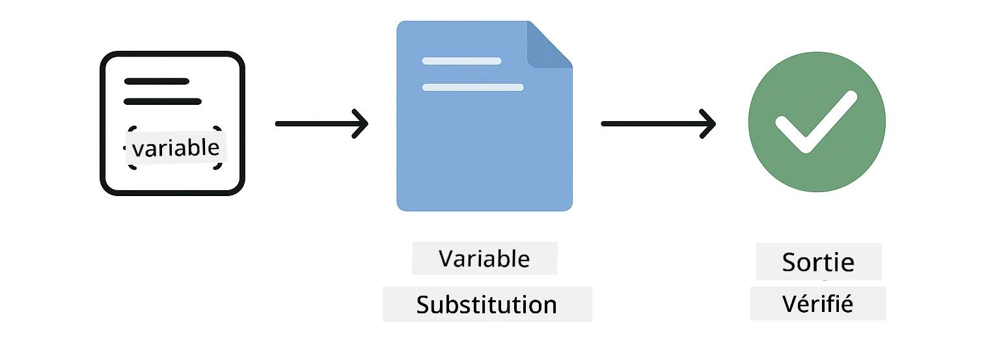
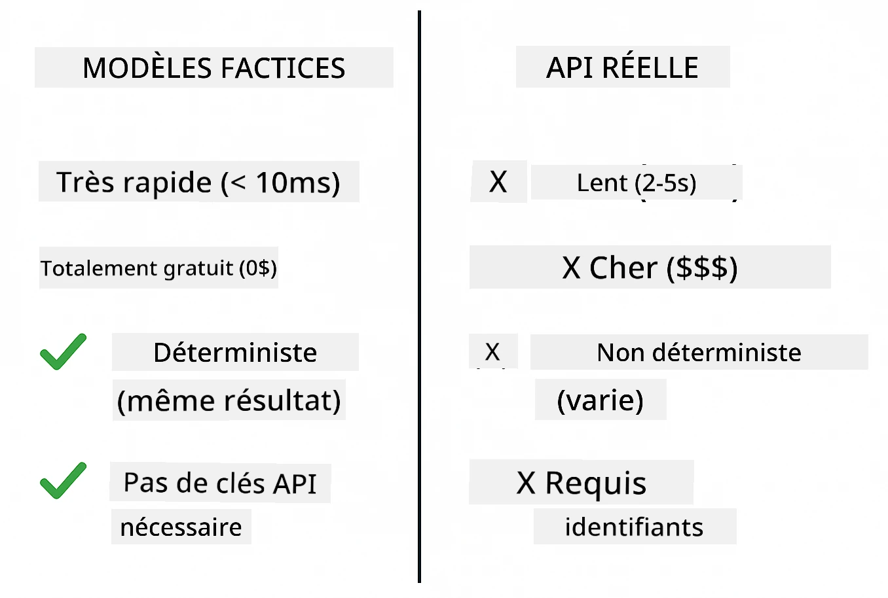
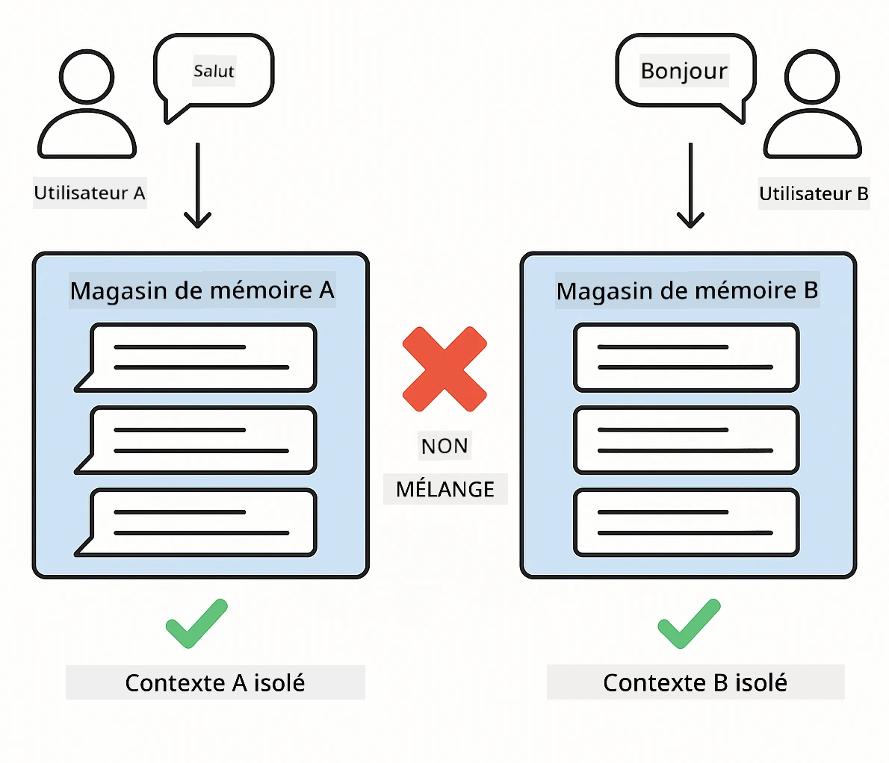
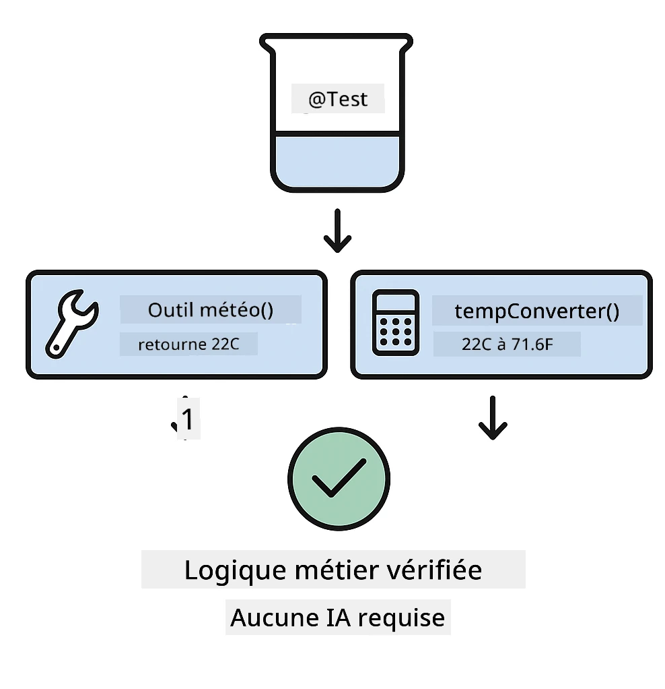
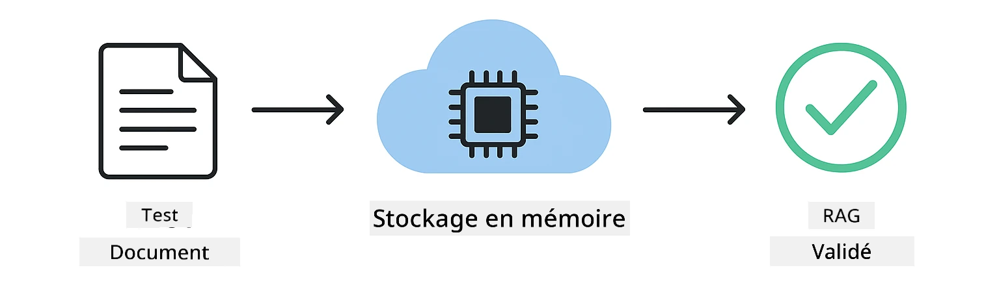

# Tester les applications LangChain4j

## Table des matières

- [Démarrage rapide](#démarrage-rapide)
- [Ce que couvrent les tests](#ce-que-couvrent-les-tests)
- [Exécution des tests](#exécution-des-tests)
- [Exécution des tests dans VS Code](#exécution-des-tests-dans-vs-code)
- [Modèles de test](#modèles-de-test)
- [Philosophie de test](#philosophie-de-test)
- [Étapes suivantes](#étapes-suivantes)

Ce guide vous accompagne à travers les tests qui démontrent comment tester des applications IA sans nécessiter de clés API ou de services externes.

## Démarrage rapide

Exécutez tous les tests avec une seule commande :

**Bash :**
```bash
mvn test
```

**PowerShell :**
```powershell
mvn --% test
```

Lorsque tous les tests réussissent, vous devriez voir une sortie similaire à la capture d'écran ci-dessous — les tests s'exécutent sans aucune erreur.



*Exécution réussie des tests montrant que tous les tests sont passés sans aucune erreur*

## Ce que couvrent les tests

Ce cours se concentre sur les **tests unitaires** qui s'exécutent localement. Chaque test démontre un concept spécifique de LangChain4j isolément. La pyramide de tests ci-dessous montre où s'inscrivent les tests unitaires — ils forment la base rapide et fiable sur laquelle le reste de votre stratégie de test se construit.



*Pyramide de tests montrant l'équilibre entre tests unitaires (rapides, isolés), tests d'intégration (composants réels) et tests de bout en bout. Cette formation couvre les tests unitaires.*

| Module | Tests | Focus | Fichiers clés |
|--------|-------|-------|---------------|
| **01 - Introduction** | 8 | Mémoire de conversation et chat avec état | `SimpleConversationTest.java` |
| **02 - Prompt Engineering** | 12 | Modèles GPT-5.2, niveaux d'empressement, sortie structurée | `SimpleGpt5PromptTest.java` |
| **03 - RAG** | 10 | Ingestion de documents, embeddings, recherche de similarité | `DocumentServiceTest.java` |
| **04 - Outils** | 12 | Appels de fonctions et chaînage d'outils | `SimpleToolsTest.java` |
| **05 - MCP** | 8 | Protocole de contexte de modèle avec transport Stdio | `SimpleMcpTest.java` |

## Exécution des tests

**Exécuter tous les tests depuis la racine :**

**Bash :**
```bash
mvn test
```

**PowerShell :**
```powershell
mvn --% test
```

**Exécuter les tests pour un module spécifique :**

**Bash :**
```bash
cd 01-introduction && mvn test
# Ou depuis la racine
mvn test -pl 01-introduction
```

**PowerShell :**
```powershell
cd 01-introduction; mvn --% test
# Ou depuis la racine
mvn --% test -pl 01-introduction
```

**Exécuter une seule classe de test :**

**Bash :**
```bash
mvn test -Dtest=SimpleConversationTest
```

**PowerShell :**
```powershell
mvn --% test -Dtest=SimpleConversationTest
```

**Exécuter une méthode de test spécifique :**

**Bash :**
```bash
mvn test -Dtest=SimpleConversationTest#devraitMaintenirLHistoriqueDeConversation
```

**PowerShell :**
```powershell
mvn --% test -Dtest=SimpleConversationTest#doitMaintenirLhistoriqueDeLaConversation
```

## Exécution des tests dans VS Code

Si vous utilisez Visual Studio Code, l'Explorateur de tests offre une interface graphique pour exécuter et déboguer les tests.



*Explorateur de tests VS Code affichant l'arbre des tests avec toutes les classes de test Java et les méthodes de test individuelles*

**Pour exécuter les tests dans VS Code :**

1. Ouvrez l'Explorateur de tests en cliquant sur l'icône du bécher dans la barre d'activité
2. Développez l'arbre des tests pour voir tous les modules et classes de test
3. Cliquez sur le bouton lecture à côté de n'importe quel test pour l'exécuter individuellement
4. Cliquez sur "Run All Tests" pour exécuter toute la suite
5. Faites un clic droit sur un test et sélectionnez "Debug Test" pour placer des points d'arrêt et avancer dans le code

L'Explorateur de tests affiche des coches vertes pour les tests réussis et fournit des messages d'erreur détaillés en cas d'échec.

## Modèles de test

### Modèle 1 : Tester les modèles de prompts

Le modèle le plus simple teste les modèles de prompts sans appeler de modèle IA. Vous vérifiez que la substitution des variables fonctionne correctement et que les prompts sont formatés comme prévu.



*Test des modèles de prompts montrant le flux de substitution des variables : modèle avec espaces réservés → valeurs appliquées → sortie formatée vérifiée*

```java
@Test
@DisplayName("Should format prompt template with variables")
void testPromptTemplateFormatting() {
    PromptTemplate template = PromptTemplate.from(
        "Best time to visit {{destination}} for {{activity}}?"
    );
    
    Prompt prompt = template.apply(Map.of(
        "destination", "Paris",
        "activity", "sightseeing"
    ));
    
    assertThat(prompt.text()).isEqualTo("Best time to visit Paris for sightseeing?");
}
```

Ce modèle vérifie que la substitution des variables fonctionne correctement et que les prompts sont formatés comme prévu — aucune clé API ou appel au modèle requis.

### Modèle 2 : Simuler les modèles de langage

Lors du test de la logique de conversation, utilisez Mockito pour créer des modèles factices qui renvoient des réponses prédéterminées. Cela rend les tests rapides, gratuits et déterministes.



*Comparaison montrant pourquoi les mocks sont préférés pour les tests : ils sont rapides, gratuits, déterministes et ne nécessitent pas de clés API*

```java
@ExtendWith(MockitoExtension.class)
class SimpleConversationTest {
    
    private ConversationService conversationService;
    
    @Mock
    private OpenAiOfficialChatModel mockChatModel;
    
    @BeforeEach
    void setUp() {
        ChatResponse mockResponse = ChatResponse.builder()
            .aiMessage(AiMessage.from("This is a test response"))
            .build();
        when(mockChatModel.chat(anyList())).thenReturn(mockResponse);
        
        conversationService = new ConversationService(mockChatModel);
    }
    
    @Test
    void shouldMaintainConversationHistory() {
        String conversationId = conversationService.startConversation();
        
        ChatResponse mockResponse1 = ChatResponse.builder()
            .aiMessage(AiMessage.from("Response 1"))
            .build();
        ChatResponse mockResponse2 = ChatResponse.builder()
            .aiMessage(AiMessage.from("Response 2"))
            .build();
        ChatResponse mockResponse3 = ChatResponse.builder()
            .aiMessage(AiMessage.from("Response 3"))
            .build();
        
        when(mockChatModel.chat(anyList()))
            .thenReturn(mockResponse1)
            .thenReturn(mockResponse2)
            .thenReturn(mockResponse3);

        conversationService.chat(conversationId, "First message");
        conversationService.chat(conversationId, "Second message");
        conversationService.chat(conversationId, "Third message");

        List<ChatMessage> history = conversationService.getHistory(conversationId);
        assertThat(history).hasSize(6); // 3 messages utilisateur + 3 messages IA
    }
}
```

Ce modèle apparaît dans `01-introduction/src/test/java/com/example/langchain4j/service/SimpleConversationTest.java`. Le mock garantit un comportement cohérent afin que vous puissiez vérifier que la gestion de la mémoire fonctionne correctement.

### Modèle 3 : Tester l'isolation des conversations

La mémoire de conversation doit garder plusieurs utilisateurs séparés. Ce test vérifie que les conversations ne mélangent pas les contextes.



*Test de l'isolation des conversations montrant des mémoires séparées pour différents utilisateurs afin d'éviter le mélange de contexte*

```java
@Test
void shouldIsolateConversationsByid() {
    String conv1 = conversationService.startConversation();
    String conv2 = conversationService.startConversation();
    
    ChatResponse mockResponse = ChatResponse.builder()
        .aiMessage(AiMessage.from("Response"))
        .build();
    when(mockChatModel.chat(anyList())).thenReturn(mockResponse);

    conversationService.chat(conv1, "Message for conversation 1");
    conversationService.chat(conv2, "Message for conversation 2");

    List<ChatMessage> history1 = conversationService.getHistory(conv1);
    List<ChatMessage> history2 = conversationService.getHistory(conv2);
    
    assertThat(history1).hasSize(2);
    assertThat(history2).hasSize(2);
}
```

Chaque conversation maintient son propre historique indépendant. Dans les systèmes en production, cette isolation est critique pour les applications multi-utilisateurs.

### Modèle 4 : Tester les outils indépendamment

Les outils sont des fonctions que l'IA peut appeler. Testez-les directement pour vous assurer qu'ils fonctionnent correctement indépendamment des décisions de l'IA.



*Test des outils indépendants montrant l'exécution simulée d'outils sans appels IA pour vérifier la logique métier*

```java
@Test
void shouldConvertCelsiusToFahrenheit() {
    TemperatureTool tempTool = new TemperatureTool();
    String result = tempTool.celsiusToFahrenheit(25.0);
    assertThat(result).containsPattern("77[.,]0°F");
}

@Test
void shouldDemonstrateToolChaining() {
    WeatherTool weatherTool = new WeatherTool();
    TemperatureTool tempTool = new TemperatureTool();

    String weatherResult = weatherTool.getCurrentWeather("Seattle");
    assertThat(weatherResult).containsPattern("\\d+°C");

    String conversionResult = tempTool.celsiusToFahrenheit(22.0);
    assertThat(conversionResult).containsPattern("71[.,]6°F");
}
```

Ces tests issus de `04-tools/src/test/java/com/example/langchain4j/agents/tools/SimpleToolsTest.java` valident la logique des outils sans intervention de l'IA. L'exemple de chaînage montre comment la sortie d'un outil alimente l'entrée d'un autre.

### Modèle 5 : Test de RAG en mémoire

Les systèmes RAG nécessitent traditionnellement des bases de données vectorielles et des services d'embedding. Le modèle en mémoire vous permet de tester toute la chaîne sans dépendances externes.



*Workflow de test RAG en mémoire montrant l'analyse de documents, le stockage d'embeddings et la recherche de similarité sans nécessiter de base de données*

```java
@Test
void testProcessTextDocument() {
    String content = "This is a test document.\nIt has multiple lines.";
    InputStream inputStream = new ByteArrayInputStream(content.getBytes(StandardCharsets.UTF_8));
    
    DocumentService.ProcessedDocument result = 
        documentService.processDocument(inputStream, "test.txt");

    assertNotNull(result);
    assertTrue(result.segments().size() > 0);
    assertEquals("test.txt", result.segments().get(0).metadata().getString("filename"));
}
```

Ce test issu de `03-rag/src/test/java/com/example/langchain4j/rag/service/DocumentServiceTest.java` crée un document en mémoire et vérifie le découpage en morceaux et la gestion des métadonnées.

### Modèle 6 : Test d'intégration MCP

Le module MCP teste l'intégration du Protocole de Contexte de Modèle utilisant le transport stdio. Ces tests vérifient que votre application peut lancer et communiquer avec des serveurs MCP en sous-processus.

Les tests dans `05-mcp/src/test/java/com/example/langchain4j/mcp/SimpleMcpTest.java` valident le comportement du client MCP.

**Exécutez-les :**

**Bash :**
```bash
cd 05-mcp && mvn test
```

**PowerShell :**
```powershell
cd 05-mcp; mvn --% test
```

## Philosophie de test

Testez votre code, pas l'IA. Vos tests doivent valider le code que vous écrivez en vérifiant comment les prompts sont construits, comment la mémoire est gérée et comment les outils s'exécutent. Les réponses IA varient et ne doivent pas faire partie des assertions de test. Demandez-vous si votre modèle de prompt substitue correctement les variables, pas si l'IA donne la bonne réponse.

Utilisez des mocks pour les modèles de langage. Ce sont des dépendances externes lentes, coûteuses et non déterministes. Le mock rend les tests rapides avec des millisecondes au lieu de secondes, gratuits sans coûts API, et déterministes avec le même résultat à chaque fois.

Gardez les tests indépendants. Chaque test doit configurer ses propres données, ne pas dépendre d'autres tests, et nettoyer après lui-même. Les tests doivent réussir quel que soit l'ordre d'exécution.

Testez les cas limites au-delà du chemin heureux. Essayez des entrées vides, des entrées très grandes, des caractères spéciaux, des paramètres invalides et des conditions aux limites. Ceux-ci révèlent souvent des bugs que l'utilisation normale n'expose pas.

Utilisez des noms descriptifs. Comparez `shouldMaintainConversationHistoryAcrossMultipleMessages()` avec `test1()`. Le premier indique exactement ce qui est testé, facilitant grandement le débogage des échecs.

## Étapes suivantes

Maintenant que vous comprenez les modèles de test, approfondissez chaque module :

- **[01 - Introduction](../01-introduction/README.md)** - Apprenez la gestion de la mémoire de conversation
- **[02 - Prompt Engineering](../02-prompt-engineering/README.md)** - Maîtrisez les modèles de prompting GPT-5.2
- **[03 - RAG](../03-rag/README.md)** - Construisez des systèmes de génération augmentée par récupération
- **[04 - Outils](../04-tools/README.md)** - Implémentez les appels de fonctions et les chaînes d'outils
- **[05 - MCP](../05-mcp/README.md)** - Intégrez le Protocole de Contexte de Modèle

Le README de chaque module fournit des explications détaillées des concepts testés ici.

---

**Navigation :** [← Retour au principal](../README.md)

---

<!-- CO-OP TRANSLATOR DISCLAIMER START -->
**Avertissement** :
Ce document a été traduit à l'aide du service de traduction automatique [Co-op Translator](https://github.com/Azure/co-op-translator). Bien que nous nous efforçions d'assurer l'exactitude, veuillez noter que les traductions automatisées peuvent contenir des erreurs ou des inexactitudes. Le document original dans sa langue native doit être considéré comme la source faisant autorité. Pour les informations critiques, il est recommandé de recourir à une traduction professionnelle réalisée par un humain. Nous ne saurions être tenus responsables des malentendus ou erreurs d'interprétation découlant de l'utilisation de cette traduction.
<!-- CO-OP TRANSLATOR DISCLAIMER END -->