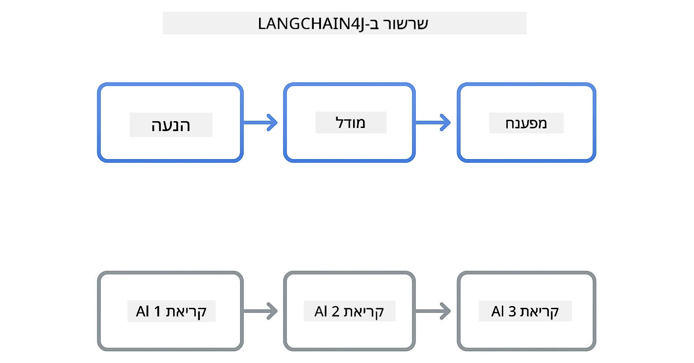
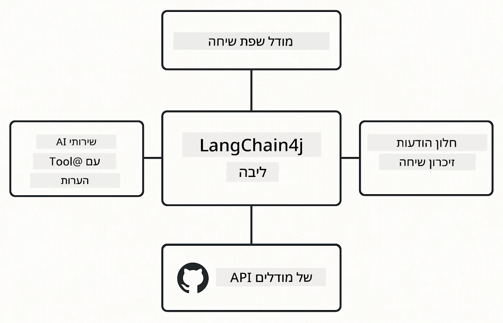

# Module 00: התחלה מהירה

## תוכן העניינים

- [הקדמה](../../../00-quick-start)
- [מה זה LangChain4j?](../../../00-quick-start)
- [תלויות LangChain4j](../../../00-quick-start)
- [דרישות מוקדמות](../../../00-quick-start)
- [התקנה](../../../00-quick-start)
  - [1. קבל את הטוקן שלך ב-GitHub](../../../00-quick-start)
  - [2. הגדר את הטוקן שלך](../../../00-quick-start)
- [הרצת הדוגמאות](../../../00-quick-start)
  - [1. שיחה בסיסית](../../../00-quick-start)
  - [2. דפוסי פקודות](../../../00-quick-start)
  - [3. קריאת פונקציות](../../../00-quick-start)
  - [4. שאלות ותשובות על מסמכים (RAG)](../../../00-quick-start)
  - [5. AI אחראי](../../../00-quick-start)
- [מה כל דוגמה מראה](../../../00-quick-start)
- [השלבים הבאים](../../../00-quick-start)
- [פתרון בעיות](../../../00-quick-start)

## הקדמה

ההתחלה המהירה הזו נועדה להעלות אותך במהירות לעבודה עם LangChain4j. היא מכסה את היסודות הבסיסיים של בניית יישומי AI עם LangChain4j ודגמי GitHub. במודולים הבאים תשתמש ב-Azure OpenAI עם LangChain4j כדי לבנות יישומים מתקדמים יותר.

## מה זה LangChain4j?

LangChain4j היא ספריית Java שמפשטת את בניית יישומים מבוססי AI. במקום להתמודד עם לקוחות HTTP וניתוח JSON, אתה עובד עם ממשקי API נקיים של Java.

המונח "שרשרת" ב-LangChain מתייחס לקישור בין רכיבים מרובים - אתה עשוי לקשר פקודה למודל, למנתח, או לחבר מספר קריאות AI שבהן פלט אחד מוזן כקלט הבא. התחלה מהירה זו מתמקדת ביסודות לפני חקירת שרשרות מורכבות יותר.



*חיבור רכיבים ב-LangChain4j - אבני בניין שמתחברות ליצירת זרימות עבודה AI עוצמתיות*

נשתמש בשלושה רכיבים מרכזיים:

**ChatLanguageModel** - הממשק לאינטראקציות עם מודל AI. קוראים ל-`model.chat("prompt")` ומקבלים מחרוזת תגובה. אנחנו משתמשים ב- `OpenAiOfficialChatModel` שעובד עם נקודות קצה תואמות OpenAI כמו דגמי GitHub.

**AiServices** - יוצר ממשקי שירות AI בטוחים טיפוסית. הגדר שיטות, סמן אותן עם `@Tool`, ו-LangChain4j מנהל את התזמור. ה-AI קורא אוטומטית את שיטות ה-Java שלך כשצריך.

**MessageWindowChatMemory** - שומר היסטוריית שיחה. בלעדיו, כל בקשה היא עצמאית. איתו, ה-AI זוכר הודעות קודמות ושומר הקשר לאורך סבבים מרובים.



*ארכיטקטורת LangChain4j - רכיבים מרכזיים שפועלים יחד להנעת יישומי AI שלך*

## תלויות LangChain4j

ההתחלה המהירה הזו משתמשת בשתי תלויות Maven בקובץ [`pom.xml`](../../../00-quick-start/pom.xml):

```xml
<!-- Core LangChain4j library -->
<dependency>
    <groupId>dev.langchain4j</groupId>
    <artifactId>langchain4j</artifactId> <!-- Inherited from BOM in root pom.xml -->
</dependency>

<!-- OpenAI integration (works with GitHub Models) -->
<dependency>
    <groupId>dev.langchain4j</groupId>
    <artifactId>langchain4j-open-ai-official</artifactId> <!-- Inherited from BOM in root pom.xml -->
</dependency>
```

מודול `langchain4j-open-ai-official` מספק את המחלקה `OpenAiOfficialChatModel` שמתחברת ל-APIs תואמים OpenAI. דגמי GitHub משתמשים באותו פורמט API, לכן אין צורך במתאם מיוחד - פשוט הפנה את כתובת הבסיס ל-`https://models.github.ai/inference`.

## דרישות מוקדמות

**משתמש במיכל Dev?** Java ו-Maven כבר מותקנים. אתה רק צריך אסימון גישה אישי של GitHub.

**פיתוח מקומי:**
- Java 21+, Maven 3.9+
- אסימון גישה אישי ל-GitHub (הוראות למטה)

> **הערה:** מודול זה משתמש ב-`gpt-4.1-nano` מדגמי GitHub. אל תשנה את שם המודל בקוד - הוא מוגדר לעבוד עם הדגמים הזמינים של GitHub.

## התקנה

### 1. קבל את הטוקן שלך ב-GitHub

1. עבור אל [הגדרות GitHub → אסימוני גישה אישיים](https://github.com/settings/personal-access-tokens)
2. לחץ על "Generate new token"
3. הגדר שם תיאורי (למשל, "LangChain4j Demo")
4. הגדר תוקף (מומלץ 7 ימים)
5. תחת "הרשאות חשבון", מצא את "Models" והגדר ל-"Read-only"
6. לחץ על "Generate token"
7. העתק ושמור את הטוקן שלך - לא תראה אותו שוב

### 2. הגדר את הטוקן שלך

**אפשרות 1: שימוש ב-VS Code (מומלץ)**

אם אתה משתמש ב-VS Code, הוסף את הטוקן לקובץ `.env` בשורש הפרויקט:

אם קובץ `.env` לא קיים, העתק את `.env.example` ל-`.env` או צור קובץ `.env` חדש בשורש הפרויקט.

**דוגמת קובץ `.env`:**
```bash
# בקובץ /workspaces/LangChain4j-for-Beginners/.env
GITHUB_TOKEN=your_token_here
```

אז תוכל פשוט ללחוץ קליק ימני על כל קובץ דמו (למשל, `BasicChatDemo.java`) בבורר הקבצים ולבחור **"Run Java"** או להשתמש בקונפיגורציות ההפעלה מפאנל Run and Debug.

**אפשרות 2: שימוש בטרמינל**

הגדר את הטוקן כמשתנה סביבה:

**ב-Bash:**
```bash
export GITHUB_TOKEN=your_token_here
```

**ב-PowerShell:**
```powershell
$env:GITHUB_TOKEN=your_token_here
```

## הרצת הדוגמאות

**שימוש ב-VS Code:** פשוט לחץ קליק ימני על כל קובץ דמו בבורר הקבצים ובחר **"Run Java"**, או השתמש בקונפיגורציות ההפעלה מפאנל Run and Debug (ודא שהוספת את הטוקן ל-`.env` קודם).

**שימוש ב-Maven:** לחלופין, תוכל להריץ מהשורת פקודה:

### 1. שיחה בסיסית

**ב-Bash:**
```bash
mvn compile exec:java -Dexec.mainClass=com.example.langchain4j.quickstart.BasicChatDemo
```

**ב-PowerShell:**
```powershell
mvn --% compile exec:java -Dexec.mainClass=com.example.langchain4j.quickstart.BasicChatDemo
```

### 2. דפוסי פקודות

**ב-Bash:**
```bash
mvn compile exec:java -Dexec.mainClass=com.example.langchain4j.quickstart.PromptEngineeringDemo
```

**ב-PowerShell:**
```powershell
mvn --% compile exec:java -Dexec.mainClass=com.example.langchain4j.quickstart.PromptEngineeringDemo
```

מציג פקודות zero-shot, few-shot, chain-of-thought, ופיקוח תפקידים.

### 3. קריאת פונקציות

**ב-Bash:**
```bash
mvn compile exec:java -Dexec.mainClass=com.example.langchain4j.quickstart.ToolIntegrationDemo
```

**ב-PowerShell:**
```powershell
mvn --% compile exec:java -Dexec.mainClass=com.example.langchain4j.quickstart.ToolIntegrationDemo
```

ה-AI קורא אוטומטית את שיטות ה-Java שלך כשצריך.

### 4. שאלות ותשובות על מסמכים (RAG)

**ב-Bash:**
```bash
mvn compile exec:java -Dexec.mainClass=com.example.langchain4j.quickstart.SimpleReaderDemo
```

**ב-PowerShell:**
```powershell
mvn --% compile exec:java -Dexec.mainClass=com.example.langchain4j.quickstart.SimpleReaderDemo
```

שאל שאלות על תוכן ב-`document.txt`.

### 5. AI אחראי

**ב-Bash:**
```bash
mvn compile exec:java -Dexec.mainClass=com.example.langchain4j.quickstart.ResponsibleAIDemo
```

**ב-PowerShell:**
```powershell
mvn --% compile exec:java -Dexec.mainClass=com.example.langchain4j.quickstart.ResponsibleAIDemo
```

ראה כיצד מסנני בטיחות AI חוסמים תוכן מזיק.

## מה כל דוגמה מראה

**שיחה בסיסית** - [BasicChatDemo.java](../../../00-quick-start/src/main/java/com/example/langchain4j/quickstart/BasicChatDemo.java)

התחל כאן כדי לראות את LangChain4j בפשטותו. תיצור `OpenAiOfficialChatModel`, תשלח פקודה עם `.chat()`, ותקבל תגובה. זה מדגים את היסוד: כיצד לאתחל מודלים עם נקודות קצה ומפתחות API מותאמים. אחרי שתבין את הדפוס הזה, הכל בנוי עליו.

```java
ChatLanguageModel model = OpenAiOfficialChatModel.builder()
    .baseUrl("https://models.github.ai/inference")
    .apiKey(System.getenv("GITHUB_TOKEN"))
    .modelName("gpt-4.1-nano")
    .build();

String response = model.chat("What is LangChain4j?");
System.out.println(response);
```

> **🤖 נסה עם שיחת [GitHub Copilot](https://github.com/features/copilot):** פתח את [`BasicChatDemo.java`](../../../00-quick-start/src/main/java/com/example/langchain4j/quickstart/BasicChatDemo.java) ושאל:
> - "איך אני עובר מדגמי GitHub ל-Azure OpenAI בקוד הזה?"
> - "אילו פרמטרים נוספים אפשר להגדיר ב-OpenAiOfficialChatModel.builder()?"
> - "איך אני מוסיף תגובות סטרימינג במקום לחכות לתגובה מלאה?"

**הנדסת פקודות** - [PromptEngineeringDemo.java](../../../00-quick-start/src/main/java/com/example/langchain4j/quickstart/PromptEngineeringDemo.java)

עכשיו, כשאתה יודע איך לדבר עם מודל, נחקור מה אתה אומר לו. דמו זה משתמש באותה הגדרת מודל אבל מציג ארבעה דפוסי פקודות שונים. נסה פקודות zero-shot להוראות ישירות, few-shot שלומדות מדוגמאות, chain-of-thought שמגלות צעדים של חשיבה, ופקודות מבוססות תפקיד שמגדירות הקשר. תראה כיצד אותו מודל נותן תוצאות שונות פלאים בהתאם לאופן שבו אתה ממסגר את הבקשה.

```java
PromptTemplate template = PromptTemplate.from(
    "What's the best time to visit {{destination}} for {{activity}}?"
);

Prompt prompt = template.apply(Map.of(
    "destination", "Paris",
    "activity", "sightseeing"
));

String response = model.chat(prompt.text());
```

> **🤖 נסה עם שיחת [GitHub Copilot](https://github.com/features/copilot):** פתח את [`PromptEngineeringDemo.java`](../../../00-quick-start/src/main/java/com/example/langchain4j/quickstart/PromptEngineeringDemo.java) ושאל:
> - "מה ההבדל בין zero-shot ל-few-shot, ומתי כדאי להשתמש בכל אחד מהם?"
> - "איך פרמטר הטמפרטורה משפיע על תגובות המודל?"
> - "אילו טכניקות קיימות למניעת התקפות הזרקת פקודות בייצור?"
> - "איך אני יוצר אובייקטי PromptTemplate לשימוש חוזר בדפוסים נפוצים?"

**שילוב כלים** - [ToolIntegrationDemo.java](../../../00-quick-start/src/main/java/com/example/langchain4j/quickstart/ToolIntegrationDemo.java)

פה LangChain4j נהיית עוצמתית. תשתמש ב-`AiServices` כדי ליצור עוזר AI שיכול לקרוא לשיטות ה-Java שלך. פשוט סמן שיטות עם `@Tool("תיאור")` ו-LangChain4j מנהל את השאר - ה-AI מחליט אוטומטית מתי להשתמש בכל כלי לפי מה שהמשתמש שואל. זה מדגים קריאת פונקציות, טכניקה מרכזית לבניית AI שיכול לבצע פעולות, לא רק לענות על שאלות.

```java
@Tool("Performs addition of two numeric values")
public double add(double a, double b) {
    return a + b;
}

MathAssistant assistant = AiServices.create(MathAssistant.class, model);
String response = assistant.chat("What is 25 plus 17?");
```

> **🤖 נסה עם שיחת [GitHub Copilot](https://github.com/features/copilot):** פתח את [`ToolIntegrationDemo.java`](../../../00-quick-start/src/main/java/com/example/langchain4j/quickstart/ToolIntegrationDemo.java) ושאל:
> - "איך סמן ה-@Tool עובד ומה LangChain4j עושה איתו ברקע?"
> - "האם ה-AI יכול לקרוא לכלים מרובים ברצף כדי לפתור בעיות מורכבות?"
> - "מה קורה אם כלי זורק חריגה – איך כדאי לטפל בשגיאות?"
> - "איך אני משלב API אמיתי במקום הדוגמה של המחשב?"

**שאלות ותשובות על מסמכים (RAG)** - [SimpleReaderDemo.java](../../../00-quick-start/src/main/java/com/example/langchain4j/quickstart/SimpleReaderDemo.java)

כאן תראה את יסודות RAG (retrieval-augmented generation). במקום להסתמך על נתוני האימון של המודל, אתה טוען תוכן מ-[`document.txt`](../../../00-quick-start/document.txt) ומכליל אותו בפקודה. ה-AI עונה בהתבסס על המסמך שלך, לא על הידע הכללי שלו. זו הצעד הראשון לבניית מערכות שיכולות לעבוד עם הנתונים שלך.

```java
Document document = FileSystemDocumentLoader.loadDocument("document.txt");
String content = document.text();

String prompt = "Based on this document: " + content + 
                "\nQuestion: What is the main topic?";
String response = model.chat(prompt);
```

> **הערה:** גישה פשוטה זו טוענת את כל המסמך לתוך הפקודה. לקבצים גדולים (>10KB), תחרוג ממגבלות ההקשר. מודול 03 מציג חלוקה וחיפוש וקטורים למערכות RAG לייצור.

> **🤖 נסה עם שיחת [GitHub Copilot](https://github.com/features/copilot):** פתח את [`SimpleReaderDemo.java`](../../../00-quick-start/src/main/java/com/example/langchain4j/quickstart/SimpleReaderDemo.java) ושאל:
> - "איך RAG מונע הזיות של AI לעומת שימוש בנתוני האימון של המודל?"
> - "מה ההבדל בין הגישה הפשוטה הזו לשימוש בהטמעות וקטוריות לאחזור?"
> - "איך הייתי מגדיל את זה לטפל במסמכים מרובים או בסיסי ידע גדולים יותר?"
> - "מהן השיטות הטובות ביותר למבנה הפקודה כדי להבטיח שה-AI משתמש רק בהקשר שסופק?"

**AI אחראי** - [ResponsibleAIDemo.java](../../../00-quick-start/src/main/java/com/example/langchain4j/quickstart/ResponsibleAIDemo.java)

בנה בטיחות AI עם הגנה בשכבות. דמו זה מציג שתי שכבות של הגנה שעובדות יחד:

**חלק 1: LangChain4j Input Guardrails** - חוסם פקודות מסוכנות לפני שהן מגיעות ל-LLM. צור משמרות מותאמים שבודקים מילות מפתח או דפוסים אסורים. אלו פועלות בקוד שלך, ולכן מהירות וחינמיות.

```java
class DangerousContentGuardrail implements InputGuardrail {
    @Override
    public InputGuardrailResult validate(UserMessage userMessage) {
        String text = userMessage.singleText().toLowerCase();
        if (text.contains("explosives")) {
            return fatal("Blocked: contains prohibited keyword");
        }
        return success();
    }
}
```

**חלק 2: מסנני בטיחות הספק** - לדגמי GitHub יש מסננים מובנים שתופסים מה שמשמרותיך אולי מפספסות. תראה חסימות קשות (שגיאות HTTP 400) על הפרות חמורות וסירובים רכים כאשר ה-AI מסרב בנימוס.

> **🤖 נסה עם שיחת [GitHub Copilot](https://github.com/features/copilot):** פתח את [`ResponsibleAIDemo.java`](../../../00-quick-start/src/main/java/com/example/langchain4j/quickstart/ResponsibleAIDemo.java) ושאל:
> - "מה זה InputGuardrail ואיך אני יוצר אחד משל עצמי?"
> - "מה ההבדל בין חסימה קשה לסירוב רך?"
> - "למה להשתמש גם במשמרות וגם במסננים של הספק יחד?"

## השלבים הבאים

**מודול הבא:** [01-introduction - התחלה עם LangChain4j ו-gpt-5 ב-Azure](../01-introduction/README.md)

---

**ניווט:** [← חזרה לראשי](../README.md) | [הבא: מודול 01 - הקדמה →](../01-introduction/README.md)

---

## פתרון בעיות

### בניית Maven בפעם הראשונה

**בעיה:** הפקודה הראשונית `mvn clean compile` או `mvn package` לוקחת הרבה זמן (10-15 דקות)

**סיבה:** Maven צריך להוריד את כל התלויות של הפרויקט (Spring Boot, ספריות LangChain4j, Azure SDKs וכו') בבנייה ראשונה.

**פתרון:** זה התנהגות נורמלית. בניות עתידיות יהיו הרבה יותר מהירות כי התלויות נשמרות במטמון מקומי. זמן ההורדה תלוי במהירות הרשת שלך.

### תחביר פקודות Maven ב-PowerShell

**בעיה:** פקודות Maven נכשלות עם השגיאה `Unknown lifecycle phase ".mainClass=..."`

**סיבה:** PowerShell מפרש את סימן ה-`=` כמפעיל הגדרת משתנה, מה ששובר את תחביר המאפיינים של Maven.
**פתרון**: השתמש באופרטור עצירת הפרשנות `--%` לפני פקודת Maven:

**PowerShell:**
```powershell
mvn --% compile exec:java -Dexec.mainClass=com.example.langchain4j.quickstart.BasicChatDemo
```

**Bash:**
```bash
mvn compile exec:java -Dexec.mainClass=com.example.langchain4j.quickstart.BasicChatDemo
```

האופרטור `--%` אומר ל-PowerShell להעביר את כל הפרמטרים שנותרו כפי שהם ל-Maven ללא פרשנות.

### הצגת אימוג'ים ב-Windows PowerShell

**בעיה**: תגובות ה-AI מציגות תווים לא קריאים (למשל, `????` או `â??`) במקום אימוג'ים ב-PowerShell

**סיבה**: קידוד ברירת המחדל של PowerShell אינו תומך באימוג'ים מסוג UTF-8

**פתרון**: הרץ את הפקודה הזו לפני הפעלת יישומי Java:
```cmd
chcp 65001
```

זה מחייב קידוד UTF-8 בטרמינל. לחלופין, השתמש ב-Windows Terminal שיש לו תמיכה טובה יותר ביוניקוד.

### איתור שגיאות בקריאות API

**בעיה**: שגיאות אימות, מגבלות קצב, או תגובות לא צפויות מדגם ה-AI

**פתרון**: בדוגמאות כלול שימוש ב-`.logRequests(true)` ו-`.logResponses(true)` כדי להראות את קריאות ה-API בקונסול. זה מסייע באיתור שגיאות אימות, מגבלות קצב, או תגובות לא צפויות. הסר את הדגלים הללו בייצור כדי להפחית את רעש הלוגים.

---

<!-- CO-OP TRANSLATOR DISCLAIMER START -->
**כתב ויתור**:
מסמך זה תורגם באמצעות שירות התרגום האוטומטי [Co-op Translator](https://github.com/Azure/co-op-translator). למרות שאנו שואפים לדייק, יש לקחת בחשבון שתרגומים אוטומטיים עלולים להכיל טעויות או אי-דיוקים. המסמך המקורי בשפת המקור שלו נחשב למקור הסמכותי. למידע קריטי מומלץ לבצע תרגום מקצועי מטעם אדם. אנו לא נושאים באחריות לכל אי-הבנות או פרשנויות שגויות הנובעות משימוש בתרגום זה.
<!-- CO-OP TRANSLATOR DISCLAIMER END -->