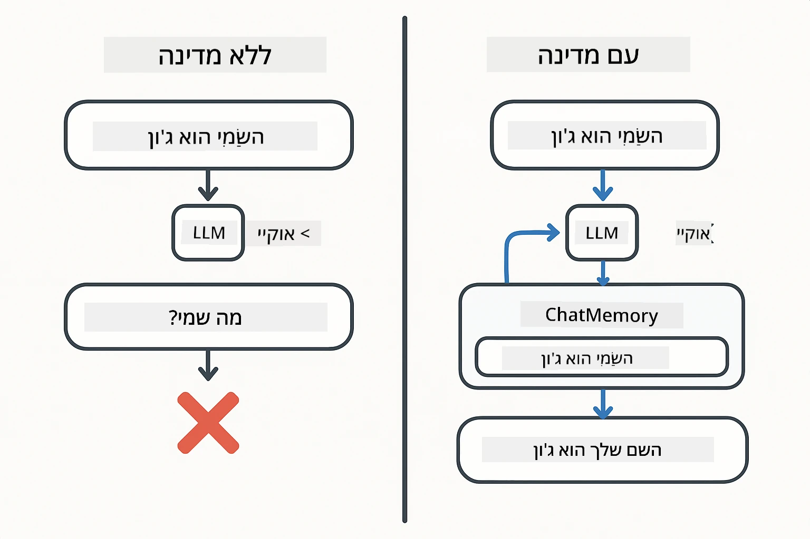
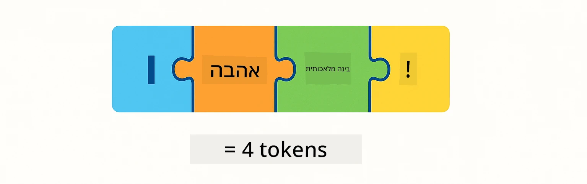
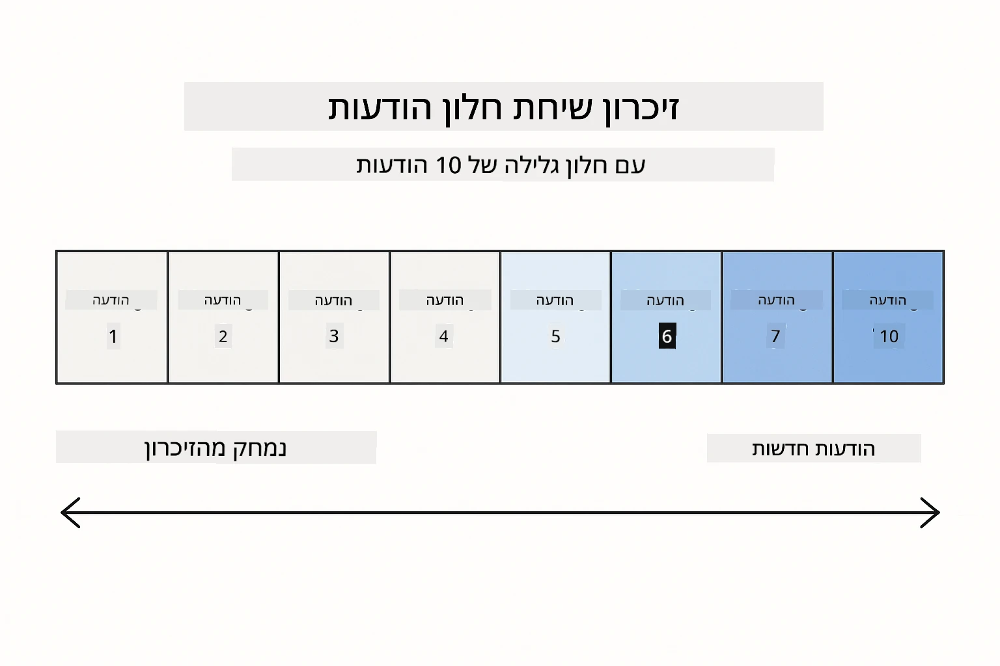
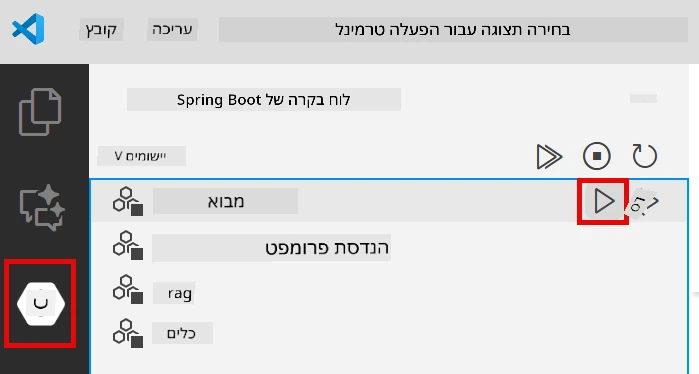
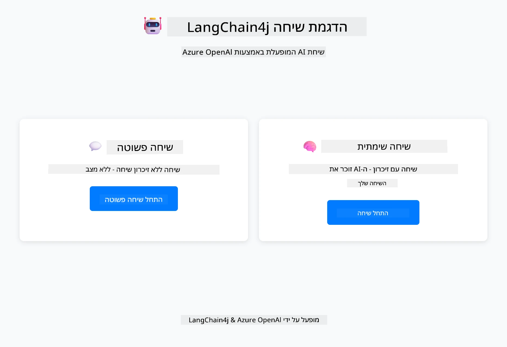
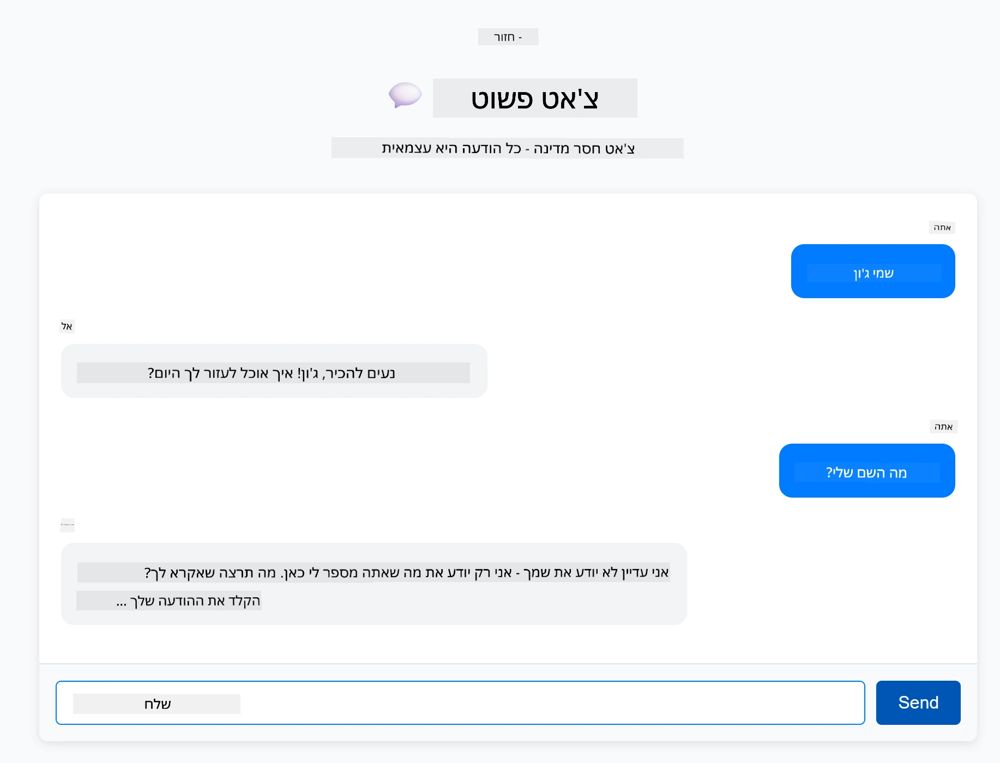
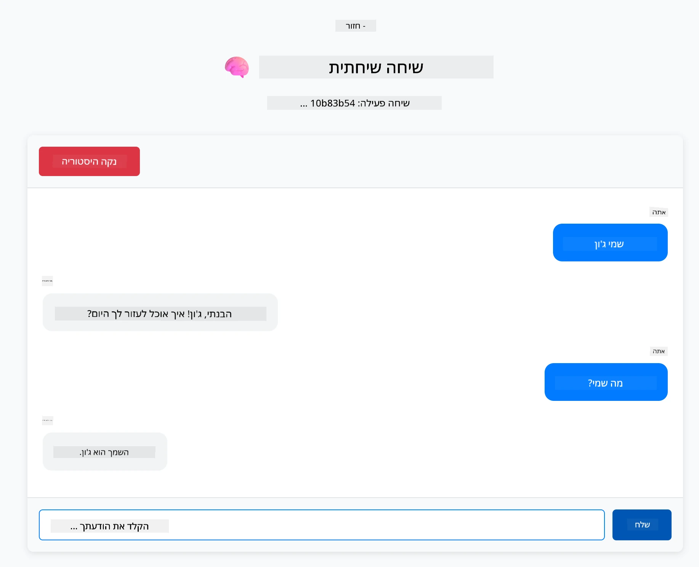

# מודול 01: התחלה עם LangChain4j

## תוכן העניינים

- [מה תלמדו](../../../01-introduction)
- [דרישות מוקדמות](../../../01-introduction)
- [הבנת הבעיה המרכזית](../../../01-introduction)
- [הבנת טוקנים](../../../01-introduction)
- [איך זיכרון עובד](../../../01-introduction)
- [איך זה משתמש ב-LangChain4j](../../../01-introduction)
- [פריסת תשתית Azure OpenAI](../../../01-introduction)
- [הרצת האפליקציה מקומית](../../../01-introduction)
- [שימוש באפליקציה](../../../01-introduction)
  - [שיחה ללא מצב (לוח שמאלי)](../../../01-introduction)
  - [שיחה עם מצב (לוח ימני)](../../../01-introduction)
- [השלבים הבאים](../../../01-introduction)

## מה תלמדו

אם השלמתם את ההתחלה המהירה, ראיתם איך לשלוח בקשות ולקבל תגובות. זו הבסיס, אבל אפליקציות אמיתיות צריכות יותר. מודול זה ילמד אתכם איך לבנות בינה מלאכותית שיחה שזוכרת הקשר ושומרת על מצב - ההבדל בין הדגמה חד-פעמית לאפליקציה מוכנה לייצור.

נשתמש ב-GPT-5 של Azure OpenAI לאורך המדריך הזה כי יכולות ההסקה המתקדמות שלו מבהירות את ההתנהגות של דפוסים שונים. כשאתם מוסיפים זיכרון, תראו בבירור את ההבדל. זה מקל על ההבנה מה כל רכיב מביא לאפליקציה שלכם.

תבנו אפליקציה אחת שמדגימה את שני הדפוסים:

**שיחה ללא מצב** - כל בקשה היא עצמאית. למודל אין זיכרון של הודעות קודמות. זהו הדפוס שבו השתמשתם בהתחלה המהירה.

**שיחה עם מצב** - כל בקשה כוללת היסטוריית שיחה. המודל שומר על הקשר לאורך מספר סבבים. זה מה שאפליקציות ייצור דורשות.

## דרישות מוקדמות

- מנוי Azure עם גישה ל-Azure OpenAI
- Java 21, Maven 3.9+
- Azure CLI (https://learn.microsoft.com/en-us/cli/azure/install-azure-cli)
- Azure Developer CLI (azd) (https://learn.microsoft.com/en-us/azure/developer/azure-developer-cli/install-azd)

> **הערה:** Java, Maven, Azure CLI ו-Azure Developer CLI (azd) מותקנים מראש במיכל הפיתוח המסופק.

> **הערה:** מודול זה משתמש ב-GPT-5 ב-Azure OpenAI. הפריסה מוגדרת אוטומטית דרך `azd up` - אל תשנו את שם המודל בקוד.

## הבנת הבעיה המרכזית

מודלי שפה הם ללא מצב. כל קריאת API היא עצמאית. אם תשלחו "שמי ג'ון" ואז תשאלו "מה השם שלי?", המודל לא יודע שהצגתם את עצמכם זה עתה. הוא מתייחס לכל בקשה כאילו זו השיחה הראשונה שלכם אי פעם.

זה בסדר לשאלות ותשובות פשוטות אבל חסר תועלת לאפליקציות אמיתיות. רובוטי שירות לקוחות צריכים לזכור מה אמרתם להם. עוזרים אישיים צריכים הקשר. כל שיחה מרובת סבבים דורשת זיכרון.



*ההבדל בין שיחות ללא מצב (קריאות עצמאיות) לשיחות עם מצב (מודעות להקשר)*

## הבנת טוקנים

לפני שנכנסים לשיחות, חשוב להבין טוקנים - יחידות הטקסט הבסיסיות שמודלי השפה מעבדים:



*דוגמה לאיך טקסט מפורק לטוקנים - "I love AI!" הופך ל-4 יחידות עיבוד נפרדות*

טוקנים הם איך מודלי AI מודדים ומעבדים טקסט. מילים, פיסוק ואפילו רווחים יכולים להיות טוקנים. למודל שלכם יש מגבלה על כמה טוקנים הוא יכול לעבד בבת אחת (400,000 ל-GPT-5, עם עד 272,000 טוקני קלט ו-128,000 טוקני פלט). הבנת הטוקנים עוזרת לכם לנהל את אורך השיחה והעלויות.

## איך זיכרון עובד

זיכרון שיחה פותר את הבעיה של חוסר מצב על ידי שמירת היסטוריית השיחה. לפני שליחת הבקשה למודל, המסגרת מוסיפה הודעות קודמות רלוונטיות. כשאתם שואלים "מה השם שלי?", המערכת שולחת בפועל את כל היסטוריית השיחה, ומאפשרת למודל לראות שאמרתם קודם "שמי ג'ון".

LangChain4j מספקת מימושי זיכרון שמטפלים בזה אוטומטית. אתם בוחרים כמה הודעות לשמור והמסגרת מנהלת את חלון ההקשר.



*MessageWindowChatMemory שומר על חלון מחליק של הודעות אחרונות, ומסיר אוטומטית הודעות ישנות*

## איך זה משתמש ב-LangChain4j

מודול זה מרחיב את ההתחלה המהירה על ידי שילוב Spring Boot והוספת זיכרון שיחה. כך החלקים מתחברים יחד:

**תלויות** - הוסיפו שתי ספריות LangChain4j:

```xml
<dependency>
    <groupId>dev.langchain4j</groupId>
    <artifactId>langchain4j</artifactId> <!-- Inherited from BOM in root pom.xml -->
</dependency>
<dependency>
    <groupId>dev.langchain4j</groupId>
    <artifactId>langchain4j-open-ai-official</artifactId> <!-- Inherited from BOM in root pom.xml -->
</dependency>
```

**מודל שיחה** - הגדר את Azure OpenAI כ-bean של Spring ([LangChainConfig.java](../../../01-introduction/src/main/java/com/example/langchain4j/config/LangChainConfig.java)):

```java
@Bean
public OpenAiOfficialChatModel openAiOfficialChatModel() {
    return OpenAiOfficialChatModel.builder()
            .baseUrl(azureEndpoint)
            .apiKey(azureApiKey)
            .modelName(deploymentName)
            .timeout(Duration.ofMinutes(5))
            .maxRetries(3)
            .build();
}
```

הבונה קורא את האישורים ממשתני סביבה שהוגדרו על ידי `azd up`. הגדרת `baseUrl` לנקודת הקצה של Azure שלכם מאפשרת ללקוח OpenAI לעבוד עם Azure OpenAI.

**זיכרון שיחה** - עקבו אחרי היסטוריית השיחה עם MessageWindowChatMemory ([ConversationService.java](../../../01-introduction/src/main/java/com/example/langchain4j/service/ConversationService.java)):

```java
ChatMemory memory = MessageWindowChatMemory.withMaxMessages(10);

memory.add(UserMessage.from("My name is John"));
memory.add(AiMessage.from("Nice to meet you, John!"));

memory.add(UserMessage.from("What's my name?"));
AiMessage aiMessage = chatModel.chat(memory.messages()).aiMessage();
memory.add(aiMessage);
```

צרו זיכרון עם `withMaxMessages(10)` לשמירת 10 ההודעות האחרונות. הוסיפו הודעות משתמש ו-AI עם עטיפות טיפוסיות: `UserMessage.from(text)` ו-`AiMessage.from(text)`. שלפו היסטוריה עם `memory.messages()` ושלחו אותה למודל. השירות שומר מופעי זיכרון נפרדים לפי מזהה שיחה, ומאפשר למספר משתמשים לנהל שיחות במקביל.

> **🤖 נסו עם [GitHub Copilot](https://github.com/features/copilot) Chat:** פתחו את [`ConversationService.java`](../../../01-introduction/src/main/java/com/example/langchain4j/service/ConversationService.java) ושאלו:
> - "איך MessageWindowChatMemory מחליט אילו הודעות להוריד כשהחלון מלא?"
> - "האם אפשר לממש אחסון זיכרון מותאם אישית באמצעות מסד נתונים במקום בזיכרון?"
> - "איך הייתי מוסיף סיכום לדחיסת היסטוריית שיחה ישנה?"

נקודת הקצה של שיחה ללא מצב מדלגת על הזיכרון לחלוטין - פשוט `chatModel.chat(prompt)` כמו בהתחלה המהירה. נקודת הקצה של שיחה עם מצב מוסיפה הודעות לזיכרון, שולפת היסטוריה, וכוללת את ההקשר הזה עם כל בקשה. אותה הגדרת מודל, דפוסים שונים.

## פריסת תשתית Azure OpenAI

**Bash:**
```bash
cd 01-introduction
azd up  # בחר מנוי ומיקום (מומלץ eastus2)
```

**PowerShell:**
```powershell
cd 01-introduction
azd up  # בחר מנוי ומיקום (מומלץ eastus2)
```

> **הערה:** אם תיתקלו בשגיאת timeout (`RequestConflict: Cannot modify resource ... provisioning state is not terminal`), פשוט הריצו שוב `azd up`. משאבי Azure עשויים עדיין להיערך ברקע, ונסיון חוזר מאפשר לפריסה להסתיים כשהמשאבים מגיעים למצב סופי.

זה יבצע:
1. פריסת משאב Azure OpenAI עם מודלי GPT-5 ו-text-embedding-3-small
2. יצירת קובץ `.env` אוטומטית בשורש הפרויקט עם האישורים
3. הגדרת כל משתני הסביבה הנדרשים

**יש לכם בעיות בפריסה?** ראו את [קובץ README של התשתית](infra/README.md) לפירוט פתרון בעיות כולל קונפליקטים בשמות תת-דומיין, שלבי פריסה ידניים ב-Azure Portal, והנחיות להגדרת מודל.

**אימות שהפריסה הצליחה:**

**Bash:**
```bash
cat ../.env  # צריך להציג את AZURE_OPENAI_ENDPOINT, API_KEY, וכו'.
```

**PowerShell:**
```powershell
Get-Content ..\.env  # צריך להציג את AZURE_OPENAI_ENDPOINT, API_KEY, וכו'.
```

> **הערה:** הפקודה `azd up` יוצרת אוטומטית את קובץ `.env`. אם תצטרכו לעדכן אותו מאוחר יותר, תוכלו לערוך את הקובץ ידנית או לייצר אותו מחדש על ידי הרצת:
>
> **Bash:**
> ```bash
> cd ..
> bash .azd-env.sh
> ```
>
> **PowerShell:**
> ```powershell
> cd ..
> .\.azd-env.ps1
> ```

## הרצת האפליקציה מקומית

**אימות הפריסה:**

ודאו שקובץ `.env` קיים בתיקיית השורש עם אישורי Azure:

**Bash:**
```bash
cat ../.env  # צריך להציג את AZURE_OPENAI_ENDPOINT, API_KEY, DEPLOYMENT
```

**PowerShell:**
```powershell
Get-Content ..\.env  # צריך להציג את AZURE_OPENAI_ENDPOINT, API_KEY, DEPLOYMENT
```

**הפעלת האפליקציות:**

**אפשרות 1: שימוש ב-Spring Boot Dashboard (מומלץ למשתמשי VS Code)**

מיכל הפיתוח כולל את תוסף Spring Boot Dashboard, שמספק ממשק חזותי לניהול כל אפליקציות Spring Boot. תוכלו למצוא אותו בסרגל הפעילות בצד שמאל של VS Code (חפשו את סמל Spring Boot).

מ-Spring Boot Dashboard תוכלו:
- לראות את כל אפליקציות Spring Boot הזמינות בסביבת העבודה
- להפעיל/להפסיק אפליקציות בלחיצה אחת
- לצפות בלוגים של האפליקציה בזמן אמת
- לנטר את מצב האפליקציה

פשוט לחצו על כפתור ההפעלה ליד "introduction" כדי להתחיל את המודול הזה, או להפעיל את כל המודולים בבת אחת.



**אפשרות 2: שימוש בסקריפטים של shell**

הפעלת כל אפליקציות הווב (מודולים 01-04):

**Bash:**
```bash
cd ..  # מתיקיית השורש
./start-all.sh
```

**PowerShell:**
```powershell
cd ..  # מתיקיית השורש
.\start-all.ps1
```

או להפעיל רק את המודול הזה:

**Bash:**
```bash
cd 01-introduction
./start.sh
```

**PowerShell:**
```powershell
cd 01-introduction
.\start.ps1
```

שני הסקריפטים טוענים אוטומטית את משתני הסביבה מקובץ `.env` בשורש ויבנו את קבצי ה-JAR אם הם לא קיימים.

> **הערה:** אם אתם מעדיפים לבנות את כל המודולים ידנית לפני ההפעלה:
>
> **Bash:**
> ```bash
> cd ..  # Go to root directory
> mvn clean package -DskipTests
> ```
>
> **PowerShell:**
> ```powershell
> cd ..  # Go to root directory
> mvn clean package -DskipTests
> ```

פתחו את http://localhost:8080 בדפדפן שלכם.

**להפסקה:**

**Bash:**
```bash
./stop.sh  # רק מודול זה
# או
cd .. && ./stop-all.sh  # כל המודולים
```

**PowerShell:**
```powershell
.\stop.ps1  # רק מודול זה
# או
cd ..; .\stop-all.ps1  # כל המודולים
```

## שימוש באפליקציה

האפליקציה מספקת ממשק ווב עם שתי מימושי שיחה זה לצד זה.



*לוח בקרה המציג את שתי האפשרויות: שיחה פשוטה (ללא מצב) ושיחה שיחית (עם מצב)*

### שיחה ללא מצב (לוח שמאלי)

נסו את זה קודם. שאלו "שמי ג'ון" ואז מיד שאלו "מה השם שלי?" המודל לא יזכור כי כל הודעה היא עצמאית. זה מדגים את הבעיה המרכזית באינטגרציה בסיסית של מודל שפה - אין הקשר שיחה.



*ה-AI לא זוכר את שמך מההודעה הקודמת*

### שיחה עם מצב (לוח ימני)

עכשיו נסו את אותו רצף כאן. שאלו "שמי ג'ון" ואז "מה השם שלי?" הפעם הוא זוכר. ההבדל הוא MessageWindowChatMemory - הוא שומר היסטוריית שיחה וכולל אותה עם כל בקשה. כך עובדת בינה מלאכותית שיחית בייצור.



*ה-AI זוכר את שמך מהשיחה הקודמת*

שני הלוחות משתמשים באותו מודל GPT-5. ההבדל היחיד הוא הזיכרון. זה מבהיר מה הזיכרון מביא לאפליקציה שלכם ולמה הוא חיוני למקרים אמיתיים.

## השלבים הבאים

**מודול הבא:** [02-prompt-engineering - הנדסת פרומפט עם GPT-5](../02-prompt-engineering/README.md)

---

**ניווט:** [← קודם: מודול 00 - התחלה מהירה](../00-quick-start/README.md) | [חזרה לעמוד הראשי](../README.md) | [הבא: מודול 02 - הנדסת פרומפט →](../02-prompt-engineering/README.md)

---

<!-- CO-OP TRANSLATOR DISCLAIMER START -->
**כתב ויתור**:  
מסמך זה תורגם באמצעות שירות תרגום מבוסס בינה מלאכותית [Co-op Translator](https://github.com/Azure/co-op-translator). למרות שאנו שואפים לדיוק, יש לקחת בחשבון כי תרגומים אוטומטיים עלולים להכיל שגיאות או אי-דיוקים. המסמך המקורי בשפת המקור שלו הוא המקור הסמכותי. למידע קריטי מומלץ להשתמש בתרגום מקצועי על ידי אדם. אנו לא נושאים באחריות לכל אי-הבנה או פרשנות שגויה הנובעת משימוש בתרגום זה.
<!-- CO-OP TRANSLATOR DISCLAIMER END -->