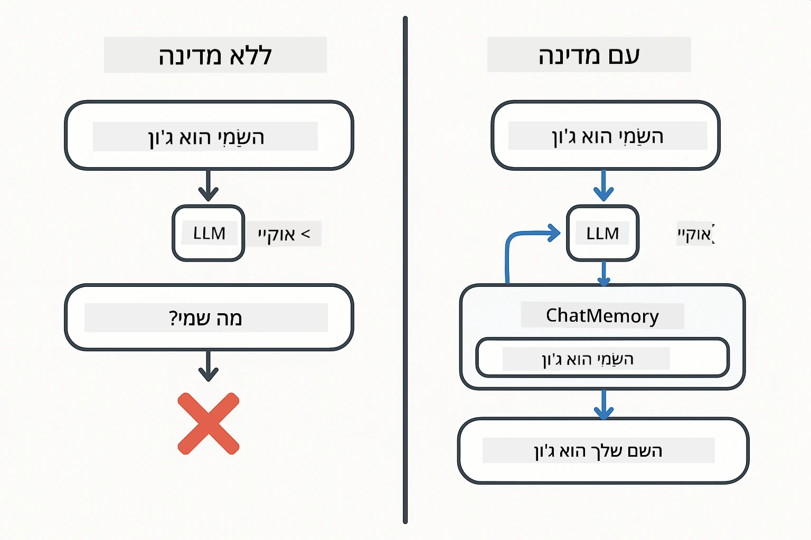
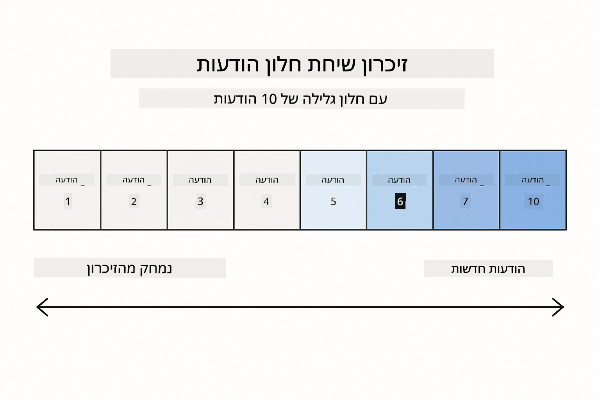
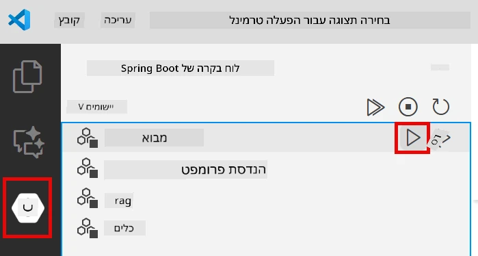
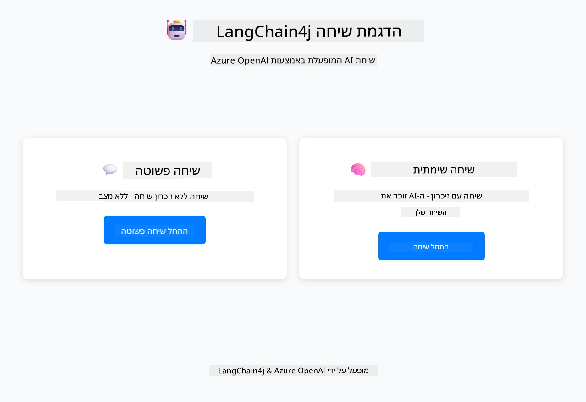
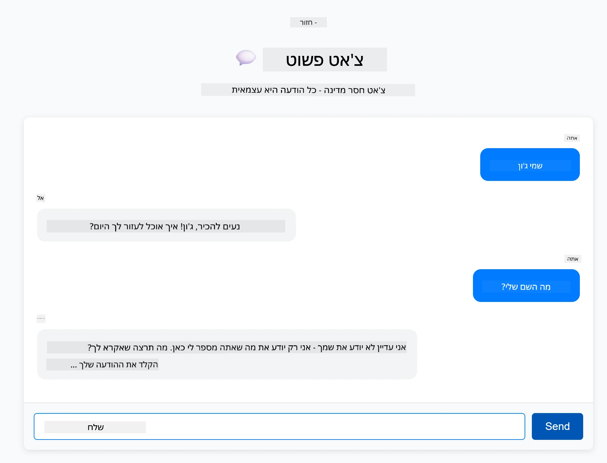
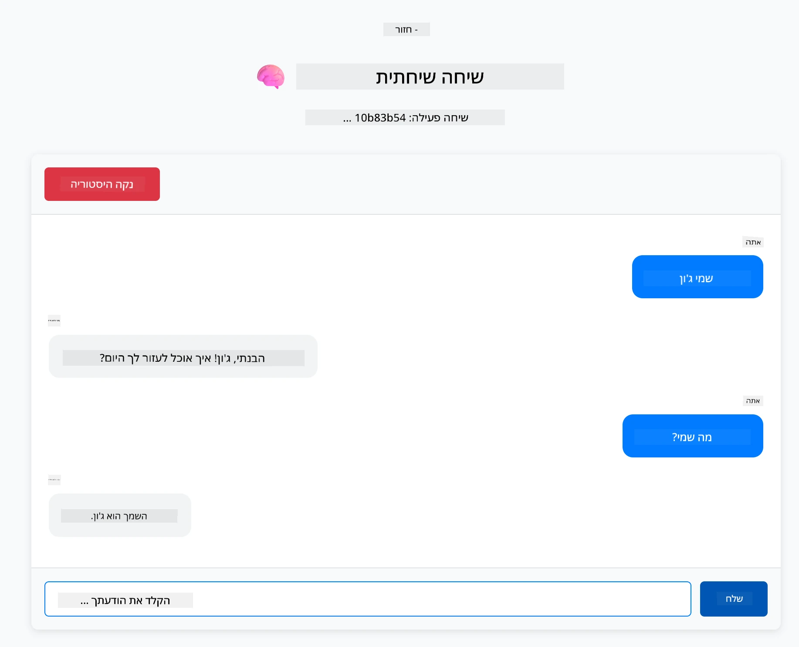

# מודול 01: התחלה עם LangChain4j

## תוכן העניינים

- [סיור וידאו](#סיור-וידאו)
- [מה תלמדו](#מה-תלמדו)
- [דרישות מוקדמות](#דרישות-מוקדמות)
- [הבנת הבעיה המרכזית](#הבנת-הבעיה-המרכזית)
- [הבנת טוקנים](#הבנת-טוקנים)
- [איך הזיכרון פועל](#איך-הזיכרון-פועל)
- [כיצד מודול זה משתמש ב-LangChain4j](#כיצד-מודול-זה-משתמש-ב-langchain4j)
- [פריסת תשתית Azure OpenAI](#פריסת-תשתית-azure-openai)
- [הרצת האפליקציה מקומית](#הרצת-האפליקציה-מקומית)
- [שימוש באפליקציה](#שימוש-באפליקציה)
  - [צ'אט ללא מצב (פאנל שמאל)](#צאט-ללא-מצב-פאנל-שמאל)
  - [צ'אט עם מצב (פאנל ימין)](#צאט-עם-מצב-פאנל-ימין)
- [שלבים הבאים](#שלבים-הבאים)

## סיור וידאו

צפו במפגש חי שמסביר כיצד להתחיל עם מודול זה:

<a href="https://www.youtube.com/live/nl_troDm8rQ?si=6b85S8xGjWnT2fX9"></a>

## מה תלמדו

זהו נקודת ההתחלה שלכם עם LangChain4j ו-Azure OpenAI. נתחיל עם הבסיס ונבנה אפליקציות בסגנון ייצור. מודול זה מתמקד ב-AI שיחתי שזוכר הקשר ומתחזק מצב — המושגים היסודיים שכל מודול מאוחר יותר מתבסס עליהם.

נשתמש ב-GPT-5.2 של Azure OpenAI לאורך כל המדריך הזה כי יכולות ההסקה המתקדמות שלו מדגישות טוב יותר את ההבדלים בין דפוסים שונים. כשאתם מוסיפים זיכרון, ההבדל יהיה ברור יותר. זה מקל על ההבנה של מה שכל רכיב מביא לאפליקציה שלכם.

תבנו אפליקציה אחת שמדגימה את שני הדפוסים:

**צ'אט ללא מצב** - כל בקשה עצמאית. למודל אין זיכרון של ההודעות הקודמות. זו הנקודת התחלה הפשוטה ביותר.

**שיחה עם מצב** - כל בקשה כוללת היסטוריית שיחה. המודל שומר הקשר לאורך מספר סבבים. זה מה שנדרש באפליקציות ייצור.

## דרישות מוקדמות

- חשבון Azure עם גישה ל-Azure OpenAI  
- Java 21, Maven 3.9+  
- Azure CLI (https://learn.microsoft.com/en-us/cli/azure/install-azure-cli)  
- Azure Developer CLI (azd) (https://learn.microsoft.com/en-us/azure/developer/azure-developer-cli/install-azd)

> **הערה:** Java, Maven, Azure CLI ו-Azure Developer CLI (azd) מותקנים מראש בקונטיינר הפיתוח שסופק.

> **הערה:** מודול זה משתמש ב-GPT-5.2 ב-Azure OpenAI. הפריסה מוגדרת אוטומטית דרך `azd up` - אל תשנו את שם המודל בקוד.

## הבנת הבעיה המרכזית

מודלים לשוניים הם חסרי-מצב. כל קריאת API היא עצמאית. אם תשלחו "שמי ג'ון" ואז תשאלו "מה השם שלי?", המודל אינו מודע לכך שהצגת את עצמך קודם לכן. הוא מתייחס לכל בקשה כאילו זו השיחה הראשונה שלכם אי פעם.

זה בסדר לשאלות ותשובות פשוטות אך חסר ערך באפליקציות אמיתיות. רובוטי שירות לקוחות צריכים לזכור מה אמרתם להם. עוזרים אישיים זקוקים להקשר. כל שיחה רב-סיבובית מחייבת זיכרון.

התמונה הבאה מציגה השוואה בין הגישות — משמאל קריאה ללא מצב ששוכחת את שמך; מימין קריאה עם מצב הנתמכת ב-ChatMemory ששומרת זאת בזיכרון.



*ההבדל בין שיחות ללא מצב (קריאות עצמאיות) ושיחות עם מצב (מודעות להקשר)*

## הבנת טוקנים

לפני שנצלול לשיחות, חשוב להבין טוקנים - יחידות היסוד של הטקסט שהמודלים הלשוניים מעבדים:


*דוגמה לאופן בו הטקסט נשבר לטוקנים - "I love AI!" הופך ל-4 יחידות נפרדות לעיבוד*

טוקנים הם האופן שבו מודלי AI מודדים ומעבדים טקסט. מילים, סימני פיסוק ואפילו רווחים יכולים להיות טוקנים. למודל שלך יש מגבלה של כמה טוקנים הוא יכול לעבד בבת אחת (400,000 ל-GPT-5.2, כולל עד 272,000 טוקנים קלט ו-128,000 טוקני פלט). הבנת הטוקנים עוזרת לך לנהל אורך שיחה ועלויות.

## איך הזיכרון פועל

זיכרון הצ'אט פותר את בעיית חוסר-המצב על ידי שמירת היסטוריית השיחה. לפני שליחת הבקשה למודל, המסגרת מדביקה הודעות רלוונטיות קודמות. כשאתה שואל "מה השם שלי?", המערכת למעשה שולחת את כל היסטוריית השיחה, מה שמאפשר למודל לראות שאמרת לפני כן "שמי ג'ון".

LangChain4j מספק מימושים לזיכרון שמטפלים בזה באופן אוטומטי. אתה בוחר כמה הודעות לשמור והמסגרת מנהלת את חלון ההקשר. התרשים למטה מראה כיצד MessageWindowChatMemory שומר חלון מחליק של הודעות אחרונות.



*MessageWindowChatMemory שומר על חלון מחליק של הודעות אחרונות, משחרר אוטומטית הודעות ישנות*

## כיצד מודול זה משתמש ב-LangChain4j

מודול זה משלב Spring Boot ומוסיף זיכרון שיחה. כך החלקים מתחברים יחד:

**תלויות** - הוסיפו שתי ספריות LangChain4j:

```xml
<dependency>
    <groupId>dev.langchain4j</groupId>
    <artifactId>langchain4j</artifactId> <!-- Inherited from BOM in root pom.xml -->
</dependency>
<dependency>
    <groupId>dev.langchain4j</groupId>
    <artifactId>langchain4j-open-ai-official</artifactId> <!-- Inherited from BOM in root pom.xml -->
</dependency>
```

**מודל שיחה** - קבעו את Azure OpenAI כבין Spring ([LangChainConfig.java](../../../01-introduction/src/main/java/com/example/langchain4j/config/LangChainConfig.java)):

```java
@Bean
public OpenAiOfficialChatModel openAiOfficialChatModel() {
    return OpenAiOfficialChatModel.builder()
            .baseUrl(azureEndpoint)
            .apiKey(azureApiKey)
            .modelName(deploymentName)
            .timeout(Duration.ofMinutes(5))
            .maxRetries(3)
            .build();
}
```

הבונה קורא את אישורי הגישה ממשתני הסביבה שהוגדרו על ידי `azd up`. קביעת `baseUrl` לנקודת הקצה של Azure שלכם מאפשרת ללקוח OpenAI לעבוד עם Azure OpenAI.

**זיכרון שיחה** - עקבו אחרי היסטוריית השיחה עם MessageWindowChatMemory ([ConversationService.java](../../../01-introduction/src/main/java/com/example/langchain4j/service/ConversationService.java)):

```java
ChatMemory memory = MessageWindowChatMemory.withMaxMessages(10);

memory.add(UserMessage.from("My name is John"));
memory.add(AiMessage.from("Nice to meet you, John!"));

memory.add(UserMessage.from("What's my name?"));
AiMessage aiMessage = chatModel.chat(memory.messages()).aiMessage();
memory.add(aiMessage);
```

צרו זיכרון עם `withMaxMessages(10)` לשמירה של 10 ההודעות האחרונות. הוסיפו הודעות משתמש והודעות AI עם עטיפות טיפוסיות: `UserMessage.from(text)` ו-`AiMessage.from(text)`. שלפו היסטוריה עם `memory.messages()` ושלחו אותה למודל. השירות מאחסן מופעי זיכרון נפרדים לפי מזהה שיחה, ומאפשר למספר משתמשים לנהל שיחות במקביל.

> **🤖 נסו עם [GitHub Copilot](https://github.com/features/copilot) Chat:** פתחו את [`ConversationService.java`](../../../01-introduction/src/main/java/com/example/langchain4j/service/ConversationService.java) ושאלו:
> - "כיצד MessageWindowChatMemory מחליט אילו הודעות לזרוק כשהחלון מלא?"
> - "האם אוכל ליישם אחסון זיכרון מותאם אישית באמצעות מסד נתונים במקום זיכרון פנימי?"
> - "איך אוכל להוסיף סיכום לדחיסת היסטוריית שיחה ישנה?"

נקודת הקצה של הצ'אט ללא מצב מדלגת על הזיכרון - פשוט `chatModel.chat(prompt)` כמו ההתחלה המהירה. נקודת הקצה עם מצב מוסיפה הודעות לזיכרון, שולפת היסטוריה וכוללת את ההקשר הזה בכל בקשה. אותה תצורת מודל, דפוסים שונים.

## פריסת תשתית Azure OpenAI

**Bash:**
```bash
cd 01-introduction
azd up  # בחר מנוי ומיקום (מומלץ eastus2)
```

**PowerShell:**
```powershell
cd 01-introduction
azd up  # בחר מנוי ומיקום (מומלץ eastus2)
```

> **הערה:** אם תקבלו שגיאת timeout (`RequestConflict: Cannot modify resource ... provisioning state is not terminal`), פשוט הריצו שוב `azd up`. משאבי Azure עדיין עשויים להיות בתהליך פריסה ברקע, ונסיון חוזר מאפשר לפריסה להסתיים כשתנאי המשאבים יהיו סופיים.

זה יקרה:
1. פריסת משאב Azure OpenAI עם מודלי GPT-5.2 ו-text-embedding-3-small  
2. יצירת קובץ `.env` אוטומטית בשורש הפרויקט עם האישורים  
3. הגדרת כל משתני הסביבה הנדרשים  

**בעיות בפריסה?** עיינו ב-[README תשתית](infra/README.md) לפירוט פתרון בעיות כולל סכסוכי שמות תת-דומיין, שלבי פריסה ידנית בפורטל Azure והדרכה לתצורת מודל.

**וודאו שהפריסה הצליחה:**

**Bash:**
```bash
cat ../.env  # אמור להציג את AZURE_OPENAI_ENDPOINT, API_KEY, וכו'.
```

**PowerShell:**
```powershell
Get-Content ..\.env  # צריך להציג את AZURE_OPENAI_ENDPOINT, API_KEY, וכו'.
```

> **הערה:** הפקודה `azd up` יוצרת אוטומטית את קובץ `.env`. אם תצטרכו לעדכן אותו מאוחר יותר, תוכלו לערוך את הקובץ ידנית או ליצור אותו מחדש באמצעות:
>
> **Bash:**
> ```bash
> cd ..
> bash .azd-env.sh
> ```

> **PowerShell:**
> ```powershell
> cd ..
> .\.azd-env.ps1
> ```


## הרצת האפליקציה מקומית

**וודאו את הפריסה:**

ודאו שקובץ `.env` קיים בשורש התיקייה עם האישורים של Azure. הריצו זאת מתיקיית המודול (`01-introduction/`):

**Bash:**
```bash
cat ../.env  # צריך להציג את AZURE_OPENAI_ENDPOINT, API_KEY, DEPLOYMENT
```

**PowerShell:**
```powershell
Get-Content ..\.env  # אמור להציג AZURE_OPENAI_ENDPOINT, API_KEY, DEPLOYMENT
```

**התחילו את האפליקציות:**

**אפשרות 1: שימוש בלוח הבקרה של Spring Boot (מומלץ למשתמשי VS Code)**

קונטיינר הפיתוח כולל את תוסף לוח הבקרה של Spring Boot, שמספק ממשק חזותי לניהול כל אפליקציות Spring Boot. תוכלו למצוא אותו בסרגל הפעילות בצד שמאל של VS Code (סמל Spring Boot).

מלוח הבקרה של Spring Boot ניתן:
- לראות את כל אפליקציות Spring Boot הזמינות בסביבת העבודה  
- להתחיל/להפסיק אפליקציות בלחיצה אחת  
- לצפות ביומני האפליקציה בזמן אמת  
- לנטר את מצב האפליקציה  

פשוט לחצו על כפתור ההפעלה ליד "introduction" כדי להתחיל מודול זה, או התחילו את כל המודולים יחד.



*לוח הבקרה של Spring Boot ב-VS Code — התחילו, עצרו ונטרו את כל המודולים במקום אחד*

**אפשרות 2: שימוש בסקריפטים של shell**

הפעילו את כל אפליקציות הרשת (מודולים 01-04):

**Bash:**
```bash
cd ..  # מהספרייה הראשית
./start-all.sh
```

**PowerShell:**
```powershell
cd ..  # מתיקיית השורש
.\start-all.ps1
```

או התחילו רק את המודול הזה:

**Bash:**
```bash
cd 01-introduction
./start.sh
```

**PowerShell:**
```powershell
cd 01-introduction
.\start.ps1
```

שני הסקריפטים טוענים אוטומטית משתני סביבה מקובץ `.env` בשורש ויבנו את קובצי JAR אם הם לא קיימים.

> **הערה:** אם אתם מעדיפים לבנות את כל המודולים ידנית לפני ההפעלה:
>
> **Bash:**
> ```bash
> cd ..  # Go to root directory
> mvn clean package -DskipTests
> ```

> **PowerShell:**
> ```powershell
> cd ..  # Go to root directory
> mvn clean package -DskipTests
> ```

פתחו בדפדפן http://localhost:8080.

**לעצור:**

**Bash:**
```bash
./stop.sh  # רק מודול זה
# או
cd .. && ./stop-all.sh  # כל המודולים
```

**PowerShell:**
```powershell
.\stop.ps1  # רק מודול זה
# או
cd ..; .\stop-all.ps1  # כל המודולים
```


## שימוש באפליקציה

האפליקציה מספקת ממשק רשת עם שתי מימושי צ'אט זה לצד זה.



*לוח מחוונים המראה הן צ'אט פשוט (ללא מצב) והן צ'אט שיחות (עם מצב)*

### צ'אט ללא מצב (פאנל שמאל)

נסו קודם לכן. אמרו "שמי ג'ון" ואז מיד שאלו "מה השם שלי?" המודל לא יזכור כי כל הודעה עצמאית. זה מדגים את הבעיה המרכזית באינטגרציה בסיסית של מודל שפה — אין הקשר שיחה.



*ה-AI לא זוכר את השם שלך מההודעה הקודמת*

### צ'אט עם מצב (פאנל ימין)

עכשיו נסו את אותו רצף כאן. אמרו "שמי ג'ון" ואז "מה השם שלי?" הפעם הוא זוכר. ההבדל הוא MessageWindowChatMemory - הוא שומר היסטוריית שיחה וכולל אותו בכל בקשה. כך AI שיחות ייצור עובדות.



*ה-AI זוכר את שמך מהשיחה הקודמת*

שני הפאנלים משתמשים באותו מודל GPT-5.2. ההבדל היחיד הוא בזיכרון. זה מבהיר מה הזיכרון מביא לאפליקציה שלך ולמה הוא חיוני לשימושים אמיתיים.

## שלבים הבאים

**מודול הבא:** [02-prompt-engineering - הנדסת פקודות עם GPT-5.2](../02-prompt-engineering/README.md)

---

**ניווט:** [← חזרה לעמוד הראשי](../README.md) | [הבא: מודול 02 - הנדסת פקודות →](../02-prompt-engineering/README.md)

---

<!-- CO-OP TRANSLATOR DISCLAIMER START -->
**כתב ויתור**:
מסמך זה תורגם באמצעות שירות תרגום אוטומטי [Co-op Translator](https://github.com/Azure/co-op-translator). למרות שאנו שואפים לדיוק, יש לקחת בחשבון שתרגומים אוטומטיים עלולים להכיל שגיאות או אי-דיוקים. יש להחשיב את המסמך המקורי בשפתו הטבעית כמקור הסמכות. למידע קריטי מומלץ להשתמש בתרגום מקצועי על ידי מתרגם אדם. אנו לא אחראים לכל אי-הבנה או פירוש שגוי הנובע מהשימוש בתרגום זה.
<!-- CO-OP TRANSLATOR DISCLAIMER END -->