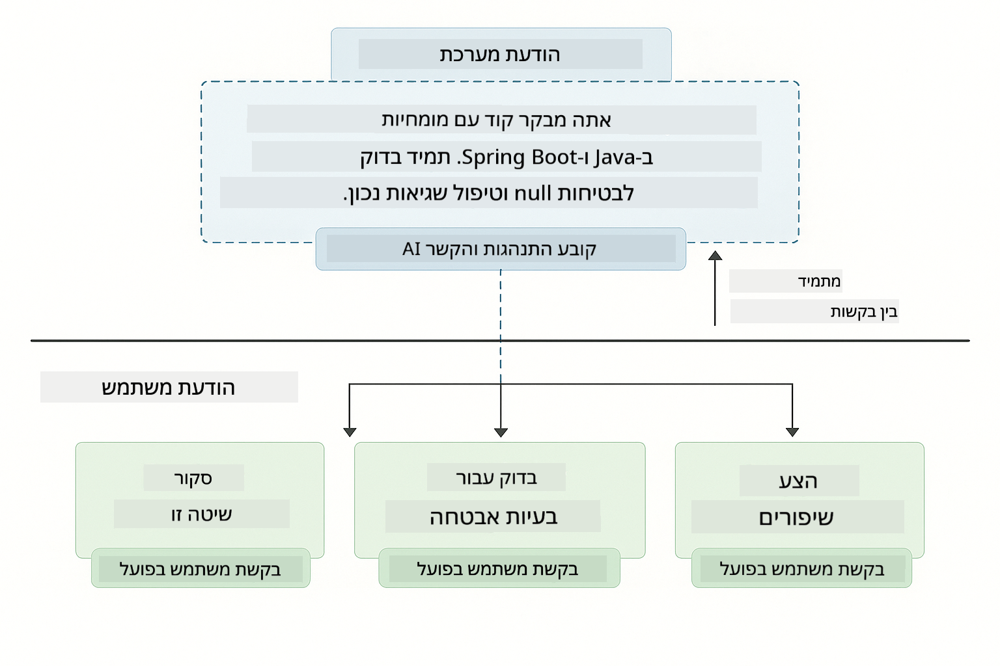
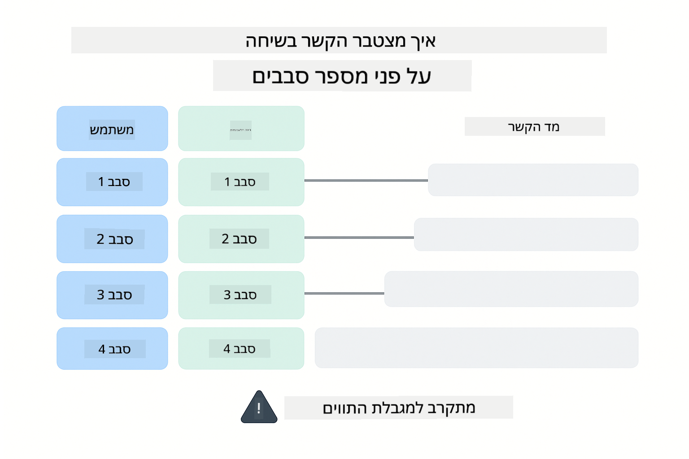
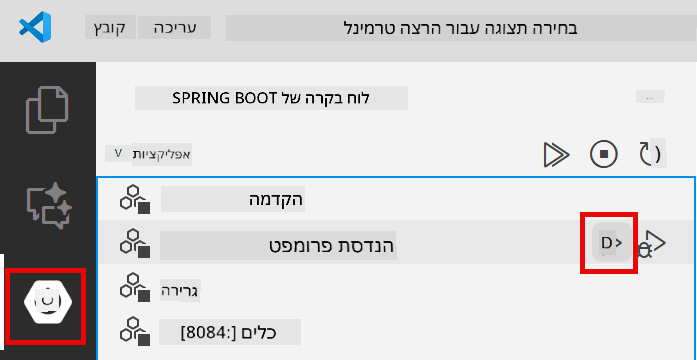
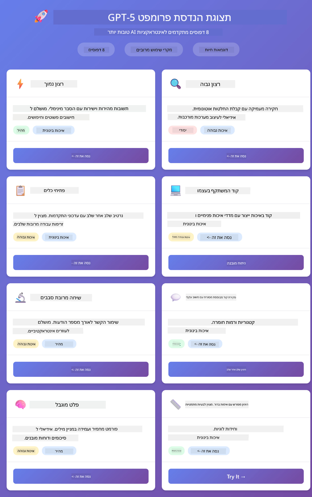
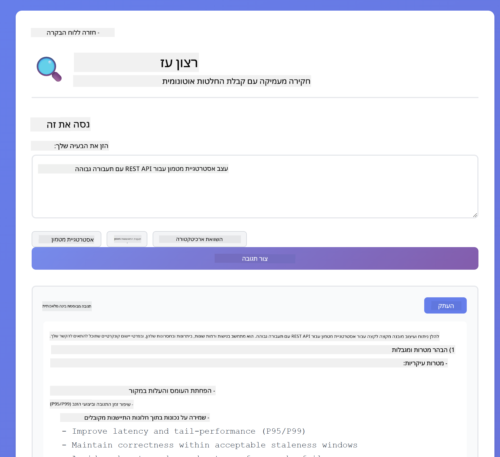
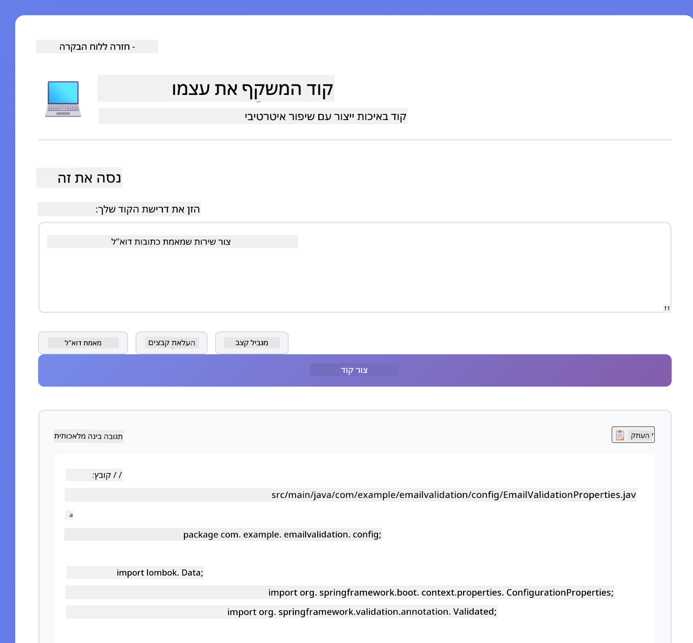
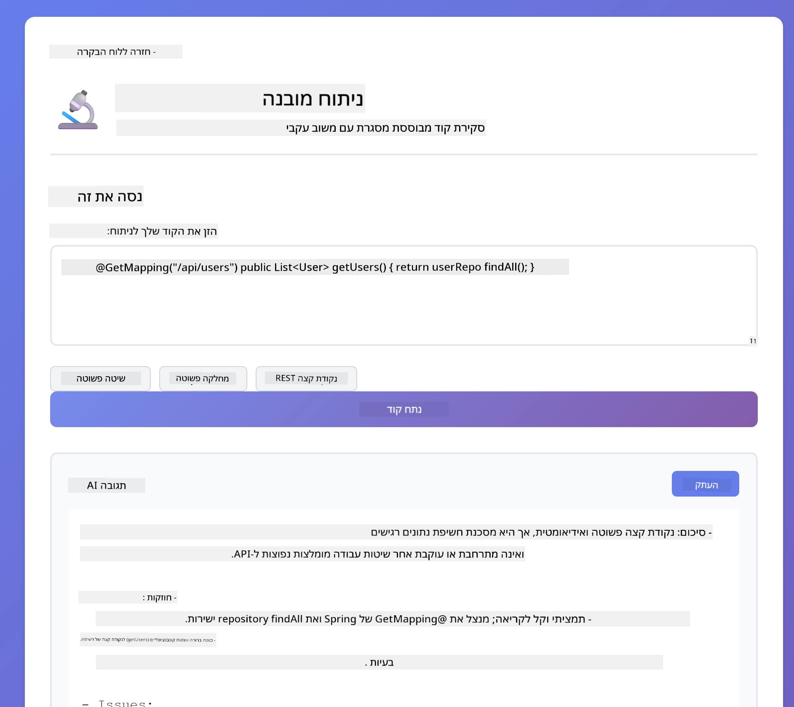
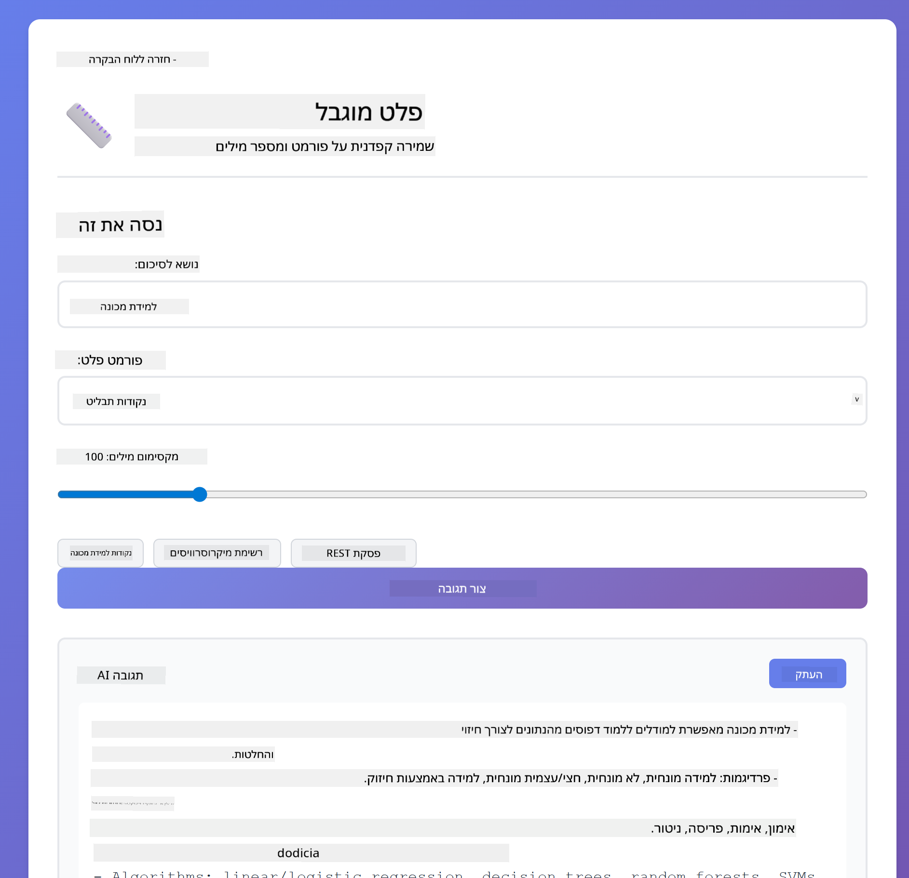
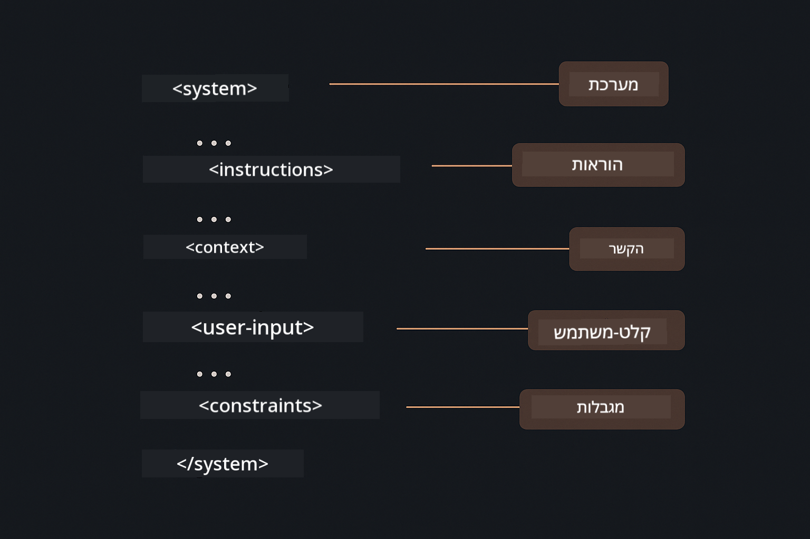

<!--
CO_OP_TRANSLATOR_METADATA:
{
  "original_hash": "8d787826cad7e92bf5cdbd116b1e6116",
  "translation_date": "2025-12-13T16:15:53+00:00",
  "source_file": "02-prompt-engineering/README.md",
  "language_code": "he"
}
-->
# מודול 02: הנדסת פרומפטים עם GPT-5

## תוכן העניינים

- [מה תלמדו](../../../02-prompt-engineering)
- [דרישות מוקדמות](../../../02-prompt-engineering)
- [הבנת הנדסת פרומפטים](../../../02-prompt-engineering)
- [כיצד זה משתמש ב-LangChain4j](../../../02-prompt-engineering)
- [התבניות המרכזיות](../../../02-prompt-engineering)
- [שימוש במשאבי Azure קיימים](../../../02-prompt-engineering)
- [צילום מסך של היישום](../../../02-prompt-engineering)
- [חקירת התבניות](../../../02-prompt-engineering)
  - [רצון נמוך לעומת רצון גבוה](../../../02-prompt-engineering)
  - [ביצוע משימות (הקדמות לכלים)](../../../02-prompt-engineering)
  - [קוד המשתקף בעצמו](../../../02-prompt-engineering)
  - [ניתוח מובנה](../../../02-prompt-engineering)
  - [שיחה מרובת סבבים](../../../02-prompt-engineering)
  - [הסקת מסקנות שלב אחר שלב](../../../02-prompt-engineering)
  - [פלט מוגבל](../../../02-prompt-engineering)
- [מה אתם באמת לומדים](../../../02-prompt-engineering)
- [השלבים הבאים](../../../02-prompt-engineering)

## מה תלמדו

במודול הקודם ראיתם כיצד זיכרון מאפשר בינה מלאכותית שיחתית והשתמשתם בדגמי GitHub לאינטראקציות בסיסיות. כעת נתמקד באיך אתם שואלים שאלות - הפרומפטים עצמם - באמצעות GPT-5 של Azure OpenAI. האופן שבו אתם מבנים את הפרומפטים משפיע באופן דרמטי על איכות התגובות שתקבלו.

נשתמש ב-GPT-5 כי הוא מציג שליטה בהסקת מסקנות - אתם יכולים להגיד למודל כמה לחשוב לפני התשובה. זה מבהיר אסטרטגיות פרומפט שונות ועוזר לכם להבין מתי להשתמש בכל גישה. ניהנה גם מהמגבלות הנמוכות יותר של Azure עבור GPT-5 לעומת דגמי GitHub.

## דרישות מוקדמות

- השלמת מודול 01 (משאבי Azure OpenAI פרוסים)
- קובץ `.env` בתיקיית השורש עם אישורי Azure (נוצר על ידי `azd up` במודול 01)

> **הערה:** אם לא השלמתם את מודול 01, עקבו תחילה אחרי הוראות הפריסה שם.

## הבנת הנדסת פרומפטים

הנדסת פרומפטים היא עיצוב טקסט קלט שמביא לכם תוצאות עקביות שאתם צריכים. זה לא רק לשאול שאלות - זה לבנות בקשות כך שהמודל יבין בדיוק מה אתם רוצים ואיך לספק זאת.

תחשבו על זה כמו לתת הוראות לעמית לעבודה. "תקן את הבאג" זה לא ברור. "תקן את החריגת null pointer ב-UserService.java שורה 45 על ידי הוספת בדיקת null" זה ספציפי. מודלי שפה פועלים באותו אופן - ספציפיות ומבנה חשובים.

## כיצד זה משתמש ב-LangChain4j

מודול זה מדגים תבניות פרומפט מתקדמות באמצעות אותה תשתית LangChain4j מהמודולים הקודמים, עם דגש על מבנה הפרומפט ושליטה בהסקת מסקנות.


*כיצד LangChain4j מחבר את הפרומפטים שלכם ל-Azure OpenAI GPT-5*

**תלויות** - מודול 02 משתמש בתלויות langchain4j הבאות המוגדרות ב-`pom.xml`:
```xml
<dependency>
    <groupId>dev.langchain4j</groupId>
    <artifactId>langchain4j</artifactId> <!-- Inherited from BOM in root pom.xml -->
</dependency>
<dependency>
    <groupId>dev.langchain4j</groupId>
    <artifactId>langchain4j-open-ai-official</artifactId> <!-- Inherited from BOM in root pom.xml -->
</dependency>
```

**הגדרת OpenAiOfficialChatModel** - [LangChainConfig.java](../../../02-prompt-engineering/src/main/java/com/example/langchain4j/prompts/config/LangChainConfig.java)

מודל השיחה מוגדר ידנית כ-bean של Spring באמצעות לקוח OpenAI הרשמי, התומך בנקודות הקצה של Azure OpenAI. ההבדל המרכזי ממודול 01 הוא איך אנו מבנים את הפרומפטים שנשלחים ל-`chatModel.chat()`, לא בהגדרת המודל עצמו.

**הודעות מערכת ומשתמש** - [Gpt5PromptService.java](../../../02-prompt-engineering/src/main/java/com/example/langchain4j/prompts/service/Gpt5PromptService.java)

LangChain4j מפריד בין סוגי ההודעות לשם בהירות. `SystemMessage` מגדיר את התנהגות והקשר ה-AI (כמו "אתה מבקר קוד"), בעוד `UserMessage` מכיל את הבקשה עצמה. הפרדה זו מאפשרת לשמור על התנהגות AI עקבית בין שאילתות משתמש שונות.

```java
SystemMessage systemMsg = SystemMessage.from(
    "You are a helpful Java programming expert."
);

UserMessage userMsg = UserMessage.from(
    "Explain what a List is in Java"
);

String response = chatModel.chat(systemMsg, userMsg);
```



*SystemMessage מספק הקשר מתמשך בעוד ש-UserMessages מכילות בקשות פרטניות*

**MessageWindowChatMemory לשיחה מרובת סבבים** - עבור תבנית שיחה מרובת סבבים, אנו משתמשים שוב ב-`MessageWindowChatMemory` ממודול 01. כל סשן מקבל מופע זיכרון משלו המאוחסן ב-`Map<String, ChatMemory>`, המאפשר שיחות מרובות בו זמנית ללא ערבוב הקשרים.

**תבניות פרומפט** - המוקד האמיתי כאן הוא הנדסת פרומפטים, לא API חדשים של LangChain4j. כל תבנית (רצון נמוך, רצון גבוה, ביצוע משימות וכו') משתמשת באותה שיטת `chatModel.chat(prompt)` אך עם מחרוזות פרומפט מבניות בקפידה. תגי XML, ההוראות והעיצוב הם חלק מטקסט הפרומפט, לא תכונות של LangChain4j.

**שליטה בהסקת מסקנות** - מאמץ ההסקה של GPT-5 נשלט באמצעות הוראות בפרומפט כמו "מקסימום 2 שלבי הסקה" או "חקור לעומק". אלו טכניקות הנדסת פרומפטים, לא הגדרות LangChain4j. הספרייה פשוט מעבירה את הפרומפטים שלכם למודל.

הלקח המרכזי: LangChain4j מספקת את התשתית (חיבור למודל דרך [LangChainConfig.java](../../../02-prompt-engineering/src/main/java/com/example/langchain4j/prompts/config/LangChainConfig.java), זיכרון, טיפול בהודעות דרך [Gpt5PromptService.java](../../../02-prompt-engineering/src/main/java/com/example/langchain4j/prompts/service/Gpt5PromptService.java)), בעוד שמודול זה מלמד אתכם כיצד ליצור פרומפטים יעילים בתוך תשתית זו.

## התבניות המרכזיות

לא כל הבעיות דורשות את אותה גישה. חלק מהשאלות זקוקות לתשובות מהירות, אחרות דורשות חשיבה עמוקה. חלק זקוקות להסבר גלוי, אחרות רק לתוצאה. מודול זה מכסה שמונה תבניות פרומפט - כל אחת מותאמת לתרחישים שונים. תנסו את כולן כדי ללמוד מתי כל גישה עובדת הכי טוב.


*סקירה של שמונת תבניות הנדסת הפרומפטים ומקרי השימוש שלהן*


*רצון נמוך (מהיר, ישיר) לעומת רצון גבוה (יסודי, חוקר) בגישות הסקת מסקנות*

**רצון נמוך (מהיר וממוקד)** - לשאלות פשוטות שבהן רוצים תשובות מהירות וישירות. המודל מבצע הסקה מינימלית - מקסימום 2 שלבים. השתמשו בזה לחישובים, חיפושים או שאלות פשוטות.

```java
String prompt = """
    <reasoning_effort>low</reasoning_effort>
    <instruction>maximum 2 reasoning steps</instruction>
    
    What is 15% of 200?
    """;

String response = chatModel.chat(prompt);
```

> 💡 **חקור עם GitHub Copilot:** פתח את [`Gpt5PromptService.java`](../../../02-prompt-engineering/src/main/java/com/example/langchain4j/prompts/service/Gpt5PromptService.java) ושאל:
> - "מה ההבדל בין תבניות פרומפט של רצון נמוך לעומת רצון גבוה?"
> - "איך תגי XML בפרומפטים עוזרים לבנות את תגובת ה-AI?"
> - "מתי כדאי להשתמש בתבניות של השתקפות עצמית לעומת הוראות ישירות?"

**רצון גבוה (עמוק ויסודי)** - לבעיות מורכבות שבהן רוצים ניתוח מקיף. המודל חוקר לעומק ומציג הסקה מפורטת. השתמשו בזה לעיצוב מערכות, החלטות ארכיטקטוניות או מחקר מורכב.

```java
String prompt = """
    <reasoning_effort>high</reasoning_effort>
    <instruction>explore thoroughly, show detailed reasoning</instruction>
    
    Design a caching strategy for a high-traffic REST API.
    """;

String response = chatModel.chat(prompt);
```

**ביצוע משימות (התקדמות שלב אחר שלב)** - עבור תהליכים מרובי שלבים. המודל מספק תוכנית מראש, מתאר כל שלב תוך כדי עבודה, ואז נותן סיכום. השתמשו בזה למיגרציות, יישומים או כל תהליך מרובה שלבים.

```java
String prompt = """
    <task>Create a REST endpoint for user registration</task>
    <preamble>Provide an upfront plan</preamble>
    <narration>Narrate each step as you work</narration>
    <summary>Summarize what was accomplished</summary>
    """;

String response = chatModel.chat(prompt);
```

פרומפט Chain-of-Thought מבקש במפורש מהמודל להראות את תהליך ההסקה שלו, משפר דיוק למשימות מורכבות. הפירוק שלב אחר שלב עוזר גם לבני אדם וגם ל-AI להבין את הלוגיקה.

> **🤖 נסה עם [GitHub Copilot](https://github.com/features/copilot) Chat:** שאל על תבנית זו:
> - "איך אדגים את תבנית ביצוע המשימות עבור פעולות ארוכות טווח?"
> - "מהן השיטות הטובות ביותר לבניית הקדמות לכלים ביישומים פרודקשן?"
> - "איך אפשר ללכוד ולהציג עדכוני התקדמות ביניים בממשק משתמש?"


*תכנון → ביצוע → סיכום עבור משימות מרובות שלבים*

**קוד המשתקף בעצמו** - ליצירת קוד באיכות פרודקשן. המודל מייצר קוד, בודק אותו לפי קריטריוני איכות ומשפר אותו באופן איטרטיבי. השתמשו בזה כשבונים תכונות או שירותים חדשים.

```java
String prompt = """
    <task>Create an email validation service</task>
    <quality_criteria>
    - Correct logic and error handling
    - Best practices (clean code, proper naming)
    - Performance optimization
    - Security considerations
    </quality_criteria>
    <instruction>Generate code, evaluate against criteria, improve iteratively</instruction>
    """;

String response = chatModel.chat(prompt);
```


*לולאת שיפור איטרטיבית - יצירה, הערכה, זיהוי בעיות, שיפור, חזרה*

**ניתוח מובנה** - להערכה עקבית. המודל בודק קוד באמצעות מסגרת קבועה (נכונות, שיטות עבודה, ביצועים, אבטחה). השתמשו בזה לסקירות קוד או הערכות איכות.

```java
String prompt = """
    <code>
    public List getUsers() {
        return database.query("SELECT * FROM users");
    }
    </code>
    
    <framework>
    Evaluate using these categories:
    1. Correctness - Logic and functionality
    2. Best Practices - Code quality
    3. Performance - Efficiency concerns
    4. Security - Vulnerabilities
    </framework>
    """;

String response = chatModel.chat(prompt);
```

> **🤖 נסה עם [GitHub Copilot](https://github.com/features/copilot) Chat:** שאל על ניתוח מובנה:
> - "איך אפשר להתאים את מסגרת הניתוח לסוגים שונים של סקירות קוד?"
> - "מה הדרך הטובה ביותר לנתח ולפעול על פלט מובנה באופן תכנותי?"
> - "איך להבטיח רמות חומרה עקביות בין סשנים שונים של סקירה?"


*מסגרת ארבע-קטגוריות לסקירות קוד עקביות עם רמות חומרה*

**שיחה מרובת סבבים** - לשיחות שדורשות הקשר. המודל זוכר הודעות קודמות ובונה עליהן. השתמשו בזה למפגשי עזרה אינטראקטיביים או שאלות ותשובות מורכבות.

```java
ChatMemory memory = MessageWindowChatMemory.withMaxMessages(10);

memory.add(UserMessage.from("What is Spring Boot?"));
AiMessage aiMessage1 = chatModel.chat(memory.messages()).aiMessage();
memory.add(aiMessage1);

memory.add(UserMessage.from("Show me an example"));
AiMessage aiMessage2 = chatModel.chat(memory.messages()).aiMessage();
memory.add(aiMessage2);
```



*כיצד מצטבר הקשר השיחה על פני סבבים מרובים עד להגעה למגבלת הטוקנים*

**הסקת מסקנות שלב אחר שלב** - לבעיות שדורשות לוגיקה גלויה. המודל מציג הסקה מפורשת לכל שלב. השתמשו בזה לבעיות מתמטיות, חידות לוגיות, או כשאתם צריכים להבין את תהליך החשיבה.

```java
String prompt = """
    <instruction>Show your reasoning step-by-step</instruction>
    
    If a train travels 120 km in 2 hours, then stops for 30 minutes,
    then travels another 90 km in 1.5 hours, what is the average speed
    for the entire journey including the stop?
    """;

String response = chatModel.chat(prompt);
```


*פירוק בעיות לשלבים לוגיים מפורשים*

**פלט מוגבל** - לתגובות עם דרישות פורמט ספציפיות. המודל מקפיד על כללי פורמט ואורך. השתמשו בזה לסיכומים או כשאתם צריכים מבנה פלט מדויק.

```java
String prompt = """
    <constraints>
    - Exactly 100 words
    - Bullet point format
    - Technical terms only
    </constraints>
    
    Summarize the key concepts of machine learning.
    """;

String response = chatModel.chat(prompt);
```


*אכיפת דרישות פורמט, אורך ומבנה ספציפיות*

## שימוש במשאבי Azure קיימים

**אימות פריסה:**

ודאו שקובץ `.env` קיים בתיקיית השורש עם אישורי Azure (נוצר במהלך מודול 01):
```bash
cat ../.env  # צריך להציג את AZURE_OPENAI_ENDPOINT, API_KEY, DEPLOYMENT
```

**הפעלת היישום:**

> **הערה:** אם כבר הפעלתם את כל היישומים באמצעות `./start-all.sh` ממודול 01, מודול זה כבר רץ על פורט 8083. תוכלו לדלג על פקודות ההפעלה למטה ולעבור ישירות ל-http://localhost:8083.

**אפשרות 1: שימוש ב-Spring Boot Dashboard (מומלץ למשתמשי VS Code)**

מיכל הפיתוח כולל את תוסף Spring Boot Dashboard, המספק ממשק חזותי לניהול כל יישומי Spring Boot. תוכלו למצוא אותו בסרגל הפעילות בצד שמאל של VS Code (חפשו את סמל Spring Boot).

מ-Spring Boot Dashboard תוכלו:
- לראות את כל יישומי Spring Boot הזמינים בסביבת העבודה
- להפעיל/להפסיק יישומים בלחיצה אחת
- לצפות בלוגים של היישום בזמן אמת
- לנטר את מצב היישום

פשוט לחצו על כפתור ההפעלה ליד "prompt-engineering" כדי להפעיל את המודול הזה, או להפעיל את כל המודולים בבת אחת.



**אפשרות 2: שימוש בסקריפטים של shell**

הפעלת כל יישומי הווב (מודולים 01-04):

**Bash:**
```bash
cd ..  # מתיקיית השורש
./start-all.sh
```

**PowerShell:**
```powershell
cd ..  # מתיקיית השורש
.\start-all.ps1
```

או להפעיל רק את המודול הזה:

**Bash:**
```bash
cd 02-prompt-engineering
./start.sh
```

**PowerShell:**
```powershell
cd 02-prompt-engineering
.\start.ps1
```

שני הסקריפטים טוענים אוטומטית משתני סביבה מקובץ `.env` בשורש ויבנו את קבצי ה-JAR אם אינם קיימים.

> **הערה:** אם אתם מעדיפים לבנות את כל המודולים ידנית לפני ההפעלה:
>
> **Bash:**
> ```bash
> cd ..  # Go to root directory
> mvn clean package -DskipTests
> ```
>
> **PowerShell:**
> ```powershell
> cd ..  # Go to root directory
> mvn clean package -DskipTests
> ```

פתחו את http://localhost:8083 בדפדפן שלכם.

**להפסקה:**

**Bash:**
```bash
./stop.sh  # רק מודול זה
# או
cd .. && ./stop-all.sh  # כל המודולים
```

**PowerShell:**
```powershell
.\stop.ps1  # רק מודול זה
# או
cd ..; .\stop-all.ps1  # כל המודולים
```

## צילום מסך של היישום



*לוח המחוונים הראשי המציג את כל 8 תבניות הנדסת הפרומפטים עם מאפייניהן ומקרי השימוש*

## חקירת התבניות

ממשק האינטרנט מאפשר לכם להתנסות באסטרטגיות פרומפט שונות. כל תבנית פותרת בעיות שונות - נסו אותן כדי לראות מתי כל גישה זורחת.

### רצון נמוך לעומת רצון גבוה

שאלו שאלה פשוטה כמו "מה זה 15% מ-200?" באמצעות רצון נמוך. תקבלו תשובה מיידית וישירה. עכשיו שאלו משהו מורכב כמו "עצב אסטרטגיית מטמון ל-API עם תעבורה גבוהה" באמצעות רצון גבוה. צפו כיצד המודל מאט ומספק הסקה מפורטת. אותו מודל, אותו מבנה שאלה - אבל הפרומפט אומר לו כמה לחשוב.


*חישוב מהיר עם הסבר מינימלי*



*אסטרטגיית מטמון מקיפה (2.8MB)*

### ביצוע משימה (הקדמות לכלים)

זרימות עבודה מרובות שלבים נהנות מתכנון מראש ונרטיב התקדמות. המודל מפרט מה הוא יעשה, מתאר כל שלב, ואז מסכם תוצאות.


*יצירת נקודת קצה REST עם נרטיב שלב אחר שלב (3.9MB)*

### קוד עם חשיבה עצמית

נסה "צור שירות אימות אימייל". במקום רק לייצר קוד ולעצור, המודל מייצר, מעריך מול קריטריוני איכות, מזהה חולשות ומשפר. תראה אותו חוזר על עצמו עד שהקוד עומד בסטנדרטים של ייצור.



*שירות אימות אימייל מלא (5.2MB)*

### ניתוח מובנה

סקירות קוד דורשות מסגרות הערכה עקביות. המודל מנתח קוד באמצעות קטגוריות קבועות (נכונות, שיטות עבודה, ביצועים, אבטחה) עם רמות חומרה.



*סקירת קוד מבוססת מסגרת*

### שיחה רב-סיבובית

שאל "מה זה Spring Boot?" ואז מיד המשך עם "הראה לי דוגמה". המודל זוכר את השאלה הראשונה שלך ונותן לך דוגמה ספציפית ל-Spring Boot. בלי זיכרון, השאלה השנייה הייתה עמומה מדי.


*שימור הקשר בין שאלות*

### הסבר שלב אחר שלב

בחר בעיית מתמטיקה ונסה אותה עם הסבר שלב אחר שלב והתלהבות נמוכה. התלהבות נמוכה נותנת רק את התשובה - מהיר אך לא ברור. הסבר שלב אחר שלב מראה כל חישוב והחלטה.


*בעיה מתמטית עם שלבים מפורשים*

### פלט מוגבל

כשאתה צריך פורמטים ספציפיים או ספירת מילים, תבנית זו מחייבת עמידה קפדנית. נסה לייצר סיכום עם בדיוק 100 מילים בפורמט נקודות.



*סיכום למידת מכונה עם שליטה על הפורמט*

## מה שאתה באמת לומד

**מאמץ חשיבתי משנה הכל**

GPT-5 מאפשר לך לשלוט במאמץ החישובי דרך ההנחיות שלך. מאמץ נמוך אומר תגובות מהירות עם חקירה מינימלית. מאמץ גבוה אומר שהמודל לוקח זמן לחשוב לעומק. אתה לומד להתאים את המאמץ למורכבות המשימה - אל תבזבז זמן על שאלות פשוטות, אבל גם אל תמהר בהחלטות מורכבות.

**מבנה מנחה התנהגות**

שמעת על תגי XML בהנחיות? הם לא רק לקישוט. מודלים עוקבים אחרי הוראות מובנות בצורה אמינה יותר מטקסט חופשי. כשאתה צריך תהליכים מרובי שלבים או לוגיקה מורכבת, המבנה עוזר למודל לעקוב איפה הוא ומה הבא.



*אנטומיה של הנחיה מובנית היטב עם חלקים ברורים וארגון בסגנון XML*

**איכות דרך הערכה עצמית**

תבניות החשיבה העצמית עובדות על ידי הפיכת קריטריוני האיכות למפורשים. במקום לקוות שהמודל "יעשה את זה נכון", אתה אומר לו בדיוק מה זה "נכון": לוגיקה נכונה, טיפול בשגיאות, ביצועים, אבטחה. המודל יכול אז להעריך את הפלט שלו ולשפר. זה הופך יצירת קוד מלוטו לתהליך.

**הקשר הוא סופי**

שיחות רב-סיבוביות עובדות על ידי הכללת היסטוריית ההודעות בכל בקשה. אבל יש גבול - לכל מודל יש מספר מקסימלי של טוקנים. ככל שהשיחות מתארכות, תצטרך אסטרטגיות לשמור על הקשר רלוונטי מבלי להגיע לתקרה. מודול זה מראה איך הזיכרון עובד; בהמשך תלמד מתי לסכם, מתי לשכוח ומתי לשלוף.

## הצעדים הבאים

**המודול הבא:** [03-rag - RAG (יצירה משופרת באמצעות שליפה)](../03-rag/README.md)

---

**ניווט:** [← קודם: מודול 01 - מבוא](../01-introduction/README.md) | [חזרה לעמוד הראשי](../README.md) | [הבא: מודול 03 - RAG →](../03-rag/README.md)

---

<!-- CO-OP TRANSLATOR DISCLAIMER START -->
**כתב ויתור**:  
מסמך זה תורגם באמצעות שירות תרגום מבוסס בינה מלאכותית [Co-op Translator](https://github.com/Azure/co-op-translator). למרות שאנו שואפים לדיוק, יש לקחת בחשבון כי תרגומים אוטומטיים עלולים להכיל שגיאות או אי-דיוקים. המסמך המקורי בשפת המקור שלו נחשב למקור הסמכותי. למידע קריטי מומלץ להשתמש בתרגום מקצועי על ידי אדם. אנו לא נושאים באחריות לכל אי-הבנה או פרשנות שגויה הנובעת משימוש בתרגום זה.
<!-- CO-OP TRANSLATOR DISCLAIMER END -->