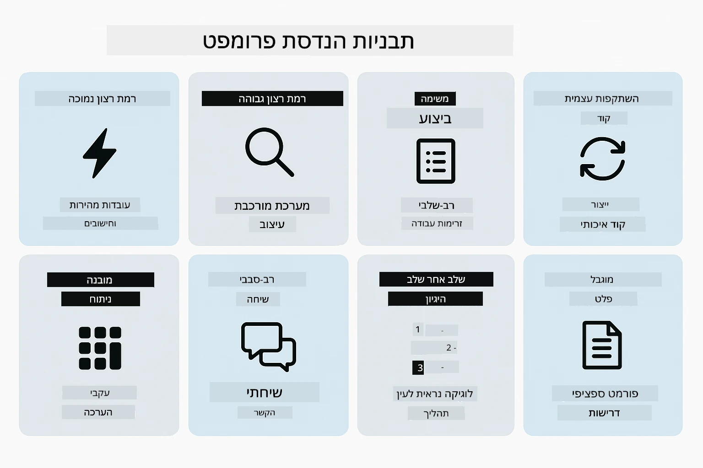
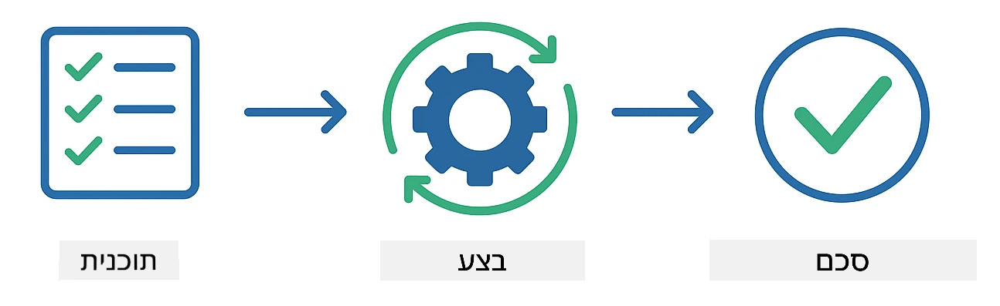
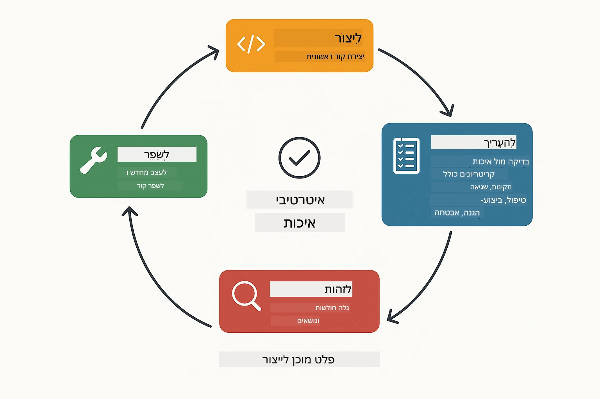
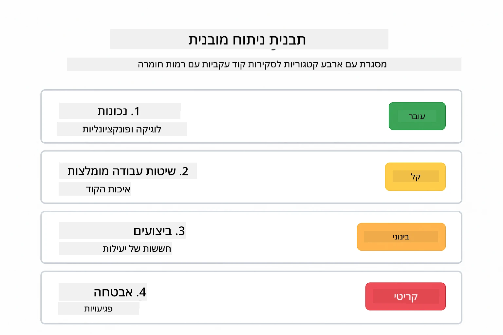
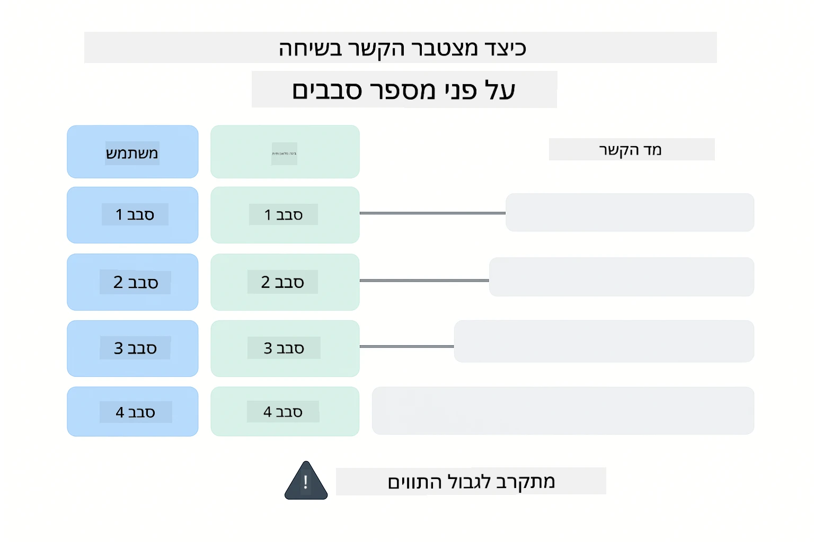
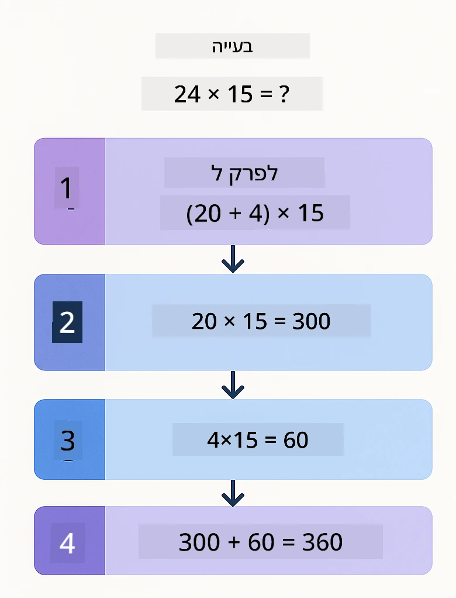
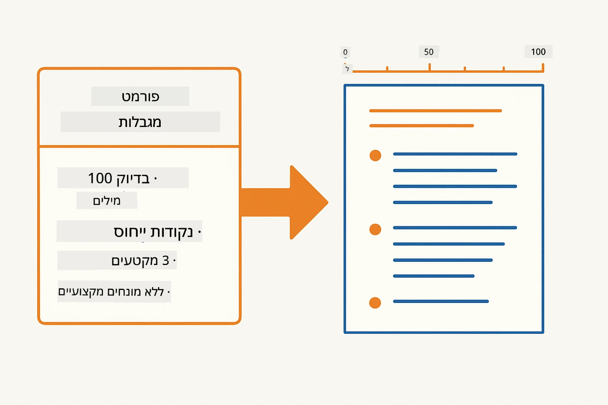
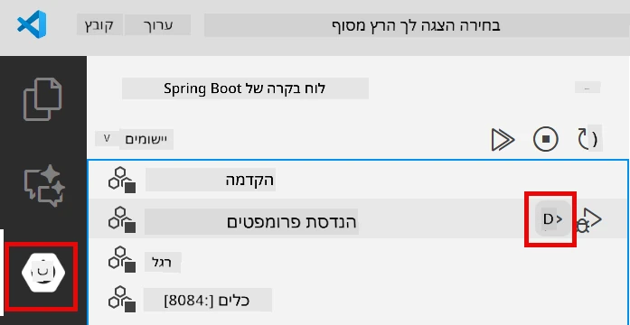
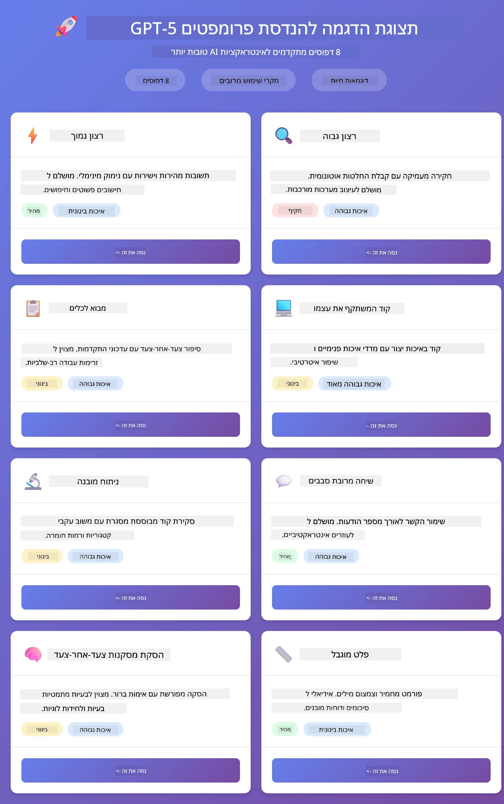
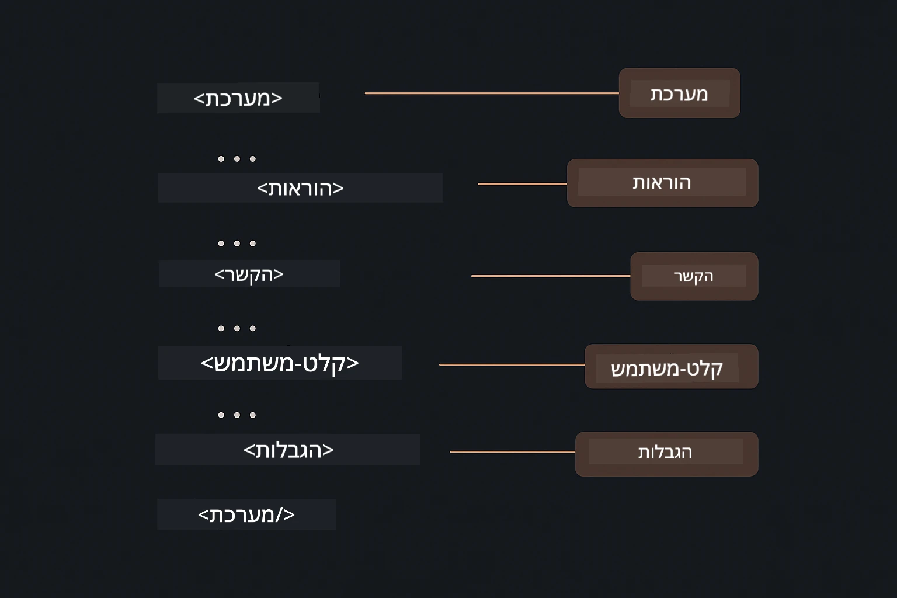

# מודול 02: הנדסת פקודות עם GPT-5.2

## תוכן עניינים

- [סקירת וידאו](#סקירת-וידאו)
- [מה תלמדו](#מה-תלמדו)
- [קדם תנאים](#קדם-תנאים)
- [הבנת הנדסת פקודות](#הבנת-הנדסת-פקודות)
- [יסודות הנדסת פקודות](#יסודות-הנדסת-פקודות)
  - [איפוס ירי פקודות](#אפס-ירי-פקודות)
  - [איפוס ירי עם מספר דוגמאות](#ירי-פקודות-עם-מספר-דוגמאות)
  - [שרשרת מחשבה](#שרשרת-מחשבה)
  - [איפוס מבוסס תפקיד](#איפוס-מבוסס-תפקיד)
  - [תבניות פקודות](#תבניות-פקודות)
- [תבניות מתקדמות](#תבניות-מתקדמות)
- [הרצת היישום](#הרצת-היישום)
- [צילום מסך של היישום](#צילומי-מסך-של-היישום)
- [חקירת התבניות](#חקר-התבניות)
  - [רצון נמוך לעומת גבוה](#eagerness-נמוכה-מול-גבוהה)
  - [ביצוע משימה (הקדמות כלים)](#ביצוע-משימות-פתיחי-כלים)
  - [קוד עם חשיבה עצמית](#קוד-המשתקף-מעצמו)
  - [ניתוח מובנה](#ניתוח-מובנה)
  - [שיחה מרובת סבבים](#שיחה-מרובת-סבבים)
  - [היסק שלב אחר שלב](#נימוקים-שלב-אחר-שלב)
  - [פלט מוגבל](#פלט-מוגבל)
- [מה שלמדתם באמת](#מה-שלמעשה-אתה-לומד)
- [השלבים הבאים](#צעדים-הבאים)

## סקירת וידאו

צפו במפגש החי הזה שמסביר כיצד להתחיל לעבוד עם מודול זה:

<a href="https://www.youtube.com/live/PJ6aBaE6bog?si=LDshyBrTRodP-wke"></a>

## מה תלמדו

הדיאגרמה הבאה מספקת סקירה כללית של הנושאים המרכזיים והכישורים שתפתחו במודול זה — מטכניקות שיפור פקודות ועד זרימת העבודה שלב אחר שלב שתעקבו אחריה.


במודול הקודם ראיתם כיצד הזיכרון מאפשר בינה מלאכותית שיחה עם Azure OpenAI. כעת נתמקד כיצד אתם שואלים שאלות — כלומר הפקודות עצמן — באמצעות GPT-5.2 של Azure OpenAI. האופן בו אתם מבנים את הפקודות משפיע באופן דרמטי על איכות התגובות שתקבלו. נתחיל בסקירת טכניקות הפקודות הבסיסיות, ואז נעבור לשמונה תבניות מתקדמות המנצלות במלואן את יכולות GPT-5.2.

נשתמש ב-GPT-5.2 מכיוון שהוא מציג שליטה בהיגיון - אתם יכולים להורות למודל כמה לחשוב לפני מענה. זה מבהיר אסטרטגיות פקודה שונות ועוזר לכם להבין מתי להשתמש בכל גישה.

## קדם תנאים

- השלמת מודול 01 (משאבי Azure OpenAI מופעלים)
- קובץ `.env` בתיקיית השורש עם אישורי Azure (נוצר על ידי `azd up` במודול 01)

> **הערה:** אם לא השלמתם את מודול 01, יש לעקוב תחילה אחר הוראות הפריסה שם.

## הבנת הנדסת פקודות

בבסיסו, הנדסת פקודות היא ההבדל בין הוראות לא מדויקות להוראות מדויקות, כפי שההשוואה למטה ממחישה.


הנדסת פקודות עוסקת בעיצוב טקסט קלט שמביא איתם בתוצאות הרצויות בעקביות. זה לא רק לשאול שאלות - אלא לבנות בקשות כך שהמודל יבין בדיוק מה אתם רוצים ואיך לספק זאת.

תחשבו על זה כמו מתן הוראות לעמית לעבודה. "תקן את הבאג" זו הוראה מעורפלת. "תקן את חריגת הנקודה הריקה ב-UserService.java שורה 45 על ידי הוספת בדיקת null" היא מדויקת. מודלי השפה פועלים באותה צורה - פירוט ומבנה חשובים.

הדיאגרמה למטה מראה כיצד LangChain4j משתלב בתמונה — מחבר את תבניות הפקודה שלכם למודל באמצעות בלוקי הבנייה SystemMessage ו-UserMessage.


LangChain4j מספק את התשתית — חיבורי מודל, זיכרון וסוגי הודעות — בעוד שתבניות הפקודות הן רק טקסט מבנה בקפידה שאתם שולחים דרך התשתית הזו. אבני הבניין המרכזיות הן `SystemMessage` (שמצב את ההתנהגות והתפקיד של ה-AI) ו-`UserMessage` (שאוחז בבקשה העצמאית שלכם).

## יסודות הנדסת פקודות

חמש הטכניקות העיקריות המופיעות למטה מהוות את הבסיס להנדסת פקודות אפקטיבית. כל אחת מתמקדת באספקט שונה של האינטראקציה שלכם עם מודלי שפה.


לפני שנצלול לתבניות המתקדמות במודול זה, נסקור חמש טכניקות פקודה בסיסיות. אלה אבני הבניין שכל מהנדס פקודות צריך להכיר.

### אפס ירי פקודות

הגישה הפשוטה ביותר: לתת למודל הוראה ישירה ללא דוגמאות. המודל מסתמך לחלוטין על האימון שלו כדי להבין ולבצע את המשימה. זה עובד טוב לבקשות פשוטות שבהן ההתנהגות הצפויה ברורה.


*הוראה ישירה ללא דוגמאות — המודל מסיק את המשימה מהוראה בלבד*

```java
String prompt = "Classify this sentiment: 'I absolutely loved the movie!'";
String response = model.chat(prompt);
// תגובה: "חיובי"
```

**מתי להשתמש:** סיווגים פשוטים, שאלות ישירות, תרגומים, או כל משימה שהמודל יכול להתמודד איתה בלי הדרכה נוספת.

### ירי פקודות עם מספר דוגמאות

מספקים דוגמאות המדגימות את התבנית שברצונכם שהמודל יעקוב אחריה. המודל לומד את פורמט הקלט-פלט המצופה מדוגמאותיכם ומיישם אותו על קלטים חדשים. זה משפר מאוד את העקביות למשימות שבהן פורמט או התנהגות רצויים אינם ברורים.


*לימוד מדוגמאות — המודל מזהה את התבנית ומיישם אותה על קלטים חדשים*

```java
String prompt = """
    Classify the sentiment as positive, negative, or neutral.
    
    Examples:
    Text: "This product exceeded my expectations!" → Positive
    Text: "It's okay, nothing special." → Neutral
    Text: "Waste of money, very disappointed." → Negative
    
    Now classify this:
    Text: "Best purchase I've made all year!"
    """;
String response = model.chat(prompt);
```

**מתי להשתמש:** סיווגים מותאמים אישית, עיצוב עקבי, משימות בתחום ספציפי, או כאשר תוצאות אפס ירי אינן עקביות.

### שרשרת מחשבה

בקשו מהמודל להראות את ההיגיון שלו צעד אחר צעד. במקום לקפוץ ישר לתשובה, המודל מפרק את הבעיה ועובר על כל חלק במפורש. זה משפר את הדיוק באלות מתמטיות, לוגיקה ומשימות היסק רב-שלבי.


*היסק שלב אחר שלב — שבירת בעיות מורכבות לצעדים לוגיים מפורשים*

```java
String prompt = """
    Problem: A store has 15 apples. They sell 8 apples and then 
    receive a shipment of 12 more apples. How many apples do they have now?
    
    Let's solve this step-by-step:
    """;
String response = model.chat(prompt);
// הדגם מציג: 15 - 8 = 7, אז 7 + 12 = 19 תפוחים
```

**מתי להשתמש:** בעיות מתמטיות, חידות לוגיות, איתור באגים, או כל משימה שבה הצגת תהליך ההיגיון משפרת דיוק ואמון.

### איפוס מבוסס תפקיד

הגדירו פרסונה או תפקיד ל-AI לפני ששואלים את השאלה. זה מספק הקשר שמעצבת את הטון, העומק, והמיקוד של התשובה. "ארכיטקט תוכנה" נותן עצות שונות מ"מפתח זוטר" או "מבקר אבטחה".


*הגדרת הקשר ופרסונה — אותה שאלה מקבלת תשובה שונה בהתאם לתפקיד שהוקצה*

```java
String prompt = """
    You are an experienced software architect reviewing code.
    Provide a brief code review for this function:
    
    def calculate_total(items):
        total = 0
        for item in items:
            total = total + item['price']
        return total
    """;
String response = model.chat(prompt);
```

**מתי להשתמש:** סקירות קוד, הדרכה, ניתוחים בתחום ספציפי, או כאשר אתם צריכים תגובות מותאמות לרמת מומחיות או נקודת מבט מסוימת.

### תבניות פקודות

צרו פקודות רב-פעמיות עם תבניות משתנים. במקום לכתוב פקודה חדשה בכל פעם, הגדירו תבנית פעם אחת ומלאו בערכים שונים. מחלקת `PromptTemplate` של LangChain4j מקלה על כך עם תחביר `{{variable}}`.


*פקודות רב-פעמיות עם משתנים — תבנית אחת, שימושים רבים*

```java
PromptTemplate template = PromptTemplate.from(
    "What's the best time to visit {{destination}} for {{activity}}?"
);

Prompt prompt = template.apply(Map.of(
    "destination", "Paris",
    "activity", "sightseeing"
));

String response = model.chat(prompt.text());
```

**מתי להשתמש:** שאילתות חוזרות עם קלטים שונים, עיבוד באצווה, בניית זרימות עבודה של AI רב-שימושיות, או כל תרחיש שבו מבנה הפקודה נשאר קבוע אך הנתונים משתנים.

---

חמשת היסודות האלו נותנים לכם ערכת כלים איתנה לרוב משימות הפקודה. שאר המודול מתבסס עליהם עם **שמונה תבניות מתקדמות** שמנצלות את שליטת ההיגיון, ההערכה העצמית והפלט המובנה של GPT-5.2.

## תבניות מתקדמות

עם היסודות הנלמדים, נעבור לשמונה התבניות המתקדמות שהופכות מודול זה לייחודי. לא כל הבעיות זקוקות לאותה גישה. חלק מהשאלות דורשות תשובות מהירות, אחרות דורשות חשיבה עמוקה. חלק דורשות היגיון גלוי, אחרות רק תוצאות. כל תבנית מטה אופטימלית לתרחיש אחר — ושליטה בהיגיון של GPT-5.2 מדגישה את ההבדלים.



*סקירה של שמונת תבניות הנדסת הפקודות והשימושים שלהן*

GPT-5.2 מוסיף מימד נוסף לתבניות האלו: *שליטה בהיגיון*. המחוון למטה מראה כיצד ניתן לכוונן את מאמץ החשיבה של המודל — מתשובות מהירות וישירות ועד לניתוח מעמיק ויסודי.


*שליטה בהיגיון של GPT-5.2 מאפשרת לכם לציין כמה לחשוב המודל - מתשובות מהירות ועד חקירה מעמיקה*

**רצון נמוך (מהיר וממוקד)** - לשאלות פשוטות שבהן אתם רוצים תשובות מהירות וישירות. המודל מבצע היגיון מינימלי - מקסימום 2 צעדים. השתמשו בזה עבור חישובים, חיפושים או שאלות ישירות.

```java
String prompt = """
    <context_gathering>
    - Search depth: very low
    - Bias strongly towards providing a correct answer as quickly as possible
    - Usually, this means an absolute maximum of 2 reasoning steps
    - If you think you need more time, state what you know and what's uncertain
    </context_gathering>
    
    Problem: What is 15% of 200?
    
    Provide your answer:
    """;

String response = chatModel.chat(prompt);
```

> 💡 **חקור עם GitHub Copilot:** פתח את [`Gpt5PromptService.java`](../../../02-prompt-engineering/src/main/java/com/example/langchain4j/prompts/service/Gpt5PromptService.java) ושאל:
> - "מה ההבדל בין דפוסי פקודה של רצון נמוך לעומת רצון גבוה?"
> - "כיצד תגי ה-XML בפקודות עוזרים לבנות את תגובת ה-AI?"
> - "מתי יש להשתמש בתבניות של חשיבה עצמית לעומת הוראה ישירה?"

**רצון גבוה (עמוק ויסודי)** - לבעיות מורכבות שבהן אתם רוצים ניתוח מעמיק. המודל חוקר לעומק ומראה היגיון מפורט. השתמשו בזה לעיצוב מערכות, החלטות ארכיטקטוניות, או מחקר מורכב.

```java
String prompt = """
    Analyze this problem thoroughly and provide a comprehensive solution.
    Consider multiple approaches, trade-offs, and important details.
    Show your analysis and reasoning in your response.
    
    Problem: Design a caching strategy for a high-traffic REST API.
    """;

String response = chatModel.chat(prompt);
```

**ביצוע משימות (התקדמות שלב-אחר-שלב)** - לזרימות עבודה רב-שלביות. המודל מספק תוכנית מקדימה, מפרט כל שלב בעבודה ואז נותן סיכום. השתמשו בזה עבור מעבר נתונים, יישומים או כל תהליך רב שלבים.

```java
String prompt = """
    <task_execution>
    1. First, briefly restate the user's goal in a friendly way
    
    2. Create a step-by-step plan:
       - List all steps needed
       - Identify potential challenges
       - Outline success criteria
    
    3. Execute each step:
       - Narrate what you're doing
       - Show progress clearly
       - Handle any issues that arise
    
    4. Summarize:
       - What was completed
       - Any important notes
       - Next steps if applicable
    </task_execution>
    
    <tool_preambles>
    - Always begin by rephrasing the user's goal clearly
    - Outline your plan before executing
    - Narrate each step as you go
    - Finish with a distinct summary
    </tool_preambles>
    
    Task: Create a REST endpoint for user registration
    
    Begin execution:
    """;

String response = chatModel.chat(prompt);
```

איפוס שרשרת מחשבה מבקש במפורש מהמודל להראות את תהליך ההיגיון שלו, ומשפר את הדיוק במשימות מורכבות. הפירוק שלב אחר שלב עוזר גם לבני אדם וגם ל-AI להבין את הלוגיקה.

> **🤖 נסה עם צ’אט [GitHub Copilot](https://github.com/features/copilot):** שאל על התבנית הזו:
> - "איך אסתגל את דפוס ביצוע המשימות עבור פעולות ארוכות טווח?"
> - "מהן השיטות הטובות ביותר לבניית הקדמות כלים ביישומים פרודקשן?"
> - "כיצד אוכל לתעד ולהציג עדכוני התקדמות בינוניים בממשק משתמש?"

הדיאגרמה למטה מדגימה את זרימת העבודה תכנון → ביצוע → סיכום.



*זרימת עבודה תכנון → ביצוע → סיכום למשימות רב-שלביות*

**קוד עם חשיבה עצמית** - ליצירת קוד באיכות הפקה. המודל מייצר קוד העומד בסטנדרטים של הפקה עם טיפול שגיאות תקין. השתמשו בזה בבניית תכונות או שירותים חדשים.

```java
String prompt = """
    Generate Java code with production-quality standards: Create an email validation service
    Keep it simple and include basic error handling.
    """;

String response = chatModel.chat(prompt);
```

הדיאגרמה הבאה מציגה את מחזור השיפור החוזר הזה — ייצור, הערכה, זיהוי נקודות תורפה, ושיפור עד שהקוד עומד בסטנדרטים של הפקה.



*מחזור שיפור חוזר - הפקה, הערכה, איתור בעיות, שיפור, חזרה*

**ניתוח מובנה** - להערכה עקבית. המודל סוקר קוד באמצעות מסגרת קבועה (נכונות, פרקטיקות, ביצועים, אבטחה, תחזוקה). השתמשו בזה לביקורות קוד או הערכות איכות.

```java
String prompt = """
    <analysis_framework>
    You are an expert code reviewer. Analyze the code for:
    
    1. Correctness
       - Does it work as intended?
       - Are there logical errors?
    
    2. Best Practices
       - Follows language conventions?
       - Appropriate design patterns?
    
    3. Performance
       - Any inefficiencies?
       - Scalability concerns?
    
    4. Security
       - Potential vulnerabilities?
       - Input validation?
    
    5. Maintainability
       - Code clarity?
       - Documentation?
    
    <output_format>
    Provide your analysis in this structure:
    - Summary: One-sentence overall assessment
    - Strengths: 2-3 positive points
    - Issues: List any problems found with severity (High/Medium/Low)
    - Recommendations: Specific improvements
    </output_format>
    </analysis_framework>
    
    Code to analyze:
    ```
    public List getUsers() {
        return database.query("SELECT * FROM users");
    }
    ```
    Provide your structured analysis:
    """;

String response = chatModel.chat(prompt);
```

> **🤖 נסה עם צ’אט [GitHub Copilot](https://github.com/features/copilot):** שאל על ניתוח מובנה:
> - "כיצד להתאים אישית את מסגרת הניתוח לסוגים שונים של ביקורות קוד?"
> - "מהו האופן הטוב ביותר לנתח ולפעול על פלט מובנה בתוכנה?"
> - "כיצד להבטיח רמות חומרה עקביות במפגשי ביקורת שונים?"

הדיאגרמה להלן מראה כיצד המסגרת המובנית מארגנת ביקורת קוד לקטגוריות עקביות עם רמות חומרה.



*מסגרת לביקורות קוד עקביות עם רמות חומרה*

**שיחה מרובת סבבים** - לשיחות שדורשות הקשר. המודל זוכר הודעות קודמות ובונה עליהן. השתמשו בזה למפגשי עזרה אינטראקטיביים או שאלות ותשובות מורכבות.

```java
ChatMemory memory = MessageWindowChatMemory.withMaxMessages(10);

memory.add(UserMessage.from("What is Spring Boot?"));
AiMessage aiMessage1 = chatModel.chat(memory.messages()).aiMessage();
memory.add(aiMessage1);

memory.add(UserMessage.from("Show me an example"));
AiMessage aiMessage2 = chatModel.chat(memory.messages()).aiMessage();
memory.add(aiMessage2);
```

הדיאגרמה הבאה ממחישה כיצד הקשר השיחה מצטבר בכל סבב ואיך זה מתקשר למגבלת הטוקנים של המודל.



*כיצד מצטבר הקשר שיחה על פני סבבים רבים עד שמגיעים למגבלת הטוקנים*

**היסק שלב אחר שלב** - לבעיות שדורשות לוגיקה גלויה. המודל מראה היגיון מפורש עבור כל שלב. השתמשו בזה לבעיות מתמטיות, חידות לוגיות, או כשאתם צריכים להבין את תהליך החשיבה.

```java
String prompt = """
    <instruction>Show your reasoning step-by-step</instruction>
    
    If a train travels 120 km in 2 hours, then stops for 30 minutes,
    then travels another 90 km in 1.5 hours, what is the average speed
    for the entire journey including the stop?
    """;

String response = chatModel.chat(prompt);
```

הדיאגרמה למטה ממחישה כיצד המודל מפרק בעיות לצעדים לוגיים מפורשים וממוספרים.


*פירוק בעיות לצעדים לוגיים מפורשים*

**פלט מוגבל** - לתשובות עם דרישות פורמט ספציפיות. המודל פועל בקפדנות לפי כללי הפורמט והאורך. השתמש בזה לסיכומים או כאשר נדרש מבנה פלט מדויק.

```java
String prompt = """
    <constraints>
    - Exactly 100 words
    - Bullet point format
    - Technical terms only
    </constraints>
    
    Summarize the key concepts of machine learning.
    """;

String response = chatModel.chat(prompt);
```

הדיאגרמה הבאה ממחישה כיצד מגבלות מנחות את המודל לייצר פלט שמקפיד לשמור בקפדנות על דרישות הפורמט והאורך שלך.



*אכיפת דרישות פורמט, אורך ומבנה ספציפיות*

## הרצת היישום

**אימות פריסה:**

ודא שקובץ ה-`.env` קיים בספריית השורש עם האישורים של Azure (נוצר במהלך מודול 01). הרץ זאת מספריית המודול (`02-prompt-engineering/`):

**Bash:**
```bash
cat ../.env  # צריך להציג את AZURE_OPENAI_ENDPOINT, API_KEY, DEPLOYMENT
```

**PowerShell:**
```powershell
Get-Content ..\.env  # צריך להציג AZURE_OPENAI_ENDPOINT, API_KEY, DEPLOYMENT
```

**הפעל את היישום:**

> **הערה:** אם כבר הפעלת את כל היישומים באמצעות `./start-all.sh` מספריית השורש (כמו שמתואר במודול 01), מודול זה כבר רץ בפורט 8083. ניתן לדלג על פקודות ההפעלה למטה ולעבור ישירות ל- http://localhost:8083.

**אפשרות 1: שימוש ב-Spring Boot Dashboard (מומלץ למשתמשי VS Code)**

מיכל המפתחים כולל את תוסף Spring Boot Dashboard, שנותן ממשק חזותי לניהול כל יישומי Spring Boot. ניתן למצוא אותו בסרגל הפעילות בצד שמאל של VS Code (חפש את סמל Spring Boot).

מן ה-Spring Boot Dashboard ניתן:
- לראות את כל יישומי Spring Boot הזמינים בסביבת העבודה
- להפעיל/להפסיק יישומים בלחיצה אחת
- לצפות בלוגים של היישום בזמן אמת
- לנטר את מצב היישום

פשוט לחץ על כפתור ההפעלה ליד "prompt-engineering" כדי להפעיל את המודול הזה, או הפעל את כל המודולים בבת אחת.



*לוח הבקרה של Spring Boot ב-VS Code — הפעל, עצור וצפה במעקב אחרי כל המודולים במקום אחד*

**אפשרות 2: שימוש בסקריפטים ב-shell**

הפעל את כל יישומי האינטרנט (מודולים 01-04):

**Bash:**
```bash
cd ..  # מתיקיית השורש
./start-all.sh
```

**PowerShell:**
```powershell
cd ..  # מספריית השורש
.\start-all.ps1
```

או הפעל רק מודול זה:

**Bash:**
```bash
cd 02-prompt-engineering
./start.sh
```

**PowerShell:**
```powershell
cd 02-prompt-engineering
.\start.ps1
```

שני הסקריפטים טוענים אוטומטית משתני סביבה מקובץ ה-`.env` שבשורש ויבנו את קבצי ה-JAR במידה ואינם קיימים.

> **הערה:** אם אתה מעדיף לבנות את כל המודולים ידנית לפני ההפעלה:
>
> **Bash:**
> ```bash
> cd ..  # Go to root directory
> mvn clean package -DskipTests
> ```

> **PowerShell:**
> ```powershell
> cd ..  # Go to root directory
> mvn clean package -DskipTests
> ```

פתח את http://localhost:8083 בדפדפן שלך.

**להפסקה:**

**Bash:**
```bash
./stop.sh  # רק מודול זה
# או
cd .. && ./stop-all.sh  # כל המודולים
```

**PowerShell:**
```powershell
.\stop.ps1  # רק מודול זה
# או
cd ..; .\stop-all.ps1  # כל המודולים
```

## צילומי מסך של היישום

הנה ממשק הראשי של מודול הנדסת הפרומפטים, בו אפשר להתנסות בכל שמונת התבניות זה לצד זה.



*לוח הבקרה הראשי המציג את כל 8 תבניות הנדסת הפרומפטים עם המאפיינים ומקרי השימוש שלהן*

## חקר התבניות

ממשק האינטרנט מאפשר לך להתנסות באסטרטגיות פרומפט שונות. כל תבנית פותרת בעיות שונות - נסה לראות מתי כל גישה בהירה יותר.

> **הערה: סטרימינג מול אי-סטרימינג** — כל דף תבנית כולל שני כפתורים: **🔴 זרם תגובה (חי)** ואפשרות **לא סטרימינג**. סטרימינג משתמש ב-Server-Sent Events (SSE) כדי להציג את הטוקנים בזמן אמת כשהמודל מייצר אותם, כך שאתה רואה את ההתקדמות מיידית. האופציה הלא סטרימינג מחכה לתגובה המלאה לפני התצוגה. בפרומפטים שדורשים חשיבה עמוקה (כגון High Eagerness, קוד המשתקף מעצמו), הקריאה הלא סטרימינג יכולה לקחת זמן רב מאוד — לפעמים דקות — בלי משוב ויזואלי. **השתמש בסטרימינג כשאתה מתנסה בפרומפטים מורכבים** כדי לראות את המודל פועל ולהימנע מהרגשת כתובת בקשת זמן.
>
> **הערה: דרישת דפדפן** — תכונת הסטרימינג עושה שימוש ב-Fetch Streams API (`response.body.getReader()`) שדורש דפדפן מלא (Chrome, Edge, Firefox, Safari). זה **לא** עובד בדפדפן הפשוט המובנה ב-VS Code, שכן ה-webview שלו אינו תומך ב-ReadableStream API. אם אתה משתמש בשחקן הפשוט, כפתורי הלא סטרימינג יעבדו כסדרם — רק כפתורי הסטרימינג יושפעו. פתח את `http://localhost:8083` בדפדפן חיצוני לקבלת החוויה המלאה.

### Eagerness נמוכה מול גבוהה

שאול שאלה פשוטה כמו "כמה זה 15% מ-200?" באמצעות Eagerness נמוכה. תקבל תשובה ישירה ומיידית. עכשיו שאול משהו מורכב כמו "עצב אסטרטגיית מטמון עבור API בעומס גבוה" עם Eagerness גבוהה. לחץ על **🔴 זרם תגובה (חי)** וצפה בנימוקים המפורטים של המודל מופיעים טוקן אחר טוקן. אותו מודל, אותו מבנה שאלה - אבל הפרומפט אומר לו כמה לחשוב.

### ביצוע משימות (פתיחי כלים)

זרימות עבודה מרובות שלבים מרוויחות מתכנון מראש ונרטיב התקדמות. המודל מפרט מה יעשה, מתאר כל שלב, ואז מסכם תוצאות.

### קוד המשתקף מעצמו

נסה "צור שירות לאימות אימייל". במקום רק ליצור קוד ולעצור, המודל מייצר, מעריך לפי קריטריוני איכות, מזהה חולשות ומשפר. תראה אותו ממשיך עד שהקוד עומד בסטנדרטים לייצור.

### ניתוח מובנה

סקירות קוד צריכות מסגרות הערכה עקביות. המודל מנתח קוד לפי קטגוריות קבועות (נכונות, פרקטיקות, ביצועים, אבטחה) עם דרגות חומרה.

### שיחה מרובת סבבים

שאול "מה זה Spring Boot?" ואז מיד המשך ב"הראה לי דוגמה". המודל זוכר את השאלה הראשונה ונותן דוגמת Spring Boot ספציפית. בלי זיכרון, השאלה השנייה הייתה כללית מדי.

### נימוקים שלב-אחר-שלב

בחר בעיה מתמטית ונסה אותה עם נימוקים שלב-אחר-שלב ועם Eagerness נמוכה. Eagerness נמוכה נותן רק את התשובה — מהיר אבל לא מובן. נימוקים שלב-אחר-שלב מראים כל חישוב והחלטה.

### פלט מוגבל

כשנדרשים פורמטים ספציפיים או ספירת מילים, תבנית זו מכריחה שמירה קפדנית. נסה לייצר סיכום עם בדיוק 100 מילים בפורמט נקודות.

## מה שלמעשה אתה לומד

**מאמץ נימוק משנה הכל**

GPT-5.2 מאפשר לך לשלוט במאמץ החישובי דרך הפרומפטים שלך. מאמץ נמוך משמעותו תגובות מהירות עם חיפוש מינימלי. מאמץ גבוה אומר שהמודל משקיע זמן לחשוב לעומק. אתה לומד להתאים מאמץ למורכבות המשימה - אל תבזבז זמן על שאלות פשוטות, אבל גם אל למהר להחליט על דברים מורכבים.

**מבנה מכוון התנהגות**

שמעת את תגי ה-XML בפרומפטים? הם לא לקישוט. מודלים פועלים לפי הוראות מובנות בצורה מהימנה יותר מטקסט חופשי. כשצריך תהליכים מרובי שלבים או לוגיקה מורכבת, המבנה עוזר למודל לעקוב היכן הוא ומה הבא. הדיאגרמה למטה מפצלת פרומפט מובנה היטב, ומראה איך תגיות כמו `<system>`, `<instructions>`, `<context>`, `<user-input>`, ו-`<constraints>` מארגנות את ההוראות שלך לסעיפים ברורים.



*אנטומיה של פרומפט מובנה היטב עם סעיפים ברורים וארגון בסגנון XML*

**איכות דרך הערכה עצמית**

תבניות המשתקפות מעצמן פועלות על ידי הפיכת קריטריוני האיכות לברורים. במקום לקוות שהמודל "יעשה נכון", אתה אומר לו בדיוק מהי "נכונות": לוגיקה תקינה, טיפול בשגיאות, ביצועים, אבטחה. המודל יכול אז להעריך את הפלט שלו ולשפר. זה הופך יצירת קוד מהגרלה לתהליך מבוקר.

**הקשר הוא סופי**

שיחות מרובות סבבים פועלות על ידי הכללת היסטוריית ההודעות בכל בקשה. אך יש גבול - לכל מודל יש מספר טוקנים מקסימלי. ככל שהשיחות מתקצרות, אתה תצטרך אסטרטגיות לשמור על הקשר רלוונטי מבלי לחרוג מהמקסימום. המודול הזה מראה לך איך הזיכרון עובד; אחרי זה תלמד מתי לסכם, מתי לשכוח ומתי לשלוף.

## צעדים הבאים

**מודול הבא:** [03-rag - RAG (Retrieval-Augmented Generation)](../03-rag/README.md)

---

**ניווט:** [← קודם: מודול 01 - מבוא](../01-introduction/README.md) | [חזרה לעמוד הראשי](../README.md) | [הבא: מודול 03 - RAG →](../03-rag/README.md)

---

<!-- CO-OP TRANSLATOR DISCLAIMER START -->
**כתב ויתור**:
מסמך זה תורגם באמצעות שירות תרגום אוטומטי [Co-op Translator](https://github.com/Azure/co-op-translator). למרות שאנו שואפים לדיוק, יש לקחת בחשבון שתרגומים אוטומטיים עלולים להכיל שגיאות או אי-דיוקים. יש להחשיב את המסמך המקורי בשפתו הטבעית כמקור הסמכות. למידע קריטי מומלץ להשתמש בתרגום מקצועי על ידי מתרגם אדם. אנו לא אחראים לכל אי-הבנה או פירוש שגוי הנובע מהשימוש בתרגום זה.
<!-- CO-OP TRANSLATOR DISCLAIMER END -->