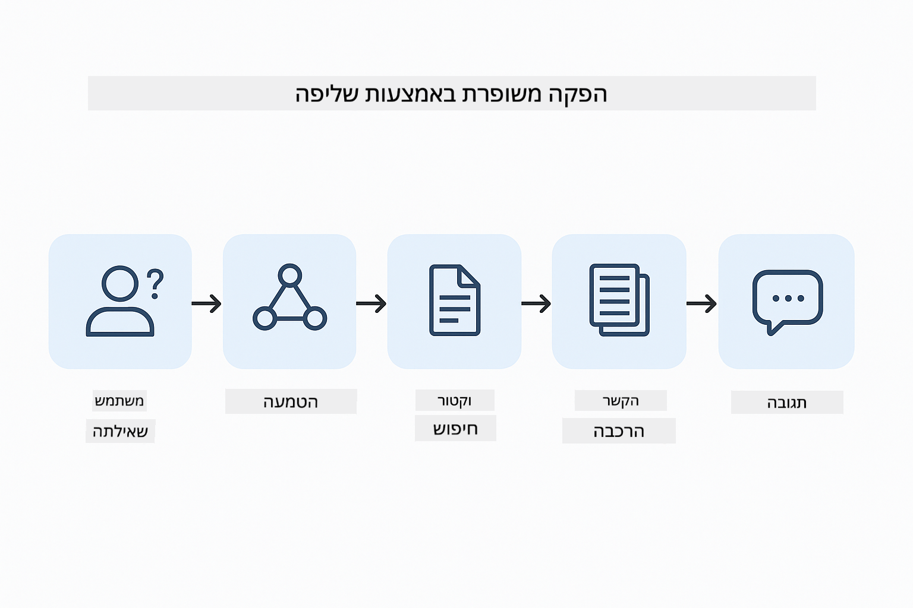
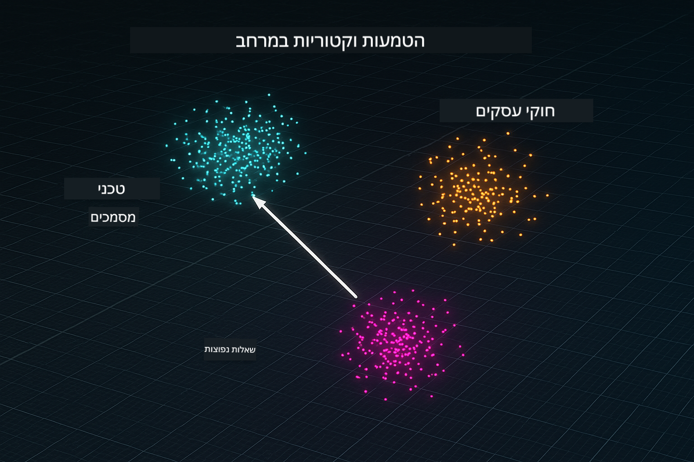
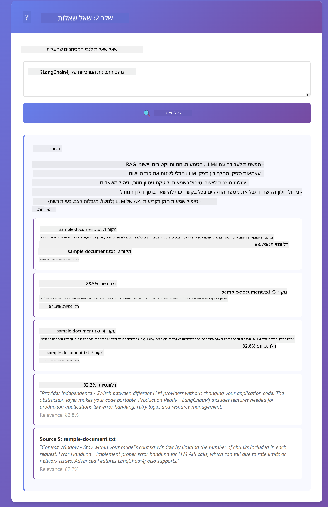

<!--
CO_OP_TRANSLATOR_METADATA:
{
  "original_hash": "f538a51cfd13147d40d84e936a0f485c",
  "translation_date": "2025-12-13T17:09:10+00:00",
  "source_file": "03-rag/README.md",
  "language_code": "he"
}
-->
# מודול 03: RAG (יצירה משופרת באמצעות אחזור)

## תוכן העניינים

- [מה תלמדו](../../../03-rag)
- [דרישות מוקדמות](../../../03-rag)
- [הבנת RAG](../../../03-rag)
- [איך זה עובד](../../../03-rag)
  - [עיבוד מסמכים](../../../03-rag)
  - [יצירת הטמעות](../../../03-rag)
  - [חיפוש סמנטי](../../../03-rag)
  - [יצירת תשובות](../../../03-rag)
- [הרצת היישום](../../../03-rag)
- [שימוש ביישום](../../../03-rag)
  - [העלאת מסמך](../../../03-rag)
  - [שאילת שאלות](../../../03-rag)
  - [בדיקת הפניות למקורות](../../../03-rag)
  - [ניסוי עם שאלות](../../../03-rag)
- [מושגים מרכזיים](../../../03-rag)
  - [אסטרטגיית חלוקה לחלקים](../../../03-rag)
  - [ציוני דמיון](../../../03-rag)
  - [אחסון בזיכרון](../../../03-rag)
  - [ניהול חלון הקשר](../../../03-rag)
- [מתי RAG חשוב](../../../03-rag)
- [השלבים הבאים](../../../03-rag)

## מה תלמדו

במודולים הקודמים למדתם כיצד לנהל שיחות עם בינה מלאכותית ולבנות את ההנחיות שלכם בצורה יעילה. אך יש מגבלה בסיסית: מודלי שפה יודעים רק את מה שלמדו במהלך האימון. הם לא יכולים לענות על שאלות לגבי מדיניות החברה שלכם, תיעוד הפרויקט שלכם, או כל מידע שלא אומנו עליו.

RAG (יצירה משופרת באמצעות אחזור) פותר את הבעיה הזו. במקום לנסות ללמד את המודל את המידע שלכם (מה שיקר ובלתי מעשי), אתם נותנים לו את היכולת לחפש בתוך המסמכים שלכם. כשמישהו שואל שאלה, המערכת מוצאת מידע רלוונטי ומכלילה אותו בהנחיה. המודל אז עונה בהתבסס על ההקשר שנשלף.

תחשבו על RAG כמתן ספריית הפניות למודל. כשאתם שואלים שאלה, המערכת:

1. **שאילתת משתמש** - אתם שואלים שאלה  
2. **הטמעה** - ממירה את השאלה לווקטור  
3. **חיפוש וקטורי** - מוצאת חלקי מסמכים דומים  
4. **הרכבת הקשר** - מוסיפה את החלקים הרלוונטיים להנחיה  
5. **תגובה** - מודל השפה הגדול מייצר תשובה בהתבסס על ההקשר  

זה מייצב את התגובות של המודל על הנתונים האמיתיים שלכם במקום להסתמך על הידע מהאימון או להמציא תשובות.



*זרימת עבודה של RAG - משאילתת משתמש לחיפוש סמנטי ליצירת תשובה בהקשר*

## דרישות מוקדמות

- השלמת מודול 01 (משאבי Azure OpenAI הותקנו)  
- קובץ `.env` בתיקיית השורש עם אישורי Azure (נוצר על ידי `azd up` במודול 01)  

> **הערה:** אם לא השלמתם את מודול 01, עקבו תחילה אחר הוראות ההתקנה שם.

## איך זה עובד

**עיבוד מסמכים** - [DocumentService.java](../../../03-rag/src/main/java/com/example/langchain4j/rag/service/DocumentService.java)

כשאתם מעלים מסמך, המערכת מחלקת אותו לחלקים - חתיכות קטנות שמתאימות בנוחות לחלון ההקשר של המודל. החלקים חופפים במעט כדי שלא תאבדו הקשר בגבולות.

```java
Document document = FileSystemDocumentLoader.loadDocument("sample-document.txt");

DocumentSplitter splitter = DocumentSplitters
    .recursive(300, 30, new OpenAiTokenizer());

List<TextSegment> segments = splitter.split(document);
```
  
> **🤖 נסו עם [GitHub Copilot](https://github.com/features/copilot) Chat:** פתחו את [`DocumentService.java`](../../../03-rag/src/main/java/com/example/langchain4j/rag/service/DocumentService.java) ושאלו:  
> - "איך LangChain4j מחלק מסמכים לחלקים ולמה החפיפה חשובה?"  
> - "מה הגודל האופטימלי של חלקים לסוגי מסמכים שונים ולמה?"  
> - "איך מטפלים במסמכים בשפות מרובות או עם עיצוב מיוחד?"

**יצירת הטמעות** - [LangChainRagConfig.java](../../../03-rag/src/main/java/com/example/langchain4j/rag/config/LangChainRagConfig.java)

כל חלק מומר לייצוג מספרי שנקרא הטמעה - למעשה טביעת אצבע מתמטית שמייצגת את משמעות הטקסט. טקסטים דומים מייצרים הטמעות דומות.

```java
@Bean
public EmbeddingModel embeddingModel() {
    return OpenAiOfficialEmbeddingModel.builder()
        .baseUrl(azureOpenAiEndpoint)
        .apiKey(azureOpenAiKey)
        .modelName(azureEmbeddingDeploymentName)
        .build();
}

EmbeddingStore<TextSegment> embeddingStore = 
    new InMemoryEmbeddingStore<>();
```
  


*מסמכים מיוצגים כוקטורים במרחב ההטמעות - תוכן דומה מתרכז יחד*

**חיפוש סמנטי** - [RagService.java](../../../03-rag/src/main/java/com/example/langchain4j/rag/service/RagService.java)

כשאתם שואלים שאלה, גם השאלה שלכם הופכת להטמעה. המערכת משווה את הטמעת השאלה לכל הטמעות חלקי המסמכים. היא מוצאת את החלקים עם המשמעויות הדומות ביותר - לא רק מילות מפתח תואמות, אלא דמיון סמנטי אמיתי.

```java
Embedding queryEmbedding = embeddingModel.embed(question).content();

List<EmbeddingMatch<TextSegment>> matches = 
    embeddingStore.findRelevant(queryEmbedding, 5, 0.7);

for (EmbeddingMatch<TextSegment> match : matches) {
    String relevantText = match.embedded().text();
    double score = match.score();
}
```
  
> **🤖 נסו עם [GitHub Copilot](https://github.com/features/copilot) Chat:** פתחו את [`RagService.java`](../../../03-rag/src/main/java/com/example/langchain4j/rag/service/RagService.java) ושאלו:  
> - "איך עובד חיפוש דמיון עם הטמעות ומה קובע את הציון?"  
> - "איזה סף דמיון כדאי להשתמש ואיך זה משפיע על התוצאות?"  
> - "איך מטפלים במקרים שבהם לא נמצאו מסמכים רלוונטיים?"

**יצירת תשובות** - [RagService.java](../../../03-rag/src/main/java/com/example/langchain4j/rag/service/RagService.java)

החלקים הרלוונטיים ביותר נכללים בהנחיה למודל. המודל קורא את החלקים הספציפיים ועונה על השאלה בהתבסס על המידע הזה. זה מונע הזיות - המודל יכול לענות רק ממה שמוצג לפניו.

## הרצת היישום

**אימות פריסה:**

ודאו שקובץ `.env` קיים בתיקיית השורש עם אישורי Azure (נוצר במהלך מודול 01):  
```bash
cat ../.env  # צריך להציג את AZURE_OPENAI_ENDPOINT, API_KEY, DEPLOYMENT
```
  
**הפעלת היישום:**

> **הערה:** אם כבר הפעלתם את כל היישומים באמצעות `./start-all.sh` ממודול 01, מודול זה כבר רץ על פורט 8081. תוכלו לדלג על פקודות ההפעלה למטה ולעבור ישירות לכתובת http://localhost:8081.

**אפשרות 1: שימוש ב-Spring Boot Dashboard (מומלץ למשתמשי VS Code)**

מיכל הפיתוח כולל את תוסף Spring Boot Dashboard, שמספק ממשק חזותי לניהול כל יישומי Spring Boot. תוכלו למצוא אותו בסרגל הפעילות בצד שמאל של VS Code (חפשו את סמל Spring Boot).

מ-Spring Boot Dashboard תוכלו:  
- לראות את כל יישומי Spring Boot הזמינים בסביבת העבודה  
- להפעיל/להפסיק יישומים בלחיצה אחת  
- לצפות בלוגים של היישום בזמן אמת  
- לנטר את מצב היישום  

פשוט לחצו על כפתור ההפעלה ליד "rag" כדי להפעיל את המודול הזה, או להפעיל את כל המודולים בבת אחת.


**אפשרות 2: שימוש בסקריפטים של shell**

הפעלת כל יישומי האינטרנט (מודולים 01-04):

**Bash:**  
```bash
cd ..  # מתיקיית השורש
./start-all.sh
```
  
**PowerShell:**  
```powershell
cd ..  # מתיקיית השורש
.\start-all.ps1
```
  
או להפעיל רק את המודול הזה:

**Bash:**  
```bash
cd 03-rag
./start.sh
```
  
**PowerShell:**  
```powershell
cd 03-rag
.\start.ps1
```
  
שני הסקריפטים טוענים אוטומטית משתני סביבה מקובץ `.env` בשורש ויבנו את קבצי ה-JAR אם אינם קיימים.

> **הערה:** אם אתם מעדיפים לבנות את כל המודולים ידנית לפני ההפעלה:  
>  
> **Bash:**  
> ```bash
> cd ..  # Go to root directory
> mvn clean package -DskipTests
> ```
  
> **PowerShell:**  
> ```powershell
> cd ..  # Go to root directory
> mvn clean package -DskipTests
> ```
  
פתחו את http://localhost:8081 בדפדפן שלכם.

**להפסקה:**

**Bash:**  
```bash
./stop.sh  # רק מודול זה
# או
cd .. && ./stop-all.sh  # כל המודולים
```
  
**PowerShell:**  
```powershell
.\stop.ps1  # רק מודול זה
# או
cd ..; .\stop-all.ps1  # כל המודולים
```
  
## שימוש ביישום

היישום מספק ממשק אינטרנטי להעלאת מסמכים ושאילת שאלות.

<a href="images/rag-homepage.png"></a>

*ממשק יישום RAG - העלאת מסמכים ושאילת שאלות*

**העלאת מסמך**

התחילו בהעלאת מסמך - קבצי TXT מתאימים במיוחד לבדיקות. קובץ `sample-document.txt` מסופק בתיקייה זו וכולל מידע על תכונות LangChain4j, יישום RAG, ושיטות עבודה מומלצות - מושלם לבדיקה.

המערכת מעבדת את המסמך שלכם, מחלקת אותו לחלקים, ויוצרת הטמעות לכל חלק. זה קורה אוטומטית עם ההעלאה.

**שאילת שאלות**

כעת שאלו שאלות ספציפיות לגבי תוכן המסמך. נסו משהו עובדתי שמוצהר בבירור במסמך. המערכת מחפשת חלקים רלוונטיים, כוללת אותם בהנחיה, ומייצרת תשובה.

**בדיקת הפניות למקורות**

שימו לב שכל תשובה כוללת הפניות למקורות עם ציוני דמיון. ציונים אלה (מ-0 עד 1) מראים עד כמה כל חלק היה רלוונטי לשאלתכם. ציונים גבוהים משמעותם התאמות טובות יותר. זה מאפשר לכם לאמת את התשובה מול חומר המקור.

<a href="images/rag-query-results.png"></a>

*תוצאות שאילתא המציגות תשובה עם הפניות למקורות וציוני רלוונטיות*

**ניסוי עם שאלות**

נסו סוגים שונים של שאלות:  
- עובדות ספציפיות: "מה הנושא המרכזי?"  
- השוואות: "מה ההבדל בין X ל-Y?"  
- סיכומים: "סכם את הנקודות המרכזיות לגבי Z"  

צפו כיצד ציוני הרלוונטיות משתנים בהתאם למידת ההתאמה של השאלה לתוכן המסמך.

## מושגים מרכזיים

**אסטרטגיית חלוקה לחלקים**

המסמכים מחולקים לחלקים של 300 טוקנים עם חפיפה של 30 טוקנים. האיזון הזה מבטיח שלכל חלק יש מספיק הקשר כדי להיות משמעותי תוך שמירה על גודל קטן מספיק לכלול מספר חלקים בהנחיה.

**ציוני דמיון**

הציונים נעים בין 0 ל-1:  
- 0.7-1.0: רלוונטי מאוד, התאמה מדויקת  
- 0.5-0.7: רלוונטי, הקשר טוב  
- מתחת ל-0.5: מסונן החוצה, שונה מדי  

המערכת שולפת רק חלקים מעל סף מינימלי כדי להבטיח איכות.

**אחסון בזיכרון**

מודול זה משתמש באחסון בזיכרון לפשטות. כשאתם מפעילים מחדש את היישום, המסמכים שהועלו אובדים. מערכות ייצור משתמשות בבסיסי נתונים וקטוריים מתמשכים כמו Qdrant או Azure AI Search.

**ניהול חלון הקשר**

לכל מודל יש חלון הקשר מקסימלי. אי אפשר לכלול כל חלק ממסמך גדול. המערכת שולפת את N החלקים הרלוונטיים ביותר (ברירת מחדל 5) כדי להישאר בגבולות תוך מתן הקשר מספיק לתשובות מדויקות.

## מתי RAG חשוב

**השתמשו ב-RAG כאשר:**  
- עונים על שאלות לגבי מסמכים קנייניים  
- מידע משתנה לעיתים קרובות (מדיניות, מחירים, מפרטים)  
- דיוק דורש ייחוס למקור  
- התוכן גדול מדי להכנסה בהנחיה אחת  
- אתם צריכים תגובות שניתן לאמת ולהסמיך

**אל תשתמשו ב-RAG כאשר:**  
- השאלות דורשות ידע כללי שהמודל כבר מחזיק  
- נדרשים נתונים בזמן אמת (RAG עובד על מסמכים שהועלו)  
- התוכן קטן מספיק לכלול ישירות בהנחיות

## השלבים הבאים

**המודול הבא:** [04-tools - סוכני AI עם כלים](../04-tools/README.md)

---

**ניווט:** [← קודם: מודול 02 - הנדסת הנחיות](../02-prompt-engineering/README.md) | [חזרה לעמוד הראשי](../README.md) | [הבא: מודול 04 - כלים →](../04-tools/README.md)

---

<!-- CO-OP TRANSLATOR DISCLAIMER START -->
**כתב ויתור**:  
מסמך זה תורגם באמצעות שירות תרגום מבוסס בינה מלאכותית [Co-op Translator](https://github.com/Azure/co-op-translator). למרות שאנו שואפים לדיוק, יש לקחת בחשבון כי תרגומים אוטומטיים עלולים להכיל שגיאות או אי-דיוקים. המסמך המקורי בשפת המקור שלו הוא המקור הסמכותי. למידע קריטי מומלץ להשתמש בתרגום מקצועי על ידי אדם. אנו לא נושאים באחריות לכל אי-הבנה או פרשנות שגויה הנובעת משימוש בתרגום זה.
<!-- CO-OP TRANSLATOR DISCLAIMER END -->