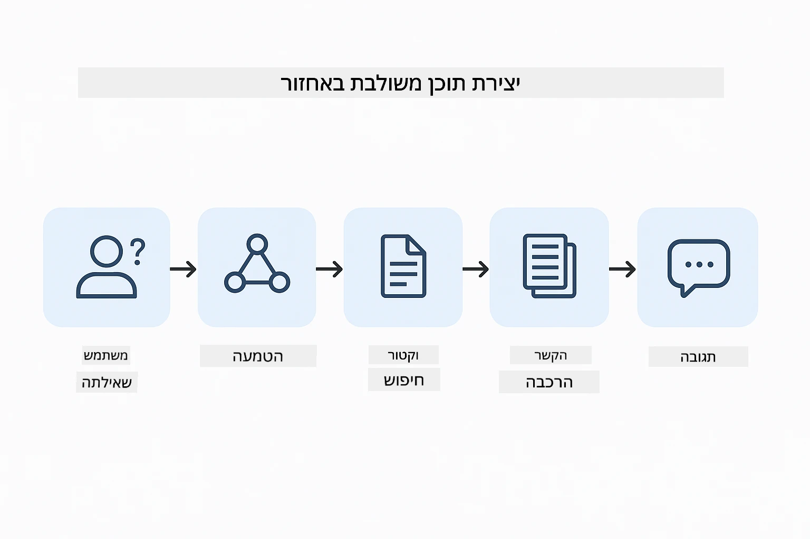
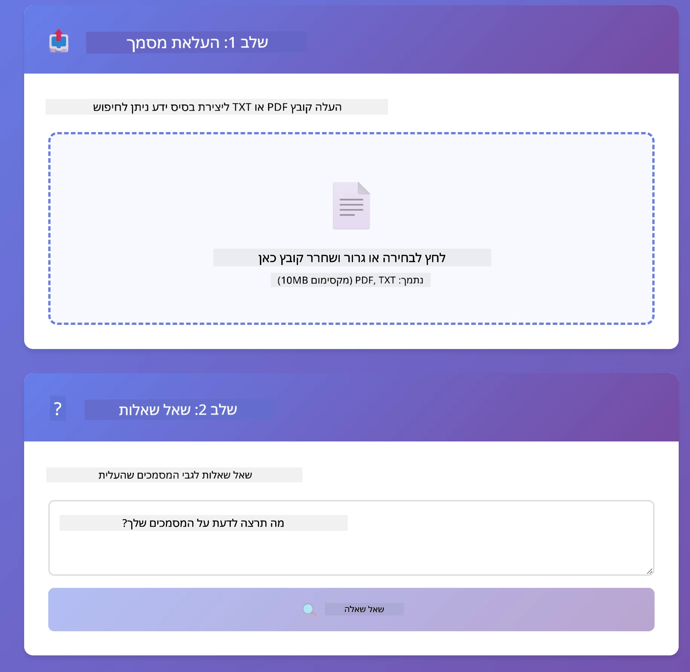
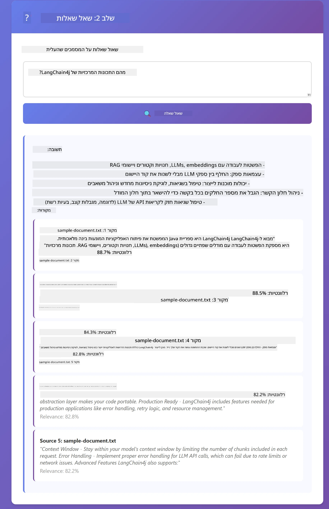

# מודול 03: RAG (יצירת תוכן מוגברת שליפה)

## תוכן העניינים

- [מה תלמדו](../../../03-rag)
- [דרישות מוקדמות](../../../03-rag)
- [הבנת RAG](../../../03-rag)
- [איך זה עובד](../../../03-rag)
  - [עיבוד מסמכים](../../../03-rag)
  - [יצירת הטמעות](../../../03-rag)
  - [חיפוש סמנטי](../../../03-rag)
  - [יצירת תשובות](../../../03-rag)
- [הרצת היישום](../../../03-rag)
- [שימוש ביישום](../../../03-rag)
  - [העלאת מסמך](../../../03-rag)
  - [שאילת שאלות](../../../03-rag)
  - [בדיקת הפניות למקור](../../../03-rag)
  - [התנסות בשאלות](../../../03-rag)
- [מושגים מרכזיים](../../../03-rag)
  - [אסטרטגיית חלוקה לחלקים](../../../03-rag)
  - [ציוני דמיון](../../../03-rag)
  - [אחסון בזיכרון](../../../03-rag)
  - [ניהול חלון הקשר](../../../03-rag)
- [מתי RAG חשוב](../../../03-rag)
- [השלבים הבאים](../../../03-rag)

## מה תלמדו

במודולים הקודמים למדתם איך לנהל שיחות עם AI ולבנות בצורה יעילה את הפקודות שלכם. אבל יש מגבלה בסיסית: מודלים לשוניים יודעים רק את מה שלמדו במהלך האימון. הם לא יכולים לענות על שאלות בנוגע למדיניות החברה שלכם, לתיעוד הפרויקט או לכל מידע שלא עבר אימון עליהם.

RAG (יצירת תוכן מוגברת שליפה) פותר את הבעיה הזאת. במקום לנסות ללמד את המודל את המידע שלכם (שזה יקר ולא פרקטי), אתם נותנים לו את היכולת לחפש בתוך המסמכים שלכם. כשמישהו שואל שאלה, המערכת מוצאת מידע רלוונטי ומכלילה אותו בהנחיה. המודל אז עונה על סמך ההקשר שהתקבל.

תחשבו על RAG כמתן ספריית הפניות למודל. כשאתם שואלים שאלה, המערכת:

1. **שאילתת משתמש** - אתם שואלים שאלה  
2. **הטמעה** - המרה של השאלה לוקטור  
3. **חיפוש וקטורי** - מציאת חלקי מסמכים דומים  
4. **הרכבת הקשר** - הוספת החלקים הרלוונטיים להנחיה  
5. **תגובה** - LLM מייצר תשובה על בסיס ההקשר

זה מייצב את תגובות המודל במידע האמיתי שלכם במקום להסתמך על הידע מהאימון או להמציא תשובות.



*זרימת העבודה של RAG - משאילתת משתמש לחיפוש סמנטי ליצירת תשובה משתכללת*

## דרישות מוקדמות

- השלמת מודול 01 (משאבי Azure OpenAI הוגשו)
- קובץ `.env` בתיקיית השורש עם האישורים מ-Azure (נוצר על ידי `azd up` במודול 01)

> **הערה:** אם לא השלמתם את מודול 01, עקבו תחילה אחרי הוראות הפריסה שם.

## איך זה עובד

### עיבוד מסמכים

[DocumentService.java](../../../03-rag/src/main/java/com/example/langchain4j/rag/service/DocumentService.java)

כשאתם מעלים מסמך, המערכת מחלקת אותו לחלקים - חתיכות קטנות שמתאימות למשקל ההקשר של המודל. החלקים חופפים במידה מועטה כדי לא לאבד הקשר בגבולות.

```java
Document document = FileSystemDocumentLoader.loadDocument("sample-document.txt");

DocumentSplitter splitter = DocumentSplitters
    .recursive(300, 30, new OpenAiTokenizer());

List<TextSegment> segments = splitter.split(document);
```

> **🤖 נסה עם [GitHub Copilot](https://github.com/features/copilot) Chat:** פתח את [`DocumentService.java`](../../../03-rag/src/main/java/com/example/langchain4j/rag/service/DocumentService.java) ושאל:  
> - "איך LangChain4j מחלק מסמכים לחלקים ולמה חפיפה חשובה?"  
> - "מה גודל החתיכה האופטימלי לסוגי מסמכים שונים ולמה?"  
> - "איך מטפלים במסמכים בשפות שונות או עם עיצוב מיוחד?"

### יצירת הטמעות

[LangChainRagConfig.java](../../../03-rag/src/main/java/com/example/langchain4j/rag/config/LangChainRagConfig.java)

כל חתיכה מומרת לייצוג מספרי שנקרא הטמעה - בעצם טביעת אצבע מתמטית שמייצגת את משמעות הטקסט. טקסטים דומים מייצרים הטמעות דומות.

```java
@Bean
public EmbeddingModel embeddingModel() {
    return OpenAiOfficialEmbeddingModel.builder()
        .baseUrl(azureOpenAiEndpoint)
        .apiKey(azureOpenAiKey)
        .modelName(azureEmbeddingDeploymentName)
        .build();
}

EmbeddingStore<TextSegment> embeddingStore = 
    new InMemoryEmbeddingStore<>();
```


*מסמכים מיוצגים כוקטורים במרחב ההטמעות - תכנים דומים מתמקדים יחד*

### חיפוש סמנטי

[RagService.java](../../../03-rag/src/main/java/com/example/langchain4j/rag/service/RagService.java)

כשתשאל שאלה, גם היא מומרת להטמעה. המערכת משווה את ההטמעה של שאלתך אל ההטמעות של כל חלקי המסמכים. היא מוצאת את החלקים עם המשמעות הדומה ביותר - לא רק מילים תואמות אלא דמיון סמנטי ממשי.

```java
Embedding queryEmbedding = embeddingModel.embed(question).content();

List<EmbeddingMatch<TextSegment>> matches = 
    embeddingStore.findRelevant(queryEmbedding, 5, 0.7);

for (EmbeddingMatch<TextSegment> match : matches) {
    String relevantText = match.embedded().text();
    double score = match.score();
}
```

> **🤖 נסה עם [GitHub Copilot](https://github.com/features/copilot) Chat:** פתח את [`RagService.java`](../../../03-rag/src/main/java/com/example/langchain4j/rag/service/RagService.java) ושאל:  
> - "איך עובד חיפוש דמיון עם הטמעות ומה קובע את הציון?"  
> - "איזה סף דמיון כדאי להשתמש וכיצד זה משפיע על התוצאות?"  
> - "איך מטפלים במקרים שבהם לא נמצאים מסמכים רלוונטיים?"

### יצירת תשובות

[RagService.java](../../../03-rag/src/main/java/com/example/langchain4j/rag/service/RagService.java)

החלקים הרלוונטיים ביותר משולבים בהנחיה למודל. המודל קורא את החלקים הספציפיים ועונה על שאלתך על בסיס המידע שיש בהם. זה מונע הזיות - המודל יכול לענות רק ממה שהוא רואה.

## הרצת היישום

**אימות הפריסה:**

ודאו שקובץ `.env` קיים בתיקיית השורש עם האישורים של Azure (נוצר במהלך מודול 01):  
```bash
cat ../.env  # צריך להציג את AZURE_OPENAI_ENDPOINT, API_KEY, DEPLOYMENT
```
  
**הפעלת היישום:**

> **הערה:** אם התחלתם את כל היישומים כבר באמצעות `./start-all.sh` במודול 01, מודול זה כבר פועל בפורט 8081. אפשר לדלג על פקודות ההפעלה למטה ולעבור ישירות ל-http://localhost:8081.

**אפשרות 1: שימוש ב-Spring Boot Dashboard (מומלץ למשתמשי VS Code)**

מיכל הפיתוח כולל את תוסף Spring Boot Dashboard, המספק ממשק ויזואלי לניהול כל יישומי Spring Boot. תוכלו למצוא אותו בסרגל הפעילויות בצד שמאל ב-VS Code (חפשו את סמל Spring Boot).

מ-Spring Boot Dashboard אפשר:  
- לראות את כל יישומי Spring Boot הזמינים בסביבת העבודה  
- להפעיל/להפסיק יישומים בלחיצה אחת  
- לצפות בלוגים של היישומים בזמן אמת  
- לפקח על מצב היישום  

פשוט לחצו על כפתור ההפעלה ליד "rag" כדי להפעיל את המודול הזה, או להפעיל את כל המודולים בבת אחת.


**אפשרות 2: שימוש בסקריפטים של shell**

הפעלת כל יישומי הרשת (מודולים 01-04):

**בָּאש:**
```bash
cd ..  # מתוך ספריית השורש
./start-all.sh
```
  
**PowerShell:**
```powershell
cd ..  # מתיקיית השורש
.\start-all.ps1
```
  
או להפעיל רק את המודול הזה:

**בָּאש:**
```bash
cd 03-rag
./start.sh
```
  
**PowerShell:**
```powershell
cd 03-rag
.\start.ps1
```
  
שני הסקריפטים טוענים אוטומטית משתני סביבה מקובץ `.env` בשורש ויבנו את קובצי ה-JAR אם הם לא קיימים.

> **הערה:** אם מעדיפים לבנות את כל המודולים ידנית לפני ההפעלה:  
>  
> **בָּאש:**
> ```bash
> cd ..  # Go to root directory
> mvn clean package -DskipTests
> ```
  
> **PowerShell:**
> ```powershell
> cd ..  # Go to root directory
> mvn clean package -DskipTests
> ```
  
פתחו את http://localhost:8081 בדפדפן שלכם.

**להפסיק:**

**בָּאש:**
```bash
./stop.sh  # רק במודול זה
# או
cd .. && ./stop-all.sh  # כל המודולים
```
  
**PowerShell:**
```powershell
.\stop.ps1  # רק במודול זה
# או
cd ..; .\stop-all.ps1  # כל המודולים
```
  
## שימוש ביישום

היישום מספק ממשק ווב להעלאת מסמכים ולשאילת שאלות.

<a href="images/rag-homepage.png"></a>

*ממשק יישום RAG - העלאת מסמכים ושאילת שאלות*

### העלאת מסמך

התחילו מהעלאת מסמך - קבצי TXT הכי מתאימים לניסוי. קיימת דוגמת קובץ `sample-document.txt` בספריה זו המכיל מידע על תכונות LangChain4j, יישום RAG ופרקטיקות מומלצות - מושלם לבדיקה.

המערכת מעבדת את המסמך, מחלקת אותו לחלקים ויוצרת הטמעות לכל חלק. זה קורה אוטומטית עם ההעלאה.

### שאילת שאלות

כעת שאלו שאלות ספציפיות על תוכן המסמך. נסו משהו עובדתי שמוצהר בבירור במסמך. המערכת מחפשת את החלקים הרלוונטיים, כוללת אותם בהנחיה ומייצרת תשובה.

### בדיקת הפניות למקור

שימו לב שכל תשובה כוללת הפניות למקורות עם ציוני דמיון. ציונים אלו (מ-0 עד 1) מראים עד כמה כל חלק רלוונטי לשאלתכם. ציונים גבוהים מעידים על התאמות טובות יותר. זה מאפשר לאמת את התשובה מול חומר המקור.

<a href="images/rag-query-results.png"></a>

*תוצאות השאילתא המציגות תשובה עם הפניות מקור וציוני רלוונטיות*

### התנסות בשאלות

נסו סוגים שונים של שאלות:  
- עובדות ספציפיות: "מה הנושא המרכזי?"  
- השוואות: "מה ההבדל בין X ל-Y?"  
- סיכומים: "סכם את הנקודות המרכזיות לגבי Z"

צפו איך ציוני הרלוונטיות משתנים בהתאם למידת ההתאמה של שאלתכם לתוכן המסמך.

## מושגים מרכזיים

### אסטרטגיית חלוקה לחלקים

המסמכים מחולקים לחלקים של 300 טוקנים עם חפיפה של 30 טוקנים. האיזון הזה מבטיח שלכל חלק יש מספיק הקשר להיות משמעותי וגם מסוגל להיכנס במקטע יחד עם חלקים נוספים בהנחיה.

### ציוני דמיון

הציונים נעים בין 0 ל-1:  
- 0.7-1.0: מאוד רלוונטי, התאמה מדויקת  
- 0.5-0.7: רלוונטי, הקשר טוב  
- מתחת ל-0.5: מסונן החוצה, לא דומה מספיק

המערכת מושכת רק חלקים שעומדים מעל סף מינימלי כדי להבטיח איכות.

### אחסון בזיכרון

מודול זה משתמש באחסון בזיכרון לצורך פשטות. כשאתם מפעילים מחדש את היישום, המסמכים שהועלו יאבדו. מערכות פרודקשן משתמשות בבסיסי נתונים וקטוריים מתמידים כמו Qdrant או Azure AI Search.

### ניהול חלון הקשר

לכל מודל יש חלון הקשר מקסימלי. לא ניתן לכלול כל חלק מכל מסמך גדול. המערכת מושכת את N החלקים הרלוונטיים ביותר (ברירת מחדל 5) כדי להישאר בגבולות ולהעניק הקשר מספיק לתשובות מדויקות.

## מתי RAG חשוב

**השתמשו ב-RAG כש:**  
- עונים על שאלות לגבי מסמכים פרטיים  
- מידע משתנה תכופות (מדיניות, מחירים, מפרטים)  
- דיוק דורש הפניות למקור  
- התוכן גדול מדי להכנסה במקטע הנחיה אחד  
- אתם זקוקים לתגובות מבוססות ואמינות  

**אל תשתמשו ב-RAG כש:**  
- השאלות דורשות ידע כללי שהמודל כבר מחזיק  
- נדרש מידע בזמן אמת (RAG עובד על מסמכים שהועלו)  
- התוכן קטן מספיק להכללה ישירה בהנחיות  

## השלבים הבאים

**מודול הבא:** [04-tools - סוכני AI עם כלים](../04-tools/README.md)

---

**ניווט:** [← קודם: מודול 02 - הנדסת הנחיות](../02-prompt-engineering/README.md) | [חזרה למרכז](../README.md) | [הבא: מודול 04 - כלים →](../04-tools/README.md)

---

<!-- CO-OP TRANSLATOR DISCLAIMER START -->
**כתב ויתור**:  
מסמך זה תורגם באמצעות שירות תרגום מבוסס בינה מלאכותית [Co-op Translator](https://github.com/Azure/co-op-translator). למרות שאנו שואפים לדיוק, יש לקחת בחשבון כי תרגומים אוטומטיים עלולים להכיל שגיאות או אי דיוקים. יש להתייחס למסמך המקורי בשפתו המקורית כמקור הסמכותי. עבור מידע קריטי, מומלץ להשתמש בתרגום מקצועי אנושי. אנו לא אחראים על כל אי הבנה או פרשנות שגוייה הנובעות מהשימוש בתרגום זה.
<!-- CO-OP TRANSLATOR DISCLAIMER END -->