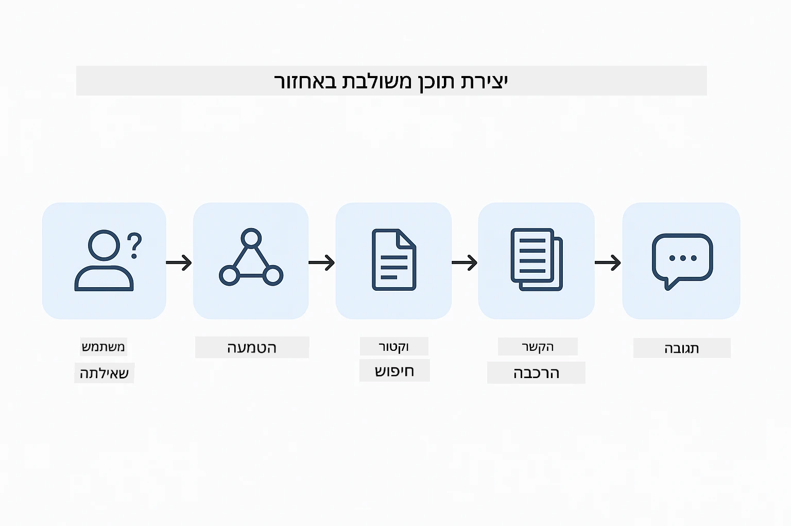
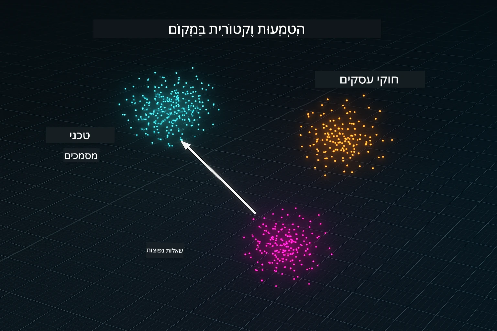
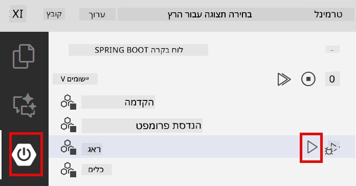
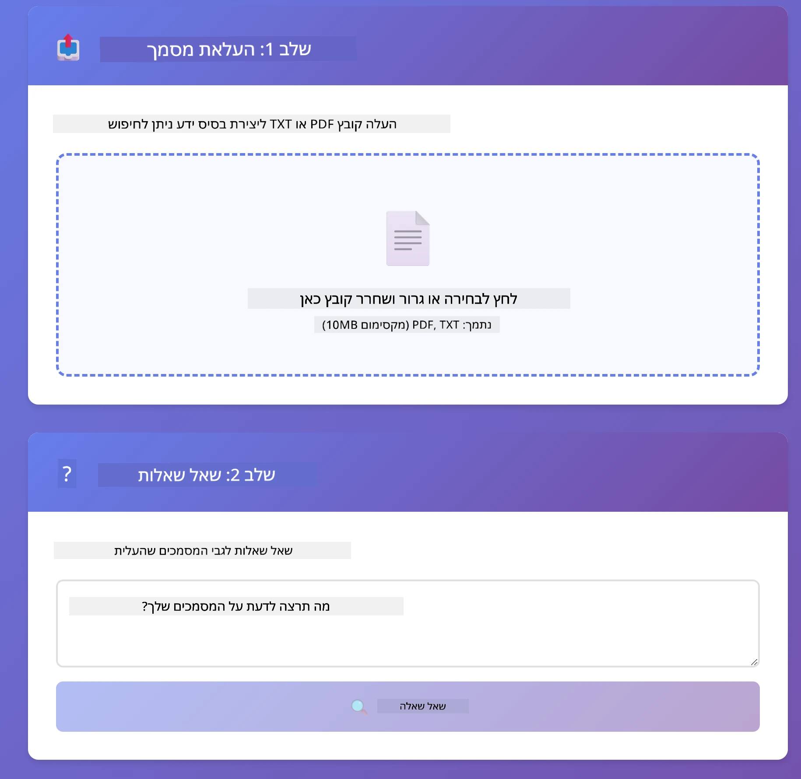
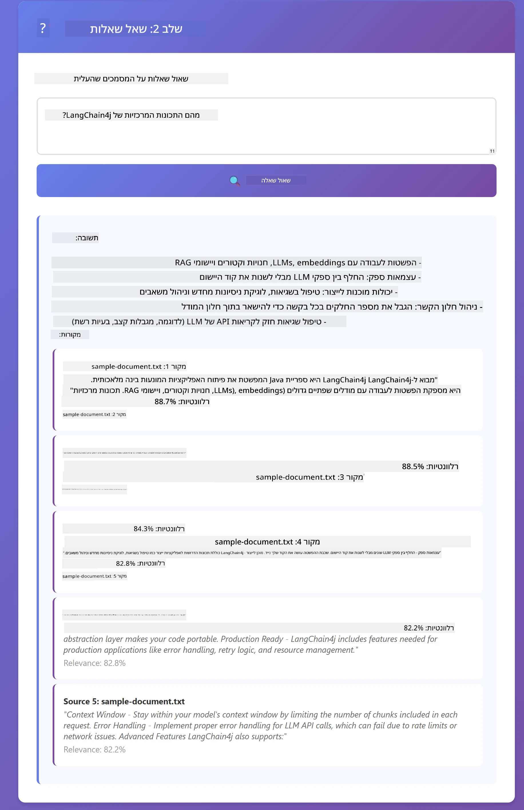

# מודול 03: RAG (יצירה מוגברת באמצעות חיפוש)

## תוכן העניינים

- [סרטון הדרכה](#סרטון-הדרכה)
- [מה תלמדו](#מה-תלמדו)
- [דרישות מקדימות](#דרישות-מקדימות)
- [הבנת RAG](#הבנת-rag)
  - [איזו גישת RAG מכסה המדריך הזה?](#איזו-גישת-rag-מכסה-המדריך-הזה)
- [איך זה עובד](#איך-זה-עובד)
  - [עיבוד מסמכים](#עיבוד-מסמכים)
  - [יצירת השתקפויות](#יצירת-השתקפויות)
  - [חיפוש סמנטי](#חיפוש-סמנטי)
  - [הפקת תשובות](#יצירת-תשובות)
- [הפעלת האפליקציה](#הפעלת-היישום)
- [שימוש באפליקציה](#שימוש-ביישום)
  - [העלאת מסמך](#העלאת-מסמך)
  - [שאילת שאלות](#שאל-שאלות)
  - [בדיקת מקורות](#בדוק-הפניות-למקורות)
  - [ניסויים עם שאלות](#נסה-שאלות-שונות)
- [מושגים מרכזיים](#מושגים-מרכזיים)
  - [אסטרטגיית חלוקה לנתחים](#אסטרטגיית-חיתוך-לחתיכות)
  - [דירוגי דמיון](#ציוני-דמיון)
  - [אחסון בזיכרון](#אחסון-בזיכרון)
  - [ניהול חלון הקשר](#ניהול-חלון-הקשר)
- [מתי RAG חשוב](#מתי-rag-חשוב)
- [שלבים הבאים](#השלבים-הבאים)

## סרטון הדרכה

צפו במפגש חי זה שמסביר איך להתחיל עם מודול זה:

<a href="https://www.youtube.com/watch?v=_olq75ZH_eY"></a>

## מה תלמדו

במודולים הקודמים, למדתם איך לנהל שיחות עם AI ולבנות פרומפטים בצורה יעילה. אך יש מגבלה יסודית: מודלים של שפה יודעים רק את מה שלמדו במהלך האימון. הם לא יכולים לענות על שאלות לגבי מדיניות החברה שלכם, תיעוד הפרויקט, או כל מידע שלא אומן עליהם.

RAG (יצירה מוגברת באמצעות חיפוש) פותר את הבעיה הזו. במקום לנסות ללמד את המודל את המידע שלכם (מה שעלול להיות יקר ובלתי מעשי), אתם נותנים לו את היכולת לחפש בתוך המסמכים שלכם. כשמישהו שואל שאלה, המערכת מוצאת מידע רלוונטי ומכנסת אותו בפרומפט. המודל עונה על סמך הקשר זה.

תחשבו על RAG כעל מתן ספריית התייחסות למודל. כשאתם שואלים שאלה, המערכת:

1. **שאלת משתמש** - אתם שואלים שאלה  
2. **השתקפות** - המרה של שאלתכם לווקטור  
3. **חיפוש בווקטורים** - מציאת נתחי מסמכים דומים  
4. **הרכבת הקשר** - הוספת נתחי מידע רלוונטיים לפרומפט  
5. **תגובה** - מודל השפה הגדול מייצר תשובה על בסיס ההקשר

זה מבסס את התגובות של המודל על הנתונים האמיתיים שלכם במקום להסתמך על הידע מהאימון או על יצירת תשובות בדויות.

## דרישות מקדימות

- השלמת [מודול 01 - מבוא](../01-introduction/README.md) (פריסת משאבי Azure OpenAI, כולל מודל ההשתקפות `text-embedding-3-small`)  
- קובץ `.env` בספריית השורש עם אישורי Azure (נוצר על ידי `azd up` במודול 01)  

> **הערה:** אם לא השלמתם את מודול 01, עקבו קודם אחרי הוראות הפריסה שם. הפקודה `azd up` מפעילה את מודל הצ'אט GPT ואת מודל ההשתקפות המשמש במודול זה.

## הבנת RAG

הדיאגרמה למטה ממחישה את הרעיון הראשי: במקום להסתמך רק על נתוני האימון של המודל, RAG נותן לו ספריית התייחסות של המסמכים שלכם להתייעצות לפני הפקת כל תשובה.


*דיאגרמה זו מציגה את ההבדל בין מודל שפה רגיל (המנחש על סמך נתוני האימון) לבין מודל שפה מוגבר ב-RAG (המשתמש קודם במסמכי החברה).*

כך כל החלקים מתחברים מקצה אל קצה. שאלה של משתמש עוברת ארבעה שלבים — השתקפות, חיפוש וקטורי, הרכבת הקשר, והפקת תשובה — שכל אחד בנוי על הקודם:



*דיאגרמה זו מציגה את תהליך ה-RAG מקצה אל קצה — שאילתא עוברת דרך השתקפות, חיפוש וקטורי, הרכבת הקשר, והפקת תשובה.*

שאר המודול מסביר כל שלב בפירוט, עם קוד שניתן להריץ ולשנות.

### איזו גישת RAG מכסה המדריך הזה?

LangChain4j מציע שלוש דרכים ליישום RAG, כל אחת ברמת הפשטה שונה. הדיאגרמה למטה משווה ביניהן זו לצד זו:


*דיאגרמה זו משווה את שלוש הגישות ל-RAG ב-LangChain4j — Easy, Native, ו-Advanced — ומציגה את הרכיבים המרכזיים ומתי להשתמש בכל אחת.*

| גישה | מה היא עושה | פשרה |
|---|---|---|
| **Easy RAG** | מחברת אוטומטית הכל דרך `AiServices` ו-`ContentRetriever`. אתם מגדירים ממשק, מחברים מחפש, ו-LangChain4j מטפל בהשתקפות, חיפוש והרכבת הפרומפט מאחורי הקלעים. | מינימום קוד, אך אינכם רואים מה קורה בכל שלב. |
| **Native RAG** | אתם קוראים למודל ההשתקפות, מחפשים במאגר, בונים את הפרומפט ומפיקים את התשובה בעצמכם — שלב אחר שלב במפורש. | יותר קוד, אך כל שלב גלוי וניתן לשינוי. |
| **Advanced RAG** | משתמש במסגרת `RetrievalAugmentor` עם ממירי שאלות, מפנים, מסדרים מחדש ומזריקים תוכן הניתנים להתאמה לצנרת ייצור. | גמישות מקסימלית, אך עם מורכבות גבוהה יותר. |

**המדריך הזה משתמש בגישת Native.** כל שלב בצנרת RAG — השתקפות השאלה, חיפוש במאגר הווקטורים, הרכבת ההקשר, והפקת התשובה — כתוב בפירוש ב־[`RagService.java`](../../../03-rag/src/main/java/com/example/langchain4j/rag/service/RagService.java). זה מכוון: כמקור ללמידה, חשוב לראות ולהבין כל שלב לעומת קוד מקוצר. כשתרגישו נוח עם רצף השלבים, תוכלו לעבור ל-Easy RAG לפרוטוטייפים מהירים או ל-Advanced RAG למערכות ייצור.

> **💡 סקרנים לגבי Easy RAG?** LangChain4j גם מציע גישת *Easy RAG* בה "AiServices" ו-"ContentRetriever" מטפלות בהשתקפות, חיפוש והרכבת הפרומפט אוטומטית. מודול זה לוקח את הדרך הברורה — פותח את הצנרת הזו לידיכם כדי שתוכלו לראות ולשלוט בכל שלב בעצמכם.

הדיאגרמה למטה מראה את צנרת Easy RAG. שימו לב איך `AiServices` ו-`EmbeddingStoreContentRetriever` מסתירים את כל המורכבות — אתם טוענים מסמך, מחברים מחפש, ומקבלים תשובות. הגישה Native במודול זה מפורקת לשלבים גלויים:


*דיאגרמה זו מציגה את צנרת Easy RAG. השוו זאת לגישת Native שבמודול זה: Easy RAG מסתיר את ההשתקפות, החיפוש והרכבת הפרומפט מאחורי `AiServices` ו-`ContentRetriever` — אתם טוענים מסמך, מחברים מחפש, ומקבלים תשובות. בגישת Native פורקים את הצנרת הזו כך שקוראים כל שלב בעצמכם (השתקפות, חיפוש, הרכבת הקשר, הפקת תשובה), מה שמאפשר שליטה וצפייה מלאה.*

## איך זה עובד

צנרת ה-RAG במודול זה מתחלקת לארבעה שלבים שמתרחשים ברצף בכל פעם שמשתמש שואל שאלה. קודם, המסמך שהועלה נערך ומחולק ל**נתחים** קטנים ונוחים לעיבוד. נתחי המסמך מומרות ל**השתקפויות וקטוריות** ונאחסנות להשוואה מתמטית. כאשר מתקבלת שאילתא, המערכת מבצעת **חיפוש סמנטי** למציאת הנתחי המסמך הרלוונטיים, ולבסוף מעבירה אותם כהקשר למודל השפה להפקת **התשובה**. הסעיפים הבאים מפרטים כל שלב עם הקוד והדיאגרמות המתאימות. נתחיל עם השלב הראשון.

### עיבוד מסמכים

[DocumentService.java](../../../03-rag/src/main/java/com/example/langchain4j/rag/service/DocumentService.java)

כשאתם מעלים מסמך, המערכת מנתחת אותו (PDF או טקסט פשוט), מצרפת מטא-נתונים כמו שם הקובץ, ואז מחלקת אותו לנתחים — חתיכות קטנות שמתאימות בנוחות לחלון ההקשר של המודל. נתחי המסמך חופפים במעט כדי לא לאבד הקשר בגבולות הבלוקים.

```java
// נתח את הקובץ שהועלה ועטוף אותו במסמך LangChain4j
Document document = Document.from(content, metadata);

// חלק לחתיכות של 300 תווים עם חפיפה של 30 תווים
DocumentSplitter splitter = DocumentSplitters
    .recursive(300, 30);

List<TextSegment> segments = splitter.split(document);
```


הדיאגרמה למטה מציגה זאת באופן חזותי. שימו לב שכל נתח חולק טוקנים עם שכניו — חפיפה של 30 טוקנים מבטיחה שאין הקשר מפספס בין הבלוקים:


*דיאגרמה זו מציגה את חלוקת המסמך לנתחים בגודל 300 טוקנים עם חפיפה של 30 טוקנים, לשמירת ההקשר בגבולות הנתחים.*

> **🤖 נסו עם [GitHub Copilot](https://github.com/features/copilot) Chat:** פתחו את [`DocumentService.java`](../../../03-rag/src/main/java/com/example/langchain4j/rag/service/DocumentService.java) ושאלו:  
> - "איך LangChain4j מחלק מסמכים לנתחים ולמה החפיפה חשובה?"  
> - "מה גודל הנתח האופטימלי לסוגי מסמכים שונים ומדוע?"  
> - "איך מטפלים במסמכים בשפות מרובות או עם עיצוב מיוחד?"

### יצירת השתקפויות

[LangChainRagConfig.java](../../../03-rag/src/main/java/com/example/langchain4j/rag/config/LangChainRagConfig.java)

כל נתח מומר לייצוג מספרי הנקרא השתקפות — בעצם ממיר משמעות למספרים. מודל ההשתקפות אינו "חכם" כמו מודל צ'אט; הוא לא מבצע הוראות, לא מסיק מסקנות ולא עונה על שאלות. מה שהוא כן עושה הוא למפות טקסט לחלל מתמטי שבו משמעויות דומות מתרכזות קרוב זו לזו — "car" ו-"automobile" קרובים, "מדיניות החזר" קרובה ל-"אחזיר את כספי". חשבו על מודל צ'אט כאדם שאפשר לדבר איתו; מודל השתקפות הוא מערכת מיון מצוינת.

הדיאגרמה למטה ממחישה את הקונספט — טקסט נכנס, וקטורים מספריים יוצאים, ומשמעויות דומות ממוקמות קרוב בחלל הווקטורי:


*דיאגרמה זו מראה איך מודל השתקפות ממיר טקסט לווקטורים מספריים, ומניח משמעויות דומות — כמו "car" ו-"automobile" — סמוך זו לזו במרחב הווקטורי.*

```java
@Bean
public EmbeddingModel embeddingModel() {
    return OpenAiOfficialEmbeddingModel.builder()
        .baseUrl(azureOpenAiEndpoint)
        .apiKey(azureOpenAiKey)
        .modelName(azureEmbeddingDeploymentName)
        .build();
}

EmbeddingStore<TextSegment> embeddingStore = 
    new InMemoryEmbeddingStore<>();
```


דיאגרמת המחלקות למטה מראה את שתי זרימות העבודה בצנרת RAG ואת מחלקות LangChain4j שמממשות אותן. **זרם הבליעה** (רץ פעם אחת בעת ההעלאה) מחלק את המסמך, משתקף את הנתחים, ואוגר אותם באמצעות `.addAll()`. **זרם השאילתות** (רץ בכל פעם שמשתמש שואל) משתקף את השאלה, מחפש במאגר באמצעות `.search()`, ומעביר את ההקשר התואם למודל הצ'אט. שתי הזרימות נפגשות בממשק המשותף `EmbeddingStore<TextSegment>`:


*דיאגרמה זו מציגה את שתי הזרימות בצנרת RAG — בליעה ושאילתה — ואיך הן מתחברות דרך ממשק משותף EmbeddingStore.*

לאחר שההשקפויות מאוחסנות, תוכן דומה מתרכז בטבעיות בחלל הווקטורי. הוויזואליזציה למטה מציגה איך מסמכים על נושאים קשורים מסתדרים כנקודות סמוכות, מה שמאפשר חיפוש סמנטי:



*וויזואליזציה זו מראה איך מסמכים קרובים בנושא מצטברים יחד במרחב וקטורי תלת-ממדי, עם נושאים כמו תיעוד טכני, כללי עסק ו-FAQs שיוצרים קבוצות מובחנות.*

כאשר משתמש מחפש, המערכת עוקבת אחרי ארבעה שלבים: היא משתקפת את המסמכים פעם אחת, משתקפת את השאילתה בכל חיפוש, משווה את וקטור השאילתה עם כל הווקטורים המאוחסנים לפי דמיון קוסינוס, ומחזירה את קבצי הנתח המדורגים הכי גבוהים. הדיאגרמה למטה מפרטת כל שלב ואת מחלקות LangChain4j שמעורבות:


*דיאגרמה זו מציגה את תהליך החיפוש בהשתקפויות בארבעה שלבים: השתקפות מסמכים, השתקפות השאילתה, השוואת וקטורים בעזרת דמיון קוסינוס, והחזרת תוצאות מובילות.*

### חיפוש סמנטי

[RagService.java](../../../03-rag/src/main/java/com/example/langchain4j/rag/service/RagService.java)

כשתשאלו שאלה, גם השאלה הופכת להשקפה. המערכת משווה את השתקפות השאלה שלכם לכל נתחי המסמך המושתקים. היא מוצאת את הנתחי המסמך עם המשמעויות הקרובות ביותר — לא רק חיפוש מילות מפתח, אלא דמיון סמנטי אמיתי.

```java
Embedding queryEmbedding = embeddingModel.embed(question).content();

EmbeddingSearchRequest searchRequest = EmbeddingSearchRequest.builder()
    .queryEmbedding(queryEmbedding)
    .maxResults(5)
    .minScore(0.5)
    .build();

EmbeddingSearchResult<TextSegment> searchResult = embeddingStore.search(searchRequest);
List<EmbeddingMatch<TextSegment>> matches = searchResult.matches();

for (EmbeddingMatch<TextSegment> match : matches) {
    String relevantText = match.embedded().text();
    double score = match.score();
}
```


הדיאגרמה למטה משווה בין חיפוש סמנטי לחיפוש מילות מפתח מסורתי. חיפוש מילות מפתח על "vehicle" מפספס נתח המסביר "cars and trucks," אבל חיפוש סמנטי מבין שהם משמעותית זהים ומחזיר את זה כתוצאה עם דירוג גבוה:


*דיאגרמה זו משווה בין חיפוש מבוסס מילת מפתח לחיפוש סמנטי, ומראה כיצד חיפוש סמנטי מחזיר תוכן קשור רעיונית גם כשהמילות מפתח אינן זהות בדיוק.*

מתחת לפני השטח, הדמיון נמדד באמצעות דמיון קוסינוס — שואל בעצם "האם שני החצים מצביעים על אותו כיוון?" שני נתחי טקסט יכולים להשתמש במילים שונות לחלוטין, אך אם המשמעות זהה וקטוריהם מצביעים באותו כיוון ומקבלים ציון קרוב ל-1.0:


*תרשים זה ממחיש את הדמיון הקוסינוסי כזווית בין וקטורי הטמעה — וקטורים המיושרים יותר מקבלים ציון קרוב יותר ל-1.0, מה שמעיד על דמיון סמנטי גבוה יותר.*

> **🤖 נסה עם [GitHub Copilot](https://github.com/features/copilot) Chat:** פתח את [`RagService.java`](../../../03-rag/src/main/java/com/example/langchain4j/rag/service/RagService.java) ושאל:
> - "איך עובד חיפוש דמיון עם הטמעות ומה קובע את הציון?"
> - "איזה סף דמיון כדאי להשתמש וכיצד זה משפיע על התוצאות?"
> - "איך מטפלים במקרים שבהם לא נמצאו מסמכים רלוונטיים?"

### יצירת תשובות

[RagService.java](../../../03-rag/src/main/java/com/example/langchain4j/rag/service/RagService.java)

החתיכות הרלוונטיות ביותר מורכבות לתוך פרומפט מובנה הכולל הוראות מפורשות, ההקשר שנשלף, ושאלת המשתמש. המודל קורא את החתיכות הספציפיות האלו ועונה על סמך המידע — הוא יכול להשתמש רק במה שיש מולו, מה שמונע הזיות.

```java
String context = matches.stream()
    .map(match -> match.embedded().text())
    .collect(Collectors.joining("\n\n"));

String prompt = String.format("""
    Answer the question based on the following context.
    If the answer cannot be found in the context, say so.

    Context:
    %s

    Question: %s

    Answer:""", context, request.question());

String answer = chatModel.chat(prompt);
```

התרשים למטה מראה את ההרכבה בפעולה — החלקים המובילים בציון משלב החיפוש מוזרקים לתבנית הפרומפט, וה־`OpenAiOfficialChatModel` מייצר תשובה מבוססת:


*תרשים זה מראה כיצד החתיכות בעלות הציון הגבוה מורכבות לפרומפט מובנה, ומאפשרות למודל לייצר תשובה מבוססת מהנתונים שלך.*

## הפעלת היישום

**אמת את הפריסה:**

ודא שקובץ `.env` קיים בספריית השורש עם אישורי Azure (נוצר במהלך יחידת 01). הרץ זאת מתיקיית היחידה (`03-rag/`):

**Bash:**
```bash
cat ../.env  # צריך להציג את AZURE_OPENAI_ENDPOINT, API_KEY, DEPLOYMENT
```

**PowerShell:**
```powershell
Get-Content ..\.env  # צריך להציג את AZURE_OPENAI_ENDPOINT, API_KEY, DEPLOYMENT
```

**הפעל את היישום:**

> **הערה:** אם התחלת כבר את כל היישומים באמצעות `./start-all.sh` מספריית השורש (כמתואר ביחידה 01), יחידה זו כבר רצה על הפורט 8081. אפשר לדלג על פקודות ההפעלה למטה ולעבור ישירות ל-http://localhost:8081.

**אפשרות 1: שימוש ב-Spring Boot Dashboard (מומלץ למשתמשי VS Code)**

מיכל הפיתוח כולל את הרחבת Spring Boot Dashboard, שמספקת ממשק ויזואלי לניהול כל יישומי Spring Boot. ניתן למצוא אותו בסרגל הפעילות בצד שמאל של VS Code (חפש את סמל Spring Boot).

מ-Spring Boot Dashboard, ניתן:
- לראות את כל יישומי Spring Boot הזמינים בסביבת העבודה
- להפעיל/להפסיק יישומים בלחיצה יחידה
- לצפות בלוגים של היישום בזמן אמת
- לנטר את מצב היישום

פשוט תלחץ על כפתור ההפעלה לצד "rag" כדי להפעיל יחידה זו, או להפעיל את כל היחידות בבת אחת.



*צילום מסך זה מראה את Spring Boot Dashboard ב-VS Code, שם ניתן להפעיל, לעצור ולנטר יישומים באופן ויזואלי.*

**אפשרות 2: שימוש בסקריפטים של shell**

הפעל את כל יישומי האינטרנט (יחידות 01-04):

**Bash:**
```bash
cd ..  # מתיקיית השורש
./start-all.sh
```

**PowerShell:**
```powershell
cd ..  # מתיקיית השורש
.\start-all.ps1
```

או הפעל רק יחידה זו:

**Bash:**
```bash
cd 03-rag
./start.sh
```

**PowerShell:**
```powershell
cd 03-rag
.\start.ps1
```

שני הסקריפטים טוענים אוטומטית משתנים מהסביבה מקובץ `.env` בספריית השורש ויבנו את קבצי ה-JAR אם אינם קיימים.

> **הערה:** אם אתה מעדיף לבנות את כל היחידות ידנית לפני ההפעלה:
>
> **Bash:**
> ```bash
> cd ..  # Go to root directory
> mvn clean package -DskipTests
> ```
>
> **PowerShell:**
> ```powershell
> cd ..  # Go to root directory
> mvn clean package -DskipTests
> ```

פתח את http://localhost:8081 בדפדפן שלך.

**להפסקת היישום:**

**Bash:**
```bash
./stop.sh  # רק במודול זה
# או
cd .. && ./stop-all.sh  # כל המודולים
```

**PowerShell:**
```powershell
.\stop.ps1  # רק מודול זה
# או
cd ..; .\stop-all.ps1  # כל המודולים
```

## שימוש ביישום

היישום מספק ממשק אינטרנט להעלאת מסמכים ושאילת שאלות.

<a href="images/rag-homepage.png"></a>

*צילום מסך זה מראה את ממשק יישום RAG שבו מטעינים מסמכים ושואלים שאלות.*

### העלאת מסמך

התחל בהעלאת מסמך - קבצי TXT עובדים הכי טוב לבדיקה. קובץ `sample-document.txt` זמין בתיקייה זו וכולל מידע על תכונות LangChain4j, יישום RAG, ושיטות עבודה מומלצות - מצוין לבדוק עם המערכת.

המערכת מעבדת את המסמך, מפרקת אותו לחתיכות, ויוצרת הטמעות לכל חתיכה. זה נעשה אוטומטית בעת ההעלאה.

### שאל שאלות

כעת שאל שאלות ספציפיות בנוגע לתוכן המסמך. נסה משהו עובדתי שמפורש במפורש במסמך. המערכת מחפשת חתיכות רלוונטיות, כוללת אותן בפרומפט, ויוצרת תשובה.

### בדוק הפניות למקורות

שים לב שכל תשובה כוללת הפניות למקורות עם ציוני דמיון. ציונים אלו (0 עד 1) מראים עד כמה כל חתיכה הייתה רלוונטית לשאלתך. ציונים גבוהים משמעותם התאמות טובות יותר. זה מאפשר לך לאמת את התשובה מול חומר המקור.

<a href="images/rag-query-results.png"></a>

*צילום מסך זה מראה תוצאות שאילתה עם התשובה שנוצרה, הפניות למקורות, וציוני רלוונטיות עבור כל חתיכה שהושגה.*

### נסה שאלות שונות

נסה סוגי שאלות שונים:
- עובדות ספציפיות: "מה הנושא המרכזי?"
- השוואות: "מה ההבדל בין X ל-Y?"
- סיכומים: "סכם את הנקודות המרכזיות לגבי Z"

צפה כיצד ציוני הרלוונטיות משתנים בהתאם למידת ההתאמה של שאלתך לתוכן המסמך.

## מושגים מרכזיים

### אסטרטגיית חיתוך לחתיכות

המסמכים מחולקים לחתיכות של 300 תווים עם חפיפה של 30 תווים. איזון זה מבטיח שלכל חתיכה יש מספיק הקשר כדי להיות משמעותית, תוך שמירה על גודל קטן דיה לכלול מספר חתיכות בפרומפט.

### ציוני דמיון

כל חתיכה שהושגה מגיעה עם ציון דמיון בין 0 ל-1 המציין עד כמה היא תואמת את שאלת המשתמש. התרשים למטה מראה את טווחי הציונים וכיצד המערכת משתמשת בהם לסינון תוצאות:


*תרשים המדגים טווחי ציונים מ-0 עד 1, עם סף מינימום של 0.5 שמסנן חתיכות לא רלוונטיות.*

הציונים נעים בין 0 ל-1:
- 0.7-1.0: רלוונטי מאוד, התאמה מדויקת
- 0.5-0.7: רלוונטי, הקשר טוב
- מתחת ל-0.5: מסונן החוצה, לא דומה מספיק

המערכת מחלצת רק חתיכות מעל לסף המינימלי כדי להבטיח איכות.

הטמעות עובדות טוב כאשר המשמעויות מתאגדות נקי, אך יש להן נקודות עיוורות. התרשים למטה מראה מצבי כשל נפוצים — חתיכות גדולות מדי מייצרות וקטורים מטושטשים, חתיכות קטנות מדי חסרות הקשר, מונחים דו משמעותיים מפנים למספר אשכולות, וחיפושים בהתאמה מדויקת (מספרי זיהוי, מספרי חלקים) אינם עובדים עם הטמעות בכלל:


*תרשים זה מראה מצבי כשל נפוצים בטמעות: חתיכות גדולות מדי, חתיכות קטנות מדי, מונחים דו משמעותיים המפנים לאשכולות מרובים, וחיפושים בהתאמה מדויקת כמו מספרי זיהוי.*

### אחסון בזיכרון

יחידה זו משתמשת באחסון בזיכרון לצורך הפשטה. כשאתה מפעיל מחדש את היישום, המסמכים שהועלו אובדים. מערכות פרודקשן משתמשות במסדי נתונים וקטוריים מתמידים כמו Qdrant או Azure AI Search.

### ניהול חלון הקשר

לכל מודל יש חלון הקשר מקסימלי. אינך יכול לכלול כל חתיכה ממסמך גדול. המערכת מחלצת את 5 החתיכות הרלוונטיות ביותר (ברירת מחדל) כדי להישאר בגבולות תוך מתן הקשר מספיק לתשובות מדויקות.

## מתי RAG חשוב

RAG אינו תמיד הגישה הנכונה. מדריך ההחלטה למטה עוזר לך לקבוע מתי RAG מוסיף ערך מול מתי גישות פשוטות יותר — כמו הכללת תוכן ישירות בפרומפט או הסתמכות על הידע המובנה של המודל — מספיקות:


*תרשים זה מראה מדריך החלטה מתי RAG מוסיף ערך ומתי גישות פשוטות מספקות.*

## השלבים הבאים

**היחידה הבאה:** [04-tools - סוכני AI עם כלים](../04-tools/README.md)

---

**ניווט:** [← קודמת: יחידה 02 - הנדסת פרומפט](../02-prompt-engineering/README.md) | [חזרה לעמוד הראשי](../README.md) | [הבא: יחידה 04 - כלים →](../04-tools/README.md)

---

<!-- CO-OP TRANSLATOR DISCLAIMER START -->
**כתב ויתור**:
מסמך זה תורגם באמצעות שירות תרגום אוטומטי [Co-op Translator](https://github.com/Azure/co-op-translator). למרות שאנו שואפים לדיוק, יש לקחת בחשבון שתרגומים אוטומטיים עלולים להכיל שגיאות או אי-דיוקים. יש להחשיב את המסמך המקורי בשפתו הטבעית כמקור הסמכות. למידע קריטי מומלץ להשתמש בתרגום מקצועי על ידי מתרגם אדם. אנו לא אחראים לכל אי-הבנה או פירוש שגוי הנובע מהשימוש בתרגום זה.
<!-- CO-OP TRANSLATOR DISCLAIMER END -->