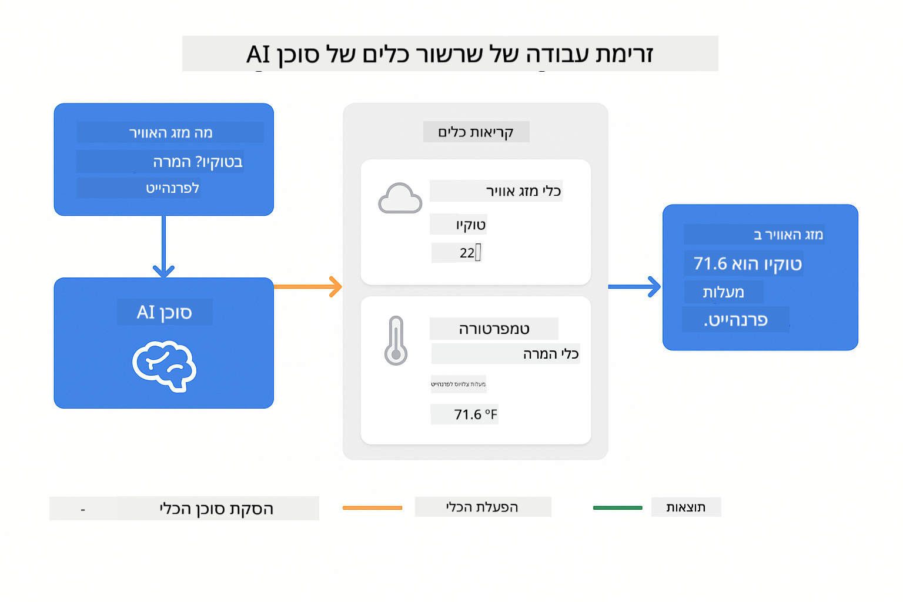
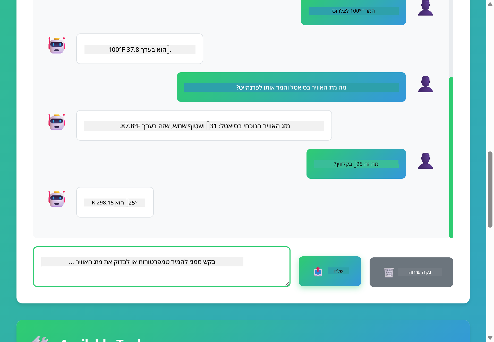

<!--
CO_OP_TRANSLATOR_METADATA:
{
  "original_hash": "13ec450c12cdd1a863baa2b778f27cd7",
  "translation_date": "2025-12-31T02:33:22+00:00",
  "source_file": "04-tools/README.md",
  "language_code": "he"
}
-->
# Module 04: סוכני AI עם כלים

## Table of Contents

- [מה תלמד](../../../04-tools)
- [דרישות מוקדמות](../../../04-tools)
- [הבנת סוכני AI עם כלים](../../../04-tools)
- [איך קריאת כלים עובדת](../../../04-tools)
  - [הגדרות כלים](../../../04-tools)
  - [קבלת החלטות](../../../04-tools)
  - [ביצוע](../../../04-tools)
  - [יצירת תגובה](../../../04-tools)
- [שרשור כלים](../../../04-tools)
- [הרצת האפליקציה](../../../04-tools)
- [שימוש באפליקציה](../../../04-tools)
  - [נסה שימוש פשוט בכלי](../../../04-tools)
  - [בדוק שרשור כלים](../../../04-tools)
  - [ראה את זרימת השיחה](../../../04-tools)
  - [התבונן בהרציונל](../../../04-tools)
  - [ניסוי עם בקשות שונות](../../../04-tools)
- [מושגים מרכזיים](../../../04-tools)
  - [תבנית ReAct (הגיון ופעלה)](../../../04-tools)
  - [תיאורים של כלים חשובים](../../../04-tools)
  - [ניהול מושבים](../../../04-tools)
  - [טיפול בשגיאות](../../../04-tools)
- [כלים זמינים](../../../04-tools)
- [מתי להשתמש בסוכנים מבוססי כלים](../../../04-tools)
- [השלבים הבאים](../../../04-tools)

## What You'll Learn

עד כה למדת איך לקיים שיחות עם בינה מלאכותית, לבנות פרומפטים בצורה יעילה, ולהעמיד תשובות על בסיס המסמכים שלך. אבל יש עדיין מגבלה יסודית: מודלי שפה יכולים רק להפיק טקסט. הם לא יכולים לבדוק את מזג האוויר, לבצע חישובים, לשאול מאגרי נתונים או לתקשר עם מערכות חיצוניות.

כלים משנים זאת. על ידי מתן גישה לפונקציות שהמודל יכול לקרוא להן, אתה הופך אותו ממייצר טקסט לסוכן שיכול לבצע פעולות. המודל מחליט מתי הוא צריך כלי, איזה כלי להשתמש ואילו פרמטרים להעביר. הקוד שלך מבצע את הפונקציה ומחזיר את התוצאה. המודל משלב את התוצאה הזו בתשובתו.

## Prerequisites

- השלמת Module 01 (משאבי Azure OpenAI מותקנים)
- קובץ `.env` בתיקיית השורש עם אישורי Azure (נוצר על ידי `azd up` ב-Module 01)

> **הערה:** אם לא השלמת את Module 01, עקוב אחר הוראות הפריסה שם תחילה.

## Understanding AI Agents with Tools

> **📝 הערה:** המונח "סוכנים" במודול זה מתייחס לעוזרי AI המשודרגים ביכולת לקרוא לכלים. זה שונה מתבניות **Agentic AI** (סוכנים אוטונומיים עם תכנון, זיכרון והיגיון רב-שלבי) שנכסה ב-[Module 05: MCP](../05-mcp/README.md).

סוכן AI עם כלים פועל לפי תבנית של חשיבה ופעולה (ReAct):

1. המשתמש שואל שאלה
2. הסוכן מהרהר על מה שהוא צריך לדעת
3. הסוכן מחליט אם הוא צריך כלי כדי לענות
4. אם כן, הסוכן קורא לכלי המתאים עם הפרמטרים הנכונים
5. הכלי מבצע ומחזיר נתונים
6. הסוכן משלב את התוצאה ומספק את התשובה הסופית


*תבנית ReAct - איך סוכני AI מתחלפים בין חשיבה לפעולה כדי לפתור בעיות*

זה קורה אוטומטית. אתה מגדיר את הכלים ותיאורי שלהם. המודל מטפל בקבלת ההחלטות על מתי וכיצד להשתמש בהם.

## How Tool Calling Works

**הגדרות כלים** - [WeatherTool.java](../../../04-tools/src/main/java/com/example/langchain4j/agents/tools/WeatherTool.java) | [TemperatureTool.java](../../../04-tools/src/main/java/com/example/langchain4j/agents/tools/TemperatureTool.java)

אתה מגדיר פונקציות עם תיאורים ברורים ומפרטי פרמטרים. המודל רואה את התיאורים האלה בפרומפט של המערכת ומבין מה כל כלי עושה.

```java
@Component
public class WeatherTool {
    
    @Tool("Get the current weather for a location")
    public String getCurrentWeather(@P("Location name") String location) {
        // הלוגיקה שלך לחיפוש מזג האוויר
        return "Weather in " + location + ": 22°C, cloudy";
    }
}

@AiService
public interface Assistant {
    String chat(@MemoryId String sessionId, @UserMessage String message);
}

// העוזר מחובר אוטומטית על ידי Spring Boot עם:
// - bean של ChatModel
// - כל המתודות המסומנות ב-@Tool מתוך מחלקות ה-@Component
// - ChatMemoryProvider לניהול סשנים
```

> **🤖 נסה עם [GitHub Copilot](https://github.com/features/copilot) Chat:** פתח את [`WeatherTool.java`](../../../04-tools/src/main/java/com/example/langchain4j/agents/tools/WeatherTool.java) ושאל:
> - "איך אני אשלב API אמיתי למזג אוויר כמו OpenWeatherMap במקום נתוני דמו?"
> - "מה הופך תיאור של כלי לטוב שעוזר ל-AI להשתמש בו נכון?"
> - "איך אני מטפל בשגיאות של API ובמגבלות קצב ביישום של הכלי?"

**קבלת החלטות**

כאשר משתמש שואל "מה מזג האוויר בסיאטל?", המודל מזהה שהוא צריך את כלי מזג האוויר. הוא יוצר קריאת פונקציה עם פרמטר המיקום שהוגדר כ-"Seattle".

**ביצוע** - [AgentService.java](../../../04-tools/src/main/java/com/example/langchain4j/agents/service/AgentService.java)

Spring Boot מזריק אוטומטית את ממשק ה-`@AiService` הדקלרטיבי עם כל הכלים הרשומים, ו-LangChain4j מבצע קריאות לכלים אוטומטית.

> **🤖 נסה עם [GitHub Copilot](https://github.com/features/copilot) Chat:** פתח את [`AgentService.java`](../../../04-tools/src/main/java/com/example/langchain4j/agents/service/AgentService.java) ושאל:
> - "איך תבנית ReAct עובדת ומדוע היא יעילה עבור סוכנים של AI?"
> - "איך הסוכן מחליט איזה כלי להשתמש ובאיזה סדר?"
> - "מה קורה אם ביצוע של כלי נכשל - איך עלי לטפל בשגיאות בצורה עמידה?"

**יצירת תגובה**

המקום מקבל את נתוני מזג האוויר ומעצב אותם לתשובה בשפה טבעית עבור המשתמש.

### מדוע להשתמש בשירותי AI דקלרטיביים?

המודול הזה משתמש באינטגרציה של LangChain4j עם Spring Boot דרך ממשקי `@AiService` דקלרטיביים:

- **הזרקת תלות של Spring Boot** - ChatModel והכלים מוזרקים אוטומטית
- **תבנית `@MemoryId`** - ניהול זיכרון מבוסס מושב אוטומטי
- **מופע יחיד** - העוזר נוצר פעם אחת וממוחזר לביצועים טובים יותר
- **ביצוע בטוח מבחינת טיפוסים** - שיטות Java נקראות ישירות עם המרה בין טיפוסים
- **אורקסטרציית סבבים מרובי-סיבובים** - מטפל בשרשור כלים אוטומטית
- **אפס קוד מיותר** - אין קריאות ידניות ל-AiServices.builder() או HashMap לזיכרון

גישות חלופיות (ידניות עם `AiServices.builder()`) דורשות יותר קוד ומחמיצות את יתרונות האינטגרציה עם Spring Boot.

## Tool Chaining

**שרשור כלים** - ה-AI עשוי לקרוא למספר כלים ברצף. שאל "מה מזג האוויר בסיאטל והאם כדאי לי להביא מטרייה?" וצפה בו בשרשור של `getCurrentWeather` עם חשיבה על ציוד לגשם.

<a href="images/tool-chaining.png"></a>

*קריאות כלים סדרתיות - הפלט של כלי אחד מזין להחלטה הבאה*

**כישלונות חלקים** - בקש מזג אוויר בעיר שלא נמצאת בנתוני הדמו. הכלי מחזיר הודעת שגיאה, וה-AI מסביר שהוא לא יכול לעזור. כלים נכשלים בבטחה.

זה קורה בתוך סיבוב שיחה יחיד. הסוכן אורקסטרציות קריאות לכלים מרובות באופן אוטונומי.

## Run the Application

**אימות פריסה:**

וודא שקובץ `.env` קיים בתיקיית השורש עם אישורי Azure (נוצר במהלך Module 01):
```bash
cat ../.env  # יש להציג AZURE_OPENAI_ENDPOINT, API_KEY, DEPLOYMENT
```

**הפעלת האפליקציה:**

> **הערה:** אם כבר הפעלת את כל האפליקציות באמצעות `./start-all.sh` מ-Module 01, מודול זה כבר רץ על הפורט 8084. תוכל לדלג על פקודות ההפעלה למטה ולעבור ישירות ל-http://localhost:8084.

**אפשרות 1: שימוש ב-Spring Boot Dashboard (מומלץ למשתמשי VS Code)**

מיכל הפיתוח כולל את תוסף Spring Boot Dashboard, שמספק ממשק חזותי לניהול כל יישומי Spring Boot. ניתן למצוא אותו ב-Activity Bar בצד השמאלי של VS Code (חפש את הסמל של Spring Boot).

מה-Spring Boot Dashboard תוכל:
- לראות את כל יישומי Spring Boot הזמינים בסביבת העבודה
- להפעיל/להפסיק יישומים בלחיצה אחת
- לצפות בלוגים של האפליקציה בזמן אמת
- לנטר את מצב האפליקציה

פשוט לחץ על כפתור ההפעלה ליד "tools" כדי להתחיל את המודול הזה, או הפעל את כל המודולים בבת אחת.


**אפשרות 2: שימוש בסקריפטים של shell**

הפעל את כל יישומי הווב (מודולים 01-04):

**Bash:**
```bash
cd ..  # מתיקיית השורש
./start-all.sh
```

**PowerShell:**
```powershell
cd ..  # מתיקיית השורש
.\start-all.ps1
```

או הפעל רק את המודול הזה:

**Bash:**
```bash
cd 04-tools
./start.sh
```

**PowerShell:**
```powershell
cd 04-tools
.\start.ps1
```

שני הסקריפטים טוענים אוטומטית משתני סביבה מקובץ `.env` בתיקיית השורש ויבנו את JAR-ים אם הם לא קיימים.

> **הערה:** אם אתה מעדיף לבנות את כל המודולים ידנית לפני ההפעלה:
>
> **Bash:**
> ```bash
> cd ..  # Go to root directory
> mvn clean package -DskipTests
> ```
>
> **PowerShell:**
> ```powershell
> cd ..  # Go to root directory
> mvn clean package -DskipTests
> ```

פתח את http://localhost:8084 בדפדפן שלך.

**להפסיק:**

**Bash:**
```bash
./stop.sh  # רק מודול זה
# או
cd .. && ./stop-all.sh  # כל המודולים
```

**PowerShell:**
```powershell
.\stop.ps1  # מודול זה בלבד
# או
cd ..; .\stop-all.ps1  # כל המודולים
```

## Using the Application

האפליקציה מספקת ממשק ווב שבו ניתן לתקשר עם סוכן AI שיש לו גישה לכלי מזג אוויר ולהמרת טמפרטורה.

<a href="images/tools-homepage.png"></a>

*ממשק כלי סוכן ה-AI - דוגמאות מהירות וממשק צ'אט לאינטראקציה עם הכלים*

**נסה שימוש פשוט בכלי**

התחל בבקשה פשוטה: "המר 100 מעלות פרנהייט לצלזיוס". הסוכן מזהה שהוא צריך את כלי המרה של טמפרטורה, קורא לו עם הפרמטרים הנכונים ומחזיר את התוצאה. שים לב כמה זה מרגיש טבעי - לא ציינת איזה כלי להשתמש או איך לקרוא לו.

**בדוק שרשור כלים**

כעת נסה משהו מורכב יותר: "מה מזג האוויר בסיאטל והמר זאת לפרנהייט?" צפה בסוכן מבצע זאת בשלבים. הוא מקבל תחילה את מזג האוויר (המוחזר בצלזיוס), מזהה צורך להמיר לפרנהייט, קורא לכלי ההמרה ומשלב את שתי התוצאות לתשובה אחת.

**ראה את זרימת השיחה**

ממשק הצ'אט שומר היסטוריית שיחה, ומאפשר לך אינטראקציות מרובות סיבובים. תוכל לראות את כל השאלות והתשובות הקודמות, מה שמקל לעקוב אחר השיחה ולהבין איך הסוכן בונה הקשר על פני חילופים מרובים.

<a href="images/tools-conversation-demo.png"></a>

*שיחה מרובת סיבובים המראה המרות פשוטות, חיפושי מזג אוויר ושרשור כלים*

**ניסוי עם בקשות שונות**

נסה שילובים שונים:
- חיפושי מזג אוויר: "מה מזג האוויר בטוקיו?"
- המרות טמפרטורה: "כמה זה 25°C בקלווין?"
- שאילתות משולבות: "בדוק את מזג האוויר בפריס ואמר לי אם מעל 20°C"

שים לב כיצד הסוכן מפרש שפה טבעית וממפה אותה לקריאות כלים מתאימות.

## Key Concepts

**תבנית ReAct (הגיון ופעלה)**

הסוכן מתחלף בין חשיבה (החלטה מה לעשות) ופעולה (שימוש בכלים). תבנית זו מאפשרת פתרון בעיות אוטונומי במקום רק ביצוע הוראות.

**תיאורי כלים חשובים**

איכות תיאורי הכלים שלך משפיעה ישירות על יכולת הסוכן להשתמש בהם כראוי. תיאורים ברורים ומפורטים עוזרים למודל להבין מתי וכיצד לקרוא לכל כלי.

**ניהול מושבים**

האנוטציה `@MemoryId` מאפשרת ניהול זיכרון מבוסס מושב אוטומטי. כל מזהה מושב מקבל מופע `ChatMemory` משלו שמנוהל על ידי ה-bean `ChatMemoryProvider`, מה שמנטרל את הצורך במעקב ידני אחרי זיכרון.

**טיפול בשגיאות**

כלים יכולים להיכשל - APIs יכולים לפקע זמן, פרמטרים עלולים להיות שגויים, שירותים חיצוניים עלולים לקרוס. סוכנים פרודקשן צריכים טיפול בשגיאות כך שהמודל יוכל להסביר בעיות או לנסות אלטרנטיבות.

## Available Tools

**כלי מזג אוויר** (נתוני דמו להדגמה):
- קבלת מזג אוויר נוכחי עבור מיקום
- קבלת תחזית מרובת ימים

**כלי המרת טמפרטורה**:
- צלזיוס לפרנהייט
- פרנהייט לצלזיוס
- צלזיוס לקלווין
- קלווין לצלזיוס
- פרנהייט לקלווין
- קלווין לפרנהייט

אלו דוגמאות פשוטות, אך התבנית מתאימה לכל פונקציה: שאילתות מסד נתונים, קריאות API, חישובים, פעולות קבצים או פקודות מערכת.

## When to Use Tool-Based Agents

**השתמש בכלים כאשר:**
- התשובה דורשת נתונים בזמן אמת (מזג אוויר, מחירי מניות, מלאי)
- צריך לבצע חישובים מעבר למתמטיקה פשוטה
- גישה למסדי נתונים או APIs
- ביצוע פעולות (שליחת אימיילים, יצירת כרטיסים, עדכון רשומות)
- שילוב מקורות נתונים מרובים

**אל תשתמש בכלים כאשר:**
- השאלות ניתנות למענה מהידע הכללי
- התשובה היא שיחתית טהורה
- השיהוי של הכלי יהפוך את החוויה לאיטית מדי

## Next Steps

**מודול הבא:** [05-mcp - Model Context Protocol (MCP)](../05-mcp/README.md)

---

**ניווט:** [← Previous: Module 03 - RAG](../03-rag/README.md) | [Back to Main](../README.md) | [Next: Module 05 - MCP →](../05-mcp/README.md)

---

<!-- CO-OP TRANSLATOR DISCLAIMER START -->
הצהרת אי-אחריות:
מסמך זה תורגם באמצעות שירות תרגום מבוסס בינה מלאכותית [Co-op Translator](https://github.com/Azure/co-op-translator). אמנם אנו שואפים לדיוק, אך יש לשים לב שתרגומים אוטומטיים עלולים להכיל שגיאות או אי־דיוקים. יש לראות במסמך המקורי בשפתו כמקור הסמכות. עבור מידע קריטי מומלץ תרגום מקצועי על ידי מתרגם אנושי. איננו אחראים לכל אי־הבנה או פרשנות שגויה הנובעת מהשימוש בתרגום זה.
<!-- CO-OP TRANSLATOR DISCLAIMER END -->