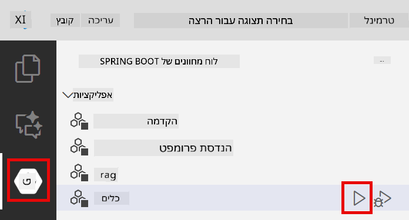
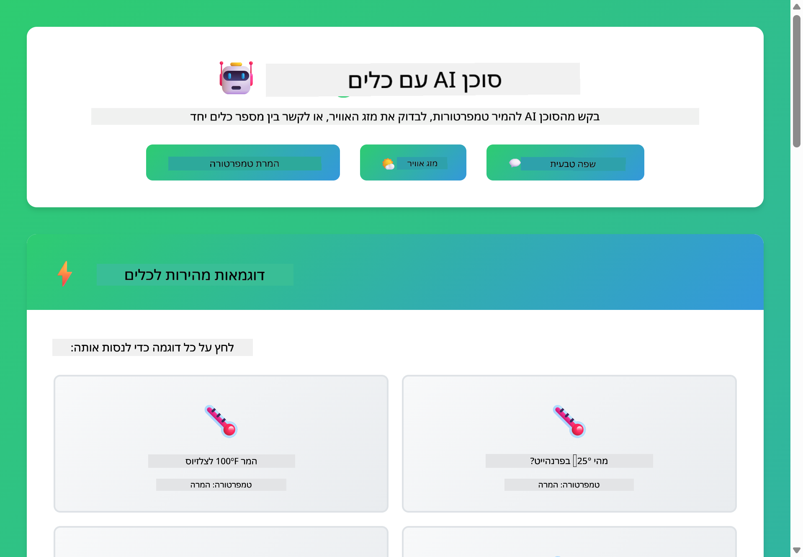

<!--
CO_OP_TRANSLATOR_METADATA:
{
  "original_hash": "aa23f106e7f53270924c9dd39c629004",
  "translation_date": "2025-12-13T19:07:00+00:00",
  "source_file": "04-tools/README.md",
  "language_code": "he"
}
-->
# מודול 04: סוכני בינה מלאכותית עם כלים

## תוכן העניינים

- [מה תלמדו](../../../04-tools)
- [דרישות מוקדמות](../../../04-tools)
- [הבנת סוכני בינה מלאכותית עם כלים](../../../04-tools)
- [כיצד פועל קריאת כלים](../../../04-tools)
  - [הגדרות כלים](../../../04-tools)
  - [קבלת החלטות](../../../04-tools)
  - [ביצוע](../../../04-tools)
  - [יצירת תגובה](../../../04-tools)
- [שרשור כלים](../../../04-tools)
- [הרצת היישום](../../../04-tools)
- [שימוש ביישום](../../../04-tools)
  - [נסו שימוש פשוט בכלי](../../../04-tools)
  - [בדקו שרשור כלים](../../../04-tools)
  - [ראו את זרימת השיחה](../../../04-tools)
  - [התבוננו בהסקת המסקנות](../../../04-tools)
  - [נסו בקשות שונות](../../../04-tools)
- [מושגים מרכזיים](../../../04-tools)
  - [תבנית ReAct (הסקה ופעולה)](../../../04-tools)
  - [תיאורי כלים חשובים](../../../04-tools)
  - [ניהול מושבים](../../../04-tools)
  - [טיפול בשגיאות](../../../04-tools)
- [כלים זמינים](../../../04-tools)
- [מתי להשתמש בסוכנים מבוססי כלים](../../../04-tools)
- [השלבים הבאים](../../../04-tools)

## מה תלמדו

עד כה, למדתם כיצד לנהל שיחות עם בינה מלאכותית, לבנות פרומפטים בצורה יעילה, ולבסס תגובות במסמכים שלכם. אך עדיין קיימת מגבלה יסודית: מודלי שפה יכולים רק לייצר טקסט. הם לא יכולים לבדוק את מזג האוויר, לבצע חישובים, לשאול מסדי נתונים או לתקשר עם מערכות חיצוניות.

כלים משנים זאת. על ידי מתן גישה לפונקציות שהמודל יכול לקרוא להן, אתם הופכים אותו מיצרן טקסט לסוכן שיכול לבצע פעולות. המודל מחליט מתי הוא צריך כלי, איזה כלי להשתמש, ואילו פרמטרים להעביר. הקוד שלכם מבצע את הפונקציה ומחזיר את התוצאה. המודל משלב את התוצאה בתגובתו.

## דרישות מוקדמות

- השלמת מודול 01 (משאבי Azure OpenAI הוטמעו)
- קובץ `.env` בתיקיית השורש עם אישורי Azure (נוצר על ידי `azd up` במודול 01)

> **הערה:** אם לא השלמתם את מודול 01, עקבו תחילה אחר הוראות הפריסה שם.

## הבנת סוכני בינה מלאכותית עם כלים

סוכן בינה מלאכותית עם כלים פועל לפי תבנית הסקה ופעולה (ReAct):

1. המשתמש שואל שאלה
2. הסוכן מסיק מה הוא צריך לדעת
3. הסוכן מחליט אם הוא צריך כלי כדי לענות
4. אם כן, הסוכן קורא לכלי המתאים עם הפרמטרים הנכונים
5. הכלי מבצע ומחזיר נתונים
6. הסוכן משלב את התוצאה ומספק את התשובה הסופית


*תבנית ReAct - כיצד סוכני בינה מלאכותית מתחלפים בין הסקה לפעולה כדי לפתור בעיות*

זה קורה אוטומטית. אתם מגדירים את הכלים ואת תיאוריהם. המודל מטפל בקבלת ההחלטות מתי ואיך להשתמש בהם.

## כיצד פועל קריאת כלים

**הגדרות כלים** - [WeatherTool.java](../../../04-tools/src/main/java/com/example/langchain4j/agents/tools/WeatherTool.java) | [TemperatureTool.java](../../../04-tools/src/main/java/com/example/langchain4j/agents/tools/TemperatureTool.java)

אתם מגדירים פונקציות עם תיאורים ברורים ומפרטי פרמטרים. המודל רואה את התיאורים האלה בפרומפט המערכת שלו ומבין מה כל כלי עושה.

```java
@Component
public class WeatherTool {
    
    @Tool("Get the current weather for a location")
    public String getCurrentWeather(@P("Location name") String location) {
        // הלוגיקה שלך לחיפוש מזג האוויר
        return "Weather in " + location + ": 22°C, cloudy";
    }
}

@AiService
public interface Assistant {
    String chat(@MemoryId String sessionId, @UserMessage String message);
}

// העוזר מחובר אוטומטית על ידי Spring Boot עם:
// - רכיב ChatModel
// - כל שיטות @Tool מתוך מחלקות @Component
// - ChatMemoryProvider לניהול מושבים
```

> **🤖 נסו עם [GitHub Copilot](https://github.com/features/copilot) Chat:** פתחו את [`WeatherTool.java`](../../../04-tools/src/main/java/com/example/langchain4j/agents/tools/WeatherTool.java) ושאלו:
> - "איך אני משלב ממשק API אמיתי למזג אוויר כמו OpenWeatherMap במקום נתוני דמה?"
> - "מה עושה תיאור טוב לכלי שעוזר לבינה המלאכותית להשתמש בו נכון?"
> - "איך מטפלים בשגיאות API ומגבלות קצב ביישום כלים?"

**קבלת החלטות**

כאשר משתמש שואל "מה מזג האוויר בסיאטל?", המודל מזהה שהוא צריך את כלי מזג האוויר. הוא מייצר קריאת פונקציה עם פרמטר מיקום שהוגדר ל"סיאטל".

**ביצוע** - [AgentService.java](../../../04-tools/src/main/java/com/example/langchain4j/agents/service/AgentService.java)

Spring Boot מחבר אוטומטית את ממשק `@AiService` הדקלרטיבי עם כל הכלים הרשומים, ו-LangChain4j מבצע קריאות לכלים אוטומטית.

> **🤖 נסו עם [GitHub Copilot](https://github.com/features/copilot) Chat:** פתחו את [`AgentService.java`](../../../04-tools/src/main/java/com/example/langchain4j/agents/service/AgentService.java) ושאלו:
> - "איך פועלת תבנית ReAct ולמה היא יעילה לסוכני בינה מלאכותית?"
> - "איך הסוכן מחליט איזה כלי להשתמש ובאיזה סדר?"
> - "מה קורה אם ביצוע כלי נכשל - איך לטפל בשגיאות בצורה אמינה?"

**יצירת תגובה**

המודל מקבל את נתוני מזג האוויר ומעצב אותם לתגובה בשפה טבעית עבור המשתמש.

### למה להשתמש בשירותי AI דקלרטיביים?

מודול זה משתמש באינטגרציה של LangChain4j עם Spring Boot באמצעות ממשקי `@AiService` דקלרטיביים:

- **חיבור אוטומטי של Spring Boot** - ChatModel והכלים מוזרקים אוטומטית
- **תבנית @MemoryId** - ניהול זיכרון מבוסס מושב אוטומטי
- **מופע יחיד** - העוזר נוצר פעם אחת ומשמש מחדש לביצועים טובים יותר
- **ביצוע בטוח טיפוס** - קריאה ישירה למתודות Java עם המרת טיפוסים
- **אורקסטרציה מרובת סבבים** - מטפל בשרשור כלים אוטומטית
- **ללא קוד מיותר** - ללא קריאות ידניות ל-AiServices.builder() או HashMap לזיכרון

גישות חלופיות (ידניות עם `AiServices.builder()`) דורשות יותר קוד ומפספסות את יתרונות האינטגרציה עם Spring Boot.

## שרשור כלים

**שרשור כלים** - ה-AI עשוי לקרוא למספר כלים ברצף. שאלו "מה מזג האוויר בסיאטל והאם כדאי להביא מטריה?" וצפו כיצד הוא משלב את `getCurrentWeather` עם הסקה על ציוד לגשם.

<a href="images/tool-chaining.png"></a>

*קריאות כלים ברצף - פלט של כלי אחד מזין את ההחלטה הבאה*

**כישלונות מחושבים** - בקשו מזג אוויר בעיר שאינה קיימת בנתוני הדמה. הכלי מחזיר הודעת שגיאה, וה-AI מסביר שהוא לא יכול לעזור. הכלים נכשלים בצורה בטוחה.

זה קורה בסבב שיחה יחיד. הסוכן מארגן קריאות כלים מרובות באופן עצמאי.

## הרצת היישום

**אימות פריסה:**

ודאו שקובץ `.env` קיים בתיקיית השורש עם אישורי Azure (נוצר במהלך מודול 01):
```bash
cat ../.env  # צריך להציג את AZURE_OPENAI_ENDPOINT, API_KEY, DEPLOYMENT
```

**הפעלת היישום:**

> **הערה:** אם כבר הפעלתם את כל היישומים באמצעות `./start-all.sh` ממודול 01, מודול זה כבר רץ על פורט 8084. ניתן לדלג על פקודות ההפעלה למטה ולעבור ישירות לכתובת http://localhost:8084.

**אפשרות 1: שימוש ב-Spring Boot Dashboard (מומלץ למשתמשי VS Code)**

מיכל הפיתוח כולל את תוסף Spring Boot Dashboard, המספק ממשק חזותי לניהול כל יישומי Spring Boot. ניתן למצוא אותו בסרגל הפעילות בצד שמאל של VS Code (חפשו את סמל Spring Boot).

מ-Spring Boot Dashboard תוכלו:
- לראות את כל יישומי Spring Boot הזמינים בסביבת העבודה
- להפעיל/להפסיק יישומים בלחיצה אחת
- לצפות בלוגים של היישום בזמן אמת
- לנטר את מצב היישום

פשוט לחצו על כפתור ההפעלה ליד "tools" כדי להפעיל את המודול הזה, או הפעילו את כל המודולים בבת אחת.



**אפשרות 2: שימוש בסקריפטים של shell**

הפעלת כל יישומי האינטרנט (מודולים 01-04):

**Bash:**
```bash
cd ..  # מתיקיית השורש
./start-all.sh
```

**PowerShell:**
```powershell
cd ..  # מתיקיית השורש
.\start-all.ps1
```

או הפעלת מודול זה בלבד:

**Bash:**
```bash
cd 04-tools
./start.sh
```

**PowerShell:**
```powershell
cd 04-tools
.\start.ps1
```

שני הסקריפטים טוענים אוטומטית משתני סביבה מקובץ `.env` בשורש ויבנו את קבצי ה-JAR אם אינם קיימים.

> **הערה:** אם אתם מעדיפים לבנות את כל המודולים ידנית לפני ההפעלה:
>
> **Bash:**
> ```bash
> cd ..  # Go to root directory
> mvn clean package -DskipTests
> ```
>
> **PowerShell:**
> ```powershell
> cd ..  # Go to root directory
> mvn clean package -DskipTests
> ```

פתחו את http://localhost:8084 בדפדפן שלכם.

**להפסקה:**

**Bash:**
```bash
./stop.sh  # רק מודול זה
# או
cd .. && ./stop-all.sh  # כל המודולים
```

**PowerShell:**
```powershell
.\stop.ps1  # רק מודול זה
# או
cd ..; .\stop-all.ps1  # כל המודולים
```

## שימוש ביישום

היישום מספק ממשק רשת שבו ניתן לתקשר עם סוכן בינה מלאכותית שיש לו גישה לכלי מזג אוויר והמרת טמפרטורות.

<a href="images/tools-homepage.png"></a>

*ממשק כלים של סוכן בינה מלאכותית - דוגמאות מהירות וממשק שיחה לאינטראקציה עם כלים*

**נסו שימוש פשוט בכלי**

התחילו בבקשה פשוטה: "המר 100 מעלות פרנהייט לצלזיוס". הסוכן מזהה שהוא צריך את כלי המרת הטמפרטורה, קורא לו עם הפרמטרים הנכונים ומחזיר את התוצאה. שימו לב כמה זה טבעי - לא ציינתם איזה כלי להשתמש או איך לקרוא לו.

**בדקו שרשור כלים**

עכשיו נסו משהו מורכב יותר: "מה מזג האוויר בסיאטל והמר אותו לפרנהייט?" צפו כיצד הסוכן עובד על זה בשלבים. הוא מקבל תחילה את מזג האוויר (שמחזיר בצלזיוס), מזהה שהוא צריך להמיר לפרנהייט, קורא לכלי ההמרה ומשלב את שתי התוצאות לתגובה אחת.

**ראו את זרימת השיחה**

ממשק השיחה שומר היסטוריית שיחות, ומאפשר לכם לנהל אינטראקציות מרובות סבבים. תוכלו לראות את כל השאלות והתשובות הקודמות, מה שמקל לעקוב אחרי השיחה ולהבין כיצד הסוכן בונה הקשר לאורך החלפות מרובות.

<a href="images/tools-conversation-demo.png"></a>

*שיחה מרובת סבבים המציגה המרות פשוטות, בדיקות מזג אוויר ושרשור כלים*

**נסו בקשות שונות**

נסו שילובים שונים:
- בדיקות מזג אוויר: "מה מזג האוויר בטוקיו?"
- המרות טמפרטורה: "כמה זה 25°C בקלווין?"
- שאילתות משולבות: "בדוק את מזג האוויר בפריז ואמר לי אם מעל 20°C"

שימו לב כיצד הסוכן מפרש שפה טבעית וממפה אותה לקריאות כלים מתאימות.

## מושגים מרכזיים

**תבנית ReAct (הסקה ופעולה)**

הסוכן מתחלף בין הסקה (החלטה מה לעשות) ופעולה (שימוש בכלים). תבנית זו מאפשרת פתרון בעיות אוטונומי במקום רק תגובה להוראות.

**תיאורי כלים חשובים**

איכות תיאורי הכלים שלכם משפיעה ישירות על האופן שבו הסוכן משתמש בהם. תיאורים ברורים ומפורטים עוזרים למודל להבין מתי ואיך לקרוא לכל כלי.

**ניהול מושבים**

האנוטציה `@MemoryId` מאפשרת ניהול זיכרון מבוסס מושב אוטומטי. לכל מזהה מושב יש מופע `ChatMemory` מנוהל על ידי ה-bean `ChatMemoryProvider`, מה שמבטל את הצורך במעקב זיכרון ידני.

**טיפול בשגיאות**

כלים עלולים להיכשל - APIs עלולים להיגמר זמן, פרמטרים עלולים להיות לא תקינים, שירותים חיצוניים עלולים לקרוס. סוכנים בפרודקשן צריכים טיפול בשגיאות כדי שהמודל יוכל להסביר בעיות או לנסות חלופות.

## כלים זמינים

**כלי מזג אוויר** (נתוני דמה להדגמה):
- קבלת מזג אוויר נוכחי למיקום
- תחזית רב-יומית

**כלי המרת טמפרטורה**:
- צלזיוס לפרנהייט
- פרנהייט לצלזיוס
- צלזיוס לקלווין
- קלווין לצלזיוס
- פרנהייט לקלווין
- קלווין לפרנהייט

אלו דוגמאות פשוטות, אך התבנית מתרחבת לכל פונקציה: שאילתות מסדי נתונים, קריאות API, חישובים, פעולות קבצים או פקודות מערכת.

## מתי להשתמש בסוכנים מבוססי כלים

**השתמשו בכלים כאשר:**
- התשובה דורשת נתונים בזמן אמת (מזג אוויר, מחירי מניות, מלאי)
- יש צורך לבצע חישובים מעבר למתמטיקה פשוטה
- גישה למסדי נתונים או APIs
- ביצוע פעולות (שליחת מיילים, יצירת כרטיסים, עדכון רשומות)
- שילוב מקורות נתונים מרובים

**אל תשתמשו בכלים כאשר:**
- ניתן לענות על השאלות מתוך ידע כללי
- התגובה היא שיחה בלבד
- השהיית הכלי תגרום לחוויה איטית מדי

## השלבים הבאים

**מודול הבא:** [05-mcp - פרוטוקול הקשר מודל (MCP)](../05-mcp/README.md)

---

**ניווט:** [← קודם: מודול 03 - RAG](../03-rag/README.md) | [חזרה לעמוד הראשי](../README.md) | [הבא: מודול 05 - MCP →](../05-mcp/README.md)

---

<!-- CO-OP TRANSLATOR DISCLAIMER START -->
**כתב ויתור**:  
מסמך זה תורגם באמצעות שירות תרגום מבוסס בינה מלאכותית [Co-op Translator](https://github.com/Azure/co-op-translator). למרות שאנו שואפים לדיוק, יש לקחת בחשבון כי תרגומים אוטומטיים עלולים להכיל שגיאות או אי-דיוקים. המסמך המקורי בשפת המקור שלו נחשב למקור הסמכותי. למידע קריטי מומלץ להשתמש בתרגום מקצועי על ידי אדם. אנו לא נושאים באחריות לכל אי-הבנה או פרשנות שגויה הנובעת משימוש בתרגום זה.
<!-- CO-OP TRANSLATOR DISCLAIMER END -->