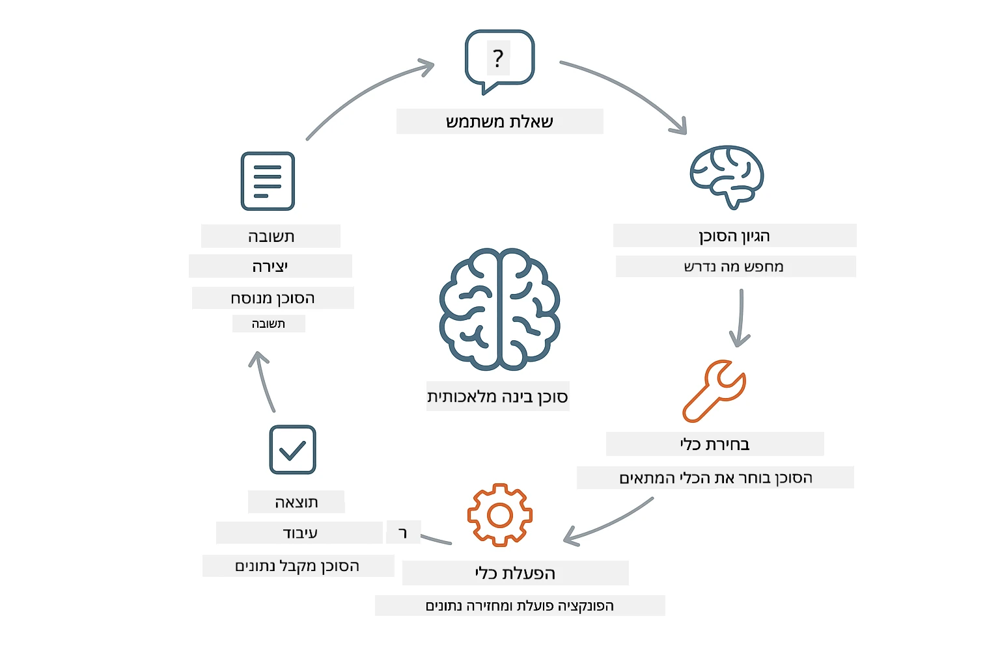
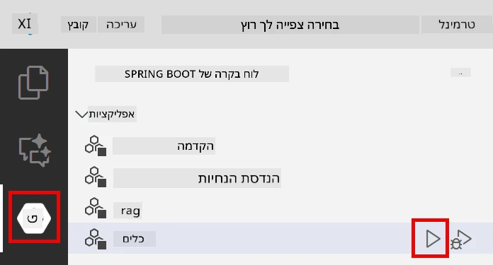
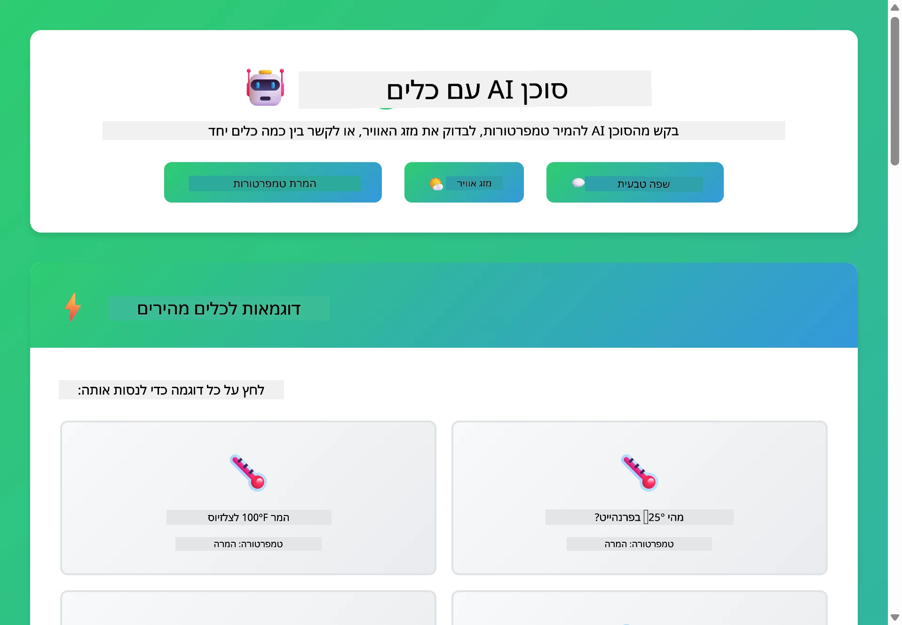

# מודול 04: סוכני בינה מלאכותית עם כלים

## תוכן העניינים

- [מה תלמדו](../../../04-tools)
- [דרישות מוקדמות](../../../04-tools)
- [הבנת סוכני AI עם כלים](../../../04-tools)
- [כיצד פועלים קריאות לכלים](../../../04-tools)
  - [הגדרות כלים](../../../04-tools)
  - [קבלת החלטות](../../../04-tools)
  - [הוצאה לפועל](../../../04-tools)
  - [יצירת תגובה](../../../04-tools)
- [רצף כלים](../../../04-tools)
- [הפעלת היישום](../../../04-tools)
- [שימוש ביישום](../../../04-tools)
  - [נסו שימוש פשוט בכלים](../../../04-tools)
  - [בדיקת רצף כלים](../../../04-tools)
  - [ראו את זרימת השיחה](../../../04-tools)
  - [נסו בקשות שונות](../../../04-tools)
- [מושגים מרכזיים](../../../04-tools)
  - [דפוס ReAct (היסק ופעולה)](../../../04-tools)
  - [חשיבות תיאורי הכלים](../../../04-tools)
  - [ניהול מפגשים](../../../04-tools)
  - [טיפול בשגיאות](../../../04-tools)
- [כלים זמינים](../../../04-tools)
- [מתי להשתמש בסוכנים מבוססי כלים](../../../04-tools)
- [השלבים הבאים](../../../04-tools)

## מה תלמדו

עד כה למדתם כיצד לנהל שיחות עם AI, לבנות פקודות ביעילות, ולבסס תגובות במסמכים שלכם. אך עדיין קיימת מגבלה יסודית: מודלי שפה יכולים רק ליצור טקסט. הם אינם יכולים לבדוק את מזג האוויר, לבצע חישובים, לשאול מסדי נתונים או לתקשר עם מערכות חיצוניות.

כלים משנים זאת. על ידי מתן גישה למודל לפונקציות שניתן לקרוא להן, אתם משנים אותו מייצרן טקסט לסוכן שיכול לנקוט פעולות. המודל מחליט מתי הוא זקוק לכלי, איזה כלי להשתמש ואילו פרמטרים להעביר. הקוד שלכם מבצע את הפונקציה ומחזיר את התוצאה. המודל משלב את התוצאה הזאת בתגובתו.

## דרישות מוקדמות

- השלמת מודול 01 (משאבי Azure OpenAI פרוסים)
- קובץ `.env` בתיקיית השורש עם אישורי Azure (נוצר על ידי `azd up` במודול 01)

> **הערה:** אם עדיין לא השלמתם את מודול 01, עקבו תחילה אחר הוראות הפריסה שם.

## הבנת סוכני AI עם כלים

> **📝 הערה:** המונח "סוכנים" במודול זה מתייחס לעוזרי בינה מלאכותית המורחבים עם יכולות קריאת כלים. זה שונה מהדפוסי **Agentic AI** (סוכנים אוטונומיים עם תכנון, זיכרון והסקה במספר שלבים) שנבחן ב[מודול 05: MCP](../05-mcp/README.md).

סוכן AI עם כלים פועל לפי דפוס היסק ופעולה (ReAct):

1. המשתמש שואל שאלה
2. הסוכן מבצע היסק לגבי מה שצריך לדעת
3. הסוכן מחליט אם הוא צריך כלי כדי לענות
4. אם כן, הסוכן קורא לכלי המתאים עם הפרמטרים הנכונים
5. הכלי מבצע ומחזיר נתונים
6. הסוכן משלב את התוצאה ומספק את התשובה הסופית



*דפוס ReAct - כיצד סוכני AI מתחלפים בין היסק ופעולה לפתרון בעיות*

זה קורה באופן אוטומטי. אתם מגדירים את הכלים ואת תיאוריהם. המודל מנהל את קבלת ההחלטות לגבי מתי וכיצד להשתמש בהם.

## כיצד פועלים קריאות לכלים

### הגדרות כלים

[WeatherTool.java](../../../04-tools/src/main/java/com/example/langchain4j/agents/tools/WeatherTool.java) | [TemperatureTool.java](../../../04-tools/src/main/java/com/example/langchain4j/agents/tools/TemperatureTool.java)

אתם מגדירים פונקציות עם תיאורים ברורים ומפרטי פרמטרים. המודל רואה תיאורים אלה בפקודת המערכת שלו ומבין מה כל כלי עושה.

```java
@Component
public class WeatherTool {
    
    @Tool("Get the current weather for a location")
    public String getCurrentWeather(@P("Location name") String location) {
        // הלוגיקה שלך לחיפוש מזג האוויר
        return "Weather in " + location + ": 22°C, cloudy";
    }
}

@AiService
public interface Assistant {
    String chat(@MemoryId String sessionId, @UserMessage String message);
}

// העוזר מחובר אוטומטית על ידי Spring Boot עם:
// - פנינת ChatModel
// - כל שיטות @Tool מתוך מחלקות @Component
// - ספק זיכרון שיחה לניהול מושב
```

> **🤖 נסו עם השיחה של [GitHub Copilot](https://github.com/features/copilot):** פתחו את [`WeatherTool.java`](../../../04-tools/src/main/java/com/example/langchain4j/agents/tools/WeatherTool.java) ושאלו:
> - "איך אני אשלב ממשק API אמיתי למזג אוויר כגון OpenWeatherMap במקום נתוני הדמייה?"
> - "מה עושה תיאור טוב לכלי שעוזר ל-AI להשתמש בו כראוי?"
> - "כיצד אני מטפל בשגיאות API ומגבלות שיעור בשימוש בכלים?"

### קבלת החלטות

כאשר משתמש שואל "מה מזג האוויר בסיאטל?", המודל מזהה שהוא צריך את כלי מזג האוויר. הוא מייצר קריאת פונקציה עם פרמטר מיקום שהוגדר כ"סיאטל".

### הוצאה לפועל

[AgentService.java](../../../04-tools/src/main/java/com/example/langchain4j/agents/service/AgentService.java)

Spring Boot מחבר אוטומטית את ממשק ה-`@AiService` הדקלרטיבי עם כל הכלים הרשומים, ו-LangChain4j מבצע קריאות כלים באופן אוטומטי.

> **🤖 נסו עם השיחה של [GitHub Copilot](https://github.com/features/copilot):** פתחו את [`AgentService.java`](../../../04-tools/src/main/java/com/example/langchain4j/agents/service/AgentService.java) ושאלו:
> - "כיצד עובד דפוס ה-ReAct ולמה הוא יעיל לסוכני בינה מלאכותית?"
> - "כיצד הסוכן מחליט איזה כלי להשתמש ובאיזה סדר?"
> - "מה קורה במקרה שקריאת כלי נכשלת - כיצד לטפל בשגיאות בצורה אמינה?"

### יצירת תגובה

המודל מקבל את נתוני מזג האוויר ומעצב אותם לתגובה בשפה טבעית עבור המשתמש.

### מדוע להשתמש בשירותי AI דקלרטיביים?

מודול זה משתמש באינטגרציה של LangChain4j עם Spring Boot דרך ממשקי `@AiService` דקלרטיביים:

- **חיבור אוטומטי ב-Spring Boot** - הזרקה אוטומטית של ChatModel וכלים
- **דפוס @MemoryId** - ניהול זיכרון מבוסס מושב אוטומטי
- **מופע יחיד** - העוזר נוצר פעם אחת ומשומש מחדש לביצועים טובים יותר
- **הוצאה לפועל בטוחה טיפוס** - קריאת שיטות Java ישירות עם המרה טיפוסית
- **אורקסטרציה מרובת סבבים** - ניהול רצף כלים אוטומטי
- **אין צורך ב-boilerplate** - ללא קריאות ידניות ל-AiServices.builder() או HashMap לזיכרון

גישות חלופיות (ידניות עם `AiServices.builder()`) דורשות יותר קוד ומחמיצות את יתרונות אינטגרציית Spring Boot.

## רצף כלים

**רצף כלים** - ה-AI עשוי לקרוא לכלים מרובים ברצף. שאול "מה מזג האוויר בסיאטל והאם כדאי לקחת מטריה?" וצפו כיצד הוא מקשר בין `getCurrentWeather` לבין היסק לגבי ציוד לגשם.

<a href="images/tool-chaining.png"></a>

*קריאות כלים ברצף - פלט של כלי אחד מוזן להחלטה הבאה*

**כשלים אלגנטיים** - בקשו מזג אוויר בעיר שאינה קיימת בנתוני ההדמייה. הכלי מחזיר הודעת שגיאה, וה-AI מסביר שאין באפשרותו לעזור. כלים נכשלים בבטחה.

זה מתרחש בתור שיחה יחיד. הסוכן מארגן באופן עצמאי קריאות כלים מרובות.

## הפעלת היישום

**וודאו פריסה:**

ודאו שקובץ `.env` קיים בתיקיית השורש עם אישורי Azure (נוצר במהלך מודול 01):
```bash
cat ../.env  # צריך להציג AZURE_OPENAI_ENDPOINT, API_KEY, DEPLOYMENT
```

**הפעל את היישום:**

> **הערה:** אם כבר הפעלתם את כל היישומים בעזרת `./start-all.sh` ממודול 01, מודול זה כבר רץ על פורט 8084. ניתן לדלג על פקודות ההפעלה למטה ולעבור ישירות לכתובת http://localhost:8084.

**אפשרות 1: שימוש ב-Spring Boot Dashboard (מומלץ למשתמשי VS Code)**

מכולת הפיתוח כוללת את תוסף Spring Boot Dashboard, המספק ממשק חזותי לניהול כל יישומי Spring Boot. ניתן למצוא אותו בסרגל הפעילויות בצד שמאל של VS Code (חפשו את סמל Spring Boot).

מאשר Spring Boot Dashboard תוכלו:
- לראות את כל יישומי ה-Spring Boot הזמינים בסביבת העבודה
- להפעיל/להפסיק יישומים בלחיצה אחת
- לצפות ביומני היישום בזמן אמת
- לנטר את מצב היישום

פשוט לחצו על כפתור ההפעלה לצד "tools" כדי להפעיל מודול זה, או הפעלתם את כל המודולים יחד.



**אפשרות 2: שימוש בסקריפטים של שורת פקודה**

הפעל את כל יישומי הווב (מודולים 01-04):

**Bash:**
```bash
cd ..  # מתיקיית השורש
./start-all.sh
```

**PowerShell:**
```powershell
cd ..  # מתיקיית השורש
.\start-all.ps1
```

או להפעיל רק את מודול זה:

**Bash:**
```bash
cd 04-tools
./start.sh
```

**PowerShell:**
```powershell
cd 04-tools
.\start.ps1
```

שני הסקריפטים טוענים אוטומטית משתני סביבה מתוך קובץ `.env` בשורש ויבנו את קבצי JAR אם אינם קיימים.

> **הערה:** אם אתם מעדיפים לבנות את כל המודולים ידנית לפני ההפעלה:
>
> **Bash:**
> ```bash
> cd ..  # Go to root directory
> mvn clean package -DskipTests
> ```

> **PowerShell:**
> ```powershell
> cd ..  # Go to root directory
> mvn clean package -DskipTests
> ```

פתחו את http://localhost:8084 בדפדפן שלכם.

**לסיום:**

**Bash:**
```bash
./stop.sh  # רק מודול זה
# או
cd .. && ./stop-all.sh  # כל המודולים
```

**PowerShell:**
```powershell
.\stop.ps1  # מודול זה בלבד
# או
cd ..; .\stop-all.ps1  # כל המודולים
```

## שימוש ביישום

היישום מספק ממשק ווב שבו ניתן לתקשר עם סוכן AI שיש לו גישה לכלי מזג אוויר והמרת טמפרטורה.

<a href="images/tools-homepage.png"></a>

*ממשק כלים לסוכן AI - דוגמאות מהירות וממשק שיחה לתקשורת עם הכלים*

### נסו שימוש פשוט בכלי

התחילו בבקשה פשוטה: "המר 100 מעלות פרנהייט לצלזיוס". הסוכן מזהה שהוא צריך את כלי המרת הטמפרטורה, קורא לו עם הפרמטרים הנכונים ומחזיר את התוצאה. שימו לב כמה זה טבעי - לא ציינתם איזה כלי להשתמש או איך לקרוא לו.

### בדיקת רצף כלים

נסו עכשיו משהו מורכב יותר: "מה מזג האוויר בסיאטל והמר אותו לפרנהייט?" צפו בסוכן עובד בשלבים. תחילה מקבל את מזג האוויר (שמחזיר צלזיוס), מזהה שצריך להמיר לפרנהייט, קורא לכלי ההמרה ומשלב את שתי התוצאות לתגובה אחת.

### ראו את זרימת השיחה

ממשק השיחה שומר היסטוריית שיחה, מאפשר אינטראקציות מרובות סבבים. ניתן לראות את כל השאלות והתגובות הקודמות, מה שמקל לעקוב אחרי השיחה ולהבין כיצד הסוכן בונה הקשר על פני מספר חילופים.

<a href="images/tools-conversation-demo.png"></a>

*שיחה מרובת סבבים המראה המרות פשוטות, בדיקות מזג אוויר, ורצף כלים*

### נסו בקשות שונות

נסו שילובים מגוונים:
- בדיקת מזג אוויר: "מה מזג האוויר בטוקיו?"
- המרות טמפרטורה: "מה 25°C בקלווין?"
- שאילתות משולבות: "בדוק את מזג האוויר בפריז ואמור לי אם הוא מעל 20°C"

שימו לב כיצד הסוכן מפרש שפה טבעית וממפה אותה לקריאות כלים מתאימות.

## מושגים מרכזיים

### דפוס ReAct (היסק ופעולה)

הסוכן מתחלף בין היסק (החלטה מה לעשות) ופעולה (שימוש בכלים). דפוס זה מאפשר פתרון בעיות אוטונומי במקום רק תגובה להוראות.

### חשיבות תיאורי הכלים

איכות תיאורי הכלים שלכם משפיעה ישירות על האופן בו הסוכן משתמש בהם. תיאורים ברורים ומפורטים עוזרים למודל להבין מתי וכיצד לקרוא לכלי.

### ניהול מפגשים

האנוטציה `@MemoryId` מאפשרת ניהול זיכרון מבוסס מושב אוטומטי. לכל מזהה מושב יש מופע `ChatMemory` מנהל על ידי bean מסוג `ChatMemoryProvider`, מה שמבטל את הצורך במעקב זיכרון ידני.

### טיפול בשגיאות

כלים יכולים להיכשל - ממשקי API מנתקים, פרמטרים עלולים להיות שגויים, שירותים חיצוניים יורדים. סוכנים בפרודקשן צריכים טיפול בשגיאות כדי שהמודל יוכל להסביר בעיות או לנסות חלופות.

## כלים זמינים

**כלים למזג אוויר** (נתוני הדמייה להדגמה):
- קבלת מזג האוויר הנוכחי למיקום
- תקציר תחזית למספר ימים

**כלי המרת טמפרטורה:**
- צלזיוס לפרנהייט
- פרנהייט לצלזיוס
- צלזיוס לקלווין
- קלווין לצלזיוס
- פרנהייט לקלווין
- קלווין לפרנהייט

אלה דוגמאות פשוטות, אך הדפוס מתפרש לכל פונקציה: שאילתות למסדי נתונים, קריאות API, חישובים, פעולות על קבצים או פקודות מערכת.

## מתי להשתמש בסוכנים מבוססי כלים

**השתמשו בכלים כאשר:**
- התשובה דורשת מידע בזמן אמת (מזג אוויר, מחירי מניות, מלאי)
- יש צורך בביצוע חישובים מעבר למתמטיקה פשוטה
- גישה למסדי נתונים או ל-API
- ביצוע פעולות (שליחת מיילים, יצירת קריאות שירות, עדכון רשומות)
- שילוב מקורות מידע מרובים

**אל תשתמשו בכלים כאשר:**
- השאלה ניתנת למענה מידע כללי
- התגובה היא שיחה גרידא
- השיהוי של הכלי יפגע בחוויית המשתמש

## השלבים הבאים

**המודול הבא:** [05-mcp - Model Context Protocol (MCP)](../05-mcp/README.md)

---

**ניווט:** [← קודם: מודול 03 - RAG](../03-rag/README.md) | [חזרה לדף הראשי](../README.md) | [הבא: מודול 05 - MCP →](../05-mcp/README.md)

---

<!-- CO-OP TRANSLATOR DISCLAIMER START -->
**כתב ויתור**:  
המסמך הזה תורגם באמצעות שירות תרגום מבוסס בינה מלאכותית [Co-op Translator](https://github.com/Azure/co-op-translator). למרות שאנו שואפים לדיוק, יש לקחת בחשבון כי תרגומים אוטומטיים עלולים להכיל שגיאות או אי-דיוקים. המסמך המקורי בשפת המקור שלו צריך להיחשב כמקור המוסמך. עבור מידע קריטי, מומלץ להיעזר בתרגום מקצועי וידני על ידי אדם. איננו נושאים באחריות לכל אי-הבנה או פרשנות שגויה הנובעת משימוש בתרגום זה.
<!-- CO-OP TRANSLATOR DISCLAIMER END -->