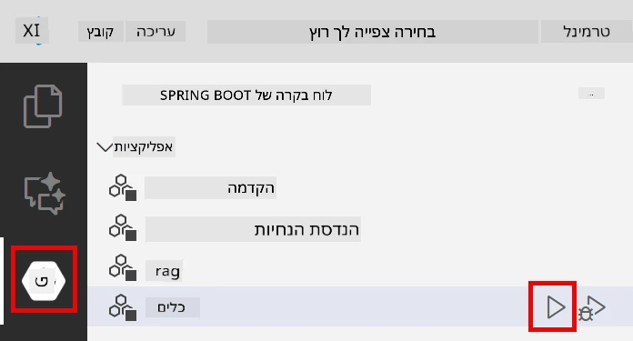
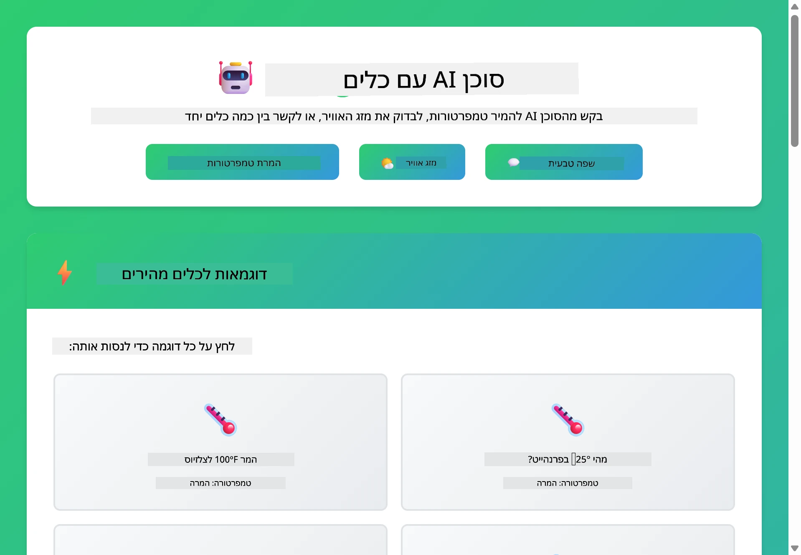
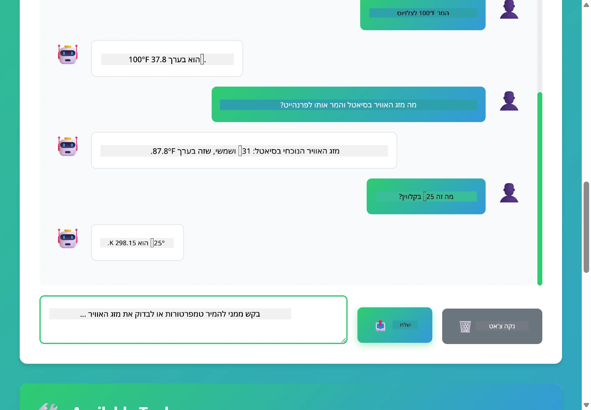

# מודול 04: סוכני AI עם כלים

## תוכן עניינים

- [סיור וידאו](#סיור-וידאו)
- [מה תלמד](#מה-תלמד)
- [דרישות מוקדמות](#דרישות-מוקדמות)
- [הבנת סוכני AI עם כלים](#הבנת-סוכני-ai-עם-כלים)
- [איך קריאת כלים עובדת](#איך-קריאת-כלים-עובדת)
  - [הגדרות כלים](#הגדרות-כלים)
  - [קבלת החלטות](#קבלת-החלטות)
  - [ביצוע](#ביצוע)
  - [יצירת תגובה](#יצירת-תגובה)
  - [ארכיטקטורה: חיבור אוטומטי ב-Spring Boot](#ארכיטקטורה-חיבור-אוטומטי-ב-spring-boot)
- [שרשור כלים](#שרשור-כלים)
- [הרצת היישום](#הרצת-היישום)
- [שימוש ביישום](#שימוש-באפליקציה)
  - [נסה שימוש פשוט בכלי](#נסה-שימוש-פשוט-בכלי)
  - [בדוק שרשור כלים](#בדוק-רצף-כלים)
  - [ראה את זרם השיחה](#ראה-את-verlauf-השיחה)
  - [התנסה בבקשות שונות](#נסה-בקשות-שונות)
- [מונחים מרכזיים](#רעיונות-מרכזיים)
  - [תבנית ReAct (היסק ופעולה)](#תבנית-react-הסקה-ופעולה)
  - [תיאורים של כלים חשובים](#תיאורי-כלים-חשובים)
  - [ניהול סשן](#ניהול-מושבים)
  - [ניהול שגיאות](#טיפול-בשגיאות)
- [כלים זמינים](#כלים-זמינים)
- [מתי להשתמש בסוכנים מבוססי כלים](#מתי-להשתמש-בסוכנים-מבוססי-כלים)
- [כלים מול RAG](#כלים-לעומת-rag)
- [שלבים הבאים](#השלבים-הבאים)

## סיור וידאו

צפו במפגש חי זה שמסביר איך להתחיל עם מודול זה:

<a href="https://www.youtube.com/watch?v=O_J30kZc0rw"></a>

## מה תלמד

עד כה למדת איך לנהל שיחות עם AI, לארגן פרומפטים ביעילות, ולבסס תגובות על המסמכים שלך. אך יש מגבלה יסודית: מודלים של שפה יכולים רק ליצור טקסט. הם לא יכולים לבדוק את מזג האוויר, לבצע חישובים, לשאול מאגרי מידע או לתקשר עם מערכות חיצוניות.

כלים משנים את זה. על ידי מתן גישה לפונקציות שהמודל יכול לקרוא להן, אתה הופך אותו מגן טקסט לסוכן שיכול לבצע פעולות. המודל מחליט מתי הוא צריך כלי, איזה כלי להשתמש, ואילו פרמטרים להעביר. הקוד שלך מבצע את הפונקציה ומחזיר את התוצאה. המודל משלב את התוצאה הזאת לתגובה שלו.

## דרישות מוקדמות

- השלמת [מודול 01 - מבוא](../01-introduction/README.md) (משאבי Azure OpenAI הוגדרו)
- מומלץ להשלים מודולים קודמים (המודול מתייחס ל[מושגי RAG ממודול 03](../03-rag/README.md) בהשוואה בין כלים ל-RAG)
- קובץ `.env` בתיקיית השורש עם אישורי Azure (נוצר על ידי `azd up` במודול 01)

> **הערה:** אם לא השלמת את מודול 01, עקוב תחילה אחר הוראות הפריסה שם.

## הבנת סוכני AI עם כלים

> **📝 הערה:** המונח "סוכנים" במודול זה מתייחס לעוזרי AI המשופרים עם יכולות קריאת כלים. זה שונה מתבניות **Agentic AI** (סוכנים אוטונומיים עם תכנון, זיכרון והיסק רב-שלבי) שנכסה ב-[מודול 05: MCP](../05-mcp/README.md).

בלי כלים, מודל שפה יכול רק ליצור טקסט מהנתונים שבהם הוא אומן. שאלה אותו לגבי מזג האוויר הנוכחי, והוא צריך לנחש. תן לו כלים, והוא יכול לקרוא ל-API של מזג אוויר, לעשות חישובים או לשאול מסד נתונים — ואז לשלב את התוצאות האמיתיות הללו בתגובתו.


*בלי כלים המודל יכול רק לנחש — עם כלים הוא יכול לקרוא ל-APIs, להריץ חישובים ולהחזיר נתונים בזמן אמת.*

סוכן AI עם כלים פועל לפי תבנית **Reasoning and Acting (ReAct)**. המודל לא רק מגיב — הוא חושב על מה שהוא צריך, פועל על ידי קריאת כלי, מתבונן בתוצאה, ואז מחליט אם לפעול שוב או לספק את התשובה הסופית:

1. **היסק** — הסוכן מנתח את שאלת המשתמש ומחליט איזה מידע הוא צריך
2. **פעולה** — הסוכן בוחר את הכלי הנכון, מייצר את הפרמטרים הנכונים, וקורא לו
3. **התבוננות** — הסוכן מקבל את הפלט של הכלי ומעריך את התוצאה
4. **חזרה או תגובה** — אם יש צורך במידע נוסף, הסוכן חוזר; אחרת, הוא מחבר תשובה בשפה טבעית


*מחזור ReAct — הסוכן הוסק מה לעשות, פועל על ידי קריאת כלי, מתבונן בתוצאה, וחוזר עד שהוא יכול לספק את התשובה הסופית.*

זה קורה אוטומטית. אתה מגדיר את הכלים ואת תיאורי הכלים שלהם. המודל מטפל בקבלת ההחלטות מתי ואיך להשתמש בהם.

## איך קריאת כלים עובדת

### הגדרות כלים

[WeatherTool.java](../../../04-tools/src/main/java/com/example/langchain4j/agents/tools/WeatherTool.java) | [TemperatureTool.java](../../../04-tools/src/main/java/com/example/langchain4j/agents/tools/TemperatureTool.java)

אתה מגדיר פונקציות עם תיאורים ברורים ומפרט של פרמטרים. המודל רואה את התיאורים הללו בפרומפט של המערכת ומבין מה כל כלי עושה.

```java
@Component
public class WeatherTool {
    
    @Tool("Get the current weather for a location")
    public String getCurrentWeather(@P("Location name") String location) {
        // הלוגיקה שלך לחיפוש מזג האוויר
        return "Weather in " + location + ": 22°C, cloudy";
    }
}

@AiService
public interface Assistant {
    String chat(@MemoryId String sessionId, @UserMessage String message);
}

// העוזר מחובר אוטומטית על ידי Spring Boot עם:
// - אובייקט ChatModel
// - כל שיטות @Tool מתוך מחלקות @Component
// - ספק זיכרון הצ'אט לניהול מושבים
```

הדיאגרמה למטה מפרקת כל אנוטציה ומראה איך כל חלק מסייע ל-AI להבין מתי לקרוא לכלי ואילו ארגומנטים להעביר:


*אנטומיה של הגדרת כלי — @Tool אומר ל-AI מתי להשתמש בו, @P מתאר כל פרמטר, ו-@AiService מחבר הכל יחד בהפעלה.*

> **🤖 נסה עם [GitHub Copilot](https://github.com/features/copilot) Chat:** פתח את [`WeatherTool.java`](../../../04-tools/src/main/java/com/example/langchain4j/agents/tools/WeatherTool.java) ושאל:
> - "איך הייתי משלב API אמיתי למזג אוויר כמו OpenWeatherMap במקום נתונים מדומים?"
> - "מה הופך תיאור כלי לטוב שמסייע ל-AI להשתמש בו נכון?"
> - "איך מטפלים בשגיאות API ומגבלות קצב ביישום כלים?"

### קבלת החלטות

כאשר משתמש שואל "מה מזג האוויר בסיאטל?", המודל לא בוחר כלי באקראי. הוא משווה את הכוונה של המשתמש מול כל תיאור כלי שברשותו, מדרג כל אחד לפי רלוונטיות, ובוחר את ההתאמה הטובה ביותר. לאחר מכן הוא מייצר קריאת פונקציה מובנית עם הפרמטרים הנכונים — במקרה זה, מגדיר את `location` ל- `"Seattle"`.

אם אין כלי שמתאים לבקשת המשתמש, המודל עובר לענות מתוך הידע שלו. אם יש התאמה למספר כלים, הוא בוחר את הספציפי ביותר.


*המודל מעריך כל כלי זמין מול כוונת המשתמש ובוחר את ההתאמה הטובה ביותר — לכן חשוב לכתוב תיאורי כלים ברורים וספציפיים.*

### ביצוע

[AgentService.java](../../../04-tools/src/main/java/com/example/langchain4j/agents/service/AgentService.java)

Spring Boot מחבר אוטומטית את הממשק ההצהרתי `@AiService` עם כל הכלים הרשומים, ו-LangChain4j מבצע קריאות כלי אוטומטית. מאחורי הקלעים, זרם קריאת כלי שלם עובר שישה שלבים — מהשאלה בשפה טבעית של המשתמש ועד התשובה בשפה טבעית:


*הזרימה מקצה לקצה — המשתמש שואל שאלה, המודל בוחר כלי, LangChain4j מבצע אותו, והמודל משלב את התוצאה בתגובה טבעית.*

מאחורי הקלעים, `AiServices` מריץ את אותו לולאת קריאת כלים לכל כלי — כאן מיוצג על ידי `Calculator` פשוט. דיאגרמת הרצף למטה מראה בדיוק מה קורה מתחת לפני השטח:


*לולאת קריאת כלי — `AiServices` שולח את ההודעה שלך ואת סכימות הכלים ל-LLM, ה-LLM מחזיר קריאת פונקציה כמו `add(42, 58)`, LangChain4j מבצע את המתודה של `Calculator` באופן מקומי, ומחזיר את התוצאה לתשובה הסופית.*

> **🤖 נסה עם [GitHub Copilot](https://github.com/features/copilot) Chat:** פתח את [`AgentService.java`](../../../04-tools/src/main/java/com/example/langchain4j/agents/service/AgentService.java) ושאל:
> - "איך תבנית ReAct עובדת ולמה היא יעילה לסוכני AI?"
> - "איך הסוכן מחליט איזה כלי להשתמש ובאיזה סדר?"
> - "מה קורה אם ביצוע כלי נכשל - איך לטפל בשגיאות בצורה אמינה?"

### יצירת תגובה

המודל מקבל את נתוני מזג האוויר ומעצב אותם לתגובה בשפה טבעית עבור המשתמש.

### ארכיטקטורה: חיבור אוטומטי ב-Spring Boot

מודול זה משתמש באינטגרציה של LangChain4j עם Spring Boot באמצעות ממשקי `@AiService` הצהרתיים. בהפעלה Spring Boot מוצא כל `@Component` שמכיל מתודות עם `@Tool`, את bean של ה-`ChatModel`, ו-`ChatMemoryProvider` — ואז מחבר אותם כולם לממשק `Assistant` יחיד ללא קוד boilerplate.


*ממשק @AiService מקשר יחד את ה-ChatModel, רכיבי הכלים, וספק הזיכרון — Spring Boot מטפל בחיבור כולו אוטומטית.*

הנה מחזור החיים המלא של הבקשה כדיאגרמת רצף — מהבקשה HTTP דרך הבקר, השירות, והפרוקסי המחובר אוטומטית, ועד לביצוע הכלי והחזרה:


*מחזור החיים המלא של בקשת Spring Boot — בקשת HTTP זורמת דרך הבקר והשירות לפרוקסי Assistant המחובר אוטומטית, שמנהל את ה-LLM וקריאות הכלים באופן אוטומטי.*

יתרונות מרכזיים של גישה זו:

- **חיבור אוטומטי ב-Spring Boot** — הזרקת ChatModel וכלים אוטומטית
- **תבנית @MemoryId** — ניהול זיכרון מבוסס סשן אוטומטי
- **מופע יחיד** — Assistant נוצר פעם אחת ומשמש שוב לביצועים טובים יותר
- **ביצוע בטוח טיפוסית** — שיטות Java נקראות ישירות עם המרת טיפוסים
- **אורקסטרציה מרובת סבבים** — מטפלת בשרשור כלים אוטומטית
- **ללא boilerplate** — אין צורך לקריאות ידניות ל-AiServices.builder() או HashMap זיכרון

גישות חלופיות (קריאות ידניות ל-AiServices.builder()) דורשות יותר קוד וחסרות את יתרונות האינטגרציה של Spring Boot.

## שרשור כלים

**שרשור כלים** — הכוח האמיתי של סוכנים מבוססי כלים מתגלה כאשר שאלה בודדת דורשת כמה כלים. שאל "מה מזג האוויר בסיאטל בפארנהייט?" והסוכן אוטומטית בשרשרת של שני כלים: קודם הוא קורא ל-`getCurrentWeather` לקבלת הטמפרטורה בצלזיוס, ואז מעביר את הערך ל-`celsiusToFahrenheit` להמרה — כל זאת בסבב שיחה יחיד.


*שרשור כלים בפעולה — הסוכן קורא קודם את getCurrentWeather, ואז מעביר את התוצאה בצלזיוס ל-celsiusToFahrenheit, ומספק תשובה משולבת.*

**כשלונות אלגנטיים** — שאל לגבי מזג האוויר בעיר שאינה בנתונים המדומים. הכלי מחזיר הודעת שגיאה, וה-AI מסביר שהוא לא יכול לעזור במקום לקרוס. כלים נכשלים בצורה בטוחה. הדיאגרמה הבאה משווה בין שתי הגישות — עם טיפול שגיאות נכון הסוכן תופס את החריגה ומגיב בעזרה, ואילו בלי זה היישום כולו קורס:


*כאשר כלי נכשל, הסוכן תופס את השגיאה ומגיב עם הסבר מועיל במקום לקרוס.*

זה קורה בסבב שיחה אחד. הסוכן מנהל ביצוע של מספר קריאות כלים באופן עצמאי.

## הרצת היישום

**וודא פריסה:**

וודא שקובץ `.env` קיים בתיקיית השורש עם האישורים של Azure (נוצר במהלך מודול 01). הרץ זאת מתיקיית המודול (`04-tools/`):

**בבש:**
```bash
cat ../.env  # צריך להציג את AZURE_OPENAI_ENDPOINT, API_KEY, DEPLOYMENT
```

**PowerShell:**
```powershell
Get-Content ..\.env  # אמור להציג את AZURE_OPENAI_ENDPOINT, API_KEY, DEPLOYMENT
```

**הפעל את היישום:**

> **הערה:** אם כבר התחלת את כל היישומים באמצעות `./start-all.sh` מתיקיית השורש (כמתואר במודול 01), מודול זה כבר רץ על פורט 8084. ניתן לדלג על פקודות ההפעלה למטה ולעבור ישירות ל-http://localhost:8084.

**אפשרות 1: שימוש ב-Spring Boot Dashboard (מומלץ למשתמשי VS Code)**

מיכל הפיתוח כולל את התוסף Spring Boot Dashboard, המציע ממשק ויזואלי לניהול כל יישומי Spring Boot. ניתן למצוא אותו בסרגל הפעילויות בצד שמאל של VS Code (חפש את הסמל של Spring Boot).

מ-Spring Boot Dashboard, ניתן:
- לראות את כל יישומי Spring Boot זמינים בסביבת העבודה
- להפעיל/להפסיק יישומים בלחיצה אחת
- לצפות ביומני היישומים בזמן אמת
- לנטר את מצב היישומים

פשוט לחץ על כפתור ההפעלה ליד "tools" כדי להפעיל את המודול הזה, או הפעל את כל המודולים בבת אחת.

כך נראה Spring Boot Dashboard ב-VS Code:


*לוח הבקרה של Spring Boot ב-VS Code — הפעלה, עצירה וניטור של כל המודולים במקום אחד*

**אפשרות 2: שימוש בסקריפטים של shell**

הפעלת כל יישומי הווב (מודולים 01-04):

**Bash:**
```bash
cd ..  # מתיקיית השורש
./start-all.sh
```

**PowerShell:**
```powershell
cd ..  # מהספרייה השורשית
.\start-all.ps1
```

או הפעל רק את המודול הזה:

**Bash:**
```bash
cd 04-tools
./start.sh
```

**PowerShell:**
```powershell
cd 04-tools
.\start.ps1
```

שני הסקריפטים טוענים אוטומטית משתני סביבה מקובץ `.env` השורש ויבנו את קבצי ה-JAR אם הם אינם קיימים.

> **הערה:** אם אתה מעדיף לבנות את כל המודולים ידנית לפני ההפעלה:
>
> **Bash:**
> ```bash
> cd ..  # Go to root directory
> mvn clean package -DskipTests
> ```
>
> **PowerShell:**
> ```powershell
> cd ..  # Go to root directory
> mvn clean package -DskipTests
> ```

פתח את http://localhost:8084 בדפדפן שלך.

**לעצירה:**

**Bash:**
```bash
./stop.sh  # מודול זה בלבד
# או
cd .. && ./stop-all.sh  # כל המודולים
```

**PowerShell:**
```powershell
.\stop.ps1  # מודול זה בלבד
# או
cd ..; .\stop-all.ps1  # כל המודולים
```

## שימוש באפליקציה

האפליקציה מספקת ממשק ווב בו ניתן לתקשר עם סוכן AI שיש לו גישה לכלי מזג אוויר והמרת טמפרטורה. כך נראה הממשק — כולל דוגמאות התחלה מהירה ופאנל שיחה לשליחת בקשות:

<a href="images/tools-homepage.png"></a>

*ממשק כלי סוכן AI - דוגמאות מהירות וממשק שיחה לאינטראקציה עם כלים*

### נסה שימוש פשוט בכלי

התחל עם בקשה פשוטה: "המר 100 מעלות פרנהייט לצלזיוס". הסוכן מזהה שהוא צריך את כלי המרת הטמפרטורה, מפעיל אותו עם הפרמטרים הנכונים ומחזיר את התוצאה. שים לב כמה זה טבעי - לא ציינת איזה כלי להשתמש או איך להפעיל אותו.

### בדוק רצף כלים

עכשיו נסה משהו מורכב יותר: "מה מזג האוויר בסיאטל והמר את זה לפרנהייט?" צפה איך הסוכן עובד על זה בשלבים. הוא מקבל קודם את מזג האוויר (שמחזיר צלזיוס), מזהה שהוא צריך להמיר לפרנהייט, מפעיל את כלי ההמרה ומשלב את שתי התוצאות בתגובה אחת.

### ראה את Verlauf השיחה

ממשק השיחה שומר היסטוריית שיחה, ומאפשר לך לקיים אינטראקציות מרובות סבבים. תוכל לראות את כל השאלות והתשובות הקודמות, מה שמקל לעקוב אחרי השיחה ולהבין איך הסוכן בונה הקשר במהלך החלפות מרובות.

<a href="images/tools-conversation-demo.png"></a>

*שיחת מרובות סבבים המציגה המרות פשוטות, בדיקות מזג אוויר ורצף כלים*

### נסה בקשות שונות

נסה שילובים שונים:
- בדיקות מזג אוויר: "מה מזג האוויר בטוקיו?"
- המרות טמפרטורה: "כמה זה 25°C בקלווין?"
- שאילתות משולבות: "בדוק את מזג האוויר בפריז ואמר לי אם מעל 20°C"

שימו לב איך הסוכן מפרש שפה טבעית וממפה לכך קריאות כלים מתאימות.

## רעיונות מרכזיים

### תבנית ReAct (הסקה ופעולה)

הסוכן מתחלף בין הסקה (החלטה מה לעשות) לבין פעולה (שימוש בכלים). תבנית זו מאפשרת פתרון בעיות עצמאי במקום רק תגובה להוראות.

### תיאורי כלים חשובים

איכות תיאורי הכלים שלך משפיעה ישירות על איך הסוכן משתמש בהם. תיאורים ברורים ומפורשים עוזרים למודל להבין מתי ואיך לקרוא לכל כלי.

### ניהול מושבים

האנוטציה `@MemoryId` מאפשרת ניהול זיכרון מבוסס מושב באופן אוטומטי. לכל מזהה מושב יש מופע `ChatMemory` מנוהל על ידי ה-bean `ChatMemoryProvider`, כך שמספר משתמשים יכולים לתקשר עם הסוכן בו זמנית מבלי שהשיחות שלהם יתערבבו. התמונה הבאה מראה איך משתמשים מרובים מנותבים למחסני זיכרון מבודדים בהתבסס על מזהי המושבים שלהם:


*לכל מזהה מושב יש היסטוריית שיחה מבודדת — משתמשים לעולם אינם רואים את ההודעות של אחרים.*

### טיפול בשגיאות

כלים יכולים להיכשל — APIים נגמרים בזמן, פרמטרים עלולים להיות לא חוקיים, שירותים חיצוניים נופלים. סוכני ייצור צריכים טיפול בשגיאות כדי שהמודל יוכל להסביר בעיות או לנסות אלטרנטיבות במקום לקרוס כל האפליקציה. כשכלי זורק חריגה, LangChain4j תופס אותה ומחזיר את הודעת השגיאה למודל, שיכול אז להסביר את הבעיה בשפה טבעית.

## כלים זמינים

התמונה להלן מראה את האקוסיסטם הרחב של כלים שאפשר לבנות. מודול זה מדגים כלים של מזג אוויר וטמפרטורה, אך אותה תבנית `@Tool` עובדת עם כל שיטת Java — משאילתות מסד נתונים לעיבוד תשלומים.


*כל שיטת Java המסומנת ב-@Tool הופכת לזמינה לסוכן AI — התבנית מתרחבת למסדי נתונים, APIים, דוא"ל, פעולות קבצים ועוד.*

## מתי להשתמש בסוכנים מבוססי כלים

לא כל בקשה דורשת כלים. ההחלטה תלויה אם ה-AI צריך אינטראקציה עם מערכות חיצוניות או יכול לענות מהידע שלו בלבד. המדריך הבא מסכם מתי כלים מוסיפים ערך ומתי הם מיותרים:


*מדריך החלטה מהיר — כלים מיועדים לנתונים בזמן אמת, חישובים ופעולות; ידע כללי ומשימות יצירתיות לא דורשים אותם.*

## כלים לעומת RAG

מודולים 03 ו-04 מגדילים את יכולות ה-AI, אך בדרכים שונות באופן יסודי. RAG נותן למודל גישה ל**ידע** על ידי אחזור מסמכים. כלים מאפשרים למודל לבצע **פעולות** באמצעות קריאות לפונקציות. התמונה הבאה משווה בין שתי הגישות זו לצד זו — מהאופן בו כל זרימת עבודה פועלת ועד לפשרות ביניהן:


*RAG מושך מידע ממסמכים סטטיים — כלים מבצעים פעולות ואוספים נתונים דינמיים בזמן אמת. רבים ממערכות הייצור משלבות את שניהם.*

בהכרח, מערכות ייצור רבות משלבות בין שתי הגישות: RAG להנחלת תשובות בתיעוד שלך, וכלים לאיסוף נתונים חיים או ביצוע פעולות.

## השלבים הבאים

**מודול הבא:** [05-mcp - פרוטוקול הקשר למודל (MCP)](../05-mcp/README.md)

---

**ניווט:** [← הקודם: מודול 03 - RAG](../03-rag/README.md) | [חזרה לעמוד הראשי](../README.md) | [הבא: מודול 05 - MCP →](../05-mcp/README.md)

---

<!-- CO-OP TRANSLATOR DISCLAIMER START -->
**כתב ויתור**:
מסמך זה תורגם באמצעות שירות תרגום אוטומטי [Co-op Translator](https://github.com/Azure/co-op-translator). למרות שאנו שואפים לדיוק, יש לקחת בחשבון שתרגומים אוטומטיים עלולים להכיל שגיאות או אי-דיוקים. יש להחשיב את המסמך המקורי בשפתו הטבעית כמקור הסמכות. למידע קריטי מומלץ להשתמש בתרגום מקצועי על ידי מתרגם אדם. אנו לא אחראים לכל אי-הבנה או פירוש שגוי הנובע מהשימוש בתרגום זה.
<!-- CO-OP TRANSLATOR DISCLAIMER END -->