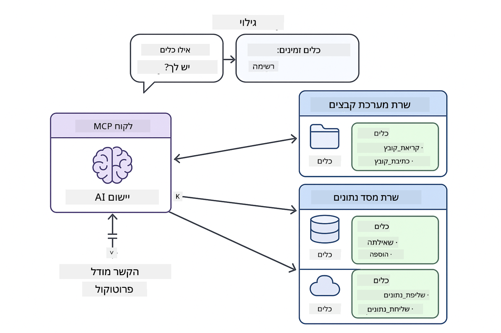
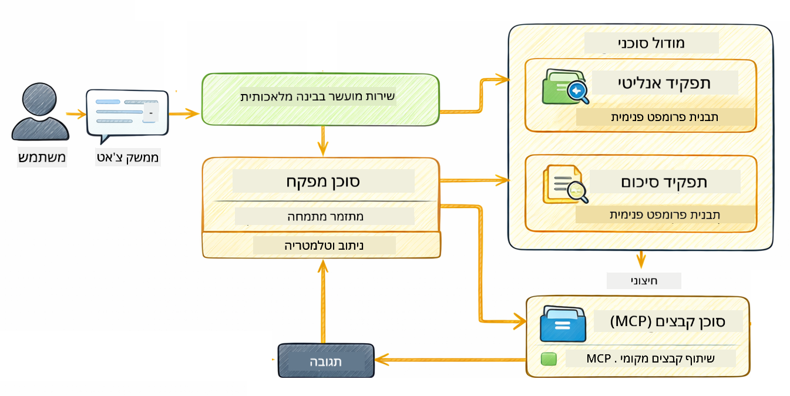

<!--
CO_OP_TRANSLATOR_METADATA:
{
  "original_hash": "6c816d130a1fa47570c11907e72d84ae",
  "translation_date": "2026-01-06T00:09:25+00:00",
  "source_file": "05-mcp/README.md",
  "language_code": "he"
}
-->
# פרק 05: פרוטוקול הקשר מודל (MCP)

## תוכן העניינים

- [מה תלמדו](../../../05-mcp)
- [מהו MCP?](../../../05-mcp)
- [כיצד MCP עובד](../../../05-mcp)
- [המודול האג'נטי](../../../05-mcp)
- [הפעלת הדוגמאות](../../../05-mcp)
  - [דרישות מוקדמות](../../../05-mcp)
- [התחלה מהירה](../../../05-mcp)
  - [פעולות על קבצים (Stdio)](../../../05-mcp)
  - [אג'נט המפקח](../../../05-mcp)
    - [הבנת הפלט](../../../05-mcp)
    - [אסטרטגיות תגובה](../../../05-mcp)
    - [הסבר על תכונות המודול האג'נטי](../../../05-mcp)
- [מושגים מרכזיים](../../../05-mcp)
- [ברכות!](../../../05-mcp)
  - [מה הלאה?](../../../05-mcp)

## מה תלמדו

בנייתם AI שיחתי, שלטתם בפרומפטים, יישבתם תגובות על מסמכים, ויצרתם סוכנים עם כלים. אבל כל אותם כלים היו מותאמים במיוחד עבור היישום הספציפי שלכם. מה אם יכולתם לתת ל-AI שלכם גישה למערכת כלים סטנדרטית שמישהו יכול ליצור ולשתף? בפרק זה תלמדו איך לעשות זאת עם פרוטוקול הקשר מודל (MCP) והמודול האג'נטי של LangChain4j. ראשית נציג קורא קבצים פשוט של MCP ואחר כך נראה כיצד הוא משתלב בקלות בזרימות עבודה אג'נטיות מתקדמות באמצעות תבנית אג'נט המפקח.

## מהו MCP?

פרוטוקול הקשר מודל (MCP) מספק בדיוק את זה - דרך סטנדרטית לאפליקציות AI לגלות ולהשתמש בכלים חיצוניים. במקום לכתוב אינטגרציות מותאמות לכל מקור נתונים או שירות, אתם מתחברים לשרתים MCP שמציגים את היכולות שלהם בפורמט עקבי. האג'נט שלכם יכול אז לגלות ולהשתמש בכלים אלו באופן אוטומטי.


*לפני MCP: אינטגרציות מורכבות נקודה-לנקודה. אחרי MCP: פרוטוקול אחד, אפשרויות אינסופיות.*

MCP פותר בעיה יסודית בפיתוח AI: כל אינטגרציה מותאמת. רוצים גישה ל-GitHub? קוד מותאם. רוצים לקרוא קבצים? קוד מותאם. רוצים לשאול מסד נתונים? קוד מותאם. ואף אחת מהאינטגרציות האלה לא עובדת עם אפליקציות AI אחרות.

MCP מסטנדרט את זה. שרת MCP מציג כלים עם תיאורים וסקימות ברורות. כל לקוח MCP יכול להתחבר, לגלות כלים זמינים, ולהשתמש בהם. בנו פעם אחת, השתמשו בכל מקום.



*ארכיטקטורת פרוטוקול הקשר מודל - גילוי וביצוע כלים סטנדרטים*

## כיצד MCP עובד

**ארכיטקטורת שרת-לקוח**

MCP משתמש במודל לקוח-שרת. שרתים מספקים כלים - קריאת קבצים, שאילתות למסדי נתונים, קריאות API. לקוחות (האפליקציה שלכם) מתחברים לשרתים ומשתמשים בכלים שלהם.

כדי להשתמש ב-MCP עם LangChain4j, הוסיפו את התלות הבאה ב-Maven:

```xml
<dependency>
    <groupId>dev.langchain4j</groupId>
    <artifactId>langchain4j-mcp</artifactId>
    <version>${langchain4j.version}</version>
</dependency>
```

**גילוי כלים**

כאשר הלקוח שלכם מתחבר לשרת MCP, הוא שואל "אילו כלים יש לך?" השרת משיב ברשימה של כלים זמינים, כל אחד עם תיאורים וסקימות פרמטרים. האג'נט שלכם יכול אז להחליט אילו כלים להשתמש בהתאם לבקשות המשתמש.

**מנגנוני תעבורה**

MCP תומך במנגנוני תעבורה שונים. פרק זה מדגים את תעבורת ה-Stdio עבור תהליכים מקומיים:


*מנגנוני תעבורה ב-MCP: HTTP לשרתים מרוחקים, Stdio לתהליכים מקומיים*

**Stdio** - [StdioTransportDemo.java](../../../05-mcp/src/main/java/com/example/langchain4j/mcp/StdioTransportDemo.java)

לשימוש בתהליכים מקומיים. האפליקציה שלכם מפעילה שרת כתת-תהליך ומתקשרת דרך קלט/פלט סטנדרטי. שימושי לגישה למערכת הקבצים או לכלים בשורת הפקודה.

```java
McpTransport stdioTransport = new StdioMcpTransport.Builder()
    .command(List.of(
        npmCmd, "exec",
        "@modelcontextprotocol/server-filesystem@2025.12.18",
        resourcesDir
    ))
    .logEvents(false)
    .build();
```

> **🤖 נסו עם [GitHub Copilot](https://github.com/features/copilot) Chat:** פתחו את [`StdioTransportDemo.java`](../../../05-mcp/src/main/java/com/example/langchain4j/mcp/StdioTransportDemo.java) ושאלו:
> - "כיצד תעבורת Stdio פועלת ומתי כדאי להשתמש בה לעומת HTTP?"
> - "כיצד LangChain4j מנהל את מחזור החיים של תהליכי שרת MCP שמשם הוא מפעיל?"
> - "מהן ההשלכות הביטחוניות במתן גישה ל-AI למערכת הקבצים?"

## המודול האג'נטי

בעוד ש-MCP מספק כלים סטנדרטיים, המודול האג'נטי של LangChain4j מספק דרך הכרזתית לבניית סוכנים שמארגנים את הכלים האלה. התגית `@Agent` ו-`AgenticServices` מאפשרות להגדיר את התנהגות הסוכן דרך ממשקים במקום קוד אימפרטיבי.

בפרק זה תיחקרו את תבנית **אג'נט המפקח** — גישה אג'נטית מתקדמת שבה סוכן "מפקח" מחליט באופן דינמי אילו תתי-סוכנים להפעיל בהתבסס על בקשות המשתמש. נשילב את שני המושגים על ידי מתן יכולות גישה לקבצים עם MCP לאחד מהתתי-סוכנים.

להשתמש במודול האג'נטי, הוסיפו תלות Maven זו:

```xml
<dependency>
    <groupId>dev.langchain4j</groupId>
    <artifactId>langchain4j-agentic</artifactId>
    <version>${langchain4j.mcp.version}</version>
</dependency>
```

> **⚠️ ניסיוני:** המודול `langchain4j-agentic` הוא **ניסיוני** ועשוי להשתנות. הדרך היציבה לבניית עוזרי AI היא עדיין באמצעות `langchain4j-core` עם כלים מותאמים אישית (פרק 04).

## הפעלת הדוגמאות

### דרישות מוקדמות

- Java 21+, Maven 3.9+
- Node.js 16+ ו-npm (לשרתי MCP)
- משתני סביבה מוגדרים בקובץ `.env` (מתיקיית השורש):
  - `AZURE_OPENAI_ENDPOINT`, `AZURE_OPENAI_API_KEY`, `AZURE_OPENAI_DEPLOYMENT` (כמו בפרקים 01-04)

> **הערה:** אם עדיין לא הגדרתם את משתני הסביבה שלכם, ראו [פרק 00 - התחלה מהירה](../00-quick-start/README.md) להנחיות, או העתיקו `.env.example` ל-`.env` בתיקיית השורש ומלאו את הערכים שלכם.

## התחלה מהירה

**בשימוש ב-VS Code:** פשוט לחצו קליק ימני על כל קובץ הדגמה במגלה הקבצים ובחרו **"Run Java"**, או השתמשו בתצורות ההפעלה מלוח הריצה והדיבוג (ודאו שהוספתם את הטוקן לקובץ `.env` קודם).

**בשימוש ב-Maven:** בנוסף, ניתן להריץ מהשורת פקודה עם הדוגמאות למטה.

### פעולות על קבצים (Stdio)

מציג כלים מבוססי תת-תהליך מקומי.

**✅ אין דרישות מוקדמות** - שרת MCP מופעל אוטומטית.

**שימוש בסקריפטים להפעלה (מומלץ):**

הסקריפטים טוענים אוטומטית משתני סביבה מקובץ `.env` בתיקיית השורש:

**Bash:**
```bash
cd 05-mcp
chmod +x start-stdio.sh
./start-stdio.sh
```

**PowerShell:**
```powershell
cd 05-mcp
.\start-stdio.ps1
```

**בשימוש ב-VS Code:** לחצו קליק ימני על `StdioTransportDemo.java` ובחרו **"Run Java"** (ודאו שקובץ `.env` מוגדר).

האפליקציה מפעילה שרת MCP למערכת הקבצים אוטומטית וקוראת קובץ מקומי. שימו לב כיצד ניהול תת-ההליך מתבצע עבורכם.

**פלט צפוי:**
```
Assistant response: The file provides an overview of LangChain4j, an open-source Java library
for integrating Large Language Models (LLMs) into Java applications...
```

### אג'נט המפקח

תבנית **אג'נט מפקח** היא צורת AI אג'נטית **גמישה**. מפקח משתמש ב-LLM כדי להחליט באופן עצמאי אילו סוכנים להפעיל בהתבסס על בקשת המשתמש. בדוגמה הבאה, נשלב גישת קבצים מבוססת MCP עם אג'נט LLM ליצירת זרימת עבודה מפוקחת של קריאת קובץ → דוח.

בדמו, `FileAgent` קורא קובץ באמצעות כלי מערכת הקבצים MCP, ו-`ReportAgent` מייצר דוח מובנה עם סיכום מנהלים (משפט אחד), 3 נקודות מפתח והמלצות. המפקח מארגן את הזרימה הזו באופן אוטומטי:



```
┌─────────────┐      ┌──────────────┐
│  FileAgent  │ ───▶ │ ReportAgent  │
│ (MCP tools) │      │  (pure LLM)  │
└─────────────┘      └──────────────┘
   outputKey:           outputKey:
  'fileContent'         'report'
```

כל סוכן מאחסן את הפלט שלו ב**Agentic Scope** (זיכרון משותף), מה שמאפשר לסוכנים במורד הזרם לגשת לתוצאות קודמות. זה ממחיש כיצד כלים של MCP משתלבים בצורה חלקה בזרימות עבודה אג'נטיות — מפקח אינו צריך לדעת *איך* הקבצים נקראים, רק ש-`FileAgent` יכול לעשות זאת.

#### הפעלת הדמו

הסקריפטים טוענים אוטומטית משתני סביבה מקובץ `.env` בתיקיית השורש:

**Bash:**
```bash
cd 05-mcp
chmod +x start-supervisor.sh
./start-supervisor.sh
```

**PowerShell:**
```powershell
cd 05-mcp
.\start-supervisor.ps1
```

**בשימוש ב-VS Code:** לחצו קליק ימני על `SupervisorAgentDemo.java` ובחרו **"Run Java"** (ודאו שקובץ `.env` מוגדר).

#### כיצד המפקח פועל

```java
// שלב 1: FileAgent קורא קבצים באמצעות כלי MCP
FileAgent fileAgent = AgenticServices.agentBuilder(FileAgent.class)
        .chatModel(model)
        .toolProvider(mcpToolProvider)  // כולל כלי MCP לפעולות קבצים
        .build();

// שלב 2: ReportAgent מייצר דוחות מובנים
ReportAgent reportAgent = AgenticServices.agentBuilder(ReportAgent.class)
        .chatModel(model)
        .build();

// המפקח מארגן את זרימת העבודה של הקובץ → הדוח
SupervisorAgent supervisor = AgenticServices.supervisorBuilder()
        .chatModel(model)
        .subAgents(fileAgent, reportAgent)
        .responseStrategy(SupervisorResponseStrategy.LAST)  // החזר את הדוח הסופי
        .build();

// המפקח מחליט אילו סוכנים להפעיל בהתאם לבקשה
String response = supervisor.invoke("Read the file at /path/file.txt and generate a report");
```

#### אסטרטגיות תגובה

כאשר מגדירים `SupervisorAgent`, אתם מציינים כיצד עליו לנסח את התשובה הסופית למשתמש אחרי שתתי-הסוכנים השלים את משימותיהם. האסטרטגיות הזמינות הן:

| אסטרטגיה | תיאור |
|----------|--------|
| **LAST** | המפקח מחזיר את הפלט של תת-הסוכן או הכלי האחרון שהופעל. שימושי כאשר האג'נט הסופי בזרימת העבודה מיועד במיוחד לספק את התשובה הסופית המלאה (למשל, "אג'נט סיכום" בצנרת מחקר). |
| **SUMMARY** | המפקח משתמש במודל השפה הפנימי שלו (LLM) לסנתז סיכום של כל האינטראקציה וכל פלטי תתי-הסוכנים, ואז מחזיר את הסיכום כתשובה סופית. זה מספק תשובה נקייה ומאוחדת למשתמש. |
| **SCORED** | המערכת משתמשת ב-LLM פנימי לדירוג הן את התגובה האחרונה (LAST) והן את הסיכום (SUMMARY) של האינטראקציה ביחס לבקשת המשתמש המקורית, ומחזירה את התוצאה עם הדירוג הגבוה יותר. |

ראו את [SupervisorAgentDemo.java](../../../05-mcp/src/main/java/com/example/langchain4j/mcp/SupervisorAgentDemo.java) למימוש המלא.

> **🤖 נסו עם [GitHub Copilot](https://github.com/features/copilot) Chat:** פתחו את [`SupervisorAgentDemo.java`](../../../05-mcp/src/main/java/com/example/langchain4j/mcp/SupervisorAgentDemo.java) ושאלו:
> - "כיצד המפקח מחליט אילו סוכנים להפעיל?"
> - "מה ההבדל בין תבניות המפקח וזרימת עבודה סדרתית?"
> - "איך אפשר להתאים אישית את התכנון של המפקח?"

#### הבנת הפלט

כשאתם מפעילים את הדמו, תראו מדריך מובנה של כיצד המפקח מארגן מספר סוכנים. להלן משמעות כל חלק:

```
======================================================================
  FILE → REPORT WORKFLOW DEMO
======================================================================

This demo shows a clear 2-step workflow: read a file, then generate a report.
The Supervisor orchestrates the agents automatically based on the request.
```

**הכותרת** מציגה את רעיון זרימת העבודה: צנרת ממוקדת מקריאת קבצים ליצירת דוח.

```
--- WORKFLOW ---------------------------------------------------------
  ┌─────────────┐      ┌──────────────┐
  │  FileAgent  │ ───▶ │ ReportAgent  │
  │ (MCP tools) │      │  (pure LLM)  │
  └─────────────┘      └──────────────┘
   outputKey:           outputKey:
   'fileContent'        'report'

--- AVAILABLE AGENTS -------------------------------------------------
  [FILE]   FileAgent   - Reads files via MCP → stores in 'fileContent'
  [REPORT] ReportAgent - Generates structured report → stores in 'report'
```

**דיאגרמת זרימת עבודה** מראה את זרימת הנתונים בין הסוכנים. לכל סוכן תפקיד ספציפי:
- **FileAgent** קורא קבצים באמצעות כלים של MCP ומאחסן את התוכן הגולמי ב-`fileContent`
- **ReportAgent** צורך את התוכן ויוצר דוח מובנה ב-`report`

```
--- USER REQUEST -----------------------------------------------------
  "Read the file at .../file.txt and generate a report on its contents"
```

**בקשת המשתמש** מציגה את המשימה. המפקח מפרש זאת ומחליט להפעיל FileAgent → ReportAgent.

```
--- SUPERVISOR ORCHESTRATION -----------------------------------------
  The Supervisor decides which agents to invoke and passes data between them...

  +-- STEP 1: Supervisor chose -> FileAgent (reading file via MCP)
  |
  |   Input: .../file.txt
  |
  |   Result: LangChain4j is an open-source, provider-agnostic Java framework for building LLM...
  +-- [OK] FileAgent (reading file via MCP) completed

  +-- STEP 2: Supervisor chose -> ReportAgent (generating structured report)
  |
  |   Input: LangChain4j is an open-source, provider-agnostic Java framew...
  |
  |   Result: Executive Summary...
  +-- [OK] ReportAgent (generating structured report) completed
```

**הארגון של המפקח** מציג את זרימת הפעולות בשני שלבים:
1. **FileAgent** קורא את הקובץ דרך MCP ומאחסן את התוכן
2. **ReportAgent** מקבל את התוכן ומייצר דוח מובנה

המפקח קיבל החלטות אלה **באופן עצמאי** בהתבסס על בקשת המשתמש.

```
--- FINAL RESPONSE ---------------------------------------------------
Executive Summary
...

Key Points
...

Recommendations
...

--- AGENTIC SCOPE (Data Flow) ----------------------------------------
  Each agent stores its output for downstream agents to consume:
  * fileContent: LangChain4j is an open-source, provider-agnostic Java framework...
  * report: Executive Summary...
```

#### הסבר על תכונות המודול האג'נטי

הדוגמה מציגה מספר תכונות מתקדמות של המודול האג'נטי. נבחן מקרוב את Agentic Scope ומאזיני האג'נט.

**Agentic Scope** מציג את הזיכרון המשותף שבו הסוכנים אחסנו את התוצאות שלהם באמצעות `@Agent(outputKey="...")`. זה מאפשר:
- לסוכנים הבאים לגשת לפלטים של סוכנים קודמים
- למפקח לסנתז תגובה סופית
- לכם לבדוק מה כל סוכן הפיק

```java
ResultWithAgenticScope<String> result = supervisor.invokeWithAgenticScope(request);
AgenticScope scope = result.agenticScope();
String fileContent = scope.readState("fileContent");  // נתוני קובץ גולמיים מ-FileAgent
String report = scope.readState("report");            // דוח מובנה מ-ReportAgent
```

**מאזיני אג'נט** מאפשרים ניטור ודיבוג של ביצועי הסוכן. הפלט שלב אחר שלב שאתם רואים בדמו מגיע מ-AgentListener שחובר לכל קריאה לסוכן:
- **beforeAgentInvocation** - נקרא כאשר המפקח בוחר סוכן, כדי שתוכלו לראות איזה סוכן נבחר ולמה
- **afterAgentInvocation** - נקרא כאשר סוכן מסיים, ומציג את התוצאה שלו
- **inheritedBySubagents** - כשערך זה הוא אמת, המאזין עוקב אחר כל הסוכנים בהיררכיה

```java
AgentListener monitor = new AgentListener() {
    private int step = 0;
    
    @Override
    public void beforeAgentInvocation(AgentRequest request) {
        step++;
        System.out.println("  +-- STEP " + step + ": " + request.agentName());
    }
    
    @Override
    public void afterAgentInvocation(AgentResponse response) {
        System.out.println("  +-- [OK] " + response.agentName() + " completed");
    }
    
    @Override
    public boolean inheritedBySubagents() {
        return true; // להפיץ לכל תת-הסוכנים
    }
};
```

מעבר לתבנית המפקח, מודול `langchain4j-agentic` מספק מספר תבניות זרימת עבודה ותכונות עוצמתיות:

| תבנית | תיאור | מקרה שימוש |
|---------|-------------|----------|
| **Sequential** | הפעלת סוכנים לפי סדר, פלט עובר לאחד הבא | צנרות: מחקר → ניתוח → דוח |
| **Parallel** | הרצת סוכנים במקביל | משימות עצמאיות: מזג אוויר + חדשות + מניות |
| **Loop** | איטרציה עד לתנאי מסוים | דירוג איכות: שיפור עד שהציון ≥ 0.8 |
| **Conditional** | ניתוב על פי תנאים | סיווג → ניתוב לאג'נט מומחה |
| **Human-in-the-Loop** | הוספת נקודות ביקורת אנושיות | זרימות אישור, ביקורת תוכן |

## מושגים מרכזיים

עכשיו שכבר חקרתם MCP והמודול האג'נטי בפעולה, נסכם מתי כדאי להשתמש בכל גישה.

**MCP** אידיאלי כאשר רוצים ליהנות ממערכות כלי קיימות, לבנות כלים שניתן לשתף בין מספר אפליקציות, לשלב שירותי צד שלישי עם פרוטוקולים סטנדרטיים, או להחליף מימושים של כלים בלי לשנות קוד.

**המודול האג'נטי** מתאים יותר כאשר רוצים הגדרות סוכן הכרזתיות עם תגיות `@Agent`, צריכים ארגון זרימת עבודה (סדרתי, לולאה, מקבילי), מעדיפים עיצוב סוכנים מבוסס ממשקים על פני קוד אימפרטיבי, או משלבים מספר סוכנים שמשתפים פלטים דרך `outputKey`.

**תבנית אג'נט המפקח** מתבלת כאשר זרימת העבודה אינה ניתנת לחיזוי מראש ורוצים שה-LLM יחליט, כשיש סוכנים מקצועיים מרובים שדורשים ארגון דינמי, כשבונים מערכות שיח שמפנות ליכולות שונות, או כאשר רוצים את ההתנהגות הסוכנית הגמישה והמתאימה ביותר.
## מזל טוב!

סיימת את קורס LangChain4j למתחילים. למדת:

- איך לבנות AI שיחתי עם זיכרון (מודול 01)
- תבניות הנדסת פרומפט למשימות שונות (מודול 02)
- עיגון תגובות במסמכים שלך עם RAG (מודול 03)
- יצירת סוכני AI בסיסיים (עוזרים) עם כלים מותאמים אישית (מודול 04)
- שילוב כלים סטנדרטיים עם מודולי MCP ו-Agentic של LangChain4j (מודול 05)

### מה הלאה?

לאחר שסיימת את המודולים, עיין ב-[מדריך הבדיקות](../docs/TESTING.md) כדי לראות את מושגי הבדיקה של LangChain4j בפעולה.

**משאבים רשמיים:**
- [תיעוד LangChain4j](https://docs.langchain4j.dev/) - מדריכים מפורטים ו-reference API
- [LangChain4j GitHub](https://github.com/langchain4j/langchain4j) - קוד מקור ודוגמאות
- [מדריכי LangChain4j](https://docs.langchain4j.dev/tutorials/) - מדריכים שלב אחרי שלב למגוון מקרים

תודה שסיימת את הקורס הזה!

---

**ניווט:** [← קודם: מודול 04 - כלים](../04-tools/README.md) | [חזרה לעמוד הראשי](../README.md)

---

<!-- CO-OP TRANSLATOR DISCLAIMER START -->
**כתב ויתור**:  
מסמך זה תורגם באמצעות שירות תרגום מבוסס בינה מלאכותית [Co-op Translator](https://github.com/Azure/co-op-translator). למרות שאנו שואפים לדיוק, יש לקחת בחשבון שתרגומים אוטומטיים עלולים לכלול שגיאות או אי-דיוקים. המסמך המקורי בשפת המקור שלו נחשב למקור הסמכותי. עבור מידע קריטי מומלץ לתרגם בעזרת מתרגם מקצועי אנושי. אנו לא אחראים לכל אי-הבנות או פרשנויות שגויות הנובעות משימוש בתרגום זה.
<!-- CO-OP TRANSLATOR DISCLAIMER END -->