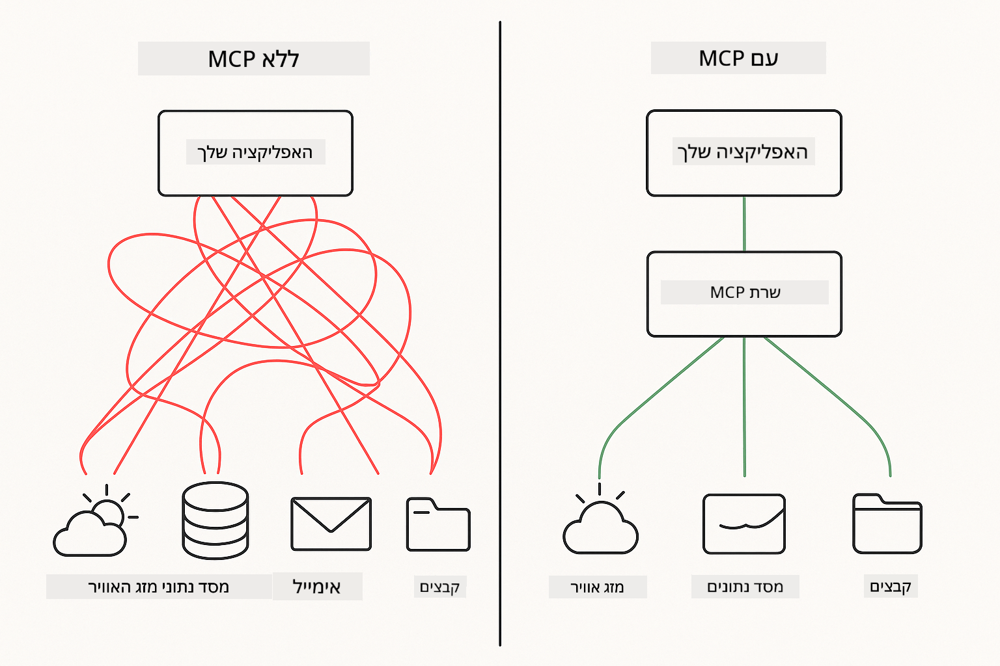

<!--
CO_OP_TRANSLATOR_METADATA:
{
  "original_hash": "c25ec1f10ef156c53e190cdf8b0711ab",
  "translation_date": "2025-12-13T17:58:11+00:00",
  "source_file": "05-mcp/README.md",
  "language_code": "he"
}
-->
# מודול 05: פרוטוקול הקשר מודל (MCP)

## תוכן העניינים

- [מה תלמדו](../../../05-mcp)
- [הבנת MCP](../../../05-mcp)
- [איך MCP עובד](../../../05-mcp)
  - [ארכיטקטורת שרת-לקוח](../../../05-mcp)
  - [גילוי כלים](../../../05-mcp)
  - [מנגנוני העברה](../../../05-mcp)
- [דרישות מוקדמות](../../../05-mcp)
- [מה מכסה מודול זה](../../../05-mcp)
- [התחלה מהירה](../../../05-mcp)
  - [דוגמה 1: מחשבון מרוחק (HTTP סטרימבילי)](../../../05-mcp)
  - [דוגמה 2: פעולות קבצים (Stdio)](../../../05-mcp)
  - [דוגמה 3: ניתוח Git (Docker)](../../../05-mcp)
- [מושגים מרכזיים](../../../05-mcp)
  - [בחירת העברה](../../../05-mcp)
  - [גילוי כלים](../../../05-mcp)
  - [ניהול מושבים](../../../05-mcp)
  - [שיקולים בין פלטפורמות](../../../05-mcp)
- [מתי להשתמש ב-MCP](../../../05-mcp)
- [אקוסיסטם MCP](../../../05-mcp)
- [ברכות!](../../../05-mcp)
  - [מה הלאה?](../../../05-mcp)
- [פתרון תקלות](../../../05-mcp)

## מה תלמדו

בניתם בינה מלאכותית שיחה, שלטתם בפרומפטים, עיגנתם תגובות במסמכים ויצרתם סוכנים עם כלים. אבל כל הכלים האלה נבנו בהתאמה אישית עבור היישום הספציפי שלכם. מה אם יכולתם לתת לבינה המלאכותית שלכם גישה לאקוסיסטם סטנדרטי של כלים שכל אחד יכול ליצור ולשתף?

פרוטוקול הקשר מודל (MCP) מספק בדיוק את זה - דרך סטנדרטית לאפליקציות AI לגלות ולהשתמש בכלים חיצוניים. במקום לכתוב אינטגרציות מותאמות אישית לכל מקור נתונים או שירות, אתם מתחברים לשרתי MCP שמציגים את היכולות שלהם בפורמט עקבי. הסוכן שלכם יכול אז לגלות ולהשתמש בכלים האלה באופן אוטומטי.



*לפני MCP: אינטגרציות מורכבות נקודה-נקודה. אחרי MCP: פרוטוקול אחד, אפשרויות אינסופיות.*

## הבנת MCP

MCP פותר בעיה יסודית בפיתוח AI: כל אינטגרציה היא מותאמת אישית. רוצים לגשת ל-GitHub? קוד מותאם. רוצים לקרוא קבצים? קוד מותאם. רוצים לשאול מסד נתונים? קוד מותאם. ואף אחת מהאינטגרציות האלה לא עובדת עם אפליקציות AI אחרות.

MCP מסטנדרט את זה. שרת MCP מציג כלים עם תיאורים ברורים וסכימות. כל לקוח MCP יכול להתחבר, לגלות כלים זמינים ולהשתמש בהם. בנו פעם, השתמשו בכל מקום.


*ארכיטקטורת פרוטוקול הקשר מודל - גילוי והפעלה סטנדרטיים של כלים*

## איך MCP עובד

**ארכיטקטורת שרת-לקוח**

MCP משתמש במודל לקוח-שרת. שרתים מספקים כלים - קריאת קבצים, שאילתות מסדי נתונים, קריאות API. לקוחות (האפליקציה שלכם) מתחברים לשרתים ומשתמשים בכלים שלהם.

**גילוי כלים**

כאשר הלקוח שלכם מתחבר לשרת MCP, הוא שואל "אילו כלים יש לכם?" השרת משיב ברשימת כלים זמינים, כל אחד עם תיאורים וסכימות פרמטרים. הסוכן שלכם יכול אז להחליט אילו כלים להשתמש בהתבסס על בקשות המשתמש.

**מנגנוני העברה**

MCP מגדיר שני מנגנוני העברה: HTTP לשרתים מרוחקים, Stdio לתהליכים מקומיים (כולל מכולות Docker):


*מנגנוני העברה של MCP: HTTP לשרתים מרוחקים, Stdio לתהליכים מקומיים (כולל מכולות Docker)*

**HTTP סטרימבילי** - [StreamableHttpDemo.java](../../../05-mcp/src/main/java/com/example/langchain4j/mcp/StreamableHttpDemo.java)

לשרתים מרוחקים. האפליקציה שלכם מבצעת בקשות HTTP לשרת שרץ איפשהו ברשת. משתמש ב-Server-Sent Events לתקשורת בזמן אמת.

```java
McpTransport httpTransport = new StreamableHttpMcpTransport.Builder()
    .url("http://localhost:3001/mcp")
    .timeout(Duration.ofSeconds(60))
    .logRequests(true)
    .logResponses(true)
    .build();
```

> **🤖 נסו עם [GitHub Copilot](https://github.com/features/copilot) Chat:** פתחו את [`StreamableHttpDemo.java`](../../../05-mcp/src/main/java/com/example/langchain4j/mcp/StreamableHttpDemo.java) ושאלו:
> - "איך MCP שונה מאינטגרציה ישירה של כלים כמו במודול 04?"
> - "מה היתרונות של שימוש ב-MCP לשיתוף כלים בין אפליקציות?"
> - "איך מטפלים בכשלים בחיבור או בהמתנות זמן לשרתי MCP?"

**Stdio** - [StdioTransportDemo.java](../../../05-mcp/src/main/java/com/example/langchain4j/mcp/StdioTransportDemo.java)

לתהליכים מקומיים. האפליקציה שלכם מפעילה שרת כתהליך משנה ומתקשרת דרך קלט/פלט סטנדרטי. שימושי לגישה למערכת הקבצים או כלים שורת פקודה.

```java
McpTransport stdioTransport = new StdioMcpTransport.Builder()
    .command(List.of(
        npmCmd, "exec",
        "@modelcontextprotocol/server-filesystem@0.6.2",
        resourcesDir
    ))
    .logEvents(false)
    .build();
```

> **🤖 נסו עם [GitHub Copilot](https://github.com/features/copilot) Chat:** פתחו את [`StdioTransportDemo.java`](../../../05-mcp/src/main/java/com/example/langchain4j/mcp/StdioTransportDemo.java) ושאלו:
> - "איך עובד העברת Stdio ומתי כדאי להשתמש בה לעומת HTTP?"
> - "איך LangChain4j מנהל את מחזור החיים של תהליכי שרת MCP מופעלים?"
> - "מה ההשלכות הביטחוניות של מתן גישה ל-AI למערכת הקבצים?"

**Docker (משתמש ב-Stdio)** - [GitRepositoryAnalyzer.java](../../../05-mcp/src/main/java/com/example/langchain4j/mcp/GitRepositoryAnalyzer.java)

לשירותים מכולתיים. משתמש בהעברת stdio לתקשורת עם מכולת Docker דרך `docker run`. טוב לתלויות מורכבות או סביבות מבודדות.

```java
McpTransport dockerTransport = new StdioMcpTransport.Builder()
    .command(List.of(
        "docker", "run",
        "-e", "GITHUB_PERSONAL_ACCESS_TOKEN=" + System.getenv("GITHUB_TOKEN"),
        "-v", volumeMapping,
        "-i", "mcp/git"
    ))
    .logEvents(true)
    .build();
```

> **🤖 נסו עם [GitHub Copilot](https://github.com/features/copilot) Chat:** פתחו את [`GitRepositoryAnalyzer.java`](../../../05-mcp/src/main/java/com/example/langchain4j/mcp/GitRepositoryAnalyzer.java) ושאלו:
> - "איך העברת Docker מבודדת שרתי MCP ומה היתרונות?"
> - "איך מגדירים mounts של ווליום לשיתוף נתונים בין המארח למכולות MCP?"
> - "מהן שיטות העבודה המומלצות לניהול מחזור חיים של שרתי MCP מבוססי Docker בפרודקשן?"

## הרצת הדוגמאות

### דרישות מוקדמות

- Java 21+, Maven 3.9+
- Node.js 16+ ו-npm (לשרתי MCP)
- **Docker Desktop** - חייב להיות **רץ** עבור דוגמה 3 (לא רק מותקן)
- טוקן גישה אישי ל-GitHub מוגדר בקובץ `.env` (מהמודול 00)

> **הערה:** אם עדיין לא הגדרתם את הטוקן שלכם ל-GitHub, ראו [מודול 00 - התחלה מהירה](../00-quick-start/README.md) להוראות.

> **⚠️ משתמשי Docker:** לפני הרצת דוגמה 3, ודאו ש-Docker Desktop רץ עם `docker ps`. אם מופיעות שגיאות חיבור, הפעלו את Docker Desktop והמתינו כ-30 שניות לאתחול.

## התחלה מהירה

**בשימוש VS Code:** פשוט לחצו קליק ימני על כל קובץ דמו ב-Explorer ובחרו **"Run Java"**, או השתמשו בקונפיגורציות ההפעלה מפאנל Run and Debug (ודאו שהוספתם את הטוקן לקובץ `.env` קודם).

**בשימוש Maven:** לחלופין, ניתן להריץ מהשורת פקודה עם הדוגמאות למטה.

**⚠️ חשוב:** חלק מהדוגמאות דורשות דרישות מוקדמות (כמו הפעלת שרת MCP או בניית תמונות Docker). בדקו את דרישות כל דוגמה לפני הריצה.

### דוגמה 1: מחשבון מרוחק (HTTP סטרימבילי)

מדגים אינטגרציה מבוססת רשת של כלים.

**⚠️ דרישה מוקדמת:** יש להפעיל את שרת MCP קודם (ראו טרמינל 1 למטה).

**טרמינל 1 - הפעלת שרת MCP:**

**Bash:**
```bash
git clone https://github.com/modelcontextprotocol/servers.git
cd servers/src/everything
npm install
node dist/streamableHttp.js
```

**PowerShell:**
```powershell
git clone https://github.com/modelcontextprotocol/servers.git
cd servers/src/everything
npm install
node dist/streamableHttp.js
```

**טרמינל 2 - הרצת הדוגמה:**

**בשימוש VS Code:** לחצו קליק ימני על `StreamableHttpDemo.java` ובחרו **"Run Java"**.

**בשימוש Maven:**

**Bash:**
```bash
export GITHUB_TOKEN=your_token_here
cd 05-mcp
mvn compile exec:java -Dexec.mainClass=com.example.langchain4j.mcp.StreamableHttpDemo
```

**PowerShell:**
```powershell
$env:GITHUB_TOKEN=your_token_here
cd 05-mcp
mvn --% compile exec:java -Dexec.mainClass=com.example.langchain4j.mcp.StreamableHttpDemo
```

צפו בסוכן שמגלה את הכלים הזמינים, ואז השתמשו במחשבון לביצוע חיבור.

### דוגמה 2: פעולות קבצים (Stdio)

מדגים כלים מבוססי תהליך משנה מקומי.

**✅ אין דרישות מוקדמות** - שרת MCP מופעל אוטומטית.

**בשימוש VS Code:** לחצו קליק ימני על `StdioTransportDemo.java` ובחרו **"Run Java"**.

**בשימוש Maven:**

**Bash:**
```bash
export GITHUB_TOKEN=your_token_here
cd 05-mcp
mvn compile exec:java -Dexec.mainClass=com.example.langchain4j.mcp.StdioTransportDemo
```

**PowerShell:**
```powershell
$env:GITHUB_TOKEN=your_token_here
cd 05-mcp
mvn --% compile exec:java -Dexec.mainClass=com.example.langchain4j.mcp.StdioTransportDemo
```

האפליקציה מפעילה אוטומטית שרת MCP למערכת הקבצים וקוראת קובץ מקומי. שימו לב איך ניהול תהליך המשנה מתבצע עבורכם.

**פלט צפוי:**
```
Assistant response: The content of the file is "Kaboom!".
```

### דוגמה 3: ניתוח Git (Docker)

מדגים שרתי כלים מכולתיים.

**⚠️ דרישות מוקדמות:** 
1. **Docker Desktop חייב להיות רץ** (לא רק מותקן)
2. **משתמשי Windows:** מומלץ מצב WSL 2 (הגדרות Docker Desktop → כללי → "Use the WSL 2 based engine"). מצב Hyper-V דורש הגדרת שיתוף קבצים ידנית.
3. יש לבנות את תמונת Docker קודם (ראו טרמינל 1 למטה)

**ודאו ש-Docker רץ:**

**Bash:**
```bash
docker ps  # צריך להציג רשימת מכולות, לא שגיאה
```

**PowerShell:**
```powershell
docker ps  # צריך להציג רשימת מכולות, לא שגיאה
```

אם מופיעה שגיאה כמו "Cannot connect to Docker daemon" או "The system cannot find the file specified", הפעלו את Docker Desktop והמתינו לאתחול (~30 שניות).

**פתרון תקלות:**
- אם ה-AI מדווח על מאגר ריק או ללא קבצים, ה-mount של הווליום (`-v`) לא עובד.
- **משתמשי Windows Hyper-V:** הוסיפו את תיקיית הפרויקט להגדרות Docker Desktop → משאבים → שיתוף קבצים, ואז אתחלו את Docker Desktop.
- **פתרון מומלץ:** עברו למצב WSL 2 לשיתוף קבצים אוטומטי (הגדרות → כללי → הפעלת "Use the WSL 2 based engine").

**טרמינל 1 - בניית תמונת Docker:**

**Bash:**
```bash
cd servers/src/git
docker build -t mcp/git .
```

**PowerShell:**
```powershell
cd servers/src/git
docker build -t mcp/git .
```

**טרמינל 2 - הרצת האנלייזר:**

**בשימוש VS Code:** לחצו קליק ימני על `GitRepositoryAnalyzer.java` ובחרו **"Run Java"**.

**בשימוש Maven:**

**Bash:**
```bash
export GITHUB_TOKEN=your_token_here
cd 05-mcp
mvn compile exec:java -Dexec.mainClass=com.example.langchain4j.mcp.GitRepositoryAnalyzer
```

**PowerShell:**
```powershell
$env:GITHUB_TOKEN=your_token_here
cd 05-mcp
mvn --% compile exec:java -Dexec.mainClass=com.example.langchain4j.mcp.GitRepositoryAnalyzer
```

האפליקציה מפעילה מכולת Docker, מחברת את המאגר שלכם, ומנתחת את מבנה ותוכן המאגר דרך סוכן ה-AI.

## מושגים מרכזיים

**בחירת העברה**

בחרו בהתאם למקום שבו הכלים שלכם נמצאים:
- שירותים מרוחקים → HTTP סטרימבילי
- מערכת קבצים מקומית → Stdio
- תלותיות מורכבות → Docker

**גילוי כלים**

לקוחות MCP מגלים אוטומטית כלים זמינים בעת חיבור. הסוכן שלכם רואה תיאורי כלים ומחליט אילו להשתמש בהתבסס על בקשת המשתמש.

**ניהול מושבים**

העברת HTTP סטרימבילי שומרת מושבים, ומאפשרת אינטראקציות עם מצב עם שרתים מרוחקים. העברות Stdio ו-Docker בדרך כלל חסרות מצב.

**שיקולים בין פלטפורמות**

הדוגמאות מטפלות בהבדלים בין פלטפורמות אוטומטית (הבדלים בפקודות Windows לעומת Unix, המרות נתיבים ל-Docker). זה חשוב לפריסות פרודקשן בסביבות שונות.

## מתי להשתמש ב-MCP

**השתמשו ב-MCP כאשר:**
- רוצים לנצל אקוסיסטם כלים קיים
- בונים כלים שישמשו מספר אפליקציות
- משולבים שירותים צד שלישי עם פרוטוקולים סטנדרטיים
- צריכים להחליף מימושי כלים ללא שינויי קוד

**השתמשו בכלים מותאמים אישית (מודול 04) כאשר:**
- בונים פונקציונליות ספציפית לאפליקציה
- הביצועים קריטיים (MCP מוסיף עומס)
- הכלים פשוטים ולא ישותמשו מחדש
- צריכים שליטה מלאה על ההרצה

## אקוסיסטם MCP

פרוטוקול הקשר מודל הוא סטנדרט פתוח עם אקוסיסטם מתרחב:

- שרתי MCP רשמיים למשימות נפוצות (מערכת קבצים, Git, מסדי נתונים)
- שרתים שותפים מהקהילה לשירותים שונים
- תיאורי כלים וסכימות סטנדרטיים
- תאימות בין מסגרות (עובד עם כל לקוח MCP)

הסטנדרטיזציה הזו אומרת שכלים שנבנו לאפליקציית AI אחת עובדים עם אחרות, ויוצרים אקוסיסטם משותף של יכולות.

## ברכות!

סיימתם את קורס LangChain4j למתחילים. למדתם:

- איך לבנות AI שיחה עם זיכרון (מודול 01)
- דפוסי הנדסת פרומפט למשימות שונות (מודול 02)
- עיגון תגובות במסמכים עם RAG (מודול 03)
- יצירת סוכני AI עם כלים מותאמים (מודול 04)
- אינטגרציה של כלים סטנדרטיים דרך MCP (מודול 05)

כעת יש לכם את הבסיס לבניית אפליקציות AI לפרודקשן. המושגים שלמדתם חלים ללא תלות במסגרת או במודל ספציפי - הם דפוסים יסודיים בהנדסת AI.

### מה הלאה?

לאחר סיום המודולים, חקרו את [מדריך הבדיקות](../docs/TESTING.md) כדי לראות מושגי בדיקות LangChain4j בפעולה.

**משאבים רשמיים:**
- [תיעוד LangChain4j](https://docs.langchain4j.dev/) - מדריכים מקיפים ו-reference API
- [LangChain4j GitHub](https://github.com/langchain4j/langchain4j) - קוד מקור ודוגמאות
- [מדריכי LangChain4j](https://docs.langchain4j.dev/tutorials/) - מדריכים שלב-אחר-שלב למקרים שונים

תודה שהשלמתם את הקורס!

---

**ניווט:** [← קודם: מודול 04 - כלים](../04-tools/README.md) | [חזרה לעמוד הראשי](../README.md)

---

## פתרון תקלות

### תחביר פקודת Maven ב-PowerShell
**בעיה**: פקודות Maven נכשלות עם השגיאה `Unknown lifecycle phase ".mainClass=..."`

**סיבה**: PowerShell מפרש את `=` כמפעיל הקצאת משתנה, מה ששובר את תחביר התכונה של Maven

**פתרון**: השתמש במפעיל עצירת הפירוש `--%` לפני פקודת Maven:

**PowerShell:**
```powershell
mvn --% compile exec:java -Dexec.mainClass=com.example.langchain4j.mcp.StreamableHttpDemo
```

**Bash:**
```bash
mvn compile exec:java -Dexec.mainClass=com.example.langchain4j.mcp.StreamableHttpDemo
```

המפעיל `--%` אומר ל-PowerShell להעביר את כל הפרמטרים הנותרים כפי שהם ל-Maven ללא פירוש.

### בעיות חיבור ל-Docker

**בעיה**: פקודות Docker נכשלות עם "Cannot connect to Docker daemon" או "The system cannot find the file specified"

**סיבה**: Docker Desktop לא רץ או לא מאותחל במלואו

**פתרון**: 
1. הפעל את Docker Desktop
2. המתן כ-30 שניות לאתחול מלא
3. אמת עם `docker ps` (צריך להציג רשימת קונטיינרים, לא שגיאה)
4. ואז הרץ את הדוגמה שלך

### מיפוי נפח Docker ב-Windows

**בעיה**: מנתח מאגר Git מדווח על מאגר ריק או ללא קבצים

**סיבה**: מיפוי נפח (`-v`) לא עובד בגלל הגדרת שיתוף קבצים

**פתרון**:
- **מומלץ:** החלף למצב WSL 2 (הגדרות Docker Desktop → כללי → "Use the WSL 2 based engine")
- **חלופי (Hyper-V):** הוסף את תיקיית הפרויקט להגדרות Docker Desktop → משאבים → שיתוף קבצים, ואז הפעל מחדש את Docker Desktop

---

<!-- CO-OP TRANSLATOR DISCLAIMER START -->
**כתב ויתור**:  
מסמך זה תורגם באמצעות שירות תרגום מבוסס בינה מלאכותית [Co-op Translator](https://github.com/Azure/co-op-translator). למרות שאנו שואפים לדיוק, יש לקחת בחשבון כי תרגומים אוטומטיים עלולים להכיל שגיאות או אי-דיוקים. המסמך המקורי בשפת המקור שלו הוא המקור הסמכותי. למידע קריטי מומלץ להשתמש בתרגום מקצועי על ידי אדם. אנו לא נושאים באחריות לכל אי-הבנה או פרשנות שגויה הנובעת משימוש בתרגום זה.
<!-- CO-OP TRANSLATOR DISCLAIMER END -->