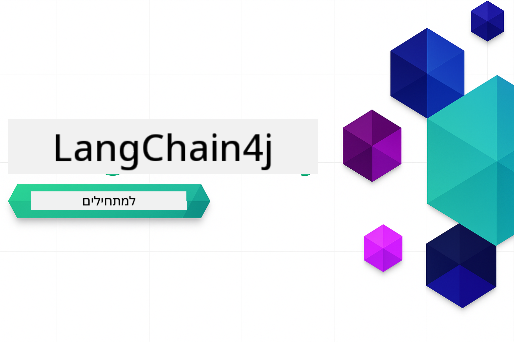

<!--
CO_OP_TRANSLATOR_METADATA:
{
  "original_hash": "6a3bd54fc243ce3dc79d18848d2b5413",
  "translation_date": "2026-01-06T00:07:14+00:00",
  "source_file": "README.md",
  "language_code": "he"
}
-->


### 🌐 תמיכה ברב-לשוניות

#### נתמך באמצעות GitHub Action (אוטומטי ותמיד מעודכן)

<!-- CO-OP TRANSLATOR LANGUAGES TABLE START -->
[Arabic](../ar/README.md) | [Bengali](../bn/README.md) | [Bulgarian](../bg/README.md) | [Burmese (Myanmar)](../my/README.md) | [Chinese (Simplified)](../zh/README.md) | [Chinese (Traditional, Hong Kong)](../hk/README.md) | [Chinese (Traditional, Macau)](../mo/README.md) | [Chinese (Traditional, Taiwan)](../tw/README.md) | [Croatian](../hr/README.md) | [Czech](../cs/README.md) | [Danish](../da/README.md) | [Dutch](../nl/README.md) | [Estonian](../et/README.md) | [Finnish](../fi/README.md) | [French](../fr/README.md) | [German](../de/README.md) | [Greek](../el/README.md) | [Hebrew](./README.md) | [Hindi](../hi/README.md) | [Hungarian](../hu/README.md) | [Indonesian](../id/README.md) | [Italian](../it/README.md) | [Japanese](../ja/README.md) | [Kannada](../kn/README.md) | [Korean](../ko/README.md) | [Lithuanian](../lt/README.md) | [Malay](../ms/README.md) | [Malayalam](../ml/README.md) | [Marathi](../mr/README.md) | [Nepali](../ne/README.md) | [Nigerian Pidgin](../pcm/README.md) | [Norwegian](../no/README.md) | [Persian (Farsi)](../fa/README.md) | [Polish](../pl/README.md) | [Portuguese (Brazil)](../br/README.md) | [Portuguese (Portugal)](../pt/README.md) | [Punjabi (Gurmukhi)](../pa/README.md) | [Romanian](../ro/README.md) | [Russian](../ru/README.md) | [Serbian (Cyrillic)](../sr/README.md) | [Slovak](../sk/README.md) | [Slovenian](../sl/README.md) | [Spanish](../es/README.md) | [Swahili](../sw/README.md) | [Swedish](../sv/README.md) | [Tagalog (Filipino)](../tl/README.md) | [Tamil](../ta/README.md) | [Telugu](../te/README.md) | [Thai](../th/README.md) | [Turkish](../tr/README.md) | [Ukrainian](../uk/README.md) | [Urdu](../ur/README.md) | [Vietnamese](../vi/README.md)

> **מעדיפים לשכפל מקומית?**

> מאגר זה כולל יותר מ-50 תרגומים לשפות, מה שמגדיל משמעותית את גודל ההורדה. כדי לשכפל ללא התרגומים, השתמשו ב-sparse checkout:
> ```bash
> git clone --filter=blob:none --sparse https://github.com/microsoft/LangChain4j-for-Beginners.git
> cd LangChain4j-for-Beginners
> git sparse-checkout set --no-cone '/*' '!translations' '!translated_images'
> ```
> זה נותן לכם את כל מה שאתם צריכים כדי להשלים את הקורס עם הורדה הרבה יותר מהירה.
<!-- CO-OP TRANSLATOR LANGUAGES TABLE END -->

# LangChain4j למתחילים

קורס לבניית יישומי בינה מלאכותית עם LangChain4j ו-Azure OpenAI GPT-5, מהצ'אט הבסיסי ועד לסוכנים מבוססי AI.

**חדש ב-LangChain4j?** הסתכלו על [הלקסיקון](docs/GLOSSARY.md) להגדות של מונחים ומושגים מרכזיים.

## תוכן עניינים

1. [התחלה מהירה](00-quick-start/README.md) - התחל עם LangChain4j
2. [הקדמה](01-introduction/README.md) - למד את יסודות LangChain4j
3. [הנדסת פרומפטים](02-prompt-engineering/README.md) - שלוט בעיצוב פרומפט יעיל
4. [RAG (יצירה מורחבת באמצעות שליפה)](03-rag/README.md) - בניית מערכות אינטיליגנטיות מבוססות ידע
5. [כלים](04-tools/README.md) - שילוב כלים חיצוניים ועוזרים פשוטים
6. [MCP (פרוטוקול הקשר מודל)](05-mcp/README.md) - עבודה עם פרוטוקול MCP ומודולים סוכניים
---

## מסלול למידה

> **התחלה מהירה**

1. פצלו את המאגר הזה לחשבון ה-GitHub שלכם
2. לחצו על **קוד** → לשונית **Codespaces** → **...** → **חדש עם אפשרויות...**
3. השתמשו בהגדרות ברירת המחדל – זה יבחר את מיכל הפיתוח שנוצר לקורס זה
4. לחצו על **יצירת קודספייס**
5. המתינו 5-10 דקות עד שהסביבה תהיה מוכנה
6. קפצו ישר ל-[התחלה מהירה](./00-quick-start/README.md) כדי להתחיל!

> **מעדיפים לשכפל מקומית?**
>
> מאגר זה כולל יותר מ-50 תרגומים לשפות, מה שמגדיל משמעותית את גודל ההורדה. כדי לשכפל ללא התרגומים, השתמשו ב-sparse checkout:
> ```bash
> git clone --filter=blob:none --sparse https://github.com/microsoft/LangChain4j-for-Beginners.git
> cd LangChain4j-for-Beginners
> git sparse-checkout set --no-cone '/*' '!translations' '!translated_images'
> ```
> זה נותן לכם את כל מה שאתם צריכים כדי להשלים את הקורס עם הורדה הרבה יותר מהירה.

לאחר השלמת המודולים, חקרו את [מדריך הבדיקות](docs/TESTING.md) כדי לראות מושגי בדיקות של LangChain4j בפעולה.

> **הערה:** הדרכה זו משתמשת גם בדגמי GitHub וגם ב-Azure OpenAI. מודול [התחלה מהירה](00-quick-start/README.md) משתמש בדגמי GitHub (ללא צורך במנוי Azure), בעוד שמודולים 1-5 משתמשים ב-Azure OpenAI.

## למידה עם GitHub Copilot

כדי להתחיל לתכנת במהירות, פתחו את הפרויקט הזה בקודספייס של GitHub או ב-IDE המקומי שלכם עם ה-devcontainer המסופק. ה-devcontainer שמשמש בקורס זה מגיע עם קונפיגורציה מראש של GitHub Copilot לתכנות משותף מבוסס AI.

כל דוגמת קוד כוללת שאלות מוצעות שתוכלו לשאול את GitHub Copilot כדי להעמיק את ההבנה שלכם. חפשו את הסימנים 💡/🤖 ב:

- **כותרות קבצי Java** - שאלות ספציפיות לכל דוגמה
- **קבצי README של מודולים** - שאלות לחקירה אחרי דוגמאות הקוד

**איך להשתמש:** פתחו כל קובץ קוד ושאלו את GitHub Copilot את השאלות המוצעות. יש לו הקשר מלא של הקוד ויכול להסביר, להרחיב ולהציע חלופות.

רוצים ללמוד יותר? עיינו ב-[Copilot לתכנות משותף מבוסס AI](https://aka.ms/GitHubCopilotAI).

## משאבים נוספים

<!-- CO-OP TRANSLATOR OTHER COURSES START -->
### LangChain
[](https://aka.ms/langchain4j-for-beginners)
[](https://aka.ms/langchainjs-for-beginners?WT.mc_id=m365-94501-dwahlin)

---

### Azure / Edge / MCP / סוכנים
[](https://github.com/microsoft/AZD-for-beginners?WT.mc_id=academic-105485-koreyst)
[](https://github.com/microsoft/edgeai-for-beginners?WT.mc_id=academic-105485-koreyst)
[](https://github.com/microsoft/mcp-for-beginners?WT.mc_id=academic-105485-koreyst)
[](https://github.com/microsoft/ai-agents-for-beginners?WT.mc_id=academic-105485-koreyst)

---
 
### סדרת בינה מלאכותית יצירתית
[](https://github.com/microsoft/generative-ai-for-beginners?WT.mc_id=academic-105485-koreyst)
[-9333EA?style=for-the-badge&labelColor=E5E7EB&color=9333EA)](https://github.com/microsoft/Generative-AI-for-beginners-dotnet?WT.mc_id=academic-105485-koreyst)
[-C084FC?style=for-the-badge&labelColor=E5E7EB&color=C084FC)](https://github.com/microsoft/generative-ai-for-beginners-java?WT.mc_id=academic-105485-koreyst)
[-E879F9?style=for-the-badge&labelColor=E5E7EB&color=E879F9)](https://github.com/microsoft/generative-ai-with-javascript?WT.mc_id=academic-105485-koreyst)

---
 
### למידה מרכזית
[](https://aka.ms/ml-beginners?WT.mc_id=academic-105485-koreyst)
[](https://aka.ms/datascience-beginners?WT.mc_id=academic-105485-koreyst)
[](https://aka.ms/ai-beginners?WT.mc_id=academic-105485-koreyst)
[](https://github.com/microsoft/Security-101?WT.mc_id=academic-96948-sayoung)
[](https://aka.ms/webdev-beginners?WT.mc_id=academic-105485-koreyst)
[](https://aka.ms/iot-beginners?WT.mc_id=academic-105485-koreyst)
[](https://github.com/microsoft/xr-development-for-beginners?WT.mc_id=academic-105485-koreyst)

---

### סדרת קופיילוט  
[](https://aka.ms/GitHubCopilotAI?WT.mc_id=academic-105485-koreyst)  
[](https://github.com/microsoft/mastering-github-copilot-for-dotnet-csharp-developers?WT.mc_id=academic-105485-koreyst)  
[](https://github.com/microsoft/CopilotAdventures?WT.mc_id=academic-105485-koreyst)  
<!-- CO-OP TRANSLATOR OTHER COURSES END -->

## קבלת עזרה

אם אתה נתקע או יש לך שאלות לגבי בניית אפליקציות בינה מלאכותית, הצטרף ל:

[](https://aka.ms/foundry/discord)

אם יש לך משוב על המוצר או שגיאות במהלך הבנייה, בקר ב:

[](https://aka.ms/foundry/forum)

## רישיון

רישיון MIT - עיין בקובץ [LICENSE](../../LICENSE) לפרטים.

---

<!-- CO-OP TRANSLATOR DISCLAIMER START -->
**כתב ויתור**:  
מסמך זה תורגם באמצעות שירות תרגום מבוסס בינה מלאכותית [Co-op Translator](https://github.com/Azure/co-op-translator). למרות שאנו שואפים לדיוק, יש להביא בחשבון שתרגומים אוטומטיים עלולים להכיל שגיאות או אי דיוקים. המסמך המקורי בשפת המקור שלו נחשב למקור הסמכותי. למידע קריטי מומלץ להשתמש בתרגום מקצועי של מתרגם אנושי. איננו נושאים באחריות לכל אי הבנה או פרשנות שגויה הנובעים משימוש בתרגום זה.
<!-- CO-OP TRANSLATOR DISCLAIMER END -->