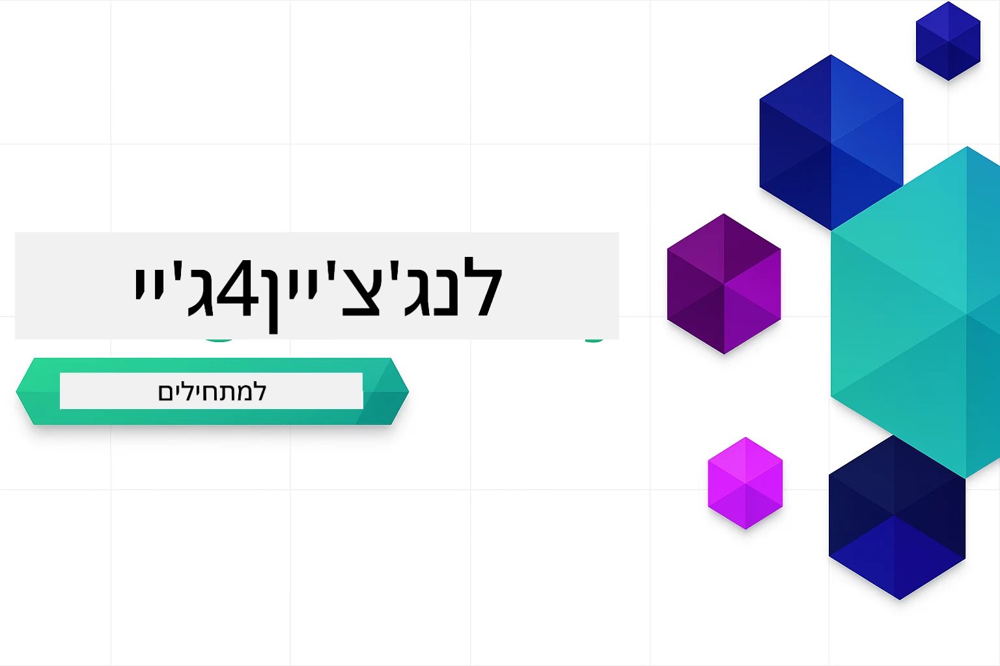

# LangChain4j למתחילים

קורס לבניית יישומי בינה מלאכותית עם LangChain4j ו-Azure OpenAI GPT-5.2, משיחה בסיסית עד סוכני בינה מלאכותית.

### 🌐 תמיכה בריבוי שפות

#### נתמכת באמצעות GitHub Action (אוטומטית ותמיד מעודכנת)

<!-- CO-OP TRANSLATOR LANGUAGES TABLE START -->
[Arabic](../ar/README.md) | [Bengali](../bn/README.md) | [Bulgarian](../bg/README.md) | [Burmese (Myanmar)](../my/README.md) | [Chinese (Simplified)](../zh-CN/README.md) | [Chinese (Traditional, Hong Kong)](../zh-HK/README.md) | [Chinese (Traditional, Macau)](../zh-MO/README.md) | [Chinese (Traditional, Taiwan)](../zh-TW/README.md) | [Croatian](../hr/README.md) | [Czech](../cs/README.md) | [Danish](../da/README.md) | [Dutch](../nl/README.md) | [Estonian](../et/README.md) | [Finnish](../fi/README.md) | [French](../fr/README.md) | [German](../de/README.md) | [Greek](../el/README.md) | [Hebrew](./README.md) | [Hindi](../hi/README.md) | [Hungarian](../hu/README.md) | [Indonesian](../id/README.md) | [Italian](../it/README.md) | [Japanese](../ja/README.md) | [Kannada](../kn/README.md) | [Khmer](../km/README.md) | [Korean](../ko/README.md) | [Lithuanian](../lt/README.md) | [Malay](../ms/README.md) | [Malayalam](../ml/README.md) | [Marathi](../mr/README.md) | [Nepali](../ne/README.md) | [Nigerian Pidgin](../pcm/README.md) | [Norwegian](../no/README.md) | [Persian (Farsi)](../fa/README.md) | [Polish](../pl/README.md) | [Portuguese (Brazil)](../pt-BR/README.md) | [Portuguese (Portugal)](../pt-PT/README.md) | [Punjabi (Gurmukhi)](../pa/README.md) | [Romanian](../ro/README.md) | [Russian](../ru/README.md) | [Serbian (Cyrillic)](../sr/README.md) | [Slovak](../sk/README.md) | [Slovenian](../sl/README.md) | [Spanish](../es/README.md) | [Swahili](../sw/README.md) | [Swedish](../sv/README.md) | [Tagalog (Filipino)](../tl/README.md) | [Tamil](../ta/README.md) | [Telugu](../te/README.md) | [Thai](../th/README.md) | [Turkish](../tr/README.md) | [Ukrainian](../uk/README.md) | [Urdu](../ur/README.md) | [Vietnamese](../vi/README.md)

> **מעדיף לשכפל מקומית?**
>
> מאגר זה כולל יותר מ-50 תרגומים לשפות שונות שגדילים משמעותית את גודל ההורדה. כדי לשכפל ללא תרגומים, השתמש ב-sparse checkout:
>
> **Bash / macOS / Linux:**
> ```bash
> git clone --filter=blob:none --sparse https://github.com/microsoft/LangChain4j-for-Beginners.git
> cd LangChain4j-for-Beginners
> git sparse-checkout set --no-cone '/*' '!translations' '!translated_images'
> ```
>
> **CMD (Windows):**
> ```cmd
> git clone --filter=blob:none --sparse https://github.com/microsoft/LangChain4j-for-Beginners.git
> cd LangChain4j-for-Beginners
> git sparse-checkout set --no-cone "/*" "!translations" "!translated_images"
> ```
>
> זה נותן לך את כל מה שאתה צריך כדי להשלים את הקורס במהירות הורדה גבוהה יותר.
<!-- CO-OP TRANSLATOR LANGUAGES TABLE END -->

## תוכן העניינים

1. [הקדמה](01-introduction/README.md) - ללמוד את היסודות של LangChain4j
2. [הנדסת פרומפטים](02-prompt-engineering/README.md) - לשלוט בעיצוב פרומפטים אפקטיבי
3. [RAG (ייצור מחוזק אחזור)](03-rag/README.md) - לבנות מערכות מבוססות ידע חכמות
4. [כלים](04-tools/README.md) - לשלב כלים חיצוניים ועוזרים פשוטים
5. [MCP (פרוטוקול הקשר מודל)](05-mcp/README.md) - לעבוד עם פרוטוקול הקשר מודל (MCP) ומודולי סוכנים

### סיורים בווידאו

לכל מודול יש מפגש חי נלווה שבו אנו עוברים שלב אחר שלב על המושגים והקוד.

| מודול | וידאו |
|--------|-------|
| 01 - הקדמה | [התחלה עם LangChain4j](https://www.youtube.com/live/nl_troDm8rQ) |
| 02 - הנדסת פרומפטים | [הנדסת פרומפטים עם LangChain4j](https://www.youtube.com/live/PJ6aBaE6bog) |
| 03 - RAG | [RAG עם LangChain4j](https://www.youtube.com/watch?v=_olq75ZH_eY) |
| 04 - כלים & 05 - MCP | [סוכני AI עם כלים ו-MCP](https://www.youtube.com/watch?v=O_J30kZc0rw) |

---

## מסלול הלימוד

**חדש ב-LangChain4j?** עיין ב-[מילון המונחים](docs/GLOSSARY.md) להגדרות של מונחים ומושגים מרכזיים.

> **התחלה מהירה**

1. פתח פורק של מאגר זה לחשבון ה-GitHub שלך
2. לחץ על **Code** → לשונית **Codespaces** → **...** → **חדש עם אפשרויות...**
3. השתמש כברירות המחדל – זה יבחר במכולת הפיתוח שנוצרה לקורס זה
4. לחץ על **Create codespace**
5. המתן 5-10 דקות לסיום הכנת הסביבה
6. קפוץ ישירות ל-[הקדמה](./01-introduction/README.md) כדי להתחיל!

לאחר סיום המודולים, חקור את [מדריך הבדיקות](docs/TESTING.md) כדי לראות מושגי בדיקות של LangChain4j בפעולה.

> **הערה:** הדרכה זו משתמשת ב-Azure OpenAI. התחל עם [חשבון Azure חינמי](https://aka.ms/azure-free-account) אם אין לך אחד.

## למידה עם GitHub Copilot

כדי להתחיל לתכנת במהירות, פתח את הפרויקט הזה ב-GitHub Codespace או ב-IDE המקומי שלך עם devcontainer המסופק. ה-devcontainer שבו משתמשים בקורס זה מגיע מוגדר מראש עם GitHub Copilot לתכנות זוגי מבוסס AI.

כל דוגמת קוד כוללת שאלות מוצעות שאתה יכול לשאול את GitHub Copilot כדי להעמיק את ההבנה שלך. חפש את הכותרות 💡/🤖 ב-

- **כותרות קבצי Java** - שאלות ספציפיות לכל דוגמה
- **README של מודולים** - הנחיות לחקירה לאחר דוגמות קוד

**איך משתמשים:** פתח כל קובץ קוד ושאל את Copilot את השאלות המוצעות. יש לו הקשר מלא של בסיס הקוד ויכול להסביר, להרחיב ולהציע אלטרנטיבות.

רוצה ללמוד עוד? עיין ב-[Copilot לתכנות זוגי מבוסס AI](https://aka.ms/GitHubCopilotAI).

## משאבים נוספים

<!-- CO-OP TRANSLATOR OTHER COURSES START -->
### LangChain
[](https://aka.ms/langchain4j-for-beginners)
[](https://aka.ms/langchainjs-for-beginners?WT.mc_id=m365-94501-dwahlin)
[](https://github.com/microsoft/langchain-for-beginners?WT.mc_id=m365-94501-dwahlin)
---

### Azure / Edge / MCP / סוכנים
[](https://github.com/microsoft/AZD-for-beginners?WT.mc_id=academic-105485-koreyst)
[](https://github.com/microsoft/edgeai-for-beginners?WT.mc_id=academic-105485-koreyst)
[](https://github.com/microsoft/mcp-for-beginners?WT.mc_id=academic-105485-koreyst)
[](https://github.com/microsoft/ai-agents-for-beginners?WT.mc_id=academic-105485-koreyst)

---
 
### סדרת בינה מלאכותית יוצרת
[](https://github.com/microsoft/generative-ai-for-beginners?WT.mc_id=academic-105485-koreyst)
[-9333EA?style=for-the-badge&labelColor=E5E7EB&color=9333EA)](https://github.com/microsoft/Generative-AI-for-beginners-dotnet?WT.mc_id=academic-105485-koreyst)
[-C084FC?style=for-the-badge&labelColor=E5E7EB&color=C084FC)](https://github.com/microsoft/generative-ai-for-beginners-java?WT.mc_id=academic-105485-koreyst)
[-E879F9?style=for-the-badge&labelColor=E5E7EB&color=E879F9)](https://github.com/microsoft/generative-ai-with-javascript?WT.mc_id=academic-105485-koreyst)

---
 
### לימוד בסיסי
[](https://aka.ms/ml-beginners?WT.mc_id=academic-105485-koreyst)
[](https://aka.ms/datascience-beginners?WT.mc_id=academic-105485-koreyst)
[](https://aka.ms/ai-beginners?WT.mc_id=academic-105485-koreyst)
[](https://github.com/microsoft/Security-101?WT.mc_id=academic-96948-sayoung)
[](https://aka.ms/webdev-beginners?WT.mc_id=academic-105485-koreyst)
[](https://aka.ms/iot-beginners?WT.mc_id=academic-105485-koreyst)
[](https://github.com/microsoft/xr-development-for-beginners?WT.mc_id=academic-105485-koreyst)

---
 
### סדרת קופיילוט
[](https://aka.ms/GitHubCopilotAI?WT.mc_id=academic-105485-koreyst)
[](https://github.com/microsoft/mastering-github-copilot-for-dotnet-csharp-developers?WT.mc_id=academic-105485-koreyst)
[](https://github.com/microsoft/CopilotAdventures?WT.mc_id=academic-105485-koreyst)
<!-- CO-OP TRANSLATOR OTHER COURSES END -->

## לקבלת סיוע

אם נתקעת או יש לך שאלות על בניית אפליקציות בינה מלאכותית, הצטרף ל:

[](https://aka.ms/foundry/discord)

אם יש לך משוב על המוצר או שגיאות בזמן בנייה בקרב:

[](https://aka.ms/foundry/forum)

## רישיון

רישיון MIT - ראה את קובץ [LICENSE](../../LICENSE) לפרטים.

---

<!-- CO-OP TRANSLATOR DISCLAIMER START -->
**כתב ויתור**:
מסמך זה תורגם באמצעות שירות תרגום אוטומטי [Co-op Translator](https://github.com/Azure/co-op-translator). למרות שאנו שואפים לדיוק, יש לקחת בחשבון שתרגומים אוטומטיים עלולים להכיל שגיאות או אי-דיוקים. יש להחשיב את המסמך המקורי בשפתו הטבעית כמקור הסמכות. למידע קריטי מומלץ להשתמש בתרגום מקצועי על ידי מתרגם אדם. אנו לא אחראים לכל אי-הבנה או פירוש שגוי הנובע מהשימוש בתרגום זה.
<!-- CO-OP TRANSLATOR DISCLAIMER END -->