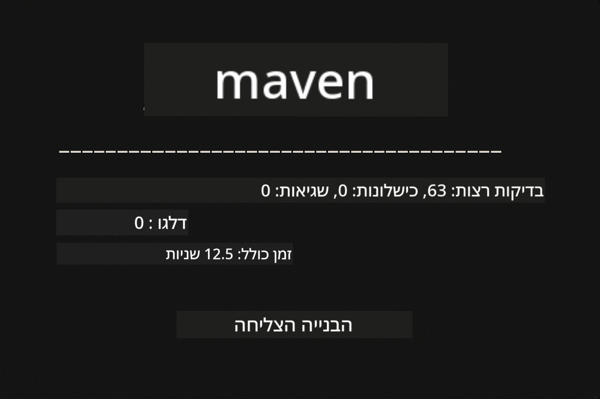
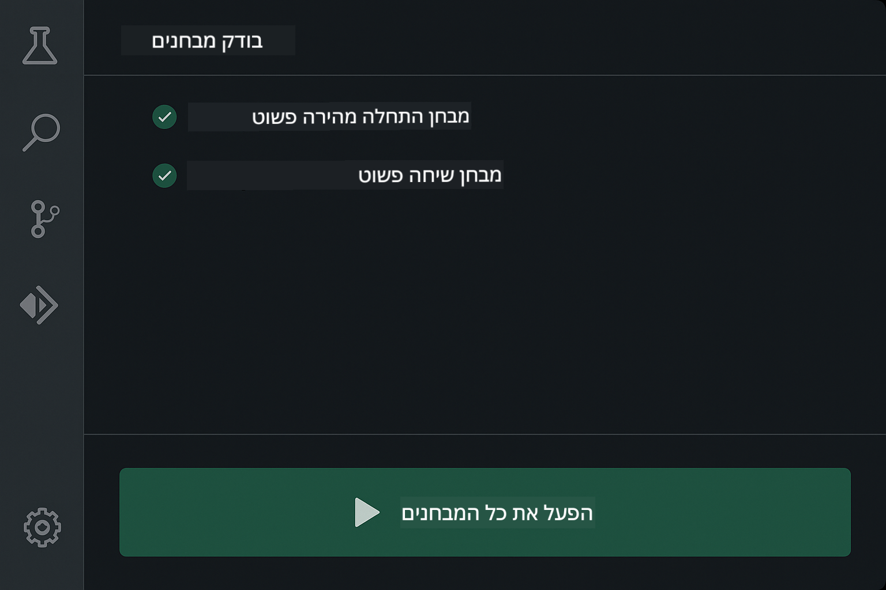
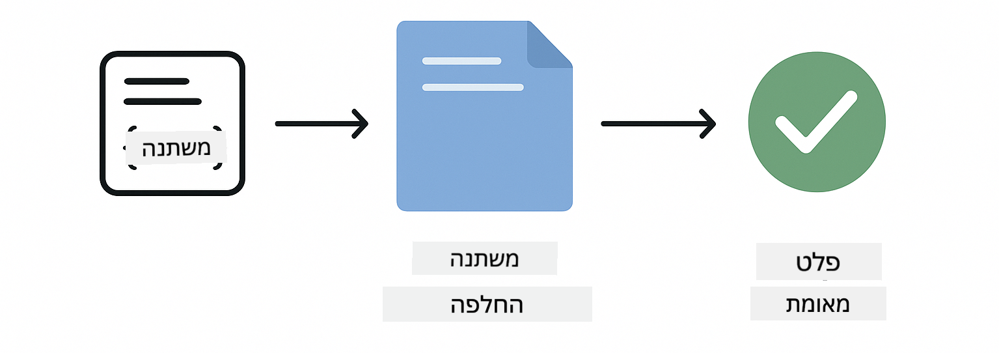
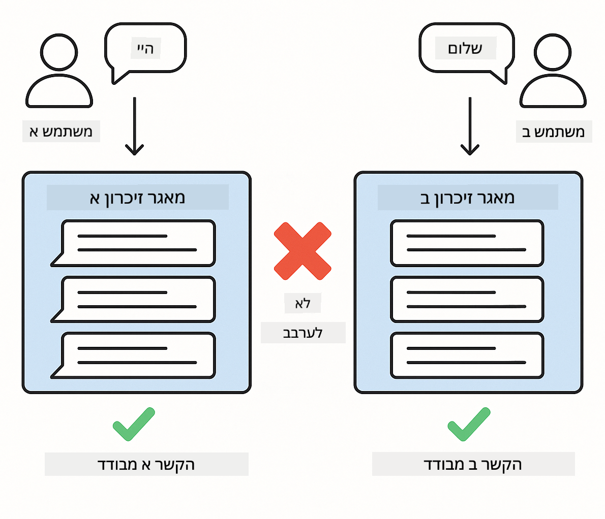

<!--
CO_OP_TRANSLATOR_METADATA:
{
  "original_hash": "b975537560c404d5f254331832811e78",
  "translation_date": "2025-12-13T21:11:51+00:00",
  "source_file": "docs/TESTING.md",
  "language_code": "he"
}
-->
# בדיקת יישומי LangChain4j

## תוכן העניינים

- [התחלה מהירה](../../../docs)
- [מה הבדיקות מכסות](../../../docs)
- [הרצת הבדיקות](../../../docs)
- [הרצת בדיקות ב-VS Code](../../../docs)
- [תבניות בדיקה](../../../docs)
- [פילוסופיית בדיקה](../../../docs)
- [שלבים הבאים](../../../docs)

מדריך זה מלווה אותך דרך הבדיקות שמדגימות כיצד לבדוק יישומי AI ללא צורך במפתחות API או שירותים חיצוניים.

## התחלה מהירה

הרץ את כל הבדיקות עם פקודה אחת:

**Bash:**
```bash
mvn test
```

**PowerShell:**
```powershell
mvn --% test
```



*הרצת בדיקות מוצלחת המציגה את כל הבדיקות שעברו ללא כישלונות*

## מה הבדיקות מכסות

קורס זה מתמקד ב**בדיקות יחידה** שרצות מקומית. כל בדיקה מדגימה מושג ספציפי של LangChain4j בבידוד.


*פירמידת בדיקות המציגה את האיזון בין בדיקות יחידה (מהירות, מבודדות), בדיקות אינטגרציה (רכיבים אמיתיים), ובדיקות מקצה לקצה (מערכת מלאה עם Docker). הכשרה זו מכסה בדיקות יחידה.*

| מודול | בדיקות | מיקוד | קבצים מרכזיים |
|--------|-------|-------|-----------|
| **00 - התחלה מהירה** | 6 | תבניות פרומפט והחלפת משתנים | `SimpleQuickStartTest.java` |
| **01 - מבוא** | 8 | זיכרון שיחה וצ'אט עם מצב | `SimpleConversationTest.java` |
| **02 - הנדסת פרומפט** | 12 | תבניות GPT-5, רמות התלהבות, פלט מובנה | `SimpleGpt5PromptTest.java` |
| **03 - RAG** | 10 | קליטת מסמכים, הטמעות, חיפוש דמיון | `DocumentServiceTest.java` |
| **04 - כלים** | 12 | קריאת פונקציות ורצף כלים | `SimpleToolsTest.java` |
| **05 - MCP** | 15 | פרוטוקול הקשר מודל עם Docker | `SimpleMcpTest.java`, `McpDockerTransportTest.java` |

## הרצת הבדיקות

**הרץ את כל הבדיקות מהשורש:**

**Bash:**
```bash
mvn test
```

**PowerShell:**
```powershell
mvn --% test
```

**הרץ בדיקות למודול ספציפי:**

**Bash:**
```bash
cd 01-introduction && mvn test
# או מהשורש
mvn test -pl 01-introduction
```

**PowerShell:**
```powershell
cd 01-introduction; mvn --% test
# או מהשורש
mvn --% test -pl 01-introduction
```

**הרץ מחלקת בדיקה אחת:**

**Bash:**
```bash
mvn test -Dtest=SimpleConversationTest
```

**PowerShell:**
```powershell
mvn --% test -Dtest=SimpleConversationTest
```

**הרץ שיטת בדיקה ספציפית:**

**Bash:**
```bash
mvn test -Dtest=SimpleConversationTest#יש לשמור על היסטוריית שיחה
```

**PowerShell:**
```powershell
mvn --% test -Dtest=SimpleConversationTest#יש לשמור על היסטוריית שיחה
```

## הרצת בדיקות ב-VS Code

אם אתה משתמש ב-Visual Studio Code, ה-Test Explorer מספק ממשק גרפי להרצה וניפוי שגיאות של בדיקות.



*סייר בדיקות ב-VS Code המציג את עץ הבדיקות עם כל מחלקות הבדיקה ב-Java ושיטות הבדיקה הפרטניות*

**כדי להריץ בדיקות ב-VS Code:**

1. פתח את סייר הבדיקות על ידי לחיצה על סמל הבקבוקון בסרגל הפעילות
2. הרחב את עץ הבדיקות כדי לראות את כל המודולים ומחלקות הבדיקה
3. לחץ על כפתור ההפעלה ליד כל בדיקה כדי להריץ אותה בנפרד
4. לחץ על "Run All Tests" כדי להריץ את כל הסוויטה
5. לחץ לחיצה ימנית על כל בדיקה ובחר "Debug Test" כדי להגדיר נקודות עצירה ולעבור על הקוד

סייר הבדיקות מציג סימני וי ירוקים עבור בדיקות שעברו ומספק הודעות כישלון מפורטות כאשר בדיקות נכשלות.

## תבניות בדיקה


*שש תבניות בדיקה ליישומי LangChain4j: תבניות פרומפט, דימוי מודלים, בידוד שיחה, בדיקת כלים, RAG בזיכרון, ואינטגרציית Docker*

### תבנית 1: בדיקת תבניות פרומפט

התבנית הפשוטה ביותר בודקת תבניות פרומפט ללא קריאה למודל AI. אתה מאמת שהחלפת המשתנים עובדת כראוי והפרומפטים מעוצבים כמצופה.



*בדיקת תבניות פרומפט המציגה את זרימת החלפת המשתנים: תבנית עם מקומות שמורים → ערכים מוחלים → פלט מעוצב מאומת*

```java
@Test
@DisplayName("Should format prompt template with variables")
void testPromptTemplateFormatting() {
    PromptTemplate template = PromptTemplate.from(
        "Best time to visit {{destination}} for {{activity}}?"
    );
    
    Prompt prompt = template.apply(Map.of(
        "destination", "Paris",
        "activity", "sightseeing"
    ));
    
    assertThat(prompt.text()).isEqualTo("Best time to visit Paris for sightseeing?");
}
```

בדיקה זו נמצאת ב-`00-quick-start/src/test/java/com/example/langchain4j/quickstart/SimpleQuickStartTest.java`.

**הרץ אותה:**

**Bash:**
```bash
cd 00-quick-start && mvn test -Dtest=SimpleQuickStartTest#בדיקת עיצוב תבנית ההנחיה
```

**PowerShell:**
```powershell
cd 00-quick-start; mvn --% test -Dtest=SimpleQuickStartTest#בדיקת עיצוב תבנית ההנחיה
```

### תבנית 2: דימוי מודלים לשפה

כאשר בודקים לוגיקת שיחה, השתמש ב-Mockito ליצירת מודלים מזויפים שמחזירים תגובות קבועות מראש. זה עושה את הבדיקות מהירות, חינמיות ודטרמיניסטיות.


*השוואה שמראה מדוע דימויים מועדפים לבדיקה: הם מהירים, חינמיים, דטרמיניסטיים, ואינם דורשים מפתחות API*

```java
@ExtendWith(MockitoExtension.class)
class SimpleConversationTest {
    
    private ConversationService conversationService;
    
    @Mock
    private OpenAiOfficialChatModel mockChatModel;
    
    @BeforeEach
    void setUp() {
        ChatResponse mockResponse = ChatResponse.builder()
            .aiMessage(AiMessage.from("This is a test response"))
            .build();
        when(mockChatModel.chat(anyList())).thenReturn(mockResponse);
        
        conversationService = new ConversationService(mockChatModel);
    }
    
    @Test
    void shouldMaintainConversationHistory() {
        String conversationId = conversationService.startConversation();
        
        ChatResponse mockResponse1 = ChatResponse.builder()
            .aiMessage(AiMessage.from("Response 1"))
            .build();
        ChatResponse mockResponse2 = ChatResponse.builder()
            .aiMessage(AiMessage.from("Response 2"))
            .build();
        ChatResponse mockResponse3 = ChatResponse.builder()
            .aiMessage(AiMessage.from("Response 3"))
            .build();
        
        when(mockChatModel.chat(anyList()))
            .thenReturn(mockResponse1)
            .thenReturn(mockResponse2)
            .thenReturn(mockResponse3);

        conversationService.chat(conversationId, "First message");
        conversationService.chat(conversationId, "Second message");
        conversationService.chat(conversationId, "Third message");

        List<ChatMessage> history = conversationService.getHistory(conversationId);
        assertThat(history).hasSize(6); // 3 הודעות משתמש + 3 הודעות בינה מלאכותית
    }
}
```

תבנית זו מופיעה ב-`01-introduction/src/test/java/com/example/langchain4j/service/SimpleConversationTest.java`. הדימוי מבטיח התנהגות עקבית כדי שתוכל לוודא שניהול הזיכרון עובד כראוי.

### תבנית 3: בדיקת בידוד שיחה

זיכרון השיחה חייב לשמור על הפרדה בין משתמשים שונים. בדיקה זו מאמתת ששיחות לא מערבבות הקשרים.



*בדיקת בידוד שיחה המציגה חנויות זיכרון נפרדות למשתמשים שונים כדי למנוע ערבוב הקשרים*

```java
@Test
void shouldIsolateConversationsByid() {
    String conv1 = conversationService.startConversation();
    String conv2 = conversationService.startConversation();
    
    ChatResponse mockResponse = ChatResponse.builder()
        .aiMessage(AiMessage.from("Response"))
        .build();
    when(mockChatModel.chat(anyList())).thenReturn(mockResponse);

    conversationService.chat(conv1, "Message for conversation 1");
    conversationService.chat(conv2, "Message for conversation 2");

    List<ChatMessage> history1 = conversationService.getHistory(conv1);
    List<ChatMessage> history2 = conversationService.getHistory(conv2);
    
    assertThat(history1).hasSize(2);
    assertThat(history2).hasSize(2);
}
```

כל שיחה שומרת היסטוריה עצמאית משלה. במערכות ייצור, בידוד זה קריטי ליישומים מרובי משתמשים.

### תבנית 4: בדיקת כלים בנפרד

כלים הם פונקציות שה-AI יכול לקרוא להן. בדוק אותם ישירות כדי לוודא שהם עובדים כראוי ללא תלות בהחלטות ה-AI.


*בדיקת כלים בנפרד המציגה הרצת כלי דמה ללא קריאות AI כדי לאמת את הלוגיקה העסקית*

```java
@Test
void shouldConvertCelsiusToFahrenheit() {
    TemperatureTool tempTool = new TemperatureTool();
    String result = tempTool.celsiusToFahrenheit(25.0);
    assertThat(result).containsPattern("77[.,]0°F");
}

@Test
void shouldDemonstrateToolChaining() {
    WeatherTool weatherTool = new WeatherTool();
    TemperatureTool tempTool = new TemperatureTool();

    String weatherResult = weatherTool.getCurrentWeather("Seattle");
    assertThat(weatherResult).containsPattern("\\d+°C");

    String conversionResult = tempTool.celsiusToFahrenheit(22.0);
    assertThat(conversionResult).containsPattern("71[.,]6°F");
}
```

בדיקות אלו מ-`04-tools/src/test/java/com/example/langchain4j/agents/tools/SimpleToolsTest.java` מאמתות את לוגיקת הכלים ללא מעורבות AI. דוגמת השרשור מראה כיצד פלט של כלי אחד מוזן כקלט לאחר.

### תבנית 5: בדיקת RAG בזיכרון

מערכות RAG דורשות בדרך כלל מסדי נתונים ושרותי הטמעות. תבנית הזיכרון מאפשרת לבדוק את כל הצינור ללא תלות חיצונית.


*זרימת בדיקת RAG בזיכרון המציגה ניתוח מסמכים, אחסון הטמעות, וחיפוש דמיון ללא צורך במסד נתונים*

```java
@Test
void testProcessTextDocument() {
    String content = "This is a test document.\nIt has multiple lines.";
    InputStream inputStream = new ByteArrayInputStream(content.getBytes(StandardCharsets.UTF_8));
    
    DocumentService.ProcessedDocument result = 
        documentService.processDocument(inputStream, "test.txt");

    assertNotNull(result);
    assertTrue(result.segments().size() > 0);
    assertEquals("test.txt", result.segments().get(0).metadata().getString("filename"));
}
```

בדיקה זו מ-`03-rag/src/test/java/com/example/langchain4j/rag/service/DocumentServiceTest.java` יוצרת מסמך בזיכרון ומאמתת חלוקה וטיפול במטא-דאטה.

### תבנית 6: בדיקת אינטגרציה עם Docker

חלק מהפיצ'רים דורשים תשתית אמיתית. מודול MCP משתמש ב-Testcontainers כדי להפעיל מכולות Docker לבדיקות אינטגרציה. אלו מאמתות שהקוד שלך עובד עם שירותים אמיתיים תוך שמירה על בידוד הבדיקות.


*בדיקת אינטגרציית MCP עם Testcontainers המציגה מחזור חיים אוטומטי של מכולות: הפעלה, הרצת בדיקות, עצירה וניקוי*

הבדיקות ב-`05-mcp/src/test/java/com/example/langchain4j/mcp/McpDockerTransportTest.java` דורשות ש-Docker רץ.

**הרץ אותן:**

**Bash:**
```bash
cd 05-mcp && mvn test
```

**PowerShell:**
```powershell
cd 05-mcp; mvn --% test
```

## פילוסופיית בדיקה

בדוק את הקוד שלך, לא את ה-AI. הבדיקות שלך צריכות לאמת את הקוד שאתה כותב על ידי בדיקת אופן בניית הפרומפטים, ניהול הזיכרון, והפעלת הכלים. תגובות ה-AI משתנות ואינן צריכות להיות חלק מהאישורים בבדיקה. שאל את עצמך האם תבנית הפרומפט מחליפה משתנים כראוי, לא האם ה-AI נותן את התשובה הנכונה.

השתמש בדימויים למודלים לשפה. הם תלות חיצונית שהיא איטית, יקרה, ולא דטרמיניסטית. דימוי עושה את הבדיקות מהירות עם מילישניות במקום שניות, חינמיות ללא עלויות API, ודטרמיניסטיות עם אותו תוצאה בכל פעם.

שמור על בדיקות עצמאיות. כל בדיקה צריכה להגדיר את הנתונים שלה, לא להסתמך על בדיקות אחרות, ולנקות אחריה. בדיקות צריכות לעבור ללא תלות בסדר ההרצה.

בדוק מקרים קיצוניים מעבר לדרך השמחה. נסה קלטים ריקים, קלטים גדולים מאוד, תווים מיוחדים, פרמטרים לא תקינים, ותנאי גבול. אלו לעיתים חושפים באגים ששימוש רגיל לא מגלה.

השתמש בשמות תיאוריים. השווה בין `shouldMaintainConversationHistoryAcrossMultipleMessages()` ל-`test1()`. הראשון אומר בדיוק מה נבדק, מה שמקל על איתור תקלות.

## שלבים הבאים

כעת כשאתה מבין את תבניות הבדיקה, העמק בכל מודול:

- **[00 - התחלה מהירה](../00-quick-start/README.md)** - התחל עם יסודות תבניות הפרומפט
- **[01 - מבוא](../01-introduction/README.md)** - למד ניהול זיכרון שיחה
- **[02 - הנדסת פרומפט](../02-prompt-engineering/README.md)** - שלוט בתבניות פרומפט GPT-5
- **[03 - RAG](../03-rag/README.md)** - בנה מערכות יצירת תוכן משולבות אחזור
- **[04 - כלים](../04-tools/README.md)** - יישם קריאת פונקציות ורצפי כלים
- **[05 - MCP](../05-mcp/README.md)** - שלב פרוטוקול הקשר מודל עם Docker

קובצי ה-README של כל מודול מספקים הסברים מפורטים על המושגים הנבדקים כאן.

---

**ניווט:** [← חזרה לעמוד הראשי](../README.md)

---

<!-- CO-OP TRANSLATOR DISCLAIMER START -->
**כתב ויתור**:  
מסמך זה תורגם באמצעות שירות תרגום מבוסס בינה מלאכותית [Co-op Translator](https://github.com/Azure/co-op-translator). למרות שאנו שואפים לדיוק, יש לקחת בחשבון כי תרגומים אוטומטיים עלולים להכיל שגיאות או אי-דיוקים. המסמך המקורי בשפת המקור שלו נחשב למקור הסמכותי. למידע קריטי מומלץ להשתמש בתרגום מקצועי על ידי אדם. אנו לא נושאים באחריות לכל אי-הבנה או פרשנות שגויה הנובעת משימוש בתרגום זה.
<!-- CO-OP TRANSLATOR DISCLAIMER END -->