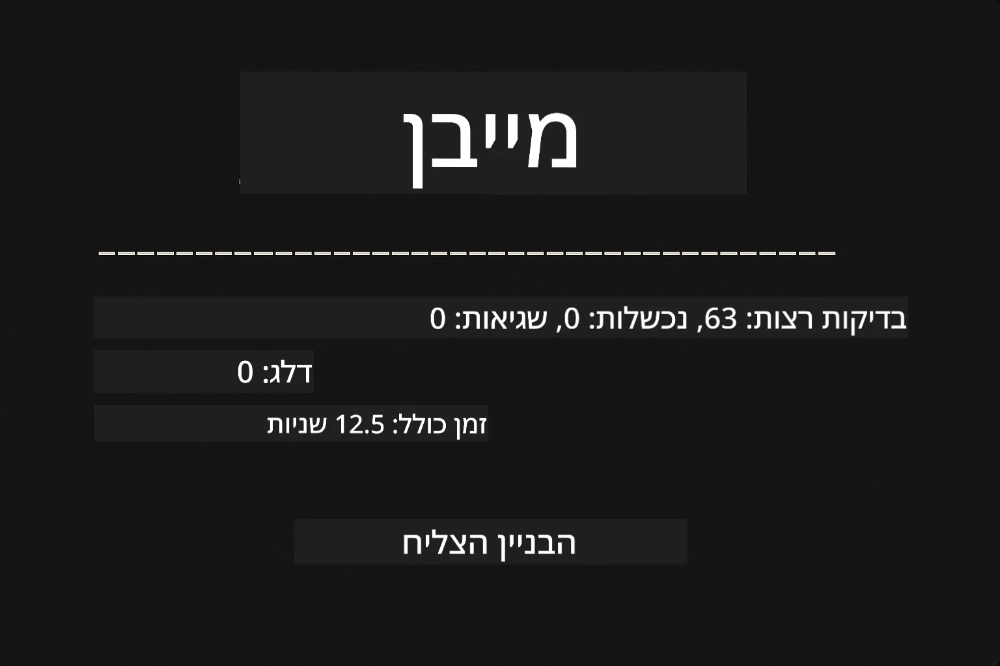
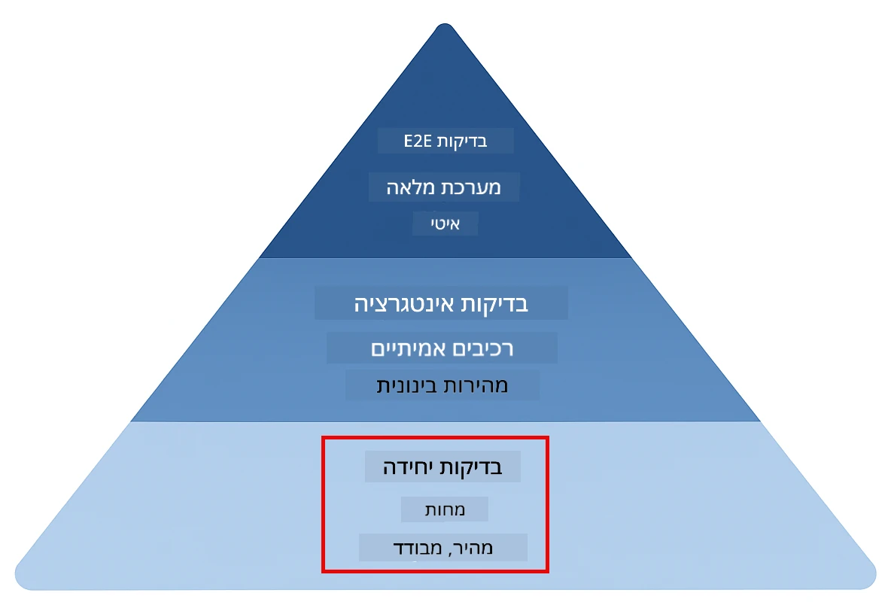
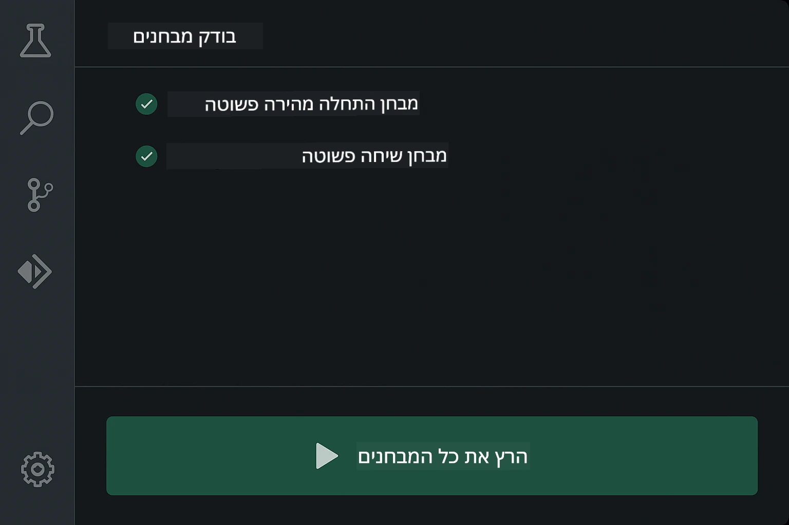
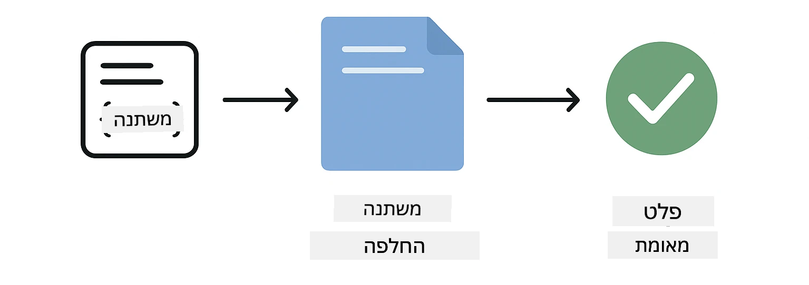
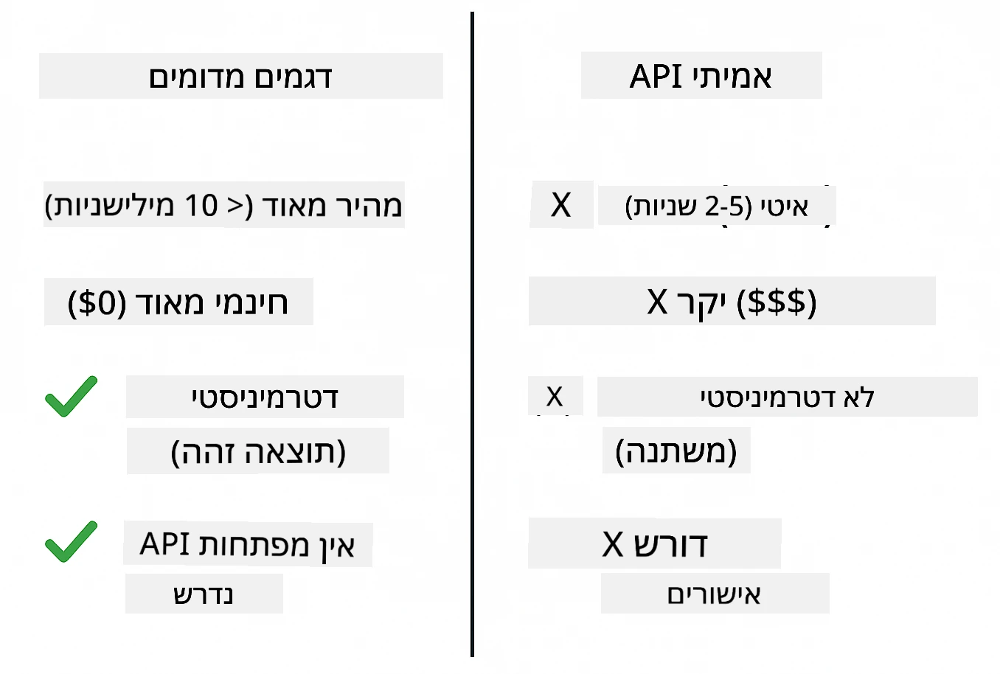
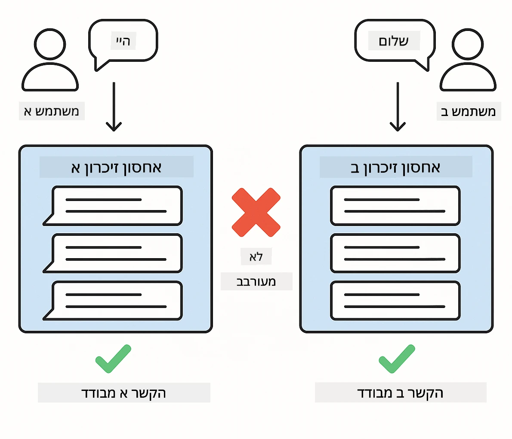
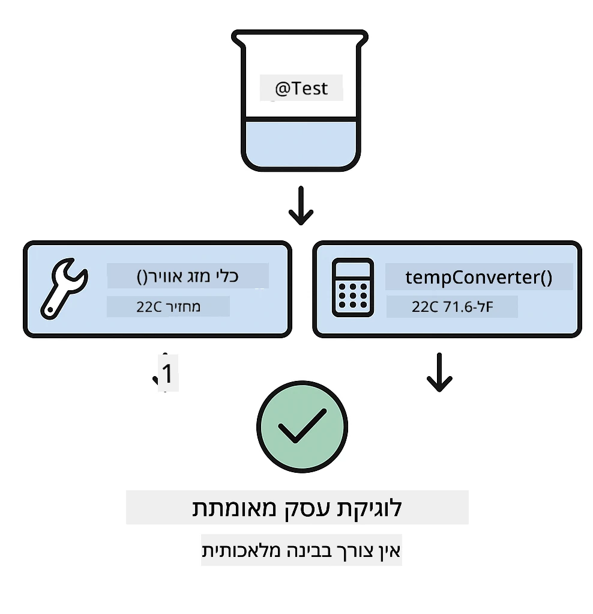
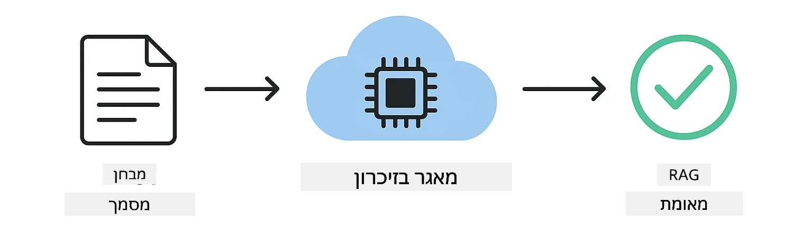

# בדיקת יישומי LangChain4j

## תוכן העניינים

- [התחלה מהירה](#התחלה-מהירה)
- [מה מכסים הבדיקות](#מה-מכסים-הבדיקות)
- [הרצת הבדיקות](#הרצת-הבדיקות)
- [הרצת בדיקות ב-VS Code](#הרצת-בדיקות-ב-vs-code)
- [תבניות בדיקה](#תבניות-בדיקה)
- [פילוסופיית בדיקה](#פילוסופיית-בדיקה)
- [שלבים הבאים](#שלבים-הבאים)

מדריך זה מלווה אותך דרך הבדיקות שמדגימות כיצד לבדוק יישומי בינה מלאכותית מבלי שידרשו מפתחות API או שירותים חיצוניים.

## התחלה מהירה

הפעל את כל הבדיקות עם פקודה אחת:

**Bash:**
```bash
mvn test
```

**PowerShell:**
```powershell
mvn --% test
```

כשהכל עובר, תראה פלט כמו הצילום מסך מטה — הבדיקות רצות ללא כישלונות.



*ביצוע בדיקות מוצלחות המציג את כל הבדיקות שעוברות ללא כישלונות*

## מה מכסים הבדיקות

הקורס מתמקד ב**בדיקות יחידה** שמתבצעות מקומית. כל בדיקה מדגימה מושג ספציפי של LangChain4j בנפרד. פירמידת הבדיקות מטה מראה איפה בדיקות היחידה מתמקמות — הן הבסיס המהיר והאמין שעליו נשענת שאר אסטרטגיית הבדיקות שלך.



*פירמידת בדיקות המראה את האיזון בין בדיקות יחידה (מהירות, מבודדות), בדיקות אינטגרציה (רכיבים אמיתיים), ובדיקות מקצה לקצה. אימון זה מכסה בדיקות יחידה.*

| מודול | בדיקות | מיקוד | קבצים מרכזיים |
|--------|-------|-------|-----------|
| **01 - מבוא** | 8 | זיכרון שיחות וצ'אט עם מצב | `SimpleConversationTest.java` |
| **02 - הנדסת פרומפטים** | 12 | דפוסי GPT-5.2, רמות נימוס, פלט מובנה | `SimpleGpt5PromptTest.java` |
| **03 - RAG** | 10 | קליטת מסמכים, הטמעות, חיפוש דמיון | `DocumentServiceTest.java` |
| **04 - כלים** | 12 | קריאת פונקציות ושרשור כלים | `SimpleToolsTest.java` |
| **05 - MCP** | 8 | פרוטוקול הקשר מודל עם הובלה stdio | `SimpleMcpTest.java` |

## הרצת הבדיקות

**הרץ את כל הבדיקות מהספרייה הראשית:**

**Bash:**
```bash
mvn test
```

**PowerShell:**
```powershell
mvn --% test
```

**הפעל בדיקות למודול מסוים:**

**Bash:**
```bash
cd 01-introduction && mvn test
# או משורש
mvn test -pl 01-introduction
```

**PowerShell:**
```powershell
cd 01-introduction; mvn --% test
# או מהשורש
mvn --% test -pl 01-introduction
```

**הרץ מחלקת בדיקה יחידה:**

**Bash:**
```bash
mvn test -Dtest=SimpleConversationTest
```

**PowerShell:**
```powershell
mvn --% test -Dtest=SimpleConversationTest
```

**הרץ שיטת בדיקה ספציפית:**

**Bash:**
```bash
mvn test -Dtest=SimpleConversationTest#האם לשמור על היסטוריית שיחה
```

**PowerShell:**
```powershell
mvn --% test -Dtest=SimpleConversationTest#יש לשמור על היסטוריית שיחה
```

## הרצת בדיקות ב-VS Code

אם אתה משתמש ב-Visual Studio Code, התוסף Test Explorer מספק ממשק גרפי להרצה ודיבוג של בדיקות.



*Test Explorer ב-VS Code המציג את עץ הבדיקות עם כל מחלקות בדיקות Java ושיטות בדיקה פרטניות*

**להריץ בדיקות ב-VS Code:**

1. פתח את Test Explorer על ידי לחיצה על סמל המבחנה בסרגל הפעילות
2. הרחב את עץ הבדיקות כדי לראות את כל המודולים ומחלקות הבדיקה
3. לחץ על כפתור ההפעלה ליד כל בדיקה כדי להריץ אותה בנפרד
4. לחץ על "Run All Tests" להריץ את כל המבחנים ביחד
5. לחץ קליק ימני על בדיקה ובחר "Debug Test" כדי להגדיר נקודות עצירה ולנווט בקוד

Test Explorer מראה סימני ביקורת ירוקים עבור בדיקות שעוברות ומספק הודעות כשל מפורטות כשביצוע נכשל.

## תבניות בדיקה

### תבנית 1: בדיקת תבניות פרומפט

התבנית הפשוטה ביותר בודקת תבניות פרומפט בלי לקרוא למודל AI. אתה מוודא שהחלפת המשתנים מתבצעת כראוי והפרומפטים מעוצבים כנדרש.



*בדיקת תבניות פרומפט המציגה את זרימת החלפת המשתנים: תבנית עם מחסני מקומות → ערכים מוחלים → פלט מעוצב מאומת*

```java
@Test
@DisplayName("Should format prompt template with variables")
void testPromptTemplateFormatting() {
    PromptTemplate template = PromptTemplate.from(
        "Best time to visit {{destination}} for {{activity}}?"
    );
    
    Prompt prompt = template.apply(Map.of(
        "destination", "Paris",
        "activity", "sightseeing"
    ));
    
    assertThat(prompt.text()).isEqualTo("Best time to visit Paris for sightseeing?");
}
```

תבנית זו מאמתת שהחלפת משתנים עובדת כראוי והפרומפטים מעוצבים כנדרש — ללא צורך במפתח API או קריאת מודל.

### תבנית 2: יצירת מודלים מדומים (Mocking)

כשבודקים לוגיקת שיחה, משתמשים ב-Mockito ליצירת מודלים מדומים שמחזירים תגובות מוכנות מראש. זה הופך את הבדיקות למהירות, חינמיות ודטרמיניסטיות.



*השוואה המדגימה למה Mocks מועדפים בבדיקות: הם מהירים, חינמיים, דטרמיניסטיים, ולא דורשים מפתחות API*

```java
@ExtendWith(MockitoExtension.class)
class SimpleConversationTest {
    
    private ConversationService conversationService;
    
    @Mock
    private OpenAiOfficialChatModel mockChatModel;
    
    @BeforeEach
    void setUp() {
        ChatResponse mockResponse = ChatResponse.builder()
            .aiMessage(AiMessage.from("This is a test response"))
            .build();
        when(mockChatModel.chat(anyList())).thenReturn(mockResponse);
        
        conversationService = new ConversationService(mockChatModel);
    }
    
    @Test
    void shouldMaintainConversationHistory() {
        String conversationId = conversationService.startConversation();
        
        ChatResponse mockResponse1 = ChatResponse.builder()
            .aiMessage(AiMessage.from("Response 1"))
            .build();
        ChatResponse mockResponse2 = ChatResponse.builder()
            .aiMessage(AiMessage.from("Response 2"))
            .build();
        ChatResponse mockResponse3 = ChatResponse.builder()
            .aiMessage(AiMessage.from("Response 3"))
            .build();
        
        when(mockChatModel.chat(anyList()))
            .thenReturn(mockResponse1)
            .thenReturn(mockResponse2)
            .thenReturn(mockResponse3);

        conversationService.chat(conversationId, "First message");
        conversationService.chat(conversationId, "Second message");
        conversationService.chat(conversationId, "Third message");

        List<ChatMessage> history = conversationService.getHistory(conversationId);
        assertThat(history).hasSize(6); // 3 הודעות משתמש + 3 הודעות בינה מלאכותית
    }
}
```

תבנית זו מופיעה בקובץ `01-introduction/src/test/java/com/example/langchain4j/service/SimpleConversationTest.java`. ה-Mock מקנה התנהגות עקבית כך שתוכל לבדוק ניהול זיכרון נכון.

### תבנית 3: בדיקת בידוד שיחות

זיכרון השיחה חייב להפריד בין משתמשים שונים. בדיקה זו מאמתת ששיחות לא מערבלות הקשרים.



*בדיקת בידוד שיחות המראה חנויות זיכרון נפרדות למשתמשים שונים למניעת ערבוב הקשרים*

```java
@Test
void shouldIsolateConversationsByid() {
    String conv1 = conversationService.startConversation();
    String conv2 = conversationService.startConversation();
    
    ChatResponse mockResponse = ChatResponse.builder()
        .aiMessage(AiMessage.from("Response"))
        .build();
    when(mockChatModel.chat(anyList())).thenReturn(mockResponse);

    conversationService.chat(conv1, "Message for conversation 1");
    conversationService.chat(conv2, "Message for conversation 2");

    List<ChatMessage> history1 = conversationService.getHistory(conv1);
    List<ChatMessage> history2 = conversationService.getHistory(conv2);
    
    assertThat(history1).hasSize(2);
    assertThat(history2).hasSize(2);
}
```

כל שיחה שומרת היסטוריה נפרדת משלה. במערכות פרודקשן הבידוד הזה קריטי ליישומים עם משתמשים מרובים.

### תבנית 4: בדיקת כלים בנפרד

כלים הם פונקציות שה-AI יכול לקרוא להן. בדוק אותם ישירות כדי לוודא שהם עובדים כראוי ללא תלות בהחלטות של ה-AI.



*בדיקת כלים בצורה עצמאית המציגה הרצת כלים מדומים ללא קריאות AI כדי לוודא לוגיקת עסקים*

```java
@Test
void shouldConvertCelsiusToFahrenheit() {
    TemperatureTool tempTool = new TemperatureTool();
    String result = tempTool.celsiusToFahrenheit(25.0);
    assertThat(result).containsPattern("77[.,]0°F");
}

@Test
void shouldDemonstrateToolChaining() {
    WeatherTool weatherTool = new WeatherTool();
    TemperatureTool tempTool = new TemperatureTool();

    String weatherResult = weatherTool.getCurrentWeather("Seattle");
    assertThat(weatherResult).containsPattern("\\d+°C");

    String conversionResult = tempTool.celsiusToFahrenheit(22.0);
    assertThat(conversionResult).containsPattern("71[.,]6°F");
}
```

בדיקות אלו מקובץ `04-tools/src/test/java/com/example/langchain4j/agents/tools/SimpleToolsTest.java` מאמתות לוגיקת כלים בלי מעורבות AI. דוגמת השרשור מראה כיצד פלט של כלי אחד מוזן לקלט של כלי אחר.

### תבנית 5: בדיקת RAG בזיכרון

מערכות RAG בדרך כלל דורשות מאגרי וקטורים ושירותי הטמעות. תבנית בזיכרון מאפשרת לך לבדוק את כל הצינור בלי תלות חיצונית.



*זרימת עבודה לבדיקה בזיכרון של RAG המציגה ניתוח מסמכים, אחסון הטמעות וחיפוש דמיון ללא צורך במסד נתונים*

```java
@Test
void testProcessTextDocument() {
    String content = "This is a test document.\nIt has multiple lines.";
    InputStream inputStream = new ByteArrayInputStream(content.getBytes(StandardCharsets.UTF_8));
    
    DocumentService.ProcessedDocument result = 
        documentService.processDocument(inputStream, "test.txt");

    assertNotNull(result);
    assertTrue(result.segments().size() > 0);
    assertEquals("test.txt", result.segments().get(0).metadata().getString("filename"));
}
```

בדיקה זו מקובץ `03-rag/src/test/java/com/example/langchain4j/rag/service/DocumentServiceTest.java` יוצרת מסמך בזיכרון ומאמתת פרגמנטציה וניהול מטא-נתונים.

### תבנית 6: בדיקת אינטגרציה MCP

מודול MCP בודק אינטגרציה של פרוטוקול הקשר מודל עם העברת stdio. בדיקות אלו מאמתות שהאפליקציה שלך יכולה להפעיל ולתקשר עם שרתי MCP כתהליכים משניים.

הבדיקות ב-`05-mcp/src/test/java/com/example/langchain4j/mcp/SimpleMcpTest.java` מאמתות התנהגות לקוח MCP.

**הרץ אותן:**

**Bash:**
```bash
cd 05-mcp && mvn test
```

**PowerShell:**
```powershell
cd 05-mcp; mvn --% test
```

## פילוסופיית בדיקה

בדוק את הקוד שלך, לא את ה-AI. הבדיקות שלך אמורות לוודא את הקוד שכתבת על ידי בדיקת אופן בניית הפרומפטים, ניהול הזיכרון והפעלת הכלים. תגובות ה-AI משתנות ואסור שיהיו חלק מהוספות הבדיקות. שאל את עצמך אם תבנית הפרומפט מחליפה משתנים כראוי, לא אם ה-AI נותן את התשובה הנכונה.

השתמש ב-Mocks עבור מודלי שפה. הם תלות חיצונית שאיטית, יקרה, ולא דטרמיניסטית. Mocking הופך את הבדיקות למהירות תוך מילישניות במקום שניות, חינמיות ללא עלויות API, ודטרמיניסטיות עם אותו תוצאה בכל פעם.

שמור על בדיקות עצמאיות. כל בדיקה צריכה להגדיר את הנתונים שלה, לא להסתמך על בדיקות אחרות, ולנקות אחריה. בדיקות צריכות לעבור ללא תלות בסדר הריצה.

בדוק מקרים קיצוניים מעבר לנתיב המאושר. נסה קלטים ריקים, קלטים מאוד גדולים, תווים מיוחדים, פרמטרים לא תקינים ותנאי גבול. אלו לעיתים חושפים באגים ששימוש רגיל לא מראה.

השתמש בשמות תיאוריים. השווה בין `shouldMaintainConversationHistoryAcrossMultipleMessages()` ל- `test1()`. הראשון אומר במדויק מה נבדק, מה שמקל מאוד על איתור כשלונות ודיבוג.

## שלבים הבאים

כעת כאשר הבנת את תבניות הבדיקה, העמק בכל מודול:

- **[01 - מבוא](../01-introduction/README.md)** - למד ניהול זיכרון שיחות
- **[02 - הנדסת פרומפטים](../02-prompt-engineering/README.md)** - לשלוט בדפוסי פרומפט GPT-5.2
- **[03 - RAG](../03-rag/README.md)** - בנה מערכות יצירה מוגברות בעזרת אחזור
- **[04 - כלים](../04-tools/README.md)** - יישם קריאת פונקציות ושרשראות כלים
- **[05 - MCP](../05-mcp/README.md)** - שלב את פרוטוקול הקשר מודל

קובץ README של כל מודול מספק הסברים מפורטים על המושגים שנבדקו כאן.

---

**ניווט:** [← חזרה לעמוד הראשי](../README.md)

---

<!-- CO-OP TRANSLATOR DISCLAIMER START -->
**כתב ויתור**:
מסמך זה תורגם באמצעות שירות תרגום אוטומטי [Co-op Translator](https://github.com/Azure/co-op-translator). למרות שאנו שואפים לדיוק, יש לקחת בחשבון שתרגומים אוטומטיים עלולים להכיל שגיאות או אי-דיוקים. יש להחשיב את המסמך המקורי בשפתו הטבעית כמקור הסמכות. למידע קריטי מומלץ להשתמש בתרגום מקצועי על ידי מתרגם אדם. אנו לא אחראים לכל אי-הבנה או פירוש שגוי הנובע מהשימוש בתרגום זה.
<!-- CO-OP TRANSLATOR DISCLAIMER END -->