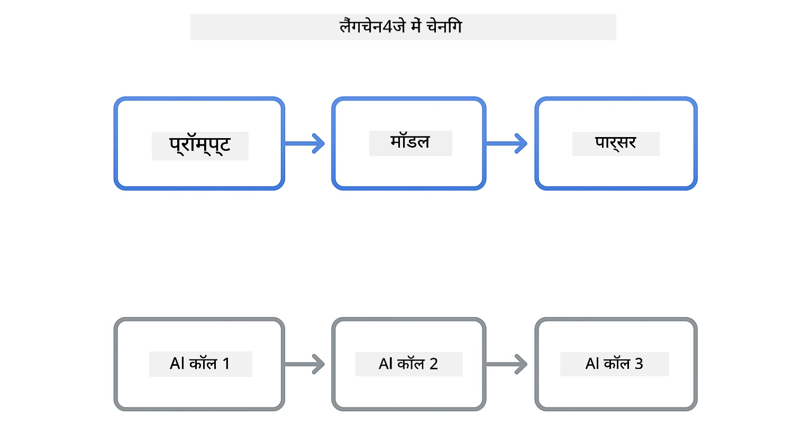
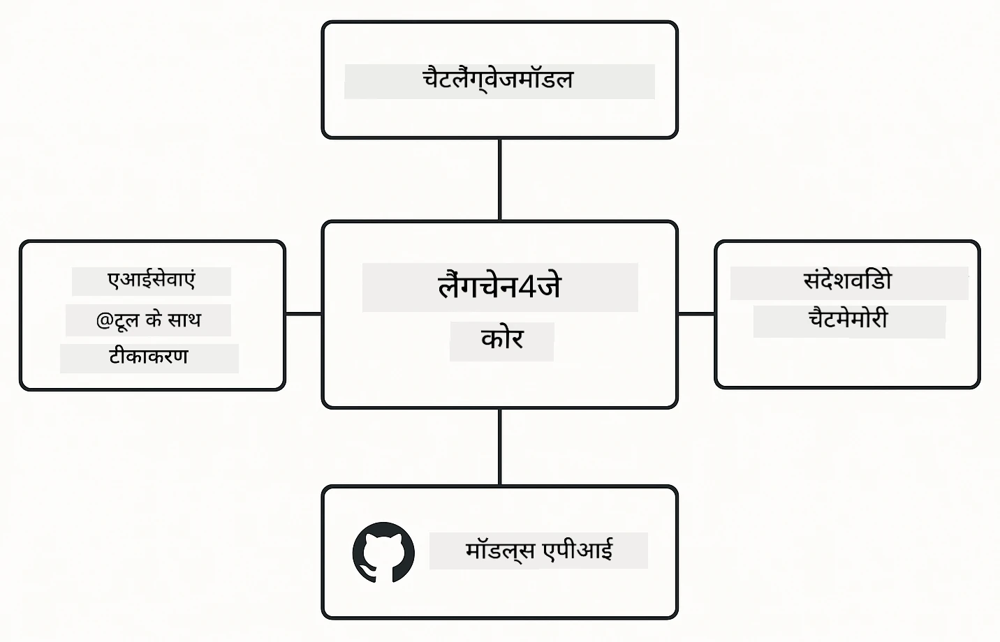

<!--
CO_OP_TRANSLATOR_METADATA:
{
  "original_hash": "22b5d7c8d7585325e38b37fd29eafe25",
  "translation_date": "2026-01-05T22:24:13+00:00",
  "source_file": "00-quick-start/README.md",
  "language_code": "hi"
}
-->
# Module 00: त्वरित आरंभ

## सामग्री सूची

- [परिचय](../../../00-quick-start)
- [LangChain4j क्या है?](../../../00-quick-start)
- [LangChain4j निर्भरताएँ](../../../00-quick-start)
- [पूर्वापेक्षाएँ](../../../00-quick-start)
- [सेटअप](../../../00-quick-start)
  - [1. अपना GitHub टोकन प्राप्त करें](../../../00-quick-start)
  - [2. अपना टोकन सेट करें](../../../00-quick-start)
- [उदाहरण चलाएँ](../../../00-quick-start)
  - [1. बुनियादी चैट](../../../00-quick-start)
  - [2. प्रॉम्प्ट पैटर्न](../../../00-quick-start)
  - [3. फ़ंक्शन कॉलिंग](../../../00-quick-start)
  - [4. दस्तावेज़ प्रश्नोत्तर (RAG)](../../../00-quick-start)
  - [5. जिम्मेदार AI](../../../00-quick-start)
- [प्रत्येक उदाहरण क्या दिखाता है](../../../00-quick-start)
- [अगले कदम](../../../00-quick-start)
- [समस्या निवारण](../../../00-quick-start)

## परिचय

यह त्वरित शुरुआत आपको LangChain4j के साथ यथासंभव जल्दी काम शुरू करने के लिए है। यह LangChain4j और GitHub मॉडल के साथ एआई एप्लिकेशन बनाने के बेहद मूलभूत पहलुओं को कवर करता है। अगले मॉड्यूल में आप Azure OpenAI का उपयोग LangChain4j के साथ करके अधिक उन्नत एप्लिकेशन बनाएंगे।

## LangChain4j क्या है?

LangChain4j एक जावा लाइब्रेरी है जो AI-सक्षम एप्लिकेशन बनाने को सरल बनाती है। HTTP क्लाइंट और JSON पार्सिंग के बजाय, आप साफ़-सुथरे जावा API के साथ काम करते हैं।

LangChain में "चेन" का मतलब कई घटकों को एक साथ जोड़ना है - आप एक प्रॉम्प्ट को मॉडल के साथ जोड़ सकते हैं, फिर पार्सर से जोड़ सकते हैं, या कई AI कॉल को इस तरह जोड़ सकते हैं कि एक आउटपुट अगले इनपुट को देता है। यह त्वरित शुरुआत मूल बातों पर केंद्रित है, फिर जटिल चेन खोजेगी।



*LangChain4j में घटकों को जोड़ना - बिल्डिंग ब्लॉक्स जुड़कर शक्तिशाली AI वर्कफ़्लो बनाते हैं*

हम तीन मुख्य घटकों का उपयोग करेंगे:

**ChatLanguageModel** - AI मॉडल इंटरैक्शन के लिए इंटरफ़ेस। `model.chat("prompt")` कॉल करें और प्रतिक्रिया स्ट्रिंग प्राप्त करें। हम `OpenAiOfficialChatModel` का उपयोग करते हैं जो OpenAI-संगत एंडपॉइंट्स जैसे GitHub मॉडल के साथ काम करता है।

**AiServices** - टाइप-सेफ AI सेवा इंटरफेस बनाता है। विधियाँ परिभाषित करें, उन्हें `@Tool` से एनोटेट करें, और LangChain4j समन्वय संभालता है। ज़रूरत पड़ने पर AI स्वचालित रूप से आपके जावा मेथड्स को कॉल करता है।

**MessageWindowChatMemory** - बातचीत का इतिहास बनाए रखता है। इसके बिना, प्रत्येक अनुरोध स्वतंत्र होता है। इसके साथ, AI पिछली संदेशों को याद रखता है और कई टर्न में संदर्भ बनाए रखता है।



*LangChain4j आर्किटेक्चर - मुख्य घटक एक साथ मिलकर आपके AI एप्लिकेशन चलाते हैं*

## LangChain4j निर्भरताएँ

यह त्वरित शुरुआत [`pom.xml`](../../../00-quick-start/pom.xml) में दो Maven निर्भरताओं का उपयोग करती है:

```xml
<!-- Core LangChain4j library -->
<dependency>
    <groupId>dev.langchain4j</groupId>
    <artifactId>langchain4j</artifactId> <!-- Inherited from BOM in root pom.xml -->
</dependency>

<!-- OpenAI integration (works with GitHub Models) -->
<dependency>
    <groupId>dev.langchain4j</groupId>
    <artifactId>langchain4j-open-ai-official</artifactId> <!-- Inherited from BOM in root pom.xml -->
</dependency>
```

`langchain4j-open-ai-official` मॉड्यूल `OpenAiOfficialChatModel` क्लास प्रदान करता है जो OpenAI-संगत API से कनेक्ट करता है। GitHub मॉडल वही API प्रारूप उपयोग करते हैं, इसलिए कोई विशेष एडाप्टर आवश्यक नहीं है - बस बेस URL को `https://models.github.ai/inference` पर सेट करें।

## पूर्वापेक्षाएँ

**डेव कंटेनर का उपयोग कर रहे हैं?** जावा और Maven पहले से इंस्टॉल हैं। आपको केवल GitHub पर्सनल एक्सेस टोकन चाहिए।

**लोकल डेवलपमेंट:**
- जावा 21+, Maven 3.9+
- GitHub पर्सनल एक्सेस टोकन (नीचे निर्देश)

> **ध्यान दें:** यह मॉड्यूल GitHub मॉडल से `gpt-4.1-nano` का उपयोग करता है। कोड में मॉडल नाम न बदलें - यह GitHub के उपलब्ध मॉडलों के लिए कॉन्फ़िगर किया गया है।

## सेटअप

### 1. अपना GitHub टोकन प्राप्त करें

1. [GitHub सेटिंग्स → पर्सनल एक्सेस टोकन](https://github.com/settings/personal-access-tokens) पर जाएं
2. "Generate new token" पर क्लिक करें
3. एक वर्णनात्मक नाम सेट करें (जैसे "LangChain4j Demo")
4. समाप्ति निर्धारित करें (7 दिन सुझाए जाते हैं)
5. "Account permissions" के तहत "Models" खोजें और इसे "Read-only" पर सेट करें
6. "Generate token" पर क्लिक करें
7. अपना टोकन कॉपी करें और सुरक्षित रखें - आप इसे फिर से नहीं देख पाएंगे

### 2. अपना टोकन सेट करें

**विकल्प 1: VS कोड का उपयोग करना (अनुशंसित)**

अगर आप VS Code उपयोग कर रहे हैं, तो प्रोजेक्ट रूट में `.env` फ़ाइल में अपना टोकन जोड़ें:

यदि `.env` फ़ाइल मौजूद नहीं है, तो `.env.example` को `.env` में कॉपी करें या प्रोजेक्ट रूट में नई `.env` फ़ाइल बनाएं।

**`.env` फ़ाइल का उदाहरण:**
```bash
# /workspaces/LangChain4j-for-Beginners/.env में
GITHUB_TOKEN=your_token_here
```

फिर आप आसानी से किसी भी डेमो फ़ाइल (जैसे `BasicChatDemo.java`) पर राइट-क्लिक करके **"Run Java"** चुन सकते हैं या रन और डिबग पैनल से लॉन्च कॉन्फ़िगरेशन उपयोग कर सकते हैं।

**विकल्प 2: टर्मिनल का उपयोग करना**

टोकन को पर्यावरण चर के रूप में सेट करें:

**Bash:**
```bash
export GITHUB_TOKEN=your_token_here
```

**PowerShell:**
```powershell
$env:GITHUB_TOKEN=your_token_here
```

## उदाहरण चलाएँ

**VS कोड का उपयोग:** बस किसी डेमो फ़ाइल पर राइट-क्लिक करें और **"Run Java"** चुनें, या रन और डिबग पैनल से लॉन्च कॉन्फ़िगरेशन का उपयोग करें (यह सुनिश्चित करें कि आपने टोकन पहले `.env` में जोड़ा हो)।

**Maven का उपयोग:** वैकल्पिक रूप से, आप कमांड लाइन से चला सकते हैं:

### 1. बुनियादी चैट

**Bash:**
```bash
mvn compile exec:java -Dexec.mainClass=com.example.langchain4j.quickstart.BasicChatDemo
```

**PowerShell:**
```powershell
mvn --% compile exec:java -Dexec.mainClass=com.example.langchain4j.quickstart.BasicChatDemo
```

### 2. प्रॉम्प्ट पैटर्न

**Bash:**
```bash
mvn compile exec:java -Dexec.mainClass=com.example.langchain4j.quickstart.PromptEngineeringDemo
```

**PowerShell:**
```powershell
mvn --% compile exec:java -Dexec.mainClass=com.example.langchain4j.quickstart.PromptEngineeringDemo
```

ज़ीरो-शॉट, फ्यू-शॉट, चेन-ऑफ़-थॉट, और रोल-आधारित प्रॉम्प्टिंग दिखाता है।

### 3. फ़ंक्शन कॉलिंग

**Bash:**
```bash
mvn compile exec:java -Dexec.mainClass=com.example.langchain4j.quickstart.ToolIntegrationDemo
```

**PowerShell:**
```powershell
mvn --% compile exec:java -Dexec.mainClass=com.example.langchain4j.quickstart.ToolIntegrationDemo
```

AI अपने आप आपके जावा मेथड्स को ज़रूरत पड़ने पर कॉल करता है।

### 4. दस्तावेज़ प्रश्नोत्तर (RAG)

**Bash:**
```bash
mvn compile exec:java -Dexec.mainClass=com.example.langchain4j.quickstart.SimpleReaderDemo
```

**PowerShell:**
```powershell
mvn --% compile exec:java -Dexec.mainClass=com.example.langchain4j.quickstart.SimpleReaderDemo
```

`document.txt` में सामग्री के बारे में प्रश्न पूछें।

### 5. जिम्मेदार AI

**Bash:**
```bash
mvn compile exec:java -Dexec.mainClass=com.example.langchain4j.quickstart.ResponsibleAIDemo
```

**PowerShell:**
```powershell
mvn --% compile exec:java -Dexec.mainClass=com.example.langchain4j.quickstart.ResponsibleAIDemo
```

देखें कैसे AI सुरक्षा फ़िल्टर हानिकारक सामग्री को रोकते हैं।

## प्रत्येक उदाहरण क्या दिखाता है

**बुनियादी चैट** - [BasicChatDemo.java](../../../00-quick-start/src/main/java/com/example/langchain4j/quickstart/BasicChatDemo.java)

यहाँ शुरू करें ताकि आप LangChain4j को सबसे सरल रूप में देखें। आप एक `OpenAiOfficialChatModel` बनाएंगे, `.chat()` के साथ प्रॉम्प्ट भेजेंगे, और प्रतिक्रिया प्राप्त करेंगे। यह बुनियाद दिखाता है: कस्टम एंडपॉइंट्स और API कुंजी के साथ मॉडल कैसे इनिशियलाइज़ करें। एक बार जब आप इस पैटर्न को समझ लें, तो बाकी सब कुछ इसी पर आधारित होगा।

```java
ChatLanguageModel model = OpenAiOfficialChatModel.builder()
    .baseUrl("https://models.github.ai/inference")
    .apiKey(System.getenv("GITHUB_TOKEN"))
    .modelName("gpt-4.1-nano")
    .build();

String response = model.chat("What is LangChain4j?");
System.out.println(response);
```

> **🤖 [GitHub Copilot](https://github.com/features/copilot) चैट के साथ आज़माएं:** [`BasicChatDemo.java`](../../../00-quick-start/src/main/java/com/example/langchain4j/quickstart/BasicChatDemo.java) खोलें और पूछें:
> - "इस कोड में GitHub मॉडल से Azure OpenAI पर कैसे स्विच करूँ?"
> - "OpenAiOfficialChatModel.builder() में और कौन से पैरामीटर कॉन्फ़िगर कर सकते हैं?"
> - "कैसे मैं पूर्ण प्रतिक्रिया का इंतजार किए बिना स्ट्रीमिंग प्रतिक्रियाएँ जोड़ सकता हूँ?"

**प्रॉम्प्ट इंजीनियरिंग** - [PromptEngineeringDemo.java](../../../00-quick-start/src/main/java/com/example/langchain4j/quickstart/PromptEngineeringDemo.java)

अब जब आप मॉडल से बात करना जानते हैं, तो देखें आप इसे क्या कहते हैं। यह डेमो उसी मॉडल सेटअप का उपयोग करता है लेकिन चार अलग-अलग प्रॉम्प्टिंग पैटर्न दिखाता है। डायरेक्ट इंस्ट्रक्शंस के लिए ज़ीरो-शॉट प्रॉम्प्ट ट्राय करें, उदाहरणों से सीखने के लिए फ्यू-शॉट, तर्क के चरण दिखाने के लिए चेन-ऑफ़-थॉट, और संदर्भ सेट करने वाले रोल-आधारित प्रॉम्प्ट। आप देखेंगे कि एक ही मॉडल आपके अनुरोध को कैसे फ्रेम करने पर बहुत अलग परिणाम देता है।

```java
PromptTemplate template = PromptTemplate.from(
    "What's the best time to visit {{destination}} for {{activity}}?"
);

Prompt prompt = template.apply(Map.of(
    "destination", "Paris",
    "activity", "sightseeing"
));

String response = model.chat(prompt.text());
```

> **🤖 [GitHub Copilot](https://github.com/features/copilot) चैट के साथ आज़माएं:** [`PromptEngineeringDemo.java`](../../../00-quick-start/src/main/java/com/example/langchain4j/quickstart/PromptEngineeringDemo.java) खोलें और पूछें:
> - "ज़ीरो-शॉट और फ्यू-शॉट प्रॉम्प्टिंग में क्या अंतर है, और मैं कब किसका उपयोग करूँ?"
> - "टेम्परेचर पैरामीटर मॉडल की प्रतिक्रियाओं को कैसे प्रभावित करता है?"
> - "प्रोडक्शन में प्रॉम्प्ट इंजेक्शन हमलों को रोकने के लिए क्या तकनीकें हैं?"
> - "सामान्य पैटर्न के लिए कैसे पुन: उपयोग योग्य PromptTemplate ऑब्जेक्ट बना सकता हूँ?"

**टूल इंटीग्रेशन** - [ToolIntegrationDemo.java](../../../00-quick-start/src/main/java/com/example/langchain4j/quickstart/ToolIntegrationDemo.java)

यहाँ LangChain4j शक्तिशाली होता है। आप `AiServices` का उपयोग करके ऐसे AI सहायक बनाएंगे जो आपके जावा मेथड्स को कॉल कर सकता है। बस मेथड्स को `@Tool("description")` से एनोटेट करें और LangChain4j बाकी काम संभालेगा - AI स्वचालित रूप से उपयोगकर्ता की बात के आधार पर प्रत्येक टूल का उपयोग कब करना है, निर्णय लेता है। यह फ़ंक्शन कॉलिंग दिखाता है, जो AI को सिर्फ सवाल जवाब नहीं बल्कि क्रियाएँ लेने में सक्षम बनाता है।

```java
@Tool("Performs addition of two numeric values")
public double add(double a, double b) {
    return a + b;
}

MathAssistant assistant = AiServices.create(MathAssistant.class, model);
String response = assistant.chat("What is 25 plus 17?");
```

> **🤖 [GitHub Copilot](https://github.com/features/copilot) चैट के साथ आज़माएं:** [`ToolIntegrationDemo.java`](../../../00-quick-start/src/main/java/com/example/langchain4j/quickstart/ToolIntegrationDemo.java) खोलें और पूछें:
> - "@Tool एनोटेशन कैसे काम करता है और LangChain4j इसके साथ पर्दे के पीछे क्या करता है?"
> - "क्या AI जटिल समस्याओं को हल करने के लिए कई टूल्स का अनुक्रम में कॉल कर सकता है?"
> - "अगर कोई टूल एक्सेप्शन फेंकता है तो क्या होता है - मैं त्रुटियों को कैसे संभालूं?"
> - "इस कैलकुलेटर उदाहरण के बजाय एक वास्तविक API कैसे इंटीग्रेट करूँ?"

**दस्तावेज़ प्रश्नोत्तर (RAG)** - [SimpleReaderDemo.java](../../../00-quick-start/src/main/java/com/example/langchain4j/quickstart/SimpleReaderDemo.java)

यहाँ आप RAG (retrieval-augmented generation) की नींव देखेंगे। मॉडल के प्रशिक्षण डेटा पर निर्भर रहने के बजाय, आप [`document.txt`](../../../00-quick-start/document.txt) से सामग्री लोड करते हैं और उसे प्रॉम्प्ट में शामिल करते हैं। AI आपके दस्तावेज़ के आधार पर जवाब देता है, न कि सामान्य ज्ञान के आधार पर। यह सिस्टम बनाने की पहली कदम है जो आपके डेटा के साथ काम कर सकता है।

```java
Document document = FileSystemDocumentLoader.loadDocument("document.txt");
String content = document.text();

String prompt = "Based on this document: " + content + 
                "\nQuestion: What is the main topic?";
String response = model.chat(prompt);
```

> **ध्यान दें:** यह सरल तरीका पूरे दस्तावेज़ को प्रॉम्प्ट में लोड करता है। बड़े फाइलों (>10KB) के लिए यह संदर्भ सीमा पार कर सकता है। मॉड्यूल 03 में उत्पादन RAG सिस्टम के लिए खंडन और वेक्टर खोज कवर किया गया है।

> **🤖 [GitHub Copilot](https://github.com/features/copilot) चैट के साथ आज़माएं:** [`SimpleReaderDemo.java`](../../../00-quick-start/src/main/java/com/example/langchain4j/quickstart/SimpleReaderDemo.java) खोलें और पूछें:
> - "RAG AI हल्यूसिनेशन को कैसे रोकता है, जबकि मॉडल के प्रशिक्षण डेटा का उपयोग नहीं करता?"
> - "इस सरल तरीके और वेक्टर एम्बेडिंग के उपयोग में क्या फर्क है?"
> - "इसे कई दस्तावेज़ या बड़े ज्ञान आधार संभालने के लिए कैसे स्केल करूँ?"
> - "कैसे प्रॉम्प्ट को इस तरह स्ट्रक्चर करें कि AI सिर्फ उपलब्ध संदर्भ का ही उपयोग करे?"

**जिम्मेदार AI** - [ResponsibleAIDemo.java](../../../00-quick-start/src/main/java/com/example/langchain4j/quickstart/ResponsibleAIDemo.java)

डिफेंस इन डेप्थ के साथ AI सुरक्षा बनाएं। यह डेमो दो स्तरों की सुरक्षा दिखाता है:

**भाग 1: LangChain4j इनपुट गार्डरेल्स** - खतरनाक प्रॉम्प्ट्स को LLM तक पहुँचने से पहले ब्लॉक करें। कस्टम गार्डरेल्स बनाएं जो वर्जित कीवर्ड या पैटर्न जांचते हैं। ये आपके कोड में चलते हैं, इसलिए तेज़ और मुक्त हैं।

```java
class DangerousContentGuardrail implements InputGuardrail {
    @Override
    public InputGuardrailResult validate(UserMessage userMessage) {
        String text = userMessage.singleText().toLowerCase();
        if (text.contains("explosives")) {
            return fatal("Blocked: contains prohibited keyword");
        }
        return success();
    }
}
```

**भाग 2: प्रदाता सुरक्षा फ़िल्टर** - GitHub मॉडल में बिल्ट-इन फ़िल्टर होते हैं जो आपकी गार्डरेल्स से छूटे मामलों को पकड़ते हैं। आप सख्त ब्लॉक्स (HTTP 400 त्रुटियां) और सौम्य इंकार (AI विनम्रता से मना करता है) देखेंगे।

> **🤖 [GitHub Copilot](https://github.com/features/copilot) चैट के साथ आज़माएं:** [`ResponsibleAIDemo.java`](../../../00-quick-start/src/main/java/com/example/langchain4j/quickstart/ResponsibleAIDemo.java) खोलें और पूछें:
> - "InputGuardrail क्या है और मैं कैसे अपना खुद का बना सकता हूँ?"
> - "कठोर ब्लॉक और सौम्य इंकार में क्या अंतर है?"
> - "गॉर्डरेल्स और प्रदाता फ़िल्टर दोनों का एक साथ उपयोग क्यों करें?"

## अगले कदम

**अगला मॉड्यूल:** [01-introduction - LangChain4j और Azure पर gpt-5 के साथ शुरुआत](../01-introduction/README.md)

---

**नेविगेशन:** [← मुख्य पृष्ठ पर वापस जाएँ](../README.md) | [अगला: मॉड्यूल 01 - परिचय →](../01-introduction/README.md)

---

## समस्या निवारण

### पहली बार Maven बिल्ड

**समस्या:** शुरुआती `mvn clean compile` या `mvn package` में लंबा समय लगता है (10-15 मिनट)

**कारण:** Maven को पहली बिल्ड में सभी प्रोजेक्ट निर्भरताएँ (Spring Boot, LangChain4j लाइब्रेरीज़, Azure SDKs आदि) डाउनलोड करनी होती हैं।

**समाधान:** यह सामान्य व्यवहार है। बाद की बिल्ड बहुत तेज होंगी क्योंकि निर्भरताएँ लोकल में कैश हो चुकी होंगी। डाउनलोड समय आपके नेटवर्क गति पर निर्भर करता है।

### PowerShell Maven कमांड सिंटैक्स

**समस्या:** Maven कमांड `Unknown lifecycle phase ".mainClass=..."` त्रुटि देते हैं

**कारण:** PowerShell `=` को एक वैरिएबल असाइनमेंट ऑपरेटर के रूप में समझता है, जिससे Maven की प्रॉपर्टी सिंटैक्स टूट जाती है।
**Solution**: Maven कमांड से पहले स्टॉप-पार्सिंग ऑपरेटर `--%` का उपयोग करें:

**PowerShell:**
```powershell
mvn --% compile exec:java -Dexec.mainClass=com.example.langchain4j.quickstart.BasicChatDemo
```

**Bash:**
```bash
mvn compile exec:java -Dexec.mainClass=com.example.langchain4j.quickstart.BasicChatDemo
```

`--%` ऑपरेटर PowerShell को बताता है कि वह शेष सभी आर्गुमेंट्स को Maven को बिना किसी व्याख्या के सीधे पास करे।

### Windows PowerShell Emoji डिस्प्ले

**Issue**: PowerShell में AI प्रतिक्रियाएँ इमोजी के बजाय गड़बड़ अक्षर दिखाती हैं (जैसे `????` या `â??`)

**Cause**: PowerShell की डिफ़ॉल्ट एनकोडिंग UTF-8 इमोजी को सपोर्ट नहीं करती

**Solution**: Java एप्लिकेशन चलाने से पहले इस कमांड को चलाएं:
```cmd
chcp 65001
```

यह टर्मिनल में UTF-8 एन्कोडिंग को मजबूर करता है। वैकल्पिक रूप से, Windows Terminal का उपयोग करें जिसमें बेहतर यूनिकोड सपोर्ट होता है।

### API कॉल्स का डिबगिंग

**Issue**: प्रमाणिकता त्रुटियाँ, रेट लिमिट, या AI मॉडल से अप्रत्याशित प्रतिक्रियाएँ

**Solution**: उदाहरणों में `.logRequests(true)` और `.logResponses(true)` शामिल हैं जो API कॉल्स को कंसोल में दिखाते हैं। यह प्रमाणिकता त्रुटियों, रेट लिमिट, या अप्रत्याशित प्रतिक्रियाओं को ट्रबलशूट करने में मदद करता है। उत्पादन में लॉग शोर कम करने के लिए इन फ्लैग्स को हटा दें।

---

<!-- CO-OP TRANSLATOR DISCLAIMER START -->
**अस्वीकरण**:  
यह दस्तावेज़ AI अनुवाद सेवा [Co-op Translator](https://github.com/Azure/co-op-translator) का उपयोग करके अनुवादित किया गया है। यद्यपि हम सटीकता के लिए प्रयासरत हैं, कृपया ध्यान दें कि स्वचालित अनुवाद में त्रुटियाँ या असंगतियाँ हो सकती हैं। मूल भाषा में दस्तावेज़ को आधिकारिक स्रोत माना जाना चाहिए। महत्वपूर्ण जानकारी के लिए पेशेवर मानव अनुवाद की अनुशंसा की जाती है। इस अनुवाद के उपयोग से उत्पन्न किसी भी गलत समझ या गलत व्याख्या के लिए हम उत्तरदायी नहीं हैं।
<!-- CO-OP TRANSLATOR DISCLAIMER END -->