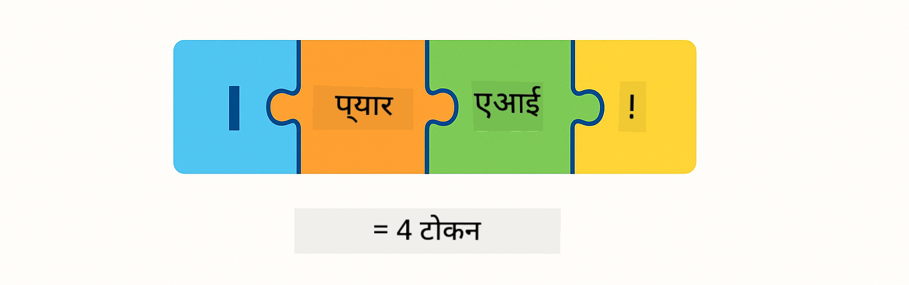
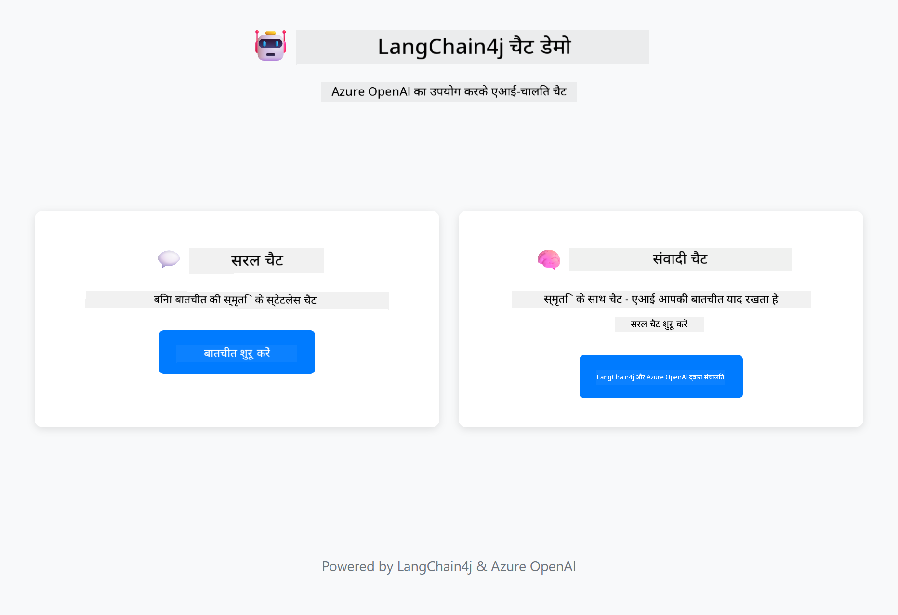
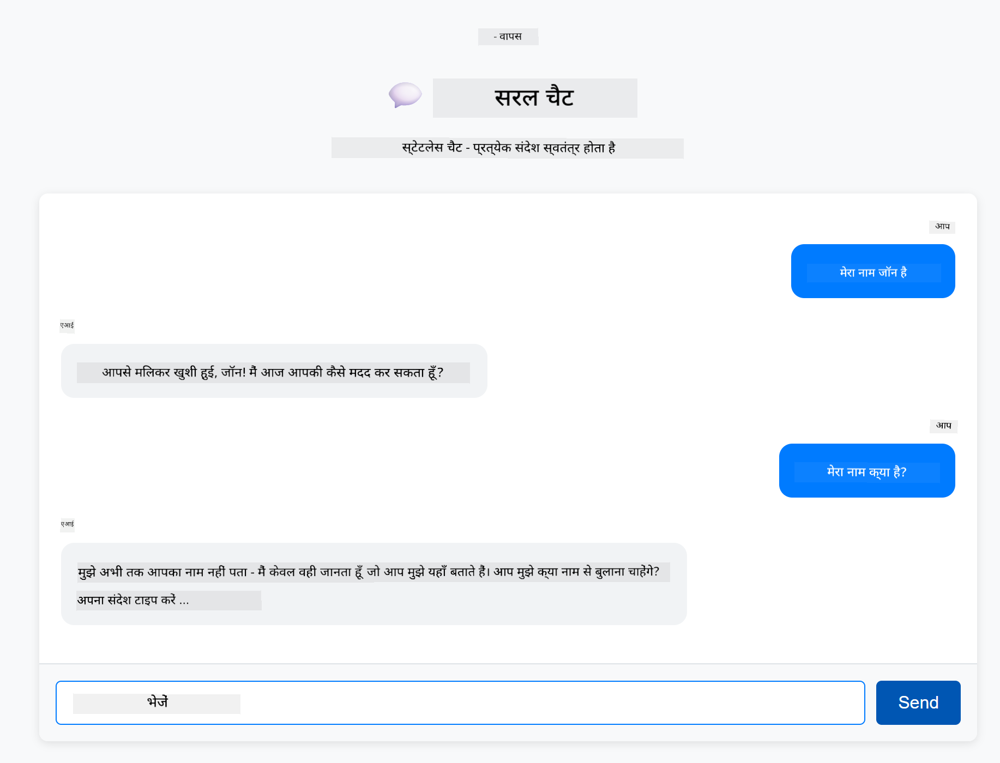
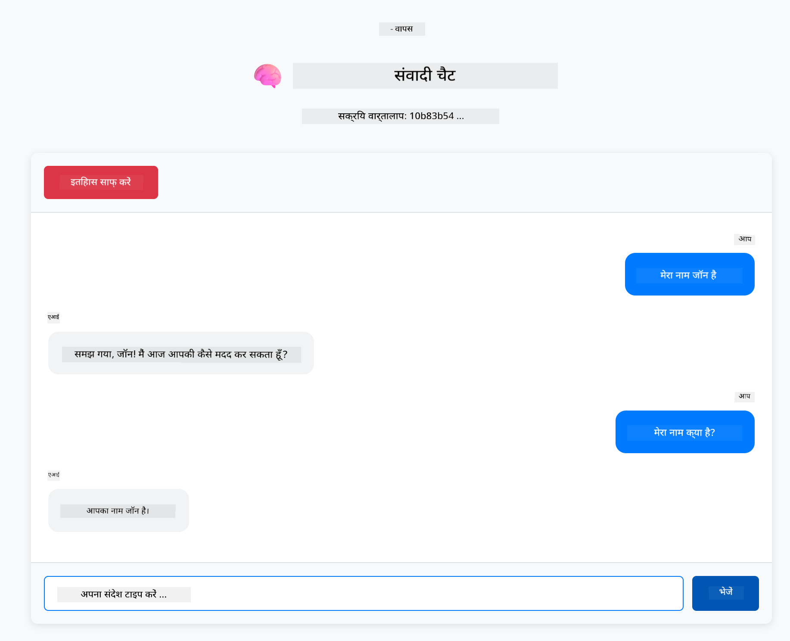

<!--
CO_OP_TRANSLATOR_METADATA:
{
  "original_hash": "c3e07ca58d0b8a3f47d3bf5728541e0a",
  "translation_date": "2025-12-13T13:19:59+00:00",
  "source_file": "01-introduction/README.md",
  "language_code": "hi"
}
-->
# Module 01: LangChain4j के साथ शुरुआत करना

## Table of Contents

- [आप क्या सीखेंगे](../../../01-introduction)
- [पूर्वापेक्षाएँ](../../../01-introduction)
- [मूल समस्या को समझना](../../../01-introduction)
- [टोकन को समझना](../../../01-introduction)
- [मेमोरी कैसे काम करती है](../../../01-introduction)
- [यह LangChain4j का उपयोग कैसे करता है](../../../01-introduction)
- [Azure OpenAI इन्फ्रास्ट्रक्चर तैनात करें](../../../01-introduction)
- [एप्लिकेशन को लोकली चलाएं](../../../01-introduction)
- [एप्लिकेशन का उपयोग करना](../../../01-introduction)
  - [Stateless चैट (बायाँ पैनल)](../../../01-introduction)
  - [Stateful चैट (दायाँ पैनल)](../../../01-introduction)
- [अगले कदम](../../../01-introduction)

## आप क्या सीखेंगे

यदि आपने क्विक स्टार्ट पूरा किया है, तो आपने देखा होगा कि कैसे प्रॉम्प्ट भेजें और प्रतिक्रियाएँ प्राप्त करें। यह आधार है, लेकिन वास्तविक एप्लिकेशन को इससे अधिक की आवश्यकता होती है। यह मॉड्यूल आपको सिखाएगा कि कैसे ऐसा संवादात्मक AI बनाएं जो संदर्भ याद रखता है और स्थिति बनाए रखता है - जो एक बार के डेमो और उत्पादन-तैयार एप्लिकेशन के बीच का अंतर है।

हम इस गाइड में Azure OpenAI के GPT-5 का उपयोग करेंगे क्योंकि इसकी उन्नत तर्क क्षमताएँ विभिन्न पैटर्न के व्यवहार को अधिक स्पष्ट बनाती हैं। जब आप मेमोरी जोड़ेंगे, तो आप स्पष्ट रूप से अंतर देखेंगे। इससे यह समझना आसान हो जाता है कि प्रत्येक घटक आपके एप्लिकेशन में क्या लाता है।

आप एक ऐसा एप्लिकेशन बनाएंगे जो दोनों पैटर्न को प्रदर्शित करता है:

**Stateless चैट** - प्रत्येक अनुरोध स्वतंत्र होता है। मॉडल को पिछले संदेशों की कोई याददाश्त नहीं होती। यह वह पैटर्न है जिसे आपने क्विक स्टार्ट में उपयोग किया था।

**Stateful बातचीत** - प्रत्येक अनुरोध में बातचीत का इतिहास शामिल होता है। मॉडल कई चरणों में संदर्भ बनाए रखता है। यही वह चीज़ है जिसकी उत्पादन एप्लिकेशन को आवश्यकता होती है।

## पूर्वापेक्षाएँ

- Azure सदस्यता जिसमें Azure OpenAI एक्सेस हो
- Java 21, Maven 3.9+
- Azure CLI (https://learn.microsoft.com/en-us/cli/azure/install-azure-cli)
- Azure Developer CLI (azd) (https://learn.microsoft.com/en-us/azure/developer/azure-developer-cli/install-azd)

> **Note:** Java, Maven, Azure CLI और Azure Developer CLI (azd) पहले से devcontainer में इंस्टॉल हैं।

> **Note:** यह मॉड्यूल Azure OpenAI पर GPT-5 का उपयोग करता है। तैनाती `azd up` के माध्यम से स्वचालित रूप से कॉन्फ़िगर की जाती है - कोड में मॉडल नाम को संशोधित न करें।

## मूल समस्या को समझना

भाषा मॉडल stateless होते हैं। प्रत्येक API कॉल स्वतंत्र होता है। यदि आप "मेरा नाम जॉन है" भेजते हैं और फिर पूछते हैं "मेरा नाम क्या है?", तो मॉडल को पता नहीं होता कि आपने अभी अपना परिचय दिया है। यह हर अनुरोध को ऐसा मानता है जैसे यह आपकी पहली बातचीत हो।

यह सरल प्रश्नोत्तर के लिए ठीक है लेकिन वास्तविक एप्लिकेशन के लिए बेकार है। ग्राहक सेवा बॉट्स को याद रखना पड़ता है कि आपने क्या कहा था। व्यक्तिगत सहायक को संदर्भ की आवश्यकता होती है। कोई भी बहु-चरणीय बातचीत मेमोरी की मांग करती है।


*Stateless (स्वतंत्र कॉल) और Stateful (संदर्भ-सचेत) बातचीत के बीच का अंतर*

## टोकन को समझना

बातचीत में जाने से पहले, टोकन को समझना महत्वपूर्ण है - वे मूल पाठ इकाइयाँ हैं जिन्हें भाषा मॉडल संसाधित करते हैं:



*कैसे टेक्स्ट को टोकन में तोड़ा जाता है - "I love AI!" 4 अलग-अलग प्रोसेसिंग यूनिट्स बन जाता है*

टोकन AI मॉडल के लिए टेक्स्ट को मापने और संसाधित करने का तरीका हैं। शब्द, विराम चिह्न, और यहां तक कि रिक्त स्थान भी टोकन हो सकते हैं। आपके मॉडल के पास एक सीमा होती है कि वह एक बार में कितने टोकन संसाधित कर सकता है (GPT-5 के लिए 400,000, जिसमें 272,000 इनपुट टोकन और 128,000 आउटपुट टोकन तक)। टोकन को समझना आपको बातचीत की लंबाई और लागत को प्रबंधित करने में मदद करता है।

## मेमोरी कैसे काम करती है

चैट मेमोरी stateless समस्या को बातचीत के इतिहास को बनाए रखकर हल करती है। मॉडल को अनुरोध भेजने से पहले, फ्रेमवर्क प्रासंगिक पिछले संदेशों को जोड़ देता है। जब आप पूछते हैं "मेरा नाम क्या है?", तो सिस्टम वास्तव में पूरी बातचीत का इतिहास भेजता है, जिससे मॉडल देख सकता है कि आपने पहले कहा था "मेरा नाम जॉन है।"

LangChain4j मेमोरी कार्यान्वयन प्रदान करता है जो इसे स्वचालित रूप से संभालता है। आप चुनते हैं कि कितने संदेश रखना है और फ्रेमवर्क संदर्भ विंडो का प्रबंधन करता है।


*MessageWindowChatMemory हाल के संदेशों की एक स्लाइडिंग विंडो बनाए रखता है, पुराने संदेशों को स्वचालित रूप से हटा देता है*

## यह LangChain4j का उपयोग कैसे करता है

यह मॉड्यूल क्विक स्टार्ट का विस्तार करता है, Spring Boot को एकीकृत करता है और बातचीत की मेमोरी जोड़ता है। यहाँ घटक कैसे जुड़ते हैं:

**Dependencies** - दो LangChain4j लाइब्रेरी जोड़ें:

```xml
<dependency>
    <groupId>dev.langchain4j</groupId>
    <artifactId>langchain4j</artifactId> <!-- Inherited from BOM in root pom.xml -->
</dependency>
<dependency>
    <groupId>dev.langchain4j</groupId>
    <artifactId>langchain4j-open-ai-official</artifactId> <!-- Inherited from BOM in root pom.xml -->
</dependency>
```

**Chat Model** - Azure OpenAI को Spring bean के रूप में कॉन्फ़िगर करें ([LangChainConfig.java](../../../01-introduction/src/main/java/com/example/langchain4j/config/LangChainConfig.java)):

```java
@Bean
public OpenAiOfficialChatModel openAiOfficialChatModel() {
    return OpenAiOfficialChatModel.builder()
            .baseUrl(azureEndpoint)
            .apiKey(azureApiKey)
            .modelName(deploymentName)
            .timeout(Duration.ofMinutes(5))
            .maxRetries(3)
            .build();
}
```

बिल्डर `azd up` द्वारा सेट किए गए पर्यावरण चर से क्रेडेंशियल पढ़ता है। `baseUrl` को अपने Azure endpoint पर सेट करने से OpenAI क्लाइंट Azure OpenAI के साथ काम करता है।

**Conversation Memory** - MessageWindowChatMemory के साथ चैट इतिहास ट्रैक करें ([ConversationService.java](../../../01-introduction/src/main/java/com/example/langchain4j/service/ConversationService.java)):

```java
ChatMemory memory = MessageWindowChatMemory.withMaxMessages(10);

memory.add(UserMessage.from("My name is John"));
memory.add(AiMessage.from("Nice to meet you, John!"));

memory.add(UserMessage.from("What's my name?"));
AiMessage aiMessage = chatModel.chat(memory.messages()).aiMessage();
memory.add(aiMessage);
```

`withMaxMessages(10)` के साथ मेमोरी बनाएं ताकि अंतिम 10 संदेश रखे जाएं। उपयोगकर्ता और AI संदेशों को टाइप किए गए रैपर के साथ जोड़ें: `UserMessage.from(text)` और `AiMessage.from(text)`। इतिहास प्राप्त करें `memory.messages()` से और इसे मॉडल को भेजें। सेवा प्रत्येक बातचीत ID के लिए अलग मेमोरी उदाहरण संग्रहीत करती है, जिससे कई उपयोगकर्ता एक साथ चैट कर सकते हैं।

> **🤖 [GitHub Copilot](https://github.com/features/copilot) चैट के साथ प्रयास करें:** [`ConversationService.java`](../../../01-introduction/src/main/java/com/example/langchain4j/service/ConversationService.java) खोलें और पूछें:
> - "MessageWindowChatMemory विंडो भर जाने पर कौन से संदेश हटाने का निर्णय कैसे लेता है?"
> - "क्या मैं इन-मेमोरी के बजाय डेटाबेस का उपयोग करके कस्टम मेमोरी स्टोरेज लागू कर सकता हूँ?"
> - "मैं पुराने बातचीत इतिहास को संक्षेपित करने के लिए सारांश कैसे जोड़ सकता हूँ?"

Stateless चैट एंडपॉइंट मेमोरी को पूरी तरह से छोड़ देता है - बस `chatModel.chat(prompt)` जैसा कि क्विक स्टार्ट में था। Stateful एंडपॉइंट मेमोरी में संदेश जोड़ता है, इतिहास प्राप्त करता है, और प्रत्येक अनुरोध के साथ वह संदर्भ शामिल करता है। मॉडल कॉन्फ़िगरेशन समान है, पैटर्न अलग।

## Azure OpenAI इन्फ्रास्ट्रक्चर तैनात करें

**Bash:**
```bash
cd 01-introduction
azd up  # सदस्यता और स्थान चुनें (eastus2 अनुशंसित)
```

**PowerShell:**
```powershell
cd 01-introduction
azd up  # सदस्यता और स्थान चुनें (eastus2 अनुशंसित)
```

> **Note:** यदि आपको टाइमआउट त्रुटि मिलती है (`RequestConflict: Cannot modify resource ... provisioning state is not terminal`), तो बस `azd up` फिर से चलाएं। Azure संसाधन अभी भी पृष्ठभूमि में प्रोविजनिंग हो सकते हैं, और पुनः प्रयास करने से तैनाती तब पूरी हो जाएगी जब संसाधन टर्मिनल स्थिति में पहुंचेंगे।

यह करेगा:
1. GPT-5 और text-embedding-3-small मॉडल के साथ Azure OpenAI संसाधन तैनात करेगा
2. प्रोजेक्ट रूट में स्वचालित रूप से `.env` फ़ाइल बनाएगा जिसमें क्रेडेंशियल होंगे
3. सभी आवश्यक पर्यावरण चर सेट करेगा

**तैनाती में समस्या आ रही है?** विस्तृत समस्या निवारण के लिए [Infrastructure README](infra/README.md) देखें जिसमें सबडोमेन नाम संघर्ष, मैनुअल Azure पोर्टल तैनाती चरण, और मॉडल कॉन्फ़िगरेशन मार्गदर्शन शामिल हैं।

**तैनाती सफल हुई या नहीं जांचें:**

**Bash:**
```bash
cat ../.env  # AZURE_OPENAI_ENDPOINT, API_KEY, आदि दिखाना चाहिए।
```

**PowerShell:**
```powershell
Get-Content ..\.env  # AZURE_OPENAI_ENDPOINT, API_KEY, आदि दिखाना चाहिए।
```

> **Note:** `azd up` कमांड स्वचालित रूप से `.env` फ़ाइल बनाता है। यदि आपको बाद में इसे अपडेट करना है, तो आप या तो `.env` फ़ाइल को मैन्युअली संपादित कर सकते हैं या इसे पुनः उत्पन्न करने के लिए निम्न चलाएं:
>
> **Bash:**
> ```bash
> cd ..
> bash .azd-env.sh
> ```
>
> **PowerShell:**
> ```powershell
> cd ..
> .\.azd-env.ps1
> ```

## एप्लिकेशन को लोकली चलाएं

**तैनाती सत्यापित करें:**

सुनिश्चित करें कि रूट डायरेक्टरी में `.env` फ़ाइल मौजूद है जिसमें Azure क्रेडेंशियल हैं:

**Bash:**
```bash
cat ../.env  # AZURE_OPENAI_ENDPOINT, API_KEY, DEPLOYMENT दिखाना चाहिए
```

**PowerShell:**
```powershell
Get-Content ..\.env  # AZURE_OPENAI_ENDPOINT, API_KEY, DEPLOYMENT दिखाना चाहिए
```

**एप्लिकेशन शुरू करें:**

**विकल्प 1: Spring Boot डैशबोर्ड का उपयोग करना (VS Code उपयोगकर्ताओं के लिए अनुशंसित)**

डेव कंटेनर में Spring Boot डैशबोर्ड एक्सटेंशन शामिल है, जो सभी Spring Boot एप्लिकेशन को प्रबंधित करने के लिए एक दृश्य इंटरफ़ेस प्रदान करता है। आप इसे VS Code के बाएं साइड में एक्टिविटी बार में देख सकते हैं (Spring Boot आइकन देखें)।

Spring Boot डैशबोर्ड से आप:
- कार्यक्षेत्र में सभी उपलब्ध Spring Boot एप्लिकेशन देख सकते हैं
- एक क्लिक से एप्लिकेशन शुरू/रोक सकते हैं
- एप्लिकेशन लॉग्स को रियल-टाइम में देख सकते हैं
- एप्लिकेशन की स्थिति मॉनिटर कर सकते हैं

बस "introduction" के बगल में प्ले बटन पर क्लिक करें इस मॉड्यूल को शुरू करने के लिए, या सभी मॉड्यूल एक साथ शुरू करें।


**विकल्प 2: शेल स्क्रिप्ट्स का उपयोग करना**

सभी वेब एप्लिकेशन (मॉड्यूल 01-04) शुरू करें:

**Bash:**
```bash
cd ..  # रूट निर्देशिका से
./start-all.sh
```

**PowerShell:**
```powershell
cd ..  # रूट निर्देशिका से
.\start-all.ps1
```

या केवल इस मॉड्यूल को शुरू करें:

**Bash:**
```bash
cd 01-introduction
./start.sh
```

**PowerShell:**
```powershell
cd 01-introduction
.\start.ps1
```

दोनों स्क्रिप्ट्स स्वचालित रूप से रूट `.env` फ़ाइल से पर्यावरण चर लोड करेंगी और यदि JAR मौजूद नहीं हैं तो उन्हें बनाएंगी।

> **Note:** यदि आप शुरू करने से पहले सभी मॉड्यूल मैन्युअली बनाना पसंद करते हैं:
>
> **Bash:**
> ```bash
> cd ..  # Go to root directory
> mvn clean package -DskipTests
> ```
>
> **PowerShell:**
> ```powershell
> cd ..  # Go to root directory
> mvn clean package -DskipTests
> ```

अपने ब्राउज़र में http://localhost:8080 खोलें।

**रोकने के लिए:**

**Bash:**
```bash
./stop.sh  # केवल यह मॉड्यूल
# या
cd .. && ./stop-all.sh  # सभी मॉड्यूल
```

**PowerShell:**
```powershell
.\stop.ps1  # केवल यह मॉड्यूल
# या
cd ..; .\stop-all.ps1  # सभी मॉड्यूल
```

## एप्लिकेशन का उपयोग करना

एप्लिकेशन एक वेब इंटरफ़ेस प्रदान करता है जिसमें दो चैट कार्यान्वयन साइड-बाय-साइड हैं।



*डैशबोर्ड जो Simple Chat (stateless) और Conversational Chat (stateful) विकल्प दोनों दिखाता है*

### Stateless चैट (बायाँ पैनल)

पहले इसे आज़माएं। पूछें "मेरा नाम जॉन है" और फिर तुरंत पूछें "मेरा नाम क्या है?" मॉडल याद नहीं रखेगा क्योंकि प्रत्येक संदेश स्वतंत्र है। यह मूल भाषा मॉडल एकीकरण की मुख्य समस्या को दर्शाता है - कोई बातचीत संदर्भ नहीं।



*AI पिछले संदेश से आपका नाम याद नहीं रखता*

### Stateful चैट (दायाँ पैनल)

अब यहाँ वही क्रम आज़माएं। पूछें "मेरा नाम जॉन है" और फिर "मेरा नाम क्या है?" इस बार यह याद रखता है। अंतर है MessageWindowChatMemory - यह बातचीत का इतिहास बनाए रखता है और प्रत्येक अनुरोध के साथ इसे शामिल करता है। यही उत्पादन संवादात्मक AI का तरीका है।



*AI बातचीत में पहले बताए गए आपके नाम को याद रखता है*

दोनों पैनल एक ही GPT-5 मॉडल का उपयोग करते हैं। केवल अंतर मेमोरी है। इससे स्पष्ट होता है कि मेमोरी आपके एप्लिकेशन में क्या लाती है और क्यों यह वास्तविक उपयोग मामलों के लिए आवश्यक है।

## अगले कदम

**अगला मॉड्यूल:** [02-prompt-engineering - GPT-5 के साथ प्रॉम्प्ट इंजीनियरिंग](../02-prompt-engineering/README.md)

---

**नेविगेशन:** [← पिछला: Module 00 - Quick Start](../00-quick-start/README.md) | [मुख्य पृष्ठ पर वापस](../README.md) | [अगला: Module 02 - Prompt Engineering →](../02-prompt-engineering/README.md)

---

<!-- CO-OP TRANSLATOR DISCLAIMER START -->
**अस्वीकरण**:  
यह दस्तावेज़ AI अनुवाद सेवा [Co-op Translator](https://github.com/Azure/co-op-translator) का उपयोग करके अनुवादित किया गया है। जबकि हम सटीकता के लिए प्रयासरत हैं, कृपया ध्यान दें कि स्वचालित अनुवादों में त्रुटियाँ या अशुद्धियाँ हो सकती हैं। मूल दस्तावेज़ अपनी मूल भाषा में ही अधिकारिक स्रोत माना जाना चाहिए। महत्वपूर्ण जानकारी के लिए, पेशेवर मानव अनुवाद की सलाह दी जाती है। इस अनुवाद के उपयोग से उत्पन्न किसी भी गलतफहमी या गलत व्याख्या के लिए हम जिम्मेदार नहीं हैं।
<!-- CO-OP TRANSLATOR DISCLAIMER END -->