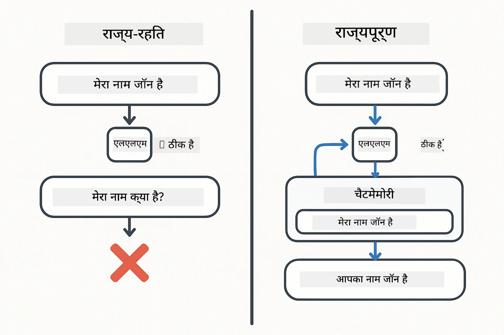
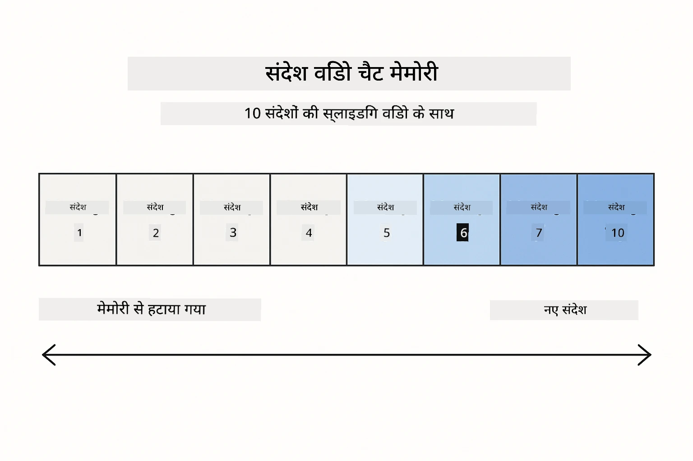
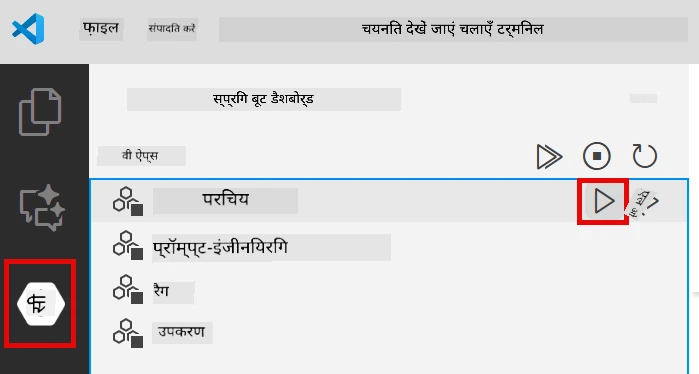
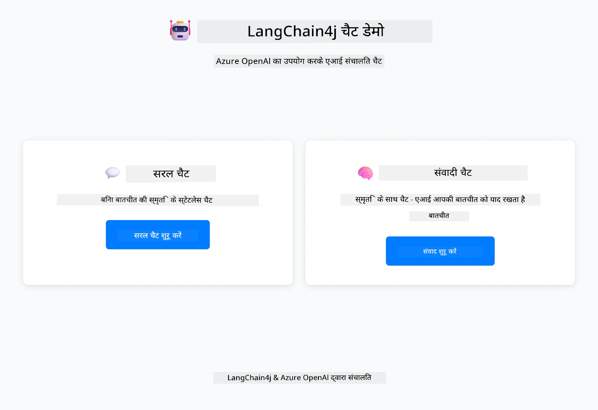
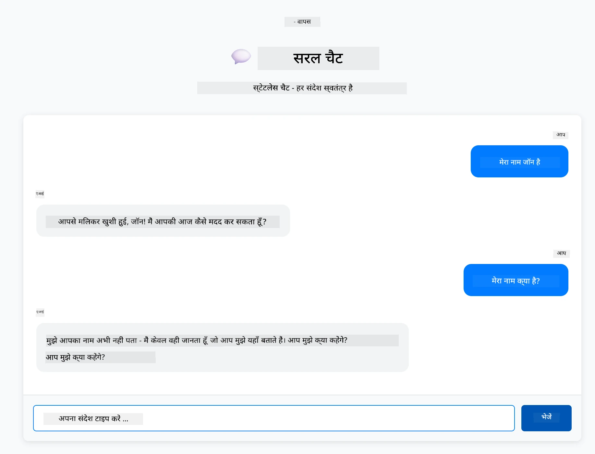
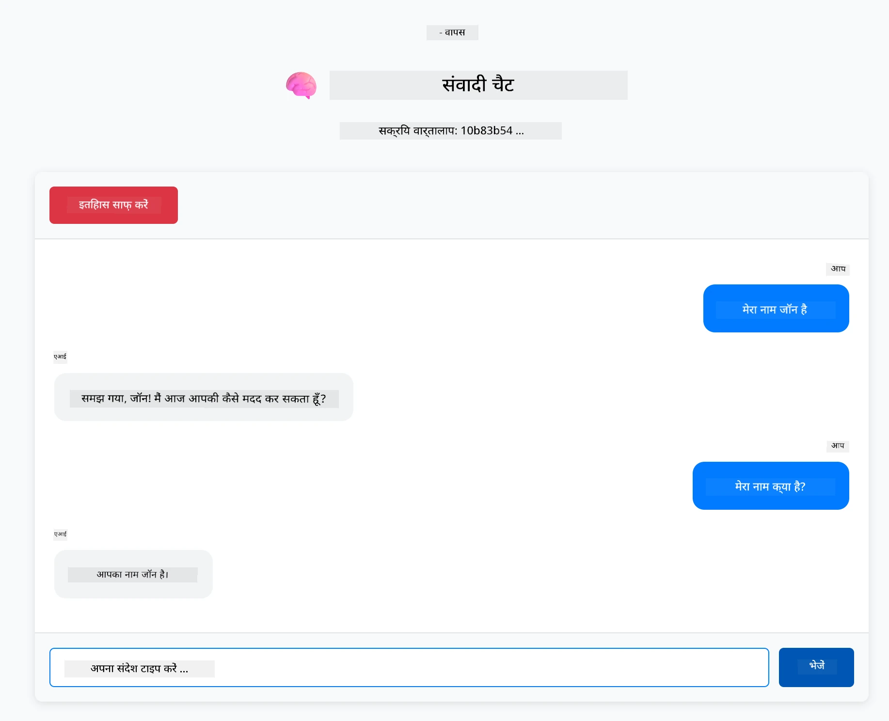

# मॉड्यूल 01: LangChain4j के साथ शुरुआत करना

## सामग्री सूची

- [वीडियो वाकथ्रू](#वीडियो-वाकथ्रू)
- [आप क्या सीखेंगे](#आप-क्या-सीखेंगे)
- [पूर्वापेक्षाएं](#पूर्वापेक्षाएं)
- [मूल समस्या को समझना](#मूल-समस्या-को-समझना)
- [टोकन को समझना](#टोकन-को-समझना)
- [मेमोरी कैसे काम करती है](#मेमोरी-कैसे-काम-करती-है)
- [यह LangChain4j का उपयोग कैसे करता है](#यह-langchain4j-का-उपयोग-कैसे-करता-है)
- [Azure OpenAI इन्फ्रास्ट्रक्चर डिप्लॉय करें](#azure-openai-इन्फ्रास्ट्रक्चर-डिप्लॉय-करें)
- [ऐप्लिकेशन को लोकली चलाएं](#ऐप्लिकेशन-को-लोकली-चलाएं)
- [ऐप्लिकेशन का उपयोग](#ऐप्लिकेशन-का-उपयोग)
  - [स्टेटलेस चैट (बायाँ पैनल)](#स्टेटलेस-चैट-बायाँ-पैनल)
  - [स्टेटफुल चैट (दायाँ पैनल)](#स्टेटफुल-चैट-दायाँ-पैनल)
- [अगले कदम](#अगले-कदम)

## वीडियो वाकथ्रू

इस लाइव सेशन को देखें जो इस मॉड्यूल के साथ शुरुआत करने के तरीके को समझाता है:

<a href="https://www.youtube.com/live/nl_troDm8rQ?si=6b85S8xGjWnT2fX9"></a>

## आप क्या सीखेंगे

यह LangChain4j और Azure OpenAI के साथ आपकी शुरुआती बिंदु है। हम मूल बातों से शुरू करते हैं और उत्पादन-शैली के ऐप्लिकेशन बनाना शुरू करते हैं। यह मॉड्यूल वार्तालाप एआई पर केंद्रित है जो संदर्भ को याद रखता है और स्टेट को बनाए रखता है — जो प्रत्येक बाद के मॉड्यूल का आधार है।

इस गाइड में हम Azure OpenAI का GPT-5.2 उपयोग करेंगे क्योंकि इसकी उन्नत तर्क क्षमताएँ विभिन्न पैटर्न के व्यवहार को अधिक स्पष्ट बनाती हैं। जब आप मेमोरी जोड़ेंगे, तो आप स्पष्ट रूप से अंतर देखेंगे। इससे यह समझना आसान हो जाता है कि प्रत्येक घटक आपके ऐप्लिकेशन में क्या लाता है।

आप एक ऐसा ऐप़ बनाएंगे जो दोनों पैटर्न प्रदर्शित करता है:

**स्टेटलेस चैट** - प्रत्येक अनुरोध स्वतंत्र होता है। मॉडल को पिछले संदेशों की कोई याददाश्त नहीं होती। यह सबसे सरल शुरुआत है।

**स्टेटफुल वार्तालाप** - प्रत्येक अनुरोध में वार्तालाप इतिहास शामिल होता है। मॉडल कई बार बातचीत के बीच संदर्भ बनाए रखता है। यही उत्पादन ऐप्लिकेशन के लिए आवश्यक है।

## पूर्वापेक्षाएं

- Azure सदस्यता जिसमें Azure OpenAI पहुंच हो
- Java 21, Maven 3.9+
- Azure CLI (https://learn.microsoft.com/en-us/cli/azure/install-azure-cli)
- Azure Developer CLI (azd) (https://learn.microsoft.com/en-us/azure/developer/azure-developer-cli/install-azd)

> **नोट:** Java, Maven, Azure CLI और Azure Developer CLI (azd) पहले से प्रदत्त devcontainer में इंस्टॉल हैं।

> **नोट:** यह मॉड्यूल Azure OpenAI पर GPT-5.2 का उपयोग करता है। डिप्लॉयमेंट `azd up` के माध्यम से स्वचालित रूप से कॉन्फ़िगर किया जाता है - कोड में मॉडल नाम को संशोधित न करें।

## मूल समस्या को समझना

भाषा मॉडल स्टेटलेस होते हैं। प्रत्येक API कॉल स्वतंत्र होती है। यदि आप "मेरा नाम जॉन है" भेजते हैं और फिर पूछते हैं "मेरा नाम क्या है?", तो मॉडल को इसका कोई ज्ञान नहीं होता कि आपने खुद को अभी पेश किया था। यह हर अनुरोध को ऐसा मानता है मानो यह आपकी पहली बातचीत हो।

यह साधारण प्रश्न-उत्तर के लिए ठीक है लेकिन वास्तविक ऐप्लिकेशन के लिए बेकार है। ग्राहक सेवा बॉट्स को यह याद रखना पड़ता है कि आपने उनसे क्या कहा था। व्यक्तिगत सहायक को संदर्भ चाहिए। कोई भी बहु-चरण वार्तालाप मेमोरी की मांग करता है।

निम्नलिखित चित्र दो दृष्टिकोणों को तुलना करता है — बाएं तरफ, स्टेटलेस कॉल जो आपका नाम भूल जाता है; दाएँ तरफ, ChatMemory द्वारा समर्थित स्टेटफुल कॉल जो नाम याद रखता है।



*स्टेटलेस (स्वतंत्र कॉल) और स्टेटफुल (संदर्भ-सचेत) वार्तालाप के बीच का अंतर*

## टोकन को समझना

वार्तालाप में डूबने से पहले, टोकन को समझना महत्वपूर्ण है - वह मूल यूनिट्स जिनका भाषा मॉडल द्वारा प्रसंस्करण किया जाता है:


*कैसे टेक्स्ट को टोकन में विभाजित किया जाता है - "I love AI!" 4 अलग-अलग प्रोसेसिंग यूनिट्स बन जाता है*

टोकन ही AI मॉडल टेक्स्ट को मापने और प्रोसेस करने का तरीका हैं। शब्द, विराम चिन्ह, और यहां तक कि स्थान भी टोकन हो सकते हैं। आपके मॉडल के पास एक सीमा होती है कि वह एक बार में कितने टोकन प्रोसेस कर सकता है (GPT-5.2 के लिए 400,000, जिसमें 272,000 इनपुट टोकन और 128,000 आउटपुट टोकन)। टोकन को समझना वार्तालाप की लंबाई और लागतों को प्रबंधित करने में मदद करता है।

## मेमोरी कैसे काम करती है

चैट मेमोरी स्टेटलेस समस्या को वार्तालाप इतिहास को बनाए रखकर हल करती है। आपके अनुरोध को मॉडल को भेजने से पहले, फ्रेमवर्क प्रासंगिक पिछले संदेशों को जोड़ देता है। जब आप पूछते हैं "मेरा नाम क्या है?", तो सिस्टम वास्तव में पूरी वार्तालाप इतिहास भेजता है, जिससे मॉडल देख सकता है कि आपने पहले कहा था "मेरा नाम जॉन है।"

LangChain4j मेमोरी कार्यान्वयन प्रदान करता है जो इसे स्वचालित रूप से संभालता है। आप यह चुनते हैं कि कितने संदेशों को रखना है और फ्रेमवर्क संदर्भ विंडो का प्रबंधन करता है। नीचे दिया गया चित्र दिखाता है कि MessageWindowChatMemory हाल के संदेशों की एक स्लाइडिंग विंडो कैसे बनाए रखता है।



*MessageWindowChatMemory हाल के संदेशों की स्लाइडिंग विंडो बनाए रखता है, पुराने संदेशों को स्वचालित रूप से हटा देता है*

## यह LangChain4j का उपयोग कैसे करता है

यह मॉड्यूल Spring Boot को इंटीग्रेट करता है और वार्तालाप मेमोरी जोड़ता है। यहाँ भाग कैसे जुड़े हैं:

**डिपेंडेंसीज़** - दो LangChain4j लाइब्रेरीज़ जोड़ें:

```xml
<dependency>
    <groupId>dev.langchain4j</groupId>
    <artifactId>langchain4j</artifactId> <!-- Inherited from BOM in root pom.xml -->
</dependency>
<dependency>
    <groupId>dev.langchain4j</groupId>
    <artifactId>langchain4j-open-ai-official</artifactId> <!-- Inherited from BOM in root pom.xml -->
</dependency>
```

**चैट मॉडल** - Azure OpenAI को Spring bean के रूप में कॉन्फ़िगर करें ([LangChainConfig.java](../../../01-introduction/src/main/java/com/example/langchain4j/config/LangChainConfig.java)):

```java
@Bean
public OpenAiOfficialChatModel openAiOfficialChatModel() {
    return OpenAiOfficialChatModel.builder()
            .baseUrl(azureEndpoint)
            .apiKey(azureApiKey)
            .modelName(deploymentName)
            .timeout(Duration.ofMinutes(5))
            .maxRetries(3)
            .build();
}
```

बिल्डर क्रेडेंशियल्स को `azd up` के द्वारा सेट किए गए पर्यावरण चर से पढ़ता है। `baseUrl` को आपके Azure endpoint पर सेट करने से OpenAI क्लाइंट Azure OpenAI के साथ काम करता है।

**वार्तालाप मेमोरी** - MessageWindowChatMemory के साथ चैट इतिहास को ट्रैक करें ([ConversationService.java](../../../01-introduction/src/main/java/com/example/langchain4j/service/ConversationService.java)):

```java
ChatMemory memory = MessageWindowChatMemory.withMaxMessages(10);

memory.add(UserMessage.from("My name is John"));
memory.add(AiMessage.from("Nice to meet you, John!"));

memory.add(UserMessage.from("What's my name?"));
AiMessage aiMessage = chatModel.chat(memory.messages()).aiMessage();
memory.add(aiMessage);
```

`withMaxMessages(10)` के साथ मेमोरी बनाएं ताकि आखिरी 10 संदेश रखे जाएं। उपयोगकर्ता और AI संदेशों को टाइपेड रैपर से जोड़ें: `UserMessage.from(text)` और `AiMessage.from(text)`। इतिहास प्राप्त करें `memory.messages()` के साथ और इसे मॉडल को भेजें। सेवा हर वार्तालाप ID के लिए अलग मेमोरी इंस्टेंस संभालती है, जिससे कई उपयोगकर्ता एक साथ चैट कर सकते हैं।

> **🤖 [GitHub Copilot](https://github.com/features/copilot) चैट के साथ आज़माएं:** खोलें [`ConversationService.java`](../../../01-introduction/src/main/java/com/example/langchain4j/service/ConversationService.java) और पूछें:
> - "MessageWindowChatMemory कब किन संदेशों को छोड़ने का निर्णय करता है जब विंडो पूरी हो जाती है?"
> - "क्या मैं इन-मेमोरी के बजाय डेटाबेस का उपयोग कर कस्टम मेमोरी स्टोरेज लागू कर सकता हूँ?"
> - "पुराने वार्तालाप इतिहास को संक्षिप्त करने के लिए मैं सारांश जोड़ने का तरीका कैसे करूँ?"

स्टेटलेस चैट एंडपॉइंट पूरी तरह मेमोरी को छोड़ देता है - बस `chatModel.chat(prompt)` जैसे त्वरित प्रारंभ। स्टेटफुल एंडपॉइंट मेमोरी में संदेश जोड़ता है, इतिहास पुनः प्राप्त करता है, और प्रत्येक अनुरोध के साथ संदर्भ शामिल करता है। मॉडल कॉन्फ़िगरेशन वही है, केवल पैटर्न अलग हैं।

## Azure OpenAI इन्फ्रास्ट्रक्चर डिप्लॉय करें

**Bash:**
```bash
cd 01-introduction
azd up  # सदस्यता और स्थान चुनें (eastus2 की सलाह दी जाती है)
```

**PowerShell:**
```powershell
cd 01-introduction
azd up  # सदस्यता और स्थान चुनें (eastus2 की सिफारिश की जाती है)
```

> **नोट:** यदि कोई टाइमआउट त्रुटि आती है (`RequestConflict: Cannot modify resource ... provisioning state is not terminal`), तो बस `azd up` फिर से चलाएँ। Azure संसाधन पृष्ठभूमि में अभी भी प्रावधान कर रहे हो सकते हैं, और पुनः प्रयास करने से डिप्लॉयमेंट पूरा हो जाएगा जब संसाधन टर्मिनल स्थिति में पहुंचेंगे।

यह करेगा:
1. GPT-5.2 और text-embedding-3-small मॉडलों के साथ Azure OpenAI संसाधन डिप्लॉय करेगा
2. प्रोजेक्ट रूट में `.env` फ़ाइल स्वचालित रूप से उत्पन्न करेगा जिसमें क्रेडेंशियल्स होंगे
3. सभी आवश्यक पर्यावरण चर सेट करेगा

**डिप्लॉयमेंट में समस्या आ रही है?** विस्तृत समस्या निवारण के लिए [इन्फ्रास्ट्रक्चर README](infra/README.md) देखें जिसमें सबडोमेन नाम संघर्ष, Azure पोर्टल पर मैनुअल डिप्लॉयमेंट और मॉडल कॉन्फ़िगरेशन मार्गदर्शन शामिल हैं।

**डिप्लॉयमेंट सफल होने का सत्यापन करें:**

**Bash:**
```bash
cat ../.env  # AZURE_OPENAI_ENDPOINT, API_KEY, आदि दिखाना चाहिए।
```

**PowerShell:**
```powershell
Get-Content ..\.env  # AZURE_OPENAI_ENDPOINT, API_KEY, आदि दिखाना चाहिए।
```

> **नोट:** `azd up` कमांड स्वचालित रूप से `.env` फ़ाइल उत्पन्न करता है। यदि आपको बाद में इसे अपडेट करना हो, तो आप या तो `.env` फ़ाइल को मैन्युअल रूप से संपादित करें या इसे पुनः उत्पन्न करें:
>
> **Bash:**
> ```bash
> cd ..
> bash .azd-env.sh
> ```
>
> **PowerShell:**
> ```powershell
> cd ..
> .\.azd-env.ps1
> ```

## ऐप्लिकेशन को लोकली चलाएं

**डिप्लॉयमेंट सत्यापित करें:**

सुनिश्चित करें कि `.env` फ़ाइल रूट डायरेक्ट्री में Azure क्रेडेंशियल्स के साथ मौजूद है। इसे मॉड्यूल डायरेक्ट्री (`01-introduction/`) से चलाएं:

**Bash:**
```bash
cat ../.env  # AZURE_OPENAI_ENDPOINT, API_KEY, DEPLOYMENT दिखाना चाहिए
```

**PowerShell:**
```powershell
Get-Content ..\.env  # AZURE_OPENAI_ENDPOINT, API_KEY, DEPLOYMENT दिखाना चाहिए
```

**ऐप्लिकेशन शुरू करें:**

**विकल्प 1: Spring Boot डैशबोर्ड का उपयोग करना (VS Code उपयोगकर्ताओं के लिए अनुशंसित)**

डेव कंटेनर में Spring Boot डैशबोर्ड एक्सटेंशन शामिल है, जो सभी Spring Boot ऐप्लिकेशन प्रबंधित करने के लिए एक दृश्य इंटरफ़ेस प्रदान करता है। यह VS Code के बाएँ ओर Activity Bar में पाया जा सकता है (Spring Boot आइकन देखें)।

Spring Boot डैशबोर्ड से आप:
- कार्यक्षेत्र में सभी उपलब्ध Spring Boot ऐप्लिकेशन देख सकते हैं
- एक क्लिक में ऐप्लिकेशन स्टार्ट/स्टॉप कर सकते हैं
- असली समय में ऐप लॉग देख सकते हैं
- ऐप्लिकेशन स्थिति की निगरानी कर सकते हैं

बस "introduction" के बाजू में प्ले बटन क्लिक करें इस मॉड्यूल को शुरू करने के लिए, या सभी मॉड्यूल एक साथ शुरू करें।



*VS Code में Spring Boot डैशबोर्ड — एक ही जगह से सभी मॉड्यूल स्टार्ट, स्टॉप और मॉनिटर करें*

**विकल्प 2: शेल स्क्रिप्ट्स का उपयोग करना**

सभी वेब ऐप्लिकेशन (मॉड्यूल 01-04) शुरू करें:

**Bash:**
```bash
cd ..  # रूट डायरेक्टरी से
./start-all.sh
```

**PowerShell:**
```powershell
cd ..  # मूल निर्देशिका से
.\start-all.ps1
```

या केवल इस मॉड्यूल को शुरू करें:

**Bash:**
```bash
cd 01-introduction
./start.sh
```

**PowerShell:**
```powershell
cd 01-introduction
.\start.ps1
```

दोनों स्क्रिप्ट्स रूट `.env` फ़ाइल से पर्यावरण चर स्वचालित रूप से लोड करेंगी और यदि JARs मौजूद नहीं हैं तो उन्हें बिल्ड करेंगी।

> **नोट:** यदि आप शुरू करने से पहले सभी मॉड्यूल मैन्युअली बिल्ड करना पसंद करते हैं:
>
> **Bash:**
> ```bash
> cd ..  # Go to root directory
> mvn clean package -DskipTests
> ```
>
> **PowerShell:**
> ```powershell
> cd ..  # Go to root directory
> mvn clean package -DskipTests
> ```

ब्राउज़र में http://localhost:8080 खोलें।

**रोकने के लिए:**

**Bash:**
```bash
./stop.sh  # केवल यह मॉड्यूल
# या
cd .. && ./stop-all.sh  # सभी मॉड्यूल
```

**PowerShell:**
```powershell
.\stop.ps1  # यह मॉड्यूल केवल
# या
cd ..; .\stop-all.ps1  # सभी मॉड्यूल्स
```

## ऐप्लिकेशन का उपयोग

ऐप्लिकेशन एक वेब इंटरफ़ेस प्रदान करता है जिसमें दो चैट इम्प्लीमेंटेशन साइड-बाय-साइड हैं।



*डैशबोर्ड जो Simple Chat (स्टेटलेस) और Conversational Chat (स्टेटफुल) विकल्पों को दिखाता है*

### स्टेटलेस चैट (बायाँ पैनल)

यह पहले आजमाएं। पूछें "मेरा नाम जॉन है" और फिर तुरंत पूछें "मेरा नाम क्या है?" मॉडल याद नहीं रखेगा क्योंकि प्रत्येक संदेश स्वतंत्र है। यह मूल भाषा मॉडल इंटीग्रेशन की मूल समस्या दिखाता है - कोई वार्तालाप संदर्भ नहीं।



*एआई आपके पिछले संदेश से आपका नाम याद नहीं रखता*

### स्टेटफुल चैट (दायाँ पैनल)

अब यही क्रम यहाँ आजमाएं। पूछें "मेरा नाम जॉन है" और फिर "मेरा नाम क्या है?" यह याद रखता है। फर्क MessageWindowChatMemory का है - यह वार्तालाप इतिहास बनाए रखता है और इसे प्रत्येक अनुरोध के साथ शामिल करता है। यही कैसे उत्पादन conversational AI काम करता है।



*एआई बातचीत के दौरान आपके नाम को याद रखता है*

दोनों पैनल एक ही GPT-5.2 मॉडल का उपयोग करते हैं। केवल फर्क मेमोरी है। यह स्पष्ट करता है कि मेमोरी आपके ऐप्लिकेशन में क्या लाती है और क्यों यह वास्तविक उपयोग के मामलों के लिए आवश्यक है।

## अगले कदम

**अगला मॉड्यूल:** [02-पrompt-engineering - GPT-5.2 के साथ प्रॉम्प्ट इंजीनियरिंग](../02-prompt-engineering/README.md)

---

**नेविगेशन:** [← मुख्य पर वापस](../README.md) | [अगला: मॉड्यूल 02 - प्रॉम्प्ट इंजीनियरिंग →](../02-prompt-engineering/README.md)

---

<!-- CO-OP TRANSLATOR DISCLAIMER START -->
**अस्वीकरण**:
इस दस्तावेज़ का अनुवाद AI अनुवाद सेवा [Co-op Translator](https://github.com/Azure/co-op-translator) का उपयोग करके किया गया है। जबकि हम सटीकता के लिए प्रयास करते हैं, कृपया ध्यान दें कि स्वचालित अनुवादों में त्रुटियाँ या अशुद्धियाँ हो सकती हैं। मूल दस्तावेज़ अपनी मूल भाषा में ही प्रामाणिक स्रोत माना जाना चाहिए। महत्वपूर्ण जानकारी के लिए, पेशेवर मानव अनुवाद की सिफारिश की जाती है। इस अनुवाद के उपयोग से उत्पन्न किसी भी गलतफहमी या गलत व्याख्या के लिए हम उत्तरदायी नहीं हैं।
<!-- CO-OP TRANSLATOR DISCLAIMER END -->