# Module 02: GPT-5 के साथ प्रॉम्प्ट इंजीनियरिंग

## Table of Contents

- [आप क्या सीखेंगे](../../../02-prompt-engineering)
- [पूर्वापेक्षाएँ](../../../02-prompt-engineering)
- [प्रॉम्प्ट इंजीनियरिंग को समझना](../../../02-prompt-engineering)
- [यह LangChain4j का उपयोग कैसे करता है](../../../02-prompt-engineering)
- [मुख्य पैटर्न](../../../02-prompt-engineering)
- [मौजूदा Azure संसाधनों का उपयोग](../../../02-prompt-engineering)
- [एप्लिकेशन स्क्रीनशॉट](../../../02-prompt-engineering)
- [पैटर्न का अन्वेषण](../../../02-prompt-engineering)
  - [कम बनाम उच्च उत्सुकता](../../../02-prompt-engineering)
  - [कार्य निष्पादन (टूल प्रीएम्बल)](../../../02-prompt-engineering)
  - [स्व-प्रतिबिंबित कोड](../../../02-prompt-engineering)
  - [संरचित विश्लेषण](../../../02-prompt-engineering)
  - [मल्टी-टर्न चैट](../../../02-prompt-engineering)
  - [कदम-दर-कदम तर्क](../../../02-prompt-engineering)
  - [सीमित आउटपुट](../../../02-prompt-engineering)
- [आप वास्तव में क्या सीख रहे हैं](../../../02-prompt-engineering)
- [अगले कदम](../../../02-prompt-engineering)

## आप क्या सीखेंगे

पिछले मॉड्यूल में, आपने देखा कि मेमोरी कैसे संवादात्मक AI को सक्षम बनाती है और GitHub मॉडल का उपयोग करके बुनियादी इंटरैक्शन किए। अब हम इस बात पर ध्यान केंद्रित करेंगे कि आप प्रश्न कैसे पूछते हैं - स्वयं प्रॉम्प्ट का उपयोग करते हुए - Azure OpenAI के GPT-5 के साथ। जिस तरह से आप अपने प्रॉम्प्ट को संरचित करते हैं, वह आपके द्वारा प्राप्त प्रतिक्रियाओं की गुणवत्ता को नाटकीय रूप से प्रभावित करता है।

हम GPT-5 का उपयोग करेंगे क्योंकि यह तर्क नियंत्रण पेश करता है - आप मॉडल को बता सकते हैं कि उत्तर देने से पहले कितना सोच-विचार करना है। इससे विभिन्न प्रॉम्प्टिंग रणनीतियाँ अधिक स्पष्ट हो जाती हैं और आपको समझने में मदद मिलती है कि कब कौन सा दृष्टिकोण उपयोग करना है। हम Azure के GPT-5 के लिए GitHub मॉडल की तुलना में कम दर सीमाओं का भी लाभ उठाएंगे।

## पूर्वापेक्षाएँ

- मॉड्यूल 01 पूरा किया हुआ (Azure OpenAI संसाधन तैनात)
- रूट डायरेक्टरी में `.env` फ़ाइल जिसमें Azure क्रेडेंशियल्स हैं (मॉड्यूल 01 में `azd up` द्वारा बनाई गई)

> **नोट:** यदि आपने मॉड्यूल 01 पूरा नहीं किया है, तो पहले वहां तैनाती निर्देशों का पालन करें।

## प्रॉम्प्ट इंजीनियरिंग को समझना

प्रॉम्प्ट इंजीनियरिंग इनपुट टेक्स्ट को डिजाइन करने के बारे में है जो लगातार आपको आवश्यक परिणाम देता है। यह केवल प्रश्न पूछने के बारे में नहीं है - यह अनुरोधों को इस तरह से संरचित करने के बारे में है ताकि मॉडल ठीक से समझ सके कि आप क्या चाहते हैं और इसे कैसे प्रदान करना है।

इसे एक सहकर्मी को निर्देश देने के रूप में सोचें। "बग ठीक करें" अस्पष्ट है। "UserService.java की लाइन 45 में नल पॉइंटर अपवाद को नल जांच जोड़कर ठीक करें" विशिष्ट है। भाषा मॉडल भी इसी तरह काम करते हैं - विशिष्टता और संरचना महत्वपूर्ण हैं।

## यह LangChain4j का उपयोग कैसे करता है

यह मॉड्यूल पिछले मॉड्यूलों के समान LangChain4j आधार का उपयोग करते हुए उन्नत प्रॉम्प्टिंग पैटर्न दिखाता है, जिसमें प्रॉम्प्ट संरचना और तर्क नियंत्रण पर ध्यान केंद्रित किया गया है।

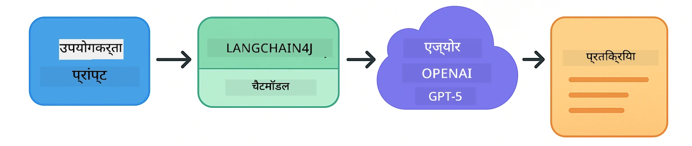

*कैसे LangChain4j आपके प्रॉम्प्ट को Azure OpenAI GPT-5 से जोड़ता है*

**निर्भरता** - मॉड्यूल 02 `pom.xml` में परिभाषित निम्नलिखित langchain4j निर्भरताओं का उपयोग करता है:
```xml
<dependency>
    <groupId>dev.langchain4j</groupId>
    <artifactId>langchain4j</artifactId> <!-- Inherited from BOM in root pom.xml -->
</dependency>
<dependency>
    <groupId>dev.langchain4j</groupId>
    <artifactId>langchain4j-open-ai-official</artifactId> <!-- Inherited from BOM in root pom.xml -->
</dependency>
```

**OpenAiOfficialChatModel कॉन्फ़िगरेशन** - [LangChainConfig.java](../../../02-prompt-engineering/src/main/java/com/example/langchain4j/prompts/config/LangChainConfig.java)

चैट मॉडल को मैन्युअल रूप से एक स्प्रिंग बीन के रूप में कॉन्फ़िगर किया गया है जो OpenAI आधिकारिक क्लाइंट का उपयोग करता है, जो Azure OpenAI एंडपॉइंट्स का समर्थन करता है। मॉड्यूल 01 से मुख्य अंतर यह है कि हम `chatModel.chat()` को भेजे जाने वाले प्रॉम्प्ट को कैसे संरचित करते हैं, न कि मॉडल सेटअप।

**सिस्टम और उपयोगकर्ता संदेश** - [Gpt5PromptService.java](../../../02-prompt-engineering/src/main/java/com/example/langchain4j/prompts/service/Gpt5PromptService.java)

LangChain4j स्पष्टता के लिए संदेश प्रकारों को अलग करता है। `SystemMessage` AI के व्यवहार और संदर्भ को सेट करता है (जैसे "आप एक कोड समीक्षक हैं"), जबकि `UserMessage` में वास्तविक अनुरोध होता है। यह अलगाव आपको विभिन्न उपयोगकर्ता प्रश्नों के बीच AI व्यवहार को सुसंगत बनाए रखने देता है।

```java
SystemMessage systemMsg = SystemMessage.from(
    "You are a helpful Java programming expert."
);

UserMessage userMsg = UserMessage.from(
    "Explain what a List is in Java"
);

String response = chatModel.chat(systemMsg, userMsg);
```

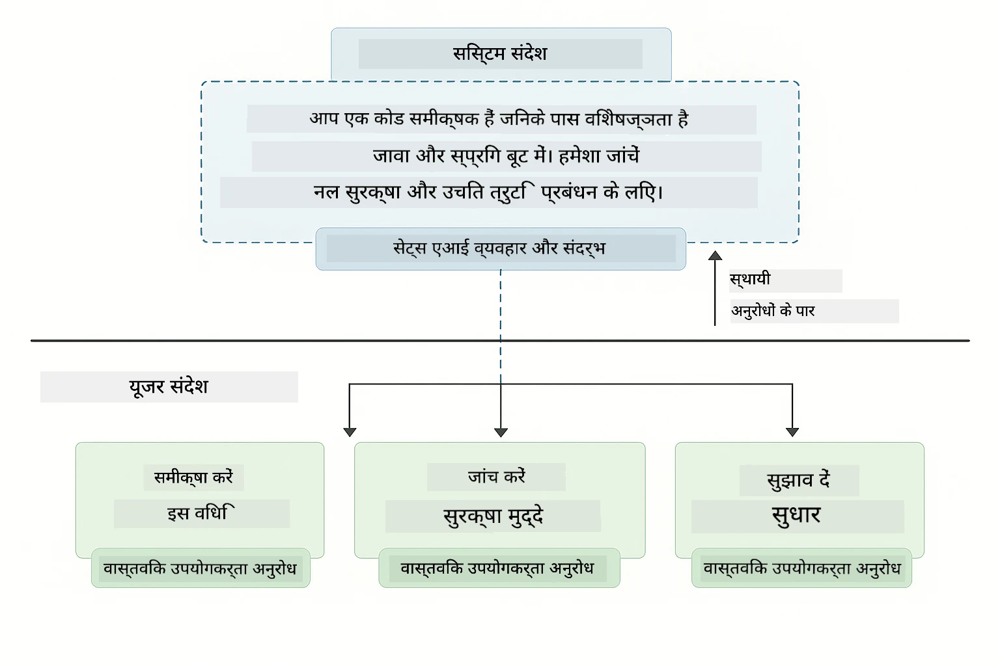

*SystemMessage स्थायी संदर्भ प्रदान करता है जबकि UserMessages व्यक्तिगत अनुरोधों को शामिल करते हैं*

**Multi-Turn के लिए MessageWindowChatMemory** - मल्टी-टर्न संवाद पैटर्न के लिए, हम मॉड्यूल 01 से `MessageWindowChatMemory` का पुन: उपयोग करते हैं। प्रत्येक सत्र को अपनी मेमोरी इंस्टेंस मिलती है जो `Map<String, ChatMemory>` में संग्रहीत होती है, जिससे कई समवर्ती वार्तालाप बिना संदर्भ मिश्रण के संभव होते हैं।

**प्रॉम्प्ट टेम्प्लेट्स** - असली फोकस यहाँ प्रॉम्प्ट इंजीनियरिंग पर है, नए LangChain4j API नहीं। प्रत्येक पैटर्न (कम उत्सुकता, उच्च उत्सुकता, कार्य निष्पादन, आदि) एक ही `chatModel.chat(prompt)` विधि का उपयोग करता है लेकिन सावधानीपूर्वक संरचित प्रॉम्प्ट स्ट्रिंग्स के साथ। XML टैग, निर्देश, और फॉर्मेटिंग सभी प्रॉम्प्ट टेक्स्ट का हिस्सा हैं, LangChain4j फीचर्स नहीं।

**तर्क नियंत्रण** - GPT-5 का तर्क प्रयास प्रॉम्प्ट निर्देशों जैसे "अधिकतम 2 तर्क चरण" या "गहराई से अन्वेषण करें" के माध्यम से नियंत्रित होता है। ये प्रॉम्प्ट इंजीनियरिंग तकनीकें हैं, LangChain4j कॉन्फ़िगरेशन नहीं। लाइब्रेरी बस आपके प्रॉम्प्ट को मॉडल तक पहुंचाती है।

मुख्य निष्कर्ष: LangChain4j अवसंरचना प्रदान करता है (मॉडल कनेक्शन [LangChainConfig.java](../../../02-prompt-engineering/src/main/java/com/example/langchain4j/prompts/config/LangChainConfig.java) के माध्यम से, मेमोरी, संदेश हैंडलिंग [Gpt5PromptService.java](../../../02-prompt-engineering/src/main/java/com/example/langchain4j/prompts/service/Gpt5PromptService.java) के माध्यम से), जबकि यह मॉड्यूल आपको उस अवसंरचना के भीतर प्रभावी प्रॉम्प्ट बनाने का तरीका सिखाता है।

## मुख्य पैटर्न

सभी समस्याओं के लिए एक ही दृष्टिकोण आवश्यक नहीं होता। कुछ प्रश्नों को त्वरित उत्तर चाहिए, कुछ को गहरी सोच। कुछ को स्पष्ट तर्क चाहिए, कुछ को केवल परिणाम। यह मॉड्यूल आठ प्रॉम्प्टिंग पैटर्न कवर करता है - प्रत्येक विभिन्न परिदृश्यों के लिए अनुकूलित। आप सभी के साथ प्रयोग करेंगे ताकि सीख सकें कि कब कौन सा दृष्टिकोण सबसे अच्छा काम करता है।

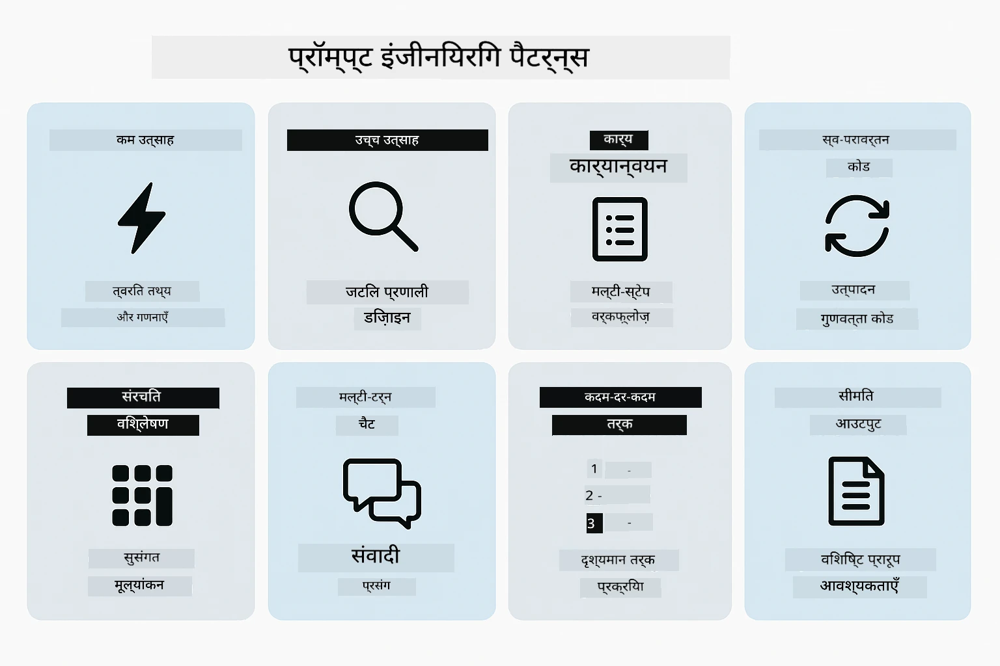

*आठ प्रॉम्प्ट इंजीनियरिंग पैटर्न और उनके उपयोग के मामलों का अवलोकन*

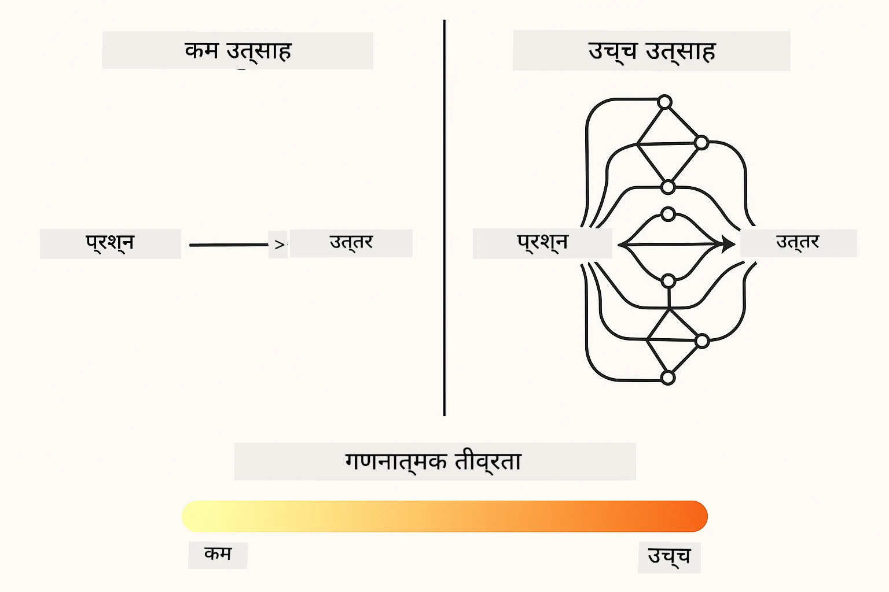

*कम उत्सुकता (तेज़, सीधे) बनाम उच्च उत्सुकता (गहराई से, खोजपूर्ण) तर्क दृष्टिकोण*

**कम उत्सुकता (त्वरित और केंद्रित)** - सरल प्रश्नों के लिए जहाँ आप तेज़, सीधे उत्तर चाहते हैं। मॉडल न्यूनतम तर्क करता है - अधिकतम 2 चरण। इसका उपयोग गणना, खोज, या सीधे प्रश्नों के लिए करें।

```java
String prompt = """
    <reasoning_effort>low</reasoning_effort>
    <instruction>maximum 2 reasoning steps</instruction>
    
    What is 15% of 200?
    """;

String response = chatModel.chat(prompt);
```

> 💡 **GitHub Copilot के साथ अन्वेषण करें:** [`Gpt5PromptService.java`](../../../02-prompt-engineering/src/main/java/com/example/langchain4j/prompts/service/Gpt5PromptService.java) खोलें और पूछें:
> - "कम उत्सुकता और उच्च उत्सुकता प्रॉम्प्टिंग पैटर्न में क्या अंतर है?"
> - "प्रॉम्प्ट में XML टैग AI की प्रतिक्रिया को संरचित करने में कैसे मदद करते हैं?"
> - "स्व-प्रतिबिंब पैटर्न और सीधे निर्देश कब उपयोग करें?"

**उच्च उत्सुकता (गहरा और व्यापक)** - जटिल समस्याओं के लिए जहाँ आप व्यापक विश्लेषण चाहते हैं। मॉडल गहराई से अन्वेषण करता है और विस्तृत तर्क दिखाता है। इसका उपयोग सिस्टम डिज़ाइन, आर्किटेक्चर निर्णय, या जटिल अनुसंधान के लिए करें।

```java
String prompt = """
    <reasoning_effort>high</reasoning_effort>
    <instruction>explore thoroughly, show detailed reasoning</instruction>
    
    Design a caching strategy for a high-traffic REST API.
    """;

String response = chatModel.chat(prompt);
```

**कार्य निष्पादन (कदम-दर-कदम प्रगति)** - बहु-चरण कार्यप्रवाह के लिए। मॉडल एक प्रारंभिक योजना प्रदान करता है, प्रत्येक चरण को बताते हुए काम करता है, फिर सारांश देता है। इसका उपयोग माइग्रेशन, कार्यान्वयन, या किसी भी बहु-चरण प्रक्रिया के लिए करें।

```java
String prompt = """
    <task>Create a REST endpoint for user registration</task>
    <preamble>Provide an upfront plan</preamble>
    <narration>Narrate each step as you work</narration>
    <summary>Summarize what was accomplished</summary>
    """;

String response = chatModel.chat(prompt);
```

चेन-ऑफ-थॉट प्रॉम्प्टिंग स्पष्ट रूप से मॉडल से उसके तर्क प्रक्रिया को दिखाने के लिए कहता है, जो जटिल कार्यों के लिए सटीकता बढ़ाता है। कदम-दर-कदम टूटना मानव और AI दोनों को तर्क समझने में मदद करता है।

> **🤖 [GitHub Copilot](https://github.com/features/copilot) चैट के साथ प्रयास करें:** इस पैटर्न के बारे में पूछें:
> - "लंबे समय तक चलने वाले ऑपरेशनों के लिए कार्य निष्पादन पैटर्न को कैसे अनुकूलित करूँ?"
> - "उत्पादन अनुप्रयोगों में टूल प्रीएम्बल को संरचित करने के सर्वोत्तम अभ्यास क्या हैं?"
> - "UI में मध्यवर्ती प्रगति अपडेट कैसे कैप्चर और प्रदर्शित कर सकता हूँ?"

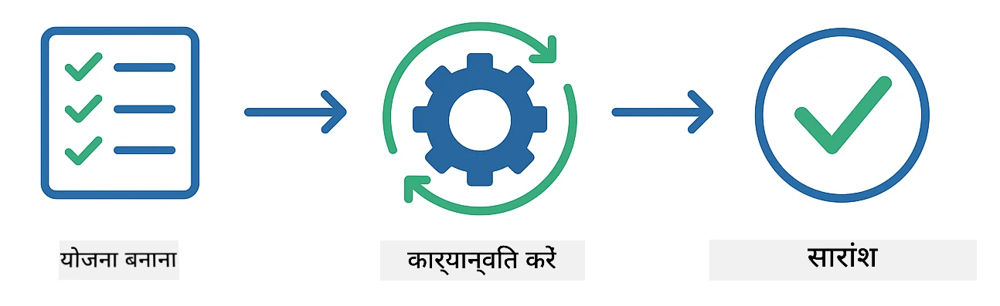

*बहु-चरण कार्यों के लिए योजना → निष्पादन → सारांश कार्यप्रवाह*

**स्व-प्रतिबिंबित कोड** - उत्पादन-गुणवत्ता कोड उत्पन्न करने के लिए। मॉडल कोड उत्पन्न करता है, गुणवत्ता मानदंडों के खिलाफ जांचता है, और इसे पुनरावृत्त रूप से सुधारता है। इसका उपयोग नई सुविधाएँ या सेवाएँ बनाने के लिए करें।

```java
String prompt = """
    <task>Create an email validation service</task>
    <quality_criteria>
    - Correct logic and error handling
    - Best practices (clean code, proper naming)
    - Performance optimization
    - Security considerations
    </quality_criteria>
    <instruction>Generate code, evaluate against criteria, improve iteratively</instruction>
    """;

String response = chatModel.chat(prompt);
```

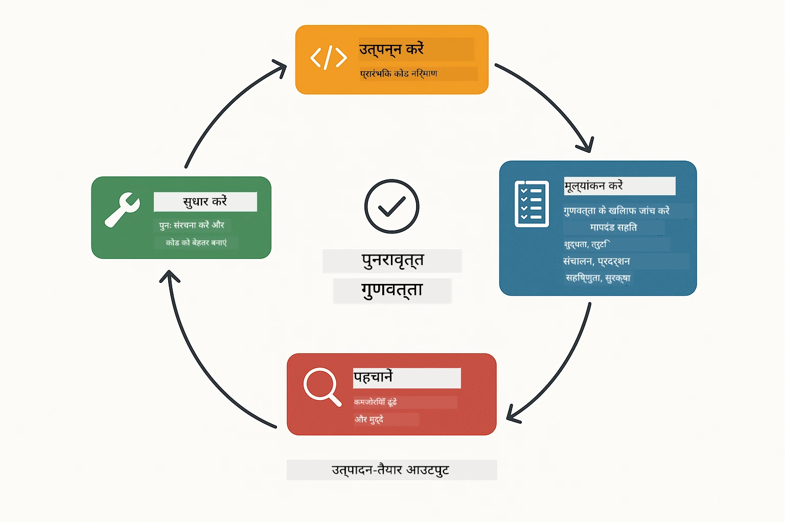

*पुनरावृत्त सुधार चक्र - उत्पन्न करें, मूल्यांकन करें, समस्याएँ पहचानें, सुधारें, दोहराएँ*

**संरचित विश्लेषण** - सुसंगत मूल्यांकन के लिए। मॉडल कोड की समीक्षा एक निश्चित फ्रेमवर्क (सहीपन, अभ्यास, प्रदर्शन, सुरक्षा) का उपयोग करके करता है। इसका उपयोग कोड समीक्षा या गुणवत्ता आकलन के लिए करें।

```java
String prompt = """
    <code>
    public List getUsers() {
        return database.query("SELECT * FROM users");
    }
    </code>
    
    <framework>
    Evaluate using these categories:
    1. Correctness - Logic and functionality
    2. Best Practices - Code quality
    3. Performance - Efficiency concerns
    4. Security - Vulnerabilities
    </framework>
    """;

String response = chatModel.chat(prompt);
```

> **🤖 [GitHub Copilot](https://github.com/features/copilot) चैट के साथ प्रयास करें:** संरचित विश्लेषण के बारे में पूछें:
> - "विभिन्न प्रकार की कोड समीक्षाओं के लिए विश्लेषण फ्रेमवर्क को कैसे अनुकूलित कर सकता हूँ?"
> - "संरचित आउटपुट को प्रोग्रामेटिक रूप से पार्स और क्रियान्वित करने का सर्वोत्तम तरीका क्या है?"
> - "विभिन्न समीक्षा सत्रों में सुसंगत गंभीरता स्तर कैसे सुनिश्चित करें?"

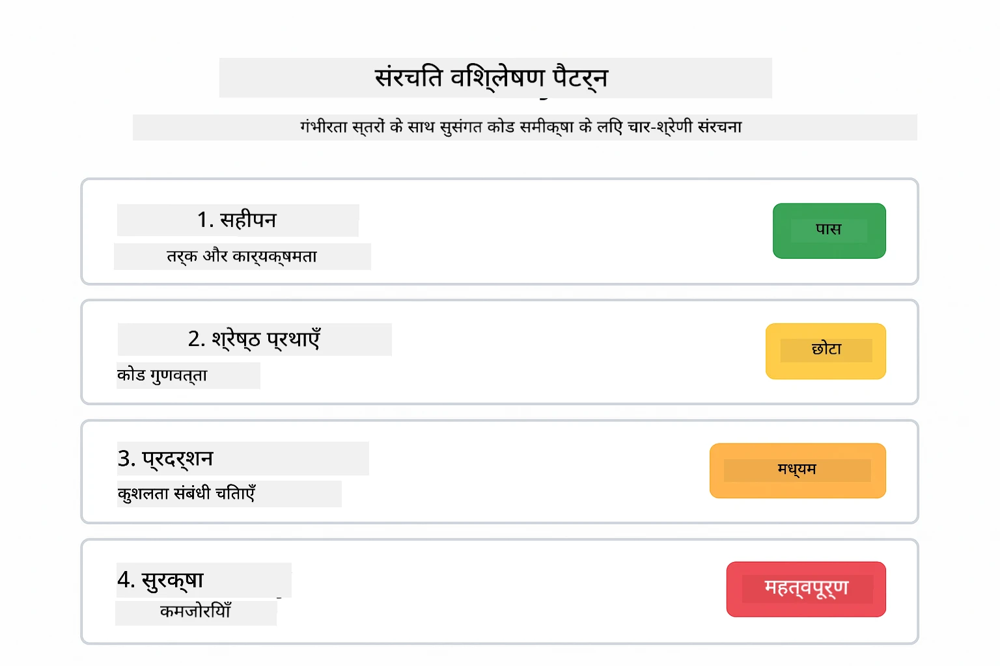

*गंभीरता स्तरों के साथ सुसंगत कोड समीक्षाओं के लिए चार-श्रेणी फ्रेमवर्क*

**मल्टी-टर्न चैट** - संदर्भ की आवश्यकता वाले संवादों के लिए। मॉडल पिछले संदेशों को याद रखता है और उन पर निर्माण करता है। इसका उपयोग इंटरैक्टिव सहायता सत्रों या जटिल प्रश्नोत्तर के लिए करें।

```java
ChatMemory memory = MessageWindowChatMemory.withMaxMessages(10);

memory.add(UserMessage.from("What is Spring Boot?"));
AiMessage aiMessage1 = chatModel.chat(memory.messages()).aiMessage();
memory.add(aiMessage1);

memory.add(UserMessage.from("Show me an example"));
AiMessage aiMessage2 = chatModel.chat(memory.messages()).aiMessage();
memory.add(aiMessage2);
```

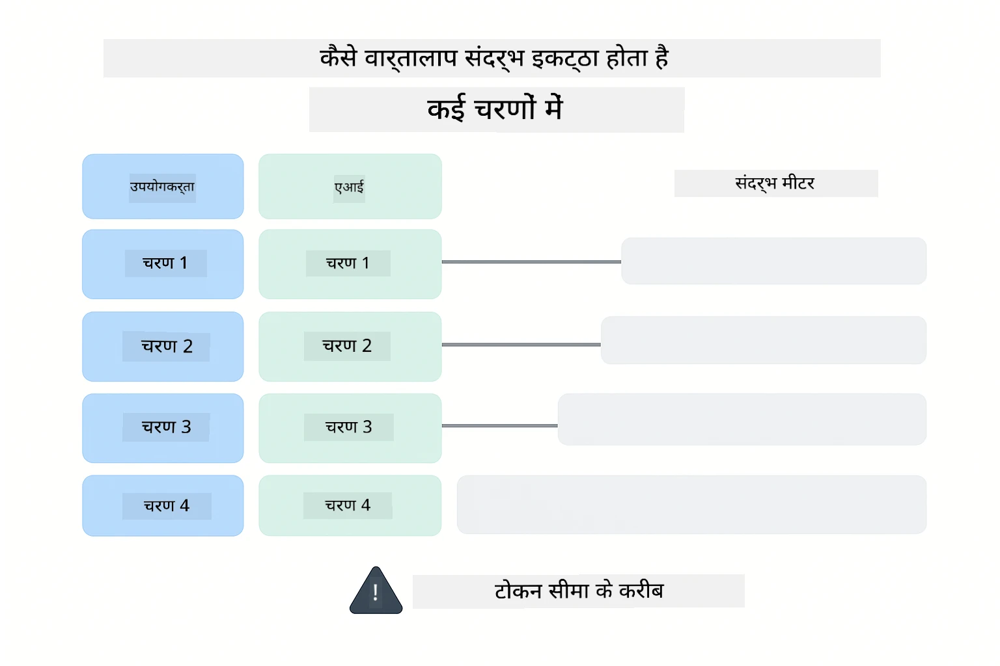

*कैसे संवाद संदर्भ कई टर्न में जमा होता है जब तक कि टोकन सीमा तक न पहुँच जाए*

**कदम-दर-कदम तर्क** - उन समस्याओं के लिए जिनमें स्पष्ट तर्क की आवश्यकता होती है। मॉडल प्रत्येक चरण के लिए स्पष्ट तर्क दिखाता है। इसका उपयोग गणित की समस्याओं, तर्क पहेलियों, या सोच प्रक्रिया को समझने के लिए करें।

```java
String prompt = """
    <instruction>Show your reasoning step-by-step</instruction>
    
    If a train travels 120 km in 2 hours, then stops for 30 minutes,
    then travels another 90 km in 1.5 hours, what is the average speed
    for the entire journey including the stop?
    """;

String response = chatModel.chat(prompt);
```

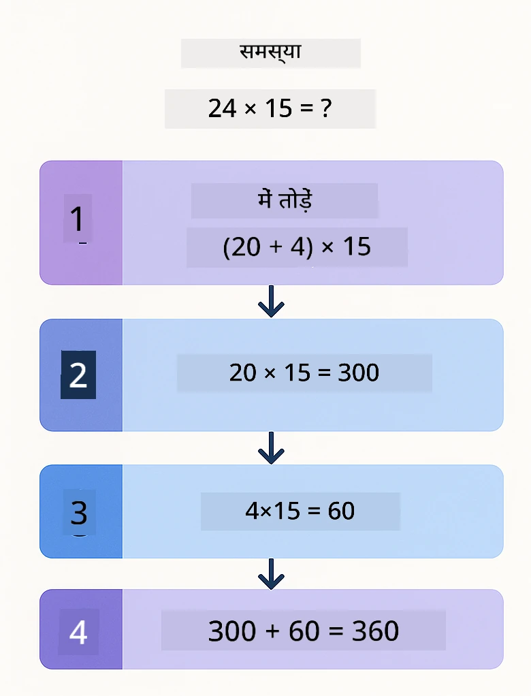

*समस्याओं को स्पष्ट तार्किक चरणों में विभाजित करना*

**सीमित आउटपुट** - विशिष्ट प्रारूप आवश्यकताओं वाले उत्तरों के लिए। मॉडल सख्ती से प्रारूप और लंबाई नियमों का पालन करता है। इसका उपयोग सारांशों के लिए या जब आपको सटीक आउटपुट संरचना चाहिए।

```java
String prompt = """
    <constraints>
    - Exactly 100 words
    - Bullet point format
    - Technical terms only
    </constraints>
    
    Summarize the key concepts of machine learning.
    """;

String response = chatModel.chat(prompt);
```

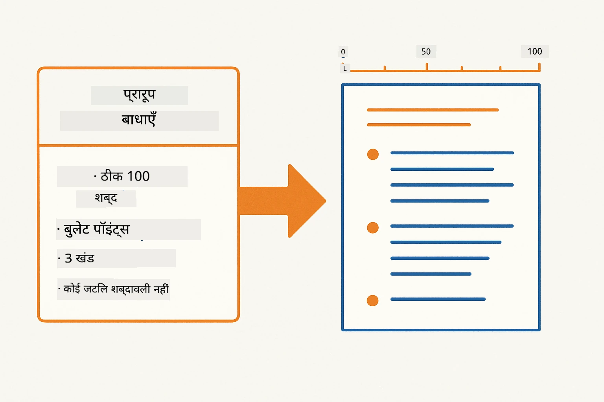

*विशिष्ट प्रारूप, लंबाई, और संरचना आवश्यकताओं को लागू करना*

## मौजूदा Azure संसाधनों का उपयोग

**तैनाती सत्यापित करें:**

सुनिश्चित करें कि रूट डायरेक्टरी में `.env` फ़ाइल मौजूद है जिसमें Azure क्रेडेंशियल्स हैं (मॉड्यूल 01 के दौरान बनाई गई):
```bash
cat ../.env  # AZURE_OPENAI_ENDPOINT, API_KEY, DEPLOYMENT दिखाना चाहिए
```

**एप्लिकेशन शुरू करें:**

> **नोट:** यदि आपने पहले से मॉड्यूल 01 से `./start-all.sh` का उपयोग करके सभी एप्लिकेशन शुरू कर दिए हैं, तो यह मॉड्यूल पहले से पोर्ट 8083 पर चल रहा है। आप नीचे दिए गए स्टार्ट कमांड छोड़ सकते हैं और सीधे http://localhost:8083 पर जा सकते हैं।

**विकल्प 1: स्प्रिंग बूट डैशबोर्ड का उपयोग (VS Code उपयोगकर्ताओं के लिए अनुशंसित)**

डेव कंटेनर में स्प्रिंग बूट डैशबोर्ड एक्सटेंशन शामिल है, जो सभी स्प्रिंग बूट एप्लिकेशन को प्रबंधित करने के लिए एक दृश्य इंटरफ़ेस प्रदान करता है। आप इसे VS Code के बाईं ओर एक्टिविटी बार में स्प्रिंग बूट आइकन के रूप में देख सकते हैं।

स्प्रिंग बूट डैशबोर्ड से, आप:
- कार्यक्षेत्र में सभी उपलब्ध स्प्रिंग बूट एप्लिकेशन देख सकते हैं
- एक क्लिक में एप्लिकेशन शुरू/रोक सकते हैं
- एप्लिकेशन लॉग वास्तविक समय में देख सकते हैं
- एप्लिकेशन स्थिति की निगरानी कर सकते हैं

बस "prompt-engineering" के बगल में प्ले बटन पर क्लिक करें इस मॉड्यूल को शुरू करने के लिए, या सभी मॉड्यूल एक साथ शुरू करें।

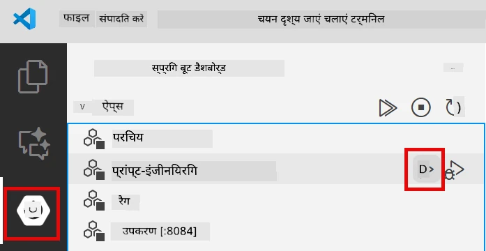

**विकल्प 2: शेल स्क्रिप्ट्स का उपयोग**

सभी वेब एप्लिकेशन (मॉड्यूल 01-04) शुरू करें:

**Bash:**
```bash
cd ..  # रूट निर्देशिका से
./start-all.sh
```

**PowerShell:**
```powershell
cd ..  # रूट निर्देशिका से
.\start-all.ps1
```

या केवल इस मॉड्यूल को शुरू करें:

**Bash:**
```bash
cd 02-prompt-engineering
./start.sh
```

**PowerShell:**
```powershell
cd 02-prompt-engineering
.\start.ps1
```

दोनों स्क्रिप्ट स्वचालित रूप से रूट `.env` फ़ाइल से पर्यावरण चर लोड करते हैं और यदि JAR मौजूद नहीं हैं तो उन्हें बनाएंगे।

> **नोट:** यदि आप शुरू करने से पहले सभी मॉड्यूल मैन्युअल रूप से बनाना पसंद करते हैं:
>
> **Bash:**
> ```bash
> cd ..  # Go to root directory
> mvn clean package -DskipTests
> ```
>
> **PowerShell:**
> ```powershell
> cd ..  # Go to root directory
> mvn clean package -DskipTests
> ```

अपने ब्राउज़र में http://localhost:8083 खोलें।

**रोकने के लिए:**

**Bash:**
```bash
./stop.sh  # केवल यह मॉड्यूल
# या
cd .. && ./stop-all.sh  # सभी मॉड्यूल
```

**PowerShell:**
```powershell
.\stop.ps1  # केवल यह मॉड्यूल
# या
cd ..; .\stop-all.ps1  # सभी मॉड्यूल
```

## एप्लिकेशन स्क्रीनशॉट

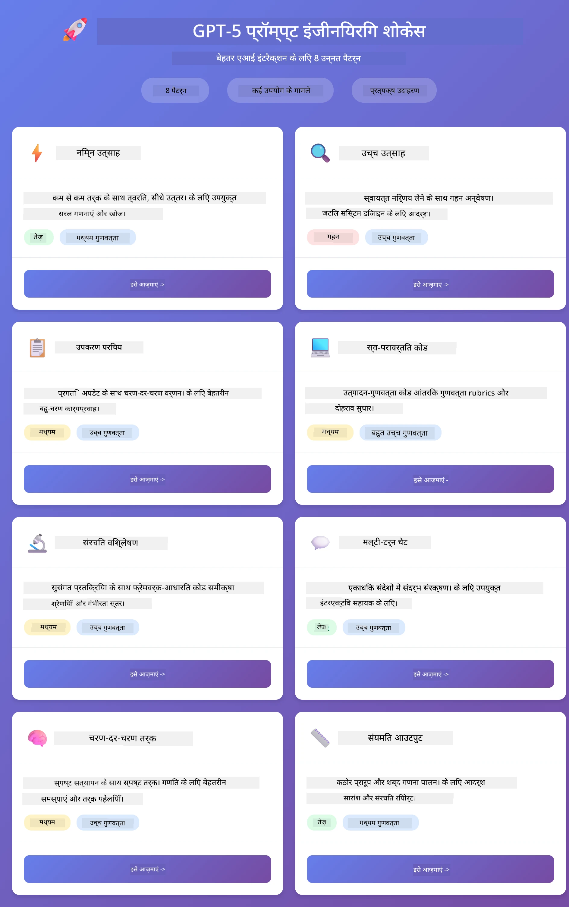

*मुख्य डैशबोर्ड जो सभी 8 प्रॉम्प्ट इंजीनियरिंग पैटर्न को उनके लक्षण और उपयोग मामलों के साथ दिखाता है*

## पैटर्न का अन्वेषण

वेब इंटरफ़ेस आपको विभिन्न प्रॉम्प्टिंग रणनीतियों के साथ प्रयोग करने देता है। प्रत्येक पैटर्न विभिन्न समस्याओं को हल करता है - उन्हें आज़माएं ताकि देखें कि कब कौन सा दृष्टिकोण सबसे अच्छा काम करता है।

### कम बनाम उच्च उत्सुकता

"200 का 15% क्या है?" जैसे सरल प्रश्न को कम उत्सुकता के साथ पूछें। आपको तुरंत, सीधे उत्तर मिलेगा। अब "उच्च-ट्रैफिक API के लिए कैशिंग रणनीति डिज़ाइन करें" जैसे जटिल प्रश्न को उच्च उत्सुकता के साथ पूछें। देखें कि मॉडल कैसे धीमा होता है और विस्तृत तर्क प्रदान करता है। वही मॉडल, वही प्रश्न संरचना - लेकिन प्रॉम्प्ट बताता है कि कितना सोच-विचार करना है।

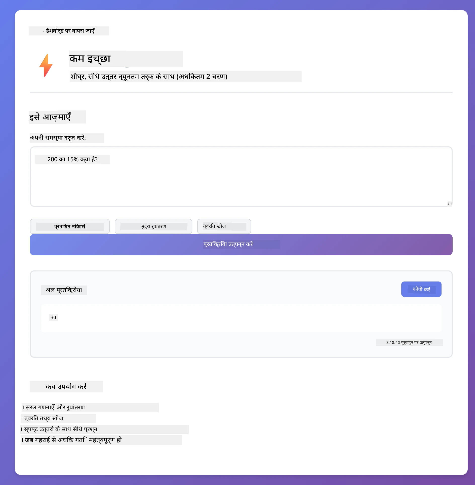
*कम से कम तर्क के साथ त्वरित गणना*

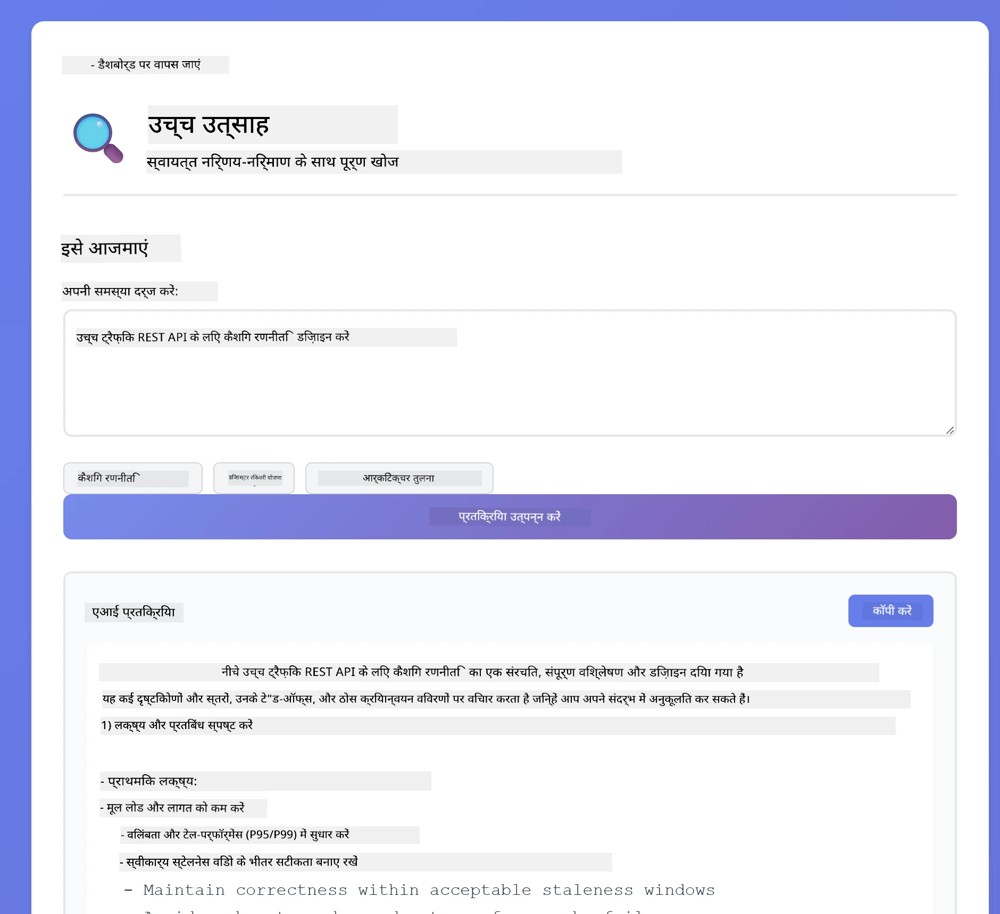

*व्यापक कैशिंग रणनीति (2.8MB)*

### कार्य निष्पादन (टूल प्रीएम्बल्स)

मल्टी-स्टेप वर्कफ़्लो को अग्रिम योजना और प्रगति वर्णन से लाभ होता है। मॉडल बताता है कि वह क्या करेगा, प्रत्येक चरण का वर्णन करता है, फिर परिणामों का सारांश प्रस्तुत करता है।

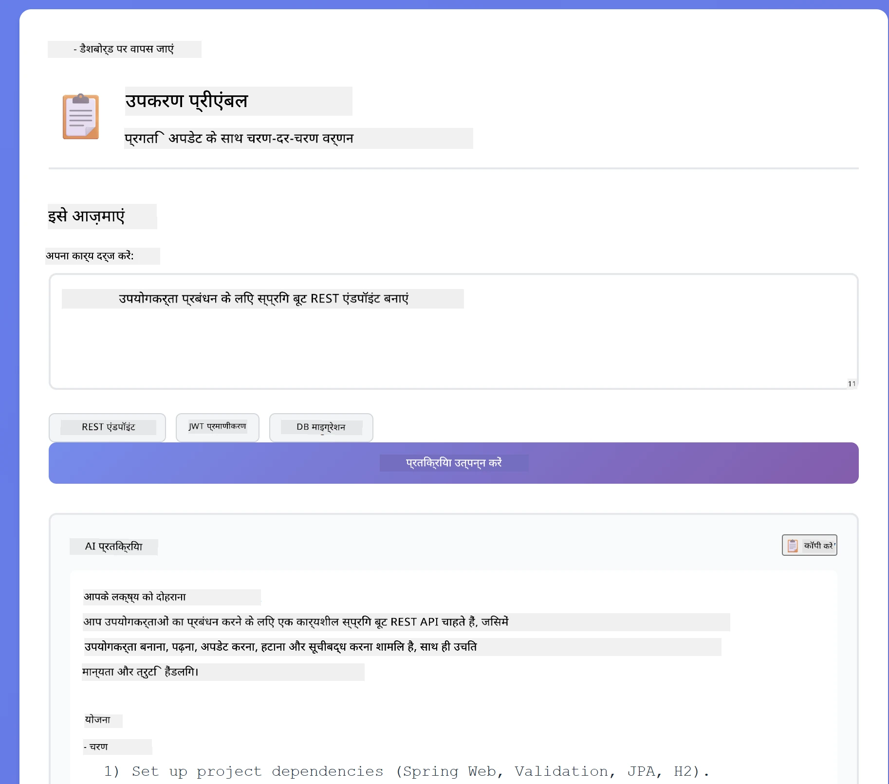

*चरण-दर-चरण वर्णन के साथ REST एंडपॉइंट बनाना (3.9MB)*

### आत्म-प्रतिबिंबित कोड

"एक ईमेल सत्यापन सेवा बनाएं" आज़माएं। केवल कोड जनरेट करने और रुकने के बजाय, मॉडल कोड बनाता है, गुणवत्ता मानदंडों के खिलाफ मूल्यांकन करता है, कमजोरियों की पहचान करता है, और सुधार करता है। आप इसे तब तक दोहराते हुए देखेंगे जब तक कोड उत्पादन मानकों को पूरा न कर ले।

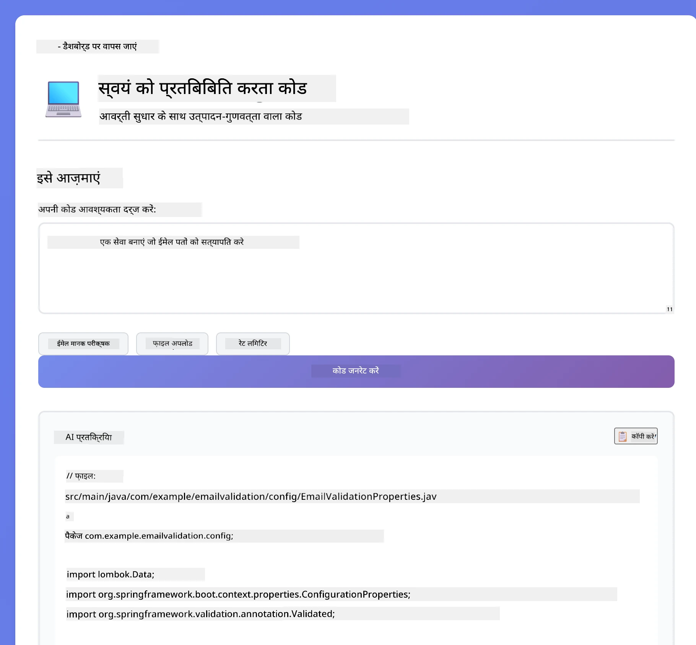

*पूर्ण ईमेल सत्यापन सेवा (5.2MB)*

### संरचित विश्लेषण

कोड समीक्षा के लिए सुसंगत मूल्यांकन ढांचे की आवश्यकता होती है। मॉडल कोड का विश्लेषण निश्चित श्रेणियों (सहीपन, प्रथाएँ, प्रदर्शन, सुरक्षा) के साथ करता है, जिसमें गंभीरता स्तर होते हैं।

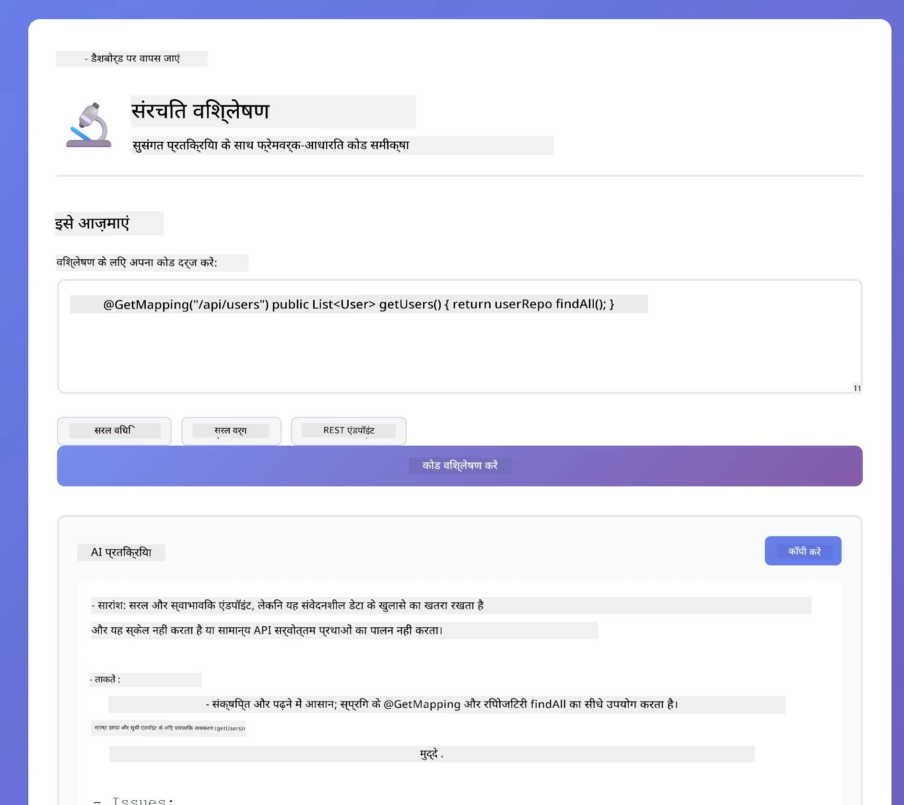

*फ्रेमवर्क-आधारित कोड समीक्षा*

### मल्टी-टर्न चैट

पूछें "स्प्रिंग बूट क्या है?" फिर तुरंत "मुझे एक उदाहरण दिखाओ"। मॉडल आपकी पहली प्रश्न को याद रखता है और आपको विशेष रूप से स्प्रिंग बूट का उदाहरण देता है। बिना मेमोरी के, दूसरा प्रश्न बहुत अस्पष्ट होता।

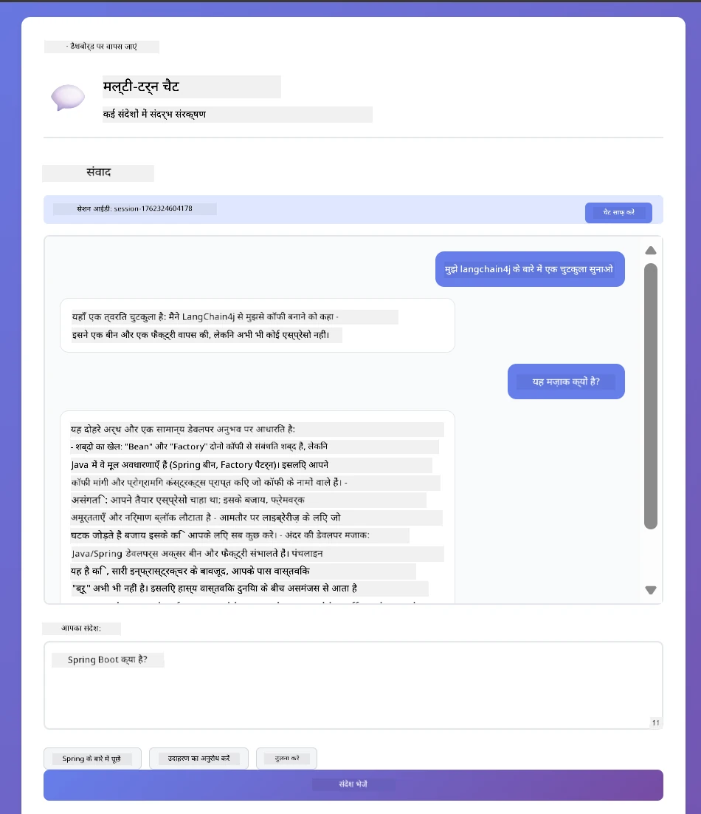

*प्रश्नों के बीच संदर्भ संरक्षण*

### चरण-दर-चरण तर्क

कोई गणित की समस्या चुनें और इसे चरण-दर-चरण तर्क और कम उत्साह दोनों के साथ आज़माएं। कम उत्साह केवल उत्तर देता है - तेज़ लेकिन अस्पष्ट। चरण-दर-चरण आपको हर गणना और निर्णय दिखाता है।

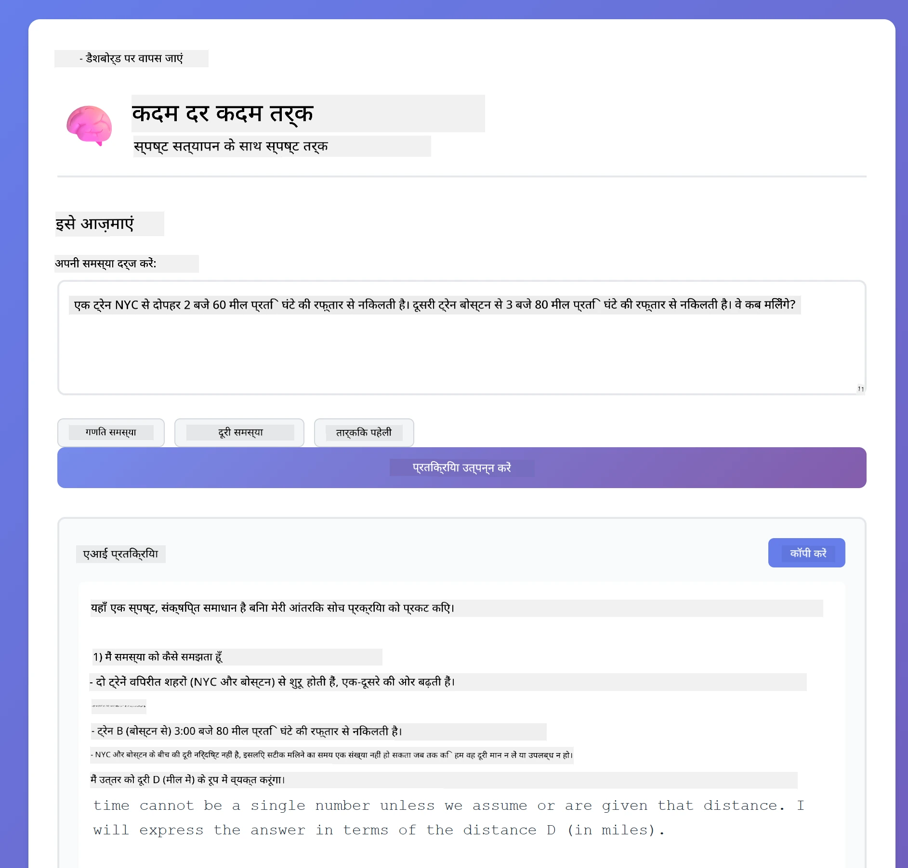

*स्पष्ट चरणों के साथ गणित की समस्या*

### प्रतिबंधित आउटपुट

जब आपको विशिष्ट प्रारूप या शब्द संख्या की आवश्यकता होती है, तो यह पैटर्न सख्त पालन सुनिश्चित करता है। 100 शब्दों के बुलेट पॉइंट प्रारूप में सारांश बनाने का प्रयास करें।


*फॉर्मेट नियंत्रण के साथ मशीन लर्निंग सारांश*

## आप वास्तव में क्या सीख रहे हैं

**तर्क प्रयास सब कुछ बदल देता है**

GPT-5 आपको अपने प्रॉम्प्ट के माध्यम से गणनात्मक प्रयास नियंत्रित करने देता है। कम प्रयास का मतलब है तेज़ उत्तर और न्यूनतम खोज। उच्च प्रयास का मतलब है मॉडल गहराई से सोचने में समय लेता है। आप सीख रहे हैं कि प्रयास को कार्य की जटिलता के अनुसार मिलाएं - सरल प्रश्नों पर समय बर्बाद न करें, लेकिन जटिल निर्णयों को भी जल्दी न करें।

**संरचना व्यवहार का मार्गदर्शन करती है**

प्रॉम्प्ट में XML टैग्स देखें? वे सजावट नहीं हैं। मॉडल संरचित निर्देशों का पालन स्वतंत्र पाठ की तुलना में अधिक विश्वसनीयता से करते हैं। जब आपको मल्टी-स्टेप प्रक्रियाओं या जटिल तर्क की आवश्यकता होती है, तो संरचना मॉडल को यह ट्रैक करने में मदद करती है कि वह कहाँ है और अगला क्या है।

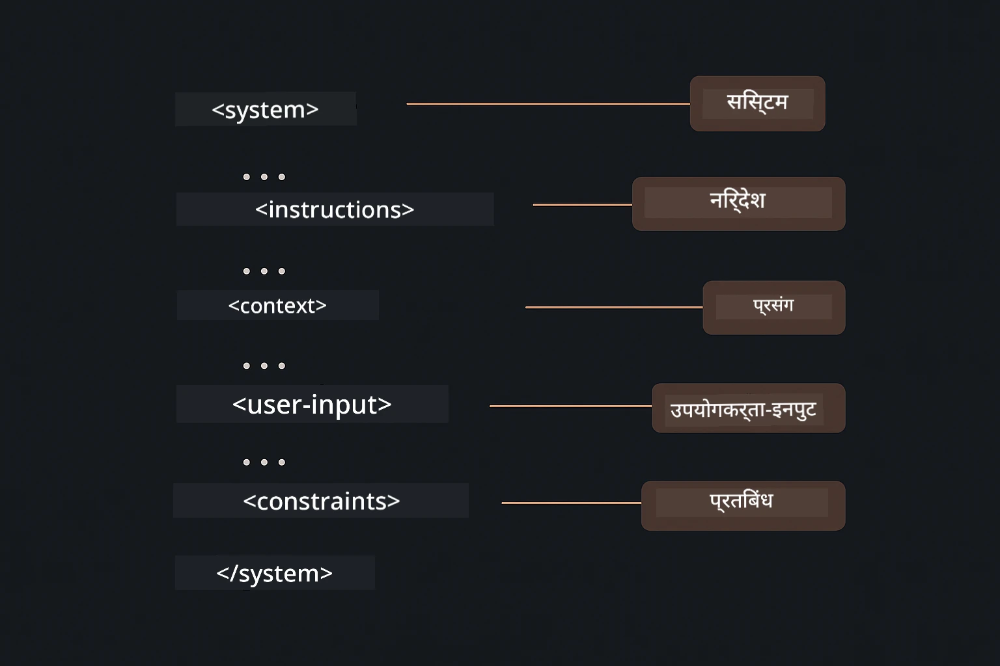

*स्पष्ट अनुभागों और XML-शैली संगठन के साथ अच्छी संरचित प्रॉम्प्ट की संरचना*

**स्व-मूल्यांकन के माध्यम से गुणवत्ता**

आत्म-प्रतिबिंबित पैटर्न गुणवत्ता मानदंडों को स्पष्ट करके काम करते हैं। मॉडल "सही करता है" की उम्मीद करने के बजाय, आप इसे बताते हैं कि "सही" का मतलब क्या है: सही तर्क, त्रुटि प्रबंधन, प्रदर्शन, सुरक्षा। फिर मॉडल अपनी आउटपुट का मूल्यांकन कर सकता है और सुधार कर सकता है। यह कोड जनरेशन को लॉटरी से प्रक्रिया में बदल देता है।

**संदर्भ सीमित है**

मल्टी-टर्न बातचीत प्रत्येक अनुरोध के साथ संदेश इतिहास शामिल करके काम करती है। लेकिन एक सीमा होती है - हर मॉडल की अधिकतम टोकन संख्या होती है। जैसे-जैसे बातचीत बढ़ती है, आपको प्रासंगिक संदर्भ बनाए रखने के लिए रणनीतियों की आवश्यकता होगी बिना उस सीमा को पार किए। यह मॉड्यूल आपको मेमोरी कैसे काम करती है दिखाता है; बाद में आप सीखेंगे कब सारांश बनाना है, कब भूलना है, और कब पुनः प्राप्त करना है।

## अगले कदम

**अगला मॉड्यूल:** [03-rag - RAG (Retrieval-Augmented Generation)](../03-rag/README.md)

---

**नेविगेशन:** [← पिछला: मॉड्यूल 01 - परिचय](../01-introduction/README.md) | [मुख्य पृष्ठ पर वापस](../README.md) | [अगला: मॉड्यूल 03 - RAG →](../03-rag/README.md)

---

<!-- CO-OP TRANSLATOR DISCLAIMER START -->
**अस्वीकरण**:  
इस दस्तावेज़ का अनुवाद AI अनुवाद सेवा [Co-op Translator](https://github.com/Azure/co-op-translator) का उपयोग करके किया गया है। जबकि हम सटीकता के लिए प्रयासरत हैं, कृपया ध्यान दें कि स्वचालित अनुवादों में त्रुटियाँ या अशुद्धियाँ हो सकती हैं। मूल दस्तावेज़ अपनी मूल भाषा में ही अधिकारिक स्रोत माना जाना चाहिए। महत्वपूर्ण जानकारी के लिए, पेशेवर मानव अनुवाद की सलाह दी जाती है। इस अनुवाद के उपयोग से उत्पन्न किसी भी गलतफहमी या गलत व्याख्या के लिए हम जिम्मेदार नहीं हैं।
<!-- CO-OP TRANSLATOR DISCLAIMER END -->