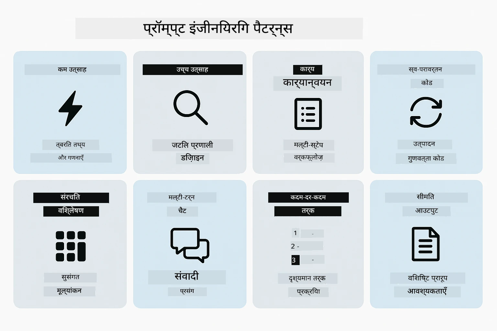
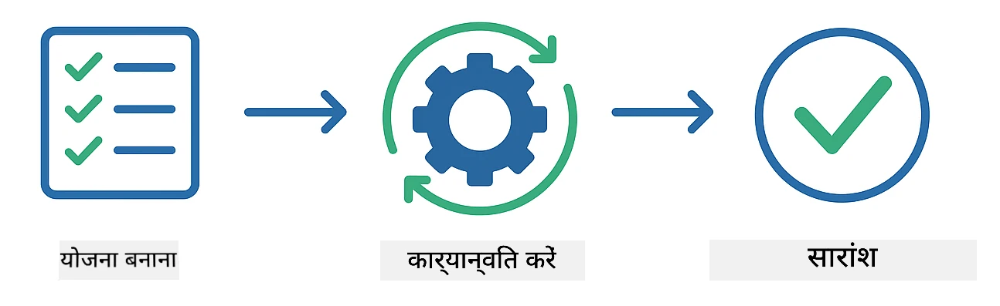
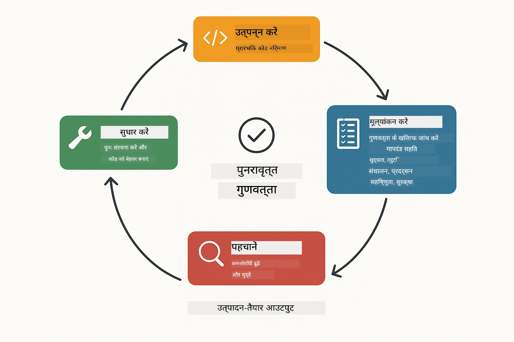
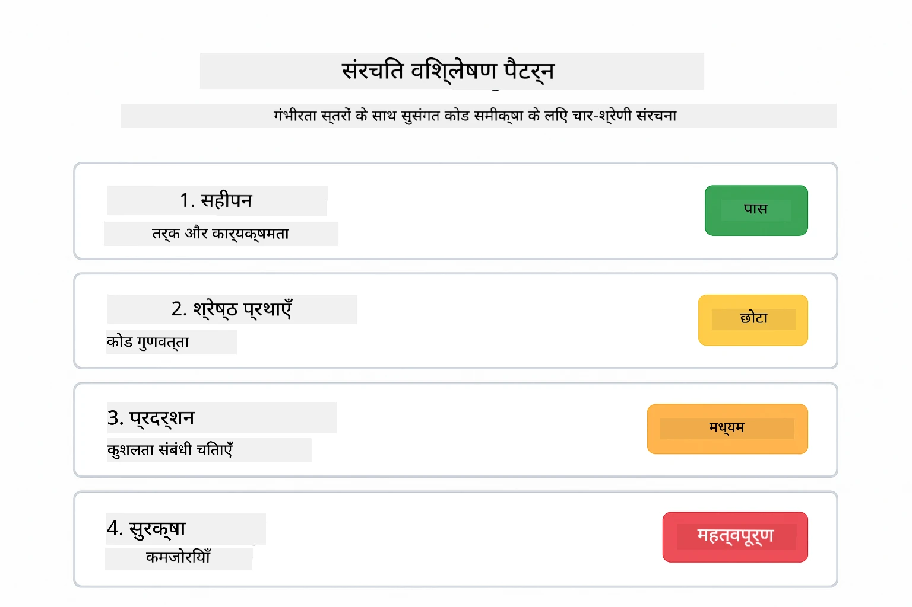
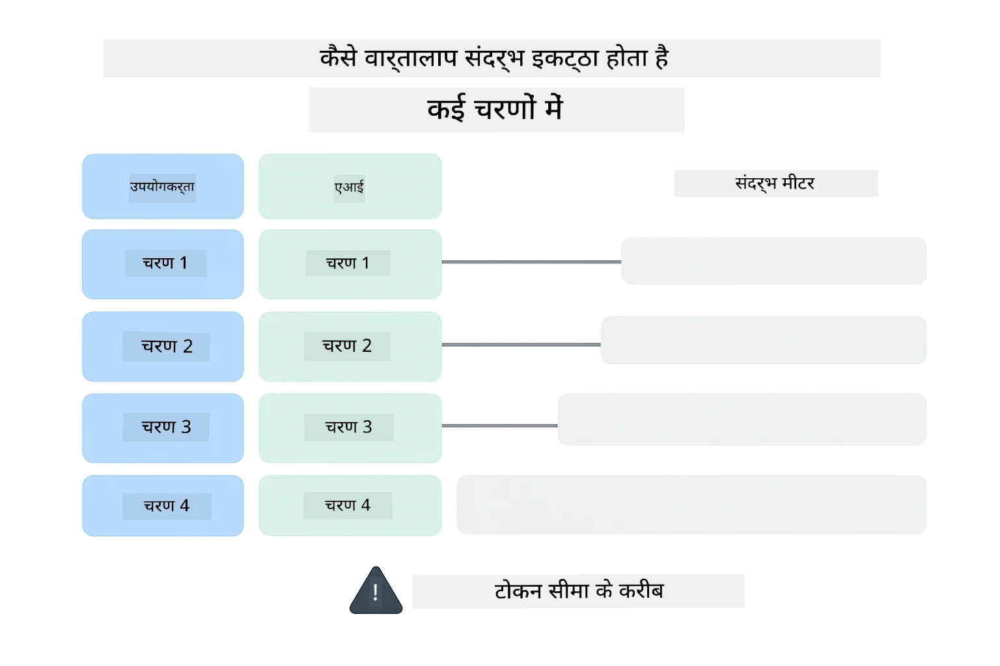
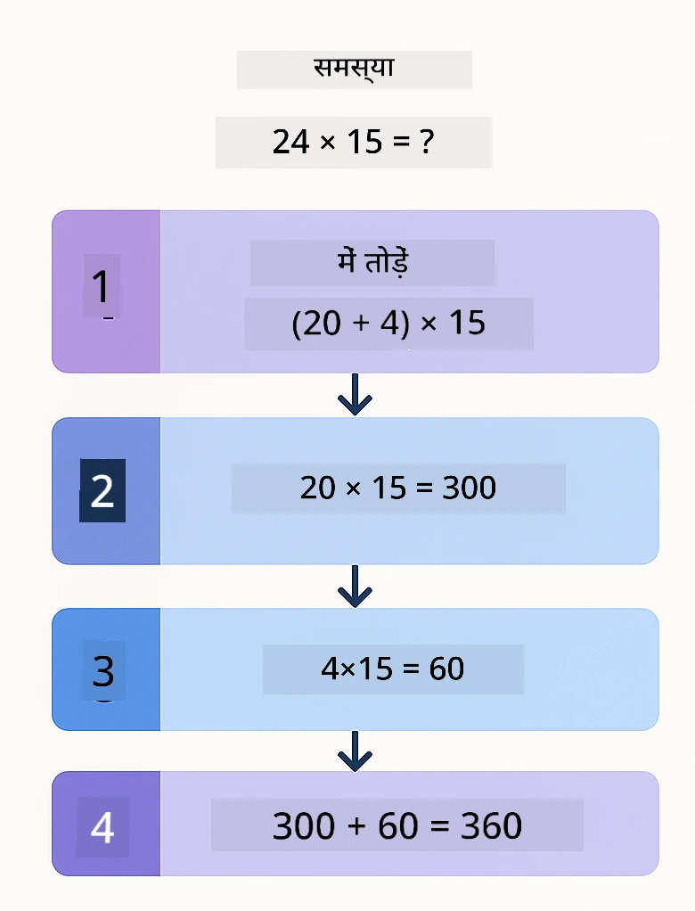
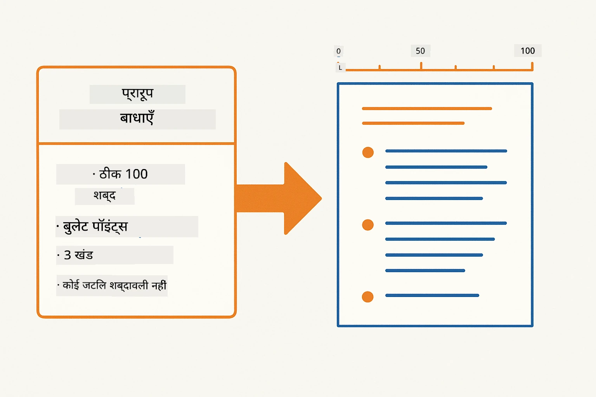
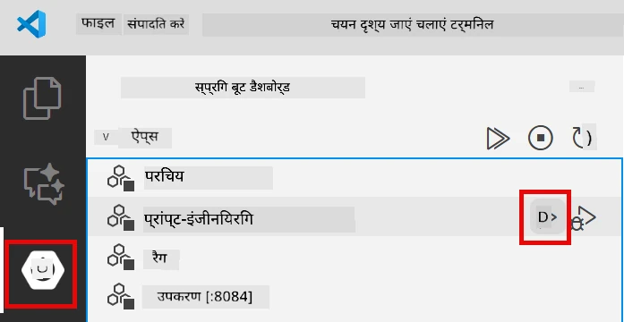
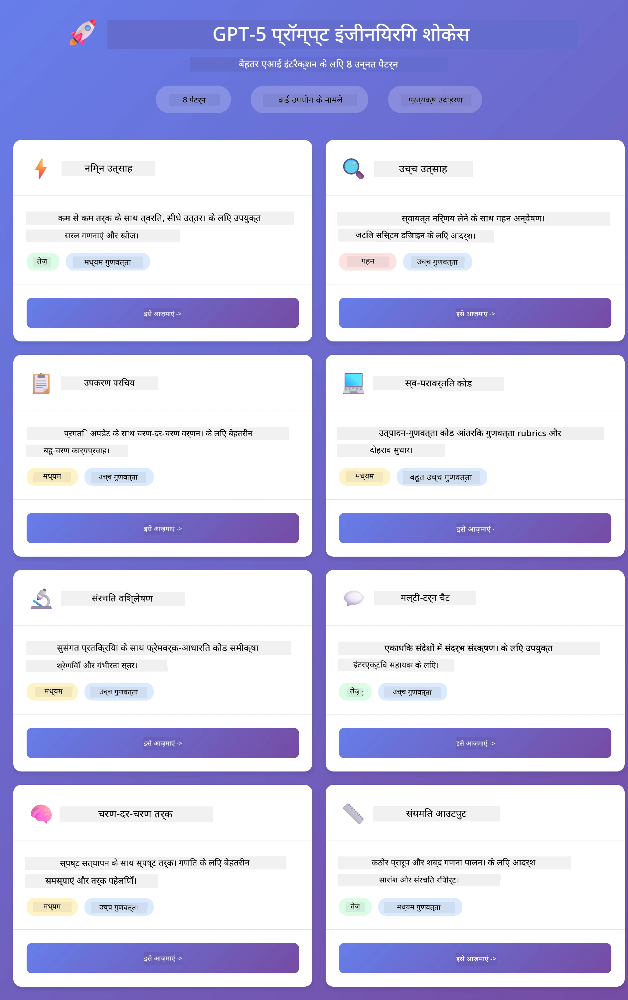
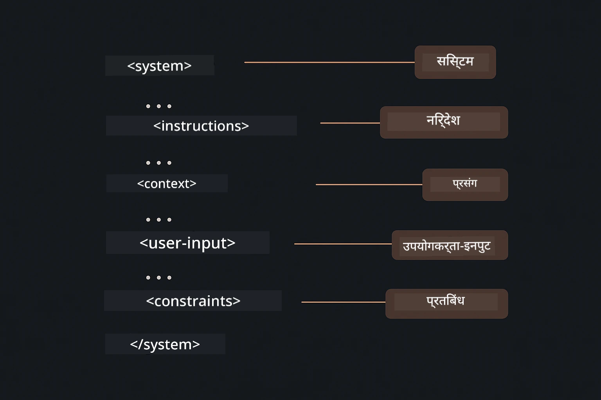

# मॉड्यूल 02: GPT-5.2 के साथ प्रॉम्प्ट इंजीनियरिंग

## विषय सूची

- [वीडियो वॉकथ्रू](#वीडियो-वॉकथ्रू)
- [आप क्या सीखेंगे](#आप-क्या-सीखेंगे)
- [पूर्व आवश्यकताएँ](#पूर्व-आवश्यकताएँ)
- [प्रॉम्प्ट इंजीनियरिंग को समझना](#प्रॉम्प्ट-इंजीनियरिंग-को-समझना)
- [प्रॉम्प्ट इंजीनियरिंग की मूलभूत बातें](#प्रॉम्प्ट-इंजीनियरिंग-की-मूलभूत-बातें)
  - [ज़ीरो-शॉट प्रॉम्प्टिंग](#ज़ीरो-शॉट-प्रॉम्प्टिंग)
  - [फ्यू-शॉट प्रॉम्प्टिंग](#फ्यू-शॉट-प्रॉम्प्टिंग)
  - [चेन ऑफ़ थॉट](#चेन-ऑफ़-थॉट)
  - [रोल-आधारित प्रॉम्प्टिंग](#रोल-आधारित-प्रॉम्प्टिंग)
  - [प्रॉम्प्ट टेम्प्लेट्स](#प्रॉम्प्ट-टेम्प्लेट्स)
- [उन्नत पैटर्न](#उन्नत-पैटर्न)
- [एप्लिकेशन चलाएँ](#एप्लिकेशन-चलाएँ)
- [एप्लिकेशन स्क्रीनशॉट](#एप्लिकेशन-स्क्रीनशॉट)
- [पैटर्न्स का अन्वेषण](#पैटर्न-का-अन्वेषण)
  - [कम बनाम अधिक उत्साह](#कम-बनाम-उच्च-उत्साह)
  - [कार्य निष्पादन (टूल प्रीएंबल्स)](#कार्य-निष्पादन-टूल-प्रीएम्बल्स)
  - [आत्म-परावर्तित कोड](#स्वयं-प्रतिबिंबित-कोड)
  - [संरचित विश्लेषण](#संरचित-विश्लेषण)
  - [मल्टी-टर्न चैट](#बहु-चरण-वार्तालाप)
  - [कदम-दर-कदम तर्क](#चरण-दर-चरण-तर्क)
  - [संयमित आउटपुट](#सीमित-आउटपुट)
- [आप वास्तव में क्या सीख रहे हैं](#आप-वास्तव-में-क्या-सीख-रहे-हैं)
- [अगले कदम](#अगले-कदम)

## वीडियो वॉकथ्रू

इस लाइव सत्र को देखें जो बताता है कि इस मॉड्यूल के साथ कैसे शुरू करें:

<a href="https://www.youtube.com/live/PJ6aBaE6bog?si=LDshyBrTRodP-wke"></a>

## आप क्या सीखेंगे

निम्नलिखित चित्र आपके लिए इस मॉड्यूल में विकसित होने वाले मुख्य विषयों और कौशलों का अवलोकन प्रस्तुत करता है — प्रॉम्प्ट परिशोधन तकनीकों से लेकर आप जिन चरण-दर-चरण वर्कफ़्लो का पालन करेंगे।


पिछले मॉड्यूल में, आपने देखा कि कैसे मेमोरी Azure OpenAI के साथ बातचीत योग्य AI को सक्षम बनाती है। अब हम उस पर ध्यान केंद्रित करेंगे कि आप प्रश्न कैसे पूछते हैं — स्वयं प्रॉम्प्ट्स — Azure OpenAI के GPT-5.2 का उपयोग करते हुए। जिस तरह से आप अपने प्रॉम्प्ट संरचित करते हैं वह प्रतिक्रिया की गुणवत्ता को नाटकीय रूप से प्रभावित करता है। हम मूलभूत प्रॉम्प्टिंग तकनीकों की समीक्षा से शुरू करते हैं, फिर आठ उन्नत पैटर्न में जाते हैं जो GPT-5.2 की क्षमताओं का पूर्ण लाभ उठाते हैं।

हम GPT-5.2 का उपयोग करेंगे क्योंकि यह तर्क नियंत्रण (reasoning control) प्रस्तुत करता है - आप मॉडल को बता सकते हैं कि उत्तर देने से पहले कितना सोच-विचार करना है। यह विभिन्न प्रॉम्प्टिंग रणनीतियों को और स्पष्ट बनाता है और आपको समझने में मदद करता है कि कब किस दृष्टिकोण का उपयोग करना है।

## पूर्व आवश्यकताएँ

- मॉड्यूल 01 पूरा किया हुआ (Azure OpenAI संसाधन तैनात)
- रूट डायरेक्ट्री में `.env` फ़ाइल जिसमें Azure प्रमाण-पत्र हैं (मॉड्यूल 01 में `azd up` द्वारा बनाई गई)

> **नोट:** यदि आपने मॉड्यूल 01 पूरा नहीं किया है, तो पहले वहां दिए तैनाती निर्देशों का पालन करें।

## प्रॉम्प्ट इंजीनियरिंग को समझना

मूल रूप से, प्रॉम्प्ट इंजीनियरिंग अस्पष्ट निर्देशों और सटीक निर्देशों के बीच का अंतर है, जैसा कि नीचे के तुलना में दिखाया गया है।


प्रॉम्प्ट इंजीनियरिंग उस इनपुट टेक्स्ट को डिज़ाइन करने के बारे में है जो लगातार आपको आवश्यक परिणाम देता है। यह केवल प्रश्न पूछने के बारे में नहीं है - बल्कि ऐसे अनुरोध बनाने के बारे में है जिससे मॉडल ठीक वही समझे जो आप चाहते हैं और कैसे देना है।

इसे एक सहकर्मी को निर्देश देने के रूप में सोचें। "बग को ठीक करें" अस्पष्ट है। "UserService.java की लाइन 45 में null प्वाइंटर एक्सेप्शन को null चेक जोड़कर ठीक करें" विशिष्ट है। भाषा मॉडल भी इसी तरह काम करते हैं - विशिष्टता और संरचना महत्वपूर्ण है।

नीचे का चित्र दिखाता है कि LangChain4j इस तस्वीर में कैसे फिट बैठता है — SystemMessage और UserMessage बिल्डिंग ब्लॉक्स के माध्यम से आपके प्रॉम्प्ट पैटर्न को मॉडल से जोड़ता है।


LangChain4j वह आधारभूत संरचना प्रदान करता है — मॉडल कनेक्शन, मेमोरी, और संदेश प्रकार — जबकि प्रॉम्प्ट पैटर्न महज सावधानीपूर्वक संरचित टेक्स्ट हैं जिन्हें आप उस आधारभूत संरचना से भेजते हैं। मुख्य निर्माण खंड हैं `SystemMessage` (जो AI के व्यवहार और भूमिका को सेट करता है) और `UserMessage` (जो आपका वास्तविक अनुरोध ले जाता है)।

## प्रॉम्प्ट इंजीनियरिंग की मूलभूत बातें

नीचे दिखाए गए पाँच मुख्य तकनीकें प्रभावी प्रॉम्प्ट इंजीनियरिंग की नींव बनाती हैं। प्रत्येक तकनीक भाषा मॉडल के साथ संचार के एक अलग पहलू को संबोधित करती है।


इस मॉड्यूल में उन्नत पैटर्न में जाने से पहले, चलिए पाँच मौलिक प्रॉम्प्टिंग तकनीकों की समीक्षा करते हैं। ये वे बिल्डिंग ब्लॉक्स हैं जिन्हें हर प्रॉम्प्ट इंजीनियर को जानना चाहिए।

### ज़ीरो-शॉट प्रॉम्प्टिंग

सबसे सरल तरीका: मॉडल को बिना किसी उदाहरण के सीधे निर्देश देना। मॉडल पूरी तरह से अपने प्रशिक्षण पर निर्भर करता है ताकि कार्य को समझे और क्रियान्वित करे। यह उन सरल अनुरोधों के लिए अच्छा काम करता है जहाँ अपेक्षित व्यवहार स्पष्ट होता है।


*उदाहरणों के बिना सीधे निर्देश — मॉडल केवल निर्देश से कार्य का अनुमान लगाता है*

```java
String prompt = "Classify this sentiment: 'I absolutely loved the movie!'";
String response = model.chat(prompt);
// प्रतिक्रिया: "सकारात्मक"
```

**कब उपयोग करें:** सरल वर्गीकरण, प्रत्यक्ष प्रश्न, अनुवाद, या कोई भी कार्य जिसे मॉडल बिना अतिरिक्त मार्गदर्शन के संभाल सकता है।

### फ्यू-शॉट प्रॉम्प्टिंग

ऐसे उदाहरण प्रदान करें जो उस पैटर्न को प्रदर्शित करते हैं जिसे आप मॉडल से पालन करवाना चाहते हैं। मॉडल आपके उदाहरणों से अपेक्षित इनपुट-आउटपुट स्वरूप सीखता है और इसे नए इनपुट पर लागू करता है। इससे उन कार्यों के लिए लगातार जवाब मिलता है जहाँ अपेक्षित प्रारूप या व्यवहार स्पष्ट नहीं होता।


*उदाहरणों से सीखना — मॉडल पैटर्न को पहचानता है और नए इनपुट पर लागू करता है*

```java
String prompt = """
    Classify the sentiment as positive, negative, or neutral.
    
    Examples:
    Text: "This product exceeded my expectations!" → Positive
    Text: "It's okay, nothing special." → Neutral
    Text: "Waste of money, very disappointed." → Negative
    
    Now classify this:
    Text: "Best purchase I've made all year!"
    """;
String response = model.chat(prompt);
```

**कब उपयोग करें:** कस्टम वर्गीकरण, स्थिर स्वरूपण, डोमेन-विशिष्ट कार्य, या जब ज़ीरो-शॉट परिणाम असंगत हों।

### चेन ऑफ़ थॉट

मॉडल को चरण-दर-चरण तर्क दिखाने के लिए कहें। सीधे उत्तर पर न जाकर, मॉडल समस्या को तोड़ता है और प्रत्येक भाग को स्पष्ट रूप से समझाता है। यह गणित, तर्क और बहु-चरण तर्क देने वाले कार्यों में सटीकता बढ़ाता है।


*चरण-दर-चरण तर्क — जटिल समस्याओं को स्पष्ट तार्किक चरणों में विभाजित करना*

```java
String prompt = """
    Problem: A store has 15 apples. They sell 8 apples and then 
    receive a shipment of 12 more apples. How many apples do they have now?
    
    Let's solve this step-by-step:
    """;
String response = model.chat(prompt);
// मॉडल दिखाता है: 15 - 8 = 7, फिर 7 + 12 = 19 सेब
```

**कब उपयोग करें:** गणित की समस्याएँ, तर्क पहेलियाँ, बग-फ़िक्सिंग, या कोई भी कार्य जहाँ तर्क प्रक्रिया दिखाने से सटीकता और भरोसा बढ़ता हो।

### रोल-आधारित प्रॉम्प्टिंग

प्रश्न पूछने से पहले AI के लिए किसी भूमिका या व्यक्तित्व को सेट करें। यह ऐसा संदर्भ प्रदान करता है जो प्रतिक्रिया की टोन, गहराई और फोकस को आकार देता है। "सॉफ्टवेयर आर्किटेक्ट" अलग सलाह देता है, "जूनियर डेवलपर" अलग, और "सुरक्षा ऑडिटर" और अलग।


*संदर्भ और भूमिका सेट करना — वही प्रश्न अलग- अलग भूमिका के आधार पर अलग जवाब पाता है*

```java
String prompt = """
    You are an experienced software architect reviewing code.
    Provide a brief code review for this function:
    
    def calculate_total(items):
        total = 0
        for item in items:
            total = total + item['price']
        return total
    """;
String response = model.chat(prompt);
```

**कब उपयोग करें:** कोड समीक्षा, ट्यूटरिंग, डोमेन-विशिष्ट विश्लेषण, या जब आपको विशेष विशेषज्ञता स्तर या दृष्टिकोण के अनुसार प्रतिक्रिया चाहिए।

### प्रॉम्प्ट टेम्प्लेट्स

वेरिएबल प्लेसहोल्डर के साथ पुन: उपयोग योग्य प्रॉम्प्ट बनाएं। हर बार नया प्रॉम्प्ट लिखने के बजाय, एक टेम्प्लेट एक बार परिभाषित करें और अलग-अलग मान भरें। LangChain4j का `PromptTemplate` क्लास यह `{{variable}}` सिंटैक्स के साथ आसान बनाता है।


*वेरिएबल प्लेसहोल्डर के साथ पुन: उपयोग योग्य प्रॉम्प्ट — एक टेम्प्लेट, कई उपयोग*

```java
PromptTemplate template = PromptTemplate.from(
    "What's the best time to visit {{destination}} for {{activity}}?"
);

Prompt prompt = template.apply(Map.of(
    "destination", "Paris",
    "activity", "sightseeing"
));

String response = model.chat(prompt.text());
```

**कब उपयोग करें:** अलग-अलग इनपुट के साथ बार-बार क्वेरी करना, बैच प्रोसेसिंग, पुन: उपयोग योग्य AI वर्कफ़्लो बनाना, या कोई भी परिदृश्य जहाँ प्रॉम्प्ट संरचना समान रहती है पर डेटा बदलता है।

---

ये पाँच मूलभूत चीजें आपको अधिकतर प्रॉम्प्टिंग कार्यों के लिए एक ठोस टूलकिट देती हैं। इस मॉड्यूल का बाकी हिस्सा इन पर आधारित है उन **आठ उन्नत पैटर्न्स** के साथ जो GPT-5.2 के reasoning control, self-evaluation, और structured output क्षमताओं का लाभ उठाते हैं।

## उन्नत पैटर्न

मूल बातें कवर हो जाने के बाद, आइए उस आठ उन्नत पैटर्न पर जाएं जो इस मॉड्यूल को विशिष्ट बनाते हैं। सभी समस्याओं के लिए एक ही तरीका जरूरी नहीं। कुछ प्रश्नों को तेज़ जवाब चाहिए, तो कुछ को गहरे विचार की जरूरत। कुछ में दिखने वाला तर्क चाहिए, तो कुछ में केवल परिणाम चाहिए। नीचे प्रत्येक पैटर्न अलग परिदृश्य के लिए अनुकूलित है—और GPT-5.2 का reasoning control इस अंतर को और अधिक स्पष्ट बनाता है।



*आठ प्रॉम्प्ट इंजीनियरिंग पैटर्न्स और उनके उपयोग मामलों का अवलोकन*

GPT-5.2 इन पैटर्नों में एक और आयाम जोड़ता है: *tर्क नियंत्रण (reasoning control)*। नीचे स्लाइडर दिखाता है कि आप मॉडल के सोचने के प्रयास को कैसे समायोजित कर सकते हैं — तेज़, सीधे जवाब से गहरी, विस्तृत विश्लेषण तक।


*GPT-5.2 का reasoning control आपको यह बताने देता है कि मॉडल को कितना सोचना चाहिए — तेज सीधे जवाब से लेकर गहरे अन्वेषण तक*

**कम उत्साह (तेज़ और केंद्रित)** - सरल प्रश्नों के लिए जहाँ आपको तेज, सीधे जवाब चाहिए। मॉडल न्यूनतम तर्क करता है - अधिकतम 2 कदम। इसका उपयोग गणना, तालाश, या सीधे प्रश्नों के लिए करें।

```java
String prompt = """
    <context_gathering>
    - Search depth: very low
    - Bias strongly towards providing a correct answer as quickly as possible
    - Usually, this means an absolute maximum of 2 reasoning steps
    - If you think you need more time, state what you know and what's uncertain
    </context_gathering>
    
    Problem: What is 15% of 200?
    
    Provide your answer:
    """;

String response = chatModel.chat(prompt);
```

> 💡 **GitHub Copilot के साथ खोजें:** [`Gpt5PromptService.java`](../../../02-prompt-engineering/src/main/java/com/example/langchain4j/prompts/service/Gpt5PromptService.java) खोलें और पूछें:
> - "कम उत्साह और अधिक उत्साह प्रॉम्प्टिंग पैटर्न में क्या अंतर है?"
> - "प्रॉम्प्ट्स में XML टैग्स AI की प्रतिक्रिया की संरचना कैसे मदद करते हैं?"
> - "जब मुझे आत्म-परावर्तन पैटर्न और सीधे निर्देश का उपयोग करना चाहिए?"

**अधिक उत्साह (गहरा और व्यापक)** - जटिल समस्याओं के लिए जहाँ आप समग्र विश्लेषण चाहते हैं। मॉडल गहराई से खोज करता है और विस्तृत तर्क दिखाता है। इसका उपयोग सिस्टम डिज़ाइन, आर्किटेक्चर निर्णय, या जटिल शोध के लिए करें।

```java
String prompt = """
    Analyze this problem thoroughly and provide a comprehensive solution.
    Consider multiple approaches, trade-offs, and important details.
    Show your analysis and reasoning in your response.
    
    Problem: Design a caching strategy for a high-traffic REST API.
    """;

String response = chatModel.chat(prompt);
```

**कार्य निष्पादन (चरण-दर-चरण प्रगति)** - बहु-चरण वर्कफ़्लो के लिए। मॉडल upfront योजना प्रदान करता है, हर कदम चलता हुआ बताता है, फिर सारांश देता है। इसका उपयोग माइग्रेशन, कार्यान्वयन, या कोई भी बहु-चरण प्रक्रिया के लिए करें।

```java
String prompt = """
    <task_execution>
    1. First, briefly restate the user's goal in a friendly way
    
    2. Create a step-by-step plan:
       - List all steps needed
       - Identify potential challenges
       - Outline success criteria
    
    3. Execute each step:
       - Narrate what you're doing
       - Show progress clearly
       - Handle any issues that arise
    
    4. Summarize:
       - What was completed
       - Any important notes
       - Next steps if applicable
    </task_execution>
    
    <tool_preambles>
    - Always begin by rephrasing the user's goal clearly
    - Outline your plan before executing
    - Narrate each step as you go
    - Finish with a distinct summary
    </tool_preambles>
    
    Task: Create a REST endpoint for user registration
    
    Begin execution:
    """;

String response = chatModel.chat(prompt);
```

चेन-ऑफ़-थॉट प्रॉम्प्टिंग स्पष्ट रूप से मॉडल से उसकी तर्क प्रक्रिया दिखाने के लिए कहता है, जो जटिल कार्यों में सटीकता बढ़ाता है। चरण-दर-चरण टूटना मानवों और AI दोनों के लिए तर्क को समझने में मदद करता है।

> **🤖 [GitHub Copilot](https://github.com/features/copilot) चैट के साथ प्रयास करें:** इस पैटर्न के बारे में पूछें:
> - "मैं लंबी चलने वाली प्रक्रियाओं के लिए कार्य निष्पादन पैटर्न को कैसे अनुकूलित करूँ?"
> - "उत्पादक एप्लिकेशन में टूल प्रीएंबल्स की संरचना के लिए सर्वोत्तम अभ्यास क्या हैं?"
> - "UI में मध्यवर्ती प्रगति अपडेट कैसे कैप्चर और प्रदर्शित कर सकता हूँ?"

नीचे का चित्र इस योजना → निष्पादन → सारांश वर्कफ़्लो को दर्शाता है।



*बहु-चरण कार्यों के लिए योजना → निष्पादन → सारांश वर्कफ़्लो*

**आत्म-परावर्तित कोड** - उत्पादन-गुणवत्ता वाले कोड का उत्पादन करने के लिए। मॉडल उत्पादन मानकों का पालन करते हुए कोड बनाता है जिसमें उचित त्रुटि प्रबंधन होता है। इसका उपयोग नई विशेषताएँ या सेवाएँ बनाने के लिए करें।

```java
String prompt = """
    Generate Java code with production-quality standards: Create an email validation service
    Keep it simple and include basic error handling.
    """;

String response = chatModel.chat(prompt);
```

नीचे के चित्र में यह पुनरावर्ती सुधार चक्र दिखाया गया है — उत्पन्न करें, मूल्यांकन करें, कमजोरियां पहचानें, और कोड उत्पादन मानकों तक पहुँचने तक परिष्कृत करें।



*पुनरावर्ती सुधार चक्र - बनाएं, मूल्यांकन करें, समस्या पहचानें, सुधार करें, दोहराएं*

**संरचित विश्लेषण** - लगातार मूल्यांकन के लिए। मॉडल कोड को एक निश्चित फ्रेमवर्क (सहीपन, अभ्यास, प्रदर्शन, सुरक्षा, अनुरक्षणीयता) के तहत समीक्षा करता है। इसका उपयोग कोड समीक्षा या गुणवत्ता आकलनों के लिए करें।

```java
String prompt = """
    <analysis_framework>
    You are an expert code reviewer. Analyze the code for:
    
    1. Correctness
       - Does it work as intended?
       - Are there logical errors?
    
    2. Best Practices
       - Follows language conventions?
       - Appropriate design patterns?
    
    3. Performance
       - Any inefficiencies?
       - Scalability concerns?
    
    4. Security
       - Potential vulnerabilities?
       - Input validation?
    
    5. Maintainability
       - Code clarity?
       - Documentation?
    
    <output_format>
    Provide your analysis in this structure:
    - Summary: One-sentence overall assessment
    - Strengths: 2-3 positive points
    - Issues: List any problems found with severity (High/Medium/Low)
    - Recommendations: Specific improvements
    </output_format>
    </analysis_framework>
    
    Code to analyze:
    ```
    public List getUsers() {
        return database.query("SELECT * FROM users");
    }
    ```
    Provide your structured analysis:
    """;

String response = chatModel.chat(prompt);
```

> **🤖 [GitHub Copilot](https://github.com/features/copilot) चैट के साथ प्रयास करें:** संरचित विश्लेषण के बारे में पूछें:
> - "अलग-अलग प्रकार की कोड समीक्षाओं के लिए विश्लेषण फ्रेमवर्क को कैसे कस्टमाइज करू?"
> - "संरचित आउटपुट को प्रोग्रामेटिक रूप से पार्स और लागू करने का सबसे अच्छा तरीका क्या है?"
> - "अलग-अलग समीक्षा सत्रों में लगातार गंभीरता स्तर कैसे सुनिश्चित करें?"

निम्न चित्र यह दिखाता है कि कैसे यह संरचित फ्रेमवर्क कोड समीक्षा को लगातार श्रेणियों में severity levels के साथ व्यवस्थित करता है।



*गंभीरता स्तर के साथ लगातार कोड समीक्षाओं के लिए फ्रेमवर्क*

**मल्टी-टर्न चैट** - ऐसी बातचीत के लिए जिसमें संदर्भ की जरूरत होती है। मॉडल पिछले संदेशों को याद रखता है और उन पर निर्माण करता है। इसका उपयोग इंटरेक्टिव हेल्प सेशंस या जटिल प्रश्नोत्तर के लिए करें।

```java
ChatMemory memory = MessageWindowChatMemory.withMaxMessages(10);

memory.add(UserMessage.from("What is Spring Boot?"));
AiMessage aiMessage1 = chatModel.chat(memory.messages()).aiMessage();
memory.add(aiMessage1);

memory.add(UserMessage.from("Show me an example"));
AiMessage aiMessage2 = chatModel.chat(memory.messages()).aiMessage();
memory.add(aiMessage2);
```

नीचे का चित्र दिखाता है कि कैसे बातचीत का संदर्भ कई टर्न्स में जमा होता है और यह मॉडल के टोकन सीमा से कैसे संबंधित है।



*कैसे बातचीत का संदर्भ एकाधिक टर्न्स में जमा होता है जब तक कि टोकन सीमा तक न पहुँचे*

**कदम-दर-कदम तर्क** - ऐसे समस्याओं के लिए जिनमें स्पष्ट लॉजिक की आवश्यकता होती है। मॉडल हर कदम के लिए स्पष्ट तर्क दर्शाता है। इसका उपयोग गणित की समस्या, तर्क पहेली या जब आप सोचने की प्रक्रिया को समझना चाहते हैं।

```java
String prompt = """
    <instruction>Show your reasoning step-by-step</instruction>
    
    If a train travels 120 km in 2 hours, then stops for 30 minutes,
    then travels another 90 km in 1.5 hours, what is the average speed
    for the entire journey including the stop?
    """;

String response = chatModel.chat(prompt);
```

नीचे का चित्र दिखाता है कि कैसे मॉडल समस्याओं को स्पष्ट, क्रमांकित तार्किक चरणों में विभाजित करता है।


*समस्याओं को स्पष्ट तार्किक चरणों में विभाजित करना*

**सीमित आउटपुट** - विशेष प्रारूप आवश्यकताओं वाले उत्तरों के लिए। मॉडल सख्ती से प्रारूप और लंबाई नियमों का पालन करता है। इसका उपयोग सारांशों के लिए या जब आपको सटीक आउटपुट संरचना की आवश्यकता हो।

```java
String prompt = """
    <constraints>
    - Exactly 100 words
    - Bullet point format
    - Technical terms only
    </constraints>
    
    Summarize the key concepts of machine learning.
    """;

String response = chatModel.chat(prompt);
```

निम्नलिखित आरेख दिखाता है कि कैसे प्रतिबंध मॉडल को आपके प्रारूप और लंबाई आवश्यकताओं के कड़ाई से पालन करने वाला आउटपुट उत्पन्न करने के लिए मार्गदर्शन करते हैं।



*विशिष्ट प्रारूप, लंबाई, और संरचना आवश्यकताओं को लागू करना*

## एप्लिकेशन चलाएँ

**डिप्लॉयमेंट सत्यापित करें:**

सुनिश्चित करें कि `.env` फ़ाइल रूट निर्देशिका में मौजूद है जिसमें Azure क्रेडेंशियल्स हैं (जो मॉड्यूल 01 के दौरान बनाई गई थी)। इसे मॉड्यूल निर्देशिका (`02-prompt-engineering/`) से चलाएँ:

**Bash:**
```bash
cat ../.env  # इसे AZURE_OPENAI_ENDPOINT, API_KEY, DEPLOYMENT दिखाना चाहिए
```

**PowerShell:**
```powershell
Get-Content ..\.env  # AZURE_OPENAI_ENDPOINT, API_KEY, DEPLOYMENT दिखाना चाहिए
```

**एप्लिकेशन शुरू करें:**

> **नोट:** यदि आपने पहले ही रूट निर्देशिका से `./start-all.sh` का उपयोग करते हुए सभी एप्लिकेशन शुरू कर दिए हैं (जैसा कि मॉड्यूल 01 में बताया गया है), तो यह मॉड्यूल पहले से पोर्ट 8083 पर चल रहा है। आप नीचे दिए गए स्टार्ट कमांड्स छोड़ सकते हैं और सीधे http://localhost:8083 पर जा सकते हैं।

**विकल्प 1: स्प्रिंग बूट डैशबोर्ड का उपयोग करना (VS कोड उपयोगकर्ताओं के लिए अनुशंसित)**

डेव कंटेनर में स्प्रिंग बूट डैशबोर्ड एक्सटेंशन शामिल है, जो सभी स्प्रिंग बूट एप्लिकेशन को प्रबंधित करने के लिए एक दृश्य इंटरफ़ेस प्रदान करता है। आप इसे VS कोड के बाईं तरफ एक्टिविटी बार में पा सकते हैं (स्प्रिंग बूट आइकन देखें)।

स्प्रिंग बूट डैशबोर्ड से, आप:
- वर्कस्पेस में सभी उपलब्ध स्प्रिंग बूट एप्लिकेशन देख सकते हैं
- एप्लिकेशन को एक क्लिक में शुरू/रोक सकते हैं
- वास्तविक समय में एप्लिकेशन लॉग देख सकते हैं
- एप्लिकेशन की स्थिति की निगरानी कर सकते हैं

सिर्फ "prompt-engineering" के पास प्ले बटन पर क्लिक करें इस मॉड्यूल को शुरू करने के लिए, या सभी मॉड्यूल को एक साथ शुरू करें।



*VS कोड में स्प्रिंग बूट डैशबोर्ड — सभी मॉड्यूल को एक स्थान से शुरू, रोकें, और मॉनिटर करें*

**विकल्प 2: शेल स्क्रिप्ट का उपयोग करना**

सभी वेब एप्लिकेशन शुरू करें (मॉड्यूल 01-04):

**Bash:**
```bash
cd ..  # रूट निर्देशिका से
./start-all.sh
```

**PowerShell:**
```powershell
cd ..  # रूट निर्देशिका से
.\start-all.ps1
```

या केवल इस मॉड्यूल को शुरू करें:

**Bash:**
```bash
cd 02-prompt-engineering
./start.sh
```

**PowerShell:**
```powershell
cd 02-prompt-engineering
.\start.ps1
```

दोनों स्क्रिप्ट्स स्वतः रूट `.env` फ़ाइल से वातावरण वेरिएबल लोड करती हैं और यदि JAR फाइलें मौजूद नहीं हैं तो उन्हें बिल्ड भी करेंगी।

> **नोट:** यदि आप शुरू करने से पहले मैन्युअली सभी मॉड्यूल बिल्ड करना चाहते हैं:
>
> **Bash:**
> ```bash
> cd ..  # Go to root directory
> mvn clean package -DskipTests
> ```
>
> **PowerShell:**
> ```powershell
> cd ..  # Go to root directory
> mvn clean package -DskipTests
> ```

अपने ब्राउज़र में http://localhost:8083 खोलें।

**रोकने के लिए:**

**Bash:**
```bash
./stop.sh  # केवल यह मॉड्यूल
# या
cd .. && ./stop-all.sh  # सभी मॉड्यूल
```

**PowerShell:**
```powershell
.\stop.ps1  # केवल यह मॉड्यूल
# या
cd ..; .\stop-all.ps1  # सभी मॉड्यूल
```

## एप्लिकेशन स्क्रीनशॉट

यहां प्रॉम्प्ट इंजीनियरिंग मॉड्यूल का मुख्य इंटरफ़ेस है, जहां आप सभी आठ पैटर्न को एक साथ प्रयोग कर सकते हैं।



*मुख्य डैशबोर्ड जो सभी 8 प्रॉम्प्ट इंजीनियरिंग पैटर्न को उनके लक्षणों और उपयोग मामलों के साथ दिखाता है*

## पैटर्न का अन्वेषण

वेब इंटरफ़ेस आपको विभिन्न प्रॉम्प्टिंग रणनीतियों का प्रयोग करने देता है। प्रत्येक पैटर्न विभिन्न समस्याओं को हल करता है - उन्हें आज़माएँ यह देखने के लिए कि हर दृष्टिकोण कब बेहतर काम करता है।

> **नोट: स्ट्रीमिंग बनाम नॉन-स्ट्रीमिंग** — प्रत्येक पैटर्न पेज पर दो बटन होते हैं: **🔴 Stream Response (Live)** और एक **नॉन-स्ट्रीमिंग** विकल्प। स्ट्रीमिंग सर्वर-सेन्ट इवेंट्स (SSE) का उपयोग करता है जो वास्तविक समय में टोकन दिखाता है जब मॉडल उन्हें उत्पन्न करता है, इसलिए आप तुरंत प्रगति देख सकते हैं। नॉन-स्ट्रीमिंग विकल्प पूरा उत्तर प्राप्त होने तक प्रतीक्षा करता है। गहरे तर्क वाले प्रॉम्प्ट्स (जैसे हाई ईगर्नेस, सेल्फ-रिफ्लेक्टिंग कोड) के लिए, नॉन-स्ट्रीमिंग कॉल बहुत लंबा समय ले सकता है — कभी-कभी मिनटों तक — बिना किसी दृश्य प्रतिक्रिया के। **जटिल प्रॉम्प्ट्स के साथ प्रयोग करते समय स्ट्रीमिंग का उपयोग करें** ताकि आप मॉडल के काम करते हुए देख सकें और यह न लगे कि अनुरोध अवधि समाप्त हो गई है।
>
> **नोट: ब्राउज़र आवश्यकता** — स्ट्रीमिंग फीचर Fetch Streams API (`response.body.getReader()`) का उपयोग करता है जिसे एक फुल ब्राउज़र (Chrome, Edge, Firefox, Safari) की जरूरत होती है। यह VS कोड के बिल्ट-इन सिंपल ब्राउज़र में काम नहीं करता है क्योंकि उसका वेबव्यू ReadableStream API का समर्थन नहीं करता। यदि आप सिंपल ब्राउज़र का उपयोग करते हैं, तो नॉन-स्ट्रीमिंग बटन सामान्य रूप से कार्य करेंगे — केवल स्ट्रीमिंग बटन प्रभावित होंगे। पूर्ण अनुभव के लिए `http://localhost:8083` को बाहरी ब्राउज़र में खोलें।

### कम बनाम उच्च उत्साह

"200 का 15% क्या है?" जैसे सरल प्रश्न को कम उत्साह के साथ पूछें। आपको एक त्वरित, सीधे उत्तर मिलेगा। अब कुछ जटिल पूछें जैसे "उच्च-ट्रैफ़िक API के लिए कैशिंग रणनीति डिज़ाइन करें" उच्च उत्साह के साथ। **🔴 Stream Response (Live)** पर क्लिक करें और मॉडल के विस्तृत तर्क को टोकन-दर-टोकन देखें। समान मॉडल, समान प्रश्न संरचना - लेकिन प्रॉम्प्ट उसे बताता है कि कितना विचार करना है।

### कार्य निष्पादन (टूल प्रीएम्बल्स)

मल्टी-स्टेप वर्कफ़्लो पहले से योजना बनाने और प्रगति का वर्णन करने से लाभ उठाते हैं। मॉडल बताता है कि वह क्या करेगा, प्रत्येक चरण का वर्णन करता है, फिर परिणामों का सारांश करता है।

### स्वयं-प्रतिबिंबित कोड

"एक ईमेल सत्यापन सेवा बनाएं" आज़माएँ। केवल कोड उत्पन्न करने और रुकने की बजाय, मॉडल कोड उत्पन्न करता है, गुणवत्ता मानदंडों के खिलाफ मूल्यांकन करता है, कमजोरियां पहचानता है, और सुधार करता है। आप देखेंगे कि यह तब तक पुनरावृत्ति करता है जब तक कोड उत्पादन मानकों को पूरा न कर लें।

### संरचित विश्लेषण

कोड समीक्षाओं को लगातार मूल्यांकन फ्रेमवर्क की आवश्यकता होती है। मॉडल कोड का विश्लेषण स्थिर श्रेणियों (शुद्धता, प्रथाएँ, प्रदर्शन, सुरक्षा) के साथ करता है और तीव्रता स्तर दर्शाता है।

### बहु-चरण वार्तालाप

"स्प्रिंग बूट क्या है?" पूछें और तुरंत "मुझे एक उदाहरण दिखाएं" का पालन करें। मॉडल आपके पहले प्रश्न को याद रखता है और आपको विशेष रूप से स्प्रिंग बूट का उदाहरण देता है। बिना स्मृति के, दूसरा प्रश्न बहुत अस्पष्ट होता।

### चरण-दर-चरण तर्क

कोई गणित की समस्या चुनें और इसे चरण-दर-चरण तर्क और कम उत्साह दोनों के साथ आज़माएँ। कम उत्साह सिर्फ जल्दी उत्तर देता है - तेज लेकिन अस्पष्ट। चरण-दर-चरण आपको हर गणना और निर्णय दिखाता है।

### सीमित आउटपुट

जब आपको विशिष्ट प्रारूप या शब्द संख्या की आवश्यकता होती है, तो यह पैटर्न कड़ाई से पालन करता है। बिल्कुल 100 शब्दों वाले बुलेट पॉइंट फॉर्मेट में सारांश उत्पन्न करने का प्रयास करें।

## आप वास्तव में क्या सीख रहे हैं

**तर्क प्रयास सब कुछ बदल देता है**

GPT-5.2 आपको अपने प्रॉम्प्ट्स के माध्यम से गणनात्मक प्रयास को नियंत्रित करने देता है। कम प्रयास का मतलब है तेज उत्तर जिसमें न्यूनतम खोज होती है। उच्च प्रयास का मतलब है मॉडल को गहराई से सोचने के लिए समय लेना। आप सीख रहे हैं कि प्रयास को कार्य की जटिलता के अनुसार मिलाएं - सरल प्रश्नों पर समय बर्बाद न करें, लेकिन जटिल निर्णयों में जल्दी न करें।

**संरचना व्यवहार का मार्गदर्शन करती है**

प्रॉम्प्ट में XML टैग्स देखें? वे सजावट नहीं हैं। मॉडल संरचित निर्देशों का पालन स्वतंत्र पाठ की तुलना में अधिक विश्वसनीयता से करता है। जब आपको मल्टी-स्टेप प्रक्रियाएं या जटिल तर्क चाहिए, तो संरचना मॉडल की सहायता करती है यह ट्रैक करने में कि वह कहाँ है और अगला क्या है। नीचे दिया गया आरेख एक सुव्यवस्थित प्रॉम्प्ट को तोड़ता है, दिखाते हुए कि कैसे टैग्स जैसे `<system>`, `<instructions>`, `<context>`, `<user-input>`, और `<constraints>` आपके निर्देशों को स्पष्ट अनुभागों में व्यवस्थित करते हैं।



*एक सुव्यवस्थित प्रॉम्प्ट का अवयव जिसमें स्पष्ट अनुभाग और XML-शैली संगठन है*

**स्व-मूल्यांकन के माध्यम से गुणवत्ता**

स्वयं-प्रतिबिंबित पैटर्न गुणवत्ता मानदंडों को स्पष्ट बनाकर काम करते हैं। मॉडल के "सही करने" की आशा करने के बजाय, आप इसे बताते हैं कि "सही" का क्या मतलब है: सही तर्क, त्रुटि प्रबंधन, प्रदर्शन, सुरक्षा। फिर मॉडल अपने आउटपुट का मूल्यांकन कर सकता है और सुधार कर सकता है। यह कोड जनरेशन को लॉटरी से प्रक्रिया में बदल देता है।

**संदर्भ सीमित है**

बहु-चरण वार्तालाप हर अनुरोध के साथ संदेश इतिहास शामिल कर काम करते हैं। लेकिन सीमा होती है - हर मॉडल की अधिकतम टोकन संख्या होती है। जैसे-जैसे बातचीत बढ़ती है, आपको प्रासंगिक संदर्भ बनाए रखने के लिए रणनीतियाँ अपनानी होंगी बिना उस सीमा को पार किए। यह मॉड्यूल आपको दिखाता है कि स्मृति कैसे काम करती है; बाद में आप सीखेंगे कि कब सारांश बनाना है, कब भूलना है, और कब पुनः प्राप्त करना है।

## अगले कदम

**अगला मॉड्यूल:** [03-rag - RAG (Retrieval-Augmented Generation)](../03-rag/README.md)

---

**नेविगेशन:** [← पिछला: मॉड्यूल 01 - परिचय](../01-introduction/README.md) | [मुख्य पेज पर वापस](../README.md) | [अगला: मॉड्यूल 03 - RAG →](../03-rag/README.md)

---

<!-- CO-OP TRANSLATOR DISCLAIMER START -->
**अस्वीकरण**:
इस दस्तावेज़ का अनुवाद AI अनुवाद सेवा [Co-op Translator](https://github.com/Azure/co-op-translator) का उपयोग करके किया गया है। जबकि हम सटीकता के लिए प्रयास करते हैं, कृपया ध्यान दें कि स्वचालित अनुवादों में त्रुटियाँ या अशुद्धियाँ हो सकती हैं। मूल दस्तावेज़ अपनी मूल भाषा में ही प्रामाणिक स्रोत माना जाना चाहिए। महत्वपूर्ण जानकारी के लिए, पेशेवर मानव अनुवाद की सिफारिश की जाती है। इस अनुवाद के उपयोग से उत्पन्न किसी भी गलतफहमी या गलत व्याख्या के लिए हम उत्तरदायी नहीं हैं।
<!-- CO-OP TRANSLATOR DISCLAIMER END -->