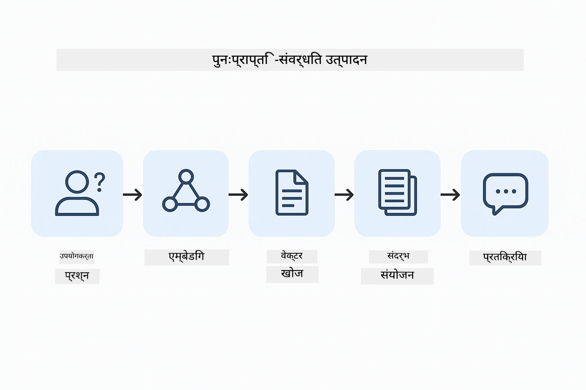
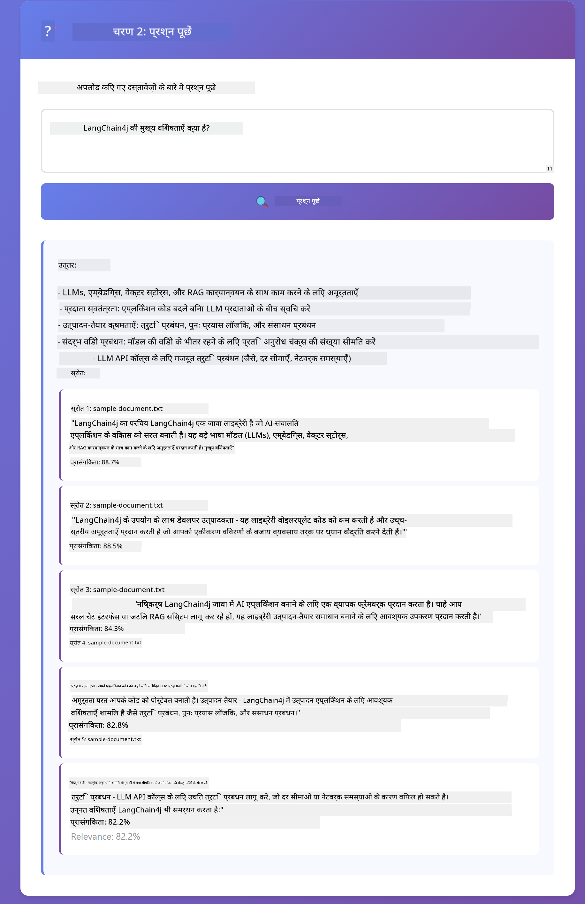

<!--
CO_OP_TRANSLATOR_METADATA:
{
  "original_hash": "f538a51cfd13147d40d84e936a0f485c",
  "translation_date": "2025-12-13T16:53:45+00:00",
  "source_file": "03-rag/README.md",
  "language_code": "hi"
}
-->
# मॉड्यूल 03: RAG (रिट्रीवल-ऑगमेंटेड जनरेशन)

## सामग्री सूची

- [आप क्या सीखेंगे](../../../03-rag)
- [पूर्व आवश्यकताएँ](../../../03-rag)
- [RAG को समझना](../../../03-rag)
- [यह कैसे काम करता है](../../../03-rag)
  - [दस्तावेज़ प्रसंस्करण](../../../03-rag)
  - [एम्बेडिंग बनाना](../../../03-rag)
  - [सामान्य खोज](../../../03-rag)
  - [उत्तर निर्माण](../../../03-rag)
- [एप्लिकेशन चलाएँ](../../../03-rag)
- [एप्लिकेशन का उपयोग](../../../03-rag)
  - [दस्तावेज़ अपलोड करें](../../../03-rag)
  - [प्रश्न पूछें](../../../03-rag)
  - [स्रोत संदर्भ जांचें](../../../03-rag)
  - [प्रश्नों के साथ प्रयोग करें](../../../03-rag)
- [मुख्य अवधारणाएँ](../../../03-rag)
  - [चंकिंग रणनीति](../../../03-rag)
  - [समानता स्कोर](../../../03-rag)
  - [इन-मेमोरी स्टोरेज](../../../03-rag)
  - [संदर्भ विंडो प्रबंधन](../../../03-rag)
- [जब RAG महत्वपूर्ण होता है](../../../03-rag)
- [अगले कदम](../../../03-rag)

## आप क्या सीखेंगे

पिछले मॉड्यूल में, आपने सीखा कि AI के साथ बातचीत कैसे करें और अपने प्रॉम्प्ट को प्रभावी ढंग से कैसे संरचित करें। लेकिन एक मौलिक सीमा है: भाषा मॉडल केवल वही जानते हैं जो उन्होंने प्रशिक्षण के दौरान सीखा है। वे आपकी कंपनी की नीतियों, आपके प्रोजेक्ट दस्तावेज़, या किसी भी ऐसी जानकारी के बारे में सवालों का जवाब नहीं दे सकते जिन पर उन्हें प्रशिक्षित नहीं किया गया है।

RAG (रिट्रीवल-ऑगमेंटेड जनरेशन) इस समस्या को हल करता है। मॉडल को आपकी जानकारी सिखाने की बजाय (जो महंगा और व्यावहारिक नहीं है), आप इसे अपने दस्तावेज़ों में खोज करने की क्षमता देते हैं। जब कोई प्रश्न पूछता है, तो सिस्टम प्रासंगिक जानकारी खोजता है और उसे प्रॉम्प्ट में शामिल करता है। मॉडल फिर उस प्राप्त संदर्भ के आधार पर उत्तर देता है।

RAG को मॉडल को एक संदर्भ पुस्तकालय देने के रूप में सोचें। जब आप कोई प्रश्न पूछते हैं, तो सिस्टम:

1. **उपयोगकर्ता प्रश्न** - आप एक प्रश्न पूछते हैं  
2. **एम्बेडिंग** - आपके प्रश्न को एक वेक्टर में परिवर्तित करता है  
3. **वेक्टर खोज** - समान दस्तावेज़ चंक्स खोजता है  
4. **संदर्भ संयोजन** - प्रॉम्प्ट में प्रासंगिक चंक्स जोड़ता है  
5. **प्रतिक्रिया** - LLM संदर्भ के आधार पर उत्तर उत्पन्न करता है  

यह मॉडल के उत्तरों को आपके वास्तविक डेटा में आधारित करता है बजाय इसके कि वह अपने प्रशिक्षण ज्ञान पर निर्भर करे या उत्तर बना ले।



*RAG वर्कफ़्लो - उपयोगकर्ता प्रश्न से लेकर सेमांटिक खोज और संदर्भित उत्तर निर्माण तक*

## पूर्व आवश्यकताएँ

- मॉड्यूल 01 पूरा किया हुआ (Azure OpenAI संसाधन तैनात)
- रूट डायरेक्टरी में `.env` फ़ाइल जिसमें Azure क्रेडेंशियल्स हों (मॉड्यूल 01 में `azd up` द्वारा बनाई गई)

> **नोट:** यदि आपने मॉड्यूल 01 पूरा नहीं किया है, तो पहले वहां तैनाती निर्देशों का पालन करें।


## यह कैसे काम करता है

**दस्तावेज़ प्रसंस्करण** - [DocumentService.java](../../../03-rag/src/main/java/com/example/langchain4j/rag/service/DocumentService.java)

जब आप कोई दस्तावेज़ अपलोड करते हैं, तो सिस्टम उसे चंक्स में तोड़ देता है - छोटे टुकड़े जो मॉडल के संदर्भ विंडो में आराम से फिट हो जाते हैं। ये चंक्स थोड़े ओवरलैप करते हैं ताकि सीमाओं पर संदर्भ न खोएं।

```java
Document document = FileSystemDocumentLoader.loadDocument("sample-document.txt");

DocumentSplitter splitter = DocumentSplitters
    .recursive(300, 30, new OpenAiTokenizer());

List<TextSegment> segments = splitter.split(document);
```

> **🤖 [GitHub Copilot](https://github.com/features/copilot) चैट के साथ प्रयास करें:** [`DocumentService.java`](../../../03-rag/src/main/java/com/example/langchain4j/rag/service/DocumentService.java) खोलें और पूछें:  
> - "LangChain4j दस्तावेज़ों को चंक्स में कैसे विभाजित करता है और ओवरलैप क्यों महत्वपूर्ण है?"  
> - "विभिन्न दस्तावेज़ प्रकारों के लिए आदर्श चंक आकार क्या है और क्यों?"  
> - "मैं कई भाषाओं या विशेष स्वरूपण वाले दस्तावेज़ों को कैसे संभालूं?"

**एम्बेडिंग बनाना** - [LangChainRagConfig.java](../../../03-rag/src/main/java/com/example/langchain4j/rag/config/LangChainRagConfig.java)

प्रत्येक चंक को एक संख्यात्मक प्रतिनिधित्व में बदला जाता है जिसे एम्बेडिंग कहा जाता है - मूल रूप से एक गणितीय फिंगरप्रिंट जो पाठ के अर्थ को पकड़ता है। समान पाठ समान एम्बेडिंग उत्पन्न करता है।

```java
@Bean
public EmbeddingModel embeddingModel() {
    return OpenAiOfficialEmbeddingModel.builder()
        .baseUrl(azureOpenAiEndpoint)
        .apiKey(azureOpenAiKey)
        .modelName(azureEmbeddingDeploymentName)
        .build();
}

EmbeddingStore<TextSegment> embeddingStore = 
    new InMemoryEmbeddingStore<>();
```


*दस्तावेज़ों को एम्बेडिंग स्पेस में वेक्टर के रूप में दर्शाया गया - समान सामग्री क्लस्टर बनाती है*

**सामान्य खोज** - [RagService.java](../../../03-rag/src/main/java/com/example/langchain4j/rag/service/RagService.java)

जब आप कोई प्रश्न पूछते हैं, तो आपका प्रश्न भी एक एम्बेडिंग बन जाता है। सिस्टम आपके प्रश्न की एम्बेडिंग की तुलना सभी दस्तावेज़ चंक्स की एम्बेडिंग से करता है। यह उन चंक्स को खोजता है जिनका अर्थ सबसे अधिक समान होता है - केवल मिलते-जुलते कीवर्ड नहीं, बल्कि वास्तविक सेमांटिक समानता।

```java
Embedding queryEmbedding = embeddingModel.embed(question).content();

List<EmbeddingMatch<TextSegment>> matches = 
    embeddingStore.findRelevant(queryEmbedding, 5, 0.7);

for (EmbeddingMatch<TextSegment> match : matches) {
    String relevantText = match.embedded().text();
    double score = match.score();
}
```

> **🤖 [GitHub Copilot](https://github.com/features/copilot) चैट के साथ प्रयास करें:** [`RagService.java`](../../../03-rag/src/main/java/com/example/langchain4j/rag/service/RagService.java) खोलें और पूछें:  
> - "एम्बेडिंग के साथ समानता खोज कैसे काम करती है और स्कोर क्या निर्धारित करता है?"  
> - "मुझे कौन सा समानता थ्रेशोल्ड उपयोग करना चाहिए और यह परिणामों को कैसे प्रभावित करता है?"  
> - "मैं उन मामलों को कैसे संभालूं जहां कोई प्रासंगिक दस्तावेज़ नहीं मिलता?"

**उत्तर निर्माण** - [RagService.java](../../../03-rag/src/main/java/com/example/langchain4j/rag/service/RagService.java)

सबसे प्रासंगिक चंक्स मॉडल के प्रॉम्प्ट में शामिल किए जाते हैं। मॉडल उन विशिष्ट चंक्स को पढ़ता है और उस जानकारी के आधार पर आपका प्रश्न उत्तर देता है। इससे भ्रम की संभावना कम होती है - मॉडल केवल सामने रखी जानकारी से ही उत्तर दे सकता है।

## एप्लिकेशन चलाएँ

**तैनाती सत्यापित करें:**

सुनिश्चित करें कि रूट डायरेक्टरी में `.env` फ़ाइल मौजूद है जिसमें Azure क्रेडेंशियल्स हैं (मॉड्यूल 01 के दौरान बनाई गई):
```bash
cat ../.env  # AZURE_OPENAI_ENDPOINT, API_KEY, DEPLOYMENT दिखाना चाहिए
```

**एप्लिकेशन शुरू करें:**

> **नोट:** यदि आपने पहले से मॉड्यूल 01 से `./start-all.sh` का उपयोग करके सभी एप्लिकेशन शुरू कर दिए हैं, तो यह मॉड्यूल पहले से पोर्ट 8081 पर चल रहा है। आप नीचे दिए गए स्टार्ट कमांड छोड़ सकते हैं और सीधे http://localhost:8081 पर जा सकते हैं।

**विकल्प 1: स्प्रिंग बूट डैशबोर्ड का उपयोग करना (VS कोड उपयोगकर्ताओं के लिए अनुशंसित)**

डेव कंटेनर में स्प्रिंग बूट डैशबोर्ड एक्सटेंशन शामिल है, जो सभी स्प्रिंग बूट एप्लिकेशन को प्रबंधित करने के लिए एक दृश्य इंटरफ़ेस प्रदान करता है। आप इसे VS कोड के बाएं साइड में एक्टिविटी बार में पा सकते हैं (स्प्रिंग बूट आइकन देखें)।

स्प्रिंग बूट डैशबोर्ड से, आप:  
- कार्यक्षेत्र में सभी उपलब्ध स्प्रिंग बूट एप्लिकेशन देख सकते हैं  
- एक क्लिक से एप्लिकेशन शुरू/रोक सकते हैं  
- एप्लिकेशन लॉग्स को रियल-टाइम में देख सकते हैं  
- एप्लिकेशन की स्थिति मॉनिटर कर सकते हैं  

सिर्फ "rag" के बगल में प्ले बटन पर क्लिक करें इस मॉड्यूल को शुरू करने के लिए, या सभी मॉड्यूल एक साथ शुरू करें।


**विकल्प 2: शेल स्क्रिप्ट्स का उपयोग करना**

सभी वेब एप्लिकेशन (मॉड्यूल 01-04) शुरू करें:

**Bash:**
```bash
cd ..  # रूट निर्देशिका से
./start-all.sh
```

**PowerShell:**
```powershell
cd ..  # रूट निर्देशिका से
.\start-all.ps1
```

या केवल इस मॉड्यूल को शुरू करें:

**Bash:**
```bash
cd 03-rag
./start.sh
```

**PowerShell:**
```powershell
cd 03-rag
.\start.ps1
```

दोनों स्क्रिप्ट्स स्वचालित रूप से रूट `.env` फ़ाइल से पर्यावरण चर लोड करती हैं और यदि JAR मौजूद नहीं हैं तो उन्हें बनाएंगी।

> **नोट:** यदि आप शुरू करने से पहले सभी मॉड्यूल मैन्युअली बनाना पसंद करते हैं:  
>  
> **Bash:**  
> ```bash
> cd ..  # Go to root directory
> mvn clean package -DskipTests
> ```
  
> **PowerShell:**  
> ```powershell
> cd ..  # Go to root directory
> mvn clean package -DskipTests
> ```
  
अपने ब्राउज़र में http://localhost:8081 खोलें।

**रोकने के लिए:**

**Bash:**  
```bash
./stop.sh  # केवल यह मॉड्यूल
# या
cd .. && ./stop-all.sh  # सभी मॉड्यूल
```
  
**PowerShell:**  
```powershell
.\stop.ps1  # केवल यह मॉड्यूल
# या
cd ..; .\stop-all.ps1  # सभी मॉड्यूल
```
  
## एप्लिकेशन का उपयोग

एप्लिकेशन दस्तावेज़ अपलोड और प्रश्न पूछने के लिए एक वेब इंटरफ़ेस प्रदान करता है।

<a href="images/rag-homepage.png"></a>

*RAG एप्लिकेशन इंटरफ़ेस - दस्तावेज़ अपलोड करें और प्रश्न पूछें*

**दस्तावेज़ अपलोड करें**

शुरू करें एक दस्तावेज़ अपलोड करके - परीक्षण के लिए TXT फ़ाइलें सबसे अच्छी हैं। इस डायरेक्टरी में एक `sample-document.txt` प्रदान किया गया है जिसमें LangChain4j फीचर्स, RAG इम्प्लीमेंटेशन, और सर्वोत्तम प्रथाओं की जानकारी है - सिस्टम का परीक्षण करने के लिए उपयुक्त।

सिस्टम आपके दस्तावेज़ को संसाधित करता है, उसे चंक्स में तोड़ता है, और प्रत्येक चंक के लिए एम्बेडिंग बनाता है। यह स्वचालित रूप से होता है जब आप अपलोड करते हैं।

**प्रश्न पूछें**

अब दस्तावेज़ सामग्री के बारे में विशिष्ट प्रश्न पूछें। कुछ तथ्यात्मक पूछें जो स्पष्ट रूप से दस्तावेज़ में बताए गए हों। सिस्टम प्रासंगिक चंक्स खोजता है, उन्हें प्रॉम्प्ट में शामिल करता है, और उत्तर उत्पन्न करता है।

**स्रोत संदर्भ जांचें**

ध्यान दें कि प्रत्येक उत्तर में स्रोत संदर्भ और समानता स्कोर शामिल होते हैं। ये स्कोर (0 से 1 तक) दिखाते हैं कि प्रत्येक चंक आपके प्रश्न के लिए कितना प्रासंगिक था। उच्च स्कोर बेहतर मेल का मतलब है। इससे आप उत्तर को स्रोत सामग्री के खिलाफ सत्यापित कर सकते हैं।

<a href="images/rag-query-results.png"></a>

*प्रश्न परिणाम उत्तर के साथ स्रोत संदर्भ और प्रासंगिकता स्कोर दिखा रहे हैं*

**प्रश्नों के साथ प्रयोग करें**

विभिन्न प्रकार के प्रश्न आज़माएं:  
- विशिष्ट तथ्य: "मुख्य विषय क्या है?"  
- तुलना: "X और Y में क्या अंतर है?"  
- सारांश: "Z के बारे में मुख्य बिंदुओं का सारांश दें"  

देखें कि आपकी प्रश्न सामग्री से मेल खाने के आधार पर प्रासंगिकता स्कोर कैसे बदलते हैं।

## मुख्य अवधारणाएँ

**चंकिंग रणनीति**

दस्तावेज़ों को 300-टोकन के चंक्स में विभाजित किया जाता है जिसमें 30 टोकन का ओवरलैप होता है। यह संतुलन सुनिश्चित करता है कि प्रत्येक चंक में पर्याप्त संदर्भ हो ताकि वह अर्थपूर्ण हो और साथ ही इतना छोटा हो कि एक प्रॉम्प्ट में कई चंक्स शामिल किए जा सकें।

**समानता स्कोर**

स्कोर 0 से 1 तक होते हैं:  
- 0.7-1.0: अत्यधिक प्रासंगिक, सटीक मेल  
- 0.5-0.7: प्रासंगिक, अच्छा संदर्भ  
- 0.5 से नीचे: फ़िल्टर किया गया, बहुत भिन्न  

सिस्टम केवल न्यूनतम थ्रेशोल्ड से ऊपर के चंक्स को पुनः प्राप्त करता है ताकि गुणवत्ता सुनिश्चित हो।

**इन-मेमोरी स्टोरेज**

यह मॉड्यूल सरलता के लिए इन-मेमोरी स्टोरेज का उपयोग करता है। जब आप एप्लिकेशन पुनः आरंभ करते हैं, तो अपलोड किए गए दस्तावेज़ खो जाते हैं। प्रोडक्शन सिस्टम स्थायी वेक्टर डेटाबेस जैसे Qdrant या Azure AI Search का उपयोग करते हैं।

**संदर्भ विंडो प्रबंधन**

प्रत्येक मॉडल की अधिकतम संदर्भ विंडो होती है। आप बड़े दस्तावेज़ के हर चंक को शामिल नहीं कर सकते। सिस्टम शीर्ष N सबसे प्रासंगिक चंक्स (डिफ़ॉल्ट 5) पुनः प्राप्त करता है ताकि सीमाओं के भीतर रहते हुए पर्याप्त संदर्भ प्रदान किया जा सके।

## जब RAG महत्वपूर्ण होता है

**RAG का उपयोग करें जब:**  
- स्वामित्व वाले दस्तावेज़ों के बारे में प्रश्नों का उत्तर देना हो  
- जानकारी अक्सर बदलती हो (नीतियाँ, मूल्य, विनिर्देश)  
- सटीकता के लिए स्रोत उल्लेख आवश्यक हो  
- सामग्री एकल प्रॉम्प्ट में फिट करने के लिए बहुत बड़ी हो  
- आपको सत्यापित, आधारभूत उत्तर चाहिए हों  

**RAG का उपयोग न करें जब:**  
- प्रश्न सामान्य ज्ञान से संबंधित हों जो मॉडल के पास पहले से हो  
- वास्तविक समय डेटा की आवश्यकता हो (RAG अपलोड किए गए दस्तावेज़ों पर काम करता है)  
- सामग्री इतनी छोटी हो कि सीधे प्रॉम्प्ट में शामिल की जा सके  

## अगले कदम

**अगला मॉड्यूल:** [04-tools - AI एजेंट्स विथ टूल्स](../04-tools/README.md)

---

**नेविगेशन:** [← पिछला: मॉड्यूल 02 - प्रॉम्प्ट इंजीनियरिंग](../02-prompt-engineering/README.md) | [मुख्य पृष्ठ पर वापस](../README.md) | [अगला: मॉड्यूल 04 - टूल्स →](../04-tools/README.md)

---

<!-- CO-OP TRANSLATOR DISCLAIMER START -->
**अस्वीकरण**:  
यह दस्तावेज़ AI अनुवाद सेवा [Co-op Translator](https://github.com/Azure/co-op-translator) का उपयोग करके अनुवादित किया गया है। जबकि हम सटीकता के लिए प्रयासरत हैं, कृपया ध्यान दें कि स्वचालित अनुवादों में त्रुटियाँ या अशुद्धियाँ हो सकती हैं। मूल दस्तावेज़ अपनी मूल भाषा में ही अधिकारिक स्रोत माना जाना चाहिए। महत्वपूर्ण जानकारी के लिए, पेशेवर मानव अनुवाद की सलाह दी जाती है। इस अनुवाद के उपयोग से उत्पन्न किसी भी गलतफहमी या गलत व्याख्या के लिए हम जिम्मेदार नहीं हैं।
<!-- CO-OP TRANSLATOR DISCLAIMER END -->