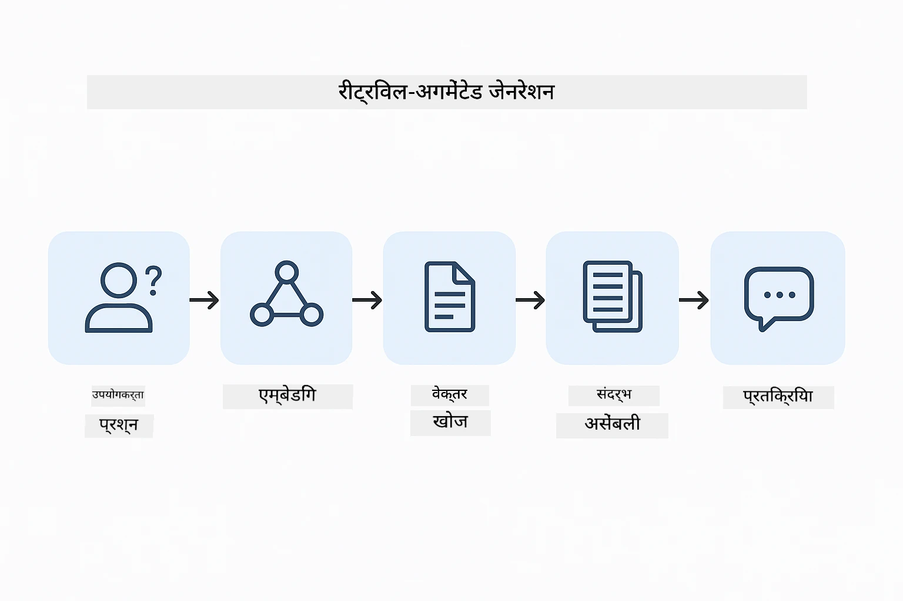
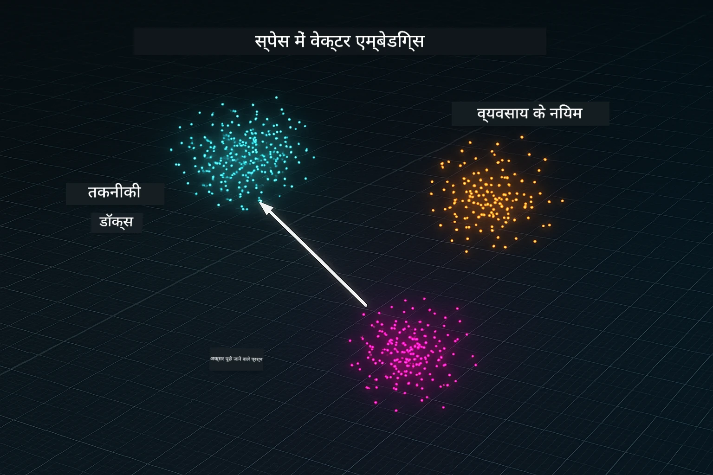
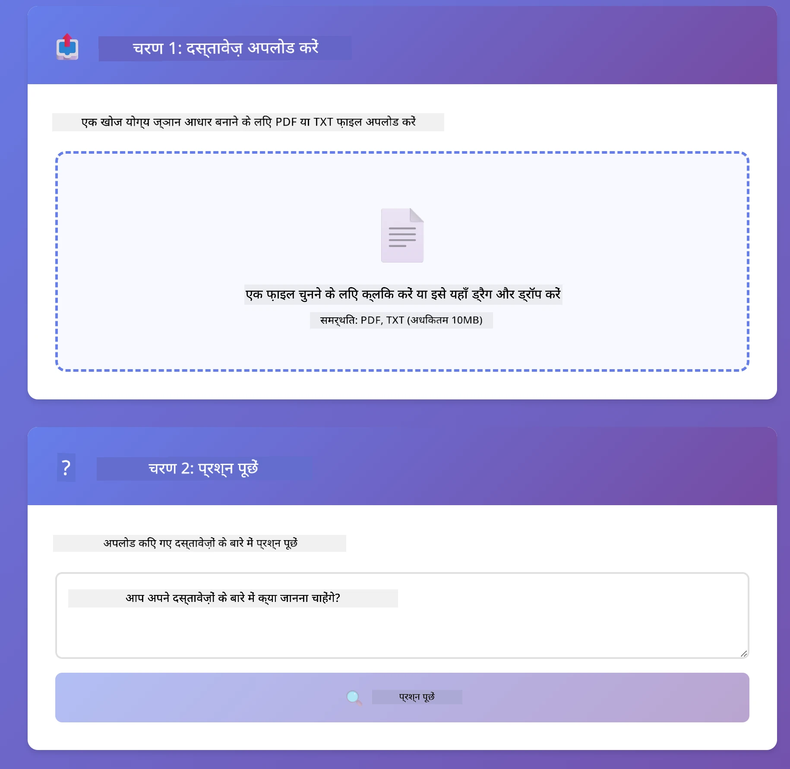
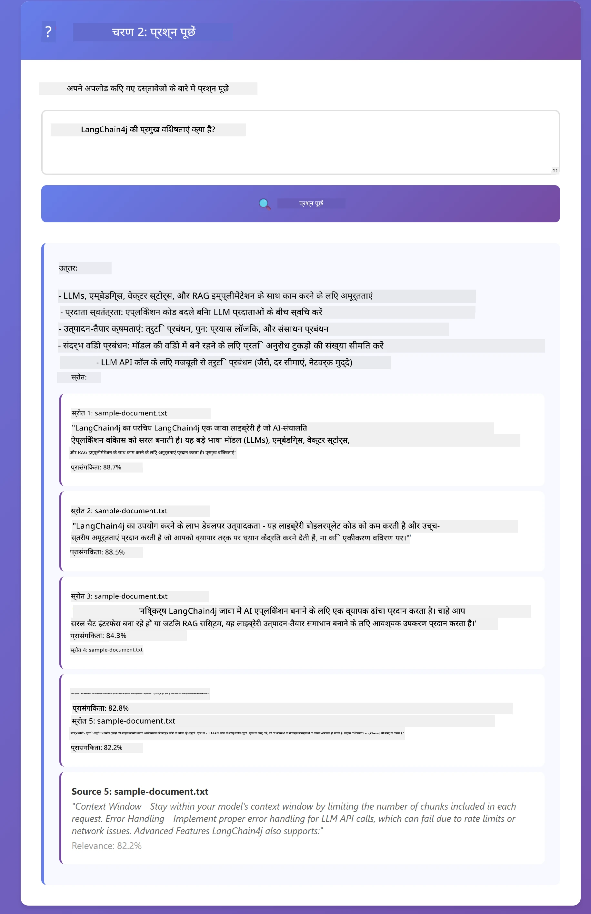

# मॉड्यूल 03: RAG (रिट्रीवल-अगमेंटेड जेनरेशन)

## विषय सूची

- [आप क्या सीखेंगे](../../../03-rag)
- [पूर्वापेक्षाएँ](../../../03-rag)
- [RAG को समझना](../../../03-rag)
- [यह कैसे काम करता है](../../../03-rag)
  - [दस्तावेज़ संसाधन](../../../03-rag)
  - [एम्बेडिंग बनाना](../../../03-rag)
  - [सार्थक खोज](../../../03-rag)
  - [उत्तर निर्माण](../../../03-rag)
- [एप्लिकेशन चलाएँ](../../../03-rag)
- [एप्लिकेशन का उपयोग करना](../../../03-rag)
  - [एक दस्तावेज़ अपलोड करें](../../../03-rag)
  - [प्रश्न पूछें](../../../03-rag)
  - [स्रोत संदर्भ जांचें](../../../03-rag)
  - [प्रश्नों के साथ प्रयोग करें](../../../03-rag)
- [प्रमुख अवधारणाएँ](../../../03-rag)
  - [चंकिंग रणनीति](../../../03-rag)
  - [समानता स्कोर](../../../03-rag)
  - [इन-मेमोरी स्टोरेज](../../../03-rag)
  - [संदर्भ विंडो प्रबंधन](../../../03-rag)
- [RAG कब महत्वपूर्ण होता है](../../../03-rag)
- [अगले कदम](../../../03-rag)

## आप क्या सीखेंगे

पिछले मॉड्यूल में, आपने सीखा कि AI के साथ कैसे बातचीत करें और अपने प्रॉम्प्ट्स को प्रभावी ढंग से संरचित करें। लेकिन एक मौलिक सीमा है: भाषा मॉडल केवल वही जानते हैं जो उन्होंने प्रशिक्षण के दौरान सीखा था। वे आपकी कंपनी की नीतियों, आपके परियोजना दस्तावेज़, या उन जानकारियों के बारे में उत्तर नहीं दे सकते जिन पर वे प्रशिक्षित नहीं हुए हैं।

RAG (रिट्रीवल-अगमेंटेड जेनरेशन) इस समस्या को हल करता है। मॉडल को आपकी जानकारी सिखाने की बजाय (जो महंगा और व्यावहारिक नहीं है), आप इसे आपके दस्तावेज़ों में खोज करने की क्षमता देते हैं। जब कोई प्रश्न पूछता है, तो सिस्टम संबंधित जानकारी खोजकर उसे प्रॉम्प्ट में शामिल करता है। मॉडल तब उस प्राप्त संदर्भ के आधार पर उत्तर देता है।

RAG को ऐसे समझें जैसे मॉडल को एक संदर्भ पुस्तकालय दे रहे हों। जब आप प्रश्न पूछते हैं, तो सिस्टम:

1. **उपयोगकर्ता क्वेरी** - आप प्रश्न पूछते हैं
2. **एम्बेडिंग** - आपके प्रश्न को वेक्टर में बदलता है
3. **वेक्टर सर्च** - समान दस्तावेज़ चंक्स खोजता है
4. **संदर्भ संयोजन** - प्रॉम्प्ट में संबंधित चंक्स जोड़ता है
5. **प्रतिक्रिया** - LLM संदर्भ के आधार पर उत्तर उत्पन्न करता है

यह मॉडल के प्रतिक्रियाओं को आपके वास्तविक डेटा में जमीनी स्तर पर लाता है, न कि उसके प्रशिक्षण ज्ञान पर निर्भर रहने या उत्तर बनाने पर।



*RAG कार्यप्रणाली - उपयोगकर्ता क्वेरी से सार्थक खोज तक संदर्भीय उत्तर निर्माण*

## पूर्वापेक्षाएँ

- मॉड्यूल 01 पूरा किया गया (Azure OpenAI संसाधन तैनात किए गए)
- रूट डिरेक्टरी में `.env` फ़ाइल जिसमें Azure क्रेडेंशियल्स हों (मॉड्यूल 01 में `azd up` द्वारा बनाई गई)

> **नोट:** यदि आपने मॉड्यूल 01 पूरा नहीं किया है, तो पहले वहां तैनाती निर्देशों का पालन करें।

## यह कैसे काम करता है

### दस्तावेज़ संसाधन

[DocumentService.java](../../../03-rag/src/main/java/com/example/langchain4j/rag/service/DocumentService.java)

जब आप कोई दस्तावेज़ अपलोड करते हैं, तो सिस्टम इसे चंक्स में तोड़ देता है - छोटे टुकड़े जो मॉडल के संदर्भ विंडो में आराम से फिट हो सकें। ये चंक्स थोड़े ओवरलैप करते हैं ताकि सीमाओं पर संदर्भ खो न जाए।

```java
Document document = FileSystemDocumentLoader.loadDocument("sample-document.txt");

DocumentSplitter splitter = DocumentSplitters
    .recursive(300, 30, new OpenAiTokenizer());

List<TextSegment> segments = splitter.split(document);
```

> **🤖 [GitHub Copilot](https://github.com/features/copilot) चैट के साथ प्रयास करें:** [`DocumentService.java`](../../../03-rag/src/main/java/com/example/langchain4j/rag/service/DocumentService.java) खोलें और पूछें:
> - "LangChain4j दस्तावेज़ों को चंक्स में कैसे विभाजित करता है और ओवरलैप क्यों महत्वपूर्ण है?"
> - "विभिन्न दस्तावेज़ प्रकारों के लिए आदर्श चंक आकार क्या है और क्यों?"
> - "मैं बहुभाषी या विशेष स्वरूपण वाले दस्तावेज़ों को कैसे संभालूं?"

### एम्बेडिंग बनाना

[LangChainRagConfig.java](../../../03-rag/src/main/java/com/example/langchain4j/rag/config/LangChainRagConfig.java)

प्रत्येक चंक को एक संख्यात्मक प्रतिनिधित्व में बदला जाता है जिसे एम्बेडिंग कहा जाता है - मूलतः एक गणितीय फिंगरप्रिंट जो टेक्स्ट के अर्थ को पकड़ता है। समान टेक्स्ट समान एम्बेडिंग्स उत्पन्न करता है।

```java
@Bean
public EmbeddingModel embeddingModel() {
    return OpenAiOfficialEmbeddingModel.builder()
        .baseUrl(azureOpenAiEndpoint)
        .apiKey(azureOpenAiKey)
        .modelName(azureEmbeddingDeploymentName)
        .build();
}

EmbeddingStore<TextSegment> embeddingStore = 
    new InMemoryEmbeddingStore<>();
```



*डॉक्यूमेंट्स को एम्बेडिंग स्पेस में वेक्टर के रूप में दर्शाया गया - समान सामग्री क्लस्टर्स में समूहित होती है*

### सार्थक खोज

[RagService.java](../../../03-rag/src/main/java/com/example/langchain4j/rag/service/RagService.java)

जब आप प्रश्न पूछते हैं, तो आपका प्रश्न भी एक एम्बेडिंग बन जाता है। सिस्टम आपके प्रश्न की एम्बेडिंग की तुलना सभी दस्तावेज़ चंक्स की एम्बेडिंग से करता है। यह सबसे समानार्थक चंक्स खोजता है - केवल मिलते-जुलते कीवर्ड नहीं, बल्कि वास्तविक सार्थक समानता।

```java
Embedding queryEmbedding = embeddingModel.embed(question).content();

List<EmbeddingMatch<TextSegment>> matches = 
    embeddingStore.findRelevant(queryEmbedding, 5, 0.7);

for (EmbeddingMatch<TextSegment> match : matches) {
    String relevantText = match.embedded().text();
    double score = match.score();
}
```

> **🤖 [GitHub Copilot](https://github.com/features/copilot) चैट के साथ प्रयास करें:** [`RagService.java`](../../../03-rag/src/main/java/com/example/langchain4j/rag/service/RagService.java) खोलें और पूछें:
> - "एम्बेडिंग्स के साथ समानता खोज कैसे काम करती है और स्कोर को क्या निर्धारित करता है?"
> - "मैं किस समानता थ्रेसहोल्ड का उपयोग करूं और यह परिणामों को कैसे प्रभावित करता है?"
> - "जब कोई संबंधित दस्तावेज़ नहीं मिलता तो मैं कैसे संभालूं?"

### उत्तर निर्माण

[RagService.java](../../../03-rag/src/main/java/com/example/langchain4j/rag/service/RagService.java)

सबसे संबंधित चंक्स प्रॉम्प्ट में मॉडल को शामिल किए जाते हैं। मॉडल उन विशिष्ट चंक्स को पढ़ता है और उस सूचना के आधार पर आपका प्रश्न का उत्तर देता है। यह हल्लुसिनेशन को रोकता है - मॉडल केवल सामने मौजूद तथ्यों से ही उत्तर दे सकता है।

## एप्लिकेशन चलाएँ

**तैनाती सत्यापित करें:**

सुनिश्चित करें कि रूट डिरेक्टरी में `.env` फ़ाइल मौजूद है जिसमें Azure क्रेडेंशियल्स हों (मॉड्यूल 01 के दौरान बनाई गई):
```bash
cat ../.env  # AZURE_OPENAI_ENDPOINT, API_KEY, DEPLOYMENT दिखना चाहिए
```

**एप्लिकेशन शुरू करें:**

> **नोट:** यदि आपने पहले से मॉड्यूल 01 से `./start-all.sh` के जरिए सभी एप्लिकेशन शुरू कर दिए हैं, तो यह मॉड्यूल पोर्ट 8081 पर पहले से चल रहा है। आप नीचे दिए गए स्टार्ट कमांड्स छोड़कर सीधे http://localhost:8081 पर जा सकते हैं।

**विकल्प 1: स्प्रिंग बूट डैशबोर्ड का उपयोग (VS कोड उपयोगकर्ताओं के लिए अनुशंसित)**

डेव कंटेनर में Spring Boot Dashboard एक्सटेंशन शामिल है, जो सभी स्प्रिंग बूट एप्लिकेशन को प्रबंधित करने के लिए एक दृश्य इंटरफेस प्रदान करता है। आप इसे VS कोड के Activity Bar में बाएं तरफ स्प्रिंग बूट आइकन के रूप में पाएंगे।

Spring Boot Dashboard से आप:
- सभी उपलब्ध स्प्रिंग बूट एप्लिकेशन देख सकते हैं
- एक क्लिक में एप्लिकेशन शुरू/रोक सकते हैं
- एप्लिकेशन लॉग्स असली समय में देख सकते हैं
- एप्लिकेशन की स्थिति मॉनिटर कर सकते हैं

सिर्फ "rag" के बगल में प्ले बटन पर क्लिक करें इस मॉड्यूल को शुरू करने के लिए, या सभी मॉड्यूल एक साथ शुरू करें।


**विकल्प 2: शेल स्क्रिप्ट्स का उपयोग**

सभी वेब एप्लिकेशन शुरू करें (मॉड्यूल 01-04):

**Bash:**
```bash
cd ..  # रूट निर्देशिका से
./start-all.sh
```

**PowerShell:**
```powershell
cd ..  # मूल निर्देशिका से
.\start-all.ps1
```

या केवल इस मॉड्यूल को शुरू करें:

**Bash:**
```bash
cd 03-rag
./start.sh
```

**PowerShell:**
```powershell
cd 03-rag
.\start.ps1
```

दोनों स्क्रिप्ट्स स्वचालित रूप से रूट `.env` फ़ाइल से पर्यावरण चर लोड करते हैं और यदि JAR मौजूद नहीं है तो उन्हें बनाते हैं।

> **नोट:** यदि आप शुरू करने से पहले सभी मॉड्यूल मैन्युअली बनाना चाहते हैं:
>
> **Bash:**
> ```bash
> cd ..  # Go to root directory
> mvn clean package -DskipTests
> ```
>
> **PowerShell:**
> ```powershell
> cd ..  # Go to root directory
> mvn clean package -DskipTests
> ```

अपने ब्राउज़र में http://localhost:8081 खोलें।

**बंद करने के लिए:**

**Bash:**
```bash
./stop.sh  # केवल यह मॉड्यूल
# या
cd .. && ./stop-all.sh  # सभी मॉड्यूल
```

**PowerShell:**
```powershell
.\stop.ps1  # केवल यह मॉड्यूल
# या
cd ..; .\stop-all.ps1  # सभी मॉड्यूल
```

## एप्लिकेशन का उपयोग करना

एप्लिकेशन दस्तावेज़ अपलोड और प्रश्न पूछने के लिए एक वेब इंटरफेस प्रदान करता है।

<a href="images/rag-homepage.png"></a>

*RAG एप्लिकेशन इंटरफ़ेस - दस्तावेज़ अपलोड करें और प्रश्न पूछें*

### एक दस्तावेज़ अपलोड करें

दस्तावेज़ अपलोड करके शुरू करें - परीक्षण के लिए TXT फ़ाइलें सबसे अच्छी होती हैं। इस निर्देशिका में एक `sample-document.txt` प्रदान किया गया है जिसमें LangChain4j फीचर्स, RAG कार्यान्वयन, और सर्वश्रेष्ठ प्रथाओं की जानकारी है - सिस्टम के परीक्षण के लिए उपयुक्त।

सिस्टम आपके दस्तावेज़ को संसाधित करता है, उसे चंक्स में तोड़ता है, और प्रत्येक चंक के लिए एम्बेडिंग बनाता है। यह सब स्वचालित रूप से अपलोड करते समय होता है।

### प्रश्न पूछें

अब दस्तावेज़ सामग्री के बारे में विशिष्ट प्रश्न पूछें। कुछ तथ्यात्मक और स्पष्ट बातों को आज़माएं जो दस्तावेज़ में स्पष्ट रूप से कही गई हों। सिस्टम संबंधित चंक्स खोजता है, उन्हें प्रॉम्प्ट में जोड़ता है, और एक उत्तर उत्पन्न करता है।

### स्रोत संदर्भ जांचें

ध्यान दें कि प्रत्येक उत्तर में स्रोत संदर्भ होते हैं जिनके साथ समानता स्कोर भी होते हैं। ये स्कोर (0 से 1 तक) दिखाते हैं कि प्रत्येक चंक आपके प्रश्न के लिए कितना प्रासंगिक था। उच्च स्कोर बेहतर मिलान दर्शाते हैं। यह आपको उत्तर की जांच स्रोत सामग्री के विरुद्ध करने देता है।

<a href="images/rag-query-results.png"></a>

*प्रश्न परिणाम दर्शाते हैं उत्तर स्रोत संदर्भों और प्रासंगिकता स्कोर के साथ*

### प्रश्नों के साथ प्रयोग करें

विभिन्न प्रकार के प्रश्न आज़माएं:
- विशिष्ट तथ्य: "मुख्य विषय क्या है?"
- तुलना: "X और Y में क्या अंतर है?"
- सारांश: "Z के मुख्य बिंदुओं का सारांश दें"

देखें कि आपकी प्रश्न के अनुसार प्रासंगिकता स्कोर कैसे बदलते हैं।

## प्रमुख अवधारणाएँ

### चंकिंग रणनीति

दस्तावेज़ों को 300 टोकन के चंक्स में बांटा जाता है जिनमें 30 टोकन का ओवरलैप होता है। यह संतुलन सुनिश्चित करता है कि प्रत्येक चंक के पास पर्याप्त संदर्भ हो जिससे वह अर्थपूर्ण बने, साथ ही वह इतना छोटा हो कि एक प्रॉम्प्ट में कई चंक्स शामिल किया जा सके।

### समानता स्कोर

स्कोर 0 से 1 के बीच होते हैं:
- 0.7-1.0: अत्यधिक प्रासंगिक, सटीक मेल
- 0.5-0.7: प्रासंगिक, अच्छा संदर्भ
- 0.5 से नीचे: फ़िल्टर आउट, अत्यधिक भिन्न

सिस्टम केवल न्यूनतम थ्रेसहोल्ड से ऊपर वाले चंक्स ही पुनर्प्राप्त करता है ताकि गुणवत्ता सुनिश्चित हो।

### इन-मेमोरी स्टोरेज

यह मॉड्यूल सरलता के लिए इन-मेमोरी स्टोरेज का उपयोग करता है। जब आप एप्लिकेशन पुनः प्रारंभ करते हैं, तो अपलोड किए गए दस्तावेज़ खो जाते हैं। प्रोडक्शन सिस्टम Qdrant या Azure AI Search जैसे स्थायी वेक्टर डेटाबेस उपयोग करते हैं।

### संदर्भ विंडो प्रबंधन

प्रत्येक मॉडल की अधिकतम संदर्भ विंडो होती है। आप एक बड़े दस्तावेज़ के हर चंक को शामिल नहीं कर सकते। सिस्टम शीर्ष N सबसे प्रासंगिक चंक्स (डिफ़ॉल्ट 5) पुनर्प्राप्त करता है ताकि सीमा के भीतर रहते हुए पर्याप्त संदर्भ प्रदान किया जा सके।

## RAG कब महत्वपूर्ण होता है

**RAG का उपयोग तब करें:**
- स्वामित्व वाले दस्तावेज़ों के प्रश्नों का उत्तर देने के लिए
- जब जानकारी अक्सर बदलती हो (नीतियाँ, कीमतें, विनिर्देश)
- स्रोत उद्धरण के साथ सटीकता आवश्यक हो
- सामग्री इतनी बड़ी हो कि एक अकेले प्रॉम्प्ट में न समा सके
- आपको सत्यापित, आधारभूत उत्तर चाहिए

**RAG का उपयोग न करें जब:**
- प्रश्न सामान्य ज्ञान से संबंधित हों जो मॉडल के पास पहले से हो
- वास्तविक समय डेटा की आवश्यकता हो (RAG अपलोड किए गए दस्तावेजों पर काम करता है)
- सामग्री इतनी छोटी हो कि उसे सीधे प्रॉम्प्ट में शामिल किया जा सके

## अगले कदम

**अगला मॉड्यूल:** [04-tools - AI एजेंट्स टूल्स के साथ](../04-tools/README.md)

---

**नेविगेशन:** [← पिछला: मॉड्यूल 02 - प्रॉम्प्ट इंजीनियरिंग](../02-prompt-engineering/README.md) | [मुखपृष्ठ पर वापस](../README.md) | [आगे: मॉड्यूल 04 - टूल्स →](../04-tools/README.md)

---

<!-- CO-OP TRANSLATOR DISCLAIMER START -->
**अस्वीकरण**:
यह दस्तावेज़ AI अनुवाद सेवा [Co-op Translator](https://github.com/Azure/co-op-translator) का उपयोग करके अनूदित किया गया है। जबकि हम सटीकता के लिए प्रयासरत हैं, कृपया ध्यान रखें कि स्वचालित अनुवादों में त्रुटियाँ या गलतियाँ हो सकती हैं। मूल दस्तावेज़ इसकी मूल भाषा में अधिकृत स्रोत माना जाना चाहिए। महत्वपूर्ण जानकारी के लिए, पेशेवर मानव अनुवाद की सिफारिश की जाती है। इस अनुवाद के उपयोग से उत्पन्न किसी भी गलतफहमी या गलत व्याख्या के लिए हम उत्तरदायी नहीं हैं।
<!-- CO-OP TRANSLATOR DISCLAIMER END -->