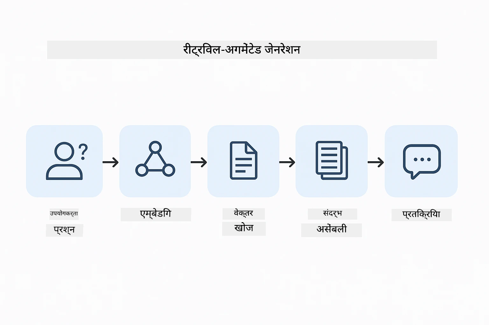
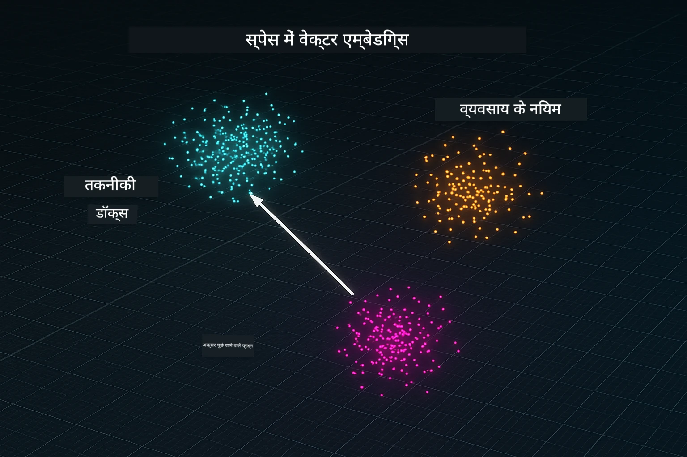
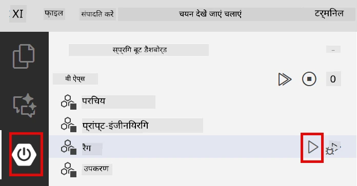
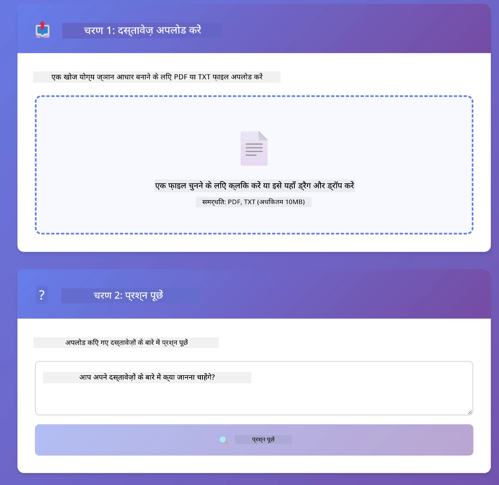
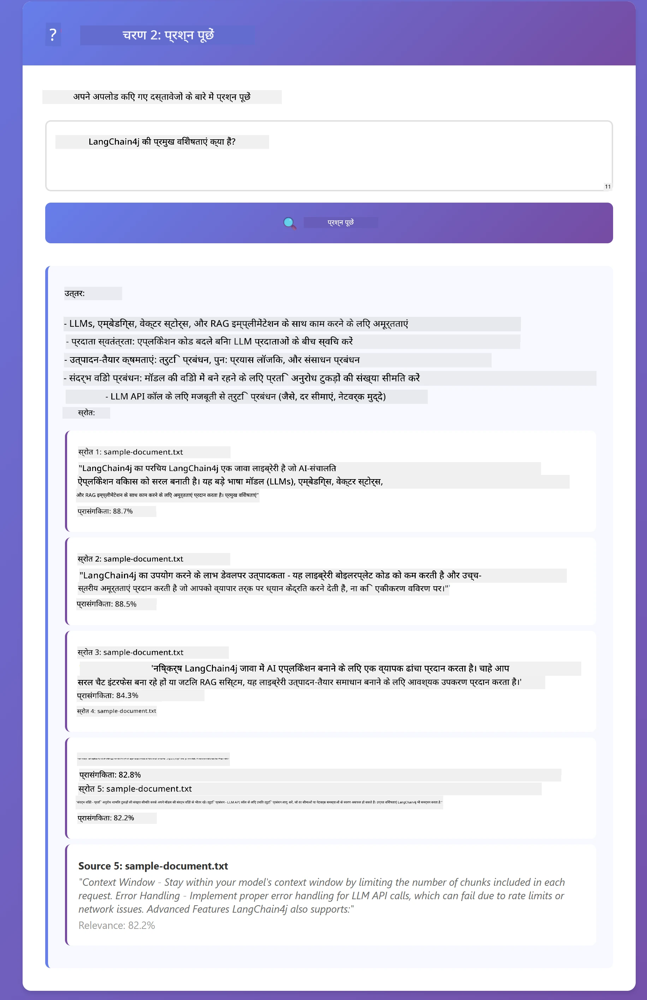

# मॉड्यूल 03: RAG (रिट्रीवल-अगमेंटेड जनरेशन)

## सामग्री-सूची

- [वीडियो वॉकथ्रू](#वीडियो-वॉकथ्रू)
- [आप क्या सीखेंगे](#आप-क्या-सीखेंगे)
- [पूर्व आवश्यकताएँ](#पूर्व-आवश्यकताएँ)
- [RAG को समझना](#rag-को-समझना)
  - [इस ट्यूटोरियल में कौन सा RAG दृष्टिकोण उपयोग होता है?](#इस-ट्यूटोरियल-में-कौन-सा-rag-दृष्टिकोण-उपयोग-होता-है)
- [यह कैसे काम करता है](#यह-कैसे-काम-करता-है)
  - [दस्तावेज़ प्रसंस्करण](#दस्तावेज़-प्रसंस्करण)
  - [एम्बेडिंग बनाना](#एम्बेडिंग-बनाना)
  - [सिमेंटिक सर्च](#सिमेंटिक-सर्च)
  - [उत्तर निर्माण](#उत्तर-उत्पन्न-करना)
- [एप्लिकेशन चलाना](#एप्लिकेशन-चलाएँ)
- [एप्लिकेशन का उपयोग](#एप्लिकेशन-का-उपयोग-करना)
  - [दस्तावेज़ अपलोड करें](#एक-दस्तावेज़-अपलोड-करें)
  - [प्रश्न पूछें](#प्रश्न-पूछें)
  - [स्रोत संदर्भ जांचें](#स्रोत-संदर्भ-जांचें)
  - [प्रश्नों के साथ प्रयोग करें](#प्रश्नों-के-साथ-प्रयोग-करें)
- [प्रमुख अवधारणाएँ](#मुख्य-अवधारणाएँ)
  - [चंकिंग रणनीति](#खंडन-रणनीति)
  - [समानता स्कोर](#समानता-स्कोर)
  - [इन-मेमोरी भंडारण](#इन-मेमोरी-स्टोरेज)
  - [कॉन्टेक्स्ट विंडो प्रबंधन](#संदर्भ-विंडो-प्रबंधन)
- [जब RAG महत्वपूर्ण होता है](#जब-rag-महत्वपूर्ण-होता-है)
- [अगले कदम](#अगले-कदम)

## वीडियो वॉकथ्रू

इस लाइव सत्र को देखें जो इस मॉड्यूल के साथ आरंभ करने का तरीका समझाता है:

<a href="https://www.youtube.com/watch?v=_olq75ZH_eY"></a>

## आप क्या सीखेंगे

पिछले मॉड्यूल में, आपने सीखा कि कैसे AI के साथ वार्तालाप करें और अपने प्रांप्ट्स को प्रभावी ढंग से संरचित करें। लेकिन एक मौलिक सीमा है: भाषा मॉडल केवल वही जानते हैं जो उन्होंने प्रशिक्षण के दौरान सीखा है। वे आपके कंपनी की नीतियों, आपके प्रोजेक्ट की डाक्यूमेंटेशन, या ऐसी किसी भी जानकारी पर सवाल का जवाब नहीं दे सकते जिन पर उन्हें प्रशिक्षित नहीं किया गया।

RAG (रिट्रीवल-अगमेंटेड जनरेशन) इस समस्या का समाधान है। मॉडल को आपकी जानकारी सिखाने की बजाय (जो महंगा और अप्रैक्टिकल है), आप इसे आपके दस्तावेज़ों के माध्यम से खोजने की क्षमता देते हैं। जब कोई प्रश्न पूछता है, सिस्टम प्रासंगिक जानकारी खोजता है और उसे प्रांप्ट में शामिल करता है। मॉडल फिर उस पुनः प्राप्त संदर्भ के आधार पर उत्तर देता है।

RAG को आप मॉडल को एक संदर्भ पुस्तकालय देने के रूप में सोचिए। जब आप प्रश्न पूछते हैं, तंत्र:

1. **उपयोगकर्ता क्वेरी** - आप प्रश्न पूछते हैं
2. **एम्बेडिंग** - आपका प्रश्न वेक्टर में परिवर्तित होता है
3. **वेक्टर सर्च** - समान दस्तावेज़ चंक्स खोजता है
4. **संदर्भ संयोजन** - प्रासंगिक चंक्स को प्रांप्ट में जोड़ता है
5. **प्रतिक्रिया** - LLM संदर्भ के आधार पर उत्तर उत्पन्न करता है

यह मॉडल के उत्तरों को आपके वास्तविक डेटा में आधार देता है बजाय इसके कि वह अपने प्रशिक्षण ज्ञान या अनुमान पर निर्भर हो।

## पूर्व आवश्यकताएँ

- पूरा किया हुआ [मॉड्यूल 01 - परिचय](../01-introduction/README.md) (Azure OpenAI संसाधन तैनात, जिसमें `text-embedding-3-small` एम्बेडिंग मॉडल शामिल है)
- रूट डायरेक्टरी में `.env` फ़ाइल जिसमें Azure क्रेडेंशियल्स हो (मॉड्यूल 01 में `azd up` द्वारा बनाया गया)

> **ध्यान दें:** यदि आपने मॉड्यूल 01 पूरा नहीं किया है, तो पहले वहां तैनाती निर्देशों का पालन करें। `azd up` कमांड GPT चैट मॉडल और इस मॉड्यूल द्वारा उपयोग किए जाने वाले एम्बेडिंग मॉडल दोनों को तैनात करता है।

## RAG को समझना

नीचे दिया गया आरेख मुख्य अवधारणा को दर्शाता है: केवल मॉडल के प्रशिक्षण डेटा पर निर्भर रहने के बजाय, RAG इसे आपके दस्तावेज़ों की संदर्भ पुस्तकालय देता है ताकि वह प्रत्येक उत्तर बनाते समय उस पर सलाह कर सके।


*यह आरेख एक मानक LLM (जो प्रशिक्षण डेटा से अनुमान लगाता है) और एक RAG-संवर्धित LLM (जो पहले आपके दस्तावेज़ों से सलाह लेता है) के बीच का अंतर दिखाता है।*

यहाँ यह टुकड़े अंत-से-अंत कैसे जुड़ते हैं, बताया गया है। एक उपयोगकर्ता का प्रश्न चार चरणों से गुजरता है — एम्बेडिंग, वेक्टर सर्च, संदर्भ संयोजन, और उत्तर निर्माण — प्रत्येक पिछले पर आधारित:



*यह आरेख अंत-से-अंत RAG पाइपलाइन दिखाता है — एक उपयोगकर्ता क्वेरी एम्बेडिंग, वेक्टर सर्च, संदर्भ संयोजन, और उत्तर निर्माण से गुजरती है।*

इस मॉड्यूल के बाकी हिस्से में हम प्रत्येक चरण को विस्तार से देखेंगे, जिनमें कोड भी शामिल है जिसे आप चला और संशोधित कर सकते हैं।

### इस ट्यूटोरियल में कौन सा RAG दृष्टिकोण उपयोग होता है?

LangChain4j तीन तरीके प्रदान करता है RAG को लागू करने के लिए, प्रत्येक अलग स्तर की अमूर्तता के साथ। नीचे दिया गया आरेख उन्हें एक साथ तुलना करता है:


*यह आरेख तीन LangChain4j RAG दृष्टिकोणों — Easy, Native, और Advanced — को उनके मुख्य घटकों के साथ तुलना करता है और कब प्रत्येक का उपयोग करना है।*

| दृष्टिकोण | यह क्या करता है | ट्रैड-ऑफ |
|---|---|---|
| **Easy RAG** | सब कुछ `AiServices` और `ContentRetriever` के माध्यम से अपने आप वायर करता है। आप एक इंटरफ़ेस एनोटेट करते हैं, एक रिट्रीवर लगाते हैं, और LangChain4j एम्बेडिंग, खोज और प्रांप्ट संयोजन को पर्दे के पीछे संभालता है। | कम कोड, लेकिन आप प्रत्येक चरण में क्या हो रहा है यह नहीं देख पाते। |
| **Native RAG** | आप स्वयं एम्बेडिंग मॉडल कॉल करते हैं, स्टोर में खोज करते हैं, प्रांप्ट बनाते हैं, और उत्तर जनरेट करते हैं — एक स्पष्ट चरण के रूप में। | अधिक कोड, लेकिन हर चरण दिखाई देता है और संशोधित किया जा सकता है। |
| **Advanced RAG** | `RetrievalAugmentor` फ्रेमवर्क का उपयोग करता है जिसमें प्लग-इन योग्य क्वेरी ट्रांसफॉर्मर्स, राउटर्स, री-रैंकर्स, और कंटेंट इंजेक्टर्स होते हैं, उत्पादन-ग्रेड पाइपलाइनों के लिए। | अत्यधिक लचीलापन, लेकिन काफी अधिक जटिलता। |

**यह ट्यूटोरियल Native दृष्टिकोण का उपयोग करता है।** RAG पाइपलाइन का प्रत्येक चरण — क्वेरी का एम्बेडिंग, वेक्टर स्टोर में खोज, संदर्भ संयोजन, और उत्तर निर्माण — स्पष्ट रूप से [`RagService.java`](../../../03-rag/src/main/java/com/example/langchain4j/rag/service/RagService.java) में लिखा गया है। यह इरादतन है: एक सीखने के संसाधन के रूप में, यह ज़रूरी है कि आप हर चरण देखें और समझें बजाय इस बात के कि कोड न्यूनतम हो। एक बार जब आप समझ जाएँ कि टुकड़े कैसे जुड़ते हैं, तो आप Easy RAG के लिए जल्दी प्रोटोटाइप बनाने या Advanced RAG के लिए उत्पादन प्रणाली बना सकते हैं।

> **💡 Easy RAG के बारे में जिज्ञासु?** LangChain4j एक *Easy RAG* दृष्टिकोण भी प्रदान करता है जहाँ `AiServices` और `ContentRetriever` एम्बेडिंग, खोज, और प्रांप्ट संयोजन अपने आप संभालते हैं। यह मॉड्यूल अधिक स्पष्ट मार्ग अपनाता है — उस पाइपलाइन को खोलता है ताकि आप हर चरण खुद देख और नियंत्रण कर सकें।

नीचे दिया गया आरेख Easy RAG पाइपलाइन दिखाता है। गौर करें कि कैसे `AiServices` और `EmbeddingStoreContentRetriever` सारी जटिलता छुपाते हैं — आप एक दस्तावेज़ लोड करते हैं, रिट्रीवर लगाते हैं, और उत्तर प्राप्त करते हैं। इस मॉड्यूल में Native दृष्टिकोण उन छुपे चरणों को खोल देता है:


*यह आरेख Easy RAG पाइपलाइन दिखाता है। इसे इस मॉड्यूल के Native दृष्टिकोण के साथ तुलना करें: Easy RAG एम्बेडिंग, पुनः प्राप्ति, और प्रांप्ट संयोजन को `AiServices` और `ContentRetriever` के पीछे छुपाता है — आप एक दस्तावेज़ लोड करते हैं, रिट्रीवर लगाते हैं, और उत्तर प्राप्त करते हैं। इस मॉड्यूल का Native दृष्टिकोण वह पाइपलाइन खोलता है जिससे आप हर चरण (एम्बेड, सर्च, संदर्भ जोड़ना, जनरेट करना) स्वयं कॉल करते हैं, जिससे आपको पूर्ण दृश्यता और नियंत्रण मिलता है।*

## यह कैसे काम करता है

इस मॉड्यूल में RAG पाइपलाइन चार चरणों में टूटती है जो उपयोगकर्ता के प्रश्न पूछने पर लगातार चलते हैं। पहले, अपलोड किया गया दस्तावेज़ **विश्लेषित और चंक्स में तोड़ा** जाता है। उन चंक्स को फिर **वेक्टर एम्बेडिंग्स** में बदला जाता है और संग्रहित किया जाता है ताकि उनकी गणितीय तुलना हो सके। जब क्वेरी आती है, सिस्टम एक **सैमेंटिक सर्च** करता है सबसे प्रासंगिक चंक्स खोजने के लिए, और अंततः उन्हें संदर्भ के रूप में LLM को **उत्तर निर्माण** के लिए पास करता है। नीचे के खंड प्रत्येक चरण को कोड और आरेखों के साथ समझाते हैं। पहला चरण देखते हैं।

### दस्तावेज़ प्रसंस्करण

[DocumentService.java](../../../03-rag/src/main/java/com/example/langchain4j/rag/service/DocumentService.java)

जब आप दस्तावेज़ अपलोड करते हैं, सिस्टम उसे पार्स करता है (PDF या सामान्य टेक्स्ट), फ़ाइलनाम जैसे मेटाडेटा संलग्न करता है, और फिर इसे चंक्स में तोड़ता है — छोटे टुकड़े जो मॉडल के संदर्भ विंडो में आराम से फिट हो सके। ये चंक्स थोड़े ओवरलैप करते हैं ताकि आप सीमाओं पर संदर्भ न खोएं।

```java
// अपलोड की गई फाइल को पार्स करें और इसे LangChain4j डॉक्यूमेंट में लपेटें
Document document = Document.from(content, metadata);

// 300-टोकन चंक्स में विभाजित करें जिसमें 30-टोकन ओवरलैप हो
DocumentSplitter splitter = DocumentSplitters
    .recursive(300, 30);

List<TextSegment> segments = splitter.split(document);
```

निचे दिया गया आरेख इसे दृश्य रूप में दिखाता है। ध्यान दें कि प्रत्येक चंक अपने पड़ोसियों के साथ कुछ टोकन्स साझा करता है — 30 टोकन ओवरलैप यह सुनिश्चित करता है कि कोई महत्वपूर्ण संदर्भ छूट न जाए:


*यह आरेख दिखाता है कि कैसे एक दस्तावेज़ को 300-टोकन के चंक्स में 30-टोकन ओवरलैप के साथ विभाजित किया जाता है, जो चंक सीमाओं पर संदर्भ को सुरक्षित रखता है।*

> **🤖 [GitHub Copilot](https://github.com/features/copilot) चैट के साथ प्रयास करें:** [`DocumentService.java`](../../../03-rag/src/main/java/com/example/langchain4j/rag/service/DocumentService.java) खोलें और पूछें:
> - "LangChain4j दस्तावेज़ों को कैसे चंक्स में बांटता है और ओवरलैप क्यों महत्वपूर्ण है?"
> - "विभिन्न दस्तावेज़ प्रकारों के लिए आदर्श चंक आकार क्या है और क्यों?"
> - "मैं कई भाषाओं में दस्तावेज़ों को या विशेष फॉर्मेटिंग के साथ कैसे संभालूं?"

### एम्बेडिंग बनाना

[LangChainRagConfig.java](../../../03-rag/src/main/java/com/example/langchain4j/rag/config/LangChainRagConfig.java)

प्रत्येक चंक को संख्यात्मक प्रतिनिधित्व में बदला जाता है जिसे एम्बेडिंग कहा जाता है — मूलतः अर्थ को संख्याओं में बदलने वाला कनवर्टर। एम्बेडिंग मॉडल "अक्लमंद" नहीं होता जैसे कि चैट मॉडल होता है; यह निर्देशों का पालन नहीं कर सकता, तर्क नहीं कर सकता, या प्रश्नों का जवाब नहीं दे सकता। यह केवल टेक्स्ट को गणितीय स्थान में मैप करता है जहाँ समान अर्थ वाले वेक्टर पास-पास होते हैं — "कार" के पास "ऑटोमोबाइल," "रिफंड पॉलिसी" के पास "मेरे पैसे वापस करें"। चैट मॉडल को एक ऐसे व्यक्ति की तरह सोचिए जिससे आप बात कर सकते हैं; एम्बेडिंग मॉडल एक अत्यंत अच्छा फाइलिंग सिस्टम है।

नीचे दिए गए आरेख में यह अवधारणा दृश्य रूप में है — टेक्स्ट अंदर जाता है, संख्यात्मक वेक्टर बाहर आते हैं, और समान अर्थ वाले वेक्टर पास-पास होते हैं:


*यह आरेख दिखाता है कि कैसे एम्बेडिंग मॉडल टेक्स्ट को संख्यात्मक वेक्टर में परिवर्तित करता है, समान अर्थों को — जैसे "कार" और "ऑटोमोबाइल" — वेक्टर स्पेस में पास-पास रखता है।*

```java
@Bean
public EmbeddingModel embeddingModel() {
    return OpenAiOfficialEmbeddingModel.builder()
        .baseUrl(azureOpenAiEndpoint)
        .apiKey(azureOpenAiKey)
        .modelName(azureEmbeddingDeploymentName)
        .build();
}

EmbeddingStore<TextSegment> embeddingStore = 
    new InMemoryEmbeddingStore<>();
```

निम्न वर्ग आरेख RAG पाइपलाइन में दो अलग-अलग प्रवाह और उन्हें लागू करने वाले LangChain4j वर्गों को दर्शाता है। **इंगेशन फ्लो** (जो अपलोड समय पर चलता है) दस्तावेज़ का विभाजन करता है, चंक्स को एम्बेड करता है, और `.addAll()` के माध्यम से संग्रह करता है। **क्वेरी फ्लो** (प्रत्येक बार जब उपयोगकर्ता पूछता है) प्रश्न को एम्बेड करता है, `.search()` के माध्यम से संग्रह को खोजता है, और मेल खाने वाले संदर्भ को चैट मॉडल को देता है। दोनों फ्लो एक साझा `EmbeddingStore<TextSegment>` इंटरफ़ेस पर मिलते हैं:


*यह आरेख RAG पाइपलाइन के दो प्रवाह दिखाता है — इंगेशन और क्वेरी — और कैसे वे एक साझा EmbeddingStore के माध्यम से जुड़ते हैं।*

एक बार एम्बेडिंग संग्रहित हो जाने के बाद, समान सामग्री स्वाभाविक रूप से वेक्टर स्पेस में समूहित हो जाती है। नीचे का दृश्य दिखाता है कि संबंधित विषयों वाले दस्तावेज़ पास-पास बिंदुओं के रूप में समाप्त होते हैं, जो सिमेंटिक सर्च को संभव बनाता है:



*यह दृश्य दिखाता है कि कैसे संबंधित दस्तावेज़ 3D वेक्टर स्पेस में समूहित होते हैं, तकनीकी डाक्यूमेंट्स, व्यावसायिक नियम, और एफएक्यू जैसे विषय स्पष्ट समूह बनाते हैं।*

जब उपयोगकर्ता खोज करता है, सिस्टम चार चरणों का अनुसरण करता है: दस्तावेज़ों को एक बार एम्बेड करना, प्रत्येक खोज में क्वेरी को एम्बेड करना, कोशाइन समानता का उपयोग करके क्वेरी वेक्टर की तुलना सभी संग्रहित वेक्टरों से करना, और शीर्ष-K उच्च स्कोर वाले चंक्स लौटाना। नीचे आरेख में प्रत्येक चरण और LangChain4j वर्गों को दिखाया गया है:


*यह आरेख चार-चरण एम्बेडिंग सर्च प्रक्रिया दिखाता है: दस्तावेज़ एम्बेड करें, क्वेरी एम्बेड करें, कोशाइन समानता से वेक्टरों की तुलना करें, और शीर्ष-K परिणाम लौटाएं।*

### सिमेंटिक सर्च

[RagService.java](../../../03-rag/src/main/java/com/example/langchain4j/rag/service/RagService.java)

जब आप प्रश्न पूछते हैं, आपका प्रश्न भी एक एम्बेडिंग बन जाता है। सिस्टम आपके प्रश्न की एम्बेडिंग की तुलना सभी दस्तावेज़ चंक्स की एम्बेडिंग से करता है। यह उन चंक्स को ढूंढता है जिनका अर्थ सबसे समान होता है — केवल मिलते-जुलते कीवर्ड नहीं, बल्कि वास्तविक सैमेंटिक समानता।

```java
Embedding queryEmbedding = embeddingModel.embed(question).content();

EmbeddingSearchRequest searchRequest = EmbeddingSearchRequest.builder()
    .queryEmbedding(queryEmbedding)
    .maxResults(5)
    .minScore(0.5)
    .build();

EmbeddingSearchResult<TextSegment> searchResult = embeddingStore.search(searchRequest);
List<EmbeddingMatch<TextSegment>> matches = searchResult.matches();

for (EmbeddingMatch<TextSegment> match : matches) {
    String relevantText = match.embedded().text();
    double score = match.score();
}
```

नीचे का आरेख पारंपरिक कीवर्ड खोज और सैमेंटिक खोज के बीच अंतर दिखाता है। "विकल्प" के लिए कीवर्ड खोज "कार और ट्रक" के बारे में एक चंक को मिस करती है, लेकिन सैमेंटिक खोज समझती है कि उनका अर्थ समान है और इसे उच्च स्कोर के साथ लौटाती है:


*यह आरेख कीवर्ड-आधारित खोज की तुलना सैमेंटिक खोज से करता है, दिखाता है कि सैमेंटिक खोज कैसे सैद्धांतिक रूप से संबंधित सामग्री पुनः प्राप्त करती है जब ठीक शब्द अलग होते हैं।*

पर्दे के पीछे, समानता कोशाइन समानता का उपयोग करके मापी जाती है — मूलतः यह पूछती है "क्या ये दो तीर समान दिशा में इंगित करते हैं?" दो चंक्स पूरी तरह से अलग शब्दों का उपयोग कर सकते हैं, लेकिन यदि उनका अर्थ समान है तो उनके वेक्टर समान दिशा में होंगे और स्कोर 1.0 के करीब होगा:


*यह आरेख एम्बेडिंग वेक्टरों के बीच कोसाइन समानता को दर्शाता है — अधिक संरेखित वेक्टर 1.0 के करीब स्कोर करते हैं, जो उच्च सैमांतिक समानता सूचित करता है।*

> **🤖 [GitHub Copilot](https://github.com/features/copilot) चैट के साथ आज़माएँ:** खोलें [`RagService.java`](../../../03-rag/src/main/java/com/example/langchain4j/rag/service/RagService.java) और पूछें:
> - "एम्बेडिंग्स के साथ समानता खोज कैसे काम करती है और स्कोर क्या निर्धारित करता है?"
> - "मुझे कौन सा समानता थ्रेशोल्ड उपयोग करना चाहिए और यह परिणामों को कैसे प्रभावित करता है?"
> - "मैं उन मामलों को कैसे संभालूं जहाँ कोई प्रासंगिक दस्तावेज़ नहीं मिला?"

### उत्तर उत्पन्न करना

[RagService.java](../../../03-rag/src/main/java/com/example/langchain4j/rag/service/RagService.java)

सबसे प्रासंगिक खंडों को एक संरचित प्रोम्प्ट में एकत्रित किया जाता है जिसमें स्पष्ट निर्देश, पुनः प्राप्त संदर्भ, और उपयोगकर्ता का प्रश्न शामिल होता है। मॉडल उन विशिष्ट खंडों को पढ़ता है और उस जानकारी के आधार पर उत्तर देता है — यह केवल वही उपयोग कर सकता है जो उसके सामने है, जो भ्रम को रोकता है।

```java
String context = matches.stream()
    .map(match -> match.embedded().text())
    .collect(Collectors.joining("\n\n"));

String prompt = String.format("""
    Answer the question based on the following context.
    If the answer cannot be found in the context, say so.

    Context:
    %s

    Question: %s

    Answer:""", context, request.question());

String answer = chatModel.chat(prompt);
```

निचे दिया गया आरेख इस असेंबली को प्रदर्शित करता है — खोज चरण से शीर्ष स्कोर वाले खंडों को प्रोम्प्ट टेम्पलेट में इंजेक्ट किया जाता है, और `OpenAiOfficialChatModel` एक ठोस उत्तर उत्पन्न करता है:


*यह आरेख दिखाता है कि कैसे शीर्ष स्कोर वाले खंडों को एक संरचित प्रोम्प्ट में जोड़ा जाता है, जिससे मॉडल आपके डेटा से आधारिक उत्तर उत्पन्न कर सकता है।*

## एप्लिकेशन चलाएँ

**डिप्लॉयमेंट सत्यापित करें:**

सुनिश्‍चित करें कि रूट डायरेक्टरी में `.env` फ़ाइल मौजूद है जिसमें Azure प्रमाण-पत्र हैं (जो मॉड्यूल 01 के दौरान बनाई गई थी)। इसे मॉड्यूल डायरेक्टरी (`03-rag/`) से चलाएँ:

**Bash:**
```bash
cat ../.env  # AZURE_OPENAI_ENDPOINT, API_KEY, DEPLOYMENT दिखाना चाहिए
```

**PowerShell:**
```powershell
Get-Content ..\.env  # AZURE_OPENAI_ENDPOINT, API_KEY, DEPLOYMENT दिखाना चाहिए
```

**एप्लिकेशन शुरू करें:**

> **नोट:** यदि आपने पहले रूट डायरेक्टरी से `./start-all.sh` का उपयोग करके सभी एप्लिकेशन शुरू कर दिए हैं (जैसा कि मॉड्यूल 01 में बताया गया है), तो यह मॉड्यूल पहले से ही पोर्ट 8081 पर चल रहा है। आप नीचे दिए गए स्टार्ट कमांड छोड़ सकते हैं और सीधे http://localhost:8081 पर जा सकते हैं।

**विकल्प 1: स्प्रिंग बूट डैशबोर्ड का उपयोग करें (VS कोड उपयोगकर्ताओं के लिए अनुशंसित)**

डेव कंटेनर में स्प्रिंग बूट डैशबोर्ड एक्सटेंशन शामिल है, जो सभी स्प्रिंग बूट एप्लिकेशन को प्रबंधित करने के लिए एक दृश्य इंटरफेस प्रदान करता है। आप इसे VS कोड के बाएँ तरफ़ एक्टिविटी बार में पा सकते हैं (स्प्रिंग बूट आइकन देखें)।

स्प्रिंग बूट डैशबोर्ड से आप:
- कार्यक्षेत्र में सभी उपलब्ध स्प्रिंग बूट एप्लिकेशन देख सकते हैं
- एक क्लिक में एप्लिकेशन शुरू/रोक सकते हैं
- वास्तविक समय में एप्लिकेशन लॉग देख सकते हैं
- एप्लिकेशन की स्थिति पर निगरानी रख सकते हैं

बस "rag" के बगल में प्ले बटन पर क्लिक करें इस मॉड्यूल को शुरू करने के लिए, या सभी मॉड्यूल एक साथ शुरू करें।



*यह स्क्रीनशॉट VS कोड में स्प्रिंग बूट डैशबोर्ड दिखाता है, जहाँ आप एप्लिकेशन को दृश्य रूप से शुरू, रोक और मॉनिटर कर सकते हैं।*

**विकल्प 2: शेल स्क्रिप्ट्स का उपयोग करें**

सभी वेब एप्लिकेशन (मॉड्यूल 01-04) शुरू करें:

**Bash:**
```bash
cd ..  # रूट डायरेक्टरी से
./start-all.sh
```

**PowerShell:**
```powershell
cd ..  # रूट डायरेक्टरी से
.\start-all.ps1
```

या सिर्फ़ इस मॉड्यूल को शुरू करें:

**Bash:**
```bash
cd 03-rag
./start.sh
```

**PowerShell:**
```powershell
cd 03-rag
.\start.ps1
```

दोनों स्क्रिप्ट्स स्वतः रूट `.env` फ़ाइल से पर्यावरण चर लोड करती हैं और यदि JARs मौजूद नहीं हैं तो उन्हें बनाएंगी।

> **नोट:** यदि आप शुरू करने से पहले सभी मॉड्यूल्स को मैन्युअली बनाना पसंद करते हैं:
>
> **Bash:**
> ```bash
> cd ..  # Go to root directory
> mvn clean package -DskipTests
> ```
>
> **PowerShell:**
> ```powershell
> cd ..  # Go to root directory
> mvn clean package -DskipTests
> ```

अपने ब्राउज़र में http://localhost:8081 खोलें।

**रोकने के लिए:**

**Bash:**
```bash
./stop.sh  # यह मॉड्यूल केवल
# या
cd .. && ./stop-all.sh  # सभी मॉड्यूल्स
```

**PowerShell:**
```powershell
.\stop.ps1  # केवल यह मॉड्यूल
# या
cd ..; .\stop-all.ps1  # सभी मॉड्यूल
```

## एप्लिकेशन का उपयोग करना

यह एप्लिकेशन दस्तावेज़ अपलोड और प्रश्न पूछने के लिए एक वेब इंटरफ़ेस प्रदान करता है।

<a href="images/rag-homepage.png"></a>

*यह स्क्रीनशॉट RAG एप्लिकेशन इंटरफ़ेस को दिखाता है जहाँ आप दस्तावेज़ अपलोड करते हैं और प्रश्न पूछते हैं।*

### एक दस्तावेज़ अपलोड करें

एक दस्तावेज़ अपलोड करके शुरू करें - परीक्षण के लिए TXT फाइलें सबसे अच्छी हैं। इस डायरेक्टरी में `sample-document.txt` उपलब्ध है जिसमें LangChain4j फीचर्स, RAG इम्प्लिमेंटेशन, और सर्वोत्तम प्रथाओं की जानकारी है - सिस्टम परीक्षण के लिए उपयुक्त।

सिस्टम आपके दस्तावेज़ को प्रोसेस करता है, उसे खंडों में तोड़ता है, और प्रत्येक खंड के लिए एम्बेडिंग बनाता है। यह सब आपके अपलोड करते ही स्वतः हो जाता है।

### प्रश्न पूछें

अब दस्तावेज़ सामग्री के बारे में विशिष्ट प्रश्न पूछें। कुछ तथ्यों के बारे में पूछें जो स्पष्ट रूप से दस्तावेज़ में बताए गए हों। सिस्टम प्रासंगिक खंड खोजता है, उन्हें प्रोम्प्ट में शामिल करता है, और उत्तर उत्पन्न करता है।

### स्रोत संदर्भ जांचें

ध्यान दें कि प्रत्येक उत्तर के साथ स्रोत संदर्भ और समानता स्कोर भी शामिल होते हैं। ये स्कोर (0 से 1 तक) दिखाते हैं कि आपका प्रश्न हर खंड के लिए कितना प्रासंगिक था। उच्च स्कोर बेहतर मेल के संकेत हैं। इससे आप स्रोत सामग्री के खिलाफ उत्तर की पुष्टि कर सकते हैं।

<a href="images/rag-query-results.png"></a>

*यह स्क्रीनशॉट क्वेरी परिणाम दिखाता है जिसमें उत्पन्न उत्तर, स्रोत संदर्भ, और प्रत्येक पुनः प्राप्त खंड के लिए प्रासंगिकता स्कोर शामिल हैं।*

### प्रश्नों के साथ प्रयोग करें

विभिन्न प्रकार के प्रश्न आजमाएं:
- विशिष्ट तथ्य: "मुख्य विषय क्या है?"
- तुलना: "X और Y में क्या अंतर है?"
- सारांश: "Z के बारे में मुख्य बिंदु संक्षेप करें"

देखें कि आपकी प्रश्न के अनुसार प्रासंगिकता स्कोर कैसे बदलते हैं।

## मुख्य अवधारणाएँ

### खंडन रणनीति

दस्तावेज़ों को 300-टोकन के खंडों में विभाजित किया जाता है जिसमें 30 टोकन का ओवरलैप होता है। यह संतुलन सुनिश्चित करता है कि प्रत्येक खंड में पर्याप्त संदर्भ हो ताकि वह सार्थक हो, लेकिन इतना बड़ा न हो कि एक प्रोम्प्ट में कई खंड शामिल न कर सकें।

### समानता स्कोर

प्रत्येक पुनः प्राप्त खंड का उपयोगकर्ता के प्रश्न के साथ मेल खाने का समानता स्कोर 0 से 1 के बीच होता है। निचे दिया गया आरेख स्कोर सीमा दर्शाता है और सिस्टम कैसे उन्हें परिणाम फ़िल्टर करने के लिए उपयोग करता है:


*यह आरेख 0 से 1 तक के स्कोर रेंज दिखाता है, जिसमें न्यूनतम थ्रेशोल्ड 0.5 है जो अप्रासंगिक खंडों को छानता है।*

स्कोर 0 से 1 तक होते हैं:
- 0.7-1.0: अत्यंत प्रासंगिक, सटीक मेल
- 0.5-0.7: प्रासंगिक, अच्छा संदर्भ
- 0.5 से नीचे: फ़िल्टर आउट, बहुत असंबंधित

सिस्टम गुणवत्ता सुनिश्चित करने के लिए केवल न्यूनतम थ्रेशोल्ड से ऊपर के खंड पुनः प्राप्त करता है।

एम्बेडिंग्स तब अच्छा काम करती हैं जब अर्थ स्पष्ट रूप से विभाजित हो, लेकिन उनकी सीमाएँ होती हैं। नीचे दिया गया आरेख सामान्य विफलता मोड दिखाता है — बहुत बड़े खंड धुंधले वेक्टर बनाते हैं, बहुत छोटे खंडों में संदर्भ की कमी होती है, अस्पष्ट शब्द कई समूहों की ओर संकेत करते हैं, और सटीक मिलान खोज (आईडी, पार्ट नंबर) एम्बेडिंग्स के साथ काम नहीं करती:


*यह आरेख सामान्य एम्बेडिंग विफलता मोड दिखाता है: बहुत बड़े खंड, बहुत छोटे खंड, अस्पष्ट शब्द जो कई समूहों की ओर संकेत करते हैं, और आईडी जैसे सटीक मिलान खोज।*

### इन-मेमोरी स्टोरेज

यह मॉड्यूल सरलता के लिए मेमोरी में संग्रहण का उपयोग करता है। जब आप एप्लिकेशन को पुनः प्रारंभ करते हैं, तो अपलोड किए गए दस्तावेज़ खो जाते हैं। प्रोडक्शन सिस्टम स्थायी वेक्टर डेटाबेस जैसे Qdrant या Azure AI Search का उपयोग करते हैं।

### संदर्भ विंडो प्रबंधन

प्रत्येक मॉडल के पास अधिकतम संदर्भ विंडो होती है। आप बड़ी दस्तावेज़ से हर खंड शामिल नहीं कर सकते। सिस्टम शीर्ष N सबसे प्रासंगिक खंड (डिफ़ॉल्ट 5) पुनः प्राप्त करता है ताकि सीमा के भीतर रहकर पर्याप्त संदर्भ प्रदान कर सके और सटीक उत्तर दे सके।

## जब RAG महत्वपूर्ण होता है

RAG हमेशा सही विकल्प नहीं होता। नीचे दिया गया निर्णय गाइड आपको यह निर्धारित करने में मदद करता है कि कब RAG मूल्य जोड़ता है और कब सरल दृष्टिकोण — जैसे सीधे प्रोम्प्ट में सामग्री शामिल करना या मॉडल के अंतर्निर्मित ज्ञान पर निर्भर रहना — पर्याप्त होता है:


*यह आरेख निर्णय गाइड दिखाता है कि कब RAG मूल्य जोड़ता है और कब सरल दृष्टिकोण पर्याप्त हैं।*

## अगले कदम

**अगला मॉड्यूल:** [04-tools - टूल्स के साथ AI एजेंट](../04-tools/README.md)

---

**नेविगेशन:** [← पिछला: मॉड्यूल 02 - प्रॉम्प्ट इंजीनियरिंग](../02-prompt-engineering/README.md) | [मुख्य पृष्ठ पर वापस जाएं](../README.md) | [अगला: मॉड्यूल 04 - टूल्स →](../04-tools/README.md)

---

<!-- CO-OP TRANSLATOR DISCLAIMER START -->
**अस्वीकरण**:
इस दस्तावेज़ का अनुवाद AI अनुवाद सेवा [Co-op Translator](https://github.com/Azure/co-op-translator) का उपयोग करके किया गया है। जबकि हम सटीकता के लिए प्रयास करते हैं, कृपया ध्यान दें कि स्वचालित अनुवादों में त्रुटियाँ या अशुद्धियाँ हो सकती हैं। मूल दस्तावेज़ अपनी मूल भाषा में ही प्रामाणिक स्रोत माना जाना चाहिए। महत्वपूर्ण जानकारी के लिए, पेशेवर मानव अनुवाद की सिफारिश की जाती है। इस अनुवाद के उपयोग से उत्पन्न किसी भी गलतफहमी या गलत व्याख्या के लिए हम उत्तरदायी नहीं हैं।
<!-- CO-OP TRANSLATOR DISCLAIMER END -->