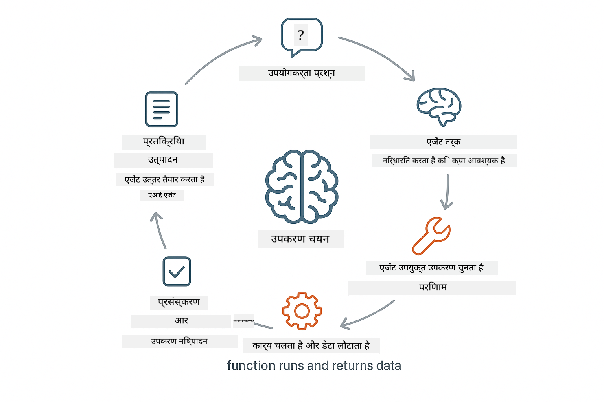

<!--
CO_OP_TRANSLATOR_METADATA:
{
  "original_hash": "844788938b26242f3cc54ce0d0951bea",
  "translation_date": "2026-01-05T22:29:25+00:00",
  "source_file": "04-tools/README.md",
  "language_code": "hi"
}
-->
# Module 04: टूल्स के साथ AI एजेंट्स

## विषय सूची

- [आप क्या सीखेंगे](../../../04-tools)
- [पूर्ववत आवश्यकताएँ](../../../04-tools)
- [टूल्स के साथ AI एजेंट्स को समझना](../../../04-tools)
- [टूल कॉलिंग कैसे काम करती है](../../../04-tools)
  - [टूल परिभाषाएँ](../../../04-tools)
  - [निर्णय लेना](../../../04-tools)
  - [कार्यान्वयन](../../../04-tools)
  - [प्रतिक्रिया उत्पादन](../../../04-tools)
- [टूल चेनिंग](../../../04-tools)
- [एप्लिकेशन चलाएँ](../../../04-tools)
- [एप्लिकेशन का उपयोग](../../../04-tools)
  - [सरल टूल उपयोग आज़माएँ](../../../04-tools)
  - [टूल चेनिंग का परीक्षण करें](../../../04-tools)
  - [संवाद प्रवाह देखें](../../../04-tools)
  - [विभिन्न अनुरोधों के साथ प्रयोग करें](../../../04-tools)
- [प्रमुख अवधारणाएँ](../../../04-tools)
  - [ReAct पैटर्न (तर्क और क्रिया)](../../../04-tools)
  - [टूल विवरण महत्वपूर्ण हैं](../../../04-tools)
  - [सेशन प्रबंधन](../../../04-tools)
  - [त्रुटि हैंडलिंग](../../../04-tools)
- [उपलब्ध टूल्स](../../../04-tools)
- [टूल-आधारित एजेंट्स कब उपयोग करें](../../../04-tools)
- [अगले कदम](../../../04-tools)

## आप क्या सीखेंगे

अब तक, आपने सीखा है कि AI के साथ संवाद कैसे करें, प्रभावी रूप से प्रॉम्प्ट संरचना करें, और अपने दस्तावेज़ों में प्रतिक्रियाओं को जमीन दें। लेकिन अभी भी एक मौलिक सीमा है: भाषा मॉडल केवल टेक्स्ट उत्पन्न कर सकते हैं। वे मौसम जांच नहीं सकते, गणना नहीं कर सकते, डेटाबेस क्वेरी नहीं कर सकते, या बाहरी सिस्टम के साथ इंटरैक्ट नहीं कर सकते।

टूल्स इसे बदल देते हैं। मॉडल को ऐसे फंक्शन का एक्सेस देकर जो वह कॉल कर सकता है, आप इसे एक टेक्स्ट जेनरेटर से एक एजेंट में बदल देते हैं जो क्रियाएँ ले सकता है। मॉडल निर्णय लेता है कि उसे कब टूल की ज़रूरत है, कौन सा टूल उपयोग करना है, और कौन से पैरामीटर पास करने हैं। आपका कोड फंक्शन निष्पादित करता है और परिणाम लौटाता है। मॉडल उस परिणाम को अपनी प्रतिक्रिया में शामिल करता है।

## पूर्ववत आवश्यकताएँ

- पूरा किया गया Module 01 (Azure OpenAI संसाधन तैनात)
- रूट डायरेक्टरी में `.env` फ़ाइल Azure क्रेडेंशियल्स के साथ (Module 01 में `azd up` द्वारा बनाई गई)

> **नोट:** यदि आपने Module 01 पूरा नहीं किया है, तो पहले वहां तैनाती निर्देशों का पालन करें।

## टूल्स के साथ AI एजेंट्स को समझना

> **📝 नोट:** इस मॉड्यूल में "एजेंट्स" का तात्पर्य AI सहायकों से है जिन्हें टूल कॉलिंग क्षमताओं के साथ बेहतर बनाया गया है। यह [Module 05: MCP](../05-mcp/README.md) में कवर किए जाने वाले **Agentic AI** पैटर्न से अलग है (स्वायत्त एजेंट्स जो योजना, मेमोरी, और मल्टी-स्टेप तर्क करते हैं)।

एक टूल्स वाले AI एजेंट ReAct (तर्क और क्रिया) पैटर्न का अनुसरण करता है:

1. उपयोगकर्ता एक प्रश्न पूछता है
2. एजेंट सोचता है कि उसे क्या जानना चाहिए
3. एजेंट निर्णय लेता है कि क्या उत्तर के लिए टूल चाहिए
4. अगर हाँ, तो एजेंट सही पैरामीटर के साथ उपयुक्त टूल को कॉल करता है
5. टूल निष्पादित होता है और डेटा लौटाता है
6. एजेंट उस परिणाम को शामिल करता है और अंतिम उत्तर प्रदान करता है



*ReAct पैटर्न - कैसे AI एजेंट समस्या हल करने के लिए तर्क और क्रिया के बीच वैकल्पिक होते हैं*

यह ऑटोमेटिक होता है। आप टूल्स और उनके विवरण परिभाषित करते हैं। मॉडल यह निर्णय लेता है कि उन्हें कब और कैसे उपयोग करना है।

## टूल कॉलिंग कैसे काम करती है

### टूल परिभाषाएँ

[WeatherTool.java](../../../04-tools/src/main/java/com/example/langchain4j/agents/tools/WeatherTool.java) | [TemperatureTool.java](../../../04-tools/src/main/java/com/example/langchain4j/agents/tools/TemperatureTool.java)

आप स्पष्ट विवरण और पैरामीटर विनिर्देशों के साथ फंक्शंस परिभाषित करते हैं। मॉडल इन विवरणों को अपने सिस्टम प्रॉम्प्ट में देखता है और समझता है कि प्रत्येक टूल क्या करता है।

```java
@Component
public class WeatherTool {
    
    @Tool("Get the current weather for a location")
    public String getCurrentWeather(@P("Location name") String location) {
        // आपका मौसम तलाश तर्क
        return "Weather in " + location + ": 22°C, cloudy";
    }
}

@AiService
public interface Assistant {
    String chat(@MemoryId String sessionId, @UserMessage String message);
}

// सहायक स्वचालित रूप से Spring Boot द्वारा जुड़ा हुआ है:
// - ChatModel बीम
// - @Component कक्षाओं से सभी @Tool विधियाँ
// - सत्र प्रबंधन के लिए ChatMemoryProvider
```

> **🤖 [GitHub Copilot](https://github.com/features/copilot) चैट के साथ प्रयास करें:** [`WeatherTool.java`](../../../04-tools/src/main/java/com/example/langchain4j/agents/tools/WeatherTool.java) खोलें और पूछें:
> - "मैं नकली डेटा के बजाय OpenWeatherMap जैसी असली मौसम API को कैसे एकीकृत कर सकता हूँ?"
> - "एक अच्छा टूल विवरण क्या होता है जो AI को इसे सही तरीके से उपयोग करने में मदद करता है?"
> - "टूल निर्माण में API त्रुटियों और दर सीमा को कैसे संभालूं?"

### निर्णय लेना

जब उपयोगकर्ता पूछता है "सीएटल में मौसम कैसा है?", मॉडल महसूस करता है कि उसे मौसम टूल की ज़रूरत है। यह "सीएटल" स्थान पैरामीटर के साथ एक फंक्शन कॉल जेनरेट करता है।

### कार्यान्वयन

[AgentService.java](../../../04-tools/src/main/java/com/example/langchain4j/agents/service/AgentService.java)

स्प्रिंग बूट डिक्लेरेटिव `@AiService` इंटरफेस को सभी पंजीकृत टूल्स के साथ ऑटो-वायर करता है, और LangChain4j टूल कॉल्स को स्वचालित रूप से निष्पादित करता है।

> **🤖 [GitHub Copilot](https://github.com/features/copilot) चैट के साथ प्रयास करें:** [`AgentService.java`](../../../04-tools/src/main/java/com/example/langchain4j/agents/service/AgentService.java) खोलें और पूछें:
> - "ReAct पैटर्न कैसे काम करता है और AI एजेंट्स के लिए यह प्रभावी क्यों है?"
> - "एजेंट तय करता है कि कौन सा टूल उपयोग करना है और किस क्रम में?"
> - "अगर टूल निष्पादन विफल हो जाए तो क्या होता है - त्रुटियों को मजबूती से कैसे संभालना चाहिए?"

### प्रतिक्रिया उत्पादन

मॉडल मौसम डेटा प्राप्त करता है और उसे प्राकृतिक भाषा में उपयोगकर्ता के लिए प्रतिक्रिया में स्वरूपित करता है।

### डिक्लेरेटिव AI सेवाओं का उपयोग क्यों करें?

यह मॉड्यूल LangChain4j के स्प्रिंग बूट एकीकरण का उपयोग करता है जो डिक्लेरेटिव `@AiService` इंटरफेस प्रदान करता है:

- **स्प्रिंग बूट ऑटो-वायरिंग** - ChatModel और टूल्स स्वचालित रूप से इंजेक्टेड
- **@MemoryId पैटर्न** - स्वचालित सेशन-आधारित मेमोरी प्रबंधन
- **एकल इंस्टेंस** - सहायक एक बार बनाया जाता है और बेहतर प्रदर्शन के लिए पुन: उपयोग किया जाता है
- **टाइप-सुरक्षित निष्पादन** - जावा मेथड्स को सीधे टाइप कन्वर्ज़न के साथ कॉल किया जाता है
- **मल्टी-टर्न ओरकेस्ट्रेशन** - टूल चेनिंग को स्वचालित रूप से संभालता है
- **जीरो बायलरप्लेट** - मैनुअल AiServices.builder() कॉल या मेमोरी हैशमैप की कोई आवश्यकता नहीं

वैकल्पिक तरीके (मैनुअल `AiServices.builder()`) अधिक कोड की मांग करते हैं और स्प्रिंग बूट एकीकरण लाभों से वंचित रहते हैं।

## टूल चेनिंग

**टूल चेनिंग** - AI कई टूल्स को क्रमबद्ध रूप से कॉल कर सकता है। पूछें "सीएटल में मौसम कैसा है और मुझे छाता लाना चाहिए?" और देखें कि यह `getCurrentWeather` के साथ बारिश के गियर के बारे में तर्क करता है।

<a href="images/tool-chaining.png"></a>

*क्रमिक टूल कॉल - एक टूल की आउटपुट अगली निर्णय में फीड हो रही है*

**शुभ्र विफलताएँ** - किसी ऐसे शहर का मौसम पूछें जो नकली डेटा में नहीं है। टूल एक त्रुटि संदेश लौटाता है, और AI समझाता है कि वह मदद नहीं कर सकता। टूल सुरक्षित रूप से विफल होते हैं।

यह एक ही बातचीत के टर्न में होता है। एजेंट स्वायत्त रूप से कई टूल कॉल्स का संचालन करता है।

## एप्लिकेशन चलाएँ

**तैनाती सत्यापित करें:**

सुनिश्चित करें कि `.env` फ़ाइल रूट डायरेक्टरी में Azure क्रेडेंशियल्स के साथ मौजूद है (Module 01 के दौरान बनाई गई):
```bash
cat ../.env  # AZURE_OPENAI_ENDPOINT, API_KEY, DEPLOYMENT दिखाना चाहिए
```

**एप्लिकेशन प्रारंभ करें:**

> **नोट:** यदि आपने पहले ही Module 01 से `./start-all.sh` का उपयोग करके सभी एप्लिकेशन शुरू कर दिए हैं, तो यह मॉड्यूल पहले से ही पोर्ट 8084 पर चल रहा है। आप नीचे दिए गए स्टार्ट कमांड छोड़ सकते हैं और सीधे http://localhost:8084 पर जा सकते हैं।

**विकल्प 1: स्प्रिंग बूट डैशबोर्ड का उपयोग (VS Code उपयोगकर्ताओं के लिए अनुशंसित)**

डेव कंटेनर में स्प्रिंग बूट डैशबोर्ड एक्सटेंशन शामिल है, जो सभी स्प्रिंग बूट एप्लिकेशन प्रबंधन के लिए एक विज़ुअल इंटरफ़ेस प्रदान करता है। आप इसे VS Code के बाईं ओर एक्टिविटी बार में स्प्रिंग बूट आइकन के रूप में पा सकते हैं।

स्प्रिंग बूट डैशबोर्ड से, आप:
- वर्कस्पेस में उपलब्ध सभी स्प्रिंग बूट एप्लिकेशन देख सकते हैं
- एक क्लिक से एप्लिकेशन शुरू/रोक सकते हैं
- एप्लिकेशन लॉग्स रियल-टाइम में देख सकते हैं
- एप्लिकेशन की स्थिति मॉनिटर कर सकते हैं

बस "tools" के बगल में प्ले बटन क्लिक करें इस मॉड्यूल को शुरू करने के लिए, या सभी मॉड्यूल एक साथ शुरू करें।


**विकल्प 2: शेल स्क्रिप्ट्स का उपयोग**

सभी वेब एप्लिकेशन शुरू करें (मॉड्यूल 01-04):

**बाश:**
```bash
cd ..  # रूट डायरेक्टरी से
./start-all.sh
```

**पावरशेल:**
```powershell
cd ..  # रूट डायरेक्टरी से
.\start-all.ps1
```

या केवल इस मॉड्यूल को शुरू करें:

**बाश:**
```bash
cd 04-tools
./start.sh
```

**पावरशेल:**
```powershell
cd 04-tools
.\start.ps1
```

दोनों स्क्रिप्ट्स स्वतः रूट `.env` फ़ाइल से पर्यावरण चर लोड करती हैं और यदि JAR मौजूद नहीं हैं तो इन्हें बनाएंगी।

> **नोट:** यदि आप प्रीबिल्ड की बजाय सभी मॉड्यूल मैन्युअली बनाना चाहते हैं:
>
> **बाश:**
> ```bash
> cd ..  # Go to root directory
> mvn clean package -DskipTests
> ```
>
> **पावरशेल:**
> ```powershell
> cd ..  # Go to root directory
> mvn clean package -DskipTests
> ```

अपने ब्राउज़र में http://localhost:8084 खोलें।

**रोकने के लिए:**

**बाश:**
```bash
./stop.sh  # यह मॉड्यूल केवल
# या
cd .. && ./stop-all.sh  # सभी मॉड्यूल्स
```

**पावरशेल:**
```powershell
.\stop.ps1  # यह मॉड्यूल केवल
# या
cd ..; .\stop-all.ps1  # सभी मॉड्यूल
```

## एप्लिकेशन का उपयोग

एप्लिकेशन एक वेब इंटरफ़ेस प्रदान करता है जहाँ आप एक AI एजेंट के साथ इंटरैक्ट कर सकते हैं जिसे मौसम और तापमान रूपांतरण टूल्स का एक्सेस है।

<a href="images/tools-homepage.png"></a>

*AI एजेंट टूल्स इंटरफ़ेस - टूल्स के साथ इंटरैक्शन के लिए त्वरित उदाहरण और चैट इंटरफ़ेस*

### सरल टूल उपयोग आज़माएँ

एक सरल अनुरोध से शुरू करें: "100 डिग्री फ़ारेनहाइट को सेल्सियस में बदलें"। एजेंट पहचानता है कि उसे तापमान रूपांतरण टूल की ज़रूरत है, सही पैरामीटर के साथ इसे कॉल करता है, और परिणाम लौटाता है। ध्यान दें कि यह कितना प्राकृतिक लगता है - आपने नहीं बताया कि कौन सा टूल उपयोग करना है या इसे कैसे कॉल करना है।

### टूल चेनिंग का परीक्षण करें

अब कुछ अधिक जटिल प्रयास करें: "सीएटल में मौसम कैसा है और इसे फ़ारेनहाइट में बदलें?" देखें कि एजेंट चरण-दर-चरण कैसे काम करता है। पहले मौसम प्राप्त करता है (जो सेल्सियस लौटाता है), पहचानता है कि इसे फ़ारेनहाइट में बदलना है, रूपांतरण टूल कॉल करता है, और दोनों परिणामों को एक प्रतिक्रिया में जोड़ देता है।

### संवाद प्रवाह देखें

चैट इंटरफ़ेस संवाद इतिहास बनाए रखता है, जिससे आप मल्टी-टर्न इंटरैक्शंस कर सकते हैं। आप सभी पिछले प्रश्न और प्रतिक्रियाएँ देख सकते हैं, जिससे संवाद ट्रैक करना और समझना आसान होता है कि एजेंट कैसे कई एक्सचेंज में संदर्भ बनाता है।

<a href="images/tools-conversation-demo.png"></a>

*मल्टी-टर्न बातचीत जिसमें सरल रूपांतरण, मौसम देखना, और टूल चेनिंग दिखा रहे हैं*

### विभिन्न अनुरोधों के साथ प्रयोग करें

विभिन्न संयोजन आज़माएँ:
- मौसम जांच: "टोक्यो में मौसम कैसा है?"
- तापमान रूपांतरण: "25°C केल्विन में क्या है?"
- संयुक्त प्रश्न: "पेरिस का मौसम जांचें और बताएं क्या यह 20°C से ऊपर है"

ध्यान दें कि एजेंट प्राकृतिक भाषा को कैसे समझता है और उचित टूल कॉल्स में मैप करता है।

## प्रमुख अवधारणाएँ

### ReAct पैटर्न (तर्क और क्रिया)

एजेंट तर्क करने (क्या करना है तय करना) और क्रिया करने (टूल्स का उपयोग करना) के बीच वैकल्पिक होता है। यह पैटर्न केवल निर्देशों के जवाब देने के बजाय स्वायत्त समस्या समाधान सक्षम करता है।

### टूल विवरण महत्वपूर्ण हैं

आपके टूल विवरण की गुणवत्ता सीधे प्रभावित करती है कि एजेंट उन्हें कितनी अच्छी तरह उपयोग करता है। स्पष्ट, विशिष्ट विवरण मॉडल को समझने में मदद करते हैं कि कब और कैसे प्रत्येक टूल कॉल करना है।

### सेशन प्रबंधन

`@MemoryId` एनोमेशन स्वचालित सेशन-आधारित मेमोरी प्रबंधन सक्षम करता है। प्रत्येक सेशन आईडी को `ChatMemoryProvider` बीन द्वारा प्रबंधित अपनी `ChatMemory` इंस्टेंस मिलती है, जिससे मैनुअल मेमोरी ट्रैकिंग की आवश्यकता समाप्त हो जाती है।

### त्रुटि हैंडलिंग

टूल्स विफल हो सकते हैं - API टाइमआउट हो सकते हैं, पैरामीटर अमान्य हो सकते हैं, बाहरी सेवाएं डाउन हो सकती हैं। प्रॉडक्शन एजेंट्स में त्रुटि हैंडलिंग की ज़रूरत होती है ताकि मॉडल समस्याओं को समझा सके या विकल्प आज़मा सके।

## उपलब्ध टूल्स

**मौसम टूल्स** (डेमो के लिए नकली डेटा):
- किसी स्थान के लिए वर्तमान मौसम प्राप्त करें
- बहु-दिन का पूर्वानुमान प्राप्त करें

**तापमान रूपांतरण टूल्स**:
- सेल्सियस से फ़ारेनहाइट
- फ़ारेनहाइट से सेल्सियस
- सेल्सियस से केल्विन
- केल्विन से सेल्सियस
- फ़ारेनहाइट से केल्विन
- केल्विन से फ़ारेनहाइट

ये सरल उदाहरण हैं, लेकिन पैटर्न किसी भी फंक्शन तक बढ़ाया जा सकता है: डेटाबेस क्वेरियाँ, API कॉल, गणना, फ़ाइल संचालन, या सिस्टम कमांड्स।

## टूल-आधारित एजेंट्स कब उपयोग करें

**टूल्स का उपयोग करें जब:**
- उत्तर के लिए वास्तविक समय डेटा चाहिए (मौसम, स्टॉक कीमतें, इन्वेंटरी)
- सरल गणना से आगे गणना करनी हो
- डेटाबेस या API तक पहुंचना हो
- क्रिया करनी हो (ईमेल भेजना, टिकट बनाना, रिकॉर्ड अपडेट करना)
- कई डेटा स्रोत संयोजित करने हों

**टूल्स का उपयोग न करें जब:**
- प्रश्न सामान्य ज्ञान से उत्तर दिए जा सकें
- प्रतिक्रिया केवल संवादात्मक हो
- टूल विलंब अनुभव को बहुत धीमा बना दे

## अगले कदम

**अगला मॉड्यूल:** [05-mcp - मॉडल कंटेक्स्ट प्रोटोकॉल (MCP)](../05-mcp/README.md)

---

**नेविगेशन:** [← पिछला: Module 03 - RAG](../03-rag/README.md) | [मुख्य पृष्ठ पर वापस](../README.md) | [अगला: Module 05 - MCP →](../05-mcp/README.md)

---

<!-- CO-OP TRANSLATOR DISCLAIMER START -->
**अस्वीकरण**:  
यह दस्तावेज़ AI अनुवाद सेवा [Co-op Translator](https://github.com/Azure/co-op-translator) का उपयोग करके अनुवादित किया गया है। यद्यपि हम सटीकता के लिए प्रयासरत हैं, कृपया ध्यान दें कि स्वचालित अनुवादों में त्रुटियाँ या अशुद्धियाँ हो सकती हैं। मूल दस्तावेज़ अपनी मूल भाषा में मान्य और आधिकारिक स्रोत माना जाना चाहिए। महत्वपूर्ण जानकारी के लिए, पेशेवर मानव अनुवाद की सिफारिश की जाती है। इस अनुवाद के उपयोग से उत्पन्न किसी भी गलतफहमी या गलत व्याख्या के लिए हम जिम्मेदार नहीं हैं।
<!-- CO-OP TRANSLATOR DISCLAIMER END -->