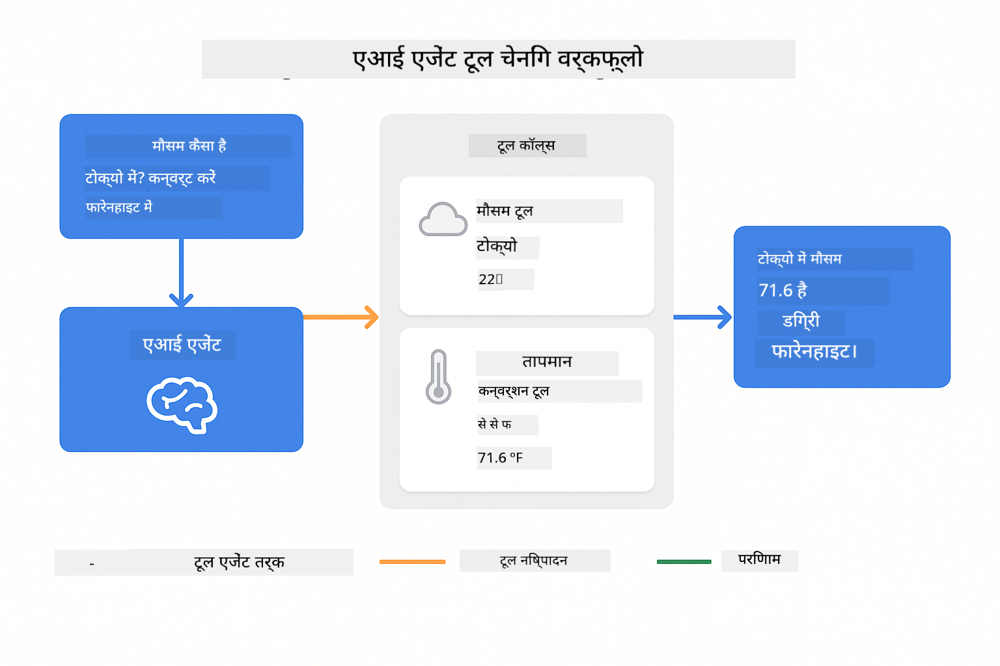
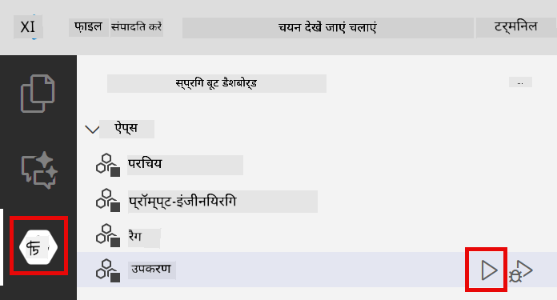
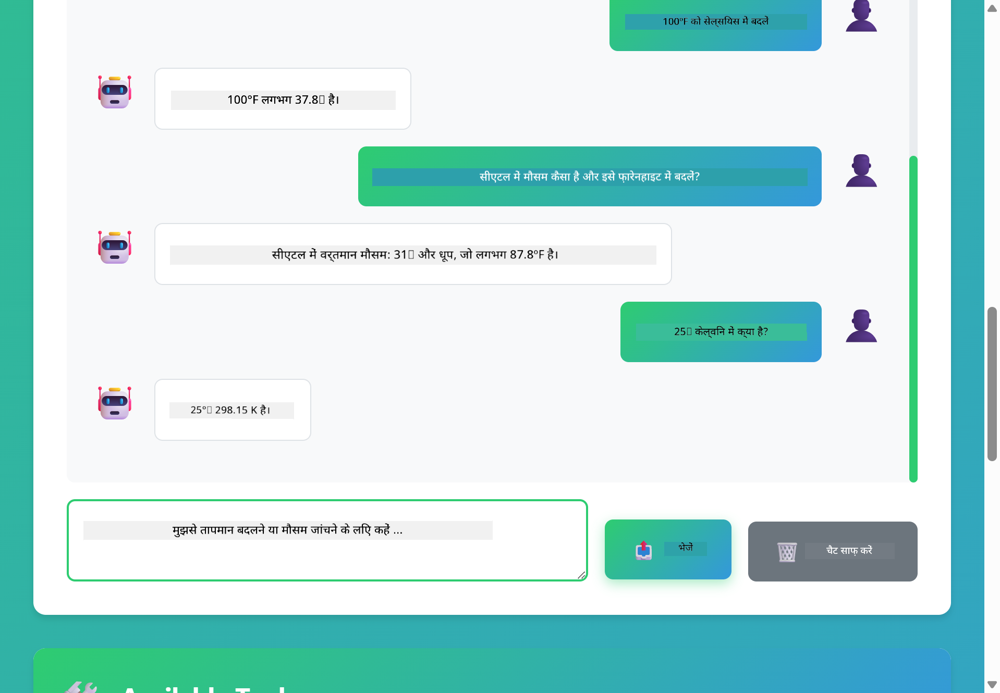

<!--
CO_OP_TRANSLATOR_METADATA:
{
  "original_hash": "aa23f106e7f53270924c9dd39c629004",
  "translation_date": "2025-12-13T18:38:18+00:00",
  "source_file": "04-tools/README.md",
  "language_code": "hi"
}
-->
# मॉड्यूल 04: टूल्स के साथ AI एजेंट्स

## सामग्री सूची

- [आप क्या सीखेंगे](../../../04-tools)
- [पूर्वापेक्षाएँ](../../../04-tools)
- [टूल्स के साथ AI एजेंट्स को समझना](../../../04-tools)
- [टूल कॉलिंग कैसे काम करता है](../../../04-tools)
  - [टूल परिभाषाएँ](../../../04-tools)
  - [निर्णय लेना](../../../04-tools)
  - [कार्यान्वयन](../../../04-tools)
  - [प्रतिक्रिया निर्माण](../../../04-tools)
- [टूल चेनिंग](../../../04-tools)
- [एप्लिकेशन चलाएँ](../../../04-tools)
- [एप्लिकेशन का उपयोग](../../../04-tools)
  - [सरल टूल उपयोग आज़माएँ](../../../04-tools)
  - [टूल चेनिंग का परीक्षण करें](../../../04-tools)
  - [संवाद प्रवाह देखें](../../../04-tools)
  - [तर्क का अवलोकन करें](../../../04-tools)
  - [विभिन्न अनुरोधों के साथ प्रयोग करें](../../../04-tools)
- [मुख्य अवधारणाएँ](../../../04-tools)
  - [ReAct पैटर्न (तर्क और क्रिया)](../../../04-tools)
  - [टूल विवरण महत्वपूर्ण हैं](../../../04-tools)
  - [सेशन प्रबंधन](../../../04-tools)
  - [त्रुटि प्रबंधन](../../../04-tools)
- [उपलब्ध टूल्स](../../../04-tools)
- [टूल-आधारित एजेंट्स कब उपयोग करें](../../../04-tools)
- [अगले कदम](../../../04-tools)

## आप क्या सीखेंगे

अब तक, आपने सीखा है कि AI के साथ बातचीत कैसे करें, प्रभावी रूप से प्रॉम्प्ट कैसे बनाएं, और अपनी दस्तावेज़ों में प्रतिक्रियाओं को आधारित करें। लेकिन एक मौलिक सीमा अभी भी है: भाषा मॉडल केवल टेक्स्ट उत्पन्न कर सकते हैं। वे मौसम की जांच नहीं कर सकते, गणना नहीं कर सकते, डेटाबेस क्वेरी नहीं कर सकते, या बाहरी सिस्टम के साथ इंटरैक्ट नहीं कर सकते।

टूल्स इसे बदल देते हैं। मॉडल को उन फंक्शंस तक पहुंच देकर जिन्हें वह कॉल कर सकता है, आप इसे एक टेक्स्ट जनरेटर से एक एजेंट में बदल देते हैं जो क्रियाएँ कर सकता है। मॉडल तय करता है कि उसे कब टूल की जरूरत है, कौन सा टूल उपयोग करना है, और कौन से पैरामीटर पास करने हैं। आपका कोड फंक्शन को निष्पादित करता है और परिणाम लौटाता है। मॉडल उस परिणाम को अपनी प्रतिक्रिया में शामिल करता है।

## पूर्वापेक्षाएँ

- मॉड्यूल 01 पूरा किया हुआ (Azure OpenAI संसाधन तैनात)
- रूट डायरेक्टरी में `.env` फ़ाइल जिसमें Azure क्रेडेंशियल्स हों (मॉड्यूल 01 में `azd up` द्वारा बनाई गई)

> **नोट:** यदि आपने मॉड्यूल 01 पूरा नहीं किया है, तो पहले वहां तैनाती निर्देशों का पालन करें।

## टूल्स के साथ AI एजेंट्स को समझना

टूल्स के साथ AI एजेंट एक तर्क और क्रिया पैटर्न (ReAct) का पालन करता है:

1. उपयोगकर्ता प्रश्न पूछता है
2. एजेंट सोचता है कि उसे क्या जानना चाहिए
3. एजेंट तय करता है कि उत्तर देने के लिए उसे टूल की जरूरत है या नहीं
4. यदि हाँ, तो एजेंट सही पैरामीटर के साथ उपयुक्त टूल को कॉल करता है
5. टूल निष्पादित होता है और डेटा लौटाता है
6. एजेंट परिणाम को शामिल करता है और अंतिम उत्तर प्रदान करता है


*ReAct पैटर्न - कैसे AI एजेंट समस्याओं को हल करने के लिए तर्क और क्रिया के बीच वैकल्पिक होते हैं*

यह स्वचालित रूप से होता है। आप टूल्स और उनके विवरण परिभाषित करते हैं। मॉडल यह निर्णय लेता है कि उन्हें कब और कैसे उपयोग करना है।

## टूल कॉलिंग कैसे काम करता है

**टूल परिभाषाएँ** - [WeatherTool.java](../../../04-tools/src/main/java/com/example/langchain4j/agents/tools/WeatherTool.java) | [TemperatureTool.java](../../../04-tools/src/main/java/com/example/langchain4j/agents/tools/TemperatureTool.java)

आप स्पष्ट विवरण और पैरामीटर विनिर्देशों के साथ फंक्शंस परिभाषित करते हैं। मॉडल इन विवरणों को अपने सिस्टम प्रॉम्प्ट में देखता है और समझता है कि प्रत्येक टूल क्या करता है।

```java
@Component
public class WeatherTool {
    
    @Tool("Get the current weather for a location")
    public String getCurrentWeather(@P("Location name") String location) {
        // आपका मौसम खोज तर्क
        return "Weather in " + location + ": 22°C, cloudy";
    }
}

@AiService
public interface Assistant {
    String chat(@MemoryId String sessionId, @UserMessage String message);
}

// सहायक स्वचालित रूप से Spring Boot द्वारा वायर्ड है:
// - ChatModel बीन
// - @Component क्लासेस से सभी @Tool मेथड्स
// - सत्र प्रबंधन के लिए ChatMemoryProvider
```

> **🤖 [GitHub Copilot](https://github.com/features/copilot) चैट के साथ आज़माएँ:** [`WeatherTool.java`](../../../04-tools/src/main/java/com/example/langchain4j/agents/tools/WeatherTool.java) खोलें और पूछें:
> - "मैं नकली डेटा के बजाय OpenWeatherMap जैसे वास्तविक मौसम API को कैसे एकीकृत करूँ?"
> - "एक अच्छा टूल विवरण क्या होता है जो AI को इसे सही तरीके से उपयोग करने में मदद करता है?"
> - "टूल कार्यान्वयन में API त्रुटियों और दर सीमाओं को कैसे संभालूं?"

**निर्णय लेना**

जब उपयोगकर्ता पूछता है "सीएटल में मौसम कैसा है?", मॉडल पहचानता है कि उसे मौसम टूल की जरूरत है। यह स्थान पैरामीटर "Seattle" के साथ एक फंक्शन कॉल उत्पन्न करता है।

**कार्यान्वयन** - [AgentService.java](../../../04-tools/src/main/java/com/example/langchain4j/agents/service/AgentService.java)

स्प्रिंग बूट डिक्लेरेटिव `@AiService` इंटरफेस को सभी पंजीकृत टूल्स के साथ ऑटो-वायर करता है, और LangChain4j टूल कॉल्स को स्वचालित रूप से निष्पादित करता है।

> **🤖 [GitHub Copilot](https://github.com/features/copilot) चैट के साथ आज़माएँ:** [`AgentService.java`](../../../04-tools/src/main/java/com/example/langchain4j/agents/service/AgentService.java) खोलें और पूछें:
> - "ReAct पैटर्न कैसे काम करता है और AI एजेंट्स के लिए यह क्यों प्रभावी है?"
> - "एजेंट कैसे तय करता है कि कौन सा टूल उपयोग करना है और किस क्रम में?"
> - "यदि टूल निष्पादन विफल हो जाता है तो क्या होता है - त्रुटियों को मजबूती से कैसे संभालना चाहिए?"

**प्रतिक्रिया निर्माण**

मॉडल मौसम डेटा प्राप्त करता है और उसे उपयोगकर्ता के लिए प्राकृतिक भाषा प्रतिक्रिया में स्वरूपित करता है।

### डिक्लेरेटिव AI सेवाओं का उपयोग क्यों करें?

यह मॉड्यूल LangChain4j के स्प्रिंग बूट इंटीग्रेशन का उपयोग करता है जिसमें डिक्लेरेटिव `@AiService` इंटरफेस होते हैं:

- **स्प्रिंग बूट ऑटो-वायरिंग** - ChatModel और टूल्स स्वचालित रूप से इंजेक्ट होते हैं
- **@MemoryId पैटर्न** - स्वचालित सेशन-आधारित मेमोरी प्रबंधन
- **सिंगल इंस्टेंस** - असिस्टेंट एक बार बनाया जाता है और बेहतर प्रदर्शन के लिए पुन: उपयोग किया जाता है
- **टाइप-सेफ निष्पादन** - जावा मेथड्स सीधे टाइप कन्वर्ज़न के साथ कॉल होते हैं
- **मल्टी-टर्न ऑर्केस्ट्रेशन** - टूल चेनिंग को स्वचालित रूप से संभालता है
- **जीरो बॉयलरप्लेट** - कोई मैनुअल AiServices.builder() कॉल या मेमोरी हैशमैप नहीं

वैकल्पिक दृष्टिकोण (मैनुअल `AiServices.builder()`) में अधिक कोड की आवश्यकता होती है और स्प्रिंग बूट इंटीग्रेशन के लाभ नहीं मिलते।

## टूल चेनिंग

**टूल चेनिंग** - AI कई टूल्स को क्रम में कॉल कर सकता है। पूछें "सीएटल में मौसम कैसा है और क्या मुझे छाता लाना चाहिए?" और देखें कि यह `getCurrentWeather` को बारिश के गियर के बारे में तर्क के साथ कैसे जोड़ता है।

<a href="images/tool-chaining.png"></a>

*क्रमिक टूल कॉल्स - एक टूल का आउटपुट अगले निर्णय में फीड होता है*

**सौम्य विफलताएँ** - किसी ऐसे शहर में मौसम पूछें जो नकली डेटा में नहीं है। टूल एक त्रुटि संदेश लौटाता है, और AI बताता है कि वह मदद नहीं कर सकता। टूल सुरक्षित रूप से विफल होते हैं।

यह एक ही संवाद टर्न में होता है। एजेंट स्वायत्त रूप से कई टूल कॉल्स का संचालन करता है।

## एप्लिकेशन चलाएँ

**तैनाती सत्यापित करें:**

सुनिश्चित करें कि रूट डायरेक्टरी में `.env` फ़ाइल मौजूद है जिसमें Azure क्रेडेंशियल्स हों (मॉड्यूल 01 के दौरान बनाई गई):
```bash
cat ../.env  # AZURE_OPENAI_ENDPOINT, API_KEY, DEPLOYMENT दिखाना चाहिए
```

**एप्लिकेशन शुरू करें:**

> **नोट:** यदि आपने पहले ही मॉड्यूल 01 से `./start-all.sh` का उपयोग करके सभी एप्लिकेशन शुरू कर दिए हैं, तो यह मॉड्यूल पहले से ही पोर्ट 8084 पर चल रहा है। आप नीचे दिए गए स्टार्ट कमांड्स छोड़ सकते हैं और सीधे http://localhost:8084 पर जा सकते हैं।

**विकल्प 1: स्प्रिंग बूट डैशबोर्ड का उपयोग (VS कोड उपयोगकर्ताओं के लिए अनुशंसित)**

डेव कंटेनर में स्प्रिंग बूट डैशबोर्ड एक्सटेंशन शामिल है, जो सभी स्प्रिंग बूट एप्लिकेशन को प्रबंधित करने के लिए एक दृश्य इंटरफ़ेस प्रदान करता है। आप इसे VS कोड के बाएं साइड में एक्टिविटी बार में स्प्रिंग बूट आइकन के रूप में देख सकते हैं।

स्प्रिंग बूट डैशबोर्ड से, आप:
- कार्यक्षेत्र में सभी उपलब्ध स्प्रिंग बूट एप्लिकेशन देख सकते हैं
- एक क्लिक में एप्लिकेशन शुरू/रोक सकते हैं
- एप्लिकेशन लॉग्स को रियल-टाइम में देख सकते हैं
- एप्लिकेशन की स्थिति मॉनिटर कर सकते हैं

सिर्फ "tools" के बगल में प्ले बटन पर क्लिक करें इस मॉड्यूल को शुरू करने के लिए, या सभी मॉड्यूल एक साथ शुरू करें।



**विकल्प 2: शेल स्क्रिप्ट्स का उपयोग**

सभी वेब एप्लिकेशन (मॉड्यूल 01-04) शुरू करें:

**Bash:**
```bash
cd ..  # रूट निर्देशिका से
./start-all.sh
```

**PowerShell:**
```powershell
cd ..  # रूट निर्देशिका से
.\start-all.ps1
```

या केवल इस मॉड्यूल को शुरू करें:

**Bash:**
```bash
cd 04-tools
./start.sh
```

**PowerShell:**
```powershell
cd 04-tools
.\start.ps1
```

दोनों स्क्रिप्ट्स स्वचालित रूप से रूट `.env` फ़ाइल से पर्यावरण चर लोड करती हैं और यदि JAR मौजूद नहीं हैं तो उन्हें बनाएंगी।

> **नोट:** यदि आप शुरू करने से पहले सभी मॉड्यूल मैन्युअली बनाना पसंद करते हैं:
>
> **Bash:**
> ```bash
> cd ..  # Go to root directory
> mvn clean package -DskipTests
> ```
>
> **PowerShell:**
> ```powershell
> cd ..  # Go to root directory
> mvn clean package -DskipTests
> ```

अपने ब्राउज़र में http://localhost:8084 खोलें।

**रोकने के लिए:**

**Bash:**
```bash
./stop.sh  # केवल यह मॉड्यूल
# या
cd .. && ./stop-all.sh  # सभी मॉड्यूल
```

**PowerShell:**
```powershell
.\stop.ps1  # केवल यह मॉड्यूल
# या
cd ..; .\stop-all.ps1  # सभी मॉड्यूल
```

## एप्लिकेशन का उपयोग

एप्लिकेशन एक वेब इंटरफ़ेस प्रदान करता है जहाँ आप एक AI एजेंट के साथ इंटरैक्ट कर सकते हैं जिसे मौसम और तापमान रूपांतरण टूल्स तक पहुंच है।

<a href="images/tools-homepage.png"></a>

*AI एजेंट टूल्स इंटरफ़ेस - टूल्स के साथ इंटरैक्ट करने के लिए त्वरित उदाहरण और चैट इंटरफ़ेस*

**सरल टूल उपयोग आज़माएँ**

एक सरल अनुरोध से शुरू करें: "100 डिग्री फ़ारेनहाइट को सेल्सियस में बदलें"। एजेंट पहचानता है कि उसे तापमान रूपांतरण टूल की जरूरत है, इसे सही पैरामीटर के साथ कॉल करता है, और परिणाम लौटाता है। ध्यान दें कि यह कितना स्वाभाविक लगता है - आपने यह निर्दिष्ट नहीं किया कि कौन सा टूल उपयोग करना है या इसे कैसे कॉल करना है।

**टूल चेनिंग का परीक्षण करें**

अब कुछ अधिक जटिल आज़माएँ: "सीएटल में मौसम कैसा है और इसे फ़ारेनहाइट में बदलें?" देखें कि एजेंट इसे चरणों में कैसे करता है। पहले यह मौसम प्राप्त करता है (जो सेल्सियस लौटाता है), फिर पहचानता है कि इसे फ़ारेनहाइट में बदलना है, रूपांतरण टूल को कॉल करता है, और दोनों परिणामों को एक प्रतिक्रिया में जोड़ता है।

**संवाद प्रवाह देखें**

चैट इंटरफ़ेस संवाद इतिहास बनाए रखता है, जिससे आप मल्टी-टर्न इंटरैक्शन कर सकते हैं। आप सभी पिछले प्रश्न और प्रतिक्रियाएँ देख सकते हैं, जिससे संवाद को ट्रैक करना और समझना आसान होता है कि एजेंट कैसे कई एक्सचेंज के दौरान संदर्भ बनाता है।

<a href="images/tools-conversation-demo.png"></a>

*मल्टी-टर्न संवाद जिसमें सरल रूपांतरण, मौसम खोज, और टूल चेनिंग दिखाया गया है*

**विभिन्न अनुरोधों के साथ प्रयोग करें**

विभिन्न संयोजन आज़माएँ:
- मौसम खोज: "टोक्यो में मौसम कैसा है?"
- तापमान रूपांतरण: "25°C केल्विन में कितना है?"
- संयुक्त प्रश्न: "पेरिस में मौसम जांचें और बताएं क्या यह 20°C से ऊपर है"

ध्यान दें कि एजेंट प्राकृतिक भाषा को कैसे समझता है और इसे उपयुक्त टूल कॉल्स में मैप करता है।

## मुख्य अवधारणाएँ

**ReAct पैटर्न (तर्क और क्रिया)**

एजेंट तर्क (क्या करना है तय करना) और क्रिया (टूल्स का उपयोग करना) के बीच वैकल्पिक होता है। यह पैटर्न स्वायत्त समस्या-समाधान सक्षम करता है न कि केवल निर्देशों का जवाब देना।

**टूल विवरण महत्वपूर्ण हैं**

आपके टूल विवरण की गुणवत्ता सीधे प्रभावित करती है कि एजेंट उन्हें कितना अच्छी तरह उपयोग करता है। स्पष्ट, विशिष्ट विवरण मॉडल को समझने में मदद करते हैं कि कब और कैसे प्रत्येक टूल को कॉल करना है।

**सेशन प्रबंधन**

`@MemoryId` एनोटेशन स्वचालित सेशन-आधारित मेमोरी प्रबंधन सक्षम करता है। प्रत्येक सेशन ID को `ChatMemory` का अपना इंस्टेंस मिलता है जिसे `ChatMemoryProvider` बीन्स द्वारा प्रबंधित किया जाता है, जिससे मैनुअल मेमोरी ट्रैकिंग की आवश्यकता समाप्त हो जाती है।

**त्रुटि प्रबंधन**

टूल विफल हो सकते हैं - API टाइमआउट हो सकते हैं, पैरामीटर अमान्य हो सकते हैं, बाहरी सेवाएं डाउन हो सकती हैं। प्रोडक्शन एजेंट्स को त्रुटि प्रबंधन की जरूरत होती है ताकि मॉडल समस्याओं को समझा सके या विकल्प आज़मा सके।

## उपलब्ध टूल्स

**मौसम टूल्स** (प्रदर्शन के लिए नकली डेटा):
- किसी स्थान के लिए वर्तमान मौसम प्राप्त करें
- बहु-दिवसीय पूर्वानुमान प्राप्त करें

**तापमान रूपांतरण टूल्स**:
- सेल्सियस से फ़ारेनहाइट
- फ़ारेनहाइट से सेल्सियस
- सेल्सियस से केल्विन
- केल्विन से सेल्सियस
- फ़ारेनहाइट से केल्विन
- केल्विन से फ़ारेनहाइट

ये सरल उदाहरण हैं, लेकिन पैटर्न किसी भी फंक्शन तक विस्तारित होता है: डेटाबेस क्वेरी, API कॉल्स, गणनाएँ, फ़ाइल संचालन, या सिस्टम कमांड्स।

## टूल-आधारित एजेंट्स कब उपयोग करें

**टूल्स का उपयोग करें जब:**
- उत्तर के लिए वास्तविक समय डेटा की जरूरत हो (मौसम, स्टॉक कीमतें, इन्वेंटरी)
- सरल गणित से परे गणनाएँ करनी हों
- डेटाबेस या API तक पहुंच हो
- क्रियाएँ करनी हों (ईमेल भेजना, टिकट बनाना, रिकॉर्ड अपडेट करना)
- कई डेटा स्रोतों को संयोजित करना हो

**टूल्स का उपयोग न करें जब:**
- प्रश्न सामान्य ज्ञान से उत्तर दिए जा सकते हों
- प्रतिक्रिया केवल संवादात्मक हो
- टूल विलंब अनुभव को बहुत धीमा कर दे

## अगले कदम

**अगला मॉड्यूल:** [05-mcp - मॉडल संदर्भ प्रोटोकॉल (MCP)](../05-mcp/README.md)

---

**नेविगेशन:** [← पिछला: मॉड्यूल 03 - RAG](../03-rag/README.md) | [मुख्य पृष्ठ पर वापस](../README.md) | [अगला: मॉड्यूल 05 - MCP →](../05-mcp/README.md)

---

<!-- CO-OP TRANSLATOR DISCLAIMER START -->
**अस्वीकरण**:  
यह दस्तावेज़ AI अनुवाद सेवा [Co-op Translator](https://github.com/Azure/co-op-translator) का उपयोग करके अनुवादित किया गया है। जबकि हम सटीकता के लिए प्रयासरत हैं, कृपया ध्यान दें कि स्वचालित अनुवादों में त्रुटियाँ या अशुद्धियाँ हो सकती हैं। मूल दस्तावेज़ अपनी मूल भाषा में ही प्रामाणिक स्रोत माना जाना चाहिए। महत्वपूर्ण जानकारी के लिए, पेशेवर मानव अनुवाद की सलाह दी जाती है। इस अनुवाद के उपयोग से उत्पन्न किसी भी गलतफहमी या गलत व्याख्या के लिए हम जिम्मेदार नहीं हैं।
<!-- CO-OP TRANSLATOR DISCLAIMER END -->