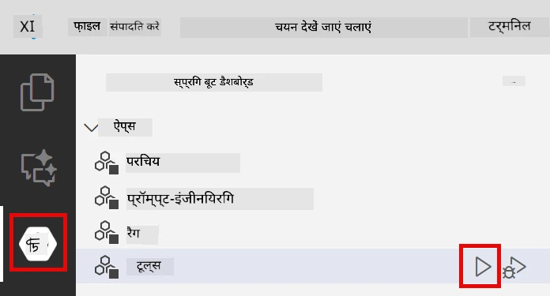
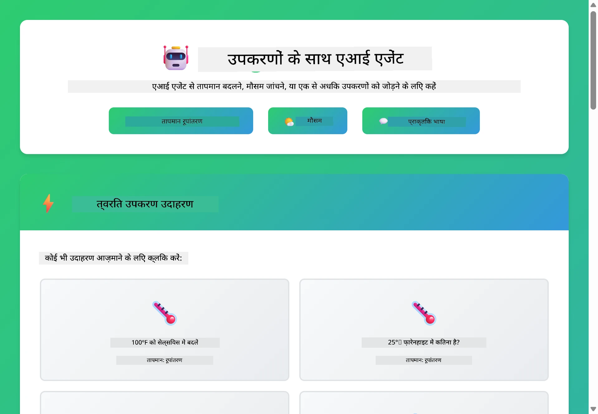
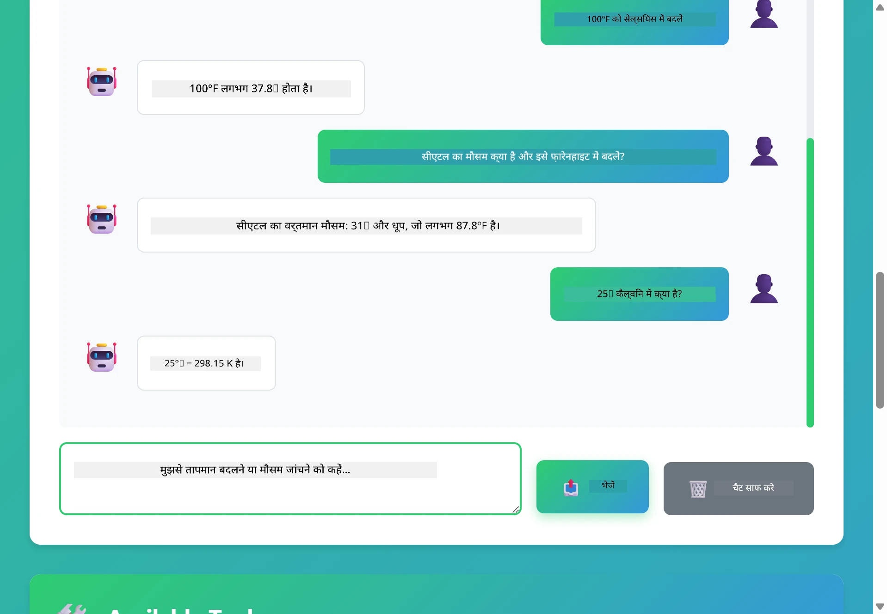

# Module 04: उपकरणों के साथ एआई एजेंट

## विषय सूची

- [वीडियो वॉकथ्रू](#वीडियो-वॉकथ्रू)
- [आप क्या सीखेंगे](#आप-क्या-सीखेंगे)
- [पूर्व आवश्यकताएँ](#पूर्व-आवश्यकताएँ)
- [उपकरणों के साथ एआई एजेंट को समझना](#उपकरणों-के-साथ-एआई-एजेंट-को-समझना)
- [उपकरण कॉलिंग कैसे काम करती है](#उपकरण-कॉलिंग-कैसे-काम-करती-है)
  - [उपकरण परिभाषाएँ](#उपकरण-परिभाषाएँ)
  - [निर्णय लेना](#निर्णय-लेना)
  - [कार्यान्वयन](#कार्यान्वयन)
  - [प्रतिक्रिया उत्पादन](#प्रतिक्रिया-उत्पादन)
  - [आर्किटेक्चर: स्प्रिंग बूट ऑटो-वायरिंग](#आर्किटेक्चर-स्प्रिंग-बूट-ऑटो-वायरिंग)
- [उपकरण श्रृंखला](#उपकरण-श्रृंखला)
- [एप्लिकेशन चलाएँ](#एप्लिकेशन-चलाएँ)
- [एप्लिकेशन का उपयोग करना](#एप्लिकेशन-का-उपयोग-करना)
  - [सरल उपकरण उपयोग प्रयास करें](#सरल-टूल-उपयोग-आज़माएं)
  - [उपकरण श्रृंखला का परीक्षण करें](#टूल-चेनिंग-का-परीक्षण-करें)
  - [संवाद प्रवाह देखें](#बातचीत-के-प्रवाह-को-देखें)
  - [विभिन्न अनुरोधों के साथ प्रयोग करें](#विभिन्न-अनुरोधों-के-साथ-प्रयोग-करें)
- [मुख्य अवधारणाएँ](#मुख्य-अवधारणाएँ)
  - [ReAct पैटर्न (तर्क और क्रिया)](#react-पैटर्न-तर्क-और-क्रिया)
  - [उपकरण विवरण महत्वपूर्ण हैं](#टूल-विवरण-महत्वपूर्ण-हैं)
  - [सत्र प्रबंधन](#सत्र-प्रबंधन)
  - [त्रुटि प्रबंधन](#त्रुटि-प्रबंधन)
- [उपलब्ध उपकरण](#उपलब्ध-टूल्स)
- [कब उपकरण-आधारित एजेंट का उपयोग करें](#कब-टूल-आधारित-एजेंट-का-उपयोग-करें)
- [उपकरण बनाम RAG](#टूल्स-बनाम-rag)
- [अगले चरण](#आगे-के-कदम)

## वीडियो वॉकथ्रू

इस लाइव सत्र को देखें जो बताता है कि इस मॉड्यूल की शुरुआत कैसे करें:

<a href="https://www.youtube.com/watch?v=O_J30kZc0rw"></a>

## आप क्या सीखेंगे

अब तक, आपने सीखा है कि AI के साथ बातचीत कैसे करनी है, प्रभावी रूप से प्रॉम्प्ट कैसे बनाना है, और अपने दस्तावेज़ों में प्रतिक्रियाओं का आधार कैसे रखना है। लेकिन एक मूलभूत सीमा अभी भी है: भाषा मॉडल केवल टेक्स्ट जनरेट कर सकते हैं। वे मौसम जांच नहीं सकते, गणना नहीं कर सकते, डेटाबेस क्वेरी नहीं कर सकते, या बाहरी सिस्टम से इंटरैक्ट नहीं कर सकते।

उपकरण इस बात को बदल देते हैं। मॉडल को उन फंक्शंस तक पहुँच देकर जिन्हें वह कॉल कर सकता है, आप इसे एक टेक्स्ट जनरेटर से ऐसे एजेंट में बदल देते हैं जो कार्रवाई कर सकता है। मॉडल तय करता है कि इसे कब उपकरण चाहिए, किस उपकरण का उपयोग करना है, और कौन से पैरामीटर पास करने हैं। आपका कोड फंक्शन को निष्पादित करता है और परिणाम लौटाता है। मॉडल उस परिणाम को अपनी प्रतिक्रिया में सम्मिलित करता है।

## पूर्व आवश्यकताएँ

- पूरा किया हुआ [Module 01 - परिचय](../01-introduction/README.md) (Azure OpenAI संसाधन तैनात किए गए)
- पिछले मॉड्यूल्स को पूरा करना अनुशंसित (यह मॉड्यूल टूल्स बनाम RAG तुलना में [मॉड्यूल 03 के RAG अवधारणाओं](../03-rag/README.md) का संदर्भ देता है)
- रूट डायरेक्टरी में `.env` फ़ाइल Azure क्रेडेंशियल के साथ (Module 01 में `azd up` द्वारा बनाई गई)

> **नोट:** यदि आपने Module 01 पूरा नहीं किया है, तो पहले वहाँ तैनाती निर्देशों का पालन करें।

## उपकरणों के साथ एआई एजेंट को समझना

> **📝 नोट:** इस मॉड्यूल में "एजेंट" शब्द उन एआई सहायक को संदर्भित करता है जो उपकरण कॉलिंग क्षमताओं के साथ बढ़ाए गए हैं। यह अलग है उन **Agentic AI** पैटर्न से (स्वायत्त एजेंट जिनके पास योजना, मेमोरी, और बहु-चरण तर्क होते हैं) जिन्हें हम [Module 05: MCP](../05-mcp/README.md) में कवर करेंगे।

बिना उपकरणों के, भाषा मॉडल केवल अपने प्रशिक्षण डेटा से टेक्स्ट जेनरेट कर सकता है। वर्तमान मौसम पूछिए, तो उसे अनुमान लगाना होता है। उपकरण दें, और वह मौसम API कॉल कर सकता है, गणना कर सकता है, या डेटाबेस क्वेरी कर सकता है — फिर उन असली परिणामों को अपनी प्रतिक्रिया में बुन सकता है।


*बिना उपकरणों मॉडल केवल अनुमान लगाता है — उपकरणों के साथ यह APIs कॉल कर सकता है, गणना चला सकता है, और वास्तविक समय डेटा वापस कर सकता है।*

उपकरणों के साथ एक AI एजेंट एक **Reasoning and Acting (ReAct)** पैटर्न का पालन करता है। मॉडल केवल प्रतिक्रिया नहीं देता — यह सोचता है कि उसे क्या चाहिए, एक उपकरण को कॉल करके कार्य करता है, परिणाम देखता है, और फिर तय करता है कि फिर से कार्य करना है या अंतिम उत्तर देना है:

1. **तर्क करना** — एजेंट उपयोगकर्ता के प्रश्न का विश्लेषण करता है और यह निर्धारित करता है कि उसे क्या जानकारी चाहिए
2. **कार्य करना** — एजेंट सही उपकरण चुनता है, सही पैरामीटर बनाता है, और उसे कॉल करता है
3. **पर्यवेक्षण करना** — एजेंट उपकरण की आउटपुट प्राप्त करता है और परिणाम का मूल्यांकन करता है
4. **दोहराना या उत्तर देना** — यदि और डेटा चाहिए, तो एजेंट लूप करता है; अन्यथा, संवादात्मक भाषा में उत्तर तैयार करता है


*ReAct चक्र — एजेंट सोचता है कि क्या करना है, उपकरण कॉल करके कार्य करता है, परिणाम देखता है, और तब तक लूप करता है जब तक अंतिम उत्तर नहीं दे सकता।*

यह स्वचालित होता है। आप उपकरण और उनके विवरण परिभाषित करते हैं। मॉडल निर्णय लेता है कि इन्हें कब और कैसे उपयोग करना है।

## उपकरण कॉलिंग कैसे काम करती है

### उपकरण परिभाषाएँ

[WeatherTool.java](../../../04-tools/src/main/java/com/example/langchain4j/agents/tools/WeatherTool.java) | [TemperatureTool.java](../../../04-tools/src/main/java/com/example/langchain4j/agents/tools/TemperatureTool.java)

आप स्पष्ट विवरण और पैरामीटर विनिर्देशों के साथ פונ्क्शंस परिभाषित करते हैं। मॉडल अपने सिस्टम प्रॉम्प्ट में इन विवरणों को देखता है और समझता है कि प्रत्येक उपकरण क्या करता है।

```java
@Component
public class WeatherTool {
    
    @Tool("Get the current weather for a location")
    public String getCurrentWeather(@P("Location name") String location) {
        // आपका मौसम खोज तर्क
        return "Weather in " + location + ": 22°C, cloudy";
    }
}

@AiService
public interface Assistant {
    String chat(@MemoryId String sessionId, @UserMessage String message);
}

// सहायक स्वचालित रूप से स्प्रिंग बूट द्वारा वायर किया गया है:
// - चैटमॉडल बीन
// - @Component कक्षाओं से सभी @Tool मेथड
// - सत्र प्रबंधन के लिए ChatMemoryProvider
```

नीचे वाला आरेख प्रत्येक एनोटेशन को तोड़ता है और दिखाता है कि कैसे हर हिस्सा AI को यह समझने में मदद करता है कि कब उपकरण कॉल करना है और कौन से तर्क पास करना हैं:


*उपकरण परिभाषा की संरचना — @Tool AI को बताता है कि इसे कब उपयोग करना है, @P प्रत्येक पैरामीटर का वर्णन करता है, और @AiService शुरूआत में सब कुछ वायर करता है।*

> **🤖 [GitHub Copilot](https://github.com/features/copilot) Chat के साथ प्रयास करें:** [`WeatherTool.java`](../../../04-tools/src/main/java/com/example/langchain4j/agents/tools/WeatherTool.java) खोलें और पूछें:
> - "मैं नकली डेटा की बजाय OpenWeatherMap जैसा वास्तविक मौसम API कैसे इंटीग्रेट करूं?"
> - "एक अच्छा उपकरण विवरण क्या है जो AI को इसे सही उपयोग करने में मदद करता है?"
> - "API त्रुटियां और रेट लिमिट्स को उपकरण कार्यान्वयन में कैसे हैंडल करें?"

### निर्णय लेना

जब कोई उपयोगकर्ता पूछता है "Seattle में मौसम कैसा है?", तो मॉडल कोई उपकरण यादृच्छिक रूप से नहीं चुनता। यह उपयोगकर्ता के इरादे की तुलना अपने हर उपकरण विवरण से करता है, प्रासंगिकता के लिए स्कोर करता है, और सबसे उपयुक्त चयन करता है। फिर यह सही पैरामीटर के साथ संरचित फंक्शन कॉल बनाता है — इस मामले में, `location` को `"Seattle"` सेट करना।

अगर कोई उपकरण उपयोगकर्ता के अनुरोध से मेल नहीं खाता, तो मॉडल अपने ज्ञान से उत्तर देता है। यदि कई उपकरण मेल खाते हैं, तो यह सबसे विशिष्ट चुनता है।


*मॉडल हर उपलब्ध उपकरण का उपयोगकर्ता के इरादे से मूल्यांकन करता है और सबसे उपयुक्त चुनता है — इसलिए स्पष्ट, विशिष्ट उपकरण विवरण लिखना महत्वपूर्ण है।*

### कार्यान्वयन

[AgentService.java](../../../04-tools/src/main/java/com/example/langchain4j/agents/service/AgentService.java)

स्प्रिंग बूट डिक्लेरेटिव `@AiService` इंटरफेस को सभी पंजीकृत उपकरणों के साथ ऑटो-वायर करता है, और LangChain4j स्वचालित रूप से उपकरण कॉल निष्पादित करता है। पर्दे के पीछे, एक पूरा उपकरण कॉल छह चरणों से गुजरता है — उपयोगकर्ता के संवादात्मक प्रश्न से लेकर वापस संवादात्मक उत्तर तक:


*एंड-टू-एंड फ्लो — उपयोगकर्ता प्रश्न पूछता है, मॉडल उपकरण चुनता है, LangChain4j उसे निष्पादित करता है, और मॉडल परिणाम को प्राकृतिक प्रतिक्रिया में वेव करता है।*

पर्दे के पीछे, `AiServices` किसी भी उपकरण के लिए वही उपकरण-कॉलिंग लूप चलाता है — यहाँ एक सरल `Calculator` से चित्रित किया गया है। नीचे अनुक्रम आरेख दिखाता है कि अंदर क्या होता है:


*उपकरण-कॉलिंग लूप — `AiServices` आपका संदेश और उपकरण स्कीमा LLM को भेजता है, LLM एक `add(42, 58)` जैसे फंक्शन कॉल के साथ जवाब देता है, LangChain4j स्थानीय रूप से `Calculator` मेथड को निष्पादित करता है, और अंतिम उत्तर के लिए परिणाम वापस देता है।*

> **🤖 [GitHub Copilot](https://github.com/features/copilot) Chat के साथ प्रयास करें:** [`AgentService.java`](../../../04-tools/src/main/java/com/example/langchain4j/agents/service/AgentService.java) खोलें और पूछें:
> - "ReAct पैटर्न कैसे काम करता है और AI एजेंट्स के लिए यह क्यों प्रभावी है?"
> - "एजेंट कैसे तय करता है कि कौन सा उपकरण उपयोग करना है और किस क्रम में?"
> - "अगर उपकरण निष्पादन विफल हो जाए तो क्या होता है - मैं त्रुटियों को मजबूती से कैसे संभालूं?"

### प्रतिक्रिया उत्पादन

मॉडल मौसम डेटा प्राप्त करता है और उसे उपयोगकर्ता के लिए प्राकृतिक भाषा प्रतिक्रिया में रूपांतरित करता है।

### आर्किटेक्चर: स्प्रिंग बूट ऑटो-वायरिंग

यह मॉड्यूल LangChain4j के स्प्रिंग बूट इंटीग्रेशन का उपयोग करता है जिसमें डिक्लेरेटिव `@AiService` इंटरफेस होते हैं। शुरुआत में स्प्रिंग बूट हर `@Component` खोजता है जिसमें `@Tool` मेथड्स होते हैं, आपका `ChatModel` बीण, और `ChatMemoryProvider` — फिर इनके सबको एकल `Assistant` इंटरफेस में बिना बोयलप्लेट के जोड़ देता है।


*@AiService इंटरफेस ChatModel, उपकरण घटकों, और मेमोरी प्रोवाइडर को जोड़ता है — स्प्रिंग बूट स्वचालित रूप से सारी वायरिंग संभालता है।*

यहाँ पूर्ण अनुरोध जीवनचक्र है एक अनुक्रम आरेख के रूप में — HTTP अनुरोध से लेकर कंट्रोलर, सेवा, और ऑटो-वायरड प्रॉक्सी तक, फिर उपकरण निष्पादन और वापस:


*पूरा स्प्रिंग बूट अनुरोध जीवनचक्र — HTTP अनुरोध कंट्रोलर और सेवा के माध्यम से ऑटो-वायरड Assistant प्रॉक्सी तक प्रवाहित होता है, जो स्वयं LLM और उपकरण कॉलस का orchestration करता है।*

इस दृष्टिकोण के मुख्य लाभ:

- **स्प्रिंग बूट ऑटो-वायरिंग** — ChatModel और उपकरण स्वचालित रूप से इंजेक्ट होते हैं
- **@MemoryId पैटर्न** — स्वचालित सत्र-आधारित मेमोरी प्रबंधन
- **एकल उदाहरण** — बेहतर प्रदर्शन के लिए Assistant एक बार बनाया जाता है और पुनः उपयोग किया जाता है
- **टाइप-सुरक्षित निष्पादन** — Java मेथड सीधे कोल्ड किए जाते हैं टाइप कन्वर्शन के साथ
- **मल्टी-टर्न संचालन** — उपकरण श्रृंखला स्वचालित रूप से संभालता है
- **शून्य बोयलप्लेट** — मैनुअल `AiServices.builder()` कॉल या मेमोरी HashMap की जरूरत नहीं

वैकल्पिक दृष्टिकोण (मैनुअल `AiServices.builder()`) में अधिक कोड की आवश्यकता होती है और स्प्रिंग बूट इंटीग्रेशन के लाभ होते नहीं हैं।

## उपकरण श्रृंखला

**उपकरण श्रृंखला** — उपकरण-आधारित एजेंटों की असली शक्ति तब दिखती है जब एक ही प्रश्न के लिए कई उपकरणों की जरूरत होती है। पूछें "Seattle में फ़ारेनहाइट में मौसम कैसा है?" और एजेंट स्वचालित रूप से दो उपकरणों को जोड़ता है: पहले `getCurrentWeather` कॉल करता है जो तापमान सेल्सियस में देता है, फिर वह मान `celsiusToFahrenheit` में भेजता है रूपांतरण के लिए — यह सब एक ही संवाद टर्न में।


*उपकरण श्रृंखला क्रियान्वयन — एजेंट पहले getCurrentWeather कॉल करता है, फिर सेल्सियस परिणाम को celsiusToFahrenheit में पाइप करता है, और एक संयुक्त उत्तर प्रदान करता है।*

**सुगम विफलताएँ** — ऐसी किसी शहर का मौसम पूछें जो नकली डेटा में नहीं है। उपकरण त्रुटि संदेश लौटाता है, और AI बताता है कि वह मदद नहीं कर सकता बजाए क्रैश होने के। उपकरण सुरक्षित रूप से विफल होते हैं। नीचे वाला आरेख दो दृष्टिकोणों को दर्शाता है — उचित त्रुटि प्रबंधन के साथ, एजेंट अपवाद पकड़ता है और सहायक उत्तर देता है, जबकि बिना इसके पूरी एप्लीकेशन क्रैश हो जाती है:


*जब कोई उपकरण विफल होता है, तो एजेंट त्रुटि पकड़ता है और क्रैश होने के बजाय सहायक व्याख्या के साथ उत्तर देता है।*

यह एकल संवाद टर्न में होता है। एजेंट कई उपकरण कॉल का स्वायत्त संचालन करता है।

## एप्लिकेशन चलाएँ

**तैनाती सत्यापित करें:**

सुनिश्चित करें कि रूट डायरेक्टरी में `.env` फ़ाइल मौजूद है जिसमें Azure क्रेडेंशियल्स हैं (Module 01 के दौरान बनाई गई)। मॉड्यूल डायरेक्टरी (`04-tools/`) से इसे चलाएँ:

**Bash:**
```bash
cat ../.env  # AZURE_OPENAI_ENDPOINT, API_KEY, DEPLOYMENT दिखाना चाहिए
```

**PowerShell:**
```powershell
Get-Content ..\.env  # AZURE_OPENAI_ENDPOINT, API_KEY, DEPLOYMENT दिखाना चाहिए
```

**एप्लिकेशन शुरू करें:**

> **नोट:** यदि आपने पहले से रूट डायरेक्टरी से `./start-all.sh` का उपयोग करके सभी एप्लिकेशन शुरू कर दिए हैं (जैसा Module 01 में बताया गया है), तो यह मॉड्यूल पहले से पोर्ट 8084 पर चल रहा होगा। आप नीचे स्टार्ट कमांड छोड़ सकते हैं और सीधे http://localhost:8084 पर जा सकते हैं।

**विकल्प 1: स्प्रिंग बूट डैशबोर्ड का उपयोग करना (VS Code उपयोगकर्ताओं के लिए अनुशंसित)**

डेव कंटेनर में स्प्रिंग बूट डैशबोर्ड एक्सटेंशन शामिल है, जो सभी स्प्रिंग बूट एप्लिकेशन को प्रबंधित करने के लिए एक दृश्य इंटरफ़ेस प्रदान करता है। आप इसे VS Code के लेफ्ट साइड में गतिविधि बार में पा सकते हैं (स्प्रिंग बूट आइकन देखें)।

स्प्रिंग बूट डैशबोर्ड से, आप:
- वर्कस्पेस में उपलब्ध सभी स्प्रिंग बूट एप्लिकेशन देख सकते हैं
- एक क्लिक में एप्लिकेशन स्टार्ट/स्टॉप कर सकते हैं
- रियल-टाइम में एप्लिकेशन लॉग्स देख सकते हैं
- एप्लिकेशन की स्थिति मॉनिटर कर सकते हैं

कृपया "tools" के बगल में प्ले बटन पर क्लिक करके इस मॉड्यूल को शुरू करें, या एक साथ सभी मॉड्यूल शुरू करें।

VS Code में स्प्रिंग बूट डैशबोर्ड कुछ ऐसा दिखता है:


*VS कोड में Spring Boot डैशबोर्ड — सभी मॉड्यूल को एक ही जगह से शुरू, रोकें और मॉनिटर करें*

**ऑप्शन 2: शेल स्क्रिप्ट्स का उपयोग करना**

सभी वेब एप्लिकेशन (मॉड्यूल 01-04) शुरू करें:

**Bash:**
```bash
cd ..  # मूल निर्देशिका से
./start-all.sh
```

**PowerShell:**
```powershell
cd ..  # रूट निर्देशिका से
.\start-all.ps1
```

या केवल इस मॉड्यूल को शुरू करें:

**Bash:**
```bash
cd 04-tools
./start.sh
```

**PowerShell:**
```powershell
cd 04-tools
.\start.ps1
```

दोनों स्क्रिप्ट्स स्वचालित रूप से रूट `.env` फ़ाइल से पर्यावरण चर लोड करती हैं और यदि JAR मौजूद नहीं हैं तो उन्हें बनाएंगी।

> **ध्यान दें:** यदि आप शुरू करने से पहले सभी मॉड्यूल को मैन्युअल रूप से बनाना पसंद करते हैं:
>
> **Bash:**
> ```bash
> cd ..  # Go to root directory
> mvn clean package -DskipTests
> ```
>
> **PowerShell:**
> ```powershell
> cd ..  # Go to root directory
> mvn clean package -DskipTests
> ```

अपने ब्राउज़र में http://localhost:8084 खोलें।

**रोकने के लिए:**

**Bash:**
```bash
./stop.sh  # यह मॉड्यूल केवल
# या
cd .. && ./stop-all.sh  # सभी मॉड्यूल
```

**PowerShell:**
```powershell
.\stop.ps1  # केवल यह मॉड्यूल
# या
cd ..; .\stop-all.ps1  # सभी मॉड्यूल
```

## एप्लिकेशन का उपयोग करना

यह एप्लिकेशन एक वेब इंटरफ़ेस प्रदान करता है जहां आप एक एआई एजेंट के साथ इंटरैक्ट कर सकते हैं जिसे मौसम और तापमान रूपांतरण उपकरणों की पहुंच है। यहाँ इंटरफ़ेस कैसा दिखता है — इसमें त्वरित प्रारंभ उदाहरण और अनुरोध भेजने के लिए चैट पैनल शामिल है:

<a href="images/tools-homepage.png"></a>

*AI एजेंट टूल्स इंटरफ़ेस - त्वरित उदाहरण और टूल्स के साथ बातचीत के लिए चैट इंटरफ़ेस*

### सरल टूल उपयोग आज़माएं

एक सीधे-सादे अनुरोध से शुरू करें: "100 डिग्री फ़ारेनहाइट को सेल्सियस में कन्वर्ट करें"। एजेंट पहचानता है कि उसे तापमान रूपांतरण टूल की आवश्यकता है, सही मानकों के साथ उसे कॉल करता है, और परिणाम लौटाता है। ध्यान दें कि यह कितना स्वाभाविक महसूस होता है - आपने यह निर्दिष्ट नहीं किया कि कौन सा टूल उपयोग करना है या इसे कैसे कॉल करना है।

### टूल चेनिंग का परीक्षण करें

अब कुछ अधिक जटिल प्रयास करें: "सियैटल में मौसम कैसा है और इसे फ़ारेनहाइट में कन्वर्ट करें?" देखें कि एजेंट इसे चरणबद्ध तरीके से कैसे करता है। पहले वह मौसम प्राप्त करता है (जो सेल्सियस लौटाता है), पहचानता है कि फ़ारेनहाइट में कन्वर्ट करने की आवश्यकता है, रूपांतरण टूल को कॉल करता है, और दोनों परिणामों को एक उत्तर में संयोजित करता है।

### बातचीत के प्रवाह को देखें

चैट इंटरफ़ेस बातचीत का इतिहास रखता है, जिससे आप बहु-चरण इंटरैक्शन कर सकते हैं। आप सभी पिछली पूछताछ और प्रतिक्रियाएँ देख सकते हैं, जिससे बातचीत का ट्रैक रखना और समझना आसान हो जाता है कि एजेंट कई विनिमयों के दौरान संदर्भ कैसे बनाता है।

<a href="images/tools-conversation-demo.png"></a>

*सरल रूपांतरण, मौसम जांच और टूल चेनिंग दिखाते हुए बहु-चरण बातचीत*

### विभिन्न अनुरोधों के साथ प्रयोग करें

विभिन्न संयोजन आजमाएं:
- मौसम जांच: "टोक्यो में मौसम कैसा है?"
- तापमान रूपांतरण: "25°C क्या केल्विन में है?"
- संयुक्त प्रश्न: "पेरिस में मौसम जांचें और बताएं कि क्या यह 20°C से ऊपर है"

ध्यान दें कि एजेंट प्राकृतिक भाषा को कैसे समझता है और उपयुक्त टूल कॉल से मैप करता है।

## मुख्य अवधारणाएँ

### ReAct पैटर्न (तर्क और क्रिया)

एजेंट तर्क (क्या करना है तय करना) और क्रिया (टूल्स का उपयोग करना) के बीच बारी-बारी से काम करता है। यह पैटर्न स्वायत्त समस्या समाधान सक्षम करता है न कि केवल निर्देशों का जवाब देना।

### टूल विवरण महत्वपूर्ण हैं

आपके टूल विवरण की गुणवत्ता सीधे प्रभावित करती है कि एजेंट उन्हें कितना प्रभावी ढंग से उपयोग करता है। स्पष्ट, विशिष्ट विवरण मॉडल को यह समझने में मदद करते हैं कि कब और कैसे प्रत्येक टूल को कॉल करना है।

### सत्र प्रबंधन

`@MemoryId` एनोटेशन स्वचालित सत्र-आधारित मेमोरी प्रबंधन सक्षम करता है। प्रत्येक सेशन आईडी को उसका अपना `ChatMemory` उदाहरण मिलता है जिसे `ChatMemoryProvider` बीन प्रबंधित करता है, ताकि कई उपयोगकर्ता बिना एक-दूसरे की बातचीत में मिलावट के एजेंट के साथ इंटरैक्ट कर सकें। निम्नलिखित आरेख दिखाता है कि कैसे कई उपयोगकर्ताओं को उनके सेशन आईडी के आधार पर अलग-अलग मेमोरी स्टोर्स में रूट किया जाता है:


*प्रत्येक सेशन आईडी एक पृथक बातचीत इतिहास को मैप करती है — उपयोगकर्ता कभी भी एक-दूसरे के संदेश नहीं देखते।*

### त्रुटि प्रबंधन

टूल विफल हो सकते हैं — API टाइमआउट हो सकते हैं, पैरामीटर अवैध हो सकते हैं, बाहरी सेवाएँ बंद हो सकती हैं। प्रोडक्शन एजेंट को त्रुटि प्रबंधन की ज़रूरत होती है ताकि मॉडल समस्याओं की व्याख्या कर सके या विकल्प आज़मा सके बजाय इसके कि पूरी एप्लिकेशन क्रैश हो जाए। जब टूल कोई अपवाद फेंकता है, तो LangChain4j इसे पकड़ता है और त्रुटि संदेश मॉडल को वापस देता है, जो तब प्राकृतिक भाषा में समस्या समझा सकता है।

## उपलब्ध टूल्स

निम्न आरेख उन व्यापक टूल्स का पारिस्थितिकी तंत्र दिखाता है जिन्हें आप बना सकते हैं। यह मॉड्यूल मौसम और तापमान टूल्स प्रदर्शित करता है, लेकिन वही `@Tool` पैटर्न किसी भी जावा मेथड के लिए काम करता है — डेटाबेस क्वेरीज से लेकर भुगतान प्रक्रियाएँ तक।


*कोई भी जावा मेथड जिसे @Tool से एनोटेट किया गया है AI के लिए उपलब्ध हो जाता है — पैटर्न डेटाबेस, API, ईमेल, फ़ाइल ऑपरेशंस और अधिक तक बढ़ता है।*

## कब टूल-आधारित एजेंट का उपयोग करें

हर अनुरोध में टूल्स की आवश्यकता नहीं होती। निर्णय इस बात पर निर्भर करता है कि AI को बाहरी सिस्टम के साथ इंटरैक्ट करना है या वे अपने ज्ञान से जवाब दे सकते हैं। निम्न गाइड सारांशित करता है कि कब टूल्स उपयोगी होते हैं और कब वे आवश्यक नहीं:


*एक त्वरित निर्णय मार्गदर्शिका — टूल्स रियल-टाइम डेटा, गणनाएँ, और क्रियाओं के लिए हैं; सामान्य ज्ञान और क्रिएटिव कार्यों के लिए आवश्यकता नहीं।*

## टूल्स बनाम RAG

मॉड्यूल 03 और 04 दोनों AI की क्षमताओं का विस्तार करते हैं, लेकिन मौलिक रूप से अलग तरीकों से। RAG मॉडल को **ज्ञान** तक पहुँच प्रदान करता है दस्तावेज़ पुनः प्राप्ति द्वारा। टूल्स मॉडल को **क्रियाएँ** करने की क्षमता देते हैं फ़ंक्शन कॉल करके। निम्न आरेख इन दोनों दृष्टिकोणों की तुलना एक साथ करता है — प्रत्येक वर्कफ़्लो कैसे काम करता है से लेकर उनके बीच ट्रेड-ऑफ तक:


*RAG स्थैतिक दस्तावेज़ों से जानकारी पुनः प्राप्त करता है — टूल्स क्रियाएँ निष्पादित करते हैं और गतिशील, वास्तविक समय डेटा प्राप्त करते हैं। कई प्रोडक्शन सिस्टम दोनों को मिलाकर उपयोग करते हैं।*

वास्तव में, कई प्रोडक्शन सिस्टम दोनों दृष्टिकोणों को मिलाकर उपयोग करते हैं: RAG आपके दस्तावेज़ीकरण में उत्तरों को आधार देने के लिए, और टूल्स लाइव डेटा प्राप्त करने या संचालन करने के लिए।

## आगे के कदम

**अगला मॉड्यूल:** [05-mcp - मॉडल कॉन्टेक्स्ट प्रोटोकॉल (MCP)](../05-mcp/README.md)

---

**नेविगेशन:** [← पिछला: मॉड्यूल 03 - RAG](../03-rag/README.md) | [मुख्य पृष्ठ पर वापस](../README.md) | [अगला: मॉड्यूल 05 - MCP →](../05-mcp/README.md)

---

<!-- CO-OP TRANSLATOR DISCLAIMER START -->
**अस्वीकरण**:
इस दस्तावेज़ का अनुवाद AI अनुवाद सेवा [Co-op Translator](https://github.com/Azure/co-op-translator) का उपयोग करके किया गया है। जबकि हम सटीकता के लिए प्रयास करते हैं, कृपया ध्यान दें कि स्वचालित अनुवादों में त्रुटियाँ या अशुद्धियाँ हो सकती हैं। मूल दस्तावेज़ अपनी मूल भाषा में ही प्रामाणिक स्रोत माना जाना चाहिए। महत्वपूर्ण जानकारी के लिए, पेशेवर मानव अनुवाद की सिफारिश की जाती है। इस अनुवाद के उपयोग से उत्पन्न किसी भी गलतफहमी या गलत व्याख्या के लिए हम उत्तरदायी नहीं हैं।
<!-- CO-OP TRANSLATOR DISCLAIMER END -->